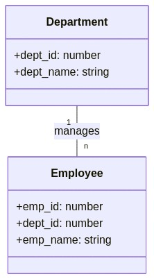
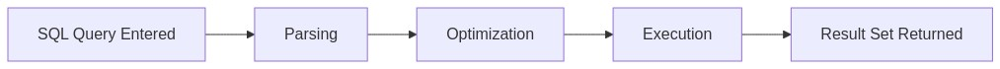
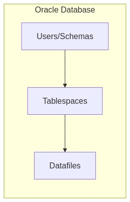
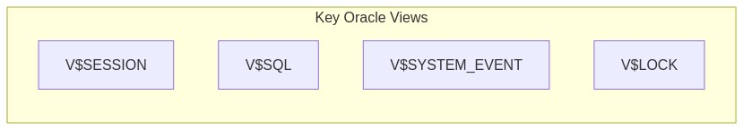

Below is the comprehensive answer sheet for the 20 quiz questions previously generated . Each answer includes an explanation of why the chosen option is correct, why other options are incorrect (for multiple-choice questions), Oracle-specific details, knowledge connections, SRE perspectives, and additional insights. Where diagrams were used in the question, they are repeated for reference; in some answers, additional diagrams are included to further clarify key concepts.

---

## Answer 1: Basic Terminology
🟢 Beginner | Multiple Choice

**Question:**  
Which of the following statements best describes a table in a relational database?

A. A table is an entire database containing multiple schemas and objects.  
B. A table is a collection of rows and columns storing related data.  
C. A table is a single row of data used for auditing purposes.  
D. A table is an Oracle-specific feature that replaces schemas.

**Correct Answer:** B

**Explanation:**  
A table in a relational database is the fundamental data structure that holds rows (records) and columns (attributes). In Oracle, tables are owned by a schema (user) and can be queried or manipulated using SQL. They do not replace schemas nor do they represent the entire database.

**Why other options are incorrect:**
- **Option A:** Describes a database, not a table.  
- **Option C:** A single row is just one record, not an entire table.  
- **Option D:** Tables are a standard feature in all relational databases, not just an Oracle replacement for schemas.

**Oracle Comparison Note:**  
In PostgreSQL and SQL Server, the concept of a table is nearly identical, though some data types and storage mechanisms differ.

**Knowledge Connection:**  
This question connects to the *Relational Database Structure* section of the Day 1 material, emphasizing how tables form the basis of data organization.

**SRE Perspective:**  
Understanding the basic structure of a table is essential for monitoring row growth, disk usage, and performance in production systems.

**Additional Insight:**  
Use `DESCRIBE table_name;` in SQL*Plus or the GUI in SQL Developer to inspect the columns of an Oracle table quickly.

---

## Answer 2: Key Fundamentals
🟢 Beginner | Multiple Choice

**Question:**  
Which characteristic is TRUE of a primary key in Oracle?

A. It allows duplicate values but must be indexed.  
B. It uniquely identifies each row and cannot be NULL.  
C. It can reference itself in the same table.  
D. It can only be numeric.

**Correct Answer:** B

**Explanation:**  
A primary key enforces uniqueness in a column (or set of columns) so that every row can be identified distinctly. Oracle requires that primary key columns cannot contain NULL values, ensuring reliable identification of each row.

**Why other options are incorrect:**
- **Option A:** Primary keys do not allow duplicates.  
- **Option C:** Self-referencing primary keys are uncommon; more often you see foreign keys referencing a primary key, not the primary key referencing itself.  
- **Option D:** Primary key columns can be of various data types (e.g., VARCHAR2, NUMBER), not strictly numeric.

**Oracle Comparison Note:**  
PostgreSQL and SQL Server also require primary keys to be unique and non-null. PostgreSQL often uses `SERIAL` for auto-incrementing numeric primary keys, whereas Oracle generally uses sequences.

**Knowledge Connection:**  
Links to *Primary Keys and Foreign Keys in Oracle*, highlighting how keys maintain data integrity.

**SRE Perspective:**  
A well-defined primary key ensures quick lookups and stable references, crucial for system reliability and efficient troubleshooting.

**Additional Insight:**  
Define primary keys at table creation or using an `ALTER TABLE` statement to enforce data integrity from the start.

---

## Answer 3: Basic SELECT Statement
🟢 Beginner | Multiple Choice

**Question:**  
Which of the following SQL statements retrieves all columns from a table named EMPLOYEES in Oracle?

A. SELECT ALL FROM EMPLOYEES;  
B. SELECT EMPLOYEES.*;  
C. SELECT * FROM EMPLOYEES;  
D. SELECT EMP_ID, EMP_NAME FROM EMPLOYEES;

**Correct Answer:** C

**Explanation:**  
The standard SQL syntax for retrieving all columns from a table is `SELECT * FROM table_name;`. Options A and B are not valid Oracle statements for retrieving all columns, and option D retrieves only two specific columns.

**Why other options are incorrect:**
- **Option A:** `SELECT ALL FROM EMPLOYEES;` is invalid syntax in Oracle.  
- **Option B:** Oracle does not accept `SELECT EMPLOYEES.*` outside of a joined context with an alias (and even then, it’s typically `SELECT e.* FROM employees e;`).  
- **Option D:** Only retrieves two columns, not all columns.

**Oracle Comparison Note:**  
In PostgreSQL and SQL Server, the syntax `SELECT * FROM table_name;` is also valid. The asterisk indicates all columns.

**Knowledge Connection:**  
Relates to the *Basic SQL SELECT Statement* concept, showing the simplest form of a query.

**SRE Perspective:**  
Using `SELECT *` can lead to unnecessary data retrieval and potential performance overhead in large tables. Monitoring query performance is key in production.

**Additional Insight:**  
When performance or clarity matters, avoid `SELECT *` and explicitly list needed columns.

---

## Answer 4: Basic ER Diagram
🟢 Beginner | Multiple Choice | Diagram-Based

**Question:**  
Examine the following simple entity-relationship diagram:

Which statement best describes this relationship?

A. Each Department can have many Employees, and each Employee belongs to one Department.  
B. Each Employee can have many Departments, and each Department belongs to one Employee.  
C. Department and Employee are unrelated tables.  
D. The diagram shows a many-to-many relationship.

**Correct Answer:** A

**Explanation:**  
The notation "1" -- "n" indicates a one-to-many relationship: one Department can manage many Employees, but each Employee belongs to a single Department. This is a common real-world model in HR systems.

**Why other options are incorrect:**
- **Option B:** Reverses the relationship, suggesting each Employee can have many Departments. That’s unusual unless it’s a many-to-many scenario with bridging tables.  
- **Option C:** The diagram clearly shows a relationship.  
- **Option D:** A many-to-many relationship would typically show "m" -- "n" with a linking entity.

**Oracle Comparison Note:**  
Creating this relationship in Oracle typically involves a foreign key from `EMPLOYEE` to `DEPARTMENT`. Other RDBMS behave similarly.

**Knowledge Connection:**  
Connects to *Relational Database Structure* and *Primary/Foreign Keys*, showing how tables relate via a foreign key (`dept_id` in `Employee` referencing `dept_id` in `Department`).

**SRE Perspective:**  
Proper relationships prevent data anomalies and simplify system maintenance. SREs benefit from well-modeled schemas to troubleshoot relational inconsistencies.

**Additional Insight:**  
In Oracle, you can query `ALL_CONSTRAINTS` to confirm the foreign key constraint between these two tables.

**Enhanced Visual Explanation:**  
The "1" indicates a single department record, while "n" indicates multiple employee records referencing that department.

---

## Answer 5: Oracle Tools
🟢 Beginner | Multiple Choice

**Question:**  
Which Oracle tool is a command-line interface used primarily for running SQL commands and PL/SQL blocks?

A. SQL Developer  
B. RMAN  
C. SQL*Plus  
D. Oracle Enterprise Manager (OEM)

**Correct Answer:** C

**Explanation:**  
`SQL*Plus` is a classic Oracle command-line utility for executing SQL statements, PL/SQL blocks, and performing administrative tasks. It has been part of Oracle installations for decades.

**Why other options are incorrect:**
- **Option A:** SQL Developer is a graphical interface, not command-line.  
- **Option B:** RMAN (Recovery Manager) focuses on backup and recovery operations.  
- **Option D:** Oracle Enterprise Manager is a web-based management console.

**Oracle Comparison Note:**  
PostgreSQL has `psql` as a command-line interface, while SQL Server uses `sqlcmd` or `PowerShell` modules.

**Knowledge Connection:**  
Refers to *Oracle-Specific Tools and Techniques*, emphasizing how to connect and manage Oracle databases.

**SRE Perspective:**  
Knowing basic command-line tools is critical for scripting, automation, and quick diagnostics in production environments.

**Additional Insight:**  
`SQL*Plus` can be scripted for batch operations and integrated with shell scripts for automated deployments and checks.

---

## Answer 6: Basic SQL Clauses
🟢 Beginner | Multiple Choice

**Question:**  
In a basic SELECT statement, the FROM clause is used to:

A. Specify the conditions for filtering rows.  
B. Identify the table(s) from which to retrieve data.  
C. Group rows based on common values.  
D. Indicate a new database connection.

**Correct Answer:** B

**Explanation:**  
The `FROM` clause in a SELECT statement defines which table(s) or view(s) the query will access. Without it, the database does not know the data source.

**Why other options are incorrect:**
- **Option A:** Describes the role of the `WHERE` clause.  
- **Option C:** Describes `GROUP BY`.  
- **Option D:** Database connections are handled by connection strings, not the FROM clause.

**Oracle Comparison Note:**  
SQL syntax is similar across Oracle, PostgreSQL, and SQL Server for specifying the table source via `FROM`.

**Knowledge Connection:**  
Builds on the *Basic SQL SELECT Statement* focus, reinforcing fundamental query structure.

**SRE Perspective:**  
Multi-table queries in large environments can be performance-intensive, so SREs monitor how the FROM clause is used with joins and indexes.

**Additional Insight:**  
Always confirm your `FROM` sources when troubleshooting “table not found” or “ambiguous column” errors.

---

## Answer 7: Query Execution Flow
🟢 Beginner | Multiple Choice | Diagram-Based

**Question:**  
Refer to this simplified query execution flow:

Which step ensures the SQL statement is valid and constructs the best plan?

A. Parsing  
B. Optimization  
C. Execution  
D. Result Return

**Correct Answer:** B (Optimization)

**Explanation:**  
During optimization, Oracle’s query optimizer evaluates different execution strategies (e.g., whether to perform a full table scan or use an index range scan) to find the most efficient plan. Parsing checks syntax and semantics, while execution runs the plan.

**Why other options are incorrect:**
- **Option A (Parsing):** Validates syntax but does not construct the best plan; it just checks for correctness.  
- **Option C (Execution):** Executes the plan, not optimizes it.  
- **Option D (Result Return):** Simply sends the result set back to the client.

**Oracle Comparison Note:**  
All major RDBMS have an optimization phase, but each may use different cost models or heuristics.

**Knowledge Connection:**  
Relates directly to *Oracle Performance Monitoring and Execution Plans*, underscoring the importance of query optimization.

**SRE Perspective:**  
SREs must understand optimization to troubleshoot long-running queries. Monitoring query plans helps identify performance bottlenecks.

**Additional Insight:**  
Use `EXPLAIN PLAN` or `DBMS_XPLAN.DISPLAY` in Oracle to see how queries are optimized.

**Enhanced Visual Explanation:**  
The “Optimization” node is where the Cost-Based Optimizer (CBO) applies statistics and transformations to choose an efficient plan.

---

## Answer 8: Foreign Key Constraints
🟡 Intermediate | Multiple Choice

**Question:**  
Which SQL statement creates a foreign key in an Oracle table named ORDERS that references the CUSTOMERS table’s primary key CUSTOMER_ID?

A. ALTER TABLE orders ADD CONSTRAINT fk_cust_id REFERENCES customers(customer_id);  
B. CREATE FOREIGN KEY fk_cust_id ON orders(customer_id) REFERENCES customers(customer_id);  
C. ALTER TABLE orders ADD CONSTRAINT fk_cust_id FOREIGN KEY (customer_id) REFERENCES customers(customer_id);  
D. CREATE TABLE orders FOREIGN KEY fk_cust_id (customer_id) REFERENCES customers(customer_id);

**Correct Answer:** C

**Explanation:**  
In Oracle, you typically use the `ALTER TABLE ... ADD CONSTRAINT <constraint_name> FOREIGN KEY (<column>) REFERENCES <table>(<column>)` syntax to create a foreign key constraint after the table is already created. Option C precisely matches Oracle’s foreign key definition.

**Why other options are incorrect:**
- **Option A:** Missing the `FOREIGN KEY` clause.  
- **Option B:** The keyword `CREATE FOREIGN KEY` is invalid.  
- **Option D:** This syntax is incorrect when adding a foreign key to an existing table.

**Oracle Comparison Note:**  
PostgreSQL and SQL Server use similar `ALTER TABLE` statements for foreign key creation, though some data type matching requirements may differ.

**Knowledge Connection:**  
Links to *Primary Keys and Foreign Keys in Oracle*, emphasizing constraint definitions.

**SRE Perspective:**  
Foreign key constraints ensure referential integrity. In production, improper foreign key definitions can lead to orphan data or referential errors.

**Additional Insight:**  
Always name constraints logically (e.g., `fk_orders_customers`) for easier identification when troubleshooting.

---

## Answer 9: Oracle Database Structure
🟡 Intermediate | Multiple Choice | Diagram-Based

**Question:**  
Examine the following Oracle database structure diagram:

Which of the following statements is correct?

A. A single datafile belongs to multiple tablespaces.  
B. Each tablespace can have one or more datafiles.  
C. Users/Schemas cannot own tables.  
D. Oracle databases do not use tablespaces.

**Correct Answer:** B

**Explanation:**  
In Oracle, a tablespace can consist of one or multiple datafiles. A single datafile cannot span multiple tablespaces, and users/schemas do own tables.

**Why other options are incorrect:**
- **Option A:** Datafiles belong to exactly one tablespace.  
- **Option C:** Schemas (users) do own tables in Oracle.  
- **Option D:** Tablespaces are a core Oracle concept for logical data storage management.

**Oracle Comparison Note:**  
PostgreSQL doesn’t use the same “tablespace” concept by default (though it does support tablespaces at a filesystem level). SQL Server has filegroups.

**Knowledge Connection:**  
Ties to *Oracle Hierarchy Visualization* (schemas, tablespaces, datafiles).

**SRE Perspective:**  
Monitoring tablespace usage and datafile growth is vital to ensure the database does not run out of space, impacting reliability.

**Additional Insight:**  
Use `DBA_DATA_FILES` and `DBA_TABLESPACES` views to check size, status, and auto-extend settings in Oracle.

---

## Answer 10: Table Joins
🟡 Intermediate | Multiple Choice | Diagram-Based

**Question:**  
Analyze the following join diagram:

Which SQL statement best represents this join in Oracle?

A. SELECT * FROM customers, orders;  
B. SELECT * FROM customers JOIN orders ON customers.customer_id = orders.customer_id;  
C. SELECT * FROM customers JOIN orders ON name = order_date;  
D. SELECT * FROM customers FULL JOIN orders;

**Correct Answer:** B

**Explanation:**  
The diagram shows a direct link between `customer_id` in `CUSTOMERS` and `ORDERS`. The correct Oracle syntax for an inner join that matches on these columns is `JOIN ... ON customers.customer_id = orders.customer_id`.

**Why other options are incorrect:**
- **Option A:** Lists both tables but does not specify a JOIN condition. In Oracle, this would be a Cartesian join without a WHERE clause.  
- **Option C:** Uses non-matching columns (`name` and `order_date`).  
- **Option D:** `FULL JOIN` includes unmatched rows from both tables, which is not implied by the diagram.

**Oracle Comparison Note:**  
PostgreSQL and SQL Server syntax for an inner join is the same (`JOIN ... ON ...`). Some older Oracle versions allow the `FROM customers, orders WHERE customers.customer_id = ...`, but the modern ANSI JOIN is preferred.

**Knowledge Connection:**  
Demonstrates the *FROM Clause and Table Selection* plus *Basic SQL SELECT Statement*, specifically multi-table joins.

**SRE Perspective:**  
Incorrect join conditions can produce massive result sets or lead to missing data. SREs monitor query plans to confirm that proper indexes and join strategies are used.

**Additional Insight:**  
Inner joins only return rows where the join condition matches, while outer joins return unmatched rows from one or both tables.

---

## Answer 11: Data Dictionary Views
🟡 Intermediate | True/False

**Question:**  
Statement: The ALL_TABLES view in Oracle shows all the tables in the entire database, regardless of the current user’s privileges.

A. True  
B. False

**Correct Answer:** B (False)

**Explanation:**  
`ALL_TABLES` in Oracle lists all tables **accessible** to the current user (including those owned by other users but granted privileges). To see *all* tables in the database, you would query `DBA_TABLES`. Thus, it does not ignore privileges.

**Oracle Comparison Note:**  
PostgreSQL’s `pg_catalog` schema contains various views showing table metadata, but visibility also depends on privileges. SQL Server has similar metadata views (e.g., `INFORMATION_SCHEMA.TABLES`), also subject to permissions.

**Knowledge Connection:**  
Relates to *Oracle-Specific Tools and Techniques*, where understanding the data dictionary is crucial for daily admin tasks.

**SRE Perspective:**  
Visibility into database objects is essential for diagnosing issues. Knowing how to check table existence and privileges can speed up troubleshooting.

**Additional Insight:**  
`USER_TABLES` shows only those tables owned by the current user; `ALL_TABLES` shows accessible tables; `DBA_TABLES` shows all tables in the database.

---

## Answer 12: Oracle Performance
🟡 Intermediate | True/False

**Question:**  
Statement: The V$SESSION view in Oracle provides details about current active sessions, including user, status, and machine information.

A. True  
B. False

**Correct Answer:** A (True)

**Explanation:**  
`V$SESSION` is a critical performance view containing session-level information (user, machine, status, etc.). Administrators and SREs commonly use it to identify which sessions are active and potentially causing contention.

**Oracle Comparison Note:**  
Neither PostgreSQL nor SQL Server uses the same naming convention. PostgreSQL’s `pg_stat_activity` and SQL Server’s `sys.dm_exec_sessions` offer comparable session data.

**Knowledge Connection:**  
Links to the *Oracle Performance Monitoring and Execution Plans* section, highlighting how to inspect session activity.

**SRE Perspective:**  
Actively monitoring sessions helps detect blocking sessions or runaway queries, which is crucial for maintaining reliability.

**Additional Insight:**  
`V$SESSION` columns like `STATUS`, `USERNAME`, `OSUSER`, and `MACHINE` aid in tracing performance issues to specific applications or users.

---

## Answer 13: SQL Dialect Variations
🟡 Intermediate | True/False

**Question:**  
Statement: In Oracle, the VARCHAR2 data type is functionally identical to VARCHAR2 in PostgreSQL and SQL Server with no differences in behavior or limits.

A. True  
B. False

**Correct Answer:** B (False)

**Explanation:**  
While `VARCHAR2` in Oracle is similar to `VARCHAR` in other systems, there are differences in maximum lengths, character sets, and semantic nuances (e.g., how trailing spaces are handled). Oracle’s `VARCHAR2` also historically differs from `VARCHAR` in some edge-case behaviors.

**Oracle Comparison Note:**  
PostgreSQL typically uses `VARCHAR(n)` or `TEXT`; SQL Server uses `VARCHAR(n)` or `NVARCHAR(n)`. Limits and behaviors vary.

**Knowledge Connection:**  
Ties into *SQL Dialect Comparison* from Day 1, showing Oracle’s unique data type specifics.

**SRE Perspective:**  
When migrating or integrating systems, differences in data types can cause data truncation or errors if not carefully handled.

**Additional Insight:**  
Oracle recommends using `VARCHAR2` rather than `VARCHAR`. `VARCHAR` is retained only for backward compatibility.

---

## Answer 14: SQL WHERE
🟡 Intermediate | Fill-in-the-Blank

**Question:**  
Complete the following statement about the Oracle WHERE clause:

"A WHERE clause is used to ________ the rows returned by a SELECT statement based on specified conditions."

A. rearrange  
B. aggregate  
C. combine  
D. filter  

**Correct Answer:** D – filter

**Explanation:**  
The WHERE clause refines (filters) the result set by selecting only rows that match specified criteria (e.g., `WHERE employee_id = 101`). It does not rearrange, aggregate, or combine rows.

**Why other options are incorrect:**
- **Option A (rearrange):** That describes `ORDER BY`.  
- **Option B (aggregate):** That pertains to functions like SUM, COUNT, not the WHERE clause.  
- **Option C (combine):** Combining datasets is typically done via JOIN or UNION.

**Oracle Comparison Note:**  
In all major RDBMS, the WHERE clause is used for row filtering. Syntax is essentially the same.

**Knowledge Connection:**  
Directly addresses the *WHERE Clause and Basic Filtering* concept.

**SRE Perspective:**  
Effective filtering reduces the load on databases, minimizing unnecessary data retrieval. SREs monitor queries to ensure they use proper WHERE clauses and indexes.

**Additional Insight:**  
Use appropriate indexes on columns often referenced in the WHERE clause for better performance in Oracle.

---

## Answer 15: Execution Plans
🔴 SRE-Level | Fill-in-the-Blank

**Question:**  
Complete the following statement regarding Oracle execution plans:

"In Oracle, ________ indicates that the database is performing a full table scan, which may impact performance for large tables."

A. INDEX RANGE SCAN  
B. TABLE ACCESS (FULL)  
C. NESTED LOOPS  
D. HASH JOIN  

**Correct Answer:** B – TABLE ACCESS (FULL)

**Explanation:**  
`TABLE ACCESS (FULL)` means Oracle is scanning every row of the table, which can be costly for large tables lacking suitable indexes or up-to-date statistics. This is often a red flag for potential performance issues.

**Why other options are incorrect:**
- **Option A:** `INDEX RANGE SCAN` indicates use of an index, usually more efficient.  
- **Option C:** `NESTED LOOPS` is a join method, not a scan type.  
- **Option D:** `HASH JOIN` is another join method, not a scan type.

**Oracle Comparison Note:**  
PostgreSQL might show a similar concept as `Seq Scan` in an `EXPLAIN` plan. SQL Server uses `Table Scan` or `Index Scan/Seek`.

**Knowledge Connection:**  
Relates to *Oracle Performance Monitoring and Execution Plans*, highlighting how to interpret plan output.

**SRE Perspective:**  
SREs watch for full table scans on critical queries to avoid performance degradation.

**Additional Insight:**  
Gathering statistics or creating indexes on frequently queried columns can encourage Oracle to do more selective scans.

---

## Answer 16: Oracle Recovery
🔴 SRE-Level | Fill-in-the-Blank

**Question:**  
Complete the following statement about Oracle recovery tools:

"________ is Oracle’s command-line utility that manages backup, restore, and recovery operations, often used by DBAs and SREs."

A. Data Pump  
B. RMAN  
C. SQL Developer  
D. FLASHBACK  

**Correct Answer:** B – RMAN

**Explanation:**  
`RMAN` (Recovery Manager) is Oracle’s primary utility for managing backups, performing restores, and recovering databases. It is crucial for maintaining database integrity in enterprise environments.

**Why other options are incorrect:**
- **Option A:** Data Pump is for data import/export, not backup/recovery.  
- **Option C:** SQL Developer is a graphical SQL and PL/SQL tool.  
- **Option D:** FLASHBACK is a feature/technology, not a general-purpose backup/recovery utility.

**Oracle Comparison Note:**  
PostgreSQL uses tools like `pg_dump` and `pg_restore`; SQL Server uses `BACKUP` and `RESTORE` commands.

**Knowledge Connection:**  
Part of *Oracle Recovery Techniques* from the Day 1 module, focusing on SRE-level knowledge of backups.

**SRE Perspective:**  
Having a robust backup and recovery strategy is vital for resiliency. RMAN scripts are often automated and monitored.

**Additional Insight:**  
RMAN can work with Oracle’s catalog or control files for tracking backups. Always test your RMAN restore procedures regularly.

---

## Answer 17: Matching Oracle Views
🔴 SRE-Level | Matching | Diagram-Based

**Question:**  
Match each Oracle performance view in Column A to its description in Column B.

Column A:  
1. V$SESSION  
2. V$SQL  
3. V$SYSTEM_EVENT  
4. V$LOCK  

Column B:  
A. Tracks various lock information and blocking sessions  
B. Captures all SQL statements in the shared pool  
C. Displays wait event statistics across the system  
D. Shows details of currently active database sessions  

**Correct Matches:**  
1 – D  
2 – B  
3 – C  
4 – A  

**Explanation:**  
- **V$SESSION** details current user sessions and related info.  
- **V$SQL** stores SQL statements cached in the shared pool.  
- **V$SYSTEM_EVENT** displays system-wide wait events.  
- **V$LOCK** indicates the locks held by sessions and can reveal blocking.

**Oracle Comparison Note:**  
Other RDBMS also have performance views or system catalogs, but naming is different. PostgreSQL uses views in `pg_catalog`, while SQL Server uses `sys.dm_...` views.

**Knowledge Connection:**  
Directly correlates to the *Oracle Performance Monitoring and Execution Plans* section, offering an SRE-level understanding of system views.

**SRE Perspective:**  
SREs use these views to diagnose contention, identify heavy SQL, and monitor database wait events.

**Additional Insight:**  
Combining these views with real-time monitoring tools (like OEM or third-party solutions) offers a holistic performance picture.

---

## Answer 18: Matching Constraints
🔴 SRE-Level | Matching

**Question:**  
Match each constraint type in Column A with its description in Column B.

Column A:  
1. PRIMARY KEY  
2. FOREIGN KEY  
3. UNIQUE  
4. CHECK  

Column B:  
A. Ensures values in a column or set of columns must match rows in another table  
B. Restricts inserted data to values that fulfill a given condition  
C. Guarantees every row in a column (or columns) is unique  
D. Identifies each row in a table uniquely and disallows NULL  

**Correct Matches:**  
1 – D  
2 – A  
3 – C  
4 – B  

**Explanation:**  
- **PRIMARY KEY**: Uniquely identifies each row, cannot be NULL.  
- **FOREIGN KEY**: References a column in another table for referential integrity.  
- **UNIQUE**: No duplicated values are allowed in that column.  
- **CHECK**: Ensures data meets a specified condition (e.g., salary > 0).

**Oracle Comparison Note:**  
Constraint concepts are largely the same across major RDBMS, although syntax for creation may vary slightly.

**Knowledge Connection:**  
Ties to *Primary Keys and Foreign Keys in Oracle*, highlighting all main constraint types.

**SRE Perspective:**  
Proper constraints reduce data corruption and simplify error detection. Without constraints, SREs face more data inconsistency issues.

**Additional Insight:**  
Use `ALL_CONSTRAINTS` and `ALL_CONS_COLUMNS` to examine constraints in Oracle. Named constraints help with troubleshooting.

---

## Answer 19: Oracle Troubleshooting
🔴 SRE-Level | Ordering

**Question:**  
Arrange the following steps in the correct order when troubleshooting a slow query in Oracle:

A. Examine the execution plan via EXPLAIN PLAN or DBMS_XPLAN  
B. Identify the SQL statement causing slow performance (e.g., from V$SQL)  
C. Gather statistics or create indexes to optimize performance  
D. Verify if the query is performing a full table scan  

**Correct Order:** B, A, D, C

1. **Identify the SQL statement** causing the issue (via V$SQL).  
2. **Examine the execution plan** to see how Oracle intends to run the query.  
3. **Verify if the query is performing a full table scan** or other expensive operations within the plan.  
4. **Gather statistics or create indexes** (if needed) to improve the plan.

**Explanation:**  
A logical troubleshooting flow first identifies the problematic SQL, examines the plan, checks for inefficiencies like full table scans, and finally applies fixes or optimizations.

**Oracle Comparison Note:**  
PostgreSQL uses `EXPLAIN (ANALYZE)`, while SQL Server uses `SET SHOWPLAN` or “Actual Execution Plans” in SSMS. The flow is conceptually similar.

**Knowledge Connection:**  
Builds on *Oracle Performance Monitoring and Execution Plans*, linking to real-world SRE problem-solving.

**SRE Perspective:**  
This step-by-step approach ensures methodical resolution of performance problems. System reliability depends on consistent query response times.

**Additional Insight:**  
After making changes (e.g., adding indexes), rerun `EXPLAIN PLAN` or `DBMS_XPLAN.DISPLAY` to verify improvements.

---

## Answer 20: Oracle Flashback
🔴 SRE-Level | Ordering

**Question:**  
Arrange the following steps to perform an Oracle Flashback Table operation:

A. Confirm Flashback is enabled for the database  
B. Issue the FLASHBACK TABLE command to the desired point in time  
C. Identify the SCN (System Change Number) or timestamp for the restore point  
D. Validate that the table data has been restored correctly  

**Correct Order:** A, C, B, D

1. **Confirm Flashback is enabled** for the database.  
2. **Identify the SCN or timestamp** to which you want to revert.  
3. **Issue the FLASHBACK TABLE command** to perform the actual recovery.  
4. **Validate the table data** to ensure correctness post-flashback.

**Explanation:**  
Flashback operations require the database to have flashback logging enabled. Once you have the SCN or a suitable timestamp, you can run the `FLASHBACK TABLE` command. Verification ensures the recovery was successful and consistent.

**Oracle Comparison Note:**  
PostgreSQL and SQL Server do not offer a direct equivalent of Oracle’s Flashback technology. Point-in-time recovery in those systems is typically done via backups and WAL/transaction log replay.

**Knowledge Connection:**  
Refers to *Oracle Recovery Techniques* (Flashback, RMAN) at the SRE tier, showcasing advanced undo-based features.

**SRE Perspective:**  
Flashback can significantly reduce Mean Time to Recovery (MTTR) for accidental data modifications, enhancing reliability and reducing downtime.

**Additional Insight:**  
Granting the necessary privileges (e.g., `FLASHBACK ANY TABLE`) to trusted DBAs or SREs is crucial for quick incident resolution.

---

### Final Notes

Each answer above is rooted in Day 1 materials covering Oracle relational database fundamentals, from basic table structures to advanced SRE-level performance and recovery considerations. The explanations not only clarify correct and incorrect choices but also provide extra insights to solidify understanding and practical application in real-world Oracle environments.