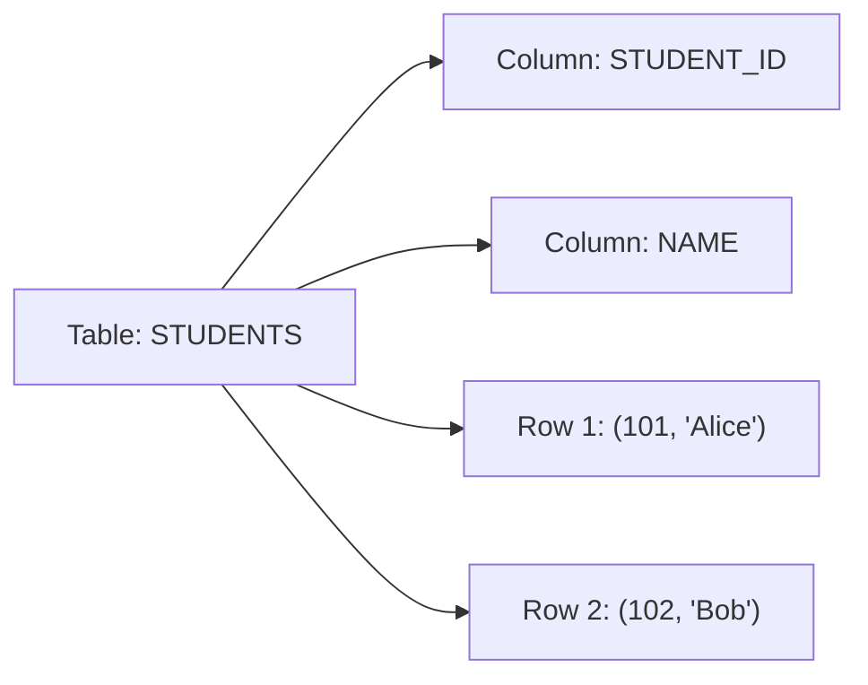
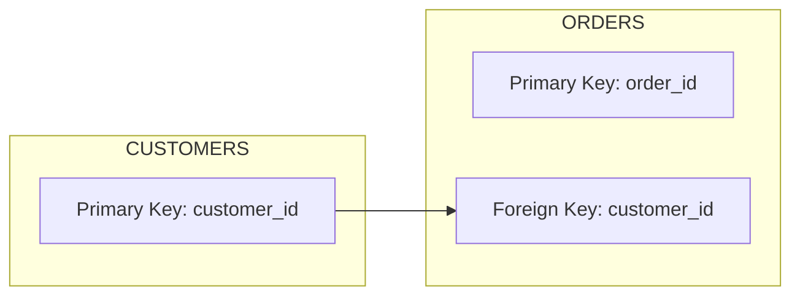
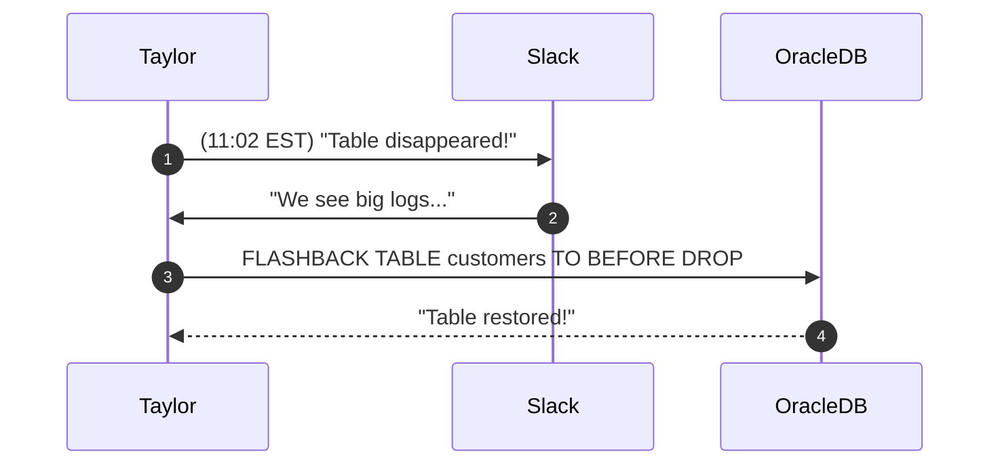

# 🔑 SRE Database Training Module - Day 1: **Answer Sheet**

## (🔍) Beginner-Level Questions (1–7)

---

## **Answer 1: Relational Database Structure**
🔍 Beginner | Multiple Choice

**Question (Q1) citeturn0file0**  
Taylor often compares an **Oracle table** to a spreadsheet. In her analogy, which part of the spreadsheet best matches an **Oracle table’s columns**?

A. Individual row entries  
B. The sheet’s name  
C. The headings (field names) on top  
D. The entire set of worksheets  

**Correct Answer:** C. The headings (field names) on top

**Explanation:**  
- In Taylor’s spreadsheet analogy, an Oracle table’s columns correspond to the **headings** across the top row of a spreadsheet. Each heading describes what type of data goes into a given column (e.g., student ID, name, etc.).  
- Columns in Oracle store specific attributes (like a “Name” column), similar to how column headers in a spreadsheet describe each column’s data.  
- This parallels the structure: a column heading in Excel is akin to the column definition in a database table (e.g., VARCHAR2(50), NUMBER, etc.).

**Why other options are incorrect:**  
- **(A)** Row entries (like an individual’s data) are more comparable to a single record, not the column definition.  
- **(B)** The sheet’s name might be analogous to the table name, not the columns.  
- **(D)** The entire set of worksheets is more akin to multiple database tables or an entire schema.

**Oracle Comparison Note:**  
- Most relational databases—Oracle, PostgreSQL, SQL Server—draw the same analogy between columns and spreadsheet headings. The data type definitions in Oracle (e.g., VARCHAR2, NUMBER) can differ from types in PostgreSQL (VARCHAR, NUMERIC) or SQL Server (VARCHAR, INT).

**Knowledge Connection:**  
- Day 1 teaching references the spreadsheet analogy to clarify table design.  
- Taylor realized well-defined column headings are crucial for clarity and structure.

**SRE Perspective:**  
- Proper understanding of column definitions ensures the correct data is captured and helps with diagnosing anomalies. If you treat columns carelessly, you may face major data consistency issues down the road.

**Additional Insight:**  
- Always define columns with appropriate data types and constraints—this is part of “building the foundation right” for stable, high-performing databases.

---

## **Answer 2: Keys and Constraints**
🔍 Beginner | Multiple Choice

**Question (Q2) citeturn0file0**  
In Taylor’s “driver’s license” analogy for **primary keys**, which statement best reflects the meaning of a **PK**?

A. It’s the only numeric column in the table  
B. It ensures each row has a unique identifier  
C. It can be null or duplicated freely  
D. It’s a foreign reference to another table’s ID  

**Correct Answer:** B. It ensures each row has a unique identifier

**Explanation:**  
- A primary key (PK) is like a driver’s license number: it’s unique to each individual and cannot be duplicated.  
- Taylor uses this analogy to emphasize that a PK allows you to distinguish every row uniquely (like every citizen being identified by their unique driver’s license ID).  
- In Oracle, the PK is typically enforced through both a unique constraint and a not-null constraint.

**Why other options are incorrect:**  
- **(A)** The PK does not have to be numeric—Oracle can use VARCHAR2 or other data types as PK.  
- **(C)** A PK must **not** be null or duplicated; that violates the whole concept of uniqueness.  
- **(D)** A foreign key references another table’s PK, not the other way around.

**Oracle Comparison Note:**  
- PostgreSQL and SQL Server also require PK columns to be unique and not null. The method of defining these constraints is slightly different in syntax but functionally similar.

**Knowledge Connection:**  
- Day 1’s coverage of constraints emphasizes that the PK is the main anchor of a table. Taylor’s real-world fiasco with 200 “John Doe” entries underscores the need for a real PK.

**SRE Perspective:**  
- From an SRE viewpoint, having a solid PK ensures reliability in data retrieval, reduces confusion during incidents, and speeds up queries when indexing is involved.

**Additional Insight:**  
- Always check that your PK has a well-thought-out naming convention (e.g., tablename_id). Consistent naming helps SREs quickly identify relationships during troubleshooting.

---

## **Answer 3: Basic SQL (SELECT, FROM, WHERE)**
🔍 Beginner | True/False

**Question (Q3) citeturn0file0**  
Taylor warns about using **`SELECT *`**. True or false: `SELECT *` is generally harmless for performance since it’s a simple command that never impacts query speed on large tables.

A. True  
B. False  

**Correct Answer:** B. False

**Explanation:**  
- `SELECT *` **can** cause performance issues on large tables, because the database engine retrieves **all columns** for **all rows**, potentially incurring unnecessary I/O.  
- Taylor specifically warns that specifying only the needed columns is more efficient, especially if the table is large or has wide rows.  
- Pulling back 20 unnecessary columns can significantly slow down queries, consume more network bandwidth, and stress the buffer cache.

**Oracle Comparison Note:**  
- This is true across most SQL dialects (Oracle, PostgreSQL, SQL Server). Only select the columns you need to optimize performance.

**Knowledge Connection:**  
- Day 1 training highlights “Pro tip: specifying columns is your friend if you value performance.”  
- By referencing the potential overhead, Taylor underscores that “SELECT *” is often discouraged in production systems.

**SRE Perspective:**  
- Minimizing resource usage is essential for reliability. Overly large queries can degrade performance for all other workloads, causing system instability.

**Additional Insight:**  
- Use `EXPLAIN PLAN` (in Oracle) or equivalent in other DBMS to see how “SELECT *” might lead to full table scans or overhead.

---

## **Answer 4: Oracle Table Structure**
🔍 Beginner | Multiple Choice (Diagram-Based)

**Question (Q4) citeturn0file0**  
Look at the **Mermaid diagram** referencing a sample table:



Which action aligns with Taylor’s approach to verifying data in this table?

A. Running `DELETE FROM STUDENTS` with no `WHERE` clause  
B. Issuing a `SELECT * FROM students;` to see all rows  
C. Creating a second table with the same name and columns  
D. Dropping the table without a backup  

**Correct Answer:** B. Issuing a `SELECT * FROM students;` to see all rows

**Explanation:**  
- To verify data, Taylor often runs a simple `SELECT` statement to confirm that the rows (e.g., Alice and Bob) are present and accurate.  
- While `SELECT *` is discouraged for huge, production-scale queries, it is perfectly valid to verify a small table’s data or in a development scenario.  
- The other actions either destroy or duplicate data in risky ways (i.e., dropping a table without backup or deleting all rows).

**Why other options are incorrect:**  
- **(A)** `DELETE FROM STUDENTS` with no `WHERE` clause will remove all records—definitely not a “check.”  
- **(C)** Creating a duplicate table can confuse future queries if done arbitrarily.  
- **(D)** Dropping the table without a backup could be disastrous.

**Oracle Comparison Note:**  
- The general approach is consistent across Oracle, PostgreSQL, and SQL Server. Checking data usually starts with a `SELECT` statement.

**Knowledge Connection:**  
- Day 1 highlights verifying data after insert or table creation. This question references the diagram with rows 101, 102 for “Alice,” “Bob.”

**SRE Perspective:**  
- A quick check with a simple `SELECT` is a crucial first step in any incident or sanity check to ensure the table is populated as expected.

**Additional Insight:**  
- If verifying large production tables, consider specifying columns or adding a `WHERE` clause to reduce overhead.

**Visual Explanation:**  
*(Diagram from the question already illustrates the STUDENTS table. No further diagram needed.)*

---

## **Answer 5: Keys & Constraints**
🔍 Beginner | Matching

**Question (Q5) citeturn0file0**  
Match each item from Column A to its best definition in Column B.

Column A:  
1. Primary Key  
2. Foreign Key  
3. Constraint  
4. Oracle Synonym  

Column B:  
A. References a PK in another table to enforce relational integrity  
B. Unique identifier for each row, can’t be null or duplicated  
C. Alias for an Oracle object, used for cross-schema references  
D. A seat belt that prevents data from going rogue  

**Correct Matches:**

1 → B  
2 → A  
3 → D  
4 → C  

**Explanation:**  
- **(1 → B) Primary Key** is that unique row identifier, can’t be null or duplicated.  
- **(2 → A) Foreign Key** references another table’s PK to enforce relational integrity.  
- **(3 → D) Constraint** is like a “seat belt” preventing invalid data (e.g., enforcing uniqueness, not null).  
- **(4 → C) Oracle Synonym** is an alias for Oracle objects, helping with cross-schema references or simpler naming.

**Oracle Comparison Note:**  
- PostgreSQL, SQL Server have the same concept of PKs, FKs, and constraints, though synonyms are more Oracle-specific. SQL Server has synonyms too, but usage differs slightly.

**Knowledge Connection:**  
- Day 1’s coverage of constraints highlights the “seat belt for data” analogy.  
- Taylor’s foreign key analogy was “hotel check-in,” ensuring only valid references.

**SRE Perspective:**  
- Proper constraints reduce data anomalies and expedite incident resolution. With constraints in place, you spend less time fixing data corruption during an on-call emergency.

**Additional Insight:**  
- Synonyms are especially handy for simplifying cross-schema references or centralizing object names. They can ease the overhead of referencing long schema.table names.

---

## **Answer 6: Basic SQL**
🔍 Beginner | Fill-in-the-Blank

**Question (Q6) citeturn0file0**  
> When you run a large `SELECT` query, specify the ________ you need instead of using `SELECT *`, which can degrade performance on big tables.

**Correct Answer:** **columns** (or “specific columns”)

**Explanation:**  
- The key emphasis is on selecting only the **columns** needed. Using `SELECT *` can degrade performance on large datasets by bringing back unnecessary data.  
- Taylor stresses that an SRE or DBA must always keep performance implications in mind.

**Oracle Comparison Note:**  
- Same best practice in all SQL databases. The principle of retrieving minimal required data is universal.

**Knowledge Connection:**  
- Ties back to Day 1’s theme: “Pro tip: specifying columns is your friend if you value performance.”

**SRE Perspective:**  
- Minimizing resource usage helps maintain system stability and reduces the chance of triggering performance alerts in monitoring systems.

**Additional Insight:**  
- Not only does specifying columns help with performance, it also reduces confusion and fosters clarity in code reviews and debugging.

---

## **Answer 7: Oracle Tools & Data Dictionary**
🔍 Beginner | Multiple Choice

**Question (Q7) citeturn0file0**  
Taylor discovered **SQL\*Plus** as a quick script runner. Which other **Oracle** tool did she call her “GUI friend” with object browsing and debugging capabilities?

A. Oracle Data Pump  
B. SQL Developer  
C. Oracle Enterprise Manager (OEM)  
D. RMAN  

**Correct Answer:** B. SQL Developer

**Explanation:**  
- Taylor specifically refers to **SQL Developer** as her “GUI friend” because it provides a user-friendly interface, browsing of database objects, and basic debugging.  
- Data Pump is for import/export, RMAN is for backup/recovery, and OEM is more for overall management and monitoring dashboards.

**Why other options are incorrect:**  
- **(A)** Data Pump is used to move data between Oracle databases.  
- **(C)** OEM is a web-based enterprise manager, less of a direct “GUI developer” environment.  
- **(D)** RMAN is for backups/restores.

**Oracle Comparison Note:**  
- In PostgreSQL, an equivalent might be pgAdmin or DBeaver. SQL Server has SSMS (SQL Server Management Studio).

**Knowledge Connection:**  
- Day 1 explains the differences between Oracle tools. Taylor likes SQL Developer for its user-friendly approach, contrasting with command-line SQL\*Plus.

**SRE Perspective:**  
- A GUI tool can rapidly speed up day-to-day investigations for an SRE. However, knowledge of command-line tools (like SQL\*Plus) remains crucial for scripted automation.

**Additional Insight:**  
- SQL Developer can also connect to other DBMS flavors with JDBC drivers, though it’s primarily for Oracle.

---

## (🧩) Intermediate-Level Questions (8–14)

---

## **Answer 8: Compare Oracle to Other SQL Dialects**
🧩 Intermediate | Multiple Choice

**Question (Q8) citeturn0file0**  
Taylor wants to see if Oracle syntax differs from PostgreSQL and SQL Server. Which **CREATE TABLE** snippet is most typical of **Oracle**?

A. `CREATE TABLE test (id SERIAL, name VARCHAR(50));`  
B. `CREATE TABLE test (id NUMBER, name VARCHAR2(50));`  
C. `CREATE TABLE test (id INT IDENTITY, name VARCHAR(50));`  
D. `CREATE TABLE test (id INT AUTO_INCREMENT, name VARCHAR(50));`  

**Correct Answer:** B. `CREATE TABLE test (id NUMBER, name VARCHAR2(50));`

**Explanation:**  
- Oracle typically uses `NUMBER` for numeric fields and `VARCHAR2` for string fields.  
- PostgreSQL syntax might use `SERIAL` (option A) for auto-increment columns; SQL Server uses `IDENTITY` (option C). MySQL commonly uses `AUTO_INCREMENT` (option D).

**Why other options are incorrect:**  
- **(A)** `SERIAL` is a PostgreSQL-specific keyword.  
- **(C)** `IDENTITY` is primarily SQL Server’s auto-increment method.  
- **(D)** `AUTO_INCREMENT` is MySQL syntax.

**Oracle Comparison Note:**  
- The question itself highlights the differences. Oracle does not have “SERIAL” or “AUTO_INCREMENT”; it typically uses sequences or identity columns (in newer versions) but the main data types remain `NUMBER`, `VARCHAR2`.

**Knowledge Connection:**  
- Day 1 includes Taylor’s first foray into Oracle’s data types, noticing it’s different from other SQL dialects she has encountered.

**SRE Perspective:**  
- Understanding dialect differences is important when you manage multiple DB systems. During an outage, mixing dialect-specific commands in the wrong environment is a common mistake.

**Additional Insight:**  
- In modern Oracle (12c+), you can define a table with an identity column (`GENERATED ALWAYS AS IDENTITY`), but `NUMBER` and `VARCHAR2` remain the base types.

---

## **Answer 9: Setting Up PK & FK**
🧩 Intermediate | Multiple Choice (Diagram-Based)

**Question (Q9) citeturn0file0**  
Taylor used a **Mermaid diagram** showing two tables, `CUSTOMERS` and `ORDERS`, with a PK-FK link:



Which Oracle statement properly defines a **foreign key** referencing `customer_id`?

A. `ALTER TABLE customers ADD FOREIGN KEY (customer_id) REFERENCES orders(order_id);`  
B. `ALTER TABLE orders ADD CONSTRAINT fk_customer FOREIGN KEY (customer_id) REFERENCES customers(customer_id);`  
C. `CREATE TABLE customers (customer_id FOREIGN KEY, name VARCHAR2(50));`  
D. `DROP TABLE customers CASCADE;`  

**Correct Answer:** B.  
```sql
ALTER TABLE orders 
  ADD CONSTRAINT fk_customer 
  FOREIGN KEY (customer_id) 
  REFERENCES customers(customer_id);
```

**Explanation:**  
- In Oracle, if you want `ORDERS` to reference `CUSTOMERS`, you must define the foreign key on the child table (`ORDERS`) pointing to the primary key of the parent (`CUSTOMERS`).  
- The SQL syntax includes `ADD CONSTRAINT ... FOREIGN KEY (child_col) REFERENCES parent(col)`.

**Why other options are incorrect:**  
- **(A)** This tries to create a FK in `customers`, referencing `orders`—the opposite of the diagram’s relationship.  
- **(C)** This snippet would incorrectly embed the `FOREIGN KEY` definition in the customers table creation, which doesn’t match the diagram.  
- **(D)** `DROP TABLE customers CASCADE;` deletes the entire table with no direct relation to setting a foreign key.

**Oracle Comparison Note:**  
- PostgreSQL and SQL Server define FKs similarly; the child references the parent. Only the exact syntax for constraints differs slightly.

**Knowledge Connection:**  
- Day 1 underscores that a foreign key enforces referential integrity—like the “hotel check-in” analogy, ensuring that each “order” must have a valid “customer.”

**SRE Perspective:**  
- FK constraints maintain data consistency. Without them, you risk orphaned records that complicate system reliability and cause confusion during downtime analysis.

**Additional Insight:**  
- Remember to name your constraints meaningfully (e.g., `fk_customer`) so they’re easy to identify in logs or in data dictionary views.

**Visual Explanation:**  
- The provided Mermaid diagram already shows the PK–FK relationship with an arrow from `CUSTOMERS`’ PK to `ORDERS`’ FK.

---

## **Answer 10: Data Dictionary & Troubleshooting**
🧩 Intermediate | True/False

**Question (Q10) citeturn0file0**  
Day 1 material states that **`ALL_TABLES`** and **`ALL_CONSTRAINTS`** are accessible to any user by default, no special privileges required. True or false?

A. True  
B. False  

**Correct Answer:** B. False

**Explanation:**  
- Generally, `ALL_TABLES` and `ALL_CONSTRAINTS` show objects **you** have privileges on, not literally every table in the database. You do need the proper privileges or ownership to see certain information.  
- The notion that “no special privileges are required at all” is misleading. You can access info about objects in your schema or for which you have rights, but not everything if you lack privileges.

**Oracle Comparison Note:**  
- PostgreSQL, SQL Server have similar system catalogs or information_schema, often requiring permission to read schema metadata beyond your own.

**Knowledge Connection:**  
- Day 1 discusses the difference between `ALL_` and `DBA_` views. `DBA_` views truly require DBA privileges, but even some `ALL_` views can be restricted.

**SRE Perspective:**  
- Knowing your privileges on system metadata is crucial when debugging a production issue at 3 AM. You might not see certain tables or constraints if you lack the right grants.

**Additional Insight:**  
- If you need broader visibility, your DBA can grant additional rights or create synonyms.

---

## **Answer 11: Oracle Errors & Troubleshooting**
🧩 Intermediate | Multiple Choice

**Question (Q11) citeturn0file0**  
Taylor encountered the dreaded “**ORA-00942: table or view does not exist**.” Which reason is **most** likely from the day’s training?

A. The table is locked by the system admin  
B. The user is referencing the wrong schema or missing synonyms  
C. Oracle replaced the table with a temp table automatically  
D. The Oracle logs are full, preventing query execution  

**Correct Answer:** B. The user is referencing the wrong schema or missing synonyms

**Explanation:**  
- “ORA-00942” typically means you either used the wrong schema prefix or don’t have the synonyms/permissions to see the object.  
- From Day 1, Taylor realized she was looking in the wrong place or forgot to create synonyms when referencing a table in another schema.

**Why other options are incorrect:**  
- **(A)** A locked table typically throws a different error (e.g., lock/timeout errors).  
- **(C)** Oracle doesn’t just swap a user table with a temp table automatically.  
- **(D)** Full logs do not prevent standard query execution.

**Oracle Comparison Note:**  
- Other SQL dialects have similar “relation does not exist” or “object not found” errors that usually indicate referencing a table not in your current search path.

**Knowledge Connection:**  
- Day 1 mentions synonyms and schema referencing. “Table or view does not exist” is commonly a schema or permission issue.

**SRE Perspective:**  
- During an on-call incident, verifying that you have the correct schema reference is step one to eliminating false alarms.

**Additional Insight:**  
- Creating a public or private synonym or using the fully qualified name (e.g., `some_schema.customers`) can resolve “ORA-00942” quickly.

---

## **Answer 12: Oracle Tools**
🧩 Intermediate | Fill-in-the-Blank

**Question (Q12) citeturn0file0**  
Taylor described **SQL\*Plus** as the command-line tool. She also uses **____** for **Oracle**—the “GUI with object browsing and debugging”:

**Correct Answer:** **SQL Developer**

**Explanation:**  
- SQL Developer is Oracle’s official GUI tool for exploring schema objects, debugging PL/SQL, and running queries in a more visual environment.  
- Taylor calls it her “GUI friend,” contrasting with the command-line style of SQL\*Plus.

**Oracle Comparison Note:**  
- Other databases have GUI tools like pgAdmin (PostgreSQL) or SSMS (SQL Server Management Studio).

**Knowledge Connection:**  
- We see repeated emphasis in Day 1 that tools like SQL Developer are helpful for learning and quick visual checks.

**SRE Perspective:**  
- GUI tools can speed up certain tasks, but SREs should still master CLI tools (like SQL\*Plus or scripts) for automation and headless environments.

**Additional Insight:**  
- SQL Developer also provides PL/SQL debugging, version control integration, and data modeler plugins if you need advanced features.

---

## **Answer 13: Data Dictionary Views & Their Purpose**
🧩 Intermediate | Matching

**Question (Q13) citeturn0file0**  
Column A (views or features):  
1. `ALL_TABLES`  
2. `ALL_CONSTRAINTS`  
3. `DBA_TABLES`  
4. “table not found” error  

Column B (explanations):  
A. Typically means you’re referencing the wrong schema or no synonyms exist  
B. Lists your accessible constraints (PK, FK, etc.)  
C. For actual DBAs, shows all tables in the entire database  
D. Provides a list of tables you can see as a normal user  

**Correct Matches:**

1 → D  
2 → B  
3 → C  
4 → A  

**Explanation:**  
- **(1 → D)** `ALL_TABLES` shows the tables you can access as a normal user or have privileges on.  
- **(2 → B)** `ALL_CONSTRAINTS` shows your accessible constraints (PK, FK, check, etc.).  
- **(3 → C)** `DBA_TABLES` is for DBAs, showing all tables in the entire database.  
- **(4 → A)** “table not found” is typically referencing the wrong schema or a missing synonym.

**Oracle Comparison Note:**  
- The concept of user-level vs. DBA-level metadata views is similar across DBs, though naming differs (PostgreSQL uses catalogs like `pg_tables`; SQL Server uses `sys.tables`).

**Knowledge Connection:**  
- Ties directly to Taylor’s Day 1 notes about different dictionary views and common errors from referencing the wrong schema.

**SRE Perspective:**  
- Quickly checking `ALL_TABLES` or `ALL_CONSTRAINTS` is an important step in diagnosing schema issues under time pressure.

**Additional Insight:**  
- If you need to see **all** database objects in Oracle, you use the `DBA_` views and must have the DBA or SELECT_CATALOG_ROLE privileges.

---

## **Answer 14: Troubleshooting Flow**
🧩 Intermediate | Ordering

**Question (Q14) citeturn0file0**  
Arrange these steps from Taylor’s **“I have no idea what’s wrong”** approach in the correct sequence:

A. Check logs or error codes  
B. Validate constraints or synonyms  
C. Use `ALL_TABLES` or dictionary to confirm table references  
D. Resolve final data insertion approach  

**Correct Order:** **A, C, B, D**

1. **(A) Check logs or error codes** – Always start by examining the Oracle logs or the error message to know what you’re dealing with.  
2. **(C) Use `ALL_TABLES` or dictionary to confirm table references** – Confirm the object actually exists in the expected schema.  
3. **(B) Validate constraints or synonyms** – If the table is found, next ensure that constraints or synonyms aren’t causing the problem (such as “table not found” or referencing the wrong schema).  
4. **(D) Resolve final data insertion approach** – After verifying references and constraints, finalize how you insert or fix the data.

**Explanation:**  
- This sequence mirrors how Taylor systematically narrows down the cause of an unknown error—first checking logs, then verifying the table is present, then ensuring constraints/synonyms are correct, and finally proceeding with the data fix.

**Oracle Comparison Note:**  
- Troubleshooting in PostgreSQL or SQL Server follows a similar approach: check system logs, verify object existence, confirm constraints, and implement the fix.

**Knowledge Connection:**  
- Day 1 includes a scenario where Taylor digs through logs, dictionary views, and constraints to find out why she can’t insert data.

**SRE Perspective:**  
- A structured troubleshooting method prevents random guesswork under pressure, reducing the mean time to repair (MTTR).

**Additional Insight:**  
- Keeping a documented playbook of these steps is invaluable when different team members respond to on-call incidents.

---

## (💡) Advanced/SRE-Level Questions (15–20)

---

## **Answer 15: Monitoring & Execution Plans**
💡 Advanced | Multiple Choice

**Question (Q15) citeturn0file0**  
Taylor used `EXPLAIN PLAN` to detect **TABLE ACCESS (FULL)** on a big table. She concluded an **index** might help. Which scenario could justify a **full table scan** anyway?

A. The table is massive, so scanning is inevitable  
B. The table is small or the query must read nearly all rows  
C. The index was dropped permanently  
D. Oracle no longer supports indexing for large tables  

**Correct Answer:** B. The table is small or the query must read nearly all rows

**Explanation:**  
- Even with indexes available, if a table is **tiny** or the query needs most of the rows, a full table scan can be more efficient than using the index.  
- Oracle’s Cost-Based Optimizer decides if scanning the entire table is cheaper than jumping through an index multiple times.

**Why other options are incorrect:**  
- **(A)** The table’s size alone does not always mandate a full scan—an index may still be beneficial.  
- **(C)** This scenario is possible, but it doesn’t “justify” the full scan in the typical sense of a cost-based decision; it just means your index is missing.  
- **(D)** Oracle absolutely supports indexing large tables.

**Oracle Comparison Note:**  
- Similar logic is used by PostgreSQL, SQL Server: the optimizer weighs whether it’s cheaper to do an index scan or a full table scan.

**Knowledge Connection:**  
- Day 1’s coverage of `EXPLAIN PLAN` references the presence of TABLE ACCESS (FULL).  
- Taylor realized that not all “full scans” are automatically bad.

**SRE Perspective:**  
- SREs often look at queries that do table scans under heavy load. But sometimes, the best approach is indeed a full scan if the query is returning almost all rows anyway.

**Additional Insight:**  
- If your query selects 80% or more of the rows, an index might offer negligible benefit; the optimizer frequently chooses a full table scan.

---

## **Answer 16: Oracle Performance Views**
💡 Advanced | Multiple Choice

**Question (Q16) citeturn0file0**  
Which pair best matches Taylor’s approach to checking performance hogs?

A. `DBA_TABLES` for top queries, `ALL_CONSTRAINTS` for CPU usage  
B. `V$SESSION` for active sessions, `V$SQL` for top statements in shared pool  
C. `SQL*Plus` for constraints, `SQL Developer` for indexing details  
D. `SELECT * FROM orders` to see locks, `SELECT * FROM synonyms` to see concurrency  

**Correct Answer:** B. `V$SESSION` for active sessions, `V$SQL` for top statements in shared pool

**Explanation:**  
- Taylor specifically references the dynamic performance views:  
  - **`V$SESSION`** shows connected sessions and their current activity.  
  - **`V$SQL`** provides details on SQL statements in the shared pool, letting you identify the “top” resource-consuming queries.  
- These are key for diagnosing performance bottlenecks or identifying high-CPU queries.

**Why other options are incorrect:**  
- **(A)** `DBA_TABLES` doesn’t show top queries; it lists table metadata. `ALL_CONSTRAINTS` doesn’t show CPU usage.  
- **(C)** Tools like SQL*Plus or SQL Developer are just interfaces; they don’t directly show CPU usage or “top queries.”  
- **(D)** `SELECT * FROM orders` or `SELECT * FROM synonyms` do not yield meaningful concurrency or performance data.

**Oracle Comparison Note:**  
- Other DBMS have equivalent system tables or views for sessions and query stats. E.g., PostgreSQL has `pg_stat_activity`, SQL Server has `sys.dm_exec_query_stats`.

**Knowledge Connection:**  
- Day 1’s advanced notes mention `V$SESSION` and `V$SQL` for performance and statement analysis.

**SRE Perspective:**  
- Monitoring live sessions and top queries is crucial for diagnosing slowdowns or lock issues. These views are prime real estate for performance monitoring scripts.

**Additional Insight:**  
- Pairing `V$SESSION` with `V$SQLAREA` or `V$SQL` is a common technique to see both who’s connected and what they’re running.

---

## **Answer 17: Backups & Recovery**
💡 Advanced | Fill-in-the-Blank

**Question (Q17) citeturn0file0**  
Taylor says **RMAN** is a robust ________ tool in Oracle, used to protect data from meltdown if a table or schema is lost.

**Correct Answer:** **backup** (or “backup and recovery”)

**Explanation:**  
- RMAN (Recovery MANager) is Oracle’s primary utility for doing backups, restores, and recovery.  
- If data is lost or corrupted, RMAN helps you restore it from backups.

**Oracle Comparison Note:**  
- PostgreSQL uses tools like pg_basebackup or custom dump/restore methods, while SQL Server uses its own native backup/restore utilities.

**Knowledge Connection:**  
- Day 1’s advanced coverage touches on RMAN as a key part of maintaining reliability.  
- Taylor references it for meltdown recovery scenarios.

**SRE Perspective:**  
- Automated, tested backups are essential for site reliability. RMAN scripts are typically integrated into an overall SRE strategy for RTO/RPO goals.

**Additional Insight:**  
- Regularly test your RMAN backup and restore procedures—nothing is worse than discovering your backups are invalid during an emergency.

---

## **Answer 18: SRE Incident & Slack Sequence**
💡 Advanced | Multiple Choice (Diagram-Based)

**Question (Q18) citeturn0file0**  
Look at the **Mermaid sequence** referencing an SRE meltdown:



Which concept from Day 1 does this highlight?

A. Using `SELECT *` as a safe approach  
B. The “table not found” error is unsolvable  
C. **Flashback** as an Oracle recovery feature  
D. Basic SQL scripts are enough to restore data  

**Correct Answer:** C. Flashback as an Oracle recovery feature

**Explanation:**  
- The sequence shows “FLASHBACK TABLE customers TO BEFORE DROP,” illustrating how Oracle’s Flashback technology can quickly recover a dropped table (if the database is configured for it).  
- Day 1 advanced topics mention these “cool” recovery features.

**Why other options are incorrect:**  
- **(A)** `SELECT *` is not a recovery method.  
- **(B)** “table not found” is solvable (the example literally solves it).  
- **(D)** Basic SQL scripts alone might not restore data that’s been dropped; Flashback or backups are needed.

**Oracle Comparison Note:**  
- Flashback is an Oracle-specific feature, though other systems have their own time-travel or point-in-time recovery methods.

**Knowledge Connection:**  
- Part of the “zero downtime fantasies” discussion, but more realistically used for quick recovery from accidental drops or data corruption.

**SRE Perspective:**  
- Swift recovery reduces downtime. This is a huge advantage for SRE teams managing production systems.

**Additional Insight:**  
- Remember that Flashback requires certain undo/retention configurations. If these are not properly set, you might not be able to flashback.

---

## **Answer 19: Zero Downtime Aspirations**
💡 Advanced | True/False

**Question (Q19) citeturn0file0**  
(💡) If you plan carefully, **Day 1** says you can achieve “**zero downtime fantasies**” with Oracle via features like RAC, Data Guard, and perfect indexing, never needing any maintenance windows. True or false?

A. True  
B. False  

**Correct Answer:** B. False

**Explanation:**  
- While Oracle has sophisticated high-availability (HA) features (RAC, Data Guard, GoldenGate, etc.), actual **zero** downtime for all possible scenarios is more a “fantasy” than guaranteed reality. Maintenance windows typically remain necessary, especially for major system patches or hardware changes.  
- Day 1 emphasizes these features but also sets realistic expectations.

**Oracle Comparison Note:**  
- Similar disclaimers apply to other enterprise DB systems. They provide robust HA solutions but not absolute zero downtime in every situation.

**Knowledge Connection:**  
- Taylor references “zero downtime fantasies” but acknowledges real life often requires scheduling at least minimal downtime or using rolling upgrades.

**SRE Perspective:**  
- An SRE aims to minimize downtime, but perfect 100% is rarely feasible in practice. Good architecture plus robust failover is the key to near‐zero downtime.

**Additional Insight:**  
- Even if the primary stays online, carefully planned rolling restarts or patching are needed. Good communication and redundancy mitigate or mask downtime from users.

---

## **Answer 20: SRE Performance Debug**
💡 Advanced | Ordering

**Question (Q20) citeturn0file0**  
Taylor debugged a slow query by checking `V$SESSION`, `V$SQL`, then creating an index. Put her steps in the correct sequence:

A. See top sessions in `V$SESSION`  
B. Verify the new plan uses an index  
C. Identify the suspicious query in `V$SQL`  
D. Create an index on the joining column  
E. Re-run the query, watch CPU usage drop  

**Correct Order:** **A, C, D, B, E**

1. **(A) See top sessions in `V$SESSION`** – Find out which sessions consume the most resources.  
2. **(C) Identify the suspicious query in `V$SQL`** – Dig into which SQL statements are behind those sessions.  
3. **(D) Create an index on the joining column** – Attempt to optimize the slow query by indexing.  
4. **(B) Verify the new plan uses an index** – Check `EXPLAIN PLAN` or similar to ensure it’s not still doing a full table scan.  
5. **(E) Re-run the query, watch CPU usage drop** – Confirm performance improvement.

**Explanation:**  
- This sequence highlights a systematic approach: examine sessions for heavy usage, identify the exact query, apply indexing, confirm the new plan, and measure the results.

**Oracle Comparison Note:**  
- PostgreSQL or SQL Server have similar system views and tools. The debugging process is quite alike: find heavy queries → create/fix index → re-check.

**Knowledge Connection:**  
- Day 1 advanced content focuses on performance debugging steps. Taylor’s example helps new SREs understand a structured approach.

**SRE Perspective:**  
- A clear method for diagnosing performance ensures quicker resolution times. Minimizing CPU usage for top queries can free resources for other processes.

**Additional Insight:**  
- Make sure the newly created index is actually used by the optimizer; sometimes poor stats or other factors can cause Oracle to ignore it. Always double-check with `EXPLAIN PLAN`.

---

**End of Day 1 Answer Sheet**  