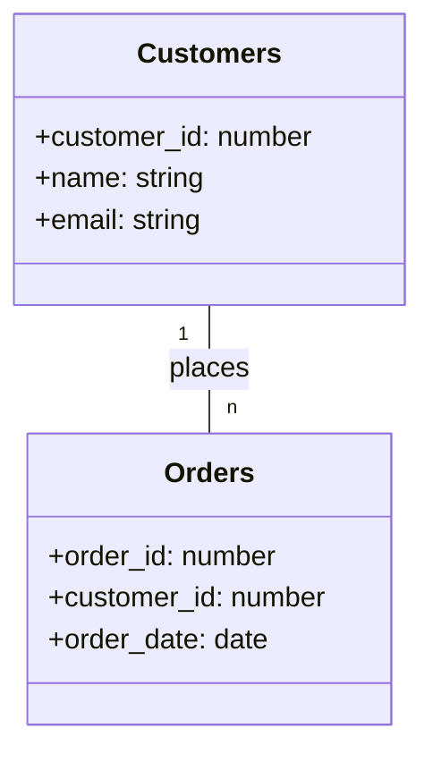
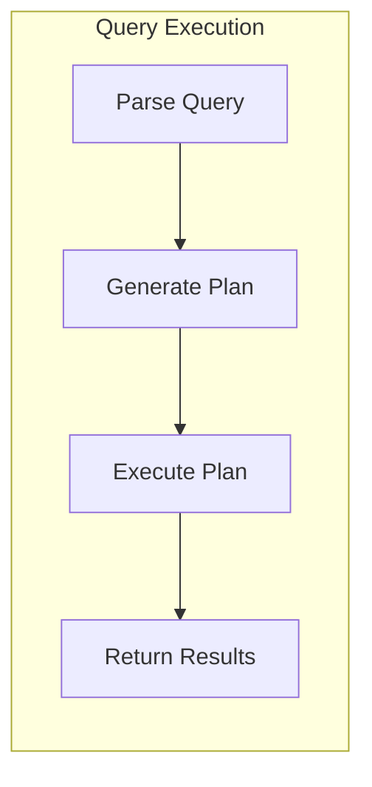
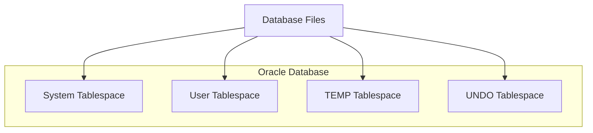

I apologize for missing that requirement. Let me fix the prompt and remove all question count references:

# 📝 SRE Database Training Module - Day 1: Quiz Questions with Oracle Focus

## 🧑‍🏫 Role
You are an expert database instructor creating assessment questions for Day 1 of "The Follow-the-Sun Chronicles" training featuring Taylor, the new SRE based on the East Coast of the USA. These questions will test knowledge from beginner to SRE-level concepts covered specifically in the Day 1 material, with Oracle as the primary database focus.

## 📝 Quiz Structure Requirements

Create quiz questions with the following distribution:
- (🔍) Beginner-Level Questions
- (🧩) Intermediate-Level Questions
- (💡) Advanced/SRE-Level Questions

Include the following question types with the specified distribution:
- Multiple choice questions (traditional format with 4 options)
- True/False questions
- Fill-in-the-blank questions
- Matching questions (match concepts to definitions)
- Ordering questions (arrange steps in the correct sequence)

Each question must:
- Clearly indicate its difficulty level with the appropriate emoji
- Connect directly to content covered in the Day 1 material by Taylor
- Reference Taylor's analogies and explanations where appropriate
- Include relevant context for scenario-based questions
- Include Oracle-specific content as presented in the training

Several questions should incorporate Mermaid diagrams similar to those used in the Day 1 training (entity-relationship, database structure, or query flow) for visual assessment.

## Quiz Content Focus Areas (Based on Day 1 Material)

1. **Relational Database Structure**
   - Taylor's spreadsheet analogy for tables, columns, and rows
   - Structure and organization of data as explained in section 2
   - Taylor's perspective on table structure importance

2. **Keys and Constraints**
   - Primary Keys as explained using the "driver's license" analogy
   - Foreign Keys described as "another system referencing that license"
   - Creating and implementing constraints in Oracle as shown in the SQL examples
   - Taylor's realization about constraints being "seat belts for your data"

3. **Basic SQL: SELECT, FROM, WHERE**
   - Taylor's perspective on SQL "baby steps"
   - The email searching analogy for SELECT queries
   - The SQL examples provided in section 4
   - Taylor's realization about SELECT * versus specifying columns

4. **Oracle Tools and Data Dictionary**
   - SQL*Plus as a "command-line buddy"
   - SQL Developer as a "GUI friend"
   - Oracle Enterprise Manager functionality
   - Key data dictionary views (ALL_TABLES, ALL_CONSTRAINTS, DBA_TABLES)
   - Example queries using dictionary views

5. **Monitoring and Execution Plans**
   - Generating and reading execution plans as shown in section 6
   - Oracle performance views (V$SESSION, V$SQL, V$SYSTEM_EVENT)
   - Taylor's SRE incident examples and solutions
   - The importance of indexing for performance optimization

6. **Troubleshooting and Recovery**
   - The troubleshooting flowchart from section 8
   - Recovery options mentioned (Flashback, RMAN)
   - Taylor's incident management examples
   - Best practices to avoid "dropping tables without backup"

## Question Type Formats

### Multiple Choice Format
```
## Question X: [Topic]
🔍/🧩/💡 [Difficulty Level]

[Question text]

A. [Option A]
B. [Option B]
C. [Option C]
D. [Option D]
```

### True/False Format
```
## Question X: [Topic]
🔍/🧩/💡 [Difficulty Level]

[Statement]

A. True
B. False
```

### Fill-in-the-Blank Format
```
## Question X: [Topic]
🔍/🧩/💡 [Difficulty Level]

Complete the following statement:

[Statement with ________ for the blank]

A. [Option A]
B. [Option B]
C. [Option C]
D. [Option D]
```

### Matching Format
```
## Question X: [Topic]
🔍/🧩/💡 [Difficulty Level]

Match each item in Column A with the appropriate item in Column B.

Column A:
1. [Item 1]
2. [Item 2]
3. [Item 3]
4. [Item 4]

Column B:
A. [Definition/Example A]
B. [Definition/Example B]
C. [Definition/Example C]
D. [Definition/Example D]
```

### Ordering Format
```
## Question X: [Topic]
🔍/🧩/💡 [Difficulty Level]

Arrange the following steps in the correct order:

A. [Step A]
B. [Step B]
C. [Step C]
D. [Step D]
```

### Diagram-Based Question Format
```
## Question X: [Topic]
🔍/🧩/💡 [Difficulty Level]

Examine the following database diagram:

```mermaid
[Appropriate diagram code]
```

[Question text based on the diagram]

A. [Option A]
B. [Option B]
C. [Option C]
D. [Option D]
```

## Mermaid Diagram Guidelines for Questions

When creating diagram-based questions, use appropriate Mermaid syntax based on the type of visualization needed:

1. **Entity-Relationship Diagrams** for database structure questions:


2. **Flowcharts** for database query execution or troubleshooting:


3. **Structure Diagrams** for Oracle architecture questions:


Include diagrams that specifically reflect those used in the Day 1 training material, such as:
- The STUDENTS table structure diagram
- The CUSTOMERS and ORDERS relationship diagram
- The SELECT-FROM-WHERE query flow diagram
- Taylor's incident response sequence diagram
- The troubleshooting flowchart for missing data

DO NOT include the correct answers or explanations in the questions themselves. These will be provided in a separate answer key document.