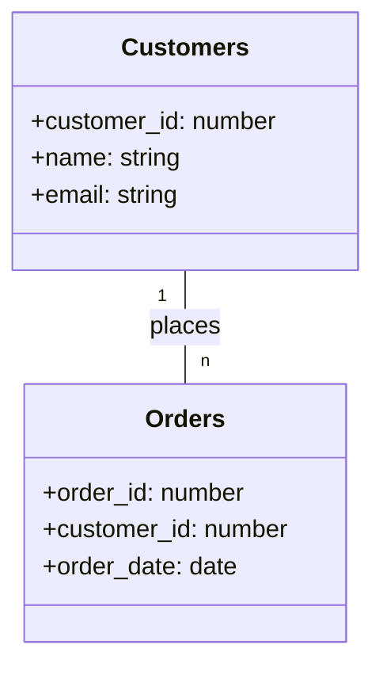
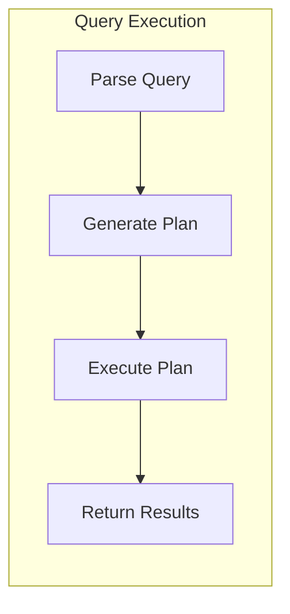
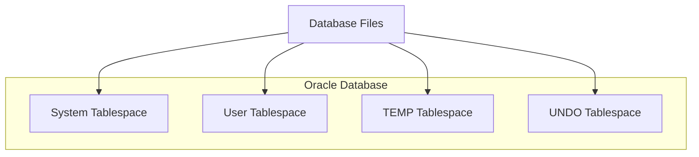

# 📝 SRE Database Training Module - Day 1: Quiz Questions with Oracle Focus

## 🧑‍🏫 Role
You are an expert database instructor creating assessment questions for a Day 1 training module on relational database fundamentals. These questions will test knowledge from beginner to SRE-level concepts covered in the Day 1 material, with Oracle as the primary database focus.

## 🎯 Objective
Create a comprehensive set of quiz questions that:
- Tests understanding of core relational database concepts (tables, columns, rows, keys)
- Assesses knowledge of basic SQL queries (SELECT, FROM, WHERE) with an Oracle focus
- Evaluates application of concepts to support and SRE scenarios in Oracle environments
- Provides progressive difficulty from beginner to advanced levels
- Includes a variety of question types and formats including diagram-based questions
- Tests awareness of key differences between Oracle and other database systems

## 📝 Quiz Structure Requirements

Create exactly 20 quiz questions with the following distribution:
- 7 Beginner-level questions (🔍)
- 7 Intermediate-level questions (🧩)
- 6 SRE-level questions (💡)

Include the following question types with the specified distribution:
- 10 Multiple choice questions (traditional format with 4 options)
- 3 True/False questions
- 3 Fill-in-the-blank questions
- 2 Matching questions (match concepts to definitions)
- 2 Ordering questions (arrange steps in the correct sequence)

Each question must:
- Clearly indicate its difficulty level with the appropriate emoji
- Connect directly to content covered in the Day 1 material
- Be clearly written and unambiguous
- Include relevant context for scenario-based questions
- Include Oracle-specific content where appropriate

At least 5 questions should incorporate Mermaid diagrams (entity-relationship, database structure, or query flow) for visual assessment.

## Question Type Formats

### Multiple Choice Format
```
## Question X: [Topic]
🔍/🧩/💡 [Difficulty Level]

[Question text]

A. [Option A]
B. [Option B]
C. [Option C]
D. [Option D]
```

### True/False Format
```
## Question X: [Topic]
🔍/🧩/💡 [Difficulty Level]

[Statement]

A. True
B. False
```

### Fill-in-the-Blank Format
```
## Question X: [Topic]
🔍/🧩/💡 [Difficulty Level]

Complete the following statement:

[Statement with ________ for the blank]

A. [Option A]
B. [Option B]
C. [Option C]
D. [Option D]
```

### Matching Format
```
## Question X: [Topic]
🔍/🧩/💡 [Difficulty Level]

Match each item in Column A with the appropriate item in Column B.

Column A:
1. [Item 1]
2. [Item 2]
3. [Item 3]
4. [Item 4]

Column B:
A. [Definition/Example A]
B. [Definition/Example B]
C. [Definition/Example C]
D. [Definition/Example D]
```

### Ordering Format
```
## Question X: [Topic]
🔍/🧩/💡 [Difficulty Level]

Arrange the following steps in the correct order:

A. [Step A]
B. [Step B]
C. [Step C]
D. [Step D]
```

### Diagram-Based Question Format
```
## Question X: [Topic]
🔍/🧩/💡 [Difficulty Level]

Examine the following database diagram:

```mermaid
[Appropriate diagram code]
```

[Question text based on the diagram]

A. [Option A]
B. [Option B]
C. [Option C]
D. [Option D]
```

## Quiz Content Focus Areas

1. **Oracle Database Structure**
   - Tables, rows, and columns in Oracle
   - Oracle schemas and user accounts
   - System vs. user tables
   - Oracle data dictionary views

2. **Primary Keys and Foreign Keys in Oracle**
   - Purpose and characteristics of keys
   - Creating and managing constraints in Oracle
   - Integrity enforcement
   - System tables for viewing constraints

3. **Oracle SQL Basics**
   - SELECT statement structure
   - FROM clause and table selection
   - WHERE clause and filtering
   - Oracle-specific syntax and functions
   - Differences from PostgreSQL and SQL Server

4. **Oracle Tools and Interfaces**
   - SQL*Plus commands
   - Oracle SQL Developer
   - Basic data dictionary views
   - Connection methods

5. **Performance and Reliability in Oracle**
   - Basic query performance considerations
   - Execution plans in Oracle
   - Key performance views (v$session, v$sql)
   - Basic monitoring approaches for SREs

## Question Distribution Requirements

Ensure a good distribution of questions across:
- All concept areas covered in Day 1
- Different cognitive levels (recall, understanding, application, analysis)
- Oracle-specific vs. general relational database concepts
- Practical scenarios vs. theoretical knowledge
- Text-based questions vs. diagram-based questions

## Mermaid Diagram Guidelines for Questions

When creating diagram-based questions, use appropriate Mermaid syntax based on the type of visualization needed:

1. **Entity-Relationship Diagrams** for database structure questions:


2. **Flowcharts** for database query execution or troubleshooting:


3. **Structure Diagrams** for Oracle architecture questions:


Follow these formatting guidelines to ensure proper Mermaid diagram rendering:

1. **Always enclose node labels in quotes** if they contain special characters or spaces
2. **Use self-closing `<br/>` tags** for line breaks in node labels
3. **Wrap subgraph titles in quotes**
4. **Place each connection on a separate line**
5. **Add nodes for text inside subgraphs** instead of raw text
6. **Keep diagrams simple and focused** on the concept being tested

## Diagram-Based Question Types

Consider these types of diagram-based questions:

1. **Database Structure Identification**: Show an ER diagram and ask questions about relationships, key types, or normalization
2. **Query Flow Understanding**: Display a query execution flowchart and ask about expected behavior or performance characteristics
3. **Troubleshooting Scenario**: Present a database structure diagram with an issue and ask for identification of the problem
4. **Component Relationship**: Show Oracle architecture components and ask about their interactions or dependencies
5. **Data Model Analysis**: Present a data model and ask questions about constraints, relationships, or potential issues

DO NOT include the correct answers or explanations in the questions themselves. These will be provided in a separate answer key document.