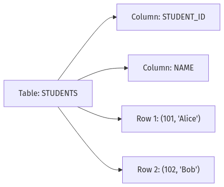
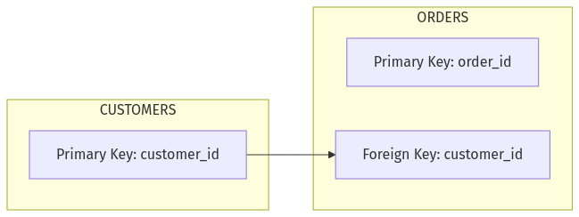
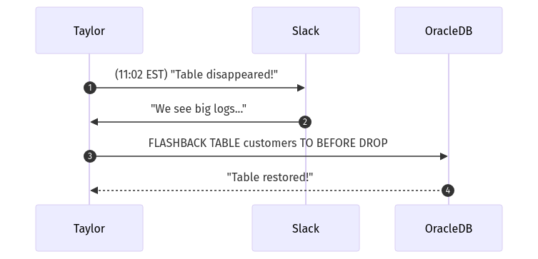

# **Day 1 Quiz** 

## **(🔍) Beginner-Level Questions (7)**

### **Question 1 (🔍, Multiple Choice)**
**Topic:** Relational Database Structure

Taylor often compares an **Oracle table** to a spreadsheet. In her analogy, which part of the spreadsheet best matches an **Oracle table’s columns**?

A. Individual row entries  
B. The sheet’s name  
C. The headings (field names) on top  
D. The entire set of worksheets  

---

### **Question 2 (🔍, Multiple Choice)**
**Topic:** Keys and Constraints

In Taylor’s “driver’s license” analogy for **primary keys**, which statement best reflects the meaning of a **PK**?

A. It’s the only numeric column in the table  
B. It ensures each row has a unique identifier  
C. It can be null or duplicated freely  
D. It’s a foreign reference to another table’s ID  

---

### **Question 3 (🔍, True/False)**
**Topic:** Basic SQL (SELECT, FROM, WHERE)

Taylor warns about using **`SELECT *`**. True or false: `SELECT *` is generally harmless for performance since it’s a simple command that never impacts query speed on large tables.

A. True  
B. False  

---

### **Question 4 (🔍, Multiple Choice with Diagram)**
**Topic:** Oracle Table Structure

Look at the **Mermaid diagram** referencing a sample table:

Which action aligns with Taylor’s approach to verifying data in this table?

A. Running `DELETE FROM STUDENTS` with no `WHERE` clause  
B. Issuing a `SELECT * FROM students;` to see all rows  
C. Creating a second table with the same name and columns  
D. Dropping the table without a backup  

---

### **Question 5 (🔍, Matching)**
**Topic:** Keys & Constraints

Match each item from Column A to its best definition in Column B.

Column A:
1. Primary Key  
2. Foreign Key  
3. Constraint  
4. Oracle Synonym  

Column B:
A. References a PK in another table to enforce relational integrity  
B. Unique identifier for each row, can’t be null or duplicated  
C. Alias for an Oracle object, used for cross-schema references  
D. A seat belt that prevents data from going rogue  

*(No solutions here. The user picks the correct matches.)*

---

### **Question 6 (🔍, Fill-in-the-Blank)**
**Topic:** Basic SQL

Complete this statement about Taylor’s recommended approach:

> When you run a large `SELECT` query, specify the ________ you need instead of using `SELECT *`, which can degrade performance on big tables.

(Choose the best single missing term from your knowledge of Day 1 content.)

---

### **Question 7 (🔍, Multiple Choice)**
**Topic:** Oracle Tools & Data Dictionary

Taylor discovered **SQL\*Plus** as a quick script runner. Which other **Oracle** tool did she call her “GUI friend” with object browsing and debugging capabilities?

A. Oracle Data Pump  
B. SQL Developer  
C. Oracle Enterprise Manager (OEM)  
D. RMAN  

---

## **(🧩) Intermediate-Level Questions (7)**

### **Question 8 (🧩, Multiple Choice)**
**Topic:** Compare Oracle to Other SQL Dialects

Taylor wants to see if Oracle syntax differs from PostgreSQL and SQL Server. Which **CREATE TABLE** snippet is most typical of **Oracle**?

A. `CREATE TABLE test (id SERIAL, name VARCHAR(50));`  
B. `CREATE TABLE test (id NUMBER, name VARCHAR2(50));`  
C. `CREATE TABLE test (id INT IDENTITY, name VARCHAR(50));`  
D. `CREATE TABLE test (id INT AUTO_INCREMENT, name VARCHAR(50));`  

---

### **Question 9 (🧩, Multiple Choice with Diagram)**
**Topic:** Setting Up PK & FK

Taylor used a **Mermaid diagram** showing two tables, `CUSTOMERS` and `ORDERS`, with a PK-FK link:

Which Oracle statement properly defines a **foreign key** referencing `customer_id`?

A. `ALTER TABLE customers ADD FOREIGN KEY (customer_id) REFERENCES orders(order_id);`  
B. `ALTER TABLE orders ADD CONSTRAINT fk_customer FOREIGN KEY (customer_id) REFERENCES customers(customer_id);`  
C. `CREATE TABLE customers (customer_id FOREIGN KEY, name VARCHAR2(50));`  
D. `DROP TABLE customers CASCADE;`  

---

### **Question 10 (🧩, True/False)**
**Topic:** Data Dictionary & Troubleshooting

Day 1 material states that **`ALL_TABLES`** and **`ALL_CONSTRAINTS`** are accessible to any user by default, no special privileges required. True or false?

A. True  
B. False  

---

### **Question 11 (🧩, Multiple Choice)**
**Topic:** Oracle Errors & Troubleshooting

Taylor encountered the dreaded “**ORA-00942: table or view does not exist**.” Which reason is **most** likely from the day’s training?

A. The table is locked by the system admin  
B. The user is referencing the wrong schema or missing synonyms  
C. Oracle replaced the table with a temp table automatically  
D. The Oracle logs are full, preventing query execution  

---

### **Question 12 (🧩, Fill-in-the-Blank)**
**Topic:** Oracle Tools

Taylor described **SQL\*Plus** as the command-line tool. She also uses **____** for **Oracle**—the “GUI with object browsing and debugging”:

*(One word or short phrase from the day’s content. No solution provided.)*

---

### **Question 13 (🧩, Matching)**
**Topic:** Data Dictionary Views & Their Purpose

Column A (views or features):
1. `ALL_TABLES`  
2. `ALL_CONSTRAINTS`  
3. `DBA_TABLES`  
4. “table not found” error

Column B (explanations):
A. Typically means you’re referencing the wrong schema or no synonyms exist  
B. Lists your accessible constraints (PK, FK, etc.)  
C. For actual DBAs, shows all tables in the entire database  
D. Provides a list of tables you can see as a normal user

---

### **Question 14 (🧩, Ordering)**
**Topic:** Troubleshooting Flow

Arrange these steps from Taylor’s **“I have no idea what’s wrong”** approach in the correct sequence:

A. Check logs or error codes  
B. Validate constraints or synonyms  
C. Use `ALL_TABLES` or dictionary to confirm table references  
D. Resolve final data insertion approach  

---

## **(💡) Advanced/SRE-Level Questions (6)**

### **Question 15 (💡, Multiple Choice)**
**Topic:** Monitoring & Execution Plans

Taylor used `EXPLAIN PLAN` to detect **TABLE ACCESS (FULL)** on a big table. She concluded an **index** might help. Which scenario could justify a **full table scan** anyway?

A. The table is massive, so scanning is inevitable  
B. The table is small or the query must read nearly all rows  
C. The index was dropped permanently  
D. Oracle no longer supports indexing for large tables  

---

### **Question 16 (💡, Multiple Choice)**
**Topic:** Oracle Performance Views

Which pair best matches Taylor’s approach to checking performance hogs?

A. `DBA_TABLES` for top queries, `ALL_CONSTRAINTS` for CPU usage  
B. `V$SESSION` for active sessions, `V$SQL` for top statements in shared pool  
C. `SQL*Plus` for constraints, `SQL Developer` for indexing details  
D. `SELECT * FROM orders` to see locks, `SELECT * FROM synonyms` to see concurrency  

---

### **Question 17 (💡, Fill-in-the-Blank)**
**Topic:** Backups & Recovery

Taylor says **RMAN** is a robust ________ tool in Oracle, used to protect data from meltdown if a table or schema is lost.

*(One short word or phrase describing RMAN’s purpose. No solution provided.)*

---

### **Question 18 (💡, Multiple Choice with Diagram)**
**Topic:** SRE Incident & Slack Sequence

Look at the **Mermaid sequence** referencing an SRE meltdown:

Which concept from Day 1 does this highlight?

A. Using `SELECT *` as a safe approach  
B. The “table not found” error is unsolvable  
C. **Flashback** as an Oracle recovery feature  
D. Basic SQL scripts are enough to restore data  

---

### **Question 19 (💡, True/False)**
**Topic:** Zero Downtime Aspirations

(💡) If you plan carefully, **Day 1** says you can achieve “**zero downtime fantasies**” with Oracle via features like RAC, Data Guard, and perfect indexing, never needing any maintenance windows. True or false?

A. True  
B. False  

---

### **Question 20 (💡, Ordering)**
**Topic:** SRE Performance Debug

Taylor debugged a slow query by checking `V$SESSION`, `V$SQL`, then creating an index. Put her steps in the correct sequence:

A. See top sessions in `V$SESSION`  
B. Verify the new plan uses an index  
C. Identify the suspicious query in `V$SQL`  
D. Create an index on the joining column  
E. Re-run the query, watch CPU usage drop  

---

**End of Day 1 Quiz** – *No answers or solutions included.*  
