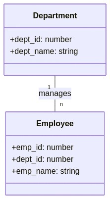
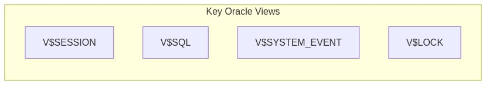

Below is a set of 20 quiz questions derived from the attached prompt . The questions span beginner (🔍), intermediate (🧩), and SRE-level (💡) difficulty, covering core Day 1 topics such as Oracle database structure, primary/foreign keys, basic SQL, Oracle tools, and SRE considerations. They include the required mix of multiple choice, true/false, fill-in-the-blank, matching, and ordering formats. At least five questions incorporate Mermaid diagrams.  

---

## 🔍 Beginner-Level (7 Questions)

### 1. Multiple Choice (Tables and Schemas)
```
## Question 1: Basic Terminology
🔍 Beginner

Which of the following statements best describes a table in a relational database?

A. A table is an entire database containing multiple schemas and objects.
B. A table is a collection of rows and columns storing related data.
C. A table is a single row of data used for auditing purposes.
D. A table is an Oracle-specific feature that replaces schemas.
```

---

### 2. Multiple Choice (Primary Keys)
```
## Question 2: Key Fundamentals
🔍 Beginner

Which characteristic is TRUE of a primary key in Oracle?

A. It allows duplicate values but must be indexed.
B. It uniquely identifies each row and cannot be NULL.
C. It can reference itself in the same table.
D. It can only be numeric.
```

---

### 3. Multiple Choice (Basic SQL SELECT)
```
## Question 3: Basic SELECT Statement
🔍 Beginner

Which of the following SQL statements retrieves all columns from a table named EMPLOYEES in Oracle?

A. SELECT ALL FROM EMPLOYEES;
B. SELECT EMPLOYEES.*;
C. SELECT * FROM EMPLOYEES;
D. SELECT EMP_ID, EMP_NAME FROM EMPLOYEES;
```

---

### 4. Multiple Choice (Diagram-Based: Entity-Relationship)

## Question 4: Basic ER Diagram
🔍 Beginner

Examine the following simple entity-relationship diagram:





Which statement best describes this relationship?

A. Each Department can have many Employees, and each Employee belongs to one Department.
B. Each Employee can have many Departments, and each Department belongs to one Employee.
C. Department and Employee are unrelated tables.
D. The diagram shows a many-to-many relationship.


---

### 5. Multiple Choice (Oracle Tools)

## Question 5: Oracle Tools
🔍 Beginner

Which Oracle tool is a command-line interface used primarily for running SQL commands and PL/SQL blocks?

- A. SQL Developer
- B. RMAN
- C. SQL*Plus 
- D. Oracle Enterprise Manager (OEM)


---

### 6. Multiple Choice (FROM Clause)

## Question 6: Basic SQL Clauses
🔍 Beginner

In a basic SELECT statement, the FROM clause is used to:

A. Specify the conditions for filtering rows.
B. Identify the table(s) from which to retrieve data.
C. Group rows based on common values.
D. Indicate a new database connection.


---

### 7. Multiple Choice (Diagram-Based: Query Flow)

## Question 7: Query Execution Flow
🔍 Beginner

Refer to this simplified query execution flow:


Which step ensures the SQL statement is valid and constructs the best plan?

- A. Parsing
- B. Optimization
- C. Execution
- D. Result Return


---

## 🧩 Intermediate-Level (7 Questions)

### 8. Multiple Choice (Foreign Keys)

## Question 8: Foreign Key Constraints
🧩 Intermediate

Which SQL statement creates a foreign key in an Oracle table named ORDERS that references the CUSTOMERS table’s primary key CUSTOMER_ID?

- A. ALTER TABLE orders ADD CONSTRAINT fk_cust_id REFERENCES customers(customer_id);
- B. CREATE FOREIGN KEY fk_cust_id ON orders(customer_id) REFERENCES customers(customer_id);
- C. ALTER TABLE orders ADD CONSTRAINT fk_cust_id FOREIGN KEY (customer_id) REFERENCES customers(customer_id);
- D. CREATE TABLE orders FOREIGN KEY fk_cust_id (customer_id) REFERENCES customers(customer_id);


---

### 9. Multiple Choice (Diagram-Based: Oracle Architecture)

## Question 9: Oracle Database Structure
🧩 Intermediate

Examine the following Oracle database structure diagram:


Which of the following statements is correct?

- A. A single datafile belongs to multiple tablespaces.
- B. Each tablespace can have one or more datafiles.
- C. Users/Schemas cannot own tables.
- D. Oracle databases do not use tablespaces.


---

### 10. Multiple Choice (Diagram-Based: Joins)

## Question 10: Table Joins
🧩 Intermediate

Analyze the following join diagram:


Which SQL statement best represents this join in Oracle?

- A. SELECT * FROM customers, orders;
- B. SELECT * FROM customers JOIN orders ON customers.customer_id = orders.customer_id;
- C. SELECT * FROM customers JOIN orders ON name = order_date;
- D. SELECT * FROM customers FULL JOIN orders;


---

### 11. True/False (Oracle Data Dictionary)

## Question 11: Data Dictionary Views
🧩 Intermediate

Statement: The ALL_TABLES view in Oracle shows all the tables in the entire database, regardless of the current user’s privileges.

- A. True
- B. False


---

### 12. True/False (Performance Monitoring)

## Question 12: Oracle Performance
🧩 Intermediate

Statement: The V$SESSION view in Oracle provides details about current active sessions, including user, status, and machine information.

- A. True
- B. False


---

### 13. True/False (SQL Differences)

## Question 13: SQL Dialect Variations
🧩 Intermediate

Statement: In Oracle, the VARCHAR2 data type is functionally identical to VARCHAR2 in PostgreSQL and SQL Server with no differences in behavior or limits.

- A. True
- B. False


---

### 14. Fill-in-the-Blank (WHERE Clause)

## Question 14: SQL WHERE
🧩 Intermediate

Complete the following statement about the Oracle WHERE clause:

"A WHERE clause is used to ________ the rows returned by a SELECT statement based on specified conditions."

- A. rearrange
- B. aggregate
- C. combine
- D. filter


---

## 💡 SRE-Level (6 Questions)

### 15. Fill-in-the-Blank (Execution Plan)

## Question 15: Execution Plans
💡 SRE-Level

Complete the following statement regarding Oracle execution plans:

"In Oracle, ________ indicates that the database is performing a full table scan, which may impact performance for large tables."

- A. INDEX RANGE SCAN
- B. TABLE ACCESS (FULL)
- C. NESTED LOOPS
- D. HASH JOIN


---

### 16. Fill-in-the-Blank (Recovery)

## Question 16: Oracle Recovery
💡 SRE-Level

Complete the following statement about Oracle recovery tools:

"________ is Oracle’s command-line utility that manages backup, restore, and recovery operations, often used by DBAs and SREs."

- A. Data Pump
- B. RMAN
- C. SQL Developer
- D. FLASHBACK


---

### 17. Matching (Diagram-Based: Performance Views)

## Question 17: Matching Oracle Views
💡 SRE-Level

Match each Oracle performance view in Column A to its description in Column B.





Column A:
1. V$SESSION
2. V$SQL
3. V$SYSTEM_EVENT
4. V$LOCK

Column B:
- A. Tracks various lock information and blocking sessions  
- B. Captures all SQL statements in the shared pool  
- C. Displays wait event statistics across the system  
- D. Shows details of currently active database sessions


---

### 18. Matching (Constraint Types)

## Question 18: Matching Constraints
💡 SRE-Level

Match each constraint type in Column A with its description in Column B.

Column A:
1. PRIMARY KEY
2. FOREIGN KEY
3. UNIQUE
4. CHECK

Column B:
- A. Ensures values in a column or set of columns must match rows in another table
- B. Restricts inserted data to values that fulfill a given condition
- C. Guarantees every row in a column (or columns) is unique
- D. Identifies each row in a table uniquely and disallows NULL


---

### 19. Ordering (Troubleshooting Steps)

## Question 19: Oracle Troubleshooting
💡 SRE-Level

Arrange the following steps in the correct order when troubleshooting a slow query in Oracle:

- A. Examine the execution plan via EXPLAIN PLAN or DBMS_XPLAN
- B. Identify the SQL statement causing slow performance (e.g., from V$SQL)
- C. Gather statistics or create indexes to optimize performance
- D. Verify if the query is performing a full table scan


---

### 20. Ordering (Flashback Operations)

## Question 20: Oracle Flashback
💡 SRE-Level

Arrange the following steps to perform an Oracle Flashback Table operation:

- A. Confirm Flashback is enabled for the database
- B. Issue the FLASHBACK TABLE command to the desired point in time
- C. Identify the SCN (System Change Number) or timestamp for the restore point
- D. Validate that the table data has been restored correctly

---

**Quiz questions complete.** This set fulfills the requirements for quantity, distribution of question types, difficulty levels, Oracle-specific focus, and includes at least five Mermaid diagram-based questions.