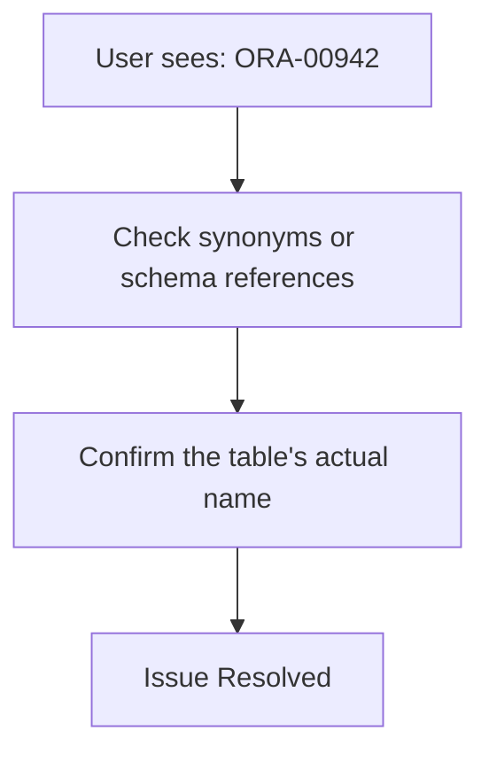
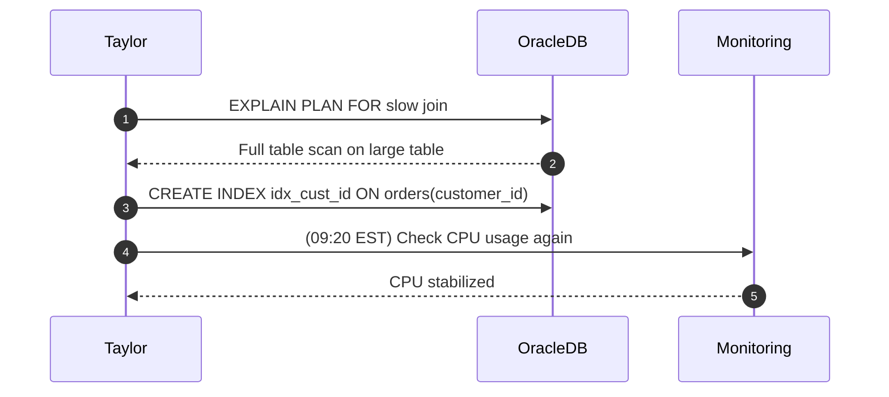

# **Day 1 Quiz**  

The questions span **Beginner** (🔍), **Intermediate** (🧩), and **Advanced/SRE** (💡) concepts Taylor covered, referencing her analogies and Oracle‐specific content. Several questions incorporate **Mermaid diagrams**, and **no** answers are provided here (these belong in a separate key).

---

## **(🔍) Beginner-Level Questions**

### **Question 1 (🔍, Multiple Choice)**
**Topic:** Relational Database Structure

Taylor uses a **spreadsheet analogy** to describe an Oracle table. In this analogy, which part of the spreadsheet best maps to the **table’s columns**?

A. Each row in the sheet  
B. The sheet’s overall name  
C. The headers (field names) at the top  
D. The user’s login credentials  

---

### **Question 2 (🔍, Multiple Choice)**
**Topic:** Primary Keys (PK)

Referring to Taylor’s “driver’s license” analogy for primary keys, which statement is **most** accurate?

A. A PK is optional in Oracle if you trust your data  
B. A PK identifies a row uniquely and cannot be NULL or duplicated  
C. A PK can be repeated if you have synonyms  
D. A PK must be numeric only  

---

### **Question 3 (🔍, True/False)**
**Topic:** Basic SQL (SELECT, FROM, WHERE)

Taylor warns about `SELECT *`. True or False: `SELECT *` on a very large Oracle table can degrade performance by returning more columns than needed.

A. True  
B. False  

---

### **Question 4 (🔍, Fill-in-the-Blank)**
**Topic:** Constraints

Complete this statement from Taylor’s seatbelt analogy:

> “**Constraints** are like seat belts for your data, preventing ________ when you attempt to insert or update rows incorrectly.”

*(Fill in one or two words describing the bad outcome. No solutions here.)*

---

### **Question 5 (🔍, Multiple Choice with Diagram)**
**Topic:** SELECT–FROM–WHERE Flow

**Examine** the **Mermaid** flowchart of a basic query structure:

Taylor says the `WHERE` part is crucial because:

A. It returns every row from the table if omitted  
B. It renames the columns automatically  
C. It’s optional but can only handle numeric filters  
D. It’s a constraint used in an ER diagram  

---

### **Question 6 (🔍, Matching)**
**Topic:** Oracle Tools & Views

Match each item in Column A to its definition in Column B:

**Column A**:
1. **SQL\*Plus**  
2. **SQL Developer**  
3. **ALL_TABLES**  
4. **ALL_CONSTRAINTS**  

**Column B**:
A. GUI for object browsing, queries, debugging  
B. Command-line environment for quick scripts  
C. View listing all tables you can access  
D. View listing PKs, FKs, checks you can see  

*(No solutions included.)*

---

### **Question 7 (🔍, Multiple Choice)**
**Topic:** Logging in to Oracle

Taylor dreaded locking herself out on Day 1. Which Oracle tool did she mention as a quick script runner?

A. Oracle Data Pump  
B. Oracle RMAN  
C. **SQL\*Plus**  
D. Oracle AWR  

---

## **(🧩) Intermediate-Level Questions**

### **Question 8 (🧩, Multiple Choice)**
**Topic:** PK-FK Setup

Which Oracle statement properly **adds a foreign key** from `orders.customer_id` to `customers.customer_id` after both tables are created?

A. `ALTER TABLE orders ADD FOREIGN KEY (customer_id);`  
B. `ALTER TABLE customers ADD CONSTRAINT fk_orders FOREIGN KEY (customer_id) REFERENCES orders(customer_id);`  
C. `ALTER TABLE orders ADD CONSTRAINT fk_cust FOREIGN KEY (customer_id) REFERENCES customers(customer_id);`  
D. `DROP TABLE customers CASCADE;`  

---

### **Question 9 (🧩, Fill-in-the-Blank)**
**Topic:** Data Dictionary

Taylor used `ALL_TABLES` to see accessible tables. For more advanced privileges, she might check ________ (the view used by actual DBAs to see all tables in the entire DB).

*(One short phrase referencing Oracle’s DBA views.)*

---

### **Question 10 (🧩, Multiple Choice with Diagram)**
**Topic:** Troubleshooting “table not found”

**Examine** this snippet from the **Mermaid** flowchart referencing Taylor’s method for “table or view not found”:

Which reason is **most** likely for “ORA-00942” from Taylor’s perspective?

A. A synonyms mismatch or referencing the wrong schema  
B. The table is locked by a foreign key constraint  
C. Flashback logs are missing  
D. A full table scan triggered an Oracle meltdown  

---

### **Question 11 (🧩, True/False)**
**Topic:** Oracle Data Dictionary

Taylor states `ALL_CONSTRAINTS` helps verify PKs and FKs you can see in your schema. True or False: This dictionary view is automatically updated whenever you create or modify a constraint.

A. True  
B. False  

---

### **Question 12 (🧩, Multiple Choice)**
**Topic:** Comparing Oracle to PostgreSQL / SQL Server

Which Oracle-specific data type or feature did Taylor mention that might differ in other SQL dialects?

A. `SERIAL PRIMARY KEY`  
B. `CREATE TABLE test (id NUMBER, name VARCHAR2(50));`  
C. `INT AUTO_INCREMENT`  
D. `TEXT`  

---

### **Question 13 (🧩, Ordering)**
**Topic:** Defining & Testing Keys in Oracle

Put the following steps **in order** for creating an Oracle table with a PK, adding a foreign key, and verifying constraints:

A. `CREATE TABLE customers (customer_id NUMBER PRIMARY KEY, name VARCHAR2(50));`  
B. `ALTER TABLE orders ADD CONSTRAINT fk_cust FOREIGN KEY (customer_id) REFERENCES customers(customer_id);`  
C. `CREATE TABLE orders (order_id NUMBER PRIMARY KEY, customer_id NUMBER, total NUMBER);`  
D. `SELECT * FROM all_constraints WHERE table_name='ORDERS';`  

---

## **(💡) Advanced/SRE-Level Questions**

### **Question 14 (💡, Multiple Choice)**
**Topic:** Monitoring with V$ Views

Taylor used **`V$SESSION`** to see active sessions hogging resources. Which other Oracle view can show top statements in the **shared pool**?

A. `V$SQL`  
B. `ALL_TABLES`  
C. `ALL_CONSTRAINTS`  
D. `DBA_SYN`  

---

### **Question 15 (💡, Multiple Choice with Diagram)**
**Topic:** EXPLAIN PLAN / Execution

**Examine** this sequence from Taylor’s “SRE meltdown” approach:

Which concept from Day 1 is best illustrated?

A. Using synonyms to fix a missing table  
B. Adding a foreign key to solve performance  
C. Creating an index to cut down full table scans  
D. Dropping constraints to speed up queries  

---

### **Question 16 (💡, True/False)**
**Topic:** Flashback / Recovery

Taylor learned that **Flashback** can restore a dropped table instantly, as long as it’s within the configured retention period. True or false?

A. True  
B. False  

---

### **Question 17 (💡, Multiple Choice)**
**Topic:** SRE-Level Troubleshooting

When verifying a meltdown from a big query, Taylor often checks **`V$SYSTEM_EVENT`**. What does this view show?

A. A record of every DML statement  
B. All constraints referencing foreign keys  
C. Wait events system-wide (I/O, CPU waits, etc.)  
D. The current user’s synonyms only  

---

### **Question 18 (💡, Fill-in-the-Blank)**
**Topic:** Indexing for Performance

Taylor realized an unindexed join can cause a meltdown. She recommended ________ the relevant column so Oracle can perform **INDEX RANGE SCAN** instead of scanning entire tables.

*(Likely “indexing.” No solutions here.)*

---

### **Question 19 (💡, Multiple Choice)**
**Topic:** Zero Downtime Aspirations

Taylor’s advanced goal is “**Design robust systems** with zero downtime fantasies.” Which Oracle feature(s) might help with near-zero downtime?

A. RMAN scripts only  
B. Oracle RAC, Data Guard, or GoldenGate  
C. Deleting half the constraints  
D. Using MySQL as a fallback  

---

### **Question 20 (💡, Ordering)**
**Topic:** Recovery from a Dropped Table

Taylor’s second SRE incident used a Slack conversation. Put her steps **in order**:

A. Slack alert: “CUSTOMERS table is gone!”  
B. Confirm table is truly missing with `SELECT * FROM all_tables WHERE table_name='CUSTOMERS'`  
C. Flashback the table `TO BEFORE DROP`  
D. Validate the row count to ensure data integrity  

---

**End of Day 1 Quiz** – *No solutions or explanations here.*  
**References**: day-01-training_material-v1.md citeturn26file0. This quiz ties directly to Taylor’s experiences and analogies from Day 1.