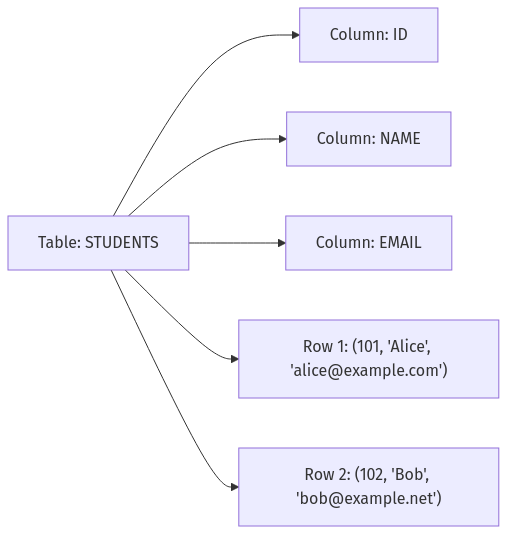
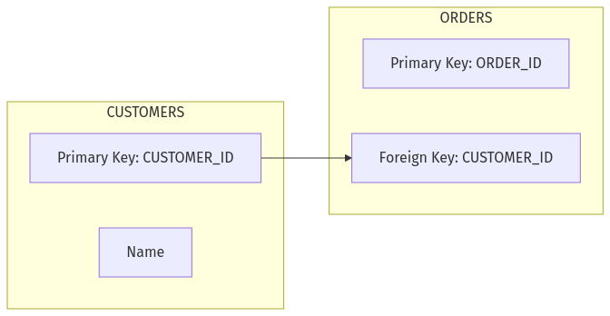
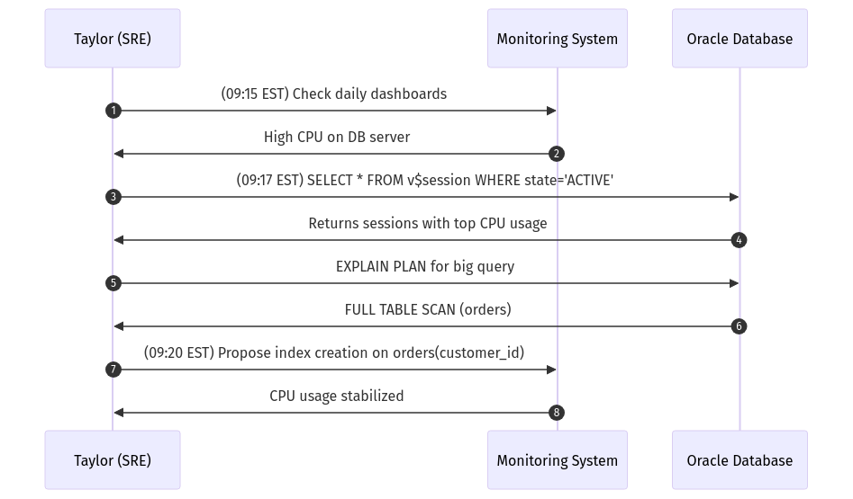
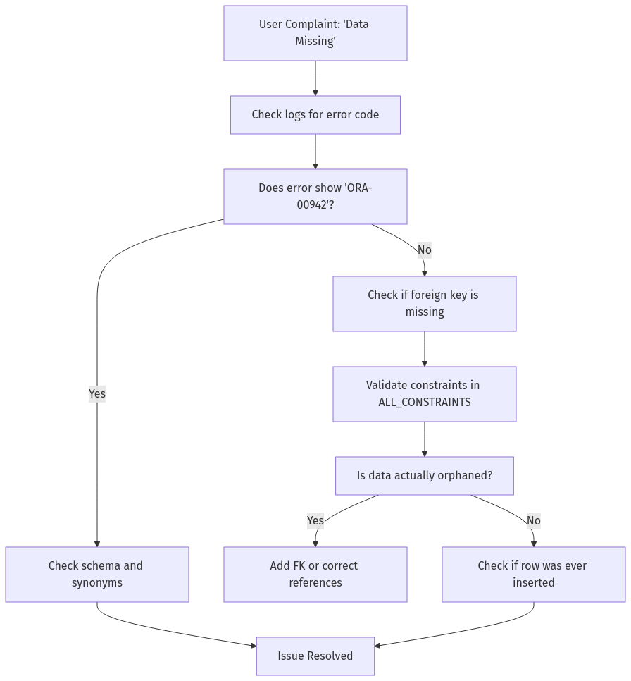
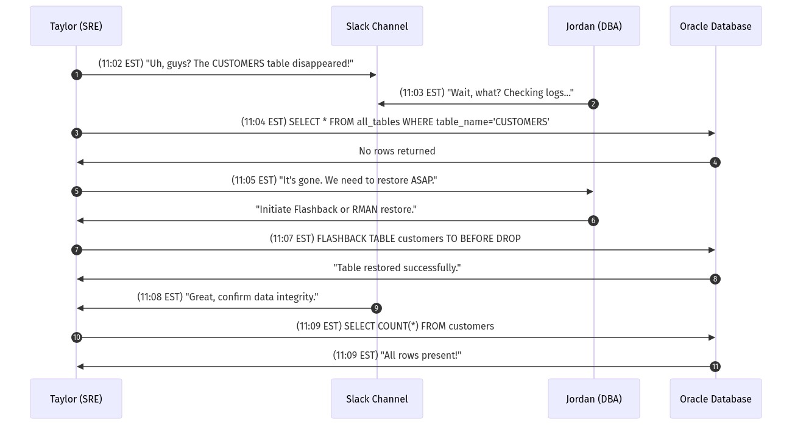

# **The Follow-the-Sun Chronicles: Day 1 – With Taylor**

**Character Profile:**  
- **Name:** Taylor  
- **Location:** USA (East Coast)  
- **Time:** 09:00 EST  
- **Role:** Brand-new SRE, sharp but a bit green, thrust into production on Day 1  
- **Personality:** Highly practical, a tad sarcastic, but ready to learn and solve problems

> “Hey! I’m Taylor, and I’ve somehow found myself on the front lines of SRE work...on my *first day* no less. No pressure, right? Let’s jump in before I break anything too major.”

---

## **1. My Day 1 Goals (Taylor’s Personal Roadmap)**

Even though I’m brand new here, they gave me a checklist of skills I have to master—*fast.* So I’m labeling them as **my** goals:

### 🔍 Beginner (Immediate Must-Haves)
1. **Spot** the basic building blocks (tables, columns, rows) and figure out how they work.  
2. **Grasp** primary keys and foreign keys in plain English.  
3. **Run** a simple `SELECT` query (with a `WHERE` clause) in Oracle—without taking down the database.  
4. **Log in** to an Oracle instance via SQL\*Plus or SQL Developer (…and hopefully not lock myself out).

### 🧩 Intermediate (Sooner Than Later)
1. **Compare** Oracle syntax with PostgreSQL/SQL Server to see if they’re truly distant cousins or just siblings.  
2. **Set up** correct primary and foreign keys in Oracle.  
3. **Dig** into data dictionary views (`ALL_TABLES`, `ALL_CONSTRAINTS`) to see how the engine room operates.  
4. **Troubleshoot** the “favorite” Oracle errors (like the dreaded “table not found”).

### 💡 Advanced/SRE (Aspirational)
1. **Monitor** performance using Oracle’s V$ views and `EXPLAIN PLAN`.  
2. **Optimize** queries—aka “help queries find their chill.”  
3. **Handle** backups and recovery (RMAN, Flashback).  
4. **Design** robust systems with *zero downtime fantasies* in mind.

> **Taylor’s Note:** “If I can survive Day 1, maybe I won’t have to rely on coffee as my life support system.”

---

## **2. Relational Database Structure**

### **Taylor’s Perspective**  
“When people say ‘relational database,’ I used to just nod and hope they wouldn’t quiz me. Now, I realize it’s basically a *well-organized table system.* It’s structured but easy to break if you’re not careful. Trust me, you don’t want to learn this the hard way like I did at my last internship (R.I.P. my first database).”

### **Beginner Analogy**  
- Imagine a **spreadsheet** where every **sheet** is a table, the **header row** is columns, and each subsequent **row** is a single record.

### **Mermaid Diagram**  





*(Note the `&commat;` for emails!)*

### **SQL Example**  
```sql
SELECT id, name, email
FROM students
WHERE name = 'Alice';
```

### **Application for Support/SREs**  
- Knowing how tables work means you can diagnose weird data issues, missing records, or other anomalies.  
- A single messed-up table design can cause massive performance slowdowns and endless frustration.

### **Taylor’s Realization**  
> “At first, I thought, ‘Meh, a table is a table, how complicated can it be?’ But then I learned how columns, rows, and constraints can *make or break* performance. This is when I realized you can’t just wing table design and hope for the best!”

---

### **Taylor’s Notes**  
1. **Tables** are your data’s home base; keep them clean and well-structured.  
2. **Columns** define the shape of your data. If you get them wrong, queries will get weird—fast.  
3. Avoid the “one giant table” trap. That’s basically a *spreadsheets gone wild* scenario.

---

## **3. Keys and Constraints**

### **Taylor’s Perspective**  
“Keys? Constraints? I used to think that was fancy talk for ‘don’t do something dumb.’ Turns out I was…basically right.”

### **Beginner Analogy**  
- **Primary Key (PK)**: Think of it like your **driver’s license**—only one, unique to you.  
- **Foreign Key (FK)**: Another system referencing that license—like a hotel check-in referencing your ID.

### **Mermaid Diagram**  





### **SQL Example**  
```sql
-- CREATE TABLE with PK:
CREATE TABLE customers (
  customer_id NUMBER PRIMARY KEY,
  name        VARCHAR2(50)
);

-- CREATE TABLE with FK:
CREATE TABLE orders (
  order_id NUMBER PRIMARY KEY,
  customer_id NUMBER REFERENCES customers(customer_id)
);
```

### **Application for Support/SREs**  
- Proper foreign keys keep data from “going rogue” (orphaned orders, for instance).  
- If your primary key is messed up, you’ll get duplicates—or a database that screams at you for trying.

### **Taylor’s Realization**  
> “I once had a table with no PK, and we had 200 entries all named ‘John Doe’ with no way to tell them apart. *Never again.* Now I see how constraints are like seat belts for your data.”

---

### **Taylor’s Notes**  
1. **PK** = unique ID. Don’t repeat it, or the database will rage-quit your `INSERT`.  
2. **FK** = referencing a PK in another table. Without it, your data can drift into chaos.  
3. Good constraints = fewer *‘Where’d my data go?’* nightmares.

---

## **4. Basic SQL: SELECT, FROM, WHERE**

### **Taylor’s Perspective**  
“These are the baby steps in SQL, but you can still do real damage if you’re not careful. *Hello, accidental cross join.*”

### **Beginner Analogy**  
- **SELECT** is like searching for a specific email in your inbox: “Give me subject, sender, or date from the giant list of emails, but only the ones that match certain filters.”

### **Mermaid Diagram**  


### **SQL Example**  
```sql
SELECT name, email
FROM customers
WHERE name = 'Alice';
```

### **Application for Support/SREs**  
- Quickly check if your new user records are actually being saved.  
- Determine if data inconsistencies are code issues, user errors, or DB anomalies.

### **Taylor’s Realization**  
> “At first, I thought, ‘SELECT *’ is good enough, but then I learned just how expensive that can be on big tables. Pro tip: specifying columns is your friend if you value performance.”

---

### **Taylor’s Notes**  
1. **SELECT** specific columns to keep results tidy.  
2. **FROM** determines which table(s) you’re querying.  
3. **WHERE** is your filter—forget it, and you might retrieve the entire universe of data.

---

## **5. Oracle Tools and Data Dictionary**

### **Taylor’s Perspective**  
“SQL\*Plus is your command-line buddy, SQL Developer is your GUI friend, and Oracle Enterprise Manager is…where you see the fancy graphs that make management less panicky.”

- **SQL\*Plus**: Quick script runner.  
- **SQL Developer**: GUI with object browsing, queries, debugging.  
- **Oracle Enterprise Manager**: Full monitoring suite.

### **Key Data Dictionary Views**  
- **`ALL_TABLES`**: Shows the tables you can see.  
- **`ALL_CONSTRAINTS`**: Where constraints hang out.  
- **`DBA_TABLES`**: For the *actual* DBAs with big privileges.

**Example**  
```sql
SELECT table_name
FROM all_tables
WHERE owner = 'HR';
```
Checks tables under the `HR` schema.

### **Taylor’s Realization**  
> “Using `ALL_TABLES` or `ALL_CONSTRAINTS` is like pulling back the curtain on Oracle’s engine room. You see what’s really happening—like a status board for all your data structures.”

---

### **Taylor’s Notes**  
1. Master at least **one** Oracle tool so you can run queries and see logs easily.  
2. Data dictionary views are your best friend when you’re debugging or verifying constraints.  
3. Never assume data is what you *think* it is—verify with dictionary views.

---

## **6. Monitoring and Execution Plans**

### **Taylor’s Perspective**  
“SRE life = constant vigilance about performance. If queries are slow, users get cranky, managers get antsy, and you get blamed. So let’s avoid that.”

### **Generating an Execution Plan**
```sql
EXPLAIN PLAN FOR
SELECT c.name, o.order_date
FROM customers c
JOIN orders o ON c.customer_id = o.customer_id
WHERE c.region = 'North';

SELECT * FROM table(DBMS_XPLAN.DISPLAY);
```
- Tells you if you’re doing a *TABLE ACCESS FULL* (sad times) or an *INDEX RANGE SCAN* (better times).

### **Oracle Performance Views**
- **`V$SESSION`**: Current sessions and who’s hogging resources.  
- **`V$SQL`**: The statements living in the shared pool.  
- **`V$SYSTEM_EVENT`**: Wait events for the entire DB.

### **SRE-Oriented Monitoring**
- Use scripts or third-party tools to scan these views.  
- Set thresholds, get alerts, avoid meltdown.

### **Taylor’s Realization**  
> “At first I thought, ‘Oh, the DB is fine, it’s the app that’s slow.’ Then I realized an unindexed join can *shatter* performance. Good indexing can cut query time from hours to seconds.”

---

### **Taylor’s Notes**  
1. **Explain Plan** is your cheat sheet to see how the DB *really* plans to execute your query.  
2. If you see a lot of **TABLE ACCESS (FULL)** for big tables, it might be time to create or fix an index.  
3. Monitoring views let you spot trouble *before* the trouble spots you.

---

## **7. **FIRST** Real-World SRE Incident** (Sequence Diagram)

Here’s a quick look at how an unexpected slow query might go down:





> **Outcome**: A single missing index was causing a massive table scan. After adding the index, performance improved.

---

## **8. Troubleshooting Flowchart**

*Sometimes we need a more detailed “I have no idea what’s wrong” approach. Here’s one that helps track an issue across multiple tables.*





**Taylor’s Note**: “At first, I thought I could just guess the cause. But I learned that a methodical check—like this flow—saves hours of heartbreak.”

---

## **9. **SECOND** SRE Incident with Slack Messages** (Sequence Diagram)

Sometimes real SRE life involves frantic Slack convos at odd hours. Let’s simulate a scenario where a table was dropped by mistake, and we race to restore it:





> **Outcome**: Flashback saved the day (and our jobs).

---

## **10. Hands-On Exercises**

### 🔍 Beginner Exercises

1. **Create a Table**  
   - `CREATE TABLE test_emp (emp_id NUMBER, emp_name VARCHAR2(50));`  
   - Insert a row or two.  

2. **Add a PK**  
   - `ALTER TABLE test_emp ADD CONSTRAINT pk_emp PRIMARY KEY (emp_id);`  
   - Try inserting a duplicate `emp_id`.  

3. **WHERE Clause Filtering**  
   - Show me all employees named “Alice”—or your name of choice.

---

### 🧩 Intermediate Exercises

1. **Define Foreign Keys**  
   - Create `DEPT` and `EMP` tables.  
   - `EMP` references `DEPT_ID` from `DEPT`.  

2. **SQL Dialect Comparison**  
   - Recreate the same table in Oracle, PostgreSQL, and SQL Server.  
   - List syntax differences (e.g., data types).  

3. **Explore Data Dictionary**  
   - `SELECT * FROM all_tables WHERE owner='HR';`  
   - See if your newly made tables exist.

---

### 💡 Advanced/SRE Exercises

1. **EXPLAIN PLAN**  
   - Practice on a multi-join query.  
   - Determine if you see `TABLE ACCESS FULL` vs. `INDEX RANGE SCAN`.  

2. **Monitor V$SESSION**  
   - Identify top resource-consuming sessions.  
   - Compare with `V$SQL` to see which queries are hogging the CPU.  

3. **Recovery Simulation**  
   - Drop a small test table.  
   - Use Flashback or RMAN to restore it.  
   - Document exactly what you did (so you don’t forget later).

---

## **11. Key Takeaways**

1. **Start Small**: Even if it’s “just a table,” messing up constraints can cost you big time.  
2. **Oracle’s Secret Weapons**: `EXPLAIN PLAN`, `V$` views, data dictionary. Use them early, use them often.  
3. **Indexing**: The difference between 2-second and 2-hour queries.  
4. **SRE Mindset**: Plan for failure, set alerts, and keep thorough logs of everything.

---

## **12. Oracle Career Protection Guide**

1. **High-Risk Moves**  
   - Dropping tables or schemas without a backup.  
   - Doing `DELETE` or `UPDATE` with no `WHERE`. Just…don’t.  
   - Changing system parameters in production.  

2. **Recovery Strategies**  
   - **RMAN**: A robust backup/restore utility.  
   - **Flashback**: Instantly revert changes (as you saw in our Slack fiasco).  

3. **Verification Best Practices**  
   - Always do a “dry run” (like `WHERE rownum <= 5`) to preview.  
   - Copy commands to a test environment if possible.

> **Taylor’s Note**: “Trust me, verifying *before* hitting enter is a lesson I learned the *hard* way. You can’t un-drop a table…well, actually you can if Flashback is enabled—but it’s still a heart-stopper moment.”

---

## **13. Preview of Day 2: Noah Takes the Wheel**

Tomorrow, we head to **Australia**, where my colleague **Noah** picks up the baton:
- **Deep Dive** on Joins (INNER, LEFT, RIGHT, FULL) and Subqueries  
- **All About Indexing** (B-Tree, Bitmap, Function-based)  
- **Transaction Management** (ACID properties, `COMMIT`, `ROLLBACK`)  
- **Advanced Oracle Features** (PL/SQL, Packages, Procedures)

> “Noah’s a pro, and it’s going to be 09:00 his time on the other side of the planet. Meanwhile, I’ll be off-shift here on the East Coast, probably dreaming of a world without DB downtime.”

---

### **Final Thoughts from Taylor**
**Congrats!** You’ve survived my first-day whirlwind. We tackled everything from fundamental table structures to real-world SRE scenarios in Oracle. Is your brain still intact? Because mine feels like it’s expanded two sizes today. Keep building on these fundamentals, practice your queries, and remember:

> “SRE means **never** assuming your system is magically okay. You plan for problems and fix them before they become disasters. Now go forth and become the database hero we both know you can be.”

—**Taylor, signing off** and hoping I don’t drop any production tables (again).