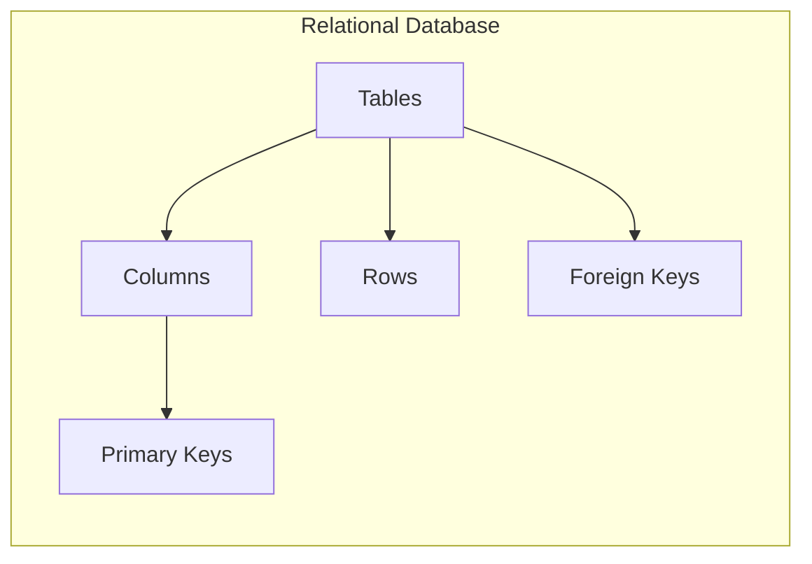
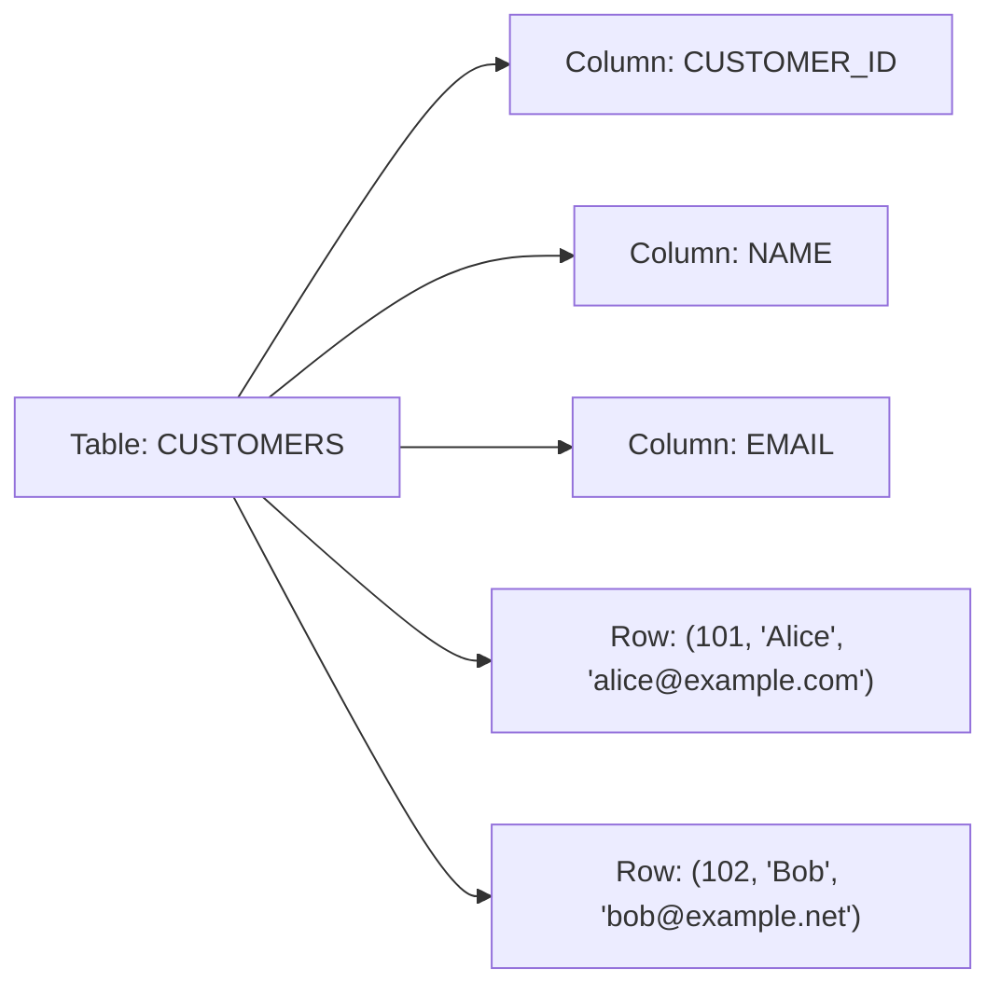
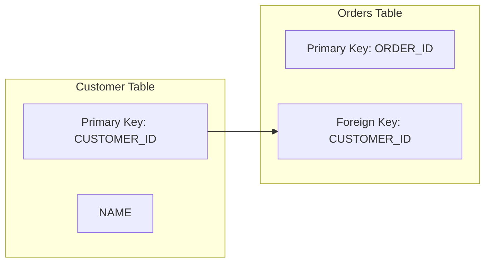
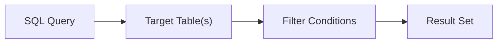
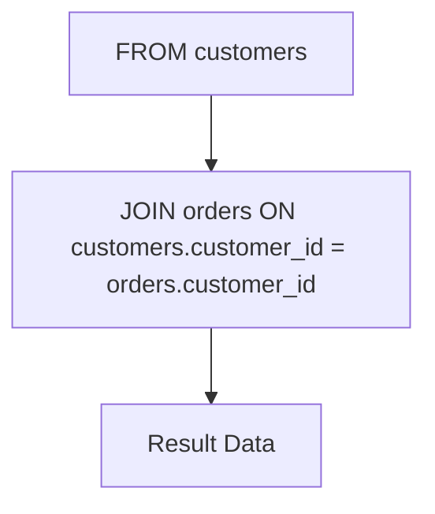
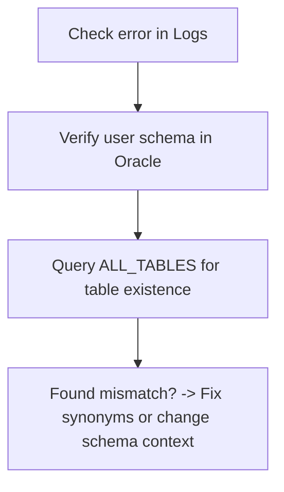
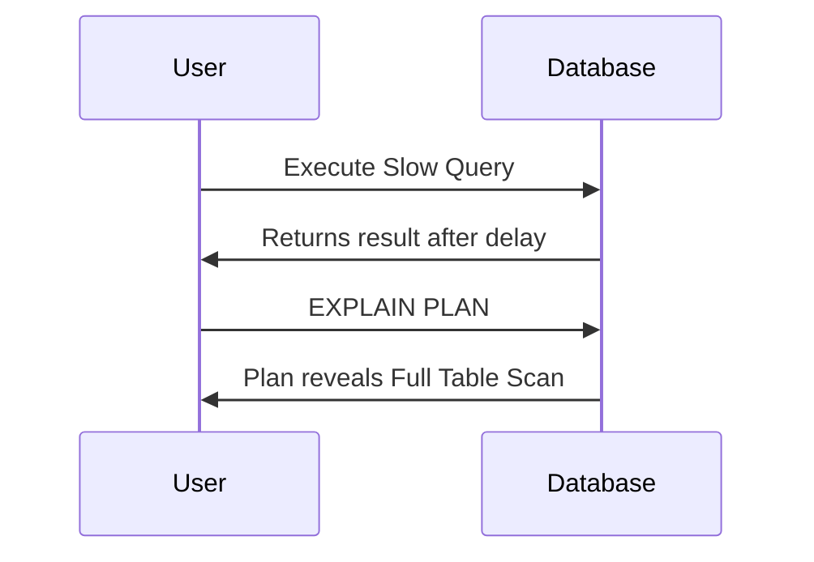
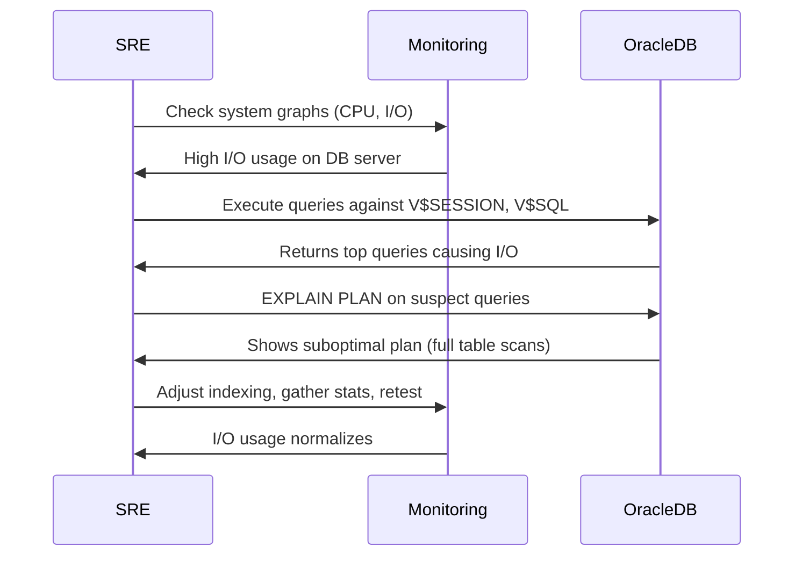

# 🚀 SRE Database Training Module – Day 1  

**Focus:** Core Relational Database Fundamentals (Oracle Emphasis)  

Below is a comprehensive Day 1 database training module developed according to the attached prompt . It follows a "brick by brick" approach, starting from foundational concepts of relational databases and progressively integrating more advanced, SRE-oriented topics. Oracle is emphasized throughout, with comparisons to PostgreSQL and SQL Server. Mermaid diagrams are used to illustrate concepts visually, adhering to the specified formatting guidelines.


---

## 📌 1. Introduction

Welcome to Day 1 of the SRE Database Training Module! Databases are at the core of nearly every mission-critical system. As a support engineer or SRE, your ability to understand, manage, and optimize these systems is essential for keeping applications reliable.

### Day 1 Content Overview
- **Relational Database Structure:** The fundamental building blocks (tables, columns, rows).
- **Keys and Constraints:** Primary keys, foreign keys, and relationships.
- **Core SQL Queries:** SELECT, FROM, WHERE for simple data retrieval.
- **Oracle Focus:** How Oracle differs from other SQL dialects, plus tools & techniques.
- **SRE Principles:** Monitoring, troubleshooting, and reliability insights woven into each topic.

### Why Oracle?
Oracle is one of the most widely adopted enterprise-level database systems. It offers robust performance, security features, and a mature ecosystem. Understanding Oracle not only helps you support existing infrastructure but also builds a foundation adaptable to other RDBMS platforms.

### Visual Concept Map
Below is a simple Mermaid diagram showing the high-level relationships in a typical database. It emphasizes the “brick by brick” approach—starting with fundamental objects and moving outward to more advanced features:



---

## 🎯 2. Learning Objectives by Tier

To ensure progression from beginner to SRE-level expertise, here are four measurable objectives per tier:

### 🟢 Beginner
1. **Identify** core database objects (tables, columns, rows) and define their roles.  
2. **Explain** the concept of primary keys and foreign keys using simple analogies.  
3. **Execute** basic SQL SELECT queries with simple WHERE filtering in Oracle.  
4. **Navigate** and connect to an Oracle database using common tools (SQL*Plus, SQL Developer).

### 🟡 Intermediate
1. **Compare** Oracle, PostgreSQL, and SQL Server syntax for basic queries and table design.  
2. **Implement** correct primary key and foreign key constraints in Oracle.  
3. **Use** Oracle data dictionary views to inspect schema objects.  
4. **Troubleshoot** basic Oracle errors and apply appropriate resolution steps.

### 🔴 SRE-Level
1. **Monitor** database performance using Oracle’s V$ views and explain plan outputs.  
2. **Optimize** SQL queries by interpreting execution plans and identifying bottlenecks.  
3. **Implement** backup/recovery techniques (RMAN, Flashback) with minimal downtime.  
4. **Design** robust systems with reliability, scalability, and SRE best practices in mind.

---

## 📚 3. Core Concepts

Relational database fundamentals set the stage for everything we do in Oracle. Below is a framework to guide our exploration of each concept:

1. **Beginner Analogy**  
2. **Visual Representation** (Mermaid)  
3. **Technical Explanation**  
4. **Support/SRE Application**  
5. **System Impact**  
6. **Common Misconceptions**  
7. **SQL Dialect Comparison**

These seven elements ensure we build knowledge methodically.

---

## 🏗️ 4. Day 1 Concept Breakdown

### 4.1 Relational Database Structure

#### 4.1.1 Concept Overview
A **relational database** organizes data into structures called **tables**. Each table has **columns** that define data attributes, and **rows** for each record.

#### 4.1.2 Real-World Analogy (🟢 Beginner)
Think of a spreadsheet:
- Each **tab** is like a database **table**.
- The **header row** is like the **columns** definition.
- Each subsequent **row** is a record of data.

#### 4.1.3 Visual Representation (Mermaid)


#### 4.1.4 Technical Explanation
- **Table:** A set of rows sharing a consistent set of columns.  
- **Column:** Defines the type of data (e.g., VARCHAR2, NUMBER).  
- **Row:** A single record in the table.

#### 4.1.5 Support/SRE Application
- Properly designed tables prevent data duplication and inconsistency.  
- Knowing table layouts is crucial for debugging incorrect query results and application issues.

#### 4.1.6 System Impact
- Well-structured tables improve performance and reduce confusion in data retrieval.  
- Poor structure can lead to heavy disk usage, slow queries, and complex troubleshooting.

#### 4.1.7 Common Misconceptions
- **“One big table for everything is simpler.”** Actually leads to performance and maintenance problems.  
- **“Column names don’t matter.”** Meaningful column names clarify query intent and reduce errors.

#### 4.1.8 SQL Dialect Comparison

| Feature                   | Oracle Example                         | PostgreSQL Example                   | SQL Server Example                    | Notes                                                 |
|---------------------------|----------------------------------------|--------------------------------------|----------------------------------------|-------------------------------------------------------|
| Create Table (Basic)      | `CREATE TABLE test (id NUMBER, name VARCHAR2(50));` | `CREATE TABLE test (id INT, name VARCHAR(50));` | `CREATE TABLE test (id INT, name VARCHAR(50));`        | Oracle uses `NUMBER` and `VARCHAR2`; others use `INT`, `VARCHAR`. |
| Column Data Type Examples | `VARCHAR2(100)`, `NUMBER`, `DATE`      | `VARCHAR(100)`, `INTEGER`, `DATE`    | `VARCHAR(100)`, `INT`, `DATETIME`      | Each system has its own data type nuances.            |

---

### 4.2 Primary Keys and Foreign Keys

#### 4.2.1 Concept Overview
- **Primary Key (PK):** A unique, non-null identifier for each row.  
- **Foreign Key (FK):** A reference to a primary key in another table, establishing relationships.

#### 4.2.2 Real-World Analogy (🟢 Beginner)
- **Primary Key:** Your unique **passport number** or **driver’s license**—it identifies you uniquely.  
- **Foreign Key:** A reference to that unique ID in another context, such as an **airline booking** referencing your passport number.

#### 4.2.3 Visual Representation (Mermaid)


#### 4.2.4 Technical Explanation
- A **primary key** enforces uniqueness, ensuring no duplicate records share the same ID.  
- A **foreign key** enforces referential integrity, ensuring records in a child table have a valid parent record.

#### 4.2.5 Support/SRE Application
- Missing or incorrect foreign keys can cause orphaned data and data integrity issues.  
- Primary key conflicts cause errors during inserts and can point to duplication logic problems in code.

#### 4.2.6 System Impact
- Proper keys reduce data anomalies and help the optimizer retrieve data efficiently.  
- Incorrect key definitions degrade performance and lead to inconsistent data.

#### 4.2.7 Common Misconceptions
- **“A primary key must always be a numeric ID.”** While commonly numeric, any unique, non-null column can serve as a PK (e.g., email address).  
- **“Foreign keys slow down inserts drastically.”** Proper indexing and structure keep overhead manageable.

#### 4.2.8 SQL Dialect Comparison

| Feature                 | Oracle Example                                                               | PostgreSQL Example                                                       | SQL Server Example                                                         | Notes                                                    |
|-------------------------|-----------------------------------------------------------------------------|--------------------------------------------------------------------------|----------------------------------------------------------------------------|----------------------------------------------------------|
| Create Table With PK    | `CREATE TABLE customers (customer_id NUMBER PRIMARY KEY, name VARCHAR2(50));` | `CREATE TABLE customers (customer_id SERIAL PRIMARY KEY, name VARCHAR(50));` | `CREATE TABLE customers (customer_id INT PRIMARY KEY, name VARCHAR(50));`   | PostgreSQL often uses `SERIAL`; Oracle uses sequences.   |
| Create Table With FK    | `CREATE TABLE orders (order_id NUMBER PRIMARY KEY, customer_id NUMBER REFERENCES customers(customer_id));` | `CREATE TABLE orders (order_id SERIAL PRIMARY KEY, customer_id INT REFERENCES customers(customer_id));` | `CREATE TABLE orders (order_id INT PRIMARY KEY, customer_id INT FOREIGN KEY REFERENCES customers(customer_id));` | Oracle’s foreign key references must match data types.   |
| Add Constraint Afterward| `ALTER TABLE orders ADD CONSTRAINT fk_cust FOREIGN KEY (customer_id) REFERENCES customers(customer_id);` | Same syntax except for data type differences.                            | Similar syntax, prefix `FOREIGN KEY` with `ALTER TABLE`.                    | Constraint names can be explicitly defined for clarity.  |

---

### 4.3 Basic SQL SELECT Statement

#### 4.3.1 Concept Overview
**SELECT** is the most fundamental SQL statement used to retrieve data from one or more tables.

#### 4.3.2 Real-World Analogy (🟢 Beginner)
- **SELECT** is like asking a library: *“Give me the books that match these criteria.”*

#### 4.3.3 Visual Representation (Mermaid)


#### 4.3.4 Technical Explanation
A basic SELECT statement in Oracle:
```sql
SELECT column_list
FROM table_name
WHERE conditions;
```

#### 4.3.5 Support/SRE Application
- Quickly verify if the database has the records that an application expects.  
- Identify data anomalies, missing rows, or unexpected duplicates.

#### 4.3.6 System Impact
- Complex SELECT queries or missing indexes can cause performance issues.  
- High concurrency can lead to locking, which affects overall reliability.

#### 4.3.7 Common Misconceptions
- **“SELECT * is always fine.”** It can hurt performance and clarity by retrieving unnecessary columns.

#### 4.3.8 SQL Dialect Comparison

| Clause    | Oracle                                   | PostgreSQL                              | SQL Server                               | Notes                                        |
|-----------|------------------------------------------|-----------------------------------------|-------------------------------------------|----------------------------------------------|
| SELECT    | `SELECT column1, column2 FROM table;`    | Identical                               | Identical                                 | Basic SELECT syntax is similar across RDBMS. |
| FROM      | `FROM table_name`                        | Same                                     | Same                                       | Table naming conventions can differ slightly.|
| WHERE     | `WHERE column = 'value'`                 | Same                                     | Same                                       | All support AND, OR, NOT.                    |

---

### 4.4 FROM Clause and Table Selection

#### 4.4.1 Concept Overview
The **FROM** clause specifies which table or tables data should be retrieved from. In multi-table queries, it also defines how tables are joined.

#### 4.4.2 Real-World Analogy (🟢 Beginner)
- **FROM** is the source of your data—like choosing which “store” to shop in.

#### 4.4.3 Visual Representation (Mermaid)


#### 4.4.4 Technical Explanation
- In single-table queries: `SELECT * FROM customers;`  
- In multi-table queries:  
  ```sql
  SELECT c.name, o.order_date
  FROM customers c
  JOIN orders o ON c.customer_id = o.customer_id;
  ```

#### 4.4.5 Support/SRE Application
- Knowing correct join syntax helps diagnose wrong or missing data in multi-table reports.  
- Reducing unnecessary joins can optimize query performance.

#### 4.4.6 System Impact
- Poor join conditions can cause performance bottlenecks and produce incorrect results.  
- Proper indexing on join columns is critical for speed.

#### 4.4.7 Common Misconceptions
- **“All joins are the same.”** Different join types (INNER, LEFT, RIGHT, FULL) yield different result sets.

---

### 4.5 WHERE Clause and Basic Filtering

#### 4.5.1 Concept Overview
The **WHERE** clause refines the result set by specifying conditions on columns.

#### 4.5.2 Real-World Analogy (🟢 Beginner)
- Filter your email inbox by **criteria**: unread, flagged, or from a specific person.

#### 4.5.3 Visual Representation (Mermaid)


#### 4.5.4 Technical Explanation
- **Equality condition:** `WHERE column = value`  
- **Range condition:** `WHERE column BETWEEN value1 AND value2`  
- **Pattern matching (Oracle):** `WHERE column LIKE '%text%'`

#### 4.5.5 Support/SRE Application
- Quickly diagnose application bugs that stem from incorrect or overly broad queries.  
- Combine with logs to verify the data subset an application is actually retrieving.

#### 4.5.6 System Impact
- Appropriate filtering reduces data transfer, improves performance, and lowers I/O.  
- Inefficient filters or lack of indexes can cause full-table scans, hurting performance.

#### 4.5.7 Common Misconceptions
- **“Indexes automatically apply to all WHERE conditions.”** Index usage depends on many factors, including data distribution and function usage.

---

## 🛠️ 5. Oracle-Specific Tools and Techniques

Oracle databases can be accessed and managed through various tools:

1. **SQL\*Plus:** A command-line interface for executing SQL and PL/SQL.  
2. **SQL Developer:** A graphical UI enabling queries, object browsing, and debugging.  
3. **Oracle Enterprise Manager:** Web-based, enterprise-level management, and monitoring suite.

### Oracle Data Dictionary Views
- **`ALL_TABLES`, `ALL_COLUMNS`:** Show tables and columns accessible to the user.  
- **`DBA_TABLES`, `DBA_USERS`:** DBA-level views with broader scope.  
- **`ALL_CONSTRAINTS`, `ALL_CONS_COLUMNS`:** For constraints and constraint columns.  

**Usage Example:**
```sql
SELECT table_name
FROM all_tables
WHERE owner = 'HR';
```
This example checks which tables belong to the `HR` schema.

---

## 🔍 6. Oracle Performance Monitoring and Execution Plans

### 6.1 Generating Execution Plans
Use `EXPLAIN PLAN` or the `AUTOTRACE` tool in SQL*Plus:
```sql
EXPLAIN PLAN FOR
SELECT c.name, o.order_date
FROM customers c
JOIN orders o ON c.customer_id = o.customer_id
WHERE c.region = 'North';
```

Then:
```sql
SELECT * FROM table(DBMS_XPLAN.DISPLAY);
```

### 6.2 Interpreting Key Plan Elements
- **TABLE ACCESS (FULL):** Full table scan (potentially expensive for large tables).  
- **INDEX RANGE SCAN:** More efficient if an index is used properly.  
- **NESTED LOOPS / HASH JOIN:** Describes how tables are joined.

### 6.3 Oracle Performance Views
- **`V$SESSION`:** Sessions connected to the database.  
- **`V$SQL`:** SQL statements in shared pool.  
- **`V$SYSTEM_EVENT`:** System-wide wait events.

### 6.4 SRE-Oriented Monitoring
- Automate retrieval of top SQL statements by CPU usage from `V$SQL`.  
- Use thresholds and alerts to detect performance anomalies early.

---

## 🔨 7. Hands-On Exercises

Below are exercises divided by tier. Each exercise uses Oracle commands but is adaptable to PostgreSQL or SQL Server with minimal syntax changes.

### 🟢 Beginner Exercises (3)

1. **Create a Simple Table**  
   - Create a table named `TEST_EMP` with columns `EMP_ID` (NUMBER) and `EMP_NAME` (VARCHAR2).  
   - Insert two rows and run a `SELECT` to verify.

2. **Identify Primary Key Usage**  
   - Add a primary key constraint on `EMP_ID`.  
   - Insert a duplicate row to see what error is raised.

3. **Basic Filtering**  
   - Run a `SELECT` statement with a `WHERE` clause to filter by `EMP_NAME`.  
   - Compare the result with `SELECT *` to see the difference.

### 🟡 Intermediate Exercises (3)

1. **Foreign Key Definition**  
   - Create `DEPT` and `EMP` tables.  
   - Reference `DEPT_ID` in `EMP` as a foreign key.  
   - Insert data and test how referential integrity behaves.

2. **Compare SQL Dialects**  
   - Write equivalent CREATE TABLE and SELECT statements in Oracle, PostgreSQL, and SQL Server.  
   - Note differences in data types and constraints.

3. **Data Dictionary Exploration**  
   - Query `ALL_TABLES` and `ALL_CONSTRAINTS` to list your newly created objects.  
   - Validate correct constraint definitions.

### 🔴 SRE-Level Exercises (3)

1. **Performance Monitoring**  
   - Use `EXPLAIN PLAN` to examine a complex join query.  
   - Identify if table scans or index scans are used.  
   - Provide recommendations on indexing strategies.

2. **Real-Time Monitoring**  
   - Check `V$SESSION` for active sessions.  
   - Correlate the sessions to top queries in `V$SQL`.  
   - Investigate potential bottlenecks.

3. **Recovery Simulation**  
   - Enable a small test environment.  
   - Use a small sample table, then drop it.  
   - Perform an Oracle **Flashback** operation (if enabled) to restore.  
   - Document each step and outcome.

---

## 🚧 8. Troubleshooting Scenarios

### Scenario 1: “Table Not Found” Error
**Symptoms:** Application logs show `ORA-00942: table or view does not exist`.  
**Cause:** User schema mismatch or missing synonyms.  
**Diagnostic Approach:**  

**Resolution:** Correct the schema reference or create a synonym.

---

### Scenario 2: Data Not Matching Between Orders and Customers
**Symptoms:** Some orders appear with a null `customer_id`.  
**Cause:** Foreign key constraint not enforced or missing.  
**Diagnostic Approach:**  
- Check for constraints in `ALL_CONSTRAINTS`.  
- If missing, add `FOREIGN KEY` and correct the data.  
**Resolution:** Enforce referential integrity and backfill correct `customer_id` values.

---

### Scenario 3: Slow Query Performance
**Symptoms:** Query takes several minutes to return data.  
**Cause:** Missing index or suboptimal plan.  
**Diagnostic Approach:**  

**Resolution:** Create or adjust indexes, gather table statistics, and ensure correct join types.

---

## ❓ 9. Frequently Asked Questions (FAQs)

### 🟢 Beginner FAQs
1. **How do I connect to Oracle for the first time?**  
   - Use SQL\*Plus or SQL Developer with credentials (`username/password@hostname:port/servicename`).

2. **What is the difference between a table and a schema?**  
   - A **schema** is a collection of objects (tables, views, etc.) owned by a user. A **table** is a single object.

3. **Can I name a column anything I want?**  
   - Yes, but avoid keywords and use meaningful names to reduce confusion.

### 🟡 Intermediate FAQs
1. **Do I need to create indexes for every column?**  
   - No. Focus on columns used often in **WHERE** clauses or **JOIN** conditions.

2. **Why does Oracle use `NUMBER` instead of `INT`?**  
   - Oracle’s `NUMBER` is a flexible data type supporting various precisions. It’s more generalized than `INT`.

3. **How do I troubleshoot a locked table?**  
   - Check `V$SESSION` and `V$LOCK`, see which session holds the lock, and decide if a kill or wait is necessary.

### 🔴 SRE-Level FAQs
1. **How do I debug concurrency issues at peak loads?**  
   - Use Oracle’s performance views (`V$ACTIVE_SESSION_HISTORY`, `V$SQLAREA`) and watch for blocking sessions or hotspots.

2. **What is the significance of AWR (Automatic Workload Repository)?**  
   - AWR collects performance statistics. SREs analyze these to identify trends and regressions.

3. **How do I handle ORA-600 or internal Oracle errors?**  
   - These are serious internal errors. Collect trace files, open a Support ticket with Oracle, and provide all relevant logs.

---

## 🔥 10. Oracle-Specific SRE Scenario

### Detailed Incident Scenario

**Incident:** Sudden spike in response times on a critical order-entry system.  

**Situation:**  
- Users complain of timeouts.  
- Preliminary analysis shows high I/O on the Orders table.  



**Specific Oracle Commands and Outputs**  
```sql
-- Identify top I/O consuming queries:
SELECT sql_text, disk_reads
FROM v$sql
ORDER BY disk_reads DESC FETCH FIRST 5 ROWS ONLY;

-- Analyze execution plan for the top query:
EXPLAIN PLAN FOR
<top query from above>;

SELECT * FROM table(DBMS_XPLAN.DISPLAY);
```
**Outcome:**  
- After indexing on the specific columns and gathering table statistics, the query plan used an index range scan instead of a full table scan. Response times returned to normal, and user complaints ceased.

**SRE Principles Demonstrated:**  
- Monitoring for anomalies.  
- Iterative troubleshooting.  
- Implementation of a fix (indexing).  
- Post-fix validation.

---

## 🧠 11. Key Takeaways

1. **Core Concepts Matter:** Understand tables, keys, and basic queries thoroughly to avoid fundamental errors.  
2. **Oracle Focus:** Leverage data dictionary views, specialized tools, and performance features for deeper insight.  
3. **Reliability is Key:** Even simple operations can cause major downtime if not carefully managed.  
4. **SQL Differences Exist:** Oracle, PostgreSQL, SQL Server share similar fundamentals but differ in syntax and features.  
5. **SRE Mindset:** Always consider monitoring, performance, and troubleshooting in every action.

---

## 🚨 12. Oracle Career Protection Guide

1. **High-Risk Operations:**  
   - **Dropping tables** or entire schemas without backups.  
   - **Running large DELETE/UPDATE** without WHERE clauses.  
   - **Modifying system parameters** without planning.

2. **Recovery Strategies:**  
   - **RMAN (Recovery Manager):** Backs up and restores entire databases.  
   - **Flashback Technologies:** Quickly revert changes to tables or even the entire database to a point in time.

3. **Verification Best Practices:**  
   - Always run queries with `WHERE rownum <= <small_number>` to preview.  
   - Use test environments for major changes.

4. **Day One Safeguards:**  
   - Confirm you have an **up-to-date backup** or a tested restore procedure.  
   - Keep a script log of all commands run.  
   - Familiarize yourself with data dictionary views to check the impact of your actions.

---

## 🔮 13. Preview of Next Day’s Content

On Day 2, we will dive deeper into:
- **Complex Joins and Subqueries**  
- **Indexing Strategies (B-Tree, Bitmap, Function-based)**  
- **Transaction Management (ACID, COMMIT, ROLLBACK)**  
- **Advanced Oracle Features (PL/SQL, Packages, Procedures)**  

We’ll build on today’s foundation, moving further into the world of database reliability, optimization, and advanced Oracle-specific operations.

---

## Closing Remarks

Congratulations on completing Day 1! Today, you have laid a strong foundation in relational database concepts, focusing on Oracle’s unique functionalities and comparing them with other popular RDBMS platforms. These fundamentals are critical for any SRE or support engineer tasked with maintaining reliable and high-performing systems.

Use what you learned today to:
- Create and query tables confidently.  
- Implement primary and foreign keys correctly.  
- Prepare for real-world Oracle troubleshooting and performance tuning.  

Stay curious, keep practicing, and get ready for an even deeper dive into the heart of Oracle and advanced database operations on Day 2!

---

**Document deriveed prompt citeturn0file0**