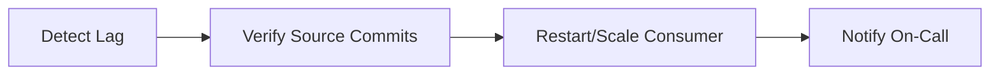
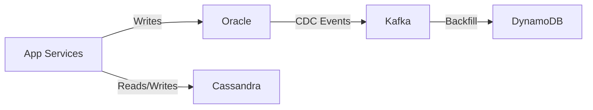
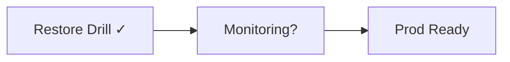
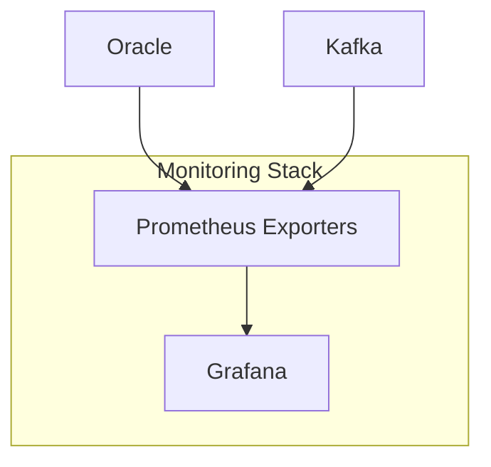
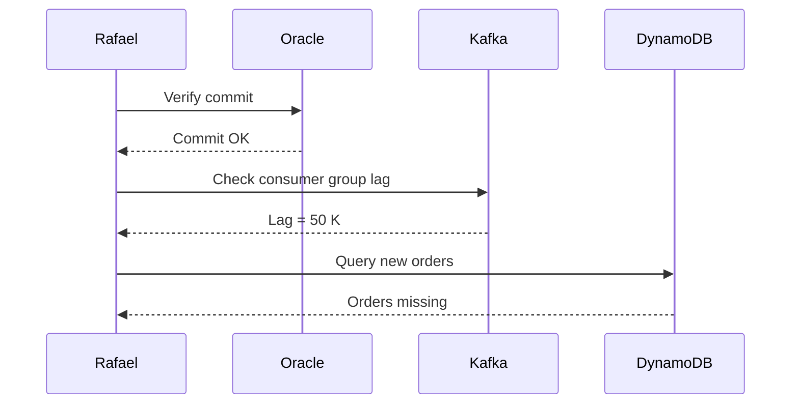
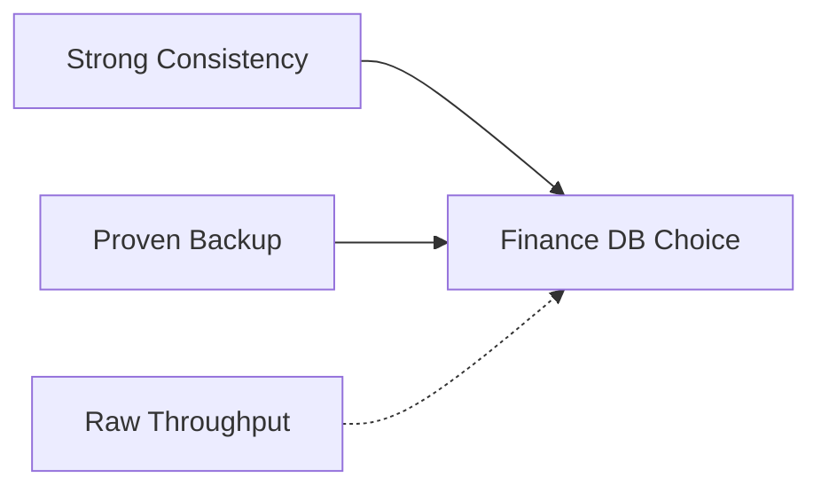

# **Day 10 Answer Sheet**

## Answer 1: Multi‑Database Incident Basics  
🔍 Beginner‑Level | Multiple Choice  

**Question:**  
Rafael likens a polyglot outage to a “circus where every performer juggles a different fire torch.” Which challenge does this analogy highlight?  

A. All databases always share the same backup window  
B. Coordinating different failure modes and data timeliness across databases  
C. Redis always loses data before Oracle in an outage  
D. Every database can be monitored with a single exporter  

**Correct Answer:** **B**

**Explanation:**  
The analogy underscores the chaos of managing divergent failure patterns, replication lags, and recovery timelines across heterogeneous databases during the same incident.

**Why other options are incorrect:**  
- **A:** Backup windows may differ, but that is not the core “circus” problem.  
- **C:** Redis is not guaranteed to fail first; outage impact varies by workload.  
- **D:** A single exporter cannot surface deep tech‑specific metrics.  

**Database Comparison Note:** Oracle may stall on row‑locks, while Cassandra degrades with tombstones; synchronising such mismatched behaviours is the real juggling act.  

**Knowledge Connection:** Mirrors Rafael’s opening story where Oracle, Cassandra, and Kafka each “dropped” data differently.  

**SRE Perspective:** Build composite runbooks so on‑call engineers diagnose cross‑DB issues holistically, not sequentially.  

**Additional Insight:** Adopt an event‑bus (Kafka/CDC) to provide a consistent replay mechanism when one juggler drops the torch.  

**Visual Explanation:** *Not required*  

---

## Answer 2: Source‑of‑Truth Identification  
🔍 Beginner‑Level | Multiple Choice  

**Question:**  
During the Day 10 opening incident, which system had to be trusted first when order data diverged?  

A. Cassandra catalog  
B. Kafka replay topic  
C. Oracle OLTP database  
D. Redis cache  

**Correct Answer:** **C**

**Explanation:**  
Oracle held the transactional record of orders with ACID guarantees, making it the authoritative source to reconcile other stores.

**Why other options are incorrect:**  
- **A:** The catalog lacked completeness for orders.  
- **B:** Kafka could replay but still relied on Oracle‑originated events.  
- **D:** Cache may contain stale entries.  

**Database Comparison Note:** In hybrid stacks, an ACID RDBMS often functions as system‑of‑record; eventual‑consistent stores mirror it asynchronously.  

**Knowledge Connection:** Matches Rafael’s phrase “Oracle is my ledger of truth; everyone else syncs to it.”  

**SRE Perspective:** Always document which datastore is authoritative per domain to shorten RCA time.  

**Additional Insight:** Store the authoritative DB identifier in event payloads to enable idempotent downstream updates.  

**Visual Explanation:** *Not required*  

---

## Answer 3: Event‑Driven Bridge  
🔍 Beginner‑Level | Fill‑in‑the‑Blank  

**Question:**  
In Rafael’s hybrid stack, **Kafka** acts primarily as the ________ between relational and NoSQL databases, decoupling write paths and enabling replay.  

A. primary OLTP store  
B. integration bus  
C. archival backup tier  
D. schema registry  

**Correct Answer:** **B – integration bus**

**Explanation:**  
Kafka buffers change events, letting producers commit independently while consumers replay at their own pace, thereby bridging SQL and NoSQL worlds.

**Why other options are incorrect:**  
- **A:** Oracle, not Kafka, is the OLTP store.  
- **C:** Kafka provides retention but is not a long‑term backup platform.  
- **D:** Confluent Schema Registry is a separate component.  

**Database Comparison Note:** Debezium for Oracle CDC and Kafka Connect for DynamoDB both rely on Kafka as the transport layer.  

**Knowledge Connection:** Reflects Rafael’s “Kafka = polyglot glue” mantra.  

**SRE Perspective:** Monitor consumer lag to ensure this “glue” doesn’t quietly unstick.  

**Additional Insight:** Partition topics by business key to simplify targeted replays.  

**Visual Explanation:** *Not required*  

---

## Answer 4: Backup Drill Schedule  
🔍 Beginner‑Level | Multiple Choice  

**Question:**  
Rafael’s **Polyglot Commandments** demand running restore drills at least how often?  

A. Monthly  
B. Quarterly  
C. Bi‑annually  
D. Only after an incident  

**Correct Answer:** **B**

**Explanation:**  
Quarterly restore drills validate that backups remain usable and that operators retain muscle memory, striking a balance between diligence and effort.

**Why other options are incorrect:**  
- **A:** Monthly is good but not explicitly required.  
- **C:** Six‑month gaps risk stale runbooks.  
- **D:** Waiting for incidents defeats proactive resilience.  

**Database Comparison Note:** For DynamoDB, table‑level restores must also be exercised quarterly to verify IAM and point‑in‑time settings.  

**Knowledge Connection:** Direct from Commandment #6: “Every DB must have a **tested** backup & restore.”  

**SRE Perspective:** Schedule restore drills as change‑controlled activities to avoid production clashes.  

**Additional Insight:** Alternate full‑cluster and targeted‑table restores to cover both extremes.  

**Visual Explanation:** *Not required*  

---

## Answer 5: Monitoring Dashboards  
🔍 Beginner‑Level | True/False  

**Question:**  
True or False: Rafael insists on separate Grafana dashboards for each database to avoid clutter.  

A. True  
B. False  

**Correct Answer:** **B – False**

**Explanation:**  
Rafael advocates a **single consolidated dashboard** so correlations across Oracle, Cassandra, and Kafka appear side‑by‑side during incidents.

**Database Comparison Note:** Shared panels let teams overlay Oracle wait events with Kafka lag, exposing causal chains.  

**Knowledge Connection:** Rafael’s tip: “Separate dashboards mean separate pagers.”  

**SRE Perspective:** Consolidated views reduce MTTR and paging war‑rooms.  

**Additional Insight:** Use templating variables in Grafana to switch databases within one panel instead of duplicating.  

**Visual Explanation:** *Not required*  

---

## Answer 6: Scaling Strategies  
🔍 Beginner‑Level | Matching  

**Question:**  
Match each technology with its *default* scaling model.  

Column A → Column B  
1. Oracle    → **C**  
2. Cassandra → **B**  
3. DynamoDB → **A**  

**Correct Matches:**  
1 – C Primarily vertical plus partitioning  
2 – B Horizontal node expansion  
3 – A Auto‑scaling throughput tiers  

**Explanation:**  
Oracle traditionally scales by adding CPU/RAM or sharding; Cassandra spreads data across more nodes; DynamoDB autoscales provisioned or on‑demand capacity.  

**Database Comparison Note:** Horizontal scaling in Cassandra demands consistent hashing; Oracle sharding requires global services catalog.  

**Knowledge Connection:** Covered in Rafael’s “scale knobs” table.  

**SRE Perspective:** Factor scaling model into capacity‑planning budgets—node count vs. license cost.  

**Additional Insight:** Mix models: keep Oracle small but feed writes through horizontally scalable Kafka to absorb bursts.  

**Visual Explanation:** *Not required*  

---

## Answer 7: Consumer Lag Threshold  
🔍 Beginner‑Level | Ordering  

**Question:**  
Arrange Rafael’s lag triage steps in order:  

A. Restart or scale stuck consumer  
B. Inspect Kafka consumer group offsets  
C. Verify Oracle commit success  
D. Notify on‑call channel of lag root cause  

**Correct Order:** **B, C, A, D**

**Explanation:**  
First confirm lag (B), then ensure the source commits exist (C). If data is present, remediate the consumer (A). Finally, communicate findings (D).

**Database Comparison Note:** Postgres logical replication follows similar diagnose‑source‑then‑consumer flow.  

**Knowledge Connection:** Aligns with Rafael’s incident playbook flowchart.  

**SRE Perspective:** Broadcasting after remediation avoids alert noise and focuses discussion on actionables.  

**Additional Insight:** Automate a chatbot to post offset graphs when step B detects ≥ 10 K backlog.  

**Visual Explanation:**  

---

## Answer 8: Hybrid Architecture Diagram  
🧩 Intermediate‑Level | Diagram‑Based  

**Question:**  

According to Rafael, which component **decouples** Oracle from NoSQL back‑ends in this flow?  

A. App Services  
B. Oracle  
C. Kafka  
D. DynamoDB  

**Correct Answer:** **C**

**Explanation:**  
Kafka ingests Oracle change‑data‑capture events, buffering them for asynchronous consumption by DynamoDB (and others), thereby isolating transactional writes from NoSQL ingestion speed.

**Why other options are incorrect:**  
- **A:** App services still couple writes directly to Oracle.  
- **B:** Oracle is the producer, not the decoupler.  
- **D:** DynamoDB is a downstream consumer.  

**Database Comparison Note:** Similar CDC pipelines use Debezium + Kafka for MySQL, or GoldenGate for Oracle.  

**Knowledge Connection:** Matches Rafael’s “Kafka as shock absorber” metaphor.  

**SRE Perspective:** Track *end‑to‑end lag* between Oracle SCN and DynamoDB timestamp to validate the decoupling still meets SLA.  

**Additional Insight:** Attach a schema registry to the CDC topic to version payloads.  

**Visual Explanation:** *Original diagram retained above*  

---

## Answer 9: Stuck Offset War Story  
🧩 Intermediate‑Level | Multiple Choice  

**Question:**  
In Rafael’s “Kafka consumer freeze” incident, what primary metric revealed the problem?  

A. Oracle buffer cache hit ratio  
B. Cassandra tombstone count  
C. Kafka consumer lag  
D. DynamoDB provisioned throughput  

**Correct Answer:** **C**

**Explanation:**  
A plateauing consumer‑lag graph exposed that the consumer offset stopped advancing despite incoming messages, pointing to a stalled worker.

**Why other options are incorrect:**  
- **A, B, D:** These metrics did not surface the streaming bottleneck.  

**Database Comparison Note:** Similar lag alarms exist for Kinesis (IteratorAge) or Pulsar (Backlog).  

**Knowledge Connection:** Echoes Rafael’s Commandment #1 “If it streams, it breaks silently.”  

**SRE Perspective:** Alert on lag derivative (rate of change) to catch freezes faster than absolute thresholds.  

**Additional Insight:** Implement a liveness probe on consumers to auto‑restart if no offset progress in N minutes.  

**Visual Explanation:** *Not required*  

---

## Answer 10: Backup Methods Comparison  
🧩 Intermediate‑Level | Multiple Choice  

**Question:**  
Which pairing correctly matches *technology → recommended backup approach*?  

A. Oracle → nodetool snapshot  
B. Cassandra → RMAN  
C. Kafka → cross‑broker topic replication  
D. DynamoDB → physical filesystem copy  

**Correct Answer:** **C**

**Explanation:**  
Kafka’s durability relies on multi‑broker replication; snapshots like nodetool or RMAN are irrelevant.  

**Why other options are incorrect:**  
- **A:** nodetool is Cassandra’s snapshot utility.  
- **B:** RMAN is Oracle’s native backup tool.  
- **D:** DynamoDB is managed; filesystem copies are impossible.  

**Database Comparison Note:** In Kafka, mirror‑maker or cluster replication ensures topic redundancy akin to RAID for logs.  

**Knowledge Connection:** Referenced in Rafael’s backup matrix.  

**SRE Perspective:** Retain at least three replicas and verify ISR (in‑sync replica) count daily.  

**Additional Insight:** Use cluster‑to‑cluster replication for geo‑redundancy.  

**Visual Explanation:** *Not required*  

---

## Answer 11: Polyglot Commandment Focus  
🧩 Intermediate‑Level | True/False  

**Question:**  
True or False: One of Rafael’s commandments states **“If it streams, it breaks silently—monitor the lag.”**  

A. True  
B. False  

**Correct Answer:** **A – True**

**Explanation:**  
Lag is a silent symptom of consumer stalls; monitoring it reveals hidden replication backlog before data loss surfaces.

**Database Comparison Note:** Similar concept in CDC pipelines across Debezium, Snowflake Snowpipe, etc.  

**Knowledge Connection:** Directly quoted from Commandment #1.  

**SRE Perspective:** Include lag SLIs in error‑budget calculations.  

**Additional Insight:** Correlate lag spikes with partition‑rebalance events to identify root causes.  

**Visual Explanation:** *Not required*  

---

## Answer 12: Role Summary Grid  
🧩 Intermediate‑Level | Fill‑in‑the‑Blank  

**Question:**  
Rafael’s grid lists **Redis** as ideal for ________ because of in‑memory speed and advanced data structures.  

A. ACID ledger entries  
B. long‑term analytics storage  
C. caching and ephemeral data  
D. multi‑document joins  

**Correct Answer:** **C – caching and ephemeral data**

**Explanation:**  
Redis excels at microsecond reads/writes and TTL keys, perfect for session or leaderboard caching.

**Why other options are incorrect:**  
- **A:** Redis lacks durable ACID semantics.  
- **B:** RAM is too costly for long retention.  
- **D:** Redis offers hashes/sets but not rich join semantics.  

**Database Comparison Note:** Memcached provides similar caching but fewer data structures.  

**Knowledge Connection:** Seen in Rafael’s grid line “Redis: speed, advanced structures, memory‑bound.”  

**SRE Perspective:** Watch eviction rate metrics to avoid surprise data loss.  

**Additional Insight:** Enable Redis persistence (AOF/RDB) only when you need warm‑cache survivability.  

**Visual Explanation:** *Not required*  

---

## Answer 13: Production‑Readiness Flow  
🧩 Intermediate‑Level | Multiple Choice  

**Question:**  
According to Rafael’s readiness flowchart, which verification **must** occur immediately after confirming a *quarterly restore drill* is complete?  

A. Monitoring & observability in place  
B. Demo of failover DNS switch‑over  
C. Disaster‑recovery budget approval  
D. Developer sign‑off on schema design  

**Correct Answer:** **A**

**Explanation:**  
The flowchart proceeds from restore‑drill success to ensuring observability before granting production sign‑off.

**Why other options are incorrect:**  
- **B, C, D:** Valuable, but appear later or outside the depicted flow.  

**Database Comparison Note:** Observability must cover both backup and restore metrics (snapshot age, restore duration).  

**Knowledge Connection:** Matches the Mermaid flowchart in section 7.  

**SRE Perspective:** An unmonitored backup is indistinguishable from no backup.  

**Additional Insight:** Automate alerts on backup age exceeding RPO.  

**Visual Explanation:** *Supplementary readiness mini‑flow*  

---

## Answer 14: Monitoring Stack Diagram  
💡 Advanced/SRE‑Level | Diagram‑Based  

**Question:**  

Which SRE metric is **MOST** critical for Kafka in this diagram when ensuring cross‑database consistency?  

A. Log‑compaction byte rate  
B. Consumer group lag  
C. Oracle wait events  
D. Grafana dashboard refresh rate  

**Correct Answer:** **B**

**Explanation:**  
Consumer lag directly indicates whether Kafka data is caught up with producers like Oracle, impacting downstream consistency.

**Why other options are incorrect:**  
- **A:** Important for retention, but not immediate consistency.  
- **C:** Oracle metric, not Kafka.  
- **D:** Dashboard refresh rate doesn’t affect data flow.  

**Database Comparison Note:** In Pulsar, equivalent metric is “subscription backlog.”  

**Knowledge Connection:** Rafael’s alert rule: “Lag > 10 K triggers red.”  

**SRE Perspective:** Combine lag with 99th‑percent latency SLI to reflect user impact.  

**Additional Insight:** Alert on *stalled lag* (zero progress) faster than on size alone.  

**Visual Explanation:** *Original diagram retained above*  

---

## Answer 15: Failure Mode Analysis  
💡 Advanced/SRE‑Level | Multiple Choice  

**Question:**  
Rafael highlights **Cassandra tombstone overload** as a common failure. Which symptom typically precedes a tombstone‑related crash?  

A. Rapid increase in Oracle redo log size  
B. Dramatic drop in read latency due to key cache hits  
C. Spike in read latency accompanied by “tombstone_warn_threshold” alerts  
D. Kafka broker disk‑full error  

**Correct Answer:** **C**

**Explanation:**  
Excess tombstones force Cassandra to scan deleted rows, ballooning read latency and triggering threshold warnings.

**Why other options are incorrect:**  
- **A, D:** Unrelated to Cassandra.  
- **B:** Latency rises, not drops.  

**Database Comparison Note:** MongoDB faces similar issues with orphaned documents and fragmented indexes.  

**Knowledge Connection:** Pointed out in Rafael’s “tombstone Time‑bomb” war story.  

**SRE Perspective:** Set guardrails on delete‑heavy workloads or TTL tables.  

**Additional Insight:** Periodic `nodetool cleanup` removes expired tombstones sooner.  

**Visual Explanation:** *Not required*  

---

## Answer 16: Unified Alerting Commandment  
💡 Advanced/SRE‑Level | Fill‑in‑the‑Blank  

**Question:**  
Rafael warns that separate alert pipelines can delay root cause identification. Therefore, he mandates routing **all critical alerts** to ________.  

A. individual DB‑owner email lists  
B. a single on‑call channel (e.g., Slack #sre‑alert)  
C. separate Grafana panels  
D. SMS only  

**Correct Answer:** **B – a single on‑call channel**

**Explanation:**  
Centralised alerting ensures cross‑team visibility and faster correlation between disparate database alarms.

**Why other options are incorrect:**  
- **A, C, D:** Fragment the signal or limit context.  

**Database Comparison Note:** PagerDuty or OpsGenie often integrate that unified channel.  

**Knowledge Connection:** Commandment #9 “Observe everything in one stream.”  

**SRE Perspective:** Shared context slashes “alert ping‑pong.”  

**Additional Insight:** Tag alerts with `db=oracle` etc. to retain specificity while sharing the pipe.  

**Visual Explanation:** *Not required*  

---

## Answer 17: Incident Sequence Diagram  
💡 Advanced/SRE‑Level | Diagram‑Based  

**Question:**  

Based on this sequence, what is Rafael’s **next** recommended action?  

A. Roll back Oracle commits  
B. Increase DynamoDB write capacity  
C. Restart or scale the stuck Kafka consumer  
D. Disable Oracle archive logging  

**Correct Answer:** **C**

**Explanation:**  
Oracle commits succeeded; lag shows Kafka consumers aren’t processing events into DynamoDB. Restarting/scaling consumers unblocks ingestion.

**Why other options are incorrect:**  
- **A:** Oracle is correct.  
- **B:** Write‑capacity isn’t yet the bottleneck.  
- **D:** Logging change doesn’t affect lag.  

**Database Comparison Note:** In Kinesis, similar remedy is to increase shard‑consumer count.  

**Knowledge Connection:** Replicates Rafael’s incident sequence in section 8.  

**SRE Perspective:** Automate consumer self‑healing on offset‑stalled alerts.  

**Additional Insight:** Record exact lag offset before restart to verify catch‑up.  

**Enhanced Visual Explanation:** *Original diagram retained; optional extra omitted*  

---

## Answer 18: Multi‑DB Monitoring Match  
💡 Advanced/SRE‑Level | Matching  

**Question:**  
Match each technology with the **key SRE metric** Rafael tracks.  

**Correct Matches:**  
1. Oracle – **C** Row lock wait events  
2. Kafka  – **A** Consumer lag (messages)  
3. Cassandra – **B** Read/write timeout rate  

**Explanation:**  
Row‑lock waits signal Oracle contention; consumer lag indicates Kafka pipeline health; timeouts expose Cassandra consistency issues.

**Database Comparison Note:** For DynamoDB, the cognate metric is `ThrottledRequests`.  

**Knowledge Connection:** Derived from Rafael’s Grafana examples.  

**SRE Perspective:** Surface these metrics in a single dashboard for quick drill‑downs.  

**Additional Insight:** Combine metrics into a red‑amber‑green (RAG) heatmap for NOC use.  

**Visual Explanation:** *Not required*  

---

## Answer 19: Restore‑Drill Ordering  
💡 Advanced/SRE‑Level | Ordering  

**Question:**  
Arrange the following **restore‑drill** steps in correct order:  

A. Validate data consistency post‑restore  
B. Perform simulated production restore in staging  
C. Capture and archive backup artifacts  
D. Document findings and update runbook  

**Correct Order:** **C, B, A, D**

**Explanation:**  
First secure backup artifacts (C), then execute the staged restore (B). Validate correctness (A) and finally document lessons (D).

**Database Comparison Note:** Oracle RMAN restores include checksum validation (step A) before archive logs are deleted.  

**Knowledge Connection:** Matches Rafael’s quarterly drill procedure.  

**SRE Perspective:** Include timing metrics during step B to benchmark RTO.  

**Additional Insight:** Inject random corruption into backup set to test step A rigorously.  

**Visual Explanation:** *Not required*  

---

## Answer 20: Polyglot Decision Matrix  
💡 Advanced/SRE‑Level | Multiple Choice  

**Question:**  
Multiple databases offer different strengths. Which option **best** represents Rafael’s **decision matrix** priority for *regulatory‑grade financial data*?  

A. Horizontal scalability over ACID transactions  
B. Low ops overhead over strict consistency  
C. Strong consistency & backup maturity over raw throughput  
D. Flexible schema over predictable latency  

**Correct Answer:** **C**

**Explanation:**  
Financial systems demand audit‑grade durability and recoverability; throughput can be optimised later but correctness is mandatory.

**Why other options are incorrect:**  
- **A, B, D:** Sacrifice critical compliance requirements.  

**Database Comparison Note:** Oracle or CockroachDB often win such evaluations; Cassandra may not unless tuned for quorum writes and backups.  

**Knowledge Connection:** Rafael’s “Reg‑grade → pick the safest ledger first” advice.  

**SRE Perspective:** Enforce quarterly restore drills and dual‑site replication to satisfy regulators.  

**Additional Insight:** Use append‑only tables or blockchain‑style hashing to add tamper‑evidence to financial ledgers.  

**Visual Explanation:**  

---

**End of Day 10 Answer Sheet**