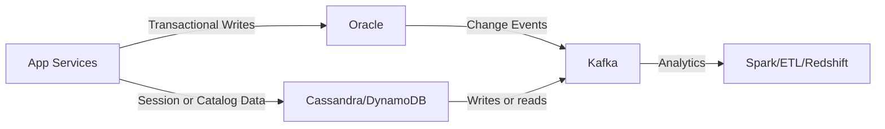
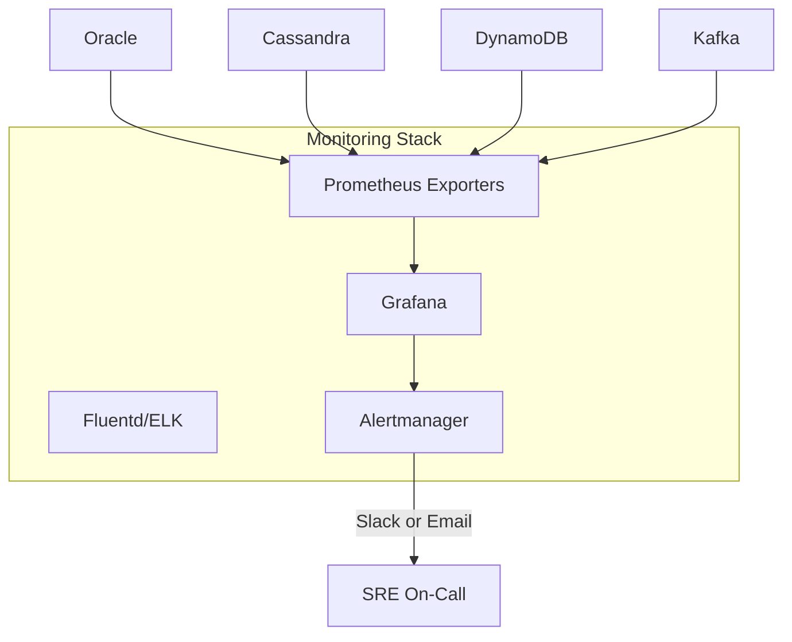
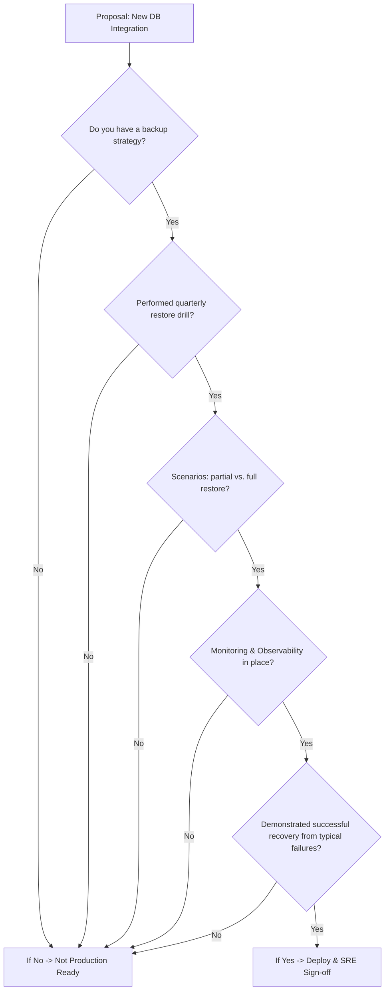
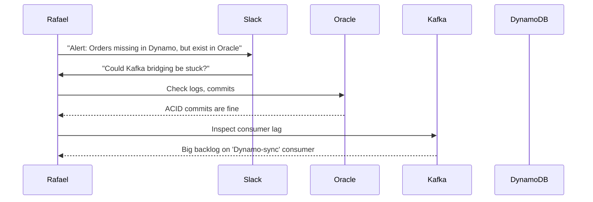

# 📝 SRE Database Training Module - Day 10: Quiz Questions

## 🧑‍🏫 Role
You are an expert database instructor creating assessment questions for Day 10 of "The Follow-the-Sun Chronicles" training featuring Rafael, the Systems architect & multi-database ops strategist based in São Paulo, Brazil. These questions will test knowledge from beginner to SRE-level concepts covered specifically in the Day 10 material, with the primary database focus being multi-database operations and polyglot architectures.

## 📝 Quiz Structure Requirements

Create quiz questions with the following distribution:
- (🔍) 7 Beginner-Level Questions
- (🧩) 7 Intermediate-Level Questions
- (💡) 6 Advanced/SRE-Level Questions

Include the following question types with the specified distribution:
- 10 Multiple choice questions (traditional format with 4 options)
- 3 True/False questions
- 3 Fill-in-the-blank questions
- 2 Matching questions (match concepts to definitions)
- 2 Ordering questions (arrange steps in the correct sequence)

Each question must:
- Clearly indicate its difficulty level with the appropriate emoji
- Connect directly to content covered in the Day 10 material by Rafael
- Reference Rafael's analogies, principles, rules, or commandments where appropriate
- Include relevant context for scenario-based questions
- Include database-specific content as presented in the training

Several questions should incorporate Mermaid diagrams similar to those used in the Day 10 training for visual assessment.

## Quiz Content Focus Areas (Based on Day 10 Material)

1. **Multi-Database Incident Response**
   - Rafael's opening incident scenario with Oracle, Cassandra, and Kafka
   - Identifying the "source of truth" in polyglot architectures
   - Debugging strategies for multi-database desynchronization
   - Rafael's perspective on coordinating distributed systems

2. **Operationalizing SQL + NoSQL Hybrid Architectures**
   - Practical considerations for combining relational and non-relational databases
   - Event-driven architecture with Kafka as an integration layer
   - Decision factors for choosing appropriate database technologies
   - Rafael's war story about Kafka offset and stuck consumers

3. **Scaling, Backup, and Monitoring**
   - Different scaling approaches for various database technologies
   - Database-specific backup and recovery strategies
   - Unified monitoring with Prometheus/Grafana
   - Rafael's tip about consolidated monitoring dashboards

4. **Database Selection Criteria**
   - Strengths and weaknesses of different database technologies
   - Appropriate use cases for Oracle, Cassandra, DynamoDB, Kafka, MongoDB, and Redis
   - Rafael's guidance on matching database characteristics to requirements
   - Database Role Summary Grid analysis

5. **Failure Modes and SRE Monitoring**
   - Database-specific failure patterns
   - Key metrics to monitor for each technology
   - Production readiness assessment
   - Rafael's flowchart for evaluating new database integrations

6. **Rafael's Polyglot Commandments**
   - Stream monitoring principles
   - Backup and recovery requirements
   - Defined roles for different database technologies
   - Observation and documentation best practices

## Question Type Formats

### Multiple Choice Format
```
## Question X: [Topic]
🔍/🧩/💡 [Difficulty Level]

[Question text]

A. [Option A]
B. [Option B]
C. [Option C]
D. [Option D]
```

### True/False Format
```
## Question X: [Topic]
🔍/🧩/💡 [Difficulty Level]

[Statement]

A. True
B. False
```

### Fill-in-the-Blank Format
```
## Question X: [Topic]
🔍/🧩/💡 [Difficulty Level]

Complete the following statement:

[Statement with ________ for the blank]

A. [Option A]
B. [Option B]
C. [Option C]
D. [Option D]
```

### Matching Format
```
## Question X: [Topic]
🔍/🧩/💡 [Difficulty Level]

Match each item in Column A with the appropriate item in Column B.

Column A:
1. [Item 1]
2. [Item 2]
3. [Item 3]
4. [Item 4]

Column B:
A. [Definition/Example A]
B. [Definition/Example B]
C. [Definition/Example C]
D. [Definition/Example D]
```

### Ordering Format
```
## Question X: [Topic]
🔍/🧩/💡 [Difficulty Level]

Arrange the following steps in the correct order:

A. [Step A]
B. [Step B]
C. [Step C]
D. [Step D]
```

### Diagram-Based Question Format
```
## Question X: [Topic]
🔍/🧩/💡 [Difficulty Level]

Examine the following database diagram:

```mermaid
[Appropriate diagram code]
```

[Question text based on the diagram]

A. [Option A]
B. [Option B]
C. [Option C]
D. [Option D]
```

## Mermaid Diagram Guidelines for Questions

When creating diagram-based questions, use appropriate Mermaid syntax based on the type of visualization needed:

1. **Hybrid Architecture Flowcharts**:


2. **Monitoring Stack Diagrams**:


3. **Production Readiness Flowcharts**:


4. **Incident Response Sequence Diagrams**:


Include diagrams that specifically reflect those used in the Day 10 training material, such as:
- The hybrid architecture flowchart
- The monitoring stack diagram
- The production readiness flowchart
- The incident response sequence diagram

## Special Considerations for Day 10

- Focus on Rafael's specific terminology and phrases like "polyglot circus"
- Include questions related to Rafael's "Polyglot Commandments"
- Reference Rafael's war stories and incident response examples
- Incorporate Rafael's unique perspective on multi-database operations
- Include database-specific content related to Oracle, Cassandra, DynamoDB, Kafka, MongoDB, and Redis
- Address real-world multi-database scenarios and monitoring approaches mentioned by Rafael

DO NOT include the correct answers or explanations in the questions themselves. These will be provided in a separate answer key document.