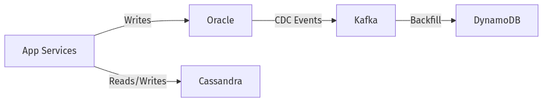
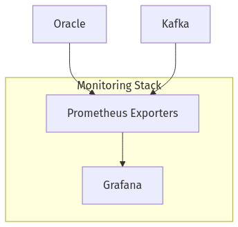
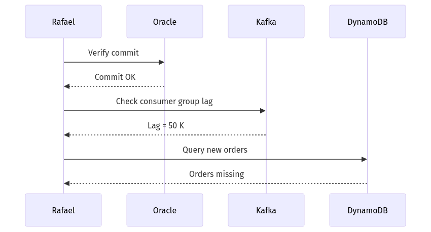

# **Day 10 Quiz Question document** 

## Question 1: Multi‑Database Incident Basics  
🔍 Beginner‑Level  

Rafael likens a polyglot outage to a “circus where every performer juggles a different fire torch.” Which challenge does this analogy highlight?  

A. All databases always share the same backup window  
B. Coordinating different failure modes and data timeliness across databases  
C. Redis always loses data before Oracle in an outage  
D. Every database can be monitored with a single exporter  

---

## Question 2: Source‑of‑Truth Identification  
🔍 Beginner‑Level  

During the Day 10 opening incident, which system had to be trusted first when order data diverged?  

A. Cassandra catalog  
B. Kafka replay topic  
C. Oracle OLTP database  
D. Redis cache  

---

## Question 3: Event‑Driven Bridge  
🔍 Beginner‑Level  

Complete the following statement:  

In Rafael’s hybrid stack, **Kafka** acts primarily as the ________ between relational and NoSQL databases, decoupling write paths and enabling replay.  

A. primary OLTP store  
B. integration bus  
C. archival backup tier  
D. schema registry  

---

## Question 4: Backup Drill Schedule  
🔍 Beginner‑Level  

Rafael’s **Polyglot Commandments** demand running restore drills at least how often?  

A. Monthly  
B. Quarterly  
C. Bi‑annually  
D. Only after an incident  

---

## Question 5: Monitoring Dashboards  
🔍 Beginner‑Level  

True or False: Rafael insists on separate Grafana dashboards for each database to avoid clutter.  

A. True  
B. False  

---

## Question 6: Scaling Strategies  
🔍 Beginner‑Level  

Match each technology with its *default* scaling model.  

Column A 
---
1. Oracle 
2. Cassandra
3. DynamoDB

Column B
---
A. Auto‑scaling throughput tiers  
B. Horizontal node expansion  
C. Primarily vertical plus partitioning  

---

## Question 7: Consumer Lag Threshold  
🔍 Beginner‑Level  

Arrange Rafael’s lag triage steps in order:  

A. Restart or scale stuck consumer  
B. Inspect Kafka consumer group offsets  
C. Verify Oracle commit success  
D. Notify on‑call channel of lag root cause  

---

## Question 8: Hybrid Architecture Diagram  
🧩 Intermediate‑Level  

  

According to Rafael, which component **decouples** Oracle from NoSQL back‑ends in this flow?  

A. App Services  
B. Oracle  
C. Kafka  
D. DynamoDB  

---

## Question 9: Stuck Offset War Story  
🧩 Intermediate‑Level  

In Rafael’s “Kafka consumer freeze” incident, what primary metric revealed the problem?  

A. Oracle buffer cache hit ratio  
B. Cassandra tombstone count  
C. Kafka consumer lag  
D. DynamoDB provisioned throughput  

---

## Question 10: Backup Methods Comparison  
🧩 Intermediate‑Level  

Which pairing correctly matches *technology → recommended backup approach*?  

A. Oracle → nodetool snapshot  
B. Cassandra → RMAN  
C. Kafka → cross‑broker topic replication  
D. DynamoDB → physical filesystem copy  

---

## Question 11: Polyglot Commandment Focus  
🧩 Intermediate‑Level  

True or False: One of Rafael’s commandments states **“If it streams, it breaks silently—monitor the lag.”**  

A. True  
B. False  

---

## Question 12: Role Summary Grid  
🧩 Intermediate‑Level  

Fill in the blank:  

Rafael’s grid lists **Redis** as ideal for ________ because of in‑memory speed and advanced data structures.  

A. ACID ledger entries  
B. long‑term analytics storage  
C. caching and ephemeral data  
D. multi‑document joins  

---

## Question 13: Production‑Readiness Flow  
🧩 Intermediate‑Level  

According to Rafael’s readiness flowchart, which verification **must** occur immediately after confirming a *quarterly restore drill* is complete?  

A. Monitoring & observability in place  
B. Demo of failover DNS switch‑over  
C. Disaster‑recovery budget approval  
D. Developer sign‑off on schema design  

---

## Question 14: Monitoring Stack Diagram  
💡 Advanced/SRE‑Level  

  

Which SRE metric is **MOST** critical for Kafka in this diagram when ensuring cross‑database consistency?  

A. Log‑compaction byte rate  
B. Consumer group lag  
C. Oracle wait events  
D. Grafana dashboard refresh rate  

---

## Question 15: Failure Mode Analysis  
💡 Advanced/SRE‑Level  

Rafael highlights **Cassandra tombstone overload** as a common failure. Which symptom typically precedes a tombstone‑related crash?  

A. Rapid increase in Oracle redo log size  
B. Dramatic drop in read latency due to key cache hits  
C. Spike in read latency accompanied by “tombstone_warn_threshold” alerts  
D. Kafka broker disk‑full error  

---

## Question 16: Unified Alerting Commandment  
💡 Advanced/SRE‑Level  

Fill in the blank:  

Rafael warns that separate alert pipelines can delay root cause identification. Therefore, he mandates routing **all critical alerts** to ________.  

A. individual DB‑owner email lists  
B. a single on‑call channel (e.g., Slack #sre‑alert)  
C. separate Grafana panels  
D. SMS only  

---

## Question 17: Incident Sequence Diagram  
💡 Advanced/SRE‑Level  

  

Based on this sequence, what is Rafael’s **next** recommended action?  

A. Roll back Oracle commits  
B. Increase DynamoDB write capacity  
C. Restart or scale the stuck Kafka consumer  
D. Disable Oracle archive logging  

---

## Question 18: Multi‑DB Monitoring Match  
💡 Advanced/SRE‑Level  

Match each technology with the **key SRE metric** Rafael tracks.  

Column A |  | Column B  
---|---|---  
1. Oracle | | A. Consumer lag (messages)  
2. Kafka | | B. Read/write timeout rate  
3. Cassandra | | C. Row lock wait events  

---

## Question 19: Restore‑Drill Ordering  
💡 Advanced/SRE‑Level  

Arrange the following **restore‑drill** steps in correct order:  

A. Validate data consistency post‑restore  
B. Perform simulated production restore in staging  
C. Capture and archive backup artifacts  
D. Document findings and update runbook  

---

## Question 20: Polyglot Decision Matrix  
💡 Advanced/SRE‑Level  

Multiple databases offer different strengths. Which option **best** represents Rafael’s **decision matrix** priority for *regulatory‑grade financial data*?  

A. Horizontal scalability over ACID transactions  
B. Low ops overhead over strict consistency  
C. Strong consistency & backup maturity over raw throughput  
D. Flexible schema over predictable latency  

---

**End of Day 10 Quiz**