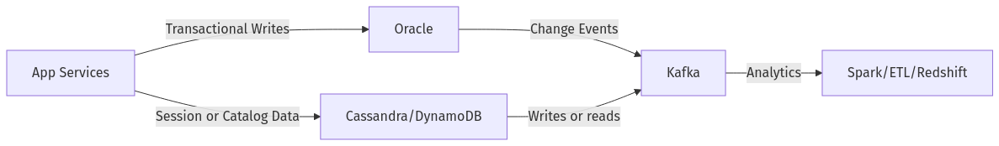
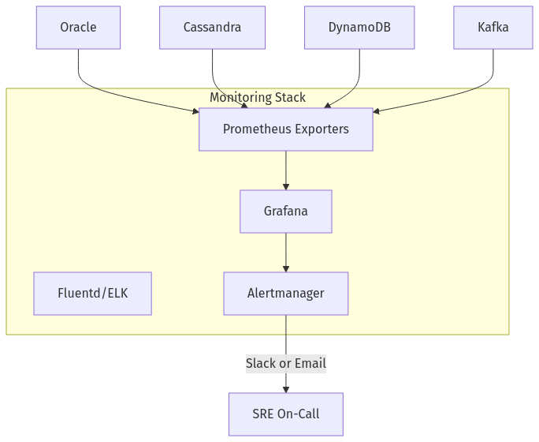
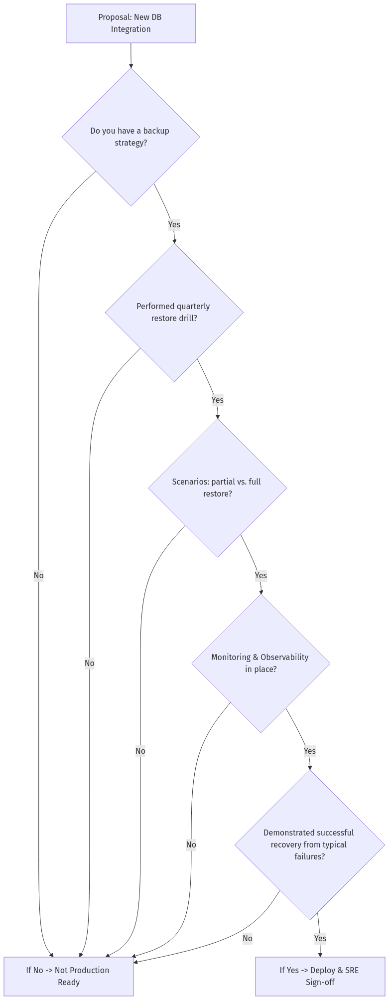

Below is a **newly generated Day 10 training document** merging content from **day-9-10_training_material_v2.md** citeturn22file0 with the expanded **day_10_prompt_tf_v1.md** instructions. It is narrated entirely by **Rafael** in São Paulo at 08:00 BRT—our **charismatic, high-energy systems architect** specializing in **multi-database ops**. Enjoy his war stories, mermaid visuals, “Polyglot Commandments,” and final toast to the global team.

---

# **The Follow-the-Sun Chronicles: Day 10 – Rafael & the Polyglot Circus**

> **Character Profile**  
> - **Name:** Rafael  
> - **Location:** São Paulo, Brazil (08:00 BRT)  
> - **Role:** Systems architect & multi-database ops strategist  
> - **Personality:** Charismatic, fast-talking, invests in high uptime. Proudly wrangles polyglot architectures. Wears the stress as a badge of honor.

---

## **1. The Incident Bridge: Where’s the Source of Truth?**

At **08:00 BRT**, I joined an incident bridge. We had data in **Oracle** for orders, **Cassandra** for product catalog, and real-time events in **Kafka**. Suddenly, half the orders showed up in Oracle but not in Cassandra, and the analytics pipeline was behind. “**Which system is correct?**” the team asked. That’s the dreaded question in a polyglot environment—where meltdown occurs if you can’t coordinate your systems.

> **Rafael’s Perspective**: “I’ve seen fiascos where each system claims partial data. Let me show you how to operationalize these multi-DB setups so you can keep your sanity—and your uptime.”

---

## **2. Day 10 Overview (Rafael’s Masterclass)**

### **🔍 Beginner Objectives**
1. **Understand** how to handle multi-DB (SQL + NoSQL) in production.  
2. **Explain** scaling strategies (vertical/horizontal).  
3. **Recognize** essential monitoring metrics.  
4. **Distinguish** backup methods across SQL vs. NoSQL.

### **🧩 Intermediate Objectives**
1. **Show** how Kafka fits into a broader data architecture.  
2. **Design** high availability for both Oracle and Cassandra.  
3. **Apply** a decision framework for database selection.  
4. **Implement** migration steps from Oracle to NoSQL.

### **💡 Advanced/SRE Objectives**
1. **Compare** performance profiles of Oracle, Cassandra, DynamoDB, Kafka.  
2. **Architect** polyglot solutions with a thorough data flow.  
3. **Automate** multi-DB monitoring & alerting.  
4. **Manage** multi-database incident response at scale.

> **Rafael’s Commentary**: “We do more than just stand up a second DB. We scale it, secure it, monitor it—**and** stay sane at 3am incidents.”

---

## **3. Operationalizing SQL + NoSQL Hybrid Architectures**

We unify **relational** and **non-relational**. Typically:

- **Oracle** or Postgres for ACID and complex queries  
- **Cassandra** / **DynamoDB** for distributed big writes or flexible key-value  
- **Kafka** as an event bus bridging them

### **Mermaid: Hybrid Architecture**

**Decision Factors**:
- **Oracle** for OLTP if ACID is non-negotiable.  
- **Cassandra** for large scale writes, tunable consistency.  
- **Kafka** decouples everything, but also adds complexity (monitoring offsets, consumer lags).

> **Rafael’s War Story**: “We once had a meltdown: the Kafka offset soared while Oracle was fine. The root cause was a stuck consumer in Cassandra-based microservices. Let’s see how to fix that.”

---

## **4. Scaling, Backing Up, and Monitoring Each DB**

### **Scaling**  
- **Oracle**: Typically vertical, plus partitioning or sharding.  
- **Cassandra**: Horizontal by default—add nodes for more capacity.  
- **DynamoDB**: Auto-scales capacity.  
- **Kafka**: Add brokers, rebalance partitions.

### **Backing Up & Recovery**  
- **Oracle**: RMAN, Data Guard, incremental backups.  
- **Cassandra**: Snapshots, commit log archiving.  
- **Kafka**: Not a DB, but replicate topics across brokers.  
- **SRE**: Ensure you sync schedules so partial backups don’t cause data mismatch.

### **Monitoring**  
**Prometheus / Grafana** unify your stats:

> **Rafael’s Tip**: “If you have separate dashboards for Oracle vs. Cassandra vs. Kafka, you’ll scramble during cross-system incidents. One aggregator saves hours.”

---

## **5. Choosing the Right Tool (Oracle, Cassandra, DynamoDB, Kafka, etc.)**

Let’s break down each:

1. **Oracle**: OLTP, advanced queries, strong ACID. Harder horizontal scale.  
2. **Cassandra**: Write-heavy, global scale, eventually consistent.  
3. **DynamoDB**: Fully managed, pay-per-use, limited queries.  
4. **Kafka**: Not a DB—an event bus for streaming integration.

**Add in**: 
- **MongoDB**: Document store, flexible schema.  
- **Redis**: Caching or ephemeral data, but memory constraints.

### **Database Role Summary Grid**

| DB/Service  | Primary Role         | Strengths                      | Weaknesses                        |
|-------------|----------------------|--------------------------------|-----------------------------------|
| **Oracle**  | OLTP, Finance        | ACID, mature tooling           | Harder to scale out vertically    |
| **Cassandra** | Session data, feeds | Horizontal scale, tunable latency | More rigid schema, operational cost |
| **DynamoDB** | Key-value fast lookups | Autoscaling, managed          | Query limitations                 |
| **Kafka**   | Event backbone       | Decoupling, replayable         | Monitoring & ops can be complex   |
| **MongoDB** | Document store       | Flexible schema, easy dev      | Can be resource hungry, queries can stall if not indexed properly |
| **Redis**   | Caching, leaderboards| Speed, advanced data structures| Memory constraints, ephemeral data |

> **Rafael’s Commentary**: “Pick your puzzle piece carefully. If you jam a square peg (heavy transactions) into a round hole (Cassandra) or vice versa, meltdown’s inevitable.”

---

## **6. Real-World Failures & SRE Monitoring Implications**

**Each DB** has distinct failure modes:

- **Oracle**: Overloaded concurrency, row lock deadlocks.  
- **Cassandra**: Node gossip issues, tombstone overload, write amplification.  
- **DynamoDB**: Exceeding read/write capacity, partial throttles.  
- **Kafka**: Consumer lag, broker fails, partition rebalancing meltdown.

**SRE** must watch for:
- CPU or load spikes.  
- 2–5 minute consumer offset plateaus.  
- Oracle wait events (e.g., row lock contentions).  
- Cassandra read/write timeouts or “unknown” gossip statuses.

---

## **7. Flowchart: Production Readiness for Any New System**

**“Do you know how to back it up, restore it, and observe it?”**—my cardinal question.

**Key**:
1. **Backup approach** is known and tested.  
2. **Quarterly restore** drill has proven we can do partial or full recovery.  
3. **Monitoring** (Prometheus/Grafana or similar).  
4. **Failure mode** testing done.

> **Rafael’s Commentary**: “If you can’t demonstrate a successful restore, you’re basically flying blind. Don’t do that in production.”

---

## **8. Incident Response: Oracle, Kafka, and DynamoDB**

**sequenceDiagram**
autonumber
participant Rafael
participant Slack
participant OracleDB as Oracle
participant KafkaSys as Kafka
participant Dyn as DynamoDB

Rafael->>Slack: "Alert: Orders missing in Dynamo, but exist in Oracle"
Slack->>Rafael: "Could Kafka bridging be stuck?"
Rafael->>OracleDB: Check logs, commits
OracleDB-->>Rafael: ACID commits are fine
Rafael->>KafkaSys: Inspect consumer lag
KafkaSys-->>Rafael: Big backlog on 'Dynamo-sync' consumer
Rafael->>Dyn: None of the new orders arrived
Dyn-->>Rafael: Queries show old data
Rafael->>Slack: "We see consumer offset not moving. Possibly crashed."
Rafael->>Slack: "Restart consumer, replay backlog. Orders eventually sync."

**Resolution**:
1. Consumer crashed or was stuck.  
2. SRE restarts, offsets replay.  
3. Data converges in DynamoDB.

> **Rafael’s Commentary**: “This is exactly why ‘If it streams, it breaks silently.’ We must watch for message lag or idle consumers.”

---

## **9. Tooling & Observability across DBs**

**Prometheus** + **Grafana**:
- Oracle exporter for AWR stats.  
- Cassandra exporter for node-level metrics.  
- DynamoDB CloudWatch integration.  
- Kafka offset exporters.

**Fluentd** or **Logstash** for logs:
- Oracle logs, Cassandra logs, consumer logs.

**SQL tracing** or **AWR** for Oracle deep queries.  
**nodetool** for Cassandra node stats.  
**S3** or similar for storing backups.

> **Rafael’s Perspective**: “One place to unify logs and metrics from all DBs is crucial. Without it, you’ll guess in the dark, especially in cross-system fiascos.”

---

## **Rafael’s Polyglot Commandments**

1. **If it streams, it breaks silently**—monitor consumer lag or you’ll never see stuck pipelines.  
2. **Monitor for message lag > 10K** as an early warning.  
3. **Watch for stuck consumers** with zero offset movement > 5 minutes.  
4. **Set up partition balancing alerts**—consumer group rebalancing can cascade failures.  
5. **As Chloé mentioned (Day 9)**, keep Kafka’s throughput **<= 70%** of capacity to avoid meltdown.  
6. **Every DB must have a tested backup & restore**.  
7. **Define roles**: Oracle for ACID, Cassandra for scale, etc.  
8. **Never rely on random scripts** to sync polyglot DBs; event pipelines or CDC are best.  
9. **Observe everything**: If you can’t measure it, you’ll be clueless at 3am.  
10. **A meltdown is a teacher**—document every fix in runbooks.

> **Rafael’s Hard-Won Wisdom**: “These commandments save your hide. Believe me, I’ve spent enough nights on call to know.”

---

## **Database Role Summary Grid**

| DB/Service  | Primary Role         | Strengths                          | Weaknesses                               |
|-------------|----------------------|------------------------------------|------------------------------------------|
| **Oracle**  | OLTP, Finance        | ACID, mature tooling               | Harder to scale out vertically           |
| **Cassandra** | Session data, feeds | Horizontal scale, tunable consistency | More rigid schema, complex ops           |
| **DynamoDB** | Key-value fast lookups | Autoscaling, fully managed        | Query limitations, cost can spike        |
| **Kafka**   | Event backbone       | Decoupling, replayable             | Monitoring & ops can be complex          |
| **MongoDB** | Document store       | Flexible schema, easy dev          | Can get resource-hungry if queries unindexed |
| **Redis**   | Caching, ephemeral data | Speed, advanced data structures   | Memory constraints, ephemeral reliability |

> **Rafael’s Commentary**: “Look at this table—no single DB is perfect for everything. So we juggle them carefully.”

---

## **Conclusion: A Toast to the Global Team**

So that’s **Day 10**, the final day of our Chronicles. We tackled:

- **Operationalizing** multi-DB setups (SQL + NoSQL).  
- **Scaling**, **backing up**, and **monitoring** each system.  
- **Incident response** bridging Oracle, Cassandra, DynamoDB, Kafka.  
- **Polyglot design** patterns—ETL, data lakes, streaming, caching layers.  
- **Performance, availability**, data integrity at scale.

**Rafael’s Parting Words**: “Even if these systems never sleep, you must. With the right architecture, tooling, and polyglot approach, you won’t be paged all night. Thanks for joining me in the polyglot circus—**and cheers** to a meltdown-free future!”
