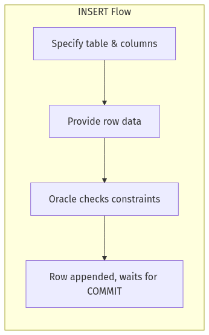
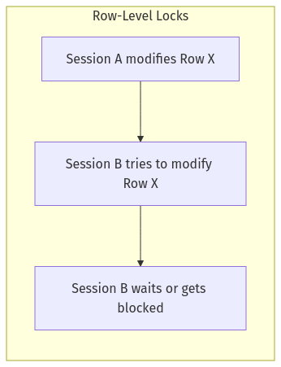
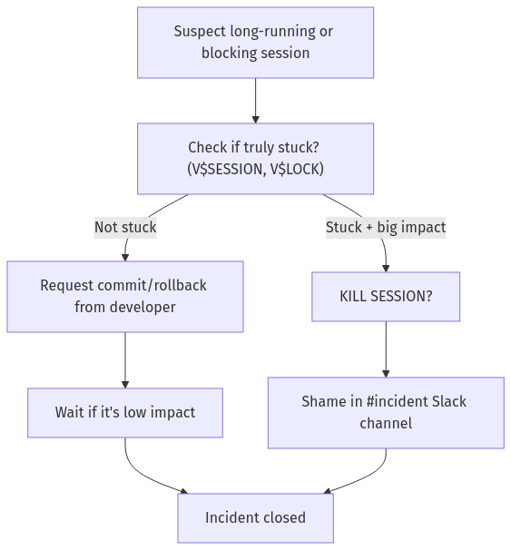
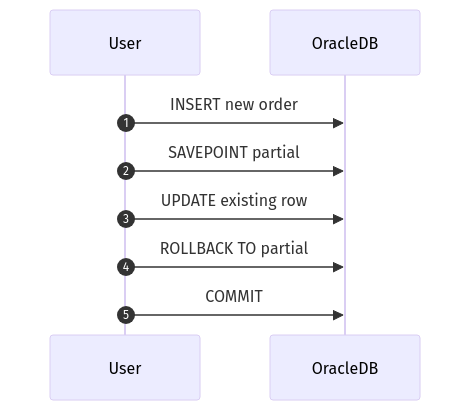
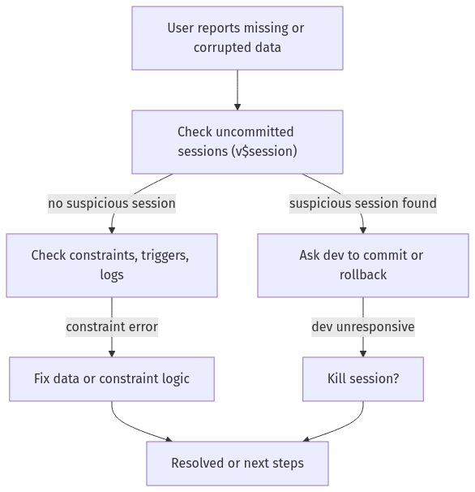

# SRE Database Training Module – Day 2: **Answer Sheet**

## (🔍) Beginner-Level Questions (1–7)

---

## **Answer 1: Basic Transaction Control**
🔍 Beginner | Multiple Choice

**Question:**  
Noah emphasized the importance of “transaction discipline” so that data changes become visible to everyone else. Which statement best represents the final step needed after running an `INSERT`?

A. Wait for auto-commit to happen when you exit the session  
B. Issue a `SAVEPOINT` so other users see the data  
C. Issue a `COMMIT` to make the changes permanent  
D. There is no final step; Oracle commits all changes automatically  

**Correct Answer:** C

**Explanation:**  
A newly inserted row remains in a transient state until the user explicitly commits the transaction. Oracle does not force an automatic commit after every statement, and the data remains invisible to other sessions until the transaction is committed. Noah emphasizes that skipping the `COMMIT` leads to “quantum-state” data—visible only to the session that made the change.

**Why other options are incorrect:**  
- **(A)** Waiting for auto-commit when exiting can sometimes happen in certain client tools, but it is not a best practice and can lead to confusion or blocking issues.  
- **(B)** A `SAVEPOINT` simply marks a partial rollback point; it does not finalize changes.  
- **(D)** Oracle does not auto-commit DML statements without explicit user action, unlike some MySQL defaults.

**Database Comparison Note:**  
MySQL might auto-commit by default, but Oracle (and PostgreSQL/SQL Server) typically require explicit commits unless configured otherwise.

**Knowledge Connection:**  
This question ties to Noah’s frequent complaint about uncommitted data blocking other sessions and staying invisible to analytics.

**SRE Perspective:**  
Forgotten commits can cause locked rows, leading to escalations or kills. From an SRE standpoint, short, explicit commits reduce lock durations and improve system stability.

**Additional Insight:**  
Always confirm that crucial changes are committed, especially before leaving a session idle or logging off, to avoid partial or hidden data states.

---

## **Answer 2: Partial Rollbacks & SAVEPOINT**
🔍 Beginner | Multiple Choice

**Question:**  
Noah often uses a “shopping cart” analogy to describe transaction steps. How does `SAVEPOINT` fit into this analogy?

A. It finalizes the entire cart, making items permanent  
B. It completely empties your cart, discarding all items  
C. It marks a checkpoint so you can revert to a previous cart state if needed  
D. It auto-commits just the newly added items  

**Correct Answer:** C

**Explanation:**  
`SAVEPOINT` acts like a checkpoint in a transaction so that if you decide to roll back certain changes, you can revert to the state at that point without discarding the entire transaction. This is akin to marking a moment in your shopping cart where you can revert additions you made after that checkpoint.

**Why other options are incorrect:**  
- **(A)** Finalizing the entire cart is more akin to a `COMMIT`.  
- **(B)** Completely emptying the cart equates to a full `ROLLBACK`.  
- **(D)** `SAVEPOINT` does not auto-commit; it merely sets a partial rollback marker.

**Database Comparison Note:**  
PostgreSQL and SQL Server similarly support named savepoints to allow partial rollbacks, though specific syntax can vary.

**Knowledge Connection:**  
Noah references partial rollbacks extensively, illustrating that a `SAVEPOINT` is key to recovering from partial mistakes during multi-step updates.

**SRE Perspective:**  
In complex workflows, partial rollbacks can prevent a total revert of all changes, saving significant time in production. SRE teams appreciate having a safety net.

**Additional Insight:**  
Setting multiple savepoints without a plan can become confusing; name them clearly if you expect to roll back to a specific point.

---

## **Answer 3: Uncommitted Transactions**
🔍 Beginner | True/False

**Question:**  
Noah warns about the dangers of leaving an uncommitted transaction open for too long. True or false: An uncommitted transaction can block other sessions and remain invisible to analytics until it is either committed or rolled back.

A. True  
B. False  

**Correct Answer:** A (True)

**Explanation:**  
With Oracle’s row-level locking, an uncommitted transaction holds locks on modified rows. Other sessions attempting to update those rows become blocked until a commit or rollback. Meanwhile, the uncommitted data remains hidden from queries in other sessions, creating both data consistency challenges and concurrency headaches.

**Database Comparison Note:**  
Other databases like PostgreSQL or SQL Server follow similar locking rules. Uncommitted data is not visible to other transactions until committed.

**Knowledge Connection:**  
Noah’s stories repeatedly highlight how an uncommitted transaction can cause major issues for concurrency and lead to the need for SRE intervention.

**SRE Perspective:**  
Long-lived transactions can lead to blocked sessions piling up, severely affecting uptime. Monitoring for open transactions is vital.

**Additional Insight:**  
Tools like `V$SESSION` in Oracle can show if transactions have been open for an extended period, giving early warnings to SREs.

---

## **Answer 4: INSERT Flow**
🔍 Beginner | Multiple Choice with Diagram

**Question:**  
Examine the flowchart below illustrating how Oracle handles an `INSERT`:

Which step occurs last before the data becomes fully visible to other sessions?

A. The row data is added into the block cache  
B. Oracle checks constraints for validity  
C. A `COMMIT` is issued to finalize the change  
D. The user sets a `SAVEPOINT` in the transaction  

**Correct Answer:** C

**Explanation:**  
After the row is appended and waiting for a commit, the final action making it visible is the `COMMIT` statement. Without it, changes remain local to that session. The diagram shows that once constraints are satisfied, the row is placed in the table’s data blocks but is not fully “real” to other sessions until a commit finalizes it.

**Why other options are incorrect:**  
- **(A)** Adding row data to the data block occurs before the commit, but visibility to other sessions still depends on the commit.  
- **(B)** Constraint checks happen prior to finalizing the row, not last.  
- **(D)** A `SAVEPOINT` does not make changes visible; it only marks a potential rollback point.

**Database Comparison Note:**  
All major relational databases require a commit for finalizing insert changes, though MySQL might default to auto-commit in certain setups.

**Knowledge Connection:**  
Noah’s “the production database remembers” stance is anchored in the fact that Oracle doesn’t expose the data until the commit.

**SRE Perspective:**  
Uncommitted inserts can lead to concurrency blocks if they hold open transactions on shared resources.

**Additional Insight:**  
Explicitly committing after each logical batch can prevent data from lingering in a half-committed state.

---

## **Answer 5: Basic DML**
🔍 Beginner | Fill-in-the-Blank

**Question:**  
Complete the following statement about Noah’s perspective:

> “If you forget to ________ after an `UPDATE`, your changes stay in a quantum state—real for you, invisible for others.”

A. specify the correct columns  
B. create a matching index  
C. COMMIT  
D. MERGE  

**Correct Answer:** C – COMMIT

**Explanation:**  
For an update (or any DML operation in Oracle), the critical step that makes changes visible to other sessions is `COMMIT`. Noah calls uncommitted data “quantum-state” because it exists only for the session that performed it, blocking others and staying invisible to analytics.

**Why other options are incorrect:**  
- **(A)** Specifying columns is good practice but unrelated to making the update visible.  
- **(B)** Creating an index can improve performance but does not finalize changes.  
- **(D)** MERGE is a different statement type altogether.

**Database Comparison Note:**  
PostgreSQL, SQL Server, and other RDBMS also require a commit (unless auto-commit is in effect) for changes to be shared.

**Knowledge Connection:**  
Noah’s repeated emphasis is that forgetting to commit leads to concurrency issues and confusion when data does not appear in queries.

**SRE Perspective:**  
For an SRE, uncommitted transactions cause sessions to be locked, leading to escalation if left unresolved.

**Additional Insight:**  
In high-traffic systems, shorter transactions with frequent commits reduce the risk of row locking and blocked sessions.

---

## **Answer 6: DML Basics**
🔍 Beginner | Matching

**Question:**  
Match each DML operation in Column A to Noah’s illustrative analogy in Column B.

Column A:  
1. INSERT  
2. UPDATE  
3. DELETE  
4. MERGE  

Column B:  
A. “New club membership” – adding a fresh row  
B. “Membership roster sync” – upsert logic  
C. “Correcting a typo” – changing existing data  
D. “Kicking a member out” – removing a row  

**Correct Matches:**  
1 → A  
2 → C  
3 → D  
4 → B  

**Explanation:**  
- **INSERT** = New club membership.  
- **UPDATE** = Correcting a typo.  
- **DELETE** = Kicking a member out.  
- **MERGE** = Membership roster sync (upsert logic).

**Database Comparison Note:**  
All major SQL dialects share these core statements. MERGE in Oracle is similar to upsert logic in other systems but can differ in syntax.

**Knowledge Connection:**  
Noah used these analogies throughout Day 2 to ground each DML operation in a real-world scenario.

**SRE Perspective:**  
Properly understanding each operation helps SREs quickly diagnose incidents where data is inserted, updated incorrectly, or removed by mistake.

**Additional Insight:**  
MERGE can be tricky; always confirm your matching logic to avoid accidental duplications or omissions.

---

## **Answer 7: Concurrency & Lock Trolls**
🔍 Beginner | Multiple Choice with Diagram

**Question:**  
Noah describes locks as “grumpy trolls” living under rows. Look at the simplified locking diagram:

Which best explains how Oracle’s row-level lock in this scenario impacts Session B?

A. Session B’s changes are applied immediately in parallel  
B. Session B is forced to wait until Session A commits or rolls back  
C. The database automatically kills Session B to avoid conflicts  
D. The lock is upgraded to a table-level lock, blocking all rows  

**Correct Answer:** B

**Explanation:**  
Oracle uses row-level locking, so when Session A modifies a specific row, it places an exclusive lock on that row until the transaction completes (commit or rollback). Session B must wait until the lock is released before modifying the same row, preventing conflicting writes.

**Why other options are incorrect:**  
- **(A)** Parallel modification of the same row is not allowed; a conflict arises.  
- **(C)** Oracle does not automatically kill a blocking session. Manual intervention might be needed if the block persists.  
- **(D)** Oracle typically holds locks at the row level, not upgrading to table-level unless in very unusual circumstances.

**Database Comparison Note:**  
PostgreSQL and SQL Server also enforce row-level or page-level locks for concurrent DML, with slight variations in isolation levels.

**Knowledge Connection:**  
Noah’s references to “grumpy trolls under the row” highlight how one transaction can block another at the row level.

**SRE Perspective:**  
Long-held locks degrade performance and can cause cascading blocks. SREs need to keep transactions short or risk having to kill sessions.

**Additional Insight:**  
Monitoring lock waits in `V$LOCK` or `V$SESSION` helps detect such issues early.

---

## (🧩) Intermediate-Level Questions (8–14)

---

## **Answer 8: Concurrency & Multi-Step Updates**
🧩 Intermediate | Multiple Choice

**Question:**  
Noah warns that long-running updates can cause lock contention and page-outs. Which approach best reduces blocking issues for large updates?

A. Issue one huge `UPDATE` on millions of rows without a commit until completion  
B. Use small, batched updates with periodic commits  
C. Acquire a table-level lock to ensure no one else can read the table  
D. Disable all constraints before running the update  

**Correct Answer:** B

**Explanation:**  
Small, batched updates with periodic commits reduce lock durations by limiting how many rows are locked simultaneously. This approach mitigates the risk of overwhelming the undo space and blocking other sessions for too long.

**Why other options are incorrect:**  
- **(A)** One massive update can lock a large portion of the table for an extended period, causing widespread blocking.  
- **(C)** Acquiring a table-level lock can bring the entire table to a halt for all other users.  
- **(D)** Disabling constraints is risky and doesn’t address the fundamental issue of lengthy locks.

**Database Comparison Note:**  
In PostgreSQL/SQL Server, chunking or batching large updates is also recommended. A single giant statement can lead to massive row-level locks and potential deadlocks.

**Knowledge Connection:**  
Noah’s recommended approach is to break big updates into bite-sized commits, referencing his real-world meltdown from not doing so.

**SRE Perspective:**  
Batched commits keep system concurrency high. SREs often script large updates in loops to minimize lock time.

**Additional Insight:**  
Use caution with the batch size. Too large, and you’re back to big blocks; too small can degrade performance from overhead. Adjust to your system’s capacity.

---

## **Answer 9: Killing Sessions**
🧩 Intermediate | Ordering with Diagram

**Question:**  
Look at Noah’s session kill decision tree:

Arrange these steps in correct order when you find a suspicious session hogging locks:

A. Check if the session is genuinely stuck  
B. Document in postmortem  
C. Decide whether to kill the session  
D. Give the developer time to commit or roll back if it’s low impact  

**Correct Order:** A, D, C, B? Wait, that might not be correct. Let’s carefully parse it.

1. **(A) Check if the session is genuinely stuck** – This is the first step.  
2. If it’s not stuck, you give the developer time (C or D?). The question specifically says “B – Document in postmortem” is an outcome. Actually, let’s match them carefully:

   - The diagram:  
     - A → B. If not stuck → C (request commit). If stuck + big impact → D (KILL SESSION?). C → F (Wait if low impact). F → G (Document in postmortem). D → E (Shame in Slack). E → G.  

   So the correct sequence is:
   1. A. Check if genuinely stuck  
   2. If stuck + big impact, decide on kill session → E → G. If not stuck, developer can fix → F → G.  
   So the order is:
   - Step 1: A (Check if session is genuinely stuck)  
   - Step 2: If not stuck, C (Give dev time to fix). If stuck + big impact, we do: D (Decide whether to kill).  
   - Step 3: Then we proceed to eventually E or F. The question specifically lumps “Document in postmortem” as an end step, so that’s B in the question’s list.

Let’s line it up with the question’s letters:

- (A) Check if the session is genuinely stuck  
- (B) Document in postmortem  
- (C) Decide whether to kill the session  
- (D) Give the developer time to commit or roll back if it’s low impact

Given the diagram and standard logic:

1. (A) “Check if the session is genuinely stuck.”  
2. If it’s not stuck, (D) “Give the developer time…”  
3. If it is stuck + big impact, (C) “Decide whether to kill the session.”  
4. Eventually, (B) “Document in postmortem.”

Hence the correct order: A → D → C → B

**Correct Order:** A, D, C, B

**Explanation:**  
- **(A)** is always first: identify if the session truly is blocking.  
- If it’s not stuck or has low impact, **(D)** suggests letting the developer fix it.  
- If it’s stuck or high impact, **(C)** is the kill decision.  
- Finally, **(B)** documenting in a postmortem is the concluding step after resolution.

**Database Comparison Note:**  
Killing sessions or processes is a universal concept across DBMS, though syntax differs (e.g., `pg_terminate_backend` in PostgreSQL, `KILL <spid>` in SQL Server).

**Knowledge Connection:**  
Noah’s kill session decision tree is a hallmark example of balancing business impact with developer courtesy.

**SRE Perspective:**  
Deciding to terminate a session is serious, as it discards the uncommitted work. SREs weigh system reliability vs. losing partial data.

**Additional Insight:**  
Make sure to log or track kill events so that root causes can be addressed, ensuring fewer recurring incidents.

---

## **Answer 10: Large DELETE Concerns**
🧩 Intermediate | Fill-in-the-Blank

**Question:**  
Complete Noah’s cautionary statement:

> “Running a single massive `DELETE` that removes millions of rows can cause ________ for everyone else, because the transaction holds locks too long.”

A. index corruption  
B. concurrency nightmares  
C. data dictionary purges  
D. partial commits  

**Correct Answer:** B – concurrency nightmares

**Explanation:**  
A huge delete can lock large portions of data for a prolonged period, causing concurrency issues and blocking other sessions. Noah repeatedly warns about the meltdown potential when giant transactions block other operations.

**Why other options are incorrect:**  
- **(A)** Index corruption does not normally occur merely by a large delete.  
- **(C)** Data dictionary purges are unrelated.  
- **(D)** Partial commits are not relevant to the main risk of big deletes.

**Database Comparison Note:**  
Large deletes in PostgreSQL, SQL Server, etc. also cause concurrency slowdowns if done in one shot. Batching or partitioning is recommended.

**Knowledge Connection:**  
Noah’s rule to handle big deletes in small batches or use partitioning is central to preventing widespread table lock.

**SRE Perspective:**  
A long lock from a massive delete can trigger escalations or hamper production. SRE best practices revolve around chunked deletion.

**Additional Insight:**  
Some teams rely on archiving or partition-wise deletes to avoid entire table locks.

---

## **Answer 11: Truncate vs. Delete**
🧩 Intermediate | True/False

**Question:**  
Noah notes that `TRUNCATE` in Oracle is considered DDL, not DML. True or false: `TRUNCATE` can be rolled back like a normal `DELETE`.

A. True  
B. False  

**Correct Answer:** B (False)

**Explanation:**  
`TRUNCATE` is a DDL operation that quickly removes all rows from a table without generating extensive undo logs. Because it’s DDL, you cannot roll it back once executed—unlike a normal `DELETE`, which is a DML statement that can be undone before commit.

**Database Comparison Note:**  
Similarly, in PostgreSQL or SQL Server, truncation is typically a non-transactional operation.

**Knowledge Connection:**  
Noah’s personal anecdote covers how he once tried to revert a truncate and discovered the hard way that it’s not rollback-capable.

**SRE Perspective:**  
Truncates in production require caution. They’re faster but irreversible, making it a “nuclear” option if you need an empty table.

**Additional Insight:**  
If you need the ability to rollback, always use a staged delete or test environment first.

---

## **Answer 12: Data Dictionary & Lock Analysis**
🧩 Intermediate | Multiple Choice

**Question:**  
Which Oracle data dictionary or performance view does Noah most often use to identify blocking sessions or row-level locks?

A. `ALL_CONSTRAINTS`  
B. `ALL_OBJECTS`  
C. `V$LOCK`  
D. `DBA_TABLES`  

**Correct Answer:** C

**Explanation:**  
`V$LOCK` is the primary view used to identify lock types, lock holders, and which sessions are blocked. SREs often combine `V$LOCK` with `V$SESSION` to correlate which session is blocking others.

**Why other options are incorrect:**  
- **(A)** `ALL_CONSTRAINTS` lists constraints, not active locking info.  
- **(B)** `ALL_OBJECTS` shows database objects, not lock states.  
- **(D)** `DBA_TABLES` lists table metadata, but no concurrency details.

**Database Comparison Note:**  
PostgreSQL uses `pg_locks`, while SQL Server has `sys.dm_tran_locks` to diagnose lock contention.

**Knowledge Connection:**  
Noah’s kill session decision tree references checking `V$LOCK` and `V$SESSION` to confirm if a session is truly stuck.

**SRE Perspective:**  
Being comfortable with lock-related views is essential; you need quick resolution for blocking scenarios in a 24/7 environment.

**Additional Insight:**  
You might also use `V$SESSION_WAIT` or `V$SESSION_EVENT` for deeper performance insights on what each session is waiting for.

---

## **Answer 13: Transaction Steps**
🧩 Intermediate | Matching with Diagram

**Question:**  
Review this snippet showing multiple transaction steps:

Match each transaction control keyword in Column A to its best explanation in Column B:

Column A:  
1. COMMIT  
2. ROLLBACK  
3. SAVEPOINT  
4. ROLLBACK TO <savepoint>  

Column B:  
A. Finalizes all current changes, making them permanent  
B. Creates a checkpoint to which we can revert  
C. Completely undoes all uncommitted changes in the transaction  
D. Undoes everything done since the specified checkpoint  

**Correct Matches:**  
1 → A  
2 → C  
3 → B  
4 → D  

**Explanation:**  
- **COMMIT** finalizes changes.  
- **ROLLBACK** undoes everything uncommitted.  
- **SAVEPOINT** marks a checkpoint.  
- **ROLLBACK TO <savepoint>** reverts everything after that savepoint, preserving prior changes.

**Database Comparison Note:**  
PostgreSQL/SQL Server handle transactions similarly with named savepoints, though the syntax might vary slightly.

**Knowledge Connection:**  
Noah’s “shopping cart” analogy for transactions is fully exemplified in this sequence diagram, showing partial rollback.

**SRE Perspective:**  
Careful use of savepoints can isolate mistakes. SREs appreciate the granularity to revert parts of a transaction without losing everything.

**Additional Insight:**  
Don’t forget to commit once confident in your changes; otherwise, the entire transaction remains in limbo.

---

## **Answer 14: MERGE Statement**
🧩 Intermediate | Multiple Choice

**Question:**  
When using Oracle’s `MERGE` for upsert logic, Noah recommends extra caution. Which scenario can lead to unexpected duplicates?

A. Multiple `WHEN MATCHED THEN UPDATE` clauses in a single MERGE  
B. Setting a `SAVEPOINT` before the MERGE  
C. Using an `ON` condition that incorrectly matches multiple rows in the target  
D. Issuing a `DELETE` command immediately after the MERGE  

**Correct Answer:** C

**Explanation:**  
If the `ON` condition matches more than one target row for the same source row, the merge can insert or update rows incorrectly, creating duplicates or violating constraints. Noah insists on thoroughly testing the matching logic to avoid such chaos.

**Why other options are incorrect:**  
- **(A)** Having multiple `WHEN MATCHED` clauses can be complex but does not inherently cause duplicates unless the match condition is also incorrect.  
- **(B)** A savepoint before merge simply allows partial rollback, not duplication.  
- **(D)** Deleting after a merge does not typically create duplicates.

**Database Comparison Note:**  
PostgreSQL and SQL Server’s upsert syntax likewise rely on a solid “match” condition to prevent duplication.

**Knowledge Connection:**  
Noah cites real incidents where incorrectly written MERGE statements caused either multiple inserts or missed updates.

**SRE Perspective:**  
If a MERGE statement goes wild in production, it can quickly lead to data inconsistencies. SRE teams may have to roll back or fix large sets of duplicated records.

**Additional Insight:**  
Always test MERGE in a lower environment with varied data sets, especially if you have multiple candidate keys or potential for multiple row matches.

---

## (💡) Advanced/SRE-Level Questions (15–20)

---

## **Answer 15: Row-Level Lock Escalation**
💡 Advanced | Multiple Choice

**Question:**  
Noah describes how Oracle typically uses row-level locks, but lock “escalation” can still occur under extreme pressure. Which situation might trigger escalated locking behaviors?

A. Short transactions committing every few seconds  
B. A transaction that updates nearly every row in a table for hours  
C. Queries that only read data with `SELECT` statements  
D. A series of `ROLLBACK TO SAVEPOINT` commands with minimal data changes  

**Correct Answer:** B

**Explanation:**  
When a long-running transaction attempts to update a massive number of rows over an extended period, Oracle may consume a significant amount of resources and potentially escalate locking (though true “lock escalation” is less common in Oracle compared to some other DBMS). Still, it effectively ties up large portions of data for extended durations.

**Why other options are incorrect:**  
- **(A)** Frequent commits keep transactions short.  
- **(C)** Pure read operations do not generally cause exclusive locks.  
- **(D)** Rolling back to savepoints with minimal changes usually does not escalate locks drastically.

**Database Comparison Note:**  
SQL Server is more prone to lock escalation from row-level to page-level or table-level. Oracle typically manages fine-grained row locks, but a massive update can still degrade concurrency severely.

**Knowledge Connection:**  
Noah discusses how monstrous transactions can hog resources and lead to meltdown incidents.

**SRE Perspective:**  
SREs keep an eye out for queries that run for hours, as they tend to block others, leading to page-outs or forced kills.

**Additional Insight:**  
Best practice is to chunk large updates or schedule them during off-peak times to avoid concurrency nightmares.

---

## **Answer 16: Large-Scale DML from an SRE Perspective**
💡 Advanced | Multiple Choice

**Question:**  
Noah often references best practices for high-volume data updates in production. Which of the following is **not** a recommended approach?

A. Using small, incremental commits to reduce lock hold times  
B. Testing bulk DML logic in a staging environment before production  
C. Letting multiple massive updates run concurrently without scheduling  
D. Monitoring lock contention via `V$LOCK` or `V$SESSION`  

**Correct Answer:** C

**Explanation:**  
Running multiple massive updates concurrently without scheduling or phasing them out can cause lock conflicts, heavy undo usage, and potential meltdown scenarios. Noah recommends careful orchestration of large-scale DML tasks.

**Why other options are incorrect:**  
- **(A)** Incremental commits reduce lock duration.  
- **(B)** Testing in staging is essential to avoid production mishaps.  
- **(D)** Monitoring lock contention is crucial for diagnosing concurrency bottlenecks.

**Database Comparison Note:**  
PostgreSQL, SQL Server, and others also benefit from scheduling large updates to avoid concurrency overlap.

**Knowledge Connection:**  
Noah’s meltdown stories revolve around unplanned concurrency spikes that brought the system to its knees.

**SRE Perspective:**  
SREs coordinate big data changes during maintenance windows or off-peak hours, ensuring reliability and minimal user impact.

**Additional Insight:**  
Even if you can handle concurrency from a performance standpoint, your transaction logs or undo segments might become a bottleneck.

---

## **Answer 17: Undo Retention & ORA-01555**
💡 Advanced | Fill-in-the-Blank

**Question:**  
Noah cautions that long transactions can encounter an Oracle error known colloquially as the “snapshot too old” error. In the Oracle logs, this error is reported as ________.

A. ORA-01652  
B. ORA-00054  
C. ORA-01555  
D. ORA-00942  

**Correct Answer:** C – ORA-01555

**Explanation:**  
ORA-01555 is the notorious “snapshot too old” error, which occurs when a long-running query or transaction attempts to read data that no longer has sufficient undo information available. Noah warns that running multi-hour updates or queries can easily trigger this.

**Why other options are incorrect:**  
- **(A)** ORA-01652 indicates an out-of-temp or space issue.  
- **(B)** ORA-00054 is “resource busy” or locked object, typically requiring retry.  
- **(D)** ORA-00942 is “table or view does not exist.”

**Database Comparison Note:**  
“Snapshot too old” is an Oracle-specific phrase. PostgreSQL might handle old snapshots differently via vacuum or transaction ID wraparound.

**Knowledge Connection:**  
Noah’s meltdown account includes having to break up transactions or expand undo retention to avoid this error.

**SRE Perspective:**  
Long transactions can risk running out of undo, causing partial job failures. Monitoring transaction time is key for reliability.

**Additional Insight:**  
If you regularly see ORA-01555, consider increasing UNDO_RETENTION or chunking your updates so they commit more frequently.

---

## **Answer 18: Data Consistency Flow**
💡 Advanced | Ordering with Diagram

**Question:**  
Consider Noah’s data consistency troubleshooting flowchart:

Arrange these steps in the logical order if suspicious data arises:

A. Verify if constraints or triggers are causing data errors  
B. Identify uncommitted sessions that might be blocking or in a partial state  
C. Prompt the developer to either commit or roll back  
D. Possibly kill the blocking session if the developer is absent  

**Correct Order:** B, C, A, D

1. **(B)** Identify uncommitted sessions that might be causing partial or blocked data.  
2. **(C)** If found, ask the dev to commit or roll back.  
3. **(A)** If no suspicious session or if that’s not the root cause, verify constraints/triggers.  
4. **(D)** If the dev is unresponsive (and data is stuck), kill the session.

**Explanation:**  
The diagram shows first checking uncommitted sessions. If a suspicious one is found, you ask for a commit or rollback. Only if that’s not the issue do you check constraints or triggers. In a worst-case scenario (dev unresponsive), you kill the session.

**Database Comparison Note:**  
Similarly, in other DBMS, you’d check for locked or uncommitted sessions first, then investigate schema/constraint issues.

**Knowledge Connection:**  
Noah’s data consistency approach starts with the “open transaction” check, as uncommitted data often explains missing or locked rows.

**SRE Perspective:**  
SREs follow a methodical process under time pressure: confirm no uncommitted transactions first, then proceed to deeper checks.

**Additional Insight:**  
Always document the final resolution in a postmortem so the same issue is less likely to recur.

---

## **Answer 19: Parallel DML and Concurrency**
💡 Advanced | True/False

**Question:**  
True or false: According to Noah, enabling **parallel DML** never introduces any additional concurrency overhead, so it is always safe to use in production for massive updates.

A. True  
B. False  

**Correct Answer:** B (False)

**Explanation:**  
Parallel DML can significantly speed up large updates or merges, but it also increases concurrency overhead. Multiple parallel slaves can compete for resources and locks, potentially amplifying blocking issues if not managed properly. Noah emphasizes cautious use of parallel DML in production.

**Database Comparison Note:**  
Parallel queries and parallel DML exist in many databases but always carry concurrency trade-offs.

**Knowledge Connection:**  
Noah’s advanced tips highlight the performance vs. concurrency tension: more parallelism can cause more collisions or lock contentions.

**SRE Perspective:**  
SREs weigh parallel benefits against lock and CPU overhead, typically scheduling parallel DML in controlled windows.

**Additional Insight:**  
Test parallel DML with realistic data volumes in a staging environment to measure lock durations and CPU usage.

---

## **Answer 20: Session Management & SRE Tactics**
💡 Advanced | Multiple Choice

**Question:**  
When an SRE must forcefully terminate a blocking session in Oracle to free up resources, which command does Noah cite as the “nuclear option”?

A. `TRUNCATE TABLE <table_name>`  
B. `DROP USER <username>`  
C. `ALTER SYSTEM KILL SESSION '<sid>,<serial#>'`  
D. `FLASHBACK TABLE <table_name> TO BEFORE DROP`  

**Correct Answer:** C

**Explanation:**  
`ALTER SYSTEM KILL SESSION` forcibly ends the targeted Oracle session, rolling back any uncommitted changes. Noah calls it a “nuclear option” because it can abruptly discard a developer’s work and possibly disrupt partial transactions, but it frees up locked resources.

**Why other options are incorrect:**  
- **(A)** `TRUNCATE TABLE` is an irreversible DDL for removing rows, not a session kill.  
- **(B)** `DROP USER` is extreme and not typical just for clearing a blocked session.  
- **(D)** `FLASHBACK TABLE` is a recovery mechanism, not for terminating sessions.

**Database Comparison Note:**  
In PostgreSQL, the equivalent might be `SELECT pg_terminate_backend(pid)`. SQL Server uses `KILL <spid>`.

**Knowledge Connection:**  
Noah’s session kill decision tree specifically references `ALTER SYSTEM KILL SESSION` for stuck or blocking sessions.

**SRE Perspective:**  
Killing a session is last resort when business impact is high. SREs weigh the damage of rolling back data vs. letting the block persist.

**Additional Insight:**  
Often, you must cross-check the session’s SID and SERIAL# from `V$SESSION`. Always communicate with the developer first if possible.

---

**End of Day 2 Answer Sheet**