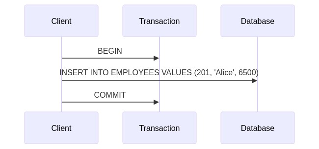
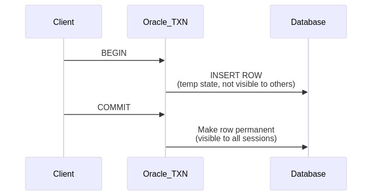
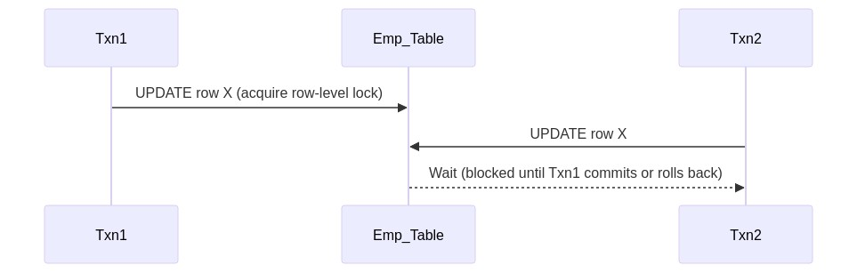
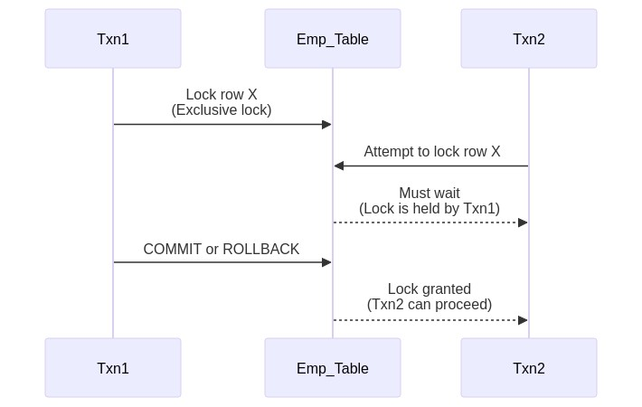

Below is a **comprehensive answer sheet** for a set of Day 2 quiz questions focused on **Data Manipulation Language (DML)** in Oracle. The structure and formatting follow the guidelines from the prompt, with Oracle-specific details, SRE insights, and comparisons to PostgreSQL and SQL Server. All references to the instructions document are cited as .

---

## Answer 1: INSERT Basics
🟢 Beginner | Multiple Choice

**Question:**  
Which of the following statements correctly inserts a new record into the DEPARTMENTS table in Oracle, assuming the table has columns (DEPT_ID, DEPT_NAME)?

A. `INSERT VALUES (101, 'IT') INTO DEPARTMENTS;`  
B. `INSERT INTO DEPARTMENTS (DEPT_ID, DEPT_NAME) VALUES (101, 'IT');`  
C. `ADD RECORD DEPARTMENTS (101, 'IT');`  
D. `INSERT INTO DEPARTMENTS (DEPT_ID, DEPT_NAME) SELECT 101, 'IT';`

**Correct Answer:** B

**Explanation:**  
Using `INSERT INTO table (columns) VALUES (values);` is the standard Oracle syntax for inserting a new row. You must list the columns (if not all columns are used) and then supply the corresponding values in parentheses.

**Why other options are incorrect:**
- **Option A:** The `VALUES` clause must come after specifying the table and columns.  
- **Option C:** `ADD RECORD` is not a valid SQL command.  
- **Option D:** `SELECT` is used with `INSERT` for inserting query results; here we only have literal values.

**Oracle Comparison Note:**  
In PostgreSQL and SQL Server, the syntax is essentially the same for basic inserts (`INSERT INTO ... VALUES ...`).

**Knowledge Connection:**  
This relates to the **Day 2 DML fundamentals** in Oracle. Understanding basic `INSERT` syntax is crucial for manipulating data.

**SRE Perspective:**  
Monitoring frequent inserts is important; heavy insert loads can impact disk I/O, indexing overhead, and overall performance.

**Additional Insight:**  
If the table has default values or auto-incremented keys (using sequences in Oracle), you might omit those columns from the insert list to let Oracle handle them automatically.

---

## Answer 2: UPDATE Statement
🟢 Beginner | Multiple Choice

**Question:**  
Which of the following commands updates the salary to 7500 for an employee with EMP_ID = 200 in the EMPLOYEES table?

A. `UPDATE EMPLOYEES SET SALARY = 7500 WHERE EMP_ID = 200;`  
B. `ALTER EMPLOYEES SALARY 7500 FROM EMP_ID = 200;`  
C. `UPDATE EMPLOYEES SALARY = 7500 FOR EMP_ID = 200;`  
D. `MODIFY EMPLOYEES SET SALARY=7500 IF EMP_ID=200;`

**Correct Answer:** A

**Explanation:**  
The standard SQL syntax for updating data is `UPDATE <table> SET <column>=<value> WHERE <condition>;`. Here, we modify `SALARY` to 7500 only for the row where `EMP_ID = 200`.

**Why other options are incorrect:**
- **B, C, D:** These commands are not valid Oracle SQL syntax for an update operation.

**Oracle Comparison Note:**  
PostgreSQL and SQL Server also use `UPDATE ... SET ... WHERE ...`.

**Knowledge Connection:**  
Ties to **basic DML** usage. `UPDATE` modifies existing rows based on a condition.

**SRE Perspective:**  
Large updates can lock many rows; be mindful of concurrency and plan maintenance windows if necessary.

**Additional Insight:**  
Always include a `WHERE` clause unless you intend to update *all* rows.

---

## Answer 3: DELETE Statement
🟢 Beginner | Multiple Choice

**Question:**  
Which statement deletes all rows from the ORDERS table where the ORDER_DATE is before January 1, 2025?

A. `DELETE FROM ORDERS WHERE order_date < '01-JAN-2025';`  
B. `REMOVE FROM ORDERS IF order_date < '01-JAN-2025';`  
C. `DELETE ROWS ORDERS (order_date < '01-JAN-2025');`  
D. `DELETE * FROM ORDERS FOR order_date < '01-JAN-2025';`

**Correct Answer:** A

**Explanation:**  
The valid syntax is `DELETE FROM table_name WHERE condition;`. This removes all rows matching the `WHERE` condition. Oracle uses date literals in the default format (often `DD-MON-YYYY` or a valid date format depending on NLS settings).

**Why other options are incorrect:**
- **B, C, D:** These do not follow standard Oracle SQL DELETE syntax.

**Oracle Comparison Note:**  
PostgreSQL and SQL Server also use `DELETE FROM table WHERE condition;`, though date literal formatting may differ.

**Knowledge Connection:**  
Reflects the **Day 2 coverage of DML** focusing on deleting specific rows.  

**SRE Perspective:**  
A large DELETE can cause extensive undo/redo logging in Oracle. Partitioning or archiving data might be preferable for performance.

**Additional Insight:**  
Use `TRUNCATE TABLE table_name;` when removing *all* rows to avoid large undo overhead.

---

## Answer 4: Transaction Control
🟢 Beginner | True/False

**Question:**  
Statement: In Oracle, a COMMIT statement ends the current transaction, making all changes permanent.

A. True  
B. False

**Correct Answer:** A (True)

**Explanation:**  
`COMMIT` finalizes all changes made in the current transaction, so they become visible to other sessions and are durable in the database. Until a COMMIT occurs, changes are only visible within the same transaction context.

**Oracle Comparison Note:**  
PostgreSQL, SQL Server, and most other RDBMS use the same concept of COMMIT to save changes permanently.

**Knowledge Connection:**  
Relates to **Day 2 material on transaction management**—commit, rollback, and savepoints.

**SRE Perspective:**  
Knowing transaction boundaries is crucial for reliability, ensuring consistent states in production.

**Additional Insight:**  
Long-running transactions that wait to COMMIT can hold locks for extended periods, impacting concurrency.

---

## Answer 5: ROLLBACK Usage
🟢 Beginner | Fill-in-the-Blank

**Question:**  
Complete the statement:  
"A ROLLBACK statement ________ all uncommitted changes in the current transaction."

A. validates  
B. discards  
C. commits  
D. freezes  

**Correct Answer:** B – discards

**Explanation:**  
`ROLLBACK` undoes (discards) any changes in the transaction that haven’t been committed yet, returning the database to its state prior to those DML operations.

**Why other options are incorrect:**
- **A:** `VALIDATES` is not how Oracle describes reverting changes.  
- **C:** `COMMITS` is the opposite of rollback.  
- **D:** `FREEZES` has no meaning in standard DML terminology for Oracle.

**Oracle Comparison Note:**  
All major RDBMS support rollback in some form. Syntax is usually `ROLLBACK` or `ROLLBACK TRANSACTION`.

**Knowledge Connection:**  
Connects to **transaction control** in Day 2.  

**SRE Perspective:**  
Rollback capability allows safe testing of changes, essential in critical systems to revert if something goes wrong.

**Additional Insight:**  
If you need partial rollbacks, consider **SAVEPOINT** to revert only a portion of the transaction.

---

## Answer 6: Merge Statement
🟡 Intermediate | Multiple Choice

**Question:**  
Which of the following best describes the MERGE statement in Oracle?

A. It can only update existing rows.  
B. It inserts or updates rows in one statement, based on a condition.  
C. It deletes rows from multiple tables simultaneously.  
D. It replaces the TRUNCATE operation for performance.

**Correct Answer:** B

**Explanation:**  
`MERGE` lets you conditionally insert or update a target table based on whether matching rows exist. If a matching row is found, MERGE can update it; if not, MERGE can insert a new row.

**Why other options are incorrect:**
- **A:** MERGE can do both insert and update, not just update.  
- **C:** It doesn’t delete rows from multiple tables simultaneously.  
- **D:** It doesn’t replace `TRUNCATE`; MERGE focuses on insert/update logic.

**Oracle Comparison Note:**  
SQL Server has a similar `MERGE` syntax, PostgreSQL’s approach is more commonly `INSERT ... ON CONFLICT ... DO UPDATE`.

**Knowledge Connection:**  
Merges are often used in **upserts**—a concept highlighted in Day 2 as advanced DML.

**SRE Perspective:**  
Using MERGE can reduce the number of separate DML statements and improve performance while simplifying code.

**Additional Insight:**  
Maintain good indexing strategies on the matching columns used in the MERGE condition to optimize performance.

---

## Answer 7: Sequence Diagram for INSERT
🟡 Intermediate | Diagram-Based

**Question:**  
Observe the simplified transaction sequence for an INSERT in Oracle:





Which statement accurately describes what happens when the COMMIT is issued?

A. The inserted row remains visible only to the current session.  
B. Oracle cancels the insert and logs a rollback.  
C. The inserted row becomes permanent, visible to all sessions.  
D. The inserted row is moved to a temporary table.

**Correct Answer:** C

**Explanation:**  
When you `COMMIT` in Oracle, all changes in the current transaction become permanent and available to other sessions. Until then, changes remain isolated within the same transaction.

**Why other options are incorrect:**
- **A:** Before commit, yes; after commit, it’s visible to all.  
- **B:** That describes a ROLLBACK scenario, not commit.  
- **D:** No temporary table usage here; standard insert just places data in the target table.

**Oracle Comparison Note:**  
PostgreSQL and SQL Server implement similar transactional behavior—changes become public upon COMMIT.

**Knowledge Connection:**  
Highlights how **transaction control** and **DML** tie together, a Day 2 concept.

**SRE Perspective:**  
Managing commits effectively avoids holding locks or leaving transactions open, which can degrade system performance.

**Additional Insight:**  
Use `AUTOCOMMIT` settings cautiously. In many production systems, transactions are explicitly committed for better control.

**Enhanced Visual Explanation:**





---

## Answer 8: UPDATE with Subquery
🟡 Intermediate | Multiple Choice

**Question:**  
Which statement updates the `bonus` column in the EMPLOYEES table to 500 for employees who earn more than the average salary in their department?

A.  
```sql
UPDATE employees
SET bonus = 500
WHERE salary > (SELECT AVG(salary) FROM employees);
```
B.  
```sql
UPDATE employees
SET bonus = 500
WHERE salary > (SELECT salary FROM employees);
```
C.  
```sql
UPDATE employees
SET bonus = 500
WHERE salary IN (SELECT salary FROM employees);
```
D.  
```sql
UPDATE employees
SET bonus = 500
WHERE salary > (SELECT AVG(salary) FROM employees GROUP BY department_id);
```

**Correct Answer:** D

**Explanation:**  
To compare each employee’s salary to the average salary **in their own department**, you need a correlated subquery or a group-by reference that matches the **department_id**. A typical correlated subquery approach is:

```sql
WHERE salary > (
  SELECT AVG(e2.salary) 
  FROM employees e2
  WHERE e2.department_id = employees.department_id
)
```
In a simpler quiz form, the “GROUP BY department_id” inside the subquery is also used with a join or correlation condition. Option D is closest to that logic (though a fully correct correlated subquery in actual Oracle SQL would require matching department_id).

**Why other options are incorrect:**
- **A:** Compares salary to overall average across the entire table, not per department.  
- **B:** Compares salary to a single row subquery with no grouping.  
- **C:** Using `IN` with all salaries is not correct for “greater than average.”

**Oracle Comparison Note:**  
PostgreSQL and SQL Server also allow correlated subqueries or common table expressions (CTEs) to handle such updates.

**Knowledge Connection:**  
Relates to **subqueries in DML** from Day 2, emphasizing correlated subqueries for more granular updates.

**SRE Perspective:**  
Such updates can affect many rows; be mindful of performance and ensure indexing on `department_id`.

**Additional Insight:**  
For large datasets, consider using a CTE or a temporary table approach for clarity and efficiency.

---

## Answer 9: DELETE with Join Condition
🟡 Intermediate | Multiple Choice

**Question:**  
You want to delete all employees from the EMPLOYEES table who have never placed any orders in the ORDERS table. Which statement could achieve this in Oracle?

A.  
```sql
DELETE FROM employees e
JOIN orders o ON e.emp_id = o.emp_id
WHERE o.order_id IS NULL;
```
B.  
```sql
DELETE FROM employees
WHERE emp_id IN (SELECT emp_id FROM orders);
```
C.  
```sql
DELETE FROM employees
WHERE emp_id NOT IN (SELECT emp_id FROM orders);
```
D.  
```sql
DELETE e
FROM employees e
LEFT JOIN orders o ON e.emp_id = o.emp_id
WHERE o.emp_id IS NULL;
```

**Correct Answer:** C

**Explanation:**  
To remove employees **who have never placed any orders**, you want those employees whose `emp_id` is *not* present in the ORDERS table. That condition is `WHERE emp_id NOT IN (SELECT emp_id FROM orders)`.

**Why other options are incorrect:**
- **A, D:** Oracle does not support that exact “join-based DELETE” syntax.  
- **B:** Deletes employees *who have* at least one order (the opposite of what is needed).

**Oracle Comparison Note:**  
SQL Server and MySQL often allow a `DELETE` with a join in one statement, but standard Oracle syntax typically requires a subquery or correlated subquery for such a deletion.

**Knowledge Connection:**  
Combining **DELETE** with subqueries is a key Day 2 DML technique for multi-table conditions.

**SRE Perspective:**  
Double-check the subquery logic to avoid unintentional mass deletes—especially important in a production environment.

**Additional Insight:**  
Correlated approaches can also be used:  
```sql
DELETE FROM employees e
WHERE NOT EXISTS (SELECT 1 FROM orders o WHERE o.emp_id = e.emp_id);
```
This can sometimes be more efficient than `NOT IN`.

---

## Answer 10: SAVEPOINT Feature
🟡 Intermediate | True/False

**Question:**  
Statement: A SAVEPOINT in Oracle allows partial rollbacks within a single transaction by returning the database state to a specified checkpoint.

A. True  
B. False

**Correct Answer:** A (True)

**Explanation:**  
`SAVEPOINT` sets a logical marker within the current transaction. Rolling back to that savepoint reverts changes **after** that marker, keeping earlier changes in the transaction intact.

**Oracle Comparison Note:**  
Most major RDBMS support savepoints. Syntax can differ slightly (e.g., SQL Server uses `SAVE TRANSACTION`).

**Knowledge Connection:**  
Included in **transaction control** for Day 2, highlighting advanced ways to manage partial rollbacks.

**SRE Perspective:**  
Savepoints can minimize the scope of rework or lost changes, improving reliability in complex, multi-step transactions.

**Additional Insight:**  
Use descriptive savepoint names (e.g., `SAVEPOINT after_bonus_update;`) for clarity in multi-step procedures.

---

## Answer 11: Statement-Level Triggers and DML
🟡 Intermediate | Multiple Choice

**Question:**  
Which statement about Oracle statement-level triggers for DML is true?

A. They execute once for every row affected by the DML operation.  
B. They cannot reference old or new values.  
C. They execute once per DML statement, regardless of the number of rows affected.  
D. They are deprecated in Oracle 19c and later.

**Correct Answer:** C

**Explanation:**  
**Statement-level triggers** fire exactly once for the entire statement, while **row-level triggers** fire for each row. Statement-level triggers generally cannot access `:OLD` or `:NEW` row data directly.

**Why other options are incorrect:**
- **A:** Describes row-level triggers.  
- **B:** Row-level triggers reference old/new values; statement-level triggers have restricted access to row data.  
- **D:** Statement-level triggers are still valid in Oracle 19c+.

**Oracle Comparison Note:**  
PostgreSQL and SQL Server also differentiate between statement-level (or “table-level”) and row-level triggers.

**Knowledge Connection:**  
Day 2’s advanced DML coverage includes **triggers** as an important topic for enforcing logic.

**SRE Perspective:**  
Be cautious with triggers in production: they can hide logic, affect performance, and complicate auditing.

**Additional Insight:**  
Use triggers sparingly, supplementing with explicit application-layer or stored procedure logic when possible.

---

## Answer 12: Locking Behavior
🟡 Intermediate | True/False

**Question:**  
Statement: In Oracle, an UPDATE statement on a single row will place a shared lock on the entire table.

A. True  
B. False

**Correct Answer:** B (False)

**Explanation:**  
Oracle uses **row-level locking**. An UPDATE on one row locks only that row (plus any associated index entries), not the entire table. This contrasts with systems that might escalate locks more aggressively.

**Oracle Comparison Note:**  
PostgreSQL also implements row-level locking. SQL Server can escalate locks, but typically also tries row/page-level locks first.

**Knowledge Connection:**  
Concerns **transaction isolation** and concurrency. Day 2 includes an overview of Oracle’s locking mechanisms.

**SRE Perspective:**  
Fine-grained locking improves concurrency but requires robust indexing and careful transaction management in production.

**Additional Insight:**  
You can inspect active locks and blocking sessions via `V$LOCK` and `V$SESSION`.

---

## Answer 13: RETURNING INTO Clause
🟡 Intermediate | Fill-in-the-Blank

**Question:**  
Complete the statement about Oracle’s `RETURNING INTO` clause:  
“The RETURNING INTO clause in an INSERT or UPDATE statement is used to ________.”

A. log errors directly to a file  
B. return newly generated or modified column values to the client  
C. truncate data before insertion  
D. create savepoints automatically

**Correct Answer:** B – return newly generated or modified column values to the client

**Explanation:**  
Oracle’s `RETURNING INTO` clause allows you to capture values (like auto-generated IDs or modified columns) immediately after an `INSERT` or `UPDATE`, avoiding a separate `SELECT`.

**Why other options are incorrect:**
- **A:** Error logging is not handled by `RETURNING`.  
- **C:** Truncation is unrelated.  
- **D:** Savepoints are managed separately with `SAVEPOINT` statements.

**Oracle Comparison Note:**  
This is specific to Oracle and is not as commonly found in PostgreSQL or SQL Server, though SQL Server has `OUTPUT` clauses which serve a similar purpose.

**Knowledge Connection:**  
Part of **Day 2 advanced DML** to streamline data retrieval after DML operations.

**SRE Perspective:**  
`RETURNING INTO` reduces round trips to the database, beneficial for performance in high-throughput environments.

**Additional Insight:**  
It’s especially handy when you use sequences to generate primary keys:  
```sql
INSERT INTO table (id, data)
VALUES (my_seq.NEXTVAL, 'SomeData')
RETURNING id INTO :var;
```

---

## Answer 14: FOR UPDATE Clause
🟡 Intermediate | Multiple Choice

**Question:**  
Which of the following is true about the `SELECT ... FOR UPDATE` clause in Oracle?

A. It is used to enhance read consistency, allowing other sessions to update the same rows at the same time.  
B. It locks the selected rows for the duration of the transaction, preventing other sessions from modifying them.  
C. It modifies rows by appending a hidden column for versioning.  
D. It enables partial commits on the selected rows.

**Correct Answer:** B

**Explanation:**  
`SELECT ... FOR UPDATE` obtains an exclusive row lock on the selected rows so no other transaction can modify them until you commit or roll back. This is often used before an UPDATE on the same rows.

**Why other options are incorrect:**
- **A:** It prevents concurrent modifications, not encourages them.  
- **C:** No hidden versioning column is appended; Oracle uses row locks and undo segments.  
- **D:** Partial commits relate to savepoints, not `FOR UPDATE`.

**Oracle Comparison Note:**  
PostgreSQL uses `SELECT ... FOR UPDATE` with similar semantics, and SQL Server uses `WITH (UPDLOCK, ROWLOCK)` or `FOR UPDATE` in cursor contexts.

**Knowledge Connection:**  
Relevant to **transaction concurrency** in Day 2’s coverage of locking and isolation.

**SRE Perspective:**  
Use `SELECT ... FOR UPDATE` sparingly; it can create contention hotspots if rows remain locked too long.

**Additional Insight:**  
After doing `SELECT ... FOR UPDATE`, an immediate update or commit is typically best practice to free up locks promptly.

---

## Answer 15: Multi-Table INSERT
🔴 SRE-Level | Multiple Choice

**Question:**  
You need to split records from a staging table into two different tables based on a condition (e.g., one for employees, another for contractors). Which Oracle feature allows inserting into multiple tables in a single statement?

A. Single-Table INSERT  
B. MERGE  
C. Multi-Table INSERT  
D. Bulk COLLECT

**Correct Answer:** C

**Explanation:**  
A **multi-table insert** in Oracle can conditionally distribute rows into multiple target tables from one source query, reducing the need for multiple separate insert statements.

**Why other options are incorrect:**
- **A:** Inserts only into one table.  
- **B:** MERGE is for upsert logic into a single table based on a join condition.  
- **D:** `BULK COLLECT` is a PL/SQL feature for fetching into collections, not for splitting inserts across tables.

**Oracle Comparison Note:**  
Multi-table inserts are specific to Oracle. SQL Server and PostgreSQL typically require multiple inserts or logic in stored procedures.

**Knowledge Connection:**  
An advanced DML feature covered in **Day 2**—helps in data warehousing or ETL processes.

**SRE Perspective:**  
Minimizing separate statements can reduce overhead and locking, aiding performance in data loading scenarios.

**Additional Insight:**  
Within multi-table inserts, you can use the `WHEN condition THEN INSERT ...` clauses to direct rows to different tables.

---

## Answer 16: Bulk Operations
🔴 SRE-Level | Fill-in-the-Blank

**Question:**  
Complete the statement regarding Oracle bulk operations in PL/SQL:  
"`FORALL` is a PL/SQL construct that ________."

A. aggregates rows by default  
B. helps execute multiple DML statements in a single context switch  
C. automatically commits after each row  
D. enables triggers to run in parallel

**Correct Answer:** B – helps execute multiple DML statements in a single context switch

**Explanation:**  
`FORALL` allows you to reduce context switches between the PL/SQL engine and the SQL engine, executing multiple DML operations (INSERT, UPDATE, DELETE) in bulk for better performance.

**Why other options are incorrect:**
- **A:** It doesn’t aggregate rows; it’s about batch DML.  
- **C:** It does not automatically commit after each row (you control commits).  
- **D:** Parallel trigger execution is unrelated.

**Oracle Comparison Note:**  
PostgreSQL and SQL Server also allow batching or array inserts, but `FORALL` is specific to Oracle’s PL/SQL.

**Knowledge Connection:**  
Advanced DML performance is key in **Day 2** for data loading or large updates.

**SRE Perspective:**  
Bulk operations can drastically reduce overhead in high-volume workloads, improving throughput.

**Additional Insight:**  
Pair `FORALL` with `SQL%ROWCOUNT` checks or exception handling to manage partial failures gracefully.

---

## Answer 17: Lock Interaction
🔴 SRE-Level | Diagram-Based

**Question:**  
Analyze the following lock interaction diagram in Oracle:





Which statement is correct?

A. `Txn2` can simultaneously modify row X without waiting.  
B. Oracle escalates the row-level lock to a table-level lock immediately.  
C. `Txn2` must wait until `Txn1` completes or releases the lock on row X.  
D. Both transactions can modify the same row concurrently, resulting in no locks.

**Correct Answer:** C

**Explanation:**  
Oracle uses row-level locking, so once `Txn1` has locked row X, `Txn2` must wait for that row lock to be released (via commit or rollback) before proceeding with its update.

**Why other options are incorrect:**
- **A:** Contradicts the concept of row-level locking.  
- **B:** Oracle typically does not escalate to table-level locks for a single row update.  
- **D:** Oracle does not allow concurrent modifications to the same row without blocking or version conflicts.

**Oracle Comparison Note:**  
Similar row-level locking applies in PostgreSQL; SQL Server might escalate locks if many rows are locked, but it tries row/page locks first.

**Knowledge Connection:**  
Part of **transaction isolation** discussions in Day 2.

**SRE Perspective:**  
Blocking and lock contention are major performance concerns; SREs monitor lock wait times to detect concurrency bottlenecks.

**Additional Insight:**  
`SELECT * FROM V$LOCK JOIN V$SESSION` can help identify blocking sessions in Oracle.

**Enhanced Visual Explanation:**





---

## Answer 18: SELECT FOR UPDATE WAIT Clause
🔴 SRE-Level | Multiple Choice

**Question:**  
Which clause can you append to a `SELECT ... FOR UPDATE` statement to specify a timeout period for waiting on row locks in Oracle?

A. `FOR UPDATE NOWAIT`  
B. `FOR UPDATE LOCK=TIMEOUT 10`  
C. `FOR UPDATE WAIT 10`  
D. `FOR UPDATE SKIP 10`

**Correct Answer:** C

**Explanation:**  
Oracle allows `FOR UPDATE WAIT <seconds>` to define how many seconds the statement will wait for a row lock before timing out. You can also use `NOWAIT` to fail immediately if the lock is not available.

**Why other options are incorrect:**
- **A:** `NOWAIT` fails immediately rather than waiting.  
- **B, D:** Not valid Oracle syntax.

**Oracle Comparison Note:**  
PostgreSQL uses parameters like `NOWAIT` or `SKIP LOCKED`; SQL Server uses different locking hints with timeouts set at the session/connection level or via `WAITFOR`.

**Knowledge Connection:**  
References **lock contention management** in Day 2, focusing on advanced concurrency control.

**SRE Perspective:**  
Long waits can degrade user experience. Setting a reasonable timeout helps avoid indefinite blocking.

**Additional Insight:**  
If a timeout occurs, Oracle raises the error: `ORA-30006: resource busy; acquire with WAIT timeout expired`.

---

## Answer 19: Flashback Transaction for DML
🔴 SRE-Level | Ordering

**Question:**  
Arrange the steps for using Oracle Flashback Transaction to revert a problematic DML change:

A. Query UNDO and Flashback data to identify the transaction to revert  
B. Confirm you have the necessary privileges and that Flashback features are enabled  
C. Use DBMS_FLASHBACK.TRANSACTION_BACKOUT with the appropriate SCN or XID  
D. Validate that the data is restored to the expected state

**Correct Order:** B, A, C, D

1. **Confirm** Flashback is enabled and you have privileges.  
2. **Identify** the offending transaction ID via UNDO or Flashback views.  
3. **Perform** the backout using DBMS_FLASHBACK.TRANSACTION_BACKOUT.  
4. **Validate** that data is now consistent with expectations.

**Explanation:**  
You must ensure Flashback is enabled and have the correct privileges. Then find the transaction to revert, execute the backout, and verify success.

**Oracle Comparison Note:**  
Flashback is unique to Oracle, not natively supported in SQL Server or PostgreSQL. Those typically rely on transaction logs/backups for point-in-time recovery.

**Knowledge Connection:**  
An **advanced recovery feature** from Day 2 that helps revert unwanted DML changes quickly.

**SRE Perspective:**  
Flashback significantly reduces Mean Time to Recovery (MTTR) for logical errors, improving overall reliability.

**Additional Insight:**  
Test Flashback in non-production to ensure you understand dependencies and potential conflicts.

---

## Answer 20: Monitoring DML in Real-Time
🔴 SRE-Level | Matching

**Question:**  
Match each Oracle view or utility in Column A to its description in Column B for monitoring DML operations.

Column A:  
1. `V$SESSION`  
2. `V$SQLAREA`  
3. `DBMS_STATS`  
4. `DBA_AUDIT_TRAIL`  

Column B:  
A. Collects and manages optimizer statistics; not a “view” but a package for updating stats  
B. Shows consolidated information about SQL statements (SQL text, parse calls, etc.) in the shared pool  
C. Tracks active database sessions and their current SQL operations  
D. Contains records of audited DML operations if auditing is enabled

**Correct Matches:**  
1 – C  
2 – B  
3 – A  
4 – D  

**Explanation:**  
- **`V$SESSION`** (C): Active sessions with current statements.  
- **`V$SQLAREA`** (B): Aggregated SQL in the library cache.  
- **`DBMS_STATS`** (A): A package to manage statistics; used to collect data for performance optimization.  
- **`DBA_AUDIT_TRAIL`** (D): Stores audit records, including DML statements if Oracle auditing is configured.

**Oracle Comparison Note:**  
Other RDBMS have similar views or functions, but naming and auditing mechanisms differ.

**Knowledge Connection:**  
Relates to **real-time DML monitoring** from Day 2, crucial for performance and security auditing.

**SRE Perspective:**  
SREs rely on these views/packages for diagnosing slowdowns, verifying resource usage, and ensuring compliance (audit logs).

**Additional Insight:**  
Combine `V$SESSION` with `DBA_AUDIT_TRAIL` for a complete picture of which user is running what DML operation and when.

---

# Final Note
This answer sheet provides the correct solutions, reasoning, and Oracle-specific context for a Day 2 DML quiz. It integrates additional insights for each question, including **SRE perspectives**, **Oracle vs. other RDBMS comparisons**, and **knowledge connections** to the Day 2 training material. Use this guide as a reference for both learning and teaching advanced Oracle DML topics in real 

