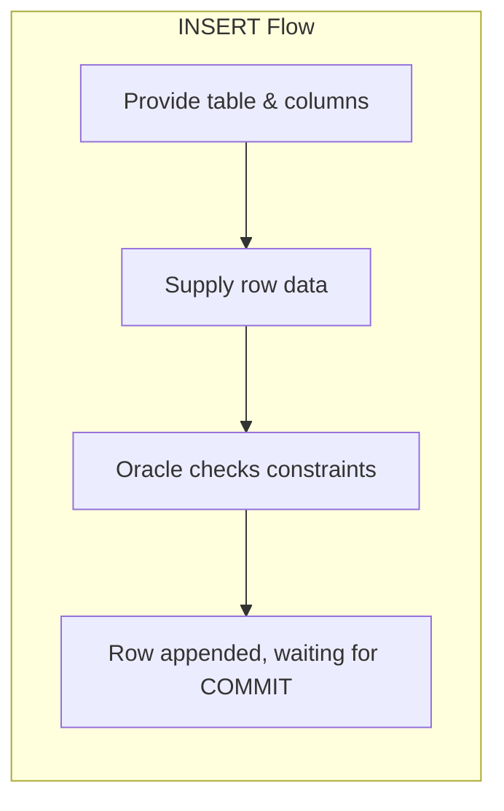
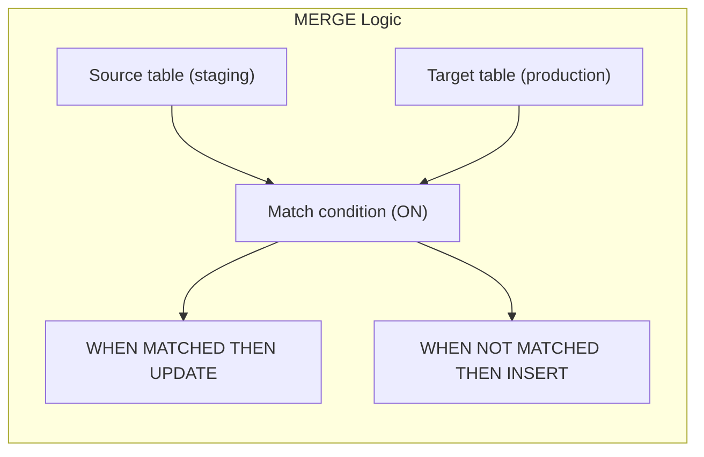
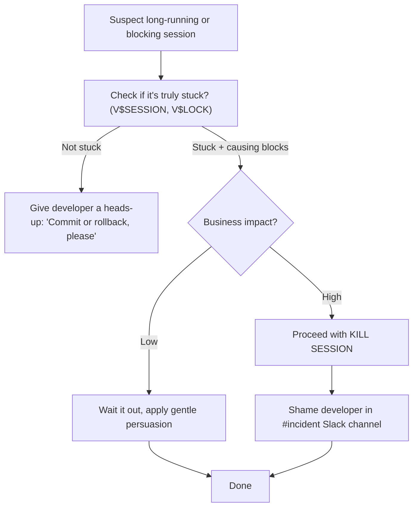
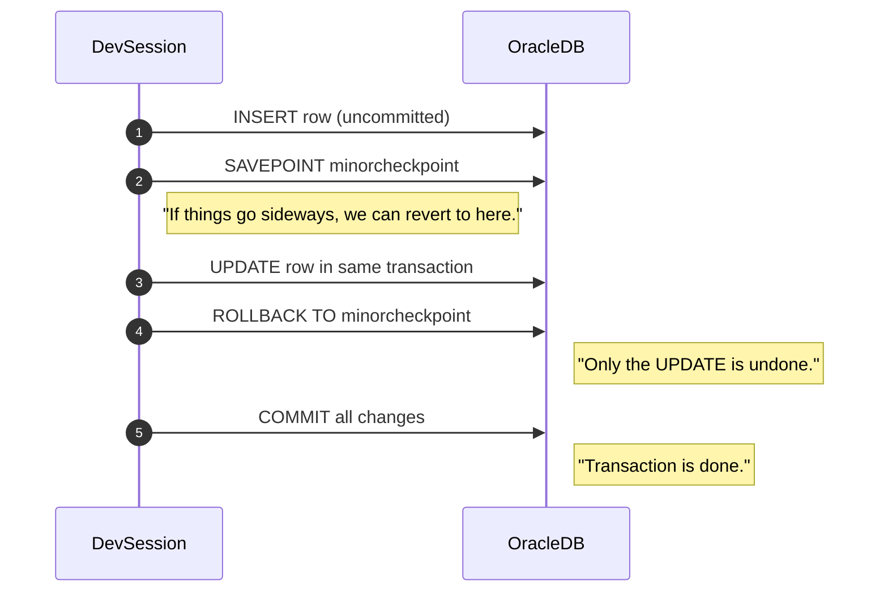
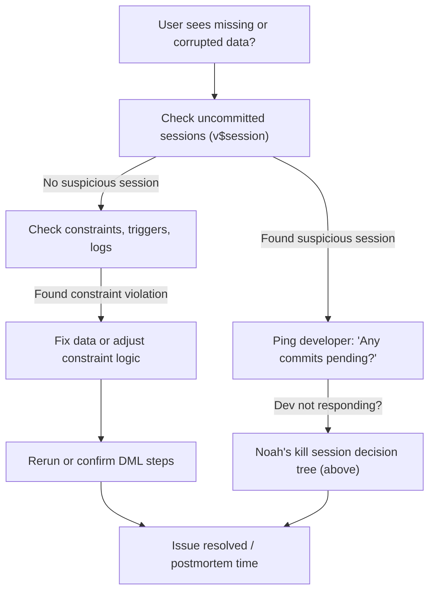

I'll create a comprehensive quiz question prompt for Day 2 of the "Follow-the-Sun Chronicles" training based on the template you've provided.

# 📝 SRE Database Training Module - Day 2: Quiz Questions

## 🧑‍🏫 Role
You are an expert database instructor creating assessment questions for Day 2 of "The Follow-the-Sun Chronicles" training featuring Noah, the observability-obsessed SRE based in Sydney, Australia. These questions will test knowledge from beginner to SRE-level concepts covered specifically in the Day 2 material, with the primary database focus being Oracle DML operations and transaction control.

## 📝 Quiz Structure Requirements

Create 20 quiz questions with the following distribution:
- (🔍) 7 Beginner-Level Questions
- (🧩) 7 Intermediate-Level Questions
- (💡) 6 Advanced/SRE-Level Questions

Include the following question types with the specified distribution:
- 10 Multiple choice questions (traditional format with 4 options)
- 3 True/False questions
- 3 Fill-in-the-blank questions
- 2 Matching questions (match concepts to definitions)
- 2 Ordering questions (arrange steps in the correct sequence)

Each question must:
- Clearly indicate its difficulty level with the appropriate emoji
- Connect directly to content covered in the Day 2 material by Noah
- Reference Noah's analogies, principles, rules, or commentaries where appropriate
- Include relevant context for scenario-based questions
- Include Oracle-specific content as presented in the training

At least 5 questions should incorporate Mermaid diagrams similar to those used in the Day 2 training for visual assessment.

## Quiz Content Focus Areas (Based on Day 2 Material)

1. **Core DML Concepts: INSERT, UPDATE, DELETE, MERGE**
   - Noah's explanation of each DML operation (INSERT as new club membership, UPDATE as correcting a typo, DELETE as kicking a member out)
   - Oracle syntax compared to PostgreSQL/SQL Server
   - Noah's rules regarding proper handling of each DML statement
   - Visual flow diagrams showing the process of each operation

2. **Transaction Control: COMMIT, ROLLBACK, SAVEPOINT**
   - Noah's shopping cart analogy for transaction control 
   - Examples of multi-step transactions with SAVEPOINT
   - Noah's emphasis on explicit COMMIT vs auto-commit illusions
   - Noah's personal anecdote about trying to fix a partial update without ROLLBACK

3. **Locking Behavior and Concurrency**
   - Noah's description of lock conflicts as "grumpy trolls" under rows
   - Noah's postmortem about killing a developer's session
   - The session kill decision tree for assessing when to terminate vs. shame
   - Performance implications of long transactions and row-level locking

4. **MERGE Statement and Upsert Operations**
   - Noah's "membership roster sync" analogy for MERGE
   - Oracle MERGE syntax and potential issues
   - The importance of validating the ON condition meticulously
   - Noah's warnings about MERGE going wrong "in a dozen different ways"

5. **DML-Related Incidents and Troubleshooting**
   - The 08:00 AEDT morning incident with uncommitted transactions
   - Noah's troubleshooting approach for data consistency issues
   - The incident sequence diagram regarding blocked sessions
   - Noah's emphasis on transaction discipline in production

6. **Advanced DML Operations and Error Handling**
   - Noah's FAQ responses about common DML pitfalls
   - Large DELETE operations blocking everything else
   - ORA-01555 "snapshot too old" errors and undo retention
   - Noah's warning about TRUNCATE being DDL (not rollbackable)

## Question Type Formats

### Multiple Choice Format
```
## Question X: [Topic]
🔍/🧩/💡 [Difficulty Level]

[Question text]

A. [Option A]
B. [Option B]
C. [Option C]
D. [Option D]
```

### True/False Format
```
## Question X: [Topic]
🔍/🧩/💡 [Difficulty Level]

[Statement]

A. True
B. False
```

### Fill-in-the-Blank Format
```
## Question X: [Topic]
🔍/🧩/💡 [Difficulty Level]

Complete the following statement:

[Statement with ________ for the blank]

A. [Option A]
B. [Option B]
C. [Option C]
D. [Option D]
```

### Matching Format
```
## Question X: [Topic]
🔍/🧩/💡 [Difficulty Level]

Match each item in Column A with the appropriate item in Column B.

Column A:
1. [Item 1]
2. [Item 2]
3. [Item 3]
4. [Item 4]

Column B:
A. [Definition/Example A]
B. [Definition/Example B]
C. [Definition/Example C]
D. [Definition/Example D]
```

### Ordering Format
```
## Question X: [Topic]
🔍/🧩/💡 [Difficulty Level]

Arrange the following steps in the correct order:

A. [Step A]
B. [Step B]
C. [Step C]
D. [Step D]
```

### Diagram-Based Question Format
```
## Question X: [Topic]
🔍/🧩/💡 [Difficulty Level]

Examine the following database diagram:

```mermaid
[Appropriate diagram code]
```

[Question text based on the diagram]

A. [Option A]
B. [Option B]
C. [Option C]
D. [Option D]
```

## Mermaid Diagram Guidelines for Questions

When creating diagram-based questions, use appropriate Mermaid syntax based on the type of visualization needed:

1. **Flowcharts** for DML operation flows:


2. **MERGE Logic Diagram**:


3. **Session Kill Decision Tree**:


4. **Sequence Diagram** of a transaction with SAVEPOINT:


5. **Troubleshooting Flowchart** for data consistency:


## Special Considerations for Day 2

- Focus on Noah's specific terminology and phrases, such as "The production database remembers" and "transaction discipline" 
- Include questions related to Noah's rules about proper DML usage, including Rule #1 through Rule #10
- Reference Noah's morning incident with the uncommitted transaction that was "invisible to analytics"
- Incorporate Noah's unique perspective on locking behavior as "grumpy trolls under rows"
- Include Oracle-specific DML syntax as emphasized in the training material
- Address real-world SRE scenarios mentioned by Noah, such as long-running transactions and session management
- Include questions about Noah's warnings regarding MERGE mismatches and large DELETE operations
- Reference Noah's personal anecdotes, such as "Ask me how I know this" and his incident reports

DO NOT include the correct answers or explanations in the questions themselves. These will be provided in a separate answer key document.