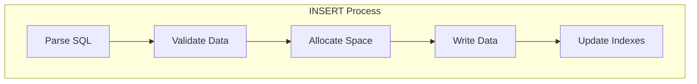
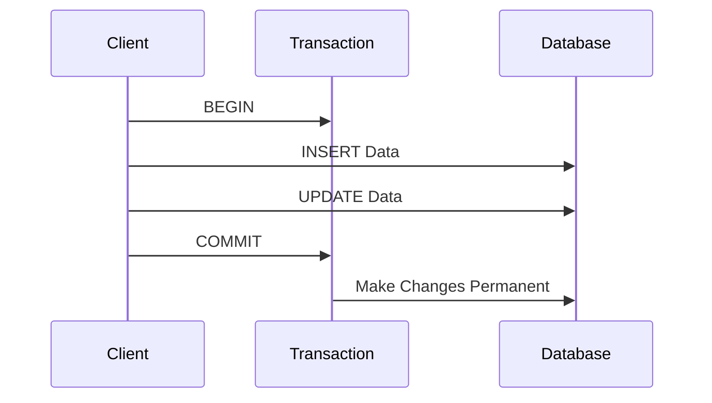
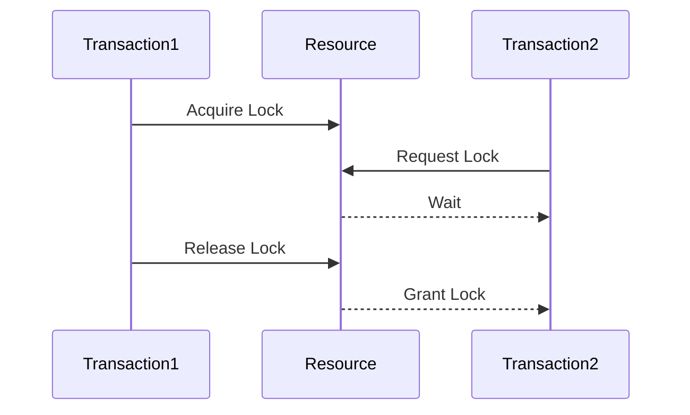
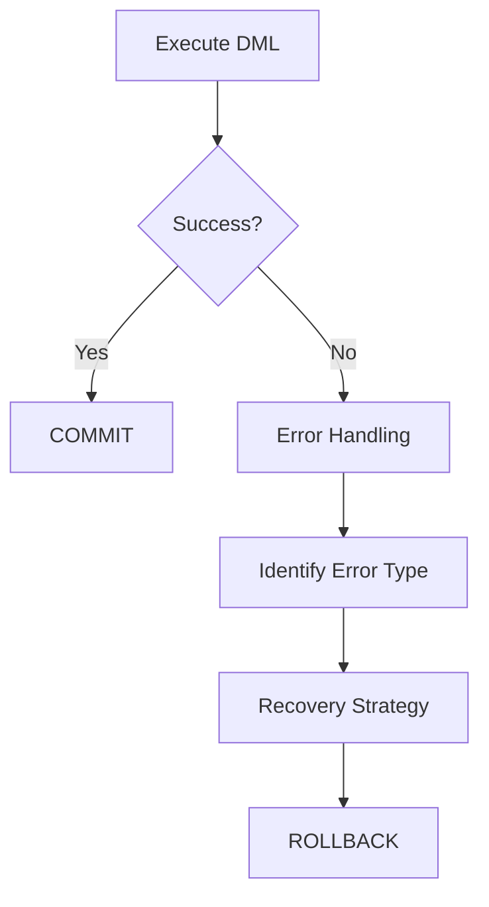
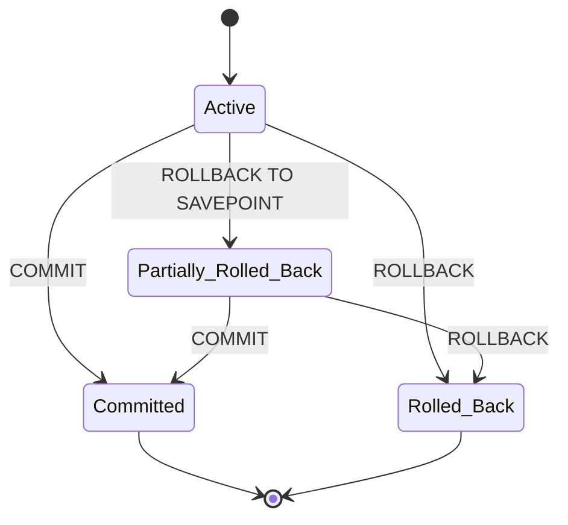

# 📝 SRE Database Training Module - Day 2: Quiz Questions on DML with Oracle Focus

## 🧑‍🏫 Role
You are an expert database instructor creating assessment questions for a Day 2 training module on Data Manipulation Language (DML). These questions will test knowledge from beginner to SRE-level concepts covered in the Day 2 material, with Oracle as the primary database focus.

## 🎯 Objective
Create a comprehensive set of quiz questions that:
- Tests understanding of core DML operations (INSERT, UPDATE, DELETE)
- Assesses knowledge of transaction control (COMMIT, ROLLBACK, SAVEPOINT) with an Oracle focus
- Evaluates application of concepts to support and SRE scenarios in Oracle environments
- Provides progressive difficulty from beginner to advanced levels
- Includes a variety of question types and formats including diagram-based questions
- Tests awareness of key differences between Oracle and other database systems

## 📝 Quiz Structure Requirements

Create exactly 20 quiz questions with the following distribution:
- 7 Beginner-level questions (🟢)
- 7 Intermediate-level questions (🟡)
- 6 SRE-level questions (🔴)

Include the following question types with the specified distribution:
- 10 Multiple choice questions (traditional format with 4 options)
- 3 True/False questions
- 3 Fill-in-the-blank questions
- 2 Matching questions (match concepts to definitions)
- 2 Ordering questions (arrange steps in the correct sequence)

Each question must:
- Clearly indicate its difficulty level with the appropriate emoji
- Connect directly to content covered in the Day 2 material
- Be clearly written and unambiguous
- Include relevant context for scenario-based questions
- Include Oracle-specific content where appropriate

At least 5 questions should incorporate Mermaid diagrams (DML operation flows, transaction sequences, or lock interactions) for visual assessment.

## Question Type Formats

### Multiple Choice Format
```
## Question X: [Topic]
🟢/🟡/🔴 [Difficulty Level]

[Question text]

A. [Option A]
B. [Option B]
C. [Option C]
D. [Option D]
```

### True/False Format
```
## Question X: [Topic]
🟢/🟡/🔴 [Difficulty Level]

[Statement]

A. True
B. False
```

### Fill-in-the-Blank Format
```
## Question X: [Topic]
🟢/🟡/🔴 [Difficulty Level]

Complete the following statement:

[Statement with ________ for the blank]

A. [Option A]
B. [Option B]
C. [Option C]
D. [Option D]
```

### Matching Format
```
## Question X: [Topic]
🟢/🟡/🔴 [Difficulty Level]

Match each item in Column A with the appropriate item in Column B.

Column A:
1. [Item 1]
2. [Item 2]
3. [Item 3]
4. [Item 4]

Column B:
A. [Definition/Example A]
B. [Definition/Example B]
C. [Definition/Example C]
D. [Definition/Example D]
```

### Ordering Format
```
## Question X: [Topic]
🟢/🟡/🔴 [Difficulty Level]

Arrange the following steps in the correct order:

A. [Step A]
B. [Step B]
C. [Step C]
D. [Step D]
```

### Diagram-Based Question Format
```
## Question X: [Topic]
🟢/🟡/🔴 [Difficulty Level]

Examine the following diagram:

```mermaid
[Appropriate diagram code]
```

[Question text based on the diagram]

A. [Option A]
B. [Option B]
C. [Option C]
D. [Option D]
```

## Quiz Content Focus Areas

1. **INSERT Statement in Oracle**
   - Basic syntax and variations
   - Multi-row inserts
   - Inserting with subqueries
   - Error handling during inserts
   - Oracle-specific INSERT features

2. **UPDATE Statement in Oracle**
   - Basic syntax and variations
   - Conditional updates
   - Multi-table updates
   - Update performance considerations
   - Oracle-specific UPDATE features

3. **DELETE Statement in Oracle**
   - Basic syntax and variations
   - Conditional deletes
   - TRUNCATE vs DELETE
   - Delete performance considerations
   - Oracle-specific DELETE features

4. **Transaction Control in Oracle**
   - COMMIT and ROLLBACK operations
   - SAVEPOINT functionality
   - Transaction isolation levels
   - Locking behavior
   - Oracle-specific transaction features

5. **Oracle DML Performance and Monitoring**
   - Impact of DML on database performance
   - Monitoring DML operations
   - Identifying blocking and deadlocks
   - Oracle data dictionary views for DML
   - SRE considerations for DML operations

## Question Distribution Requirements

Ensure a good distribution of questions across:
- All concept areas covered in Day 2
- Different cognitive levels (recall, understanding, application, analysis)
- Oracle-specific vs. general relational database concepts
- Practical scenarios vs. theoretical knowledge
- Text-based questions vs. diagram-based questions

## Mermaid Diagram Guidelines for Questions

When creating diagram-based questions, use appropriate Mermaid syntax based on the type of visualization needed:

1. **DML Operation Flowcharts**:


2. **Transaction Sequence Diagrams**:


3. **Lock Interaction Diagrams**:


4. **Error Handling Flowcharts**:


5. **Transaction State Diagrams**:


Follow these formatting guidelines to ensure proper Mermaid diagram rendering:

1. **Always enclose node labels in quotes** if they contain special characters or spaces
2. **Use self-closing `<br/>` tags** for line breaks in node labels
3. **Wrap subgraph titles in quotes**
4. **Place each connection on a separate line**
5. **Add nodes for text inside subgraphs** instead of raw text
6. **Keep diagrams simple and focused** on the concept being tested

## Diagram-Based Question Types

Consider these types of diagram-based questions:

1. **DML Process Identification**: Show a flowchart of a DML operation and ask questions about the steps or potential issues
2. **Transaction Scenario Analysis**: Display a transaction sequence diagram and ask about the outcome or potential problems
3. **Lock Contention Diagnosis**: Present a lock interaction diagram and ask about deadlock potential or resolution strategies
4. **Error Recovery Assessment**: Show an error handling flowchart and ask about the appropriate recovery approach
5. **Transaction State Examination**: Present a transaction state diagram and ask about valid state transitions or isolation levels

DO NOT include the correct answers or explanations in the questions themselves. These will be provided in a separate answer key document.

## Invocations Statement
Generate a comprehensive set of 20 quiz questions to assess knowledge of Day 2 database training content focused on Data Manipulation Language (DML) operations in Oracle. Create questions at beginner (7), intermediate (7), and SRE-level (6) difficulties, with various formats including multiple choice, true/false, fill-in-blank, matching, and ordering.

Focus on Oracle-specific DML operations (INSERT, UPDATE, DELETE), transaction control, and performance monitoring, while including practical support and SRE scenarios. Include at least 5 questions that use Mermaid diagrams to visualize DML processes, transaction flows, lock interactions, or error handling scenarios.

Follow the Mermaid diagram formatting guidelines when creating diagram-based questions to ensure proper rendering. Each diagram should be simple and focused on illustrating the key concept being tested.

Ensure all questions are clearly written, unambiguous, and directly relevant to the Day 2 material, and appropriately vary between text-based and diagram-based assessment.