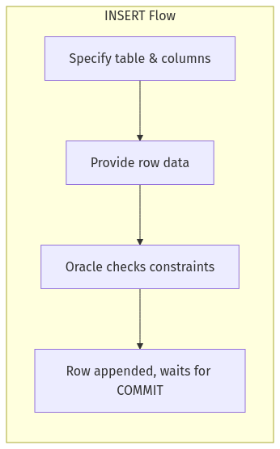
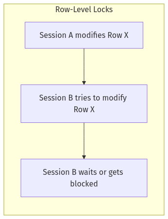
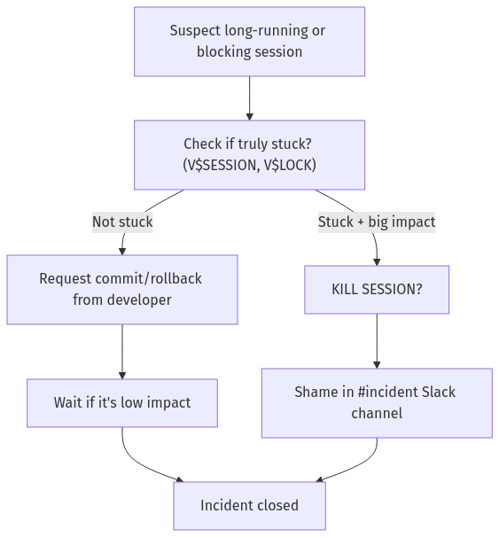
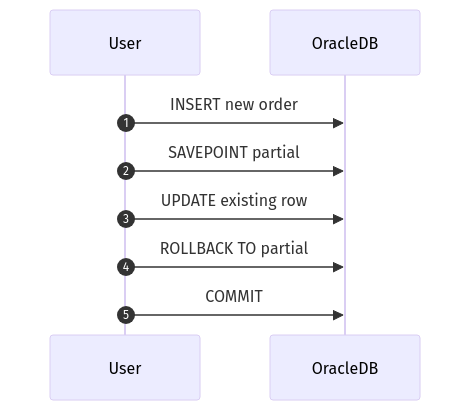
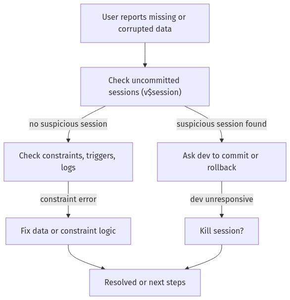

# **Day 2 Quiz**

## **(🔍) Beginner-Level Questions (7)**

---

### **Question 1 (🔍, Multiple Choice)**
**Topic:** Basic Transaction Control

Noah emphasized the importance of “transaction discipline” so that data changes become visible to everyone else. Which statement best represents the final step needed after running an `INSERT`?

A. Wait for auto-commit to happen when you exit the session  
B. Issue a `SAVEPOINT` so other users see the data  
C. Issue a `COMMIT` to make the changes permanent  
D. There is no final step; Oracle commits all changes automatically  

---

### **Question 2 (🔍, Multiple Choice)**
**Topic:** Partial Rollbacks & SAVEPOINT

Noah often uses a “shopping cart” analogy to describe transaction steps. How does `SAVEPOINT` fit into this analogy?

A. It finalizes the entire cart, making items permanent  
B. It completely empties your cart, discarding all items  
C. It marks a checkpoint so you can revert to a previous cart state if needed  
D. It auto-commits just the newly added items  

---

### **Question 3 (🔍, True/False)**
**Topic:** Uncommitted Transactions

Noah warns about the dangers of leaving an uncommitted transaction open for too long. True or false: An uncommitted transaction can block other sessions and remain invisible to analytics until it is either committed or rolled back.

A. True  
B. False  

---

### **Question 4 (🔍, Multiple Choice with Diagram)**
**Topic:** INSERT Flow

Examine the flowchart below illustrating how Oracle handles an `INSERT`:

Which step occurs last before the data becomes fully visible to other sessions?

A. The row data is added into the block cache  
B. Oracle checks constraints for validity  
C. A `COMMIT` is issued to finalize the change  
D. The user sets a `SAVEPOINT` in the transaction  

---

### **Question 5 (🔍, Fill-in-the-Blank)**
**Topic:** Basic DML

Complete the following statement about Noah’s perspective:

> “If you forget to ________ after an `UPDATE`, your changes stay in a quantum state—real for you, invisible for others.”

A. specify the correct columns  
B. create a matching index  
C. COMMIT  
D. MERGE  

---

### **Question 6 (🔍, Matching)**
**Topic:** DML Basics

Match each DML operation in Column A to Noah’s illustrative analogy in Column B.

**Column A:**
1. INSERT  
2. UPDATE  
3. DELETE  
4. MERGE  

**Column B:**
A. “New club membership” – adding a fresh row  
B. “Membership roster sync” – upsert logic  
C. “Correcting a typo” – changing existing data  
D. “Kicking a member out” – removing a row  

---

### **Question 7 (🔍, Multiple Choice with Diagram)**
**Topic:** Concurrency & Lock Trolls

Noah describes locks as “grumpy trolls” living under rows. Look at the simplified locking diagram:

Which best explains how Oracle’s row-level lock in this scenario impacts Session B?

A. Session B’s changes are applied immediately in parallel  
B. Session B is forced to wait until Session A commits or rolls back  
C. The database automatically kills Session B to avoid conflicts  
D. The lock is upgraded to a table-level lock, blocking all rows  

---

## **(🧩) Intermediate-Level Questions (7)**

---

### **Question 8 (🧩, Multiple Choice)**
**Topic:** Concurrency & Multi-Step Updates

Noah warns that long-running updates can cause lock contention and page-outs. Which approach best reduces blocking issues for large updates?

A. Issue one huge `UPDATE` on millions of rows without a commit until completion  
B. Use small, batched updates with periodic commits  
C. Acquire a table-level lock to ensure no one else can read the table  
D. Disable all constraints before running the update  

---

### **Question 9 (🧩, Ordering with Diagram)**
**Topic:** Killing Sessions

Look at Noah’s session kill decision tree:

Arrange these steps in correct order when you find a suspicious session hogging locks:

A. Check if the session is genuinely stuck  
B. Document in postmortem  
C. Decide whether to kill the session  
D. Give the developer time to commit or roll back if it’s low impact  

---

### **Question 10 (🧩, Fill-in-the-Blank)**
**Topic:** Large DELETE Concerns

Complete Noah’s cautionary statement:

> “Running a single massive `DELETE` that removes millions of rows can cause ________ for everyone else, because the transaction holds locks too long.”

A. index corruption  
B. concurrency nightmares  
C. data dictionary purges  
D. partial commits  

---

### **Question 11 (🧩, True/False)**
**Topic:** Truncate vs. Delete

Noah notes that `TRUNCATE` in Oracle is considered DDL, not DML. True or false: `TRUNCATE` can be rolled back like a normal `DELETE`.

A. True  
B. False  

---

### **Question 12 (🧩, Multiple Choice)**
**Topic:** Data Dictionary & Lock Analysis

Which Oracle data dictionary or performance view does Noah most often use to identify blocking sessions or row-level locks?

A. `ALL_CONSTRAINTS`  
B. `ALL_OBJECTS`  
C. `V$LOCK`  
D. `DBA_TABLES`  

---

### **Question 13 (🧩, Matching with Diagram)**
**Topic:** Transaction Steps

Review this snippet showing multiple transaction steps:

Match each transaction control keyword in Column A to its best explanation in Column B:

**Column A:**
1. COMMIT  
2. ROLLBACK  
3. SAVEPOINT  
4. ROLLBACK TO <savepoint>  

**Column B:**  
A. Finalizes all current changes, making them permanent  
B. Creates a checkpoint to which we can revert  
C. Completely undoes all uncommitted changes in the transaction  
D. Undoes everything done since the specified checkpoint  

---

### **Question 14 (🧩, Multiple Choice)**
**Topic:** MERGE Statement

When using Oracle’s `MERGE` for upsert logic, Noah recommends extra caution. Which scenario can lead to unexpected duplicates?

A. Multiple `WHEN MATCHED THEN UPDATE` clauses in a single MERGE  
B. Setting a `SAVEPOINT` before the MERGE  
C. Using an `ON` condition that incorrectly matches multiple rows in the target  
D. Issuing a `DELETE` command immediately after the MERGE  

---

## **(💡) Advanced/SRE-Level Questions (6)**

---

### **Question 15 (💡, Multiple Choice)**
**Topic:** Row-Level Lock Escalation

Noah describes how Oracle typically uses row-level locks, but lock “escalation” can still occur under extreme pressure. Which situation might trigger escalated locking behaviors?

A. Short transactions committing every few seconds  
B. A transaction that updates nearly every row in a table for hours  
C. Queries that only read data with `SELECT` statements  
D. A series of `ROLLBACK TO SAVEPOINT` commands with minimal data changes  

---

### **Question 16 (💡, Multiple Choice)**
**Topic:** Large-Scale DML from an SRE Perspective

Noah often references best practices for high-volume data updates in production. Which of the following is **not** a recommended approach?

A. Using small, incremental commits to reduce lock hold times  
B. Testing bulk DML logic in a staging environment before production  
C. Letting multiple massive updates run concurrently without scheduling  
D. Monitoring lock contention via `V$LOCK` or `V$SESSION`  

---

### **Question 17 (💡, Fill-in-the-Blank)**
**Topic:** Undo Retention & ORA-01555

Noah cautions that long transactions can encounter an Oracle error known colloquially as the “snapshot too old” error. In the Oracle logs, this error is reported as ________.

A. ORA-01652  
B. ORA-00054  
C. ORA-01555  
D. ORA-00942  

---

### **Question 18 (💡, Ordering with Diagram)**
**Topic:** Data Consistency Flow

Consider Noah’s data consistency troubleshooting flowchart:

Arrange these steps in the logical order if suspicious data arises:

A. Verify if constraints or triggers are causing data errors  
B. Identify uncommitted sessions that might be blocking or in a partial state  
C. Prompt the developer to either commit or roll back  
D. Possibly kill the blocking session if the developer is absent  

---

### **Question 19 (💡, True/False)**
**Topic:** Parallel DML and Concurrency

True or false: According to Noah, enabling **parallel DML** never introduces any additional concurrency overhead, so it is always safe to use in production for massive updates.

A. True  
B. False  

---

### **Question 20 (💡, Multiple Choice)**
**Topic:** Session Management & SRE Tactics

When an SRE must forcefully terminate a blocking session in Oracle to free up resources, which command does Noah cite as the “nuclear option”?

A. `TRUNCATE TABLE <table_name>`  
B. `DROP USER <username>`  
C. `ALTER SYSTEM KILL SESSION '<sid>,<serial#>'`  
D. `FLASHBACK TABLE <table_name> TO BEFORE DROP`  

---

**End of Day 2 Quiz**