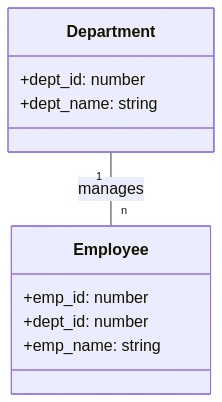
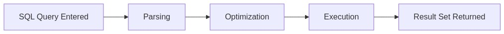
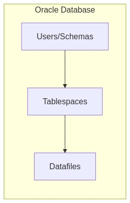

# Day 2 Quiz Questions 

## 1. Basic Terminology
**Question (Beginner | Multiple Choice):**  
Which of the following statements best describes a table in a relational database?

A. A table is an entire database containing multiple schemas and objects.  
B. A table is a collection of rows and columns storing related data.  
C. A table is a single row of data used for auditing purposes.  
D. A table is an Oracle-specific feature that replaces schemas.

**Correct Answer:** B

**Explanation:**  
- A table is the fundamental structure in a relational database that holds records (rows) and attributes (columns).  
- In Oracle, tables reside within schemas (users) and do not replace schemas themselves.

**Why Others Are Incorrect:**  
- **A:** Describes a database, not a single table.  
- **C:** A single row is just a record, not the entire table.  
- **D:** Tables are not an Oracle-specific replacement for schemas; they exist across most RDBMS.

**Oracle Comparison Note:**  
Similar concepts apply to PostgreSQL, SQL Server, and MySQL, though internal storage details differ.

**SRE Perspective:**  
Knowing what a table is helps when monitoring row growth or disk usage.

**Additional Insight:**  
Use `DESCRIBE table_name;` (in Oracle SQL*Plus) to quickly see the table’s columns.

---

## 2. Key Fundamentals
**Question (Beginner | Multiple Choice):**  
Which characteristic is TRUE of a primary key in Oracle?

A. It allows duplicate values but must be indexed.  
B. It uniquely identifies each row and cannot be NULL.  
C. It can reference itself in the same table.  
D. It can only be numeric.

**Correct Answer:** B

**Explanation:**  
- Primary keys uniquely identify each row, and primary key columns cannot be NULL.

**Why Others Are Incorrect:**  
- **A:** Primary keys do not allow duplicates.  
- **C:** A foreign key might reference the same table, but the primary key itself does not “reference” anything.  
- **D:** Primary keys can be non-numeric (e.g., VARCHAR2).

**Oracle Comparison Note:**  
Oracle often uses sequences for auto-generated numeric primary keys, similar to PostgreSQL’s `SERIAL`.

**SRE Perspective:**  
Clear primary key definitions ensure efficient queries and data integrity.

**Additional Insight:**  
Define a primary key at table creation or via `ALTER TABLE` to maintain data consistency.

---

## 3. Basic SELECT Statement
**Question (Beginner | Multiple Choice):**  
Which of the following SQL statements retrieves all columns from a table named EMPLOYEES in Oracle?

A. SELECT ALL FROM EMPLOYEES;  
B. SELECT EMPLOYEES.*;  
C. SELECT * FROM EMPLOYEES;  
D. SELECT EMP_ID, EMP_NAME FROM EMPLOYEES;

**Correct Answer:** C

**Explanation:**  
- `SELECT * FROM EMPLOYEES;` is standard SQL to retrieve all columns.

**Why Others Are Incorrect:**  
- **A:** Invalid Oracle syntax.  
- **B:** Not valid unless used with an alias (e.g., `SELECT e.* FROM employees e`).  
- **D:** Retrieves only EMP_ID and EMP_NAME, not all columns.

**Oracle Comparison Note:**  
`SELECT * FROM tablename;` works similarly in PostgreSQL, SQL Server, MySQL, etc.

**SRE Perspective:**  
`SELECT *` can be expensive in large tables; use column lists when performance matters.

**Additional Insight:**  
Listing columns is better for clarity and performance in production queries.

---

## 4. Basic ER Diagram
**Question (Beginner | Multiple Choice | Diagram-Based):**  
Examine the following simple entity-relationship diagram:

Which statement best describes this relationship?

A. Each Department can have many Employees, and each Employee belongs to one Department.  
B. Each Employee can have many Departments, and each Department belongs to one Employee.  
C. Department and Employee are unrelated tables.  
D. The diagram shows a many-to-many relationship.

**Correct Answer:** A

**Explanation:**  
- The “1 — n” notation indicates a one-to-many relationship. A single Department can manage multiple Employees, and each Employee belongs to exactly one Department.

**Why Others Are Incorrect:**  
- **B:** Suggests many-to-one, not one-to-many.  
- **C:** Diagram clearly shows a relationship.  
- **D:** Many-to-many would appear as “m — n,” usually with a bridging table.

**Oracle Comparison Note:**  
Requires a foreign key in `EMPLOYEE` referencing the primary key in `DEPARTMENT`.

**SRE Perspective:**  
Understanding relationships avoids referential integrity issues.

**Additional Insight:**  
`ALL_CONSTRAINTS` can confirm foreign keys in Oracle.

---

## 5. Oracle Tools
**Question (Beginner | Multiple Choice):**  
Which Oracle tool is a command-line interface used primarily for running SQL commands and PL/SQL blocks?

A. SQL Developer  
B. RMAN  
C. SQL*Plus  
D. Oracle Enterprise Manager (OEM)

**Correct Answer:** C

**Explanation:**  
- `SQL*Plus` is the classic command-line tool bundled with Oracle. It handles SQL and PL/SQL scripting.

**Why Others Are Incorrect:**  
- **A:** SQL Developer is a GUI-based tool.  
- **B:** RMAN focuses on backup/recovery.  
- **D:** OEM is a web-based management console.

**Oracle Comparison Note:**  
Similar command-line interfaces exist in other RDBMS (e.g., `psql` in PostgreSQL).

**SRE Perspective:**  
Command-line scripting is important for automation and quick diagnostics.

**Additional Insight:**  
Combine `SQL*Plus` with shell scripts for batch operations.

---

## 6. Basic SQL Clauses
**Question (Beginner | Multiple Choice):**  
In a basic SELECT statement, the FROM clause is used to:

A. Specify conditions for filtering rows.  
B. Identify the table(s) from which to retrieve data.  
C. Group rows based on common values.  
D. Indicate a new database connection.

**Correct Answer:** B

**Explanation:**  
- `FROM` tells Oracle which table(s) or view(s) you are querying.

**Why Others Are Incorrect:**  
- **A:** That is `WHERE`.  
- **C:** That is `GROUP BY`.  
- **D:** Database connections happen via connection strings/DB sessions.

**Oracle Comparison Note:**  
`FROM` is universal SQL syntax across databases.

**SRE Perspective:**  
Efficient table usage in `FROM` is key to performance.

**Additional Insight:**  
If a table is missing or spelled incorrectly in the FROM clause, queries fail with “table not found.”

---

## 7. Query Execution Flow
**Question (Beginner | Multiple Choice | Diagram-Based):**  
Refer to this simplified query execution flow:

Which step ensures the SQL statement is valid and constructs the best plan?

A. Parsing  
B. Optimization  
C. Execution  
D. Result Return

**Correct Answer:** B

**Explanation:**  
- **Optimization** is where the Cost-Based Optimizer determines the best execution plan.

**Why Others Are Incorrect:**  
- **A:** Parsing checks syntax/semantics but does not finalize the plan.  
- **C:** Execution actually carries out the plan.  
- **D:** Returning results is the final step, not optimization.

**Oracle Comparison Note:**  
All major RDBMS have an optimization phase, though algorithms differ.

**SRE Perspective:**  
Monitoring query plans is essential for preventing performance bottlenecks.

**Additional Insight:**  
`EXPLAIN PLAN` or `DBMS_XPLAN.DISPLAY` show how Oracle optimized the query.

---

## 8. Foreign Key Constraints
**Question (Intermediate | Multiple Choice):**  
Which SQL statement creates a foreign key in an Oracle table named ORDERS that references the CUSTOMERS table’s primary key CUSTOMER_ID?

A. ALTER TABLE orders ADD CONSTRAINT fk_cust_id REFERENCES customers(customer_id);  
B. CREATE FOREIGN KEY fk_cust_id ON orders(customer_id) REFERENCES customers(customer_id);  
C. ALTER TABLE orders ADD CONSTRAINT fk_cust_id FOREIGN KEY (customer_id) REFERENCES customers(customer_id);  
D. CREATE TABLE orders FOREIGN KEY fk_cust_id (customer_id) REFERENCES customers(customer_id);

**Correct Answer:** C

**Explanation:**  
- The correct Oracle syntax is `ALTER TABLE ... ADD CONSTRAINT <constraint_name> FOREIGN KEY (col) REFERENCES other_table(other_col)`.

**Why Others Are Incorrect:**  
- **A:** Missing the `FOREIGN KEY` clause.  
- **B:** `CREATE FOREIGN KEY` is invalid.  
- **D:** Wrong syntax for adding a foreign key to an existing table.

**Oracle Comparison Note:**  
PostgreSQL, SQL Server use similar `ALTER TABLE ... ADD CONSTRAINT ... FOREIGN KEY ...` syntax.

**SRE Perspective:**  
Foreign keys preserve referential integrity, preventing orphaned records.

**Additional Insight:**  
Name constraints logically, e.g., `fk_orders_customers`, for easier maintenance.

---

## 9. Oracle Database Structure
**Question (Intermediate | Multiple Choice | Diagram-Based):**  
Examine the following Oracle database structure:

Which statement is correct?

A. A single datafile belongs to multiple tablespaces.  
B. Each tablespace can have one or more datafiles.  
C. Users/Schemas cannot own tables.  
D. Oracle databases do not use tablespaces.

**Correct Answer:** B

**Explanation:**  
- One tablespace can contain multiple datafiles. A datafile cannot span multiple tablespaces.

**Why Others Are Incorrect:**  
- **A:** A datafile belongs to exactly one tablespace.  
- **C:** Schemas (users) do own tables.  
- **D:** Tablespaces are central in Oracle for logical data storage.

**Oracle Comparison Note:**  
SQL Server has filegroups, PostgreSQL does have a tablespace concept but structured differently.

**SRE Perspective:**  
Monitoring tablespace usage and datafile size is critical for reliability.

**Additional Insight:**  
Check `DBA_DATA_FILES` and `DBA_TABLESPACES` for space management details.

---

## 10. Table Joins
**Question (Intermediate | Multiple Choice | Diagram-Based):**  
Analyze the following join diagram:

Which SQL statement best represents this join in Oracle?

A. SELECT * FROM customers, orders;  
B. SELECT * FROM customers JOIN orders ON customers.customer_id = orders.customer_id;  
C. SELECT * FROM customers JOIN orders ON name = order_date;  
D. SELECT * FROM customers FULL JOIN orders;

**Correct Answer:** B

**Explanation:**  
- The diagram depicts an inner join on `customer_id`. Standard ANSI join syntax: `SELECT * FROM customers JOIN orders ON customers.customer_id = orders.customer_id;`

**Why Others Are Incorrect:**  
- **A:** Without a WHERE clause or join condition, it produces a Cartesian product.  
- **C:** Columns `name` and `order_date` are unrelated.  
- **D:** `FULL JOIN` returns unmatched rows as well, not indicated here.

**Oracle Comparison Note:**  
Modern Oracle prefers `JOIN ... ON` syntax over the older `FROM table1, table2 WHERE ...` style.

**SRE Perspective:**  
Efficient joins reduce potential performance issues from large intermediate result sets.

**Additional Insight:**  
Inner join returns rows matching the join condition in both tables.

---

## 11. Data Dictionary Views
**Question (Intermediate | True/False):**  
Statement: The ALL_TABLES view in Oracle shows all the tables in the entire database, regardless of the current user’s privileges.

A. True  
B. False

**Correct Answer:** B (False)

**Explanation:**  
- `ALL_TABLES` only shows tables accessible to the current user, not *all* tables. For all tables in the database, use `DBA_TABLES`.

**Oracle Comparison Note:**  
PostgreSQL and SQL Server also have catalog views but enforce permissions similarly.

**SRE Perspective:**  
Knowledge of these views is crucial for quickly finding or verifying table existence and privileges.

**Additional Insight:**  
`USER_TABLES` shows only tables owned by the user; `ALL_TABLES` includes any tables the user can access; `DBA_TABLES` shows every table in the database.

---

## 12. Oracle Performance
**Question (Intermediate | True/False):**  
Statement: The V$SESSION view in Oracle provides details about current active sessions, including user, status, and machine information.

A. True  
B. False

**Correct Answer:** A (True)

**Explanation:**  
- `V$SESSION` is a key dynamic performance view with session-level data such as user, OS user, machine, status, etc.

**Oracle Comparison Note:**  
PostgreSQL’s `pg_stat_activity` or SQL Server’s `sys.dm_exec_sessions` are rough equivalents.

**SRE Perspective:**  
Essential for identifying blocked or blocking sessions, high-resource users, etc.

**Additional Insight:**  
Combine `V$SESSION` with `V$PROCESS` or `V$LOCK` to pinpoint session details causing contention.

---

## 13. SQL Dialect Variations
**Question (Intermediate | True/False):**  
Statement: In Oracle, the VARCHAR2 data type is functionally identical to VARCHAR2 in PostgreSQL and SQL Server with no differences in behavior or limits.

A. True  
B. False

**Correct Answer:** B (False)

**Explanation:**  
- While similar, Oracle’s `VARCHAR2` has different length limits, character set considerations, and certain behavioral nuances compared to other systems’ `VARCHAR`.

**Oracle Comparison Note:**  
PostgreSQL uses `VARCHAR(n)` or `TEXT`, SQL Server uses `VARCHAR`/`NVARCHAR`, all with different max lengths or storage specifics.

**SRE Perspective:**  
Be mindful of differences when migrating between systems or integrating apps.

**Additional Insight:**  
Historically, Oracle differentiates `VARCHAR2` from `VARCHAR` for future expansions. `VARCHAR2` is recommended over `VARCHAR` in Oracle.

---

## 14. SQL WHERE
**Question (Intermediate | Fill-in-the-Blank):**  
Complete the statement:  
“A WHERE clause is used to ________ the rows returned by a SELECT statement based on specified conditions.”

A. rearrange  
B. aggregate  
C. combine  
D. filter

**Correct Answer:** D – filter

**Explanation:**  
- `WHERE` limits (filters) returned rows to those matching specified criteria.

**Why Others Are Incorrect:**  
- **A:** `ORDER BY` rearranges data.  
- **B:** `GROUP BY` or aggregate functions handle aggregation.  
- **C:** Joins or set operations combine data sources.

**Oracle Comparison Note:**  
Syntax for `WHERE` is universal across SQL dialects.

**SRE Perspective:**  
Proper filtering reduces unneeded I/O, improving performance.

**Additional Insight:**  
Index the columns that appear in WHERE clauses to optimize lookups.

---

## 15. Execution Plans
**Question (SRE-Level | Fill-in-the-Blank):**  
“In Oracle, ________ indicates that the database is performing a full table scan, which may impact performance for large tables.”

A. INDEX RANGE SCAN  
B. TABLE ACCESS (FULL)  
C. NESTED LOOPS  
D. HASH JOIN

**Correct Answer:** B – TABLE ACCESS (FULL)

**Explanation:**  
- `TABLE ACCESS (FULL)` means Oracle is scanning every row in the table. This can be costly for large datasets if an index would be more efficient.

**Why Others Are Incorrect:**  
- **A:** `INDEX RANGE SCAN` uses an index.  
- **C, D:** These are join methods, not full table scans.

**Oracle Comparison Note:**  
PostgreSQL shows `Seq Scan`, SQL Server shows `Table Scan`.

**SRE Perspective:**  
Full table scans often point to missing or unused indexes.

**Additional Insight:**  
Use `EXPLAIN PLAN` or `DBMS_XPLAN` to detect `TABLE ACCESS (FULL)`.

---

## 16. Oracle Recovery
**Question (SRE-Level | Fill-in-the-Blank):**  
“________ is Oracle’s command-line utility that manages backup, restore, and recovery operations, often used by DBAs and SREs.”

A. Data Pump  
B. RMAN  
C. SQL Developer  
D. FLASHBACK

**Correct Answer:** B – RMAN

**Explanation:**  
- Recovery Manager (RMAN) is Oracle’s main tool for backup/recovery tasks.

**Why Others Are Incorrect:**  
- **A:** Data Pump is for data import/export.  
- **C:** SQL Developer is a GUI tool.  
- **D:** FLASHBACK is a feature, not a general-purpose backup utility.

**Oracle Comparison Note:**  
Equivalent to using `pg_dump/pg_restore` in PostgreSQL, or `BACKUP/RESTORE` in SQL Server, but with different automation features.

**SRE Perspective:**  
Regular backups using RMAN are key to meeting reliability and recovery SLAs.

**Additional Insight:**  
Test RMAN backups frequently to ensure your recovery process works as expected.

---

## 17. Matching Oracle Views
**Question (SRE-Level | Matching | Diagram-Based):**  
Match each Oracle performance view in Column A to its description in Column B:

Column A:  
1. V$SESSION  
2. V$SQL  
3. V$SYSTEM_EVENT  
4. V$LOCK  

Column B:  
A. Tracks various lock information and blocking sessions  
B. Captures all SQL statements in the shared pool  
C. Displays wait event statistics across the system  
D. Shows details of currently active database sessions  

**Correct Matches:**  
1 – D  
2 – B  
3 – C  
4 – A  

**Explanation:**  
- `V$SESSION` = current sessions  
- `V$SQL` = SQL statements in the shared pool  
- `V$SYSTEM_EVENT` = wait event stats  
- `V$LOCK` = lock information

**SRE Perspective:**  
Together, these views are vital for diagnosing blocking, slow queries, or system-level wait events.

**Additional Insight:**  
Commonly joined with `V$PROCESS` or `V$SESSION_WAIT` for deeper analysis.

---

## 18. Matching Constraints
**Question (SRE-Level | Matching):**  
Match each constraint type in Column A with its description in Column B:

Column A:  
1. PRIMARY KEY  
2. FOREIGN KEY  
3. UNIQUE  
4. CHECK  

Column B:  
A. Ensures values in a column or set of columns must match rows in another table  
B. Restricts inserted data to values that fulfill a given condition  
C. Guarantees every row in a column (or columns) is unique  
D. Identifies each row in a table uniquely and disallows NULL  

**Correct Matches:**  
1 – D  
2 – A  
3 – C  
4 – B  

**Explanation:**  
- **PRIMARY KEY**: unique, no NULL.  
- **FOREIGN KEY**: references another table.  
- **UNIQUE**: no duplicates.  
- **CHECK**: custom condition verification.

**SRE Perspective:**  
Constraints maintain data integrity and prevent anomalies.

**Additional Insight:**  
`ALL_CONSTRAINTS`, `ALL_CONS_COLUMNS` let you inspect constraints in Oracle.

---

## 19. Oracle Troubleshooting
**Question (SRE-Level | Ordering):**  
Arrange the steps to troubleshoot a slow query in Oracle:

A. Examine the execution plan via EXPLAIN PLAN or DBMS_XPLAN  
B. Identify the SQL statement causing slow performance (from V$SQL)  
C. Gather statistics or create indexes to optimize performance  
D. Verify if the query is performing a full table scan  

**Correct Order:** B, A, D, C

1. Identify the problematic SQL.  
2. Examine its execution plan.  
3. Check if full table scans or other expensive operations occur.  
4. Apply optimizations (stats, indexes, etc.).

**SRE Perspective:**  
This systematic approach isolates performance bottlenecks and addresses them methodically.

**Additional Insight:**  
Recheck the plan after applying changes to confirm improved performance.

---

## 20. Oracle Flashback
**Question (SRE-Level | Ordering):**  
Arrange the steps to perform an Oracle Flashback Table operation:

A. Confirm Flashback is enabled for the database  
B. Issue the FLASHBACK TABLE command to the desired point in time  
C. Identify the SCN (System Change Number) or timestamp for the restore point  
D. Validate that the table data has been restored correctly  

**Correct Order:** A, C, B, D

1. Verify Flashback is enabled.  
2. Identify the correct SCN/timestamp.  
3. Perform the `FLASHBACK TABLE` command.  
4. Validate table data after recovery.

**SRE Perspective:**  
Flashback can drastically reduce recovery time for inadvertent data changes.

**Additional Insight:**  
Grant only the necessary privileges (like `FLASHBACK ANY TABLE`) to DBAs or SREs.

---

### Final Remarks
Each explanation above ties back to Day 1 and Day 2 Oracle database topics, covering everything from simple table structures to SRE-level performance monitoring and recovery. This answer set helps reinforce key concepts about SQL, Oracle architecture, and how they compare to other RDBMS like PostgreSQL and SQL Server.

