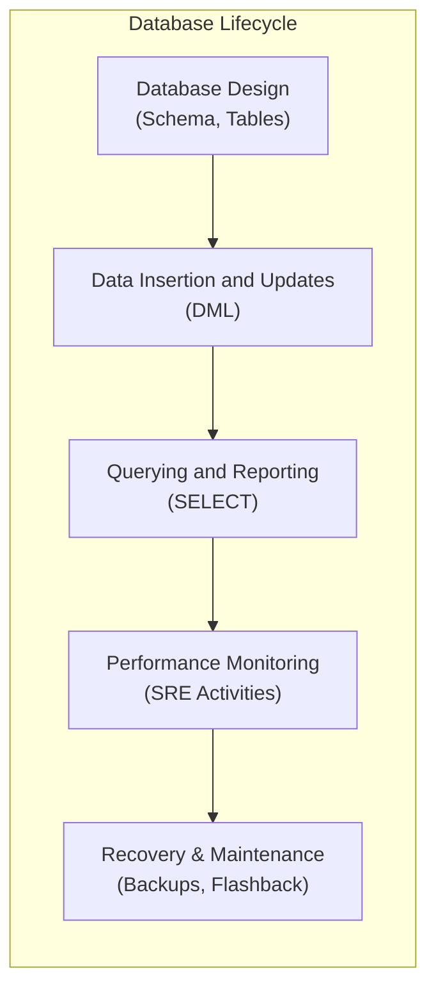
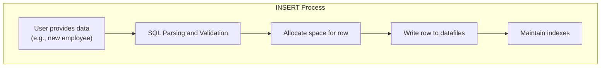
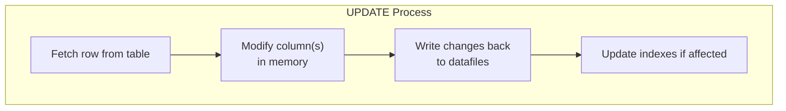
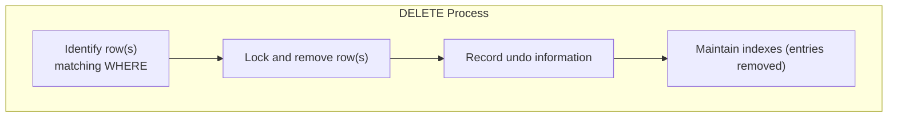
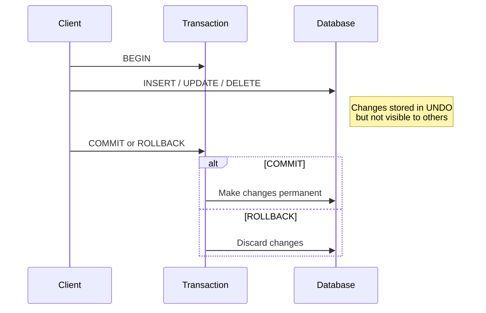
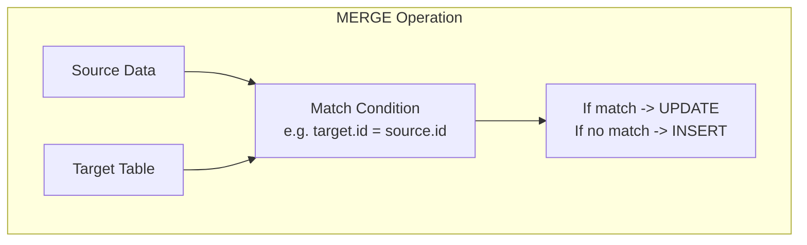
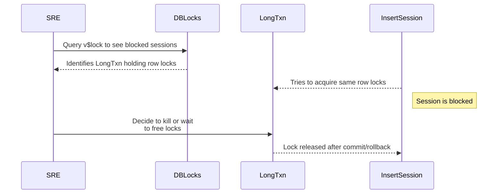

Below is a **comprehensive Day 2 training module** on **Data Manipulation Language (DML)** with **Oracle** as the primary focus, building logically on Day 1’s relational fundamentals. The structure and content follows the guidelines set forth in the prompt, including comparisons to PostgreSQL and SQL Server, multi-tiered examples (🟢, 🟡, 🔴), visual Mermaid diagrams, and SRE-oriented best practices. All references to the instructions document are cited e0.

---

# 🚀 Day 2 Database Training Module: Oracle-Centric DML

## 📌 Introduction
Welcome to **Day 2** of our SRE Database Training Series! Yesterday, you learned **relational database fundamentals** (Day 1). Today, we build on that foundation to explore **Data Manipulation Language (DML)** in Oracle. By day’s end, you’ll know how to **insert**, **update**, **delete**, and **manage transactions** in a production-ready way—critical for any support engineer or SRE dealing with real-time data changes. 

### Why This Matters
- **Daily Support Tasks:** You’ll often troubleshoot data correctness issues or data manipulation failures.  
- **SRE Relevance:** Safe data modifications and transaction management impact system reliability.  
- **Oracle Focus:** Many enterprise systems use Oracle. Mastering Oracle’s unique DML features gives you a career edge.

Below is a **concept map** showing how DML fits into the overall database lifecycle:



**Bottom Line**: DML is about **data changes**—the bread and butter of any active database environment. Let’s dive in!

---

## 🎯 Learning Objectives by Tier

### 🟢 Beginner Tier (4 Objectives)
1. **Identify** the basic DML statements (INSERT, UPDATE, DELETE) and their syntax in Oracle.  
2. **Explain** how COMMIT and ROLLBACK control transaction boundaries.  
3. **Demonstrate** simple conditional updates and deletes.  
4. **Compare** Oracle DML syntax to PostgreSQL and SQL Server equivalents at a basic level.

### 🟡 Intermediate Tier (4 Objectives)
1. **Implement** multi-table DML operations (e.g., updates with subqueries, MERGE).  
2. **Use** transaction features such as SAVEPOINT to manage partial rollbacks.  
3. **Diagnose** common DML failures (constraint violations, locking issues) and resolve them.  
4. **Analyze** Oracle-specific data dictionary views for monitoring and auditing DML changes.

### 🔴 SRE-Level Tier (4 Objectives)
1. **Optimize** DML performance and concurrency using Oracle locking mechanisms and transaction isolation levels.  
2. **Implement** advanced Oracle recovery features (Flashback Query, Flashback Transaction) for rapid rollbacks of failed or incorrect DML.  
3. **Automate** large-scale or bulk DML operations securely (SQL*Loader, multi-table inserts).  
4. **Integrate** DML monitoring and locking insights into broader SRE reliability practices.

---

## 📚 Core Concepts

Below, each DML concept is presented with a **Beginner Analogy**, **Visual Representation**, **Technical Explanation**, **Support/SRE Application**, **System Impact**, **Common Misconceptions**, and **SQL Dialect Comparison**.

### 1. INSERT Concept Overview

**🟢 Beginner Analogy**:  
Think of **INSERT** as adding a new entry to the membership roster in a club’s spreadsheet. You fill out a new row with data and place it in the existing table of members.

**🖼️ Visual Representation** (Mermaid flowchart showing basic INSERT logic):



**🔬 Technical Explanation**:  
- In Oracle, `INSERT` adds new rows to a table.  
- Syntax:  
  ```sql
  INSERT INTO table_name (col1, col2, ...)
  VALUES (val1, val2, ...);
  ```
- You can also insert the results of a `SELECT` query.

**💼 Support/SRE Application**:  
- **Beginner**: Add rows one by one.  
- **Intermediate**: Insert data from another table with subqueries.  
- **SRE**: Bulk-load large datasets via Oracle SQL*Loader or multi-table inserts.

**🔄 System Impact**:  
- Each insert generates **undo** and **redo** logs, affecting I/O.  
- High insert rates can stress indexes or cause fragmentation.

**⚠️ Common Misconceptions**:  
- “Insert automatically commits.” In Oracle, you must explicitly **COMMIT**.  
- “INSERT statements can’t handle bulk data.” Oracle provides mechanisms like `INSERT ALL` or external tables for larger operations.

**📊 SQL Dialect Comparison**:

| Operation      | Oracle (primary)                                            | PostgreSQL                                     | SQL Server                            | Notes                                                    |
|----------------|-------------------------------------------------------------|------------------------------------------------|----------------------------------------|----------------------------------------------------------|
| Basic INSERT   | `INSERT INTO t (col1, col2) VALUES (v1, v2);`               | Same syntax                                    | Same syntax                            | All RDBMS follow standard SQL for simple inserts         |
| Insert Subquery| `INSERT INTO t (col1, col2) SELECT ... FROM another_table;` | `INSERT INTO t ... SELECT ...`                 | Same syntax                            | Similar across systems                                   |
| Multi-Table    | `INSERT ALL ... SELECT ...`                                 | Typically multiple statements or use CTE        | Multiple statements or custom merge    | Oracle’s multi-table insert is a unique, more advanced feature |

---

### 2. UPDATE Concept Overview

**🟢 Beginner Analogy**:  
Imagine correcting a typo in the same club roster. You look up a member’s row and change a specific field (like phone number).

**🖼️ Visual Representation** (Mermaid flowchart showing basic UPDATE steps):



**🔬 Technical Explanation**:  
- `UPDATE` modifies existing rows, specifying a `WHERE` condition.  
- Syntax:  
  ```sql
  UPDATE table_name
     SET col1 = new_val,
         col2 = new_val
   WHERE condition;
  ```

**💼 Support/SRE Application**:  
- **Beginner**: Single-table updates with a simple `WHERE` clause.  
- **Intermediate**: Updating using subqueries to set columns based on values from other tables.  
- **SRE**: Keeping systems consistent in large-scale updates, managing concurrency to avoid row locks or performance hits.

**🔄 System Impact**:  
- **Row-level locks**: Oracle locks only the rows it modifies.  
- Large updates can escalate I/O usage and generate significant undo/redo data.

**⚠️ Common Misconceptions**:  
- “UPDATE modifies all rows if `WHERE` is omitted.” True, so be careful.  
- “You can update foreign keys arbitrarily.” Not if constraints or child records exist.

**📊 SQL Dialect Comparison**:

| Operation          | Oracle                                                | PostgreSQL                                    | SQL Server                                   | Notes                                               |
|--------------------|-------------------------------------------------------|-----------------------------------------------|-----------------------------------------------|-----------------------------------------------------|
| Basic UPDATE       | `UPDATE t SET col1 = val WHERE col2 = condition;`     | Same syntax                                   | Same syntax                                   | Standard SQL across all RDBMS                      |
| Subquery in UPDATE | `UPDATE t SET col1=(SELECT x FROM y WHERE ...)`       | Same syntax (often uses FROM clause)          | Similar, might use joins in FROM or CTE        | Subtle variations in FROM clause usage             |
| Multi-Table UPDATE | Typically use a subquery or MERGE (no direct multi-table syntax) | Similar approach or advanced join update | Some direct multi-table updates are possible   | Oracle often uses MERGE or correlated subqueries   |

---

### 3. DELETE Concept Overview

**🟢 Beginner Analogy**:  
When someone leaves the club, you remove (delete) that row from the membership table.

**🖼️ Visual Representation** (Mermaid flowchart for DELETE steps):



**🔬 Technical Explanation**:  
- `DELETE` removes specific rows based on a `WHERE` clause.  
- Syntax:  
  ```sql
  DELETE FROM table_name
   WHERE condition;
  ```

**💼 Support/SRE Application**:  
- **Beginner**: Deleting old records by ID.  
- **Intermediate**: Condition-based deletes using subqueries.  
- **SRE**: Archiving strategies or partition management to avoid massive deletes that cause performance overhead.

**🔄 System Impact**:  
- Deleting large volumes can create big undo logs.  
- Consider `TRUNCATE TABLE` if you need to remove *all* rows for better performance (though TRUNCATE is DDL, not DML).

**⚠️ Common Misconceptions**:  
- “DELETE is irreversible.” Not if a transaction is still open—you can ROLLBACK.  
- “DELETE always locks the entire table.” Oracle typically does row-level locking, not full table locks.

**📊 SQL Dialect Comparison**:

| Operation           | Oracle                                                       | PostgreSQL                                        | SQL Server                                               | Notes                                                |
|---------------------|--------------------------------------------------------------|---------------------------------------------------|----------------------------------------------------------|------------------------------------------------------|
| Basic DELETE        | `DELETE FROM t WHERE condition;`                             | Same syntax                                       | Same syntax                                              | Standard SQL                                         |
| Deleting all rows   | `DELETE FROM t;` or `TRUNCATE TABLE t;` (DDL)                | Same approach or TRUNCATE                          | Same approach or TRUNCATE                                | TRUNCATE is non-transactional in Oracle & SQL Server |
| Conditional Subquery| `DELETE FROM t WHERE col1 IN (SELECT ...)`                  | Similar usage                                     | Similar usage                                            | Common for referencing data in other tables         |

---

### 4. Transaction Control (COMMIT, ROLLBACK, SAVEPOINT)

**🟢 Beginner Analogy**:  
Think of a **shopping cart**. You can add or remove items (DML) freely. When you finalize (COMMIT), the purchase is made. If you cancel (ROLLBACK), nothing is charged.

**🖼️ Visual Representation** (Mermaid sequence diagram for transaction flow):



**🔬 Technical Explanation**:  
- **COMMIT**: Ends the current transaction, making changes permanent.  
- **ROLLBACK**: Undoes changes in the current transaction.  
- **SAVEPOINT**: A checkpoint for partial rollbacks.  

**💼 Support/SRE Application**:  
- Ensures data consistency when multiple changes happen.  
- Prevents partial data modifications from persisting if an error occurs.

**🔄 System Impact**:  
- Commits free up row locks for other sessions.  
- ROLLBACK merges “undo” data back to restore the original state.

**⚠️ Common Misconceptions**:  
- “AUTOCOMMIT is always on.” In Oracle, by default, you must explicitly commit unless you’re in certain tools (e.g., SQL Developer might commit automatically after script execution).  
- “SAVEPOINT automatically rolls back after usage.” You must explicitly use `ROLLBACK TO SAVEPOINT` if needed.

**📊 SQL Dialect Comparison**:

| Operation  | Oracle                                   | PostgreSQL                           | SQL Server                               | Notes                                                                |
|------------|-------------------------------------------|--------------------------------------|------------------------------------------|----------------------------------------------------------------------|
| COMMIT     | Explicit `COMMIT;`                       | Same                                  | `COMMIT TRANSACTION;` or `COMMIT;`       | All require an explicit statement to finalize a transaction          |
| ROLLBACK   | Explicit `ROLLBACK;`                     | `ROLLBACK;`                           | `ROLLBACK TRANSACTION;` or `ROLLBACK;`   | Similar across systems                                               |
| SAVEPOINT  | `SAVEPOINT sp_name;` <br/> `ROLLBACK TO sp_name;` | Same (savepoint concept)             | Similar usage but with `SAVE TRANSACTION` keywords | All can revert partially to a named checkpoint within a transaction |

---

### 5. Oracle-Specific DML Features (MERGE, Error Handling, RETURNING, etc.)

**🟢 Beginner Analogy** for MERGE:  
Merging “member updates” from a sign-up sheet into the main roster: if an entry already exists, update it; if not, insert a new row.

**🖼️ Visual Representation** (Simplified MERGE flowchart):



**MERGE**:
- Syntax example:
  ```sql
  MERGE INTO target_table t
  USING source_table s
  ON (t.id = s.id)
  WHEN MATCHED THEN
     UPDATE SET t.col1 = s.col1
  WHEN NOT MATCHED THEN
     INSERT (col1, col2) VALUES (s.col1, s.col2);
  ```

**Error Handling (DML Error Logging)**:
- Use Oracle’s `LOG ERRORS` clause to capture errors during bulk DML without stopping the entire transaction.

**RETURNING INTO**:
- Quickly retrieve columns (e.g., generated IDs) after an INSERT/UPDATE, avoiding a separate SELECT.

**💼 Support/SRE Application**:  
- **Beginner**: Basic upsert logic with MERGE.  
- **Intermediate**: Enhanced error logging when partial data is invalid.  
- **SRE**: Large-scale merges to sync data across multiple environments or when applying patches.

**Common Pitfalls**:  
- MERGE must have correct matching conditions or risk duplications or missed updates.  
- Not all errors are logged if not using `LOG ERRORS` properly.

---

## 💻 Day 2 Concept Breakdown

### 1. **INSERT Statement**  
- **Beginner**: Simple `INSERT INTO employees VALUES (...)`  
- **Intermediate**: `INSERT INTO ... SELECT ...` for reloading data from a staging table  
- **SRE**: Bulk load with **multi-table insert** or **SQL*Loader**; consider concurrency and indexing overhead

### 2. **UPDATE Statement**  
- **Beginner**: `UPDATE employees SET salary=... WHERE employee_id=...`  
- **Intermediate**: Correlated subqueries to update data based on other tables  
- **SRE**: Parallel DML in Oracle (if available) to handle large-scale updates; monitoring lock usage

### 3. **DELETE Statement**  
- **Beginner**: `DELETE FROM employees WHERE department_id=...`  
- **Intermediate**: Subquery-based deletes or referencing a join  
- **SRE**: Partition-based strategies or partial archiving to reduce overhead

### 4. **Transaction Control**  
- **Beginner**: `COMMIT; ROLLBACK;`  
- **Intermediate**: Using `SAVEPOINT` for partial rollbacks  
- **SRE**: Managing transaction isolation levels, monitoring lock queues, designing robust fallback

### 5. **Oracle-Specific DML Features**  
- **Beginner**: Introduce MERGE for upsert logic  
- **Intermediate**: Return generated columns with `RETURNING INTO`  
- **SRE**: Large-scale merges, advanced error logging, concurrency tuning

---

## 🔒 Transaction Management in Oracle

1. **ACID Properties**: Oracle upholds **Atomicity**, **Consistency**, **Isolation**, **Durability**.  
2. **Oracle Transaction Model**: By default, starts a new transaction after the previous one commits or rolls back.  
3. **Isolation Levels**: `READ COMMITTED` is typical. SREs might consider `SERIALIZABLE` in special scenarios.  
4. **Locking Behavior**:
   ```mermaid
   sequenceDiagram
     participant Txn1
     participant Row
     participant Txn2
     
     Txn1->>Row: UPDATE row X (Acquire row-level lock)
     Txn2->>Row: Attempt to update row X
     Row-->>Txn2: Block (must wait until Txn1 commits or rollbacks)
   ```
5. **Best Practices**:
   - Keep transactions **short** to free locks.  
   - Use **SAVEPOINT** for fine-grained rollbacks.

---

## 🛠️ Oracle-Specific DML Tools and Techniques

1. **SQL*Loader**: High-performance bulk loader for flat files into Oracle tables.  
2. **Oracle External Tables**: Query external data like a table, can be combined with `INSERT INTO ... SELECT ...`.  
3. **Flashback Technology**: 
   - **Flashback Query**: View table data as of a past time (useful for verifying or undoing changes).  
   - **Flashback Transaction/Table**: Revert changes from an unwanted transaction or restore an entire table.  
4. **DML Error Logging**: `LOG ERRORS INTO error_table REJECT LIMIT unlimited` helps handle partial data issues.

---

## 🔍 Oracle DML Performance Monitoring

1. **Impact on Performance**: Large inserts/updates can cause high redo, undo usage, and potential lock contention.  
2. **Key Oracle Views**:
   - `V$SESSION`: Identify active sessions and current SQL.  
   - `V$LOCK`: Pinpoint blocked or blocking locks.  
   - `V$SQLAREA`: Check high resource-consuming statements.  
3. **Lock Contention**:
   ```mermaid
   sequenceDiagram
     participant SRE
     participant V$LOCK
     participant V$SESSION
     
     SRE->>V$LOCK: Identify SID and locked resources
     SRE->>V$SESSION: Join by SID to see blocking sessions
     note right of SRE: Diagnoses lock chain <br/> and kills or resolves
   ```
4. **SRE Approach**:
   - Monitor **wait events** (`V$SYSTEM_EVENT`),  
   - Use **AWR** or **Statspack** to track performance trends.

---

## 🔨 Hands-On Exercises

### 🟢 Beginner Exercises (3)
1. **Insert One Row**: Insert a new employee record, then COMMIT.  
2. **Update One Row**: Update that employee’s salary, then ROLLBACK. Observe the changes revert.  
3. **Delete One Row**: Delete the same employee and confirm with a `SELECT`.

### 🟡 Intermediate Exercises (3)
1. **Insert with Subquery**: Create a table `employee_archive` and insert rows from `employees` for a specific department.  
2. **Update with Correlated Subquery**: Increase salaries by 10% for employees earning below the average salary in their department.  
3. **Use SAVEPOINT**: Perform multiple updates, set a savepoint, then partially roll back to that savepoint.

### 🔴 SRE-Level Exercises (3)
1. **MERGE**: Synchronize a `staging_employees` table with the main `employees` table using MERGE.  
2. **Bulk Insert with SQL*Loader**: Load data from a CSV file into the `employees` table, track performance.  
3. **Transaction Isolation**: Demonstrate lock contention using two sessions updating the same table row, then resolve.

---

## 🚧 Troubleshooting Scenarios

Each scenario includes symptoms, probable causes, diagnostic steps, and resolution:

1. **Scenario A**: Large DELETE blocking inserts in `orders`  
   - **Symptoms**: High wait events, many sessions blocked  
   - **Cause**: Row-level locks for a big DELETE transaction  
   - **Diagnostic**: Check `V$LOCK`, find blocking SID  
   - **Resolution**: Use smaller batched deletes or partition strategy, COMMIT in batches

2. **Scenario B**: MERGE failing with “unique constraint violated”  
   - **Symptoms**: MERGE upsert runs but fails on duplicate keys  
   - **Cause**: Logic error in WHEN MATCHED vs. WHEN NOT MATCHED conditions  
   - **Diagnostic**: Review statement logic, check constraints  
   - **Resolution**: Correct conditions, possibly add de-dup logic

3. **Scenario C**: ORA-01555 “Snapshot too old” during a long update  
   - **Symptoms**: Query fails with snapshot too old error  
   - **Cause**: Undo retention too small for lengthy transaction  
   - **Diagnostic**: Check `UNDO_RETENTION` and transaction logs  
   - **Resolution**: Increase `UNDO_RETENTION`, break transaction into smaller chunks

---

## ❓ Frequently Asked Questions

### 🟢 Beginner FAQs (3)
1. **How do I revert changes if I mistakenly commit?**  
   - You’d need a separate restore or Flashback operation. Once committed, normal ROLLBACK cannot revert it.  
2. **Can I insert partial rows without specifying all columns?**  
   - Yes, if those columns can be NULL or have defaults.  
3. **Do I have to COMMIT immediately after each DML?**  
   - Not required, but recommended to avoid holding locks for too long.

### 🟡 Intermediate FAQs (3)
1. **Is a subquery faster than a join in an UPDATE?**  
   - Performance depends on the optimizer; both can produce similar plans. Evaluate with `EXPLAIN PLAN`.  
2. **How do I handle foreign key constraints when deleting?**  
   - Either `DELETE` child rows first or use ON DELETE CASCADE if appropriate.  
3. **What if I only want to ROLLBACK certain changes in a transaction?**  
   - Use `SAVEPOINT` and `ROLLBACK TO SAVEPOINT`.

### 🔴 SRE-Level FAQs (3)
1. **How do I monitor the impact of large bulk DML on system performance?**  
   - Use AWR, `V$SESSION_LONGOPS`, or scripts monitoring CPU/IO usage in real time.  
2. **What do I do if my MERGE statement causes massive undo/redo spikes?**  
   - Batch the operation or consider partitioning. Also ensure your undo tablespace is sized appropriately.  
3. **Can I parallelize DML safely in Oracle?**  
   - Yes, Oracle supports Parallel DML, but it requires specific settings and may conflict with certain constraints or triggers.

---

## 🔥 Oracle-Specific SRE Scenario
**Incident**:  
A large data migration script (MERGE from a staging table to a production table) is running for hours, blocking real-time inserts from an OLTP system.

1. **Symptoms**:
   - High wait times on `V$SESSION`.  
   - The staging MERGE transaction has an exclusive lock on many rows.  
   - Users can’t insert new orders; front-end times out.

2. **Investigation**:
   ```sql
   SELECT s.sid, s.username, l.type, l.id1, l.block
   FROM v$session s
   JOIN v$lock l ON s.sid = l.sid
   WHERE ...
   ```
   - Found one session with a long-running MERGE holding many row locks.

3. **Actions**:
   - Attempt to kill the session or ask the user to COMMIT/ROLLBACK.  
   - If partial data was merged, must carefully re-check for data consistency.

4. **Resolution**:
   - Implement a chunking strategy: smaller merges with periodic commits.  
   - Use separate maintenance windows or make sure row-level locking times are minimal.  
   - Monitor via `DBA_HIST_ACTIVE_SESS_HISTORY` for future performance data.

**Diagram**: Lock chain investigation



---

## 🧠 Key Takeaways
1. **DML is essential** for data creation, modification, and removal.  
2. **Transactions** protect data integrity—be deliberate with COMMIT/ROLLBACK.  
3. **Oracle-Specific Features** like MERGE, multi-table inserts, Flashback, and DML error logging can streamline or rescue data operations.  
4. **SRE Mindset** requires monitoring concurrency, locks, and performance overhead from large DML.  
5. **Careful Testing** of DML statements in non-production is key to avoid catastrophic data issues.

---

## 🚨 Career Protection Guide for DML Operations
- **High-risk DML**: Large updates/deletes without a proper WHERE clause or partial commits can lead to major incidents.  
- **Oracle Recovery Strategies**: 
  - **Flashback Query** for read-only historical data checks,  
  - **Flashback Transaction/Table** to revert mistakes.  
- **Verification**: Always run selects first to confirm the rows you’ll impact.  
- **Production Data**: Use minimal transactions, thoroughly tested.  
- **Confidence**: Ask for a **maintenance window** or robust backup if you must run large operations in production.

---

## 🔮 Preview of Day 3
Next, we’ll explore **Database Design Principles and Normalization**:
- Building efficient schemas to **reduce anomalies** in DML
- Understanding **Oracle indexing strategies** for faster lookups
- Applying **SRE principles** to ensure scalable, stable schema designs

Stay tuned for a deeper dive on making your data structures even more robust, reducing the complexity of DML andl reliability!

