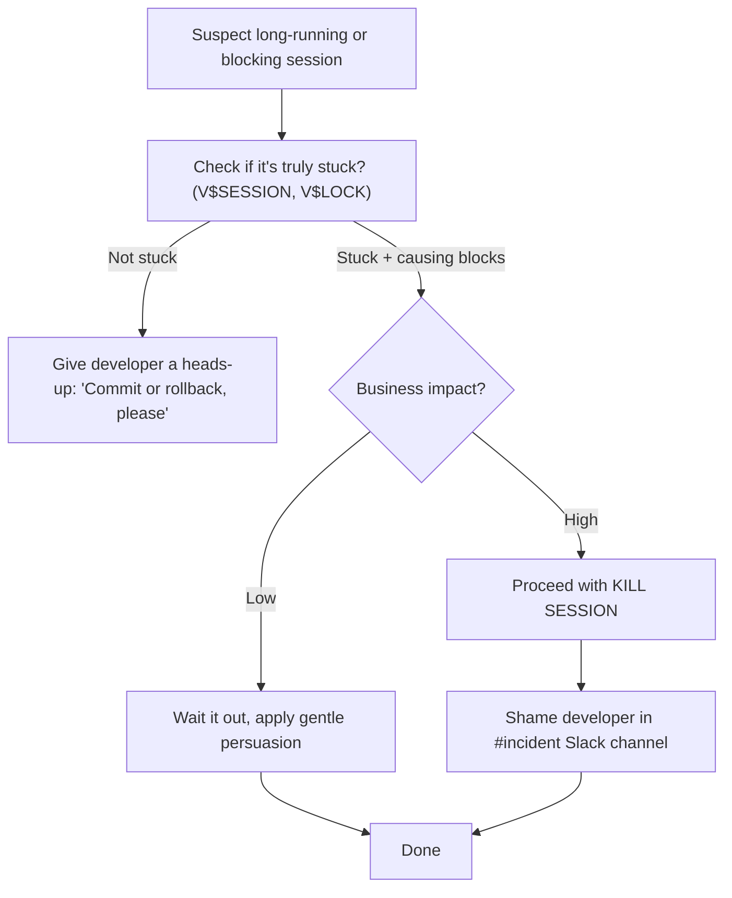
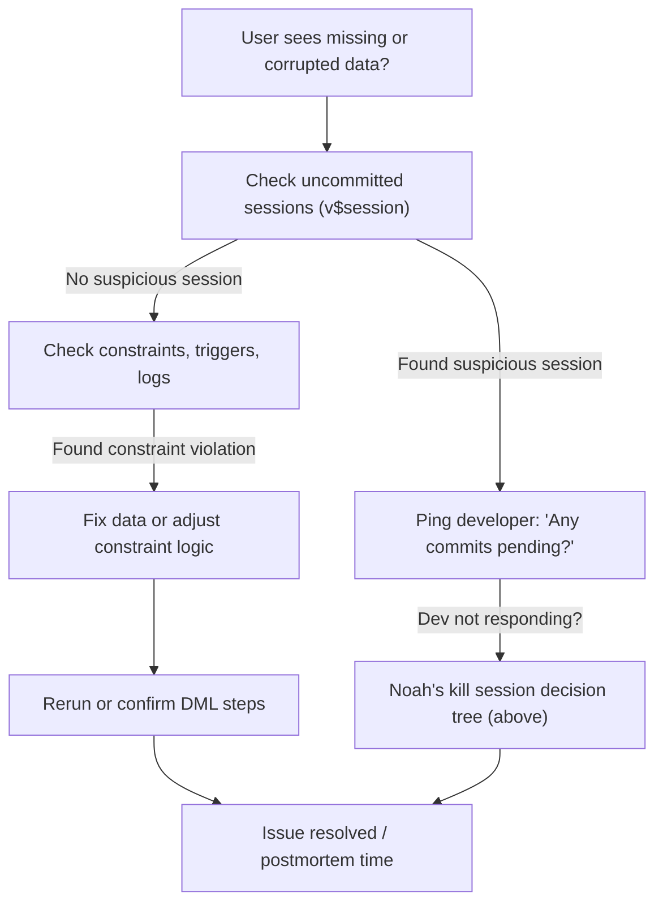

# **The Follow-the-Sun Chronicles: Day 2 – Noah & the Data Mutants**

> **Character Profile:**  
> - **Name:** Noah  
> - **Location:** Sydney, Australia (08:00 AEDT)  
> - **Role:** Observability-obsessed SRE; perpetually suspicious of silent data corruption  
> - **Personality:** Calm, thorough, unafraid to deploy sarcasm when data integrity is threatened

---

## **1. Morning Incident Vignette**

At **07:58 AEDT**, I (Noah) got **paged** about a weird data discrepancy in our production environment: A developer inserted new orders but apparently *didn’t commit* the transaction. The data was stuck in limbo, invisible to analytics, and somehow blocking other sessions. I had to break the news: “Your code forgot a COMMIT—again.” (The production database remembers, even if you want to forget.)

This fiasco is exactly why we’re doing today’s session on **Data Manipulation Language (DML)**. Let me walk you through what actually happens when we modify data, how transaction control works in Oracle, and how to avoid turning your system into a locked-up, uncommitted mess.

---

## **2. Day 2 Overview (Noah’s Recommendations)**

Here’s my structured rundown—tailored to your skill level, from safe baby steps to SRE-level mastery:

### 🔍 **Beginner Level**
1. **Recognize** the main DML statements: `INSERT`, `UPDATE`, `DELETE`.  
2. **Use** `COMMIT` and `ROLLBACK` effectively to avoid orphaned changes.  
3. **Explore** partial rollbacks (aka `SAVEPOINT`) and how they can help (or confuse).  
4. **Compare** Oracle DML syntax with PostgreSQL / SQL Server for basic reference.

### 🧩 **Intermediate Level**
1. **Perform** multi-table or upsert-like operations (looking at you, `MERGE`).  
2. **Leverage** transaction features such as multiple `SAVEPOINT`s.  
3. **Diagnose** DML failures (constraint issues, locking horrors) with proper queries.  
4. **Analyze** data dictionary views (`ALL_CONSTRAINTS`, `V$LOCK`, etc.) to confirm DML outcomes.

### 💡 **Advanced/SRE Level**
1. **Optimize** concurrency by understanding Oracle’s locking and isolation levels.  
2. **Recover** from doomsday scenarios with Flashback Query / Flashback Transaction.  
3. **Automate** large-scale or parallel DML in production *without* wrecking performance.  
4. **Integrate** DML metrics (locks, wait events) into broader SRE reliability processes.

> **Noah’s Note**: “I’ve seen each step fail in a dozen inventive ways. Let’s not repeat them.”

---

## **3. Core DML Concepts (Incident-Fueled)**

Time to face the big four: `INSERT`, `UPDATE`, `DELETE`, and `MERGE`. Along the way, we’ll also highlight transaction control (`COMMIT`, `ROLLBACK`, `SAVEPOINT`). I’ll throw in my commentary—ask me how I know this. No, seriously. Ask me.

---

### 3.1 **INSERT**

1. **Analogy**  
   - **New Club Membership**: You’re filling out a brand-new membership form, effectively adding a new row in the “people” ledger.

2. **Mermaid Diagram**  
   ```mermaid
   flowchart TD
     subgraph "INSERT Flow"
       I1["Provide table & columns"]
       I2["Supply row data"]
       I3["Oracle checks constraints"]
       I4["Row appended, waiting for COMMIT"]
     end
     
     I1 --> I2
     I2 --> I3
     I3 --> I4
   ```

3. **Support/SRE Relevance**  
   - Beginners do single-row inserts.  
   - Intermediate folks do `INSERT INTO ... SELECT ...` to move data en masse.  
   - SREs watch out for concurrency overhead and how indexes might slow down high-volume inserts.

4. **SQL Example (Oracle)**  
   ```sql
   INSERT INTO orders (order_id, customer_id, amount)
   VALUES (1001, 42, 199.99);

   -- Oops, still need to COMMIT if we want others to see it
   ```
   **Cross-Dialect Note**: PostgreSQL / SQL Server basically do the same, `INSERT INTO <table> (...) VALUES (...)`.

5. **Noah’s Reaction**  
   > “Here’s where most people make their first mistake: They do the insert, forget the COMMIT, and call it a day. Then your data’s in a quantum state—existing for you, not for anyone else.”

#### **Noah’s Rules (INSERT)**
- **Rule #1**: If you skip `COMMIT`, your new rows are in a weird limbo.  
- **Rule #2**: Bulk inserts need careful planning (undo/redo logs), or your DB might run out of breath.

---

### 3.2 **UPDATE**

1. **Analogy**  
   - **Correcting a Typo**: The row already exists; you’re just editing one or more fields, like an address or phone number.

2. **Mermaid Diagram**  
   ```mermaid
   flowchart LR
     subgraph "UPDATE Flow"
       U1["Find target row(s)"]
       U2["Change column values"]
       U3["Hold changes until COMMIT"]
     end
     
     U1 --> U2
     U2 --> U3
   ```

3. **Support/SRE Relevance**  
   - Beginners: `UPDATE mytable SET column=... WHERE ...`.  
   - Intermediate: Correlated subqueries, referencing other tables.  
   - SRE: Handling concurrency if multiple sessions might update the same rows.

4. **SQL Example (Oracle)**  
   ```sql
   UPDATE orders
      SET amount = amount + 50
    WHERE order_id = 1001;
   ```
   **Cross-Dialect**: Very similar in PostgreSQL/SQL Server. Just watch out for subtle join-based update differences.

5. **Noah’s Reaction**  
   > “Omitting the WHERE clause is the classic meltdown. Suddenly, everything changes, and you get pages at 2 a.m. from angry managers. The production database remembers.”

#### **Noah’s Rules (UPDATE)**
- **Rule #3**: Always double-check your WHERE; otherwise, you might fix something that ain’t broke.  
- **Rule #4**: Keep transactions short—long updates hog locks and sabotage your sleep.

---

### 3.3 **DELETE**

1. **Analogy**  
   - **Kicking a member out**: You wipe them off the membership list. The row is gone for good (assuming you commit).

2. **Mermaid Diagram**  
   ```mermaid
   flowchart TD
     subgraph "DELETE Flow"
       D1["Identify target row(s) via WHERE"]
       D2["Remove from table/indexes"]
       D3["Wait for COMMIT to finalize"]
     end
     
     D1 --> D2
     D2 --> D3
   ```

3. **Support/SRE Relevance**  
   - Beginners: Single-row or small subset deletes.  
   - Intermediate: Subquery-based deletes, like `DELETE ... WHERE something IN (SELECT ...)`.  
   - SRE: Large, partition-based strategies to avoid a massive transaction that blocks everything.

4. **SQL Example (Oracle)**  
   ```sql
   DELETE FROM orders
   WHERE order_id = 1001;
   ```
   **Cross-Dialect**: Identical in PostgreSQL/SQL Server.

5. **Noah’s Reaction**  
   > “Let me walk you through what happens when you try to delete millions of rows at once: your session hogs the table lock, everyone else screams, and you end up in a conference call explaining your life choices.”

#### **Noah’s Rules (DELETE)**
- **Rule #5**: For huge deletes, do it in small batches or consider `TRUNCATE` (if you can nuke everything).  
- **Rule #6**: Like everything else, it’s not *really* gone until you commit.

---

### 3.4 **Transaction Control** (`COMMIT`, `ROLLBACK`, `SAVEPOINT`)

**Short Interlude**: “You saw how forgetting COMMIT triggered a meltdown this morning. Let’s see how we can do this *properly*.”

1. **Analogy**  
   - **Shopping Cart**: Adding items is like DML statements. You only *buy* them (make them permanent) when you check out (COMMIT). ROLLBACK is abandoning your cart. `SAVEPOINT` is like placing items on hold while you decide.

2. **Sequence Diagram** – Multi-step transaction  
   ```mermaid
   sequenceDiagram
   autonumber
   participant DevSession
   participant OracleDB

   DevSession->>OracleDB: INSERT row (uncommitted)
   DevSession->>OracleDB: SAVEPOINT minorcheckpoint
   note right of DevSession: "If things go sideways, we can revert to here."
   DevSession->>OracleDB: UPDATE row in same transaction
   DevSession->>OracleDB: ROLLBACK TO minorcheckpoint
   note right of OracleDB: "Only the UPDATE is undone."
   DevSession->>OracleDB: COMMIT all changes
   note right of OracleDB: "Transaction is done."
   ```

3. **Support/SRE Relevance**  
   - You can group multiple statements together, then commit as one.  
   - If something’s off, you can revert to a known good state with `SAVEPOINT`.  
   - Avoid half-baked data states in production.

4. **SQL Example**  
   ```sql
   INSERT INTO orders (order_id, customer_id, amount)
   VALUES (2001, 77, 555);

   SAVEPOINT minorcheckpoint;

   UPDATE orders
      SET amount = 999
    WHERE order_id = 2001;

   ROLLBACK TO minorcheckpoint;

   COMMIT;
   ```
   **Cross-Dialect**: Mechanically similar in PostgreSQL/SQL Server, though some syntax for savepoints might differ.

5. **Noah’s Reaction**  
   > “Ask me how I know this. No, seriously: I once forgot `ROLLBACK` existed and manually tried to fix a partial update by re-updating everything. That…didn’t go well.”

#### **Noah’s Rules (Transactions)**
- **Rule #7**: Don’t rely on auto-commit illusions. Oracle wants explicit commits.  
- **Rule #8**: `SAVEPOINT` is your friend, but track them carefully or you’ll confuse yourself even more.

---

### 3.5 **MERGE** (Oracle-Exclusive Upsert)

1. **Analogy**  
   - **Membership Roster Sync**: If the member exists, update them. If not, add them. All in one statement.

2. **Mermaid Diagram**  
   ```mermaid
   flowchart LR
     subgraph "MERGE Logic"
       M1["Source table (staging)"]
       M2["Target table (production)"]
       M3["Match condition (ON)"]
       M4["WHEN MATCHED THEN UPDATE"]
       M5["WHEN NOT MATCHED THEN INSERT"]
     end

     M1 --> M3
     M2 --> M3
     M3 --> M4
     M3 --> M5
   ```

3. **Support/SRE Relevance**  
   - Minimizes writing separate insert/update statements, reducing overhead.  
   - For large datasets, watch out for locks. Also ensure your logic is foolproof or you’ll double-up data.

4. **SQL Example (Oracle)**  
   ```sql
   MERGE INTO orders t
   USING staging_orders s
      ON (t.order_id = s.order_id)
   WHEN MATCHED THEN
     UPDATE SET t.amount = s.amount
   WHEN NOT MATCHED THEN
     INSERT (order_id, customer_id, amount)
     VALUES (s.order_id, s.customer_id, s.amount);
   ```
   **Cross-Dialect**: PostgreSQL/SQL Server have variants, but Oracle’s MERGE is famously robust (and thus easy to abuse).

5. **Noah’s Reaction**  
   > “I’ve seen this go wrong in a dozen different ways. If your matching logic has even a tiny flaw, you can end up creating duplicates or skipping rows entirely. The production database will remember.”

#### **Noah’s Rules (MERGE)**
- **Rule #9**: Validate your `ON` condition meticulously in a test environment.  
- **Rule #10**: Watch out for unique constraints—if your ‘NOT MATCHED’ branch tries to insert duplicates, enjoy the fireworks.

---

## **4. Locking Behavior: The Enemy of Sleep**

When your DML statements run, Oracle uses locks to maintain data consistency. If one session modifies a row, other sessions might have to wait. This can cascade into blockages that keep you up at night.

- **Personifying Lock Conflicts**: They’re basically grumpy trolls living under your rows, refusing to let others pass until the first session commits or rolls back.
- **High-level**: Oracle does row-level locking, so it’s not as disastrous as table-level (like older systems). But watch out for long transactions anyway.

### Noah’s Postmortem Entry: “The Day I Killed a Developer’s Session”
> I once found a poor developer’s session holding an exclusive lock on a high-traffic table. The code had an open transaction for hours. We were losing business. I typed `ALTER SYSTEM KILL SESSION` so fast… and we parted ways with that developer’s changes, uncommitted. Let’s just say we had a long talk about transaction discipline afterward.

### **Noah’s Session Kill Decision Tree: When to terminate vs. when to shame**



> **Noah’s Note**: “Ending someone’s session means forcibly rolling back changes, so weigh your options carefully. Also, a dash of public shaming ensures it doesn’t happen again.”

---

## **5. Detailed Troubleshooting Flowchart: Data Consistency**

Noah’s approach to suspicious data or partial commits:



> **Noah’s Note**: “Ask me how I know this: half the time, it’s just someone who forgot to commit. The rest is usually constraint-based meltdown.”

---

## **6. A Transaction-Related Incident (Sequence Diagram)**

At **08:05 AEDT**, yet another developer pings me:

```mermaid
sequenceDiagram
autonumber
participant Noah
participant Slack
participant DevAlice as DevAlice
participant OracleDB

Noah->>Slack: (08:05) "Team, is anyone seeing blocked sessions on 'orders'?"
DevAlice->>Slack: (08:06) "Yikes, I tried to update rows but can't commit."
Noah->>OracleDB: (08:07) SELECT * FROM v$session WHERE username='ALICE';
note right of OracleDB: "Shows 'ACTIVE' but blocked"
Noah->>DevAlice: (08:08) "We might have a row-level lock from a prior update. Could you ROLLBACK or COMMIT?"
DevAlice->>Slack: (08:09) "Let me try that…"
DevAlice->>OracleDB: COMMIT;
OracleDB->>Noah: (08:10) "Block is cleared, other transactions proceed."
Noah->>Slack: "All good. Please remember to wrap up your transactions!"
```



**Moral**: Even the smallest uncommitted transaction can snowball into an incident.

---

## **7. Hands-On Exercises**

### 🔍 **Beginner**
1. **Simple Insert**: Create `demo_orders`, insert one row, then COMMIT.  
2. **Update & Rollback**: Update that row, then do a ROLLBACK. Confirm no changes.  
3. **Delete**: Remove the row, COMMIT, then verify it’s gone.

### 🧩 **Intermediate**
1. **Insert via Subquery**: Create `orders_archive` and populate it from `orders` for a certain date range.  
2. **SAVEPOINT**: Perform multiple updates in a single transaction, then ROLLBACK to a mid-step savepoint.  
3. **MERGE**: Try merging a `staging_orders` table with the main `orders` table. Double-check your match conditions.

### 💡 **Advanced/SRE**
1. **Bulk Insert**: Use Oracle’s `INSERT ALL` or SQL*Loader to ingest thousands of rows. Monitor system performance.  
2. **Lock Contention**: Simulate two sessions updating the same row, then check `V$LOCK`. Practice your session kill decision.  
3. **Flashback**: Delete a record, use Flashback Query to confirm it existed, optionally restore it if you have Flashback Table privileges.

---

## **8. A Few Sordid DML Scenarios**

1. **Large DELETE blocking everything else**  
   - Symptom: Everyone complains their queries are stuck.  
   - Diagnosis: One user’s massive delete, no commit.  
   - Fix: Break the deletes into small commits or schedule downtime. Possibly kill the session if it’s do-or-die.

2. **MERGE mismatch**  
   - Symptom: Duplicate rows or “unique constraint violated.” 
   - Diagnosis: Bad ON condition, or data already present.  
   - Fix: Adjust your WHEN MATCHED / WHEN NOT MATCHED logic. Possibly deduplicate first.

3. **ORA-01555 “Snapshot too old”**  
   - Symptom: Long-running update dies mid-flight.  
   - Diagnosis: You used more undo than your retention allows.  
   - Fix: Increase `UNDO_RETENTION`, or chunk your transaction.

---

## **9. Noah’s Extended FAQ Corner**

> ### 9.1 Beginner FAQs (with mini-stories)

**(1) "Do I have to COMMIT after every DML?"**  
*Noah’s Slack Rant (10:15)*:  
> *Look, you don’t have to commit *after every statement* if you’re grouping them logically. But if you leave an open transaction while you go to lunch? That’s how blockages happen, friend.*  

**(2) "Can I partially undo changes after COMMIT?"**  
*Noah’s Slack Rant (10:17)*:  
> *Once you commit, that’s recorded in the grand ledger forever. If you messed up, your only real recourse is Flashback or a full restore from backup. I’ve tried praying to the Oracle gods, but they seldom respond.*  

**(3) "Is TRUNCATE basically DELETE?"**  
*Noah’s Personal Anecdote (10:20)*:  
> *I once truncated a table thinking it’d work like a normal delete. Surprise, it’s DDL. That means no going back. So if you were hoping to rollback, too bad. "Whoops" is not a recognized SQL command.*  

---

> ### 9.2 Intermediate FAQs (with more personal color)

**(1) "How do I ROLLBACK just part of my transaction?"**  
*Noah’s Slack Rant (10:25)*:  
> *SAVEPOINT. Period. You set a SAVEPOINT, do some stuff, realize your ‘stuff’ is nonsense, then `ROLLBACK TO SAVEPOINT`. Everything after the checkpoint is undone, everything before is still there. If you forget to set the SAVEPOINT? Sorry, you’re rolling all the way back.*  

**(2) "Can MERGE handle multiple WHEN MATCHED conditions?"**  
*Noah’s Incident Flashback (10:30)*:  
> *I tried chaining a bunch of WHEN MATCHED lines once. I ended up basically rewriting my entire business logic in a single MERGE statement. Two words: "Test environment." Or else you’ll re-live my nightmare of unexpected duplication.*  

**(3) "Does Oracle auto-commit each statement like MySQL?"**  
*Noah’s Subtle Eye-Roll (10:35)*:  
> *No. I’ve seen devs come from MySQL land assume everything is auto-committed. Then they’re baffled that the data is invisible to others. Double-check your tool’s settings, but generally, Oracle wants that explicit COMMIT.*  

---

> ### 9.3 Advanced/SRE FAQs (with real incidents)

**(1) "How do I find the transaction that’s blocking others?"**  
*Noah’s War Story (10:40)*:  
> *We had a meltdown last quarter: one developer left an update open for 5 hours. Use `V$LOCK` and `V$SESSION` to see who’s blocking who. Then see my session kill decision tree if you must go nuclear.*  

**(2) "Parallel DML? Good or bad idea?"**  
*Noah’s Balanced Take (10:45)*:  
> *Parallel DML can be a godsend for huge merges or inserts—if your hardware can handle it. But concurrency can also multiply lock overhead. I only do it after testing in a staging environment.*  

**(3) "Last time I saw ORA-01555, we were five hours in..."**  
*Noah’s Grim Memory (10:50)*:  
> *Yes, ORA-01555 is that dreaded "snapshot too old" error. If you’re five hours into a single transaction, you risk outrunning your undo retention. The fix is either bigger UNDO tablespace or chunking your changes.*  

---

## **10. Key Takeaways (Noah’s Greatest Hits)**

1. **DML Commands**: Easy to use, easy to break your DB if you’re sloppy.  
2. **Transaction Control**: Don’t forget `COMMIT` or you’ll trigger chaos. `SAVEPOINT` is your partial-rollback hero.  
3. **Locking**: The enemy of sleep. Keep transactions short, or risk multi-hour nightmares.  
4. **MERGE**: A double-edged sword—powerful upsert if you do it right, unstoppable duplication machine if you do it wrong.  
5. **Testing & Observability**: If you do big DML in production without a thorough test, you’ll star in my next meltdown anecdote.

---

## **11. Handoff to Aanya in India**

That concludes **Day 2**: we survived uncommitted data, row-level locks, kill sessions, MERGE drama, and a cameo from the dreaded ORA-01555. Tomorrow, it’s **Aanya in India** picking up the baton for **Day 3** on **Database Design & Normalization**. You’ll see how a better schema can minimize these DML migraines.

Until then: *Commit early, commit often.* And remember, the production database never forgets.

—**Noah**, signing off with minimal sarcasm (this time).