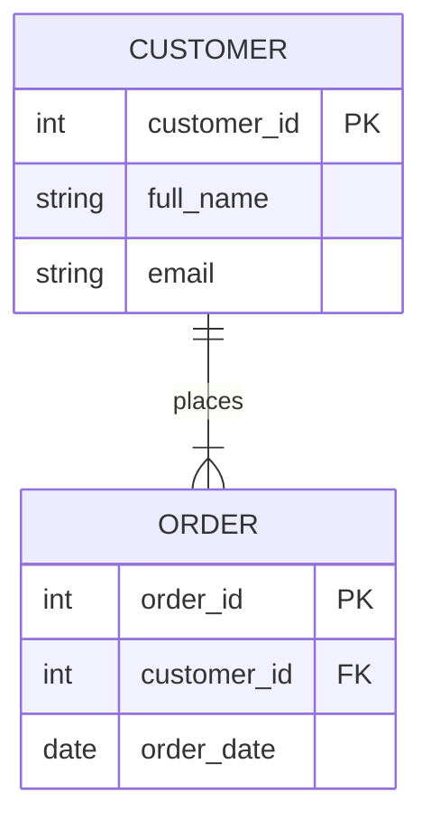
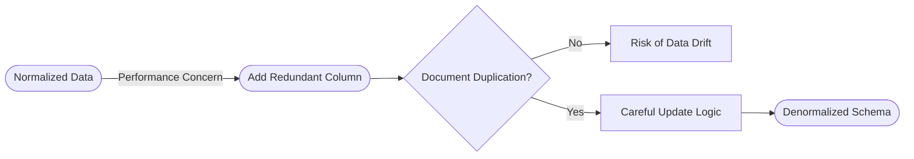
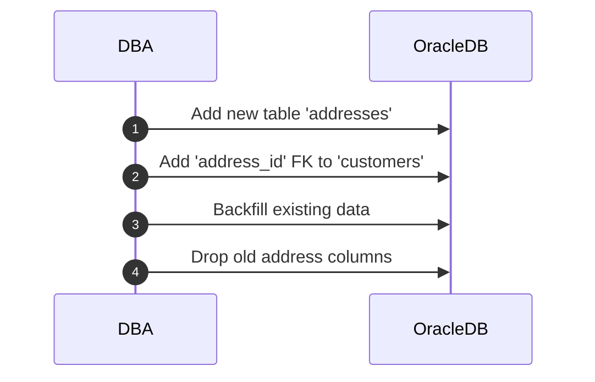

# **Day 3 Answer Sheet**

## (🔍) Beginner-Level Questions (1–7)

---

## **Answer 1: Basic Design Principles**
**Difficulty Level:** Beginner (🔍)  
**Question Type:** Multiple Choice  

**Question:**  
Aanya found address fields repeated in three different tables (`customers`, `orders`, and `billing_info`). According to her “War on Redundancy,” which statement best describes why this is a serious design issue?

A. It speeds up writes but slows down reads  
B. It keeps the database smaller but more complex  
C. It introduces inconsistent data across multiple places  
D. It avoids the need to use any foreign keys  

**Correct Answer:** C

**Explanation:**  
Storing the same data in multiple places often leads to inconsistencies. Aanya stresses how repeated fields can become out of sync if one location is updated and others are not—precisely the “address meltdown” scenario she wants to avoid.

**Why other options are incorrect:**  
- **(A)** Repeated fields usually slow down writes (since they must be updated in multiple places) and create confusion, not necessarily speed.  
- **(B)** Duplicating data typically **expands** the database, rather than making it smaller.  
- **(D)** This has nothing to do with bypassing foreign keys; in fact, foreign keys help reduce redundancy by linking to a single authoritative address table.

**Database Comparison Note:**  
All major RDBMS face the same consistency risks when data is duplicated.  

**Knowledge Connection:**  
Aanya’s first principle is to keep data in one place—non‐redundant—to avoid discrepancies.  

**SRE Perspective:**  
When repeated data drifts out of sync, production incidents multiply—SREs end up diagnosing which copy is correct.  

**Additional Insight:**  
Centralize repeated data (like addresses) into a dedicated table, referencing it via foreign keys.  

---

## **Answer 2: ER Modeling Basics**
**Difficulty Level:** Beginner (🔍)  
**Question Type:** Multiple Choice  

**Question:**  
Aanya uses a “family tree” analogy to explain ER diagrams. Which action best represents how you might use an ER diagram when designing an **Oracle** schema?

A. Combine all entities into one large table so the diagram is simpler  
B. Create separate tables for each entity and define relationships with primary/foreign keys  
C. Store all relationships in a single “lookup” table without foreign keys  
D. Focus only on numeric data types to avoid complex relationships  

**Correct Answer:** B

**Explanation:**  
A core principle of ER modeling is that each real‐world entity should map to its own table, with relationships enforced via primary and foreign keys. This structure clarifies the schema and prevents “kitchen‐sink” tables.

**Why other options are incorrect:**  
- **(A)** Combining all entities into one table leads to huge, unwieldy “mega” tables.  
- **(C)** A single lookup table for all relationships is an anti‐pattern, diminishing clarity and referential integrity.  
- **(D)** Relationship complexity arises from logic, not numeric vs. string data types.

**Database Comparison Note:**  
The concept of one table per entity plus PK‐FK relationships holds in PostgreSQL, SQL Server, MySQL, etc.  

**Knowledge Connection:**  
Aanya’s Commandment #2 states each table must have a clear, singular purpose visible in an ER diagram.  

**SRE Perspective:**  
A well‐defined ER model is simpler to troubleshoot; each table’s role is unambiguous.  

**Additional Insight:**  
Properly naming relationships (foreign keys) fosters maintainability and helps oracles like the DBA or SRE quickly diagnose issues.  

---

## **Answer 3: Commandment #1 – Clarity & Consistency**
**Difficulty Level:** Beginner (🔍)  
**Question Type:** True/False  

**Question:**  
Aanya’s Commandment #1 insists that each table’s purpose and structure should be **transparent**. True or false: She suggests naming columns with random abbreviations so people must read the documentation to find their meaning.

A. True  
B. False  

**Correct Answer:** B (False)

**Explanation:**  
Aanya strongly advocates clarity in naming. She discourages cryptic abbreviations because it obscures understanding and leads to confusion. Descriptive column names are part of a consistent, transparent schema design.

**Database Comparison Note:**  
All systems benefit from intuitive naming—no difference in Oracle vs. other RDBMS.

**Knowledge Connection:**  
This question captures Aanya’s stance that a well‐labeled database fosters clarity for all who interact with it.

**SRE Perspective:**  
When an on‐call SRE must debug a production issue at 3:00 AM, clear naming shortcuts resolution time significantly.

**Additional Insight:**  
Short but meaningful names (like `order_date` vs. `od_dt`) strike a balance between clarity and brevity.  

---

## **Answer 4: Normalization Introduction (1NF)**
**Difficulty Level:** Beginner (🔍)  
**Question Type:** Fill-in-the-Blank  

**Question:**  
Complete the following statement from Aanya’s session on 1NF:

> “In First Normal Form, you can’t have ________ columns that store multiple values in a single field—each column must hold one piece of data.”

A. partial  
B. composite  
C. repeating  
D. numeric  

**Correct Answer:** C – repeating

**Explanation:**  
In 1NF, each column must contain a single, atomic value. A repeating or multi‐valued field (such as storing multiple phone numbers in one column) violates the principle of 1NF.

**Why other options are incorrect:**  
- **(A)** “Partial” references 2NF’s concept (partial dependencies), not 1NF.  
- **(B)** “Composite” relates to keys, not multi‐valued columns.  
- **(D)** This has no direct bearing on 1NF.

**Database Comparison Note:**  
1NF is standard across all relational databases as the baseline for proper table structure.

**Knowledge Connection:**  
Aanya’s Commandment #4: “1NF is non‐negotiable. No repeating groups or multi‐valued columns.”

**SRE Perspective:**  
Multi‐valued fields complicate queries, indexing, and data updates, leading to potential production confusion or errors.

**Additional Insight:**  
If multiple values are truly needed, create a child table or separate columns as appropriate.

---

## **Answer 5: Natural vs. Surrogate Keys**
**Difficulty Level:** Beginner (🔍)  
**Question Type:** Matching  

**Question:**  
Match each description in Column A with the appropriate key type in Column B.

Column A:  
1. Tied to real‐world values, like a passport number  
2. Never changes, even if real‐world data changes  
3. May become invalid if a real‐world identifier is reissued  
4. Often an auto-generated ID or sequence in Oracle  

Column B:  
A. Natural Key  
B. Surrogate Key  

**Correct Matches:**
1 → A  
2 → B  
3 → A  
4 → B  

**Explanation:**  
- **Natural Key (A)**: Tied to real‐world data (passport number), and it can become invalid if the real world changes.  
- **Surrogate Key (B)**: Is system‐generated and remains stable even if external info changes.

**Database Comparison Note:**  
In Oracle, we often use sequences or identity columns for surrogate keys, while a unique real‐world column can serve as a natural key if suitable.

**Knowledge Connection:**  
Aanya’s Commandment #3 highlights using surrogate keys but also respecting real‐world uniqueness.

**SRE Perspective:**  
From an SRE viewpoint, relying on a stable surrogate key is safer during real‐world data changes or merges.

**Additional Insight:**  
Some designs keep both a surrogate PK and a unique natural key for data integrity plus operational flexibility.

---

## **Answer 6: Basic ER Diagram Review**
**Difficulty Level:** Beginner (🔍)  
**Question Type:** Multiple Choice with Diagram  

**Question:**  
Examine the simplified diagram below:

Which statement best reflects Aanya’s approach to relating these two entities?

A. The `ORDER` table should store both `full_name` and `email` for quick lookups  
B. `customer_id` in `ORDER` must match the primary key in `CUSTOMER`  
C. A composite key of `(customer_id, order_date)` is required for `ORDER`  
D. The relationship line indicates that `ORDER` can never exist without a row in `CUSTOMER`  

**Correct Answer:** B

**Explanation:**  
In the diagram, `ORDER` references `CUSTOMER` via a foreign key (`customer_id`) that corresponds to `CUSTOMER`’s primary key. This is the hallmark of a parent‐child relationship, with each order pointing to its associated customer.

**Why other options are incorrect:**  
- **(A)** Aanya advises against duplicating columns like `full_name` or `email` in `ORDER`.  
- **(C)** A composite key is not shown nor required here. `order_id` is sufficient.  
- **(D)** While it implies a foreign key to a valid customer, the statement about “never exist” is too absolute. You can allow or disallow orphan orders, but typically the DB enforces it via foreign key constraints.

**Database Comparison Note:**  
All RDBMS enforce relationships using the PK-FK pattern. The details of constraint creation differ slightly in syntax.

**Knowledge Connection:**  
This question ties to Aanya’s stance that each entity is distinct, referencing the parent’s key to avoid duplication.

**SRE Perspective:**  
When diagnosing data anomalies, having clear foreign keys helps SREs quickly see which orders belong to which customer.

**Additional Insight:**  
Well-chosen foreign keys also improve query clarity and can facilitate join performance with the right indexing.

---

## **Answer 7: 1NF vs. 2NF vs. 3NF**
**Difficulty Level:** Beginner (🔍)  
**Question Type:** Multiple Choice  

**Question:**  
Which of the following violations typically breaks **Third Normal Form (3NF)**?

A. Having multi‐valued fields in a single column  
B. Depending on only part of a composite key for a non‐key attribute  
C. A transitive dependency where a non‐key attribute depends on another non‐key  
D. Storing repeated groups of data in multiple rows  

**Correct Answer:** C

**Explanation:**  
3NF specifically removes transitive dependencies, where a non‐key column depends on another non‐key rather than directly on the primary key. For instance, if `product_name` in an orders table depends on `product_id` (another non‐key in that context) instead of the primary key, that’s a 3NF violation.

**Why other options are incorrect:**  
- **(A)** Multi‐valued fields in a single column typically violates 1NF.  
- **(B)** Depending only on part of a composite key breaks 2NF.  
- **(D)** Repeated groups of data can also be a 1NF or design flaw, but not specifically a 3NF transitive dependency.

**Database Comparison Note:**  
Normalization forms are standard theory applied across Oracle, SQL Server, MySQL, and beyond.

**Knowledge Connection:**  
Aanya’s Commandment #6: “If a non‐key depends on another non‐key, that’s transitive—move it.”

**SRE Perspective:**  
Transitive dependencies lead to extra overhead and possible confusion in production if one part is updated incorrectly.

**Additional Insight:**  
Keeping data where it logically belongs ensures simpler updates and queries.

---

## (🧩) Intermediate-Level Questions (8–14)

---

## **Answer 8: Keys & Constraints in Oracle**
**Difficulty Level:** Intermediate (🧩)  
**Question Type:** Multiple Choice  

**Question:**  
Aanya shows how to define a primary key and unique constraint in Oracle. Which statement best captures her advice on combining **surrogate** and **natural** uniqueness?

A. Always rely solely on the surrogate key; ignore any real‐world unique fields  
B. Use a surrogate key as the PK, and optionally add a UNIQUE constraint on a real‐world field  
C. Natural keys alone are enough; no need for a surrogate key  
D. Surrogate keys and natural keys must be the same column  

**Correct Answer:** B

**Explanation:**  
Aanya’s approach typically places a surrogate key (like `customer_id`) as the primary key, while also enforcing a `UNIQUE` constraint on a natural identifier (e.g., `email`) if it must remain unique in real‐world terms. This ensures both stable referencing and real‐world uniqueness.

**Why other options are incorrect:**  
- **(A)** Completely ignoring real‐world uniqueness can cause duplicates of a supposed unique domain attribute.  
- **(C)** Sometimes natural keys are unstable (like phone numbers or addresses). Surrogates add reliability.  
- **(D)** They cannot be the same column; by definition, a surrogate is system‐generated, while a natural key is real‐world data.

**Database Comparison Note:**  
This strategy is widely used in many DBMS to keep domain logic distinct from the table’s PK mechanism.

**Knowledge Connection:**  
Commandment #3 underscores the synergy of surrogate + natural unique fields.

**SRE Perspective:**  
SREs benefit from stable referencing (surrogate PK) plus domain‐level uniqueness checks to reduce user confusion.

**Additional Insight:**  
In Oracle, you can create a `UNIQUE` index or constraint on the real‐world column while leaving the PK as the surrogate.

---

## **Answer 9: Composite Keys & 2NF**
**Difficulty Level:** Intermediate (🧩)  
**Question Type:** True/False  

**Question:**  
If a table has a composite primary key `(colA, colB)`, and an attribute depends only on `colA` but not `colB`, it violates Second Normal Form. True or false?

A. True  
B. False  

**Correct Answer:** A (True)

**Explanation:**  
2NF states that **all** non‐key attributes must depend on the entire composite key, not just part of it. If a column depends solely on `colA`, that is a partial dependency, breaking 2NF.

**Database Comparison Note:**  
2NF is identical across all SQL platforms—partial dependencies must be separated out to achieve it.

**Knowledge Connection:**  
Commandment #5: “Remove partial dependencies on part of a composite key—split them or re‐evaluate the key.”

**SRE Perspective:**  
Partial dependencies can cause anomalies or confusion in large composite‐key tables, complicating updates or incident resolution.

**Additional Insight:**  
Sometimes the better fix is to adopt a surrogate key for simpler referencing and indexing, removing the composite PK complexity.

---

## **Answer 10: Schema Evolution & Migration**
**Difficulty Level:** Intermediate (🧩)  
**Question Type:** Fill-in-the-Blank  

**Question:**  
Complete this statement from Aanya’s “Address Migration Plan”:

> “Before dropping old address fields from a table, always ________ their usage to be absolutely certain no application still depends on them.”

A. standardize  
B. clone  
C. index  
D. verify  

**Correct Answer:** D – verify

**Explanation:**  
Aanya warns that removing fields prematurely can break older queries, stored procedures, or external applications. You must verify usage thoroughly, checking code references, logs, or analytics to ensure no processes still rely on those fields.

**Why other options are incorrect:**  
- **(A)** Standardizing does not guarantee no usage.  
- **(B)** Cloning fields is not part of a typical migration step.  
- **(C)** Indexing them does not confirm usage.

**Database Comparison Note:**  
The stepwise approach to schema changes is universal. In Oracle, you can also query `ALL_DEPENDENCIES` or logs to confirm references.

**Knowledge Connection:**  
Aanya’s address migration plan includes carefully verifying nothing’s referencing the old columns.

**SRE Perspective:**  
Removing a used field can lead to immediate production incidents. SREs appreciate thorough verification to avoid “missing column” errors at runtime.

**Additional Insight:**  
Some teams rename fields first (e.g., `_deprecated`) to test if anything breaks before fully dropping them.

---

## **Answer 11: Aanya’s Commandments #4, #5, #6**
**Difficulty Level:** Intermediate (🧩)  
**Question Type:** Matching  

**Question:**  
Match each normal form in Column A to the typical design rule in Column B that Aanya preaches.

Column A:  
1. 1NF  
2. 2NF  
3. 3NF  

Column B:  
A. Eliminate multi-valued or repeating columns  
B. Remove partial dependencies if there’s a composite PK  
C. Remove transitive dependencies (non‐key depends on another non‐key)  

**Correct Matches:**  
1 → A  
2 → B  
3 → C  

**Explanation:**  
- **1NF**: No multi‐valued columns or repeating groups.  
- **2NF**: Eliminate partial dependencies on part of a composite key.  
- **3NF**: Eliminate transitive dependencies where a non‐key depends on another non‐key.

**Database Comparison Note:**  
Same normalization rules across Oracle, SQL Server, PostgreSQL, etc.

**Knowledge Connection:**  
Aanya’s Commandments #4, #5, and #6 align exactly with these definitions.

**SRE Perspective:**  
A properly normalized schema reduces the frequency of data anomalies that can trigger production incidents.

**Additional Insight:**  
Some designs go beyond 3NF into BCNF, but 3NF is typically sufficient for most operational systems.

---

## **Answer 12: Stepwise Normalization**
**Difficulty Level:** Intermediate (🧩)  
**Question Type:** Ordering  

**Question:**  
Arrange these steps in the order Aanya typically applies them to transform an unnormalized table into a **3NF** structure:

A. Eliminate repeating groups or multi‐valued attributes  
B. Identify and remove partial dependencies on a composite primary key  
C. Check for transitive dependencies and separate them  
D. Verify that each column depends on the key and nothing but the key  

**Correct Order:** A, B, C, D

1. **(A)** Eliminate repeating groups → achieve 1NF.  
2. **(B)** Remove partial dependencies → 2NF.  
3. **(C)** Check for transitive dependencies → 3NF.  
4. **(D)** Finally confirm each column depends only on the key (no hidden dependencies).

**Explanation:**  
Aanya’s method is to clean up multi‐valued fields first (1NF), then address partial dependencies (2NF), and finally handle transitive dependencies (3NF). The final check ensures everything is consistent with the normal form definitions.

**Database Comparison Note:**  
All standard normalization processes follow this sequence.

**Knowledge Connection:**  
Commandments #4, #5, #6 break the normalization steps down similarly.

**SRE Perspective:**  
A stepwise approach ensures no accidental data loss or confusion if done in production.

**Additional Insight:**  
The final “verify” step is crucial: sometimes data sneaks in that violates these rules if constraints are incomplete.

---

## **Answer 13: Denormalization Flow**
**Difficulty Level:** Intermediate (🧩)  
**Question Type:** Multiple Choice with Diagram  

**Question:**  
Examine Aanya’s simplified denormalization flowchart:

Which statement best describes Aanya’s stance when you decide to **add a redundant column** to speed up reads?

A. It should be done secretly to avoid overhead  
B. You must document the duplication and implement an update strategy  
C. You must remove all foreign keys to prevent conflicts  
D. Denormalization means no constraints are needed  

**Correct Answer:** B

**Explanation:**  
Aanya repeatedly states that if you decide to denormalize for performance (e.g., adding a redundant column), you must document the duplication thoroughly and define how updates occur to keep the extra column in sync.

**Why other options are incorrect:**  
- **(A)** Doing it secretly invites confusion or data drift.  
- **(C)** Removing foreign keys undermines data integrity.  
- **(D)** Constraints might still be vital, especially for partial or domain constraints.

**Database Comparison Note:**  
Denormalization is always a risk in any RDBMS, and best practices remain consistent.

**Knowledge Connection:**  
Commandment #7: “Only denormalize if proven necessary, and document the duplication meticulously.”

**SRE Perspective:**  
When an SRE sees performance issues, they weigh the cost of denormalization carefully because it complicates updates.

**Additional Insight:**  
Sometimes an indexed view or materialized view can handle performance concerns without manually duplicating columns.

---

## **Answer 14: Oracle-Specific Constraint Usage**
**Difficulty Level:** Intermediate (🧩)  
**Question Type:** Multiple Choice  

**Question:**  
Which Oracle feature allows you to **ensure** a real‐world field (like `email`) cannot be duplicated, while still using a surrogate primary key?

A. `CHECK` constraint  
B. `UNIQUE` constraint  
C. `NOT NULL` constraint  
D. `FOREIGN KEY` constraint  

**Correct Answer:** B

**Explanation:**  
A `UNIQUE` constraint ensures no two rows share the same value in that column. This complements a surrogate key by allowing the real‐world attribute (e.g., `email`) to remain unique without being the primary key.

**Why other options are incorrect:**  
- **(A)** `CHECK` constraints validate custom expressions, but not general uniqueness.  
- **(C)** `NOT NULL` ensures the column has a value, not uniqueness.  
- **(D)** A foreign key references another table; it doesn’t enforce uniqueness in the referencing table.

**Database Comparison Note:**  
PostgreSQL has `UNIQUE` constraints or indexes, similarly for SQL Server.

**Knowledge Connection:**  
This relates to Aanya’s approach of having a stable surrogate PK plus a real‐world unique field if needed.

**SRE Perspective:**  
Preventing duplicate real‐world values helps avoid user confusion and potential escalations.

**Additional Insight:**  
`UNIQUE` constraints also help the optimizer with certain queries, as it knows there can be only one row matching a given value.

---

## (💡) Advanced/SRE-Level Questions (15–20)

---

## **Answer 15: Performance Tuning in a Normalized Schema**
**Difficulty Level:** Advanced (💡)  
**Question Type:** Multiple Choice  

**Question:**  
Aanya highlights how a highly normalized schema can affect performance if poorly indexed. Which approach best addresses read‐heavy queries on multiple joined tables?

A. Rely on a single index across the primary key column  
B. Add indexes selectively on join columns and frequently searched attributes  
C. Denormalize everything so no joins are needed  
D. Disable constraints to speed up queries  

**Correct Answer:** B

**Explanation:**  
In a normalized schema, carefully chosen indexes (particularly on join columns or high‐selectivity attributes) can dramatically enhance read performance. This typically solves most bottlenecks without requiring wholesale denormalization.

**Why other options are incorrect:**  
- **(A)** A single PK index isn’t enough for queries joining multiple tables on other columns.  
- **(C)** Blanket denormalization can cause data anomalies and overhead for writes.  
- **(D)** Disabling constraints can lead to data corruption and is rarely a performance fix.

**Database Comparison Note:**  
The principle of adding well‐considered indexes is universal across RDBMS.

**Knowledge Connection:**  
Aanya’s emphasis: “Don’t jump to denormalize if an index can solve your read problem.”

**SRE Perspective:**  
Indexes reduce read time in production, but be mindful of the cost on writes. SREs weigh read gains vs. write overhead.

**Additional Insight:**  
Use Oracle’s EXPLAIN PLAN or AWR to confirm if indexes help or if you’re seeing full table scans that an index can reduce.

---

## **Answer 16: Balancing Normalization & Denormalization**
**Difficulty Level:** Advanced (💡)  
**Question Type:** True/False  

**Question:**  
True or false: Aanya recommends always fully denormalizing a 3NF schema if a single query experiences high latency, ignoring any overhead or data consistency risks.

A. True  
B. False  

**Correct Answer:** B (False)

**Explanation:**  
Aanya is reluctant to denormalize unless absolutely necessary and warns about the overhead of maintaining duplicated data. She would never suggest denormalizing an entire schema just because one query is slow—there are less drastic remedies (indexes, caching, partial denormalization) to consider first.

**Database Comparison Note:**  
Denormalization is always a last‐resort approach in any RDBMS.

**Knowledge Connection:**  
Commandment #7 is explicit: “Document and carefully weigh the trade‐offs before denormalizing.”

**SRE Perspective:**  
SREs see the operational challenges of maintaining denormalized data—each duplication is a potential inconsistency vector.

**Additional Insight:**  
Tools like materialized views or summary tables can help read performance while keeping base tables normalized.

---

## **Answer 17: Advanced Key Usage**
**Difficulty Level:** Advanced (💡)  
**Question Type:** Fill-in-the-Blank  

**Question:**  
Complete this statement from Aanya’s advanced design notes:

> “In some cases, you can maintain both a surrogate key for referencing and a ________ key for additional uniqueness or indexing, ensuring flexibility if real-world data changes.”

A. composite  
B. foreign  
C. natural  
D. partial  

**Correct Answer:** C – natural

**Explanation:**  
Aanya advises that combining a **surrogate** primary key with a **natural** key ensures stable internal referencing while still respecting real-world uniqueness. For instance, you can store a system-generated ID plus a unique email.

**Why other options are incorrect:**  
- **(A)** “Composite” indicates multiple columns forming a key, not necessarily real-world.  
- **(B)** A foreign key references another table, unrelated to real-world uniqueness.  
- **(D)** “Partial” references partial dependency, not a real-world key concept.

**Database Comparison Note:**  
Same approach in all RDBMS: the second “natural” key can also have a `UNIQUE` constraint.

**Knowledge Connection:**  
Ties to Aanya’s advice that real‐world data changes can break purely natural keys, but ignoring them can allow duplicates.  

**SRE Perspective:**  
During migrations or merges (e.g., two customers with the same email?), having both keys clarifies data uniqueness.

**Additional Insight:**  
Keep the natural key constrained but avoid making it the sole PK if it might change over time.

---

## **Answer 18: Schema Evolution**
**Difficulty Level:** Advanced (💡)  
**Question Type:** Ordering with Diagram  

**Question:**  
Consider the following Mermaid sequence that outlines a schema migration path:

Arrange these steps in the logical order Aanya suggests for migrating address fields out of `customers`:

A. Create a new `addresses` table  
B. Reference the new table via a foreign key  
C. Drop legacy address columns once unused  
D. Backfill the data  

**Correct Order:** A, B, D, C

1. **(A)** Create the `addresses` table.  
2. **(B)** Add a foreign key column (`address_id`) to `customers`.  
3. **(D)** Backfill the data into `addresses` and update `customers.address_id`.  
4. **(C)** Once confident no code depends on old columns, drop them.

**Explanation:**  
Aanya’s “Address Migration Plan” approach ensures minimal downtime and safe transition—new structures come first, references are established, data is moved, old columns are dropped last.

**Database Comparison Note:**  
This stepwise pattern is consistent for safe schema migrations in any RDBMS.

**Knowledge Connection:**  
This sequence matches the example Aanya gave where multiple address fields in `customers` were migrated to a single `addresses` table.

**SRE Perspective:**  
Doing it in safe increments avoids disruption and allows for rollbacks or partial checks after each step.

**Additional Insight:**  
Use small batches for backfill to reduce lock contention and performance hits in a busy production environment.

---

## **Answer 19: Aanya’s SRE Perspective on Normalization**
**Difficulty Level:** Advanced (💡)  
**Question Type:** Matching  

**Question:**  
Match each scenario in Column A to the relevant Aanya principle in Column B.

Column A:  
1. Excessive table joins slow down a critical read query  
2. Repeated fields cause confusion when only some are updated  
3. A natural key changes unexpectedly, breaking references  
4. Adding an index for each column to handle multi-join queries

Column B:  
A. “Denormalize only if it’s absolutely necessary, then document”  
B. “Storing duplicates leads to data drift if not carefully managed”  
C. “Surrogate key ensures stability when real-world IDs can change”  
D. “Over‐indexing can hamper write performance; balance your approach”  

**Correct Matches:**  
1 → A  
2 → B  
3 → C  
4 → D  

**Explanation:**  
- **(1 → A)** If table joins are slow, partial denormalization may be an option, with thorough documentation.  
- **(2 → B)** Duplicate fields cause confusion if updated inconsistently.  
- **(3 → C)** A changed real‐world key can break references; a surrogate key avoids that.  
- **(4 → D)** Over‐indexing can degrade write performance—there’s always a trade‐off.

**Database Comparison Note:**  
All these are universal design/performance concerns, though the Oracle environment has unique features like materialized views that might reduce the need for heavy denormalization.

**Knowledge Connection:**  
Reflects Aanya’s seven commandments plus her practical tips on indexing and referencing.

**SRE Perspective:**  
Each scenario can escalate into reliability or performance incidents if not handled with best practices.

**Additional Insight:**  
Balancing read vs. write performance, or real vs. surrogate keys, is an ongoing theme in schema design.

---

## **Answer 20: SRE-Level Decision**
**Difficulty Level:** Advanced (💡)  
**Question Type:** Multiple Choice  

**Question:**  
Aanya addresses an SRE scenario: a small subset of queries are slow due to multiple joins in a well‐normalized design. Which solution best reflects her final recommendation?

A. Completely undo all normalization to remove joins  
B. Tune existing indexes, test partial denormalization only if absolutely necessary  
C. Add a table-level lock during queries for faster reads  
D. Drop foreign keys and constraints to reduce overhead  

**Correct Answer:** B

**Explanation:**  
Aanya always suggests optimizing indexes, query structures, or partial denormalization as a last resort. She warns strongly against throwing out all normalization or removing constraints—such moves cause bigger headaches down the line.

**Why other options are incorrect:**  
- **(A)** Undoing all normalization leads to massive data duplication and anomalies.  
- **(C)** Table-level locks hamper concurrency, likely worsening the scenario for other queries.  
- **(D)** Dropping constraints can break data integrity, creating more problems than it solves.

**Database Comparison Note:**  
A typical approach in Oracle (and other DBs) is to first confirm the indexing and plan are optimal, then proceed carefully with any schema changes or partial denormalization.

**Knowledge Connection:**  
This approach echoes Aanya’s Commandment #7: “Denormalize only when proven necessary—document it meticulously.”

**SRE Perspective:**  
SREs must ensure that changes to fix a performance bottleneck do not introduce data integrity issues or complicate future incidents.

**Additional Insight:**  
Materialized views or summary tables can sometimes help heavy read scenarios without fully denormalizing base tables.

---

**End of Day 3 Answer Sheet**