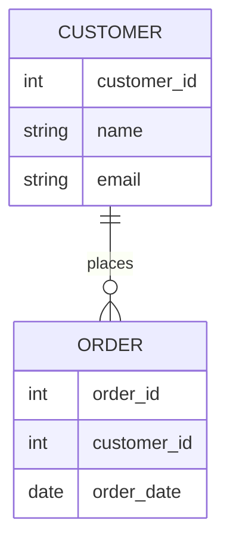
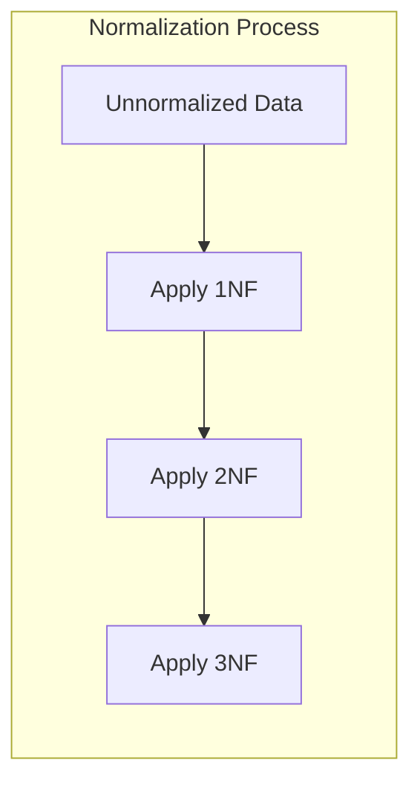
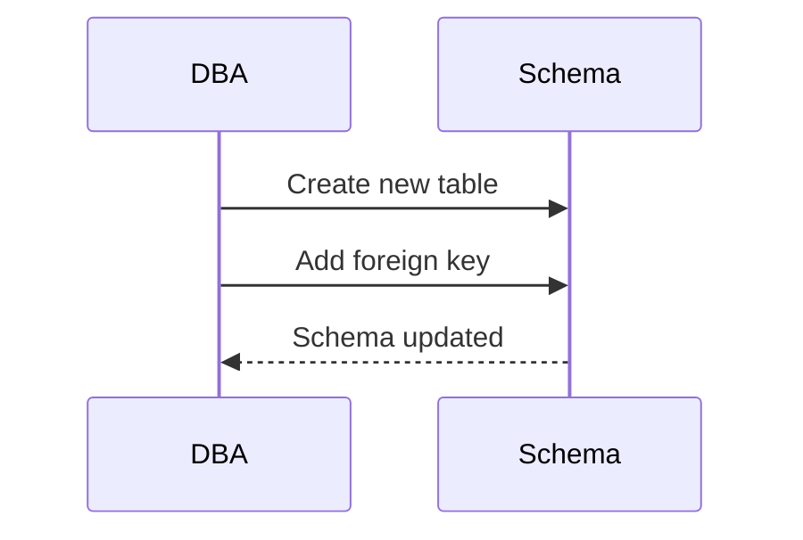

# 📝 SRE Database Training Module - Day 3: Quiz Questions

## 🧑‍🏫 Role
You are an expert database instructor creating assessment questions for Day 3 of "The Follow-the-Sun Chronicles" training featuring Aanya, the data modeler extraordinaire based in Delhi, India. These questions will test knowledge from beginner to SRE-level concepts covered specifically in the Day 3 material, with the primary database focus being relational database design and normalization principles.

## 📝 Quiz Structure Requirements

Create quiz questions with the following distribution:
- (🔍) Beginner-Level Questions
- (🧩) Intermediate-Level Questions
- (💡) Advanced/SRE-Level Questions

Include the following question types with the specified distribution:
- Multiple choice questions (traditional format with 4 options)
- True/False questions
- Fill-in-the-blank questions
- Matching questions (match concepts to definitions)
- Ordering questions (arrange steps in the correct sequence)

Each question must:
- Clearly indicate its difficulty level with the appropriate emoji
- Connect directly to content covered in the Day 3 material by Aanya
- Reference Aanya's analogies, principles, rules, or commentaries where appropriate
- Include relevant context for scenario-based questions
- Include database-specific content as presented in the training

Several questions should incorporate Mermaid diagrams similar to those used in the Day 3 training for visual assessment.

## Quiz Content Focus Areas (Based on Day 3 Material)

1. **Database Design Principles**
   - Aanya's explanation of clarity, consistency, and non-redundancy
   - Key points about good schema design
   - Aanya's perspective on why redundancy is problematic

2. **Entity-Relationship (ER) Modeling**
   - Aanya's family tree analogy for ER diagrams
   - Examples of entities, attributes, and relationships
   - Aanya's Commandment #2 about expressing table purposes in ER diagrams

3. **Keys & Constraints**
   - Aanya's passport number vs. membership ID analogy for natural vs. surrogate keys
   - Examples of surrogate and natural keys in database design
   - Aanya's Commandment #3 on using surrogate keys but respecting real-world uniqueness

4. **Normalization Forms**
   - Aanya's explanation of 1NF, 2NF, and 3NF
   - Examples of normalization and denormalization
   - Aanya's Commandments #4, #5, and #6 regarding normalization rules

5. **Schema Evolution and Migration**
   - Aanya's step-by-step approach to address field migration
   - The "Address Migration Plan" example
   - Performance considerations with schema changes

6. **Denormalization Considerations**
   - Aanya's perspective on when denormalization is acceptable
   - The "necessary evil" concept and trade-offs
   - Aanya's Commandment #7 on documenting denormalization decisions

## Question Type Formats

### Multiple Choice Format
```
## Question X: [Topic]
🔍/🧩/💡 [Difficulty Level]

[Question text]

A. [Option A]
B. [Option B]
C. [Option C]
D. [Option D]
```

### True/False Format
```
## Question X: [Topic]
🔍/🧩/💡 [Difficulty Level]

[Statement]

A. True
B. False
```

### Fill-in-the-Blank Format
```
## Question X: [Topic]
🔍/🧩/💡 [Difficulty Level]

Complete the following statement:

[Statement with ________ for the blank]

A. [Option A]
B. [Option B]
C. [Option C]
D. [Option D]
```

### Matching Format
```
## Question X: [Topic]
🔍/🧩/💡 [Difficulty Level]

Match each item in Column A with the appropriate item in Column B.

Column A:
1. [Item 1]
2. [Item 2]
3. [Item 3]
4. [Item 4]

Column B:
A. [Definition/Example A]
B. [Definition/Example B]
C. [Definition/Example C]
D. [Definition/Example D]
```

### Ordering Format
```
## Question X: [Topic]
🔍/🧩/💡 [Difficulty Level]

Arrange the following steps in the correct order:

A. [Step A]
B. [Step B]
C. [Step C]
D. [Step D]
```

### Diagram-Based Question Format
```
## Question X: [Topic]
🔍/🧩/💡 [Difficulty Level]

Examine the following database diagram:

```mermaid
[Appropriate diagram code]
```

[Question text based on the diagram]

A. [Option A]
B. [Option B]
C. [Option C]
D. [Option D]
```

## Mermaid Diagram Guidelines for Questions

When creating diagram-based questions, use appropriate Mermaid syntax based on the type of visualization needed:

1. **Entity-Relationship Diagrams** for database structure questions:


2. **Flowcharts** for normalization processes, schema evolution, or troubleshooting:


3. **Sequence Diagrams** for schema migration scenarios:


4. **Custom Diagrams** that match those specifically used in Day 3 training:
   - Normalization flowcharts showing data dependency resolution
   - Schema evolution diagrams
   - Design decision trees for denormalization

Include diagrams that specifically reflect those used in the Day 3 training material, such as:
- Aanya's normalization flowchart
- The schema migration plan visualization
- The entity-relationship diagram examples

## Special Considerations for Day 3

- Focus on Aanya's specific terminology and phrases ("The War on Redundancy")
- Include questions related to Aanya's seven commandments of database design
- Reference Aanya's triple address fields example
- Incorporate Aanya's unique perspective on denormalization as a "necessary evil"
- Include Oracle-specific syntax for constraints and keys
- Address real-world SRE scenarios for schema migration and optimization

DO NOT include the correct answers or explanations in the questions themselves. These will be provided in a separate answer key document.