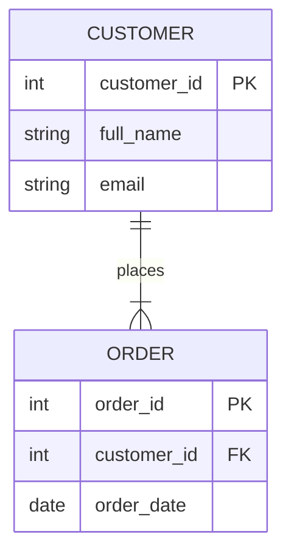
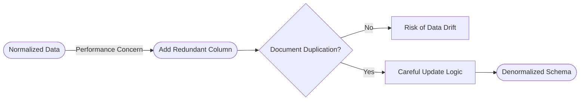
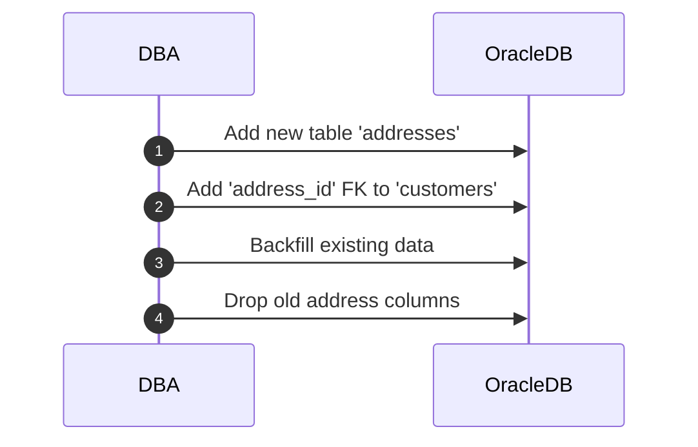

# **Day 3 Quiz**

## **(🔍) Beginner-Level Questions (7)**

---

### **Question 1 (🔍, Multiple Choice)**
**Topic:** Basic Design Principles

Aanya found address fields repeated in three different tables (`customers`, `orders`, and `billing_info`). According to her “War on Redundancy,” which statement best describes why this is a serious design issue?

A. It speeds up writes but slows down reads  
B. It keeps the database smaller but more complex  
C. It introduces inconsistent data across multiple places  
D. It avoids the need to use any foreign keys  

---

### **Question 2 (🔍, Multiple Choice)**
**Topic:** ER Modeling Basics

Aanya uses a “family tree” analogy to explain ER diagrams. Which action best represents how you might use an ER diagram when designing an **Oracle** schema?

A. Combine all entities into one large table so the diagram is simpler  
B. Create separate tables for each entity and define relationships with primary/foreign keys  
C. Store all relationships in a single “lookup” table without foreign keys  
D. Focus only on numeric data types to avoid complex relationships  

---

### **Question 3 (🔍, True/False)**
**Topic:** Commandment #1 – Clarity & Consistency

Aanya’s Commandment #1 insists that each table’s purpose and structure should be **transparent**. True or false: She suggests naming columns with random abbreviations so people must read the documentation to find their meaning.

A. True  
B. False  

---

### **Question 4 (🔍, Fill-in-the-Blank)**
**Topic:** Normalization Introduction (1NF)

Complete the following statement from Aanya’s session on 1NF:

> “In First Normal Form, you can’t have ________ columns that store multiple values in a single field—each column must hold one piece of data.”

A. partial  
B. composite  
C. repeating  
D. numeric  

---

### **Question 5 (🔍, Matching)**
**Topic:** Natural vs. Surrogate Keys

Match each description in Column A with the appropriate key type in Column B.

**Column A**  
1. Tied to real‐world values, like a passport number  
2. Never changes, even if real‐world data changes  
3. May become invalid if a real‐world identifier is reissued  
4. Often an auto-generated ID or sequence in Oracle  

**Column B**  
A. Natural Key  
B. Surrogate Key  

---

### **Question 6 (🔍, Multiple Choice with Diagram)**
**Topic:** Basic ER Diagram Review

Examine the simplified diagram below:

Which statement best reflects Aanya’s approach to relating these two entities?

A. The `ORDER` table should store both `full_name` and `email` for quick lookups  
B. `customer_id` in `ORDER` must match the primary key in `CUSTOMER`  
C. A composite key of `(customer_id, order_date)` is required for `ORDER`  
D. The relationship line indicates that `ORDER` can never exist without a row in `CUSTOMER`  

---

### **Question 7 (🔍, Multiple Choice)**
**Topic:** 1NF vs. 2NF vs. 3NF

Which of the following violations typically breaks **Third Normal Form (3NF)**?

A. Having multi‐valued fields in a single column  
B. Depending on only part of a composite key for a non‐key attribute  
C. A transitive dependency where a non‐key attribute depends on another non‐key  
D. Storing repeated groups of data in multiple rows  

---

## **(🧩) Intermediate-Level Questions (7)**

---

### **Question 8 (🧩, Multiple Choice)**
**Topic:** Keys & Constraints in Oracle

Aanya shows how to define a primary key and unique constraint in Oracle. Which statement best captures her advice on combining **surrogate** and **natural** uniqueness?

A. Always rely solely on the surrogate key; ignore any real‐world unique fields  
B. Use a surrogate key as the PK, and optionally add a UNIQUE constraint on a real‐world field  
C. Natural keys alone are enough; no need for a surrogate key  
D. Surrogate keys and natural keys must be the same column  

---

### **Question 9 (🧩, True/False)**
**Topic:** Composite Keys & 2NF

If a table has a composite primary key `(colA, colB)`, and an attribute depends only on `colA` but not `colB`, it violates Second Normal Form. True or false?

A. True  
B. False  

---

### **Question 10 (🧩, Fill-in-the-Blank)**
**Topic:** Schema Evolution & Migration

Complete this statement from Aanya’s “Address Migration Plan”:

> “Before dropping old address fields from a table, always ________ their usage to be absolutely certain no application still depends on them.”

A. standardize  
B. clone  
C. index  
D. verify  

---

### **Question 11 (🧩, Matching)**
**Topic:** Aanya’s Commandments #4, #5, #6

Match each normal form in Column A to the typical design rule in Column B that Aanya preaches.

**Column A**  
1. 1NF  
2. 2NF  
3. 3NF  

**Column B**  
A. Eliminate multi-valued or repeating columns  
B. Remove partial dependencies if there’s a composite PK  
C. Remove transitive dependencies (non‐key depends on another non‐key)  

---

### **Question 12 (🧩, Ordering)**
**Topic:** Stepwise Normalization

Arrange these steps in the order Aanya typically applies them to transform an unnormalized table into a **3NF** structure:

A. Eliminate repeating groups or multi‐valued attributes  
B. Identify and remove partial dependencies on a composite primary key  
C. Check for transitive dependencies and separate them  
D. Verify that each column depends on the key and nothing but the key  

---

### **Question 13 (🧩, Multiple Choice with Diagram)**
**Topic:** Denormalization Flow

Examine Aanya’s simplified denormalization flowchart:

Which statement best describes Aanya’s stance when you decide to **add a redundant column** to speed up reads?

A. It should be done secretly to avoid overhead  
B. You must document the duplication and implement an update strategy  
C. You must remove all foreign keys to prevent conflicts  
D. Denormalization means no constraints are needed  

---

### **Question 14 (🧩, Multiple Choice)**
**Topic:** Oracle-Specific Constraint Usage

Which Oracle feature allows you to **ensure** a real‐world field (like `email`) cannot be duplicated, while still using a surrogate primary key?

A. `CHECK` constraint  
B. `UNIQUE` constraint  
C. `NOT NULL` constraint  
D. `FOREIGN KEY` constraint  

---

## **(💡) Advanced/SRE-Level Questions (6)**

---

### **Question 15 (💡, Multiple Choice)**
**Topic:** Performance Tuning in a Normalized Schema

Aanya highlights how a highly normalized schema can affect performance if poorly indexed. Which approach best addresses read‐heavy queries on multiple joined tables?

A. Rely on a single index across the primary key column  
B. Add indexes selectively on join columns and frequently searched attributes  
C. Denormalize everything so no joins are needed  
D. Disable constraints to speed up queries  

---

### **Question 16 (💡, True/False)**
**Topic:** Balancing Normalization & Denormalization

True or false: Aanya recommends always fully denormalizing a 3NF schema if a single query experiences high latency, ignoring any overhead or data consistency risks.

A. True  
B. False  

---

### **Question 17 (💡, Fill-in-the-Blank)**
**Topic:** Advanced Key Usage

Complete this statement from Aanya’s advanced design notes:

> “In some cases, you can maintain both a surrogate key for referencing and a ________ key for additional uniqueness or indexing, ensuring flexibility if real-world data changes.”

A. composite  
B. foreign  
C. natural  
D. partial  

---

### **Question 18 (💡, Ordering with Diagram)**
**Topic:** Schema Evolution

Consider the following Mermaid sequence that outlines a schema migration path:

Arrange these steps in the logical order Aanya suggests for migrating address fields out of `customers`:

A. Create a new `addresses` table  
B. Reference the new table via a foreign key  
C. Drop legacy address columns once unused  
D. Backfill the data  

---

### **Question 19 (💡, Matching)**
**Topic:** Aanya’s SRE Perspective on Normalization

Match each scenario in Column A to the relevant Aanya principle in Column B.

**Column A**  
1. Excessive table joins slow down a critical read query  
2. Repeated fields cause confusion when only some are updated  
3. A natural key changes unexpectedly, breaking references  
4. Adding an index for each column to handle multi-join queries

**Column B**  
A. “Denormalize only if it’s absolutely necessary, then document” 
B. “Storing duplicates leads to data drift if not carefully managed” 
C. “Surrogate key ensures stability when real-world IDs can change” 
D. “Over‐indexing can hamper write performance; balance your approach” 

---

### **Question 20 (💡, Multiple Choice)**
**Topic:** SRE-Level Decision

Aanya addresses an SRE scenario: a small subset of queries are slow due to multiple joins in a well‐normalized design. Which solution best reflects her final recommendation?

A. Completely undo all normalization to remove joins  
B. Tune existing indexes, test partial denormalization only if absolutely necessary  
C. Add a table-level lock during queries for faster reads  
D. Drop foreign keys and constraints to reduce overhead  

---

**End of Day 3 Quiz** – No answers or solutions are included.