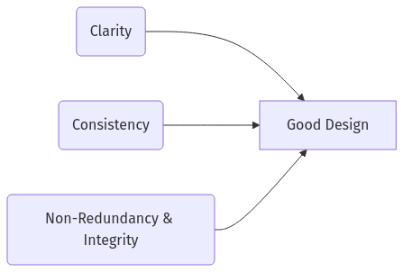
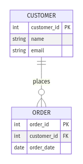
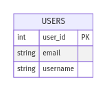
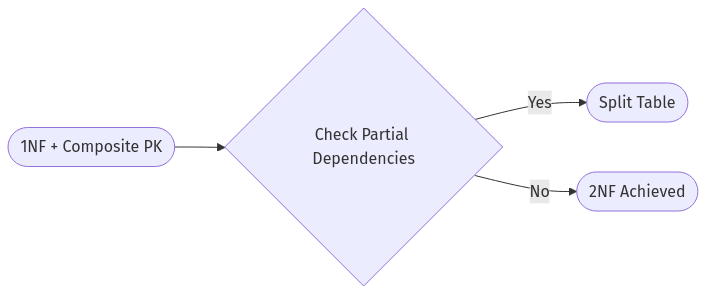
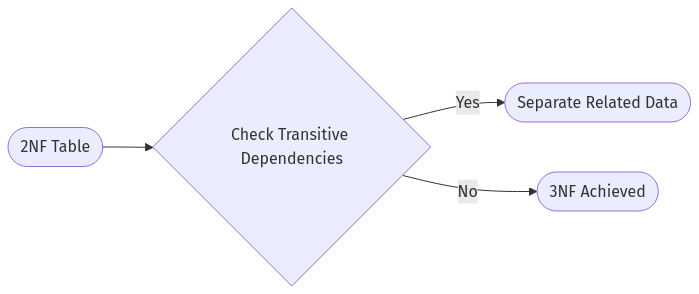
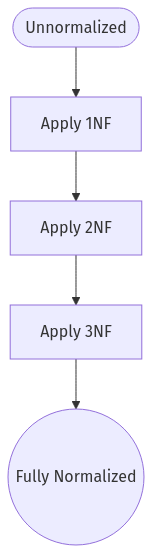

# **The Follow-the-Sun Chronicles: Day 3 – Aanya & The War on Redundancy**

## **1. Morning Vignette: Triple Address Fields**

I walked in at 09:45 IST to find **address** columns repeated in three different tables: `customers`, `orders`, and `billing_info`. Did no one notice we’d have to maintain these addresses *thrice*? Cue my *whiteboard meltdown*. That’s when I realized: Today, we talk **Database Design**—and wage war on redundancy. By the end of this, you’ll see why properly normalized schemas matter, how they drive better performance, and how we can gently (or not-so-gently) fix those legacy “spreadsheets disguised as databases.”

---

## **2. Day 3 Learning Objectives (Aanya’s Agenda)**

### 🔍 **Beginner**
1. **Recognize** the perils of redundancy and the essentials of clarity, consistency, and integrity.  
2. **Discover** ER modeling fundamentals and how to visualize relationships in Oracle.  
3. **Identify** the key differences between 1NF, 2NF, and 3NF.  
4. **Explain** why normalization is a cornerstone of reliable, performant data.

### 🧩 **Intermediate**
1. **Compare** natural vs. surrogate keys, plus constraints in Oracle.  
2. **Eliminate** partial and transitive dependencies using 2NF and 3NF.  
3. **Adopt** Oracle-specific constraints and modeling tools for robust design.  
4. **Debate** selective denormalization for performance—when (rarely) you must break the rules.

### 💡 **Advanced/SRE**
1. **Assess** normalization overhead vs. performance using Oracle AWR, ASH, EXPLAIN PLAN.  
2. **Design** indexing strategies for highly normalized schemas.  
3. **Implement** advanced denormalization (e.g. summary tables) for read-heavy workloads.  
4. **Evolve** your schema with minimal downtime, ensuring data integrity under production pressure.

> **Aanya’s Note**: “Normalization might sound academic—until you spend a weekend reconciling duplicate data that’s *almost* the same. Trust me, it’s better to do it right from the start.”

---

## **3. Database Design Principles: Clarity, Consistency & Non-Redundancy**

**Analogy**: Think of your schema as a meticulously arranged library. Each shelf is labeled, each book is in its place. If you randomly scattered duplicates or mislabeled them, good luck finding anything.





**Technical Explanation**:  
- **Clarity**: Logical naming (tables, columns).  
- **Consistency**: Consistent data types, constraints.  
- **Non-Redundancy**: Single source of truth.  
- **Integrity**: Data that reflects reality.

**System Impact**: Queries run faster; anomalies are rare; everyone’s happier.

> **Aanya’s Commandment #1**  
> ```
> 🧾 Aanya’s Commandment #1: 
> Design for clarity and consistency. A single, well-labeled source of truth beats a dozen half-baked duplicates.
> ```
> *Commentary*: “I shouldn’t have to guess which address field is correct—it should be in one place, with consistent constraints.”

---

## **4. Entity-Relationship (ER) Modeling**

> “Stop using 50 column ‘kitchen-sink’ tables. Model your entities and relationships properly.”

### **4.1 Basics**

**Analogy**: An ER diagram is like a **family tree**: each node (table) has attributes (columns), edges define relationships (1-to-many, etc.).





**Technical Explanation**:
- **Entities**: Real-world objects (tables).
- **Attributes**: Table columns.
- **Relationships**: E.g., `CUSTOMER` to `ORDER` is 1-to-many.

**SRE Application**: Clean ER modeling reveals potential performance bottlenecks or multi-join nightmares.

> **Aanya’s Commandment #2**  
> ```
> 🧾 Aanya's Commandment #2:
> If you can’t clearly express a table’s purpose or relationships in an ER diagram, your design is suspect.
> ```
> *Commentary*: “If your diagram is a tangle, it’s time to refactor.”

---

## **5. Keys & Constraints: Natural vs. Surrogate**

> “Yes, the perennial debate: Real-world keys or auto-generated IDs? Let’s see when each is best.”

### **5.1 Definitions**

**Analogy**: A **natural key** is like an official passport number; a **surrogate key** is a system-generated membership ID.





**Technical Explanation**:
- **Natural Key**: Tied to real data, but can change or might not be truly unique.  
- **Surrogate Key**: Doesn’t change, but meaningless to the business domain.

**SRE Application**: 
- Surrogate keys simplify references.  
- If you have a truly unique domain field (e.g., email), enforce a **unique constraint**.

> **Aanya’s Commandment #3**  
> ```
> 🧾 Aanya’s Commandment #3:
> Use surrogate keys for stability, but never ignore real-world uniqueness. 
> ```
> *Commentary*: “Even if you rely on `customer_id`, you must still ensure ‘email’ can’t appear 50 times.”

---

## **6. Normalization: 1NF, 2NF, 3NF**

> “This is the heart of the matter. Normalization kills duplication, anomalies, and random meltdown.”

### **6.1 First Normal Form (1NF)**

**Analogy**: Each cell in a spreadsheet has exactly one piece of data. No multi-valued fields, no repeating groups.


**SQL Example**  
```sql
-- Non-1NF (bad)
CREATE TABLE orders_unnormalized (
  order_id NUMBER,
  customer_info VARCHAR2(200), -- "Alice, 555-1212"
  order_date DATE
);

-- 1NF
CREATE TABLE customers (
  customer_id NUMBER GENERATED ALWAYS AS IDENTITY,
  customer_name VARCHAR2(100),
  PRIMARY KEY (customer_id)
);
```

**SRE Relevance**: Searching or indexing multi-valued columns is a fiasco.

> **Aanya’s Commandment #4**  
> ```
> 🧾 Aanya's Commandment #4:
> 1NF is non-negotiable. No multi-valued or repeating group columns. Ever.
> ```
> *Commentary*: “I once found 20 phone numbers jammed in one field. Parsing it was a horror show.”

---

### **6.2 Second Normal Form (2NF)**

**Analogy**: If a table has a composite key, non-key columns must depend on *all* parts of that key.





**Technical Explanation**: No partial dependency on just one part of a composite PK.

**SRE Angle**: Many “order-details” tables use composite keys `(order_id, product_id)`. If quantity depends only on product, that’s a partial dependency.

> **Aanya’s Commandment #5**  
> ```
> 🧾 Aanya's Commandment #5:
> Don’t store columns that depend on part of a composite key. Either break them out or rethink your PK.
> ```
> *Commentary*: “Otherwise, you’ll have weird duplication or orphan data.”

---

### **6.3 Third Normal Form (3NF)**

**Analogy**: Avoid transitive dependencies, e.g. storing `supplier_phone` in `product`—that belongs in `supplier`.





**SQL Example**  
```sql
-- If product table had supplier info,
-- move that data to a supplier table and link with FK.
```

**SRE Context**: Minimizes update anomalies—change data once, not in multiple spots.

> **Aanya’s Commandment #6**  
> ```
> 🧾 Aanya's Commandment #6:
> 3NF: No transitive dependencies. If a column belongs elsewhere, move it. 
> ```
> *Commentary*: “Otherwise, you’ll chase random columns living in random tables.”

---

### **6.4 Putting It All Together: Normalization Flowchart**





---

## **7. Denormalization: The Necessary Evil**

> “Sometimes, we intentionally break the rules for performance—read this in a whisper, because it pains me to admit it.”

**Analogy**: Keeping a **shortcut** to often-used data, so you don’t do 5 joins every time.


**System Impact**: Gains on read performance, but updating duplicates is riskier.

> **Aanya’s Commandment #7**  
> ```
> 🧾 Aanya’s Commandment #7:
> Only denormalize if proven necessary. Document it obsessively, or you’ll forget how data is duplicated.
> ```
> *Commentary*: “Half the time, indexing or better queries fix the problem without denormalizing. Don’t jump to duplicating data.”

---

## **8. Troubleshooting Scenario: Over-Normalization & Slow Reads**

**Situation**: A read-heavy analytics query touches five different normalized tables, requiring multiple joins.

- **Symptom**: Query times out, or hits 30+ seconds under load.
- **Reluctant Decision**: Build a read-optimized summary table or materialized view, updated periodically.  
- **Outcome**: Query drops to ~3 seconds. Writes slightly more complicated, but user experience improves.

> **Aanya’s Reaction**: “Yes, I hate duplicating data, but I hate 30-second queries more. Just manage that summary carefully.”

---

## **9. Querying Across Five Normalized Tables: Performance Deep-Dive**

**Scenario**: We have a fully normalized structure—**orders**, **customers**, **addresses**, **payments**, **shipping** (five tables). A single query fetches combined info.

### **9.1 EXPLAIN PLAN Outputs**

1. **Normalized** (5-table join):
   ```sql
   EXPLAIN PLAN FOR
   SELECT c.customer_name, a.city, o.order_date, s.tracking_number, p.amount
   FROM customers c
   JOIN addresses a ON c.address_id = a.address_id
   JOIN orders o ON c.customer_id = o.customer_id
   JOIN shipping s ON o.order_id = s.order_id
   JOIN payments p ON o.order_id = p.order_id;

   SELECT * FROM TABLE(DBMS_XPLAN.DISPLAY());
   ```

   - **Plan**:
     ```
     | Id | Operation            | Name          | Rows  | Bytes | Cost |
     |  0 | SELECT STATEMENT     |               |  1000 |       |  120 |
     |  1 |  HASH JOIN           |               |       |       |      |
     |  2 |   INDEX RANGE SCAN   | IDX_CUSTOMERS |       |       |      |
     |  3 |   TABLE ACCESS FULL  | ADDRESSES     |       |       |      |
     ...
     ```
   - We see multiple table accesses. Possibly many index scans if well-indexed, or full scans if not.

2. **Partially Denormalized** (combined shipping+payments in a single table):
   ```sql
   EXPLAIN PLAN FOR
   SELECT c.customer_name, a.city, o.order_date, op.shipping_info, op.payment_info
   FROM customers c
   JOIN addresses a ON c.address_id = a.address_id
   JOIN orders o ON c.customer_id = o.customer_id
   JOIN order_extras op ON o.order_id = op.order_id;

   SELECT * FROM TABLE(DBMS_XPLAN.DISPLAY());
   ```

   - **Plan**:
     ```
     | Id | Operation              | Name         | Rows  | Bytes | Cost |
     |  0 | SELECT STATEMENT       |              |  1000 |       |  70  |
     |  1 |  MERGE JOIN            |              |       |       |      |
     |  2 |   INDEX RANGE SCAN     | IDX_CUSTOMERS|       |       |      |
     |  3 |   TABLE ACCESS FULL    | ORDER_EXTRAS |       |       |      |
     ...
     ```
   - Fewer overall joins → can reduce cost. But the `order_extras` table must store shipping & payment fields, risking data duplication.

### **9.2 Table Scan vs. Index Seek**

- With full normalization, if you index properly (e.g., on `customer_id`, `address_id`), you might see mostly **index range scans**.  
- If indexes are missing, or we rely on multiple joins with large data sets, Oracle might do **full table scans** → higher cost.

### **9.3 AWR Report Snippets**

- **Before**: High CPU from scanning multiple large tables.  
- **After**: CPU usage down 20% with partial denormalization or improved indexing.  
- Dev tries adding five indexes, not realizing write overhead spikes 15%.

**Aanya’s Complaints**: “I saw someone add an index to every column they could think of, ignoring the extra cost on inserts and updates. Always analyze the trade-off—indexes help reads but slow writes.”

---

## **10. Schema Evolution Drama: Address Migration Plan**

**Legacy Table**: `customers` with embedded address fields: `street`, `city`, `state`, `country`, repeated in `orders` too.

**Aanya’s Step-by-Step**:

1. **Create** new `addresses` table with proper columns and a primary key:
   ```sql
   CREATE TABLE addresses (
     address_id NUMBER GENERATED ALWAYS AS IDENTITY,
     street VARCHAR2(100),
     city VARCHAR2(50),
     state VARCHAR2(50),
     country VARCHAR2(50),
     PRIMARY KEY (address_id)
   );
   ```
2. **Add** `address_id` to `customers` with a nullable FK:
   ```sql
   ALTER TABLE customers ADD (address_id NUMBER);
   ALTER TABLE customers ADD CONSTRAINT fk_cust_addr 
       FOREIGN KEY (address_id) REFERENCES addresses(address_id);
   ```
3. **Backfill** existing data:
   - Insert new address rows for each unique combination.  
   - Update `customers.address_id` to reference these new rows.
4. **Monitor** with queries checking for unlinked addresses:
   ```sql
   SELECT * FROM customers WHERE address_id IS NULL;
   ```
5. **Minimal Downtime**:  
   - Perform backfill in small batches.  
   - Keep old columns until all references are stable.  
6. **Drop** old address columns once fully migrated:
   ```sql
   ALTER TABLE customers DROP COLUMN street;
   -- etc.
   ```

**Monitoring Strategy**:  
- Use Oracle AWR to track any performance shift.  
- Check logs for constraints or mismatch errors.  

**Aanya’s Satisfaction**: “We ended up with a single place for address data, no duplicates. Queries are simpler, we can index addresses easily, and I can sleep better at night.”

---

## **11. Aanya’s Commandments Recap**

1. **Commandment #1**: *Design for clarity and consistency.*  
2. **Commandment #2**: *ER diagrams are your blueprint—no guesswork.*  
3. **Commandment #3**: *Use surrogate keys for stability, but also enforce real-world uniqueness.*  
4. **Commandment #4**: *1NF is non-negotiable—no multi-valued columns.*  
5. **Commandment #5**: *2NF—avoid partial dependencies on composite keys.*  
6. **Commandment #6**: *3NF—eliminate transitive dependencies, keep data where it belongs.*  
7. **Commandment #7**: *Denormalize only when proven necessary—document every duplication.*

---

## **12. Handoff to Luis in Spain**

That’s **Day 3**—we saw how to fix (and avoid) the tragedy of repeated address fields, how to handle normalization for performance, how to carefully manage schema evolution with minimal downtime, and how to keep your Oracle environment from turning into a data swamp. Tomorrow, **Luis** in Spain will take these well-structured tables and teach you about **SQL JOIN** types—because a good design is only half the battle; you must query it effectively, too.

**—Aanya**, data modeler extraordinaire, signing off with an eye-roll at the memory of those triple address fields.

