## 🏗️ Day 3: Database Design Principles & Normalization (Oracle-Focused) citeturn1file0

### 📌 Introduction

Welcome to Day 3 of your SRE Database Training! Today’s focus is on **Database Design Principles** and **Normalization**, building on the fundamentals from Days 1 and 2. Proper design is essential for **performance**, **data integrity**, and **maintainability**. Below is a Mermaid-based concept map illustrating how design choices directly impact overall system reliability:

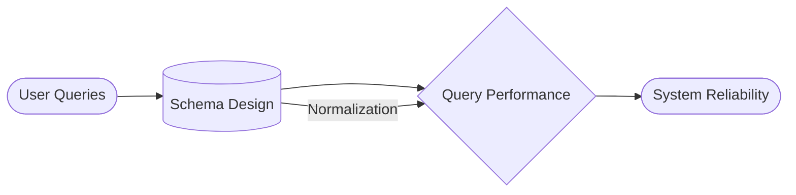

> **Real-World Scenario**: A poorly designed schema that duplicates data often leads to complicated support cases, where multiple references to the same data cause inconsistencies and application bugs.

Remember, database design is part **art** (balancing real-world needs) and part **science** (applying normalization rules and constraints).

---

### 🎯 Learning Objectives by Tier

**🔍 Beginner**

1. Understand the importance of clarity, consistency, non-redundancy, and integrity in database design.
2. Recognize the basics of Entity-Relationship (ER) modeling.
3. Identify the requirements of 1NF, 2NF, and 3NF.
4. Explain why normalization is essential for data accuracy and system performance.

**🧩 Intermediate**

1. Differentiate between natural and surrogate keys in Oracle.
2. Apply 2NF and 3NF to eliminate partial and transitive dependencies.
3. Use Oracle-specific constraints and data modeling tools effectively.
4. Implement and justify selective denormalization strategies.

**💡 Advanced/SRE**

1. Evaluate normalization trade-offs using Oracle performance tools (e.g., AWR).
2. Design index strategies for highly normalized schemas.
3. Implement advanced denormalization techniques to optimize read performance.
4. Monitor and troubleshoot design-related issues in production Oracle environments.

---

### 📚 Core Concepts

Each concept includes:

- **🔍 Beginner Analogy**
- **🖼️ Visual Representation** (Mermaid diagrams)
- **🔬 Technical Explanation**
- **💼 Support/SRE Application**
- **🔄 System Impact**
- **⚠️ Common Misconceptions**
- **📊 Oracle Implementation**

---

### 💻 Day 3 Concept Breakdown

#### 1. Database Design Principles

- **Clarity**: Clear labeling and straightforward relationships.
- **Consistency**: Consistent naming conventions and data types.
- **Non-Redundancy**: Avoid storing the same data in multiple places.
- **Integrity**: Ensure data accurately reflects the real world.

**🔍 Beginner Analogy**: Organizing files into well-labeled folders, so it’s easy to find the right document.

**🖼️ Visual Representation** (Simple principle summary):

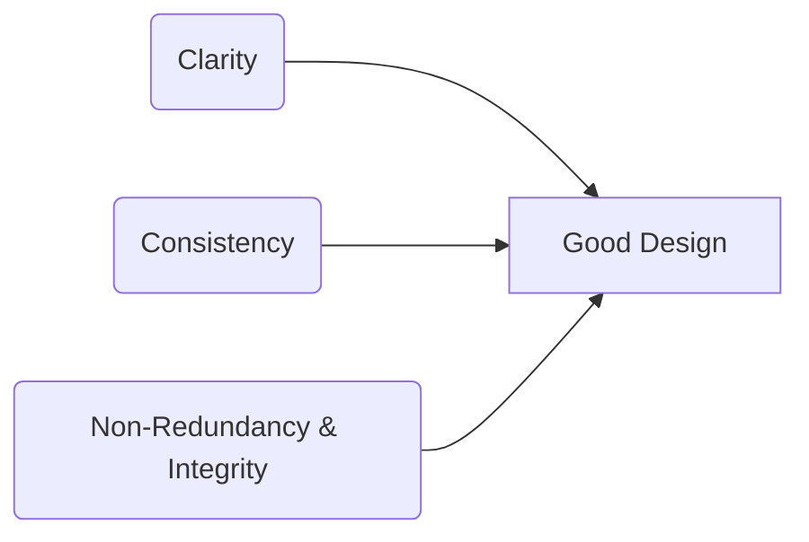

**🔬 Technical Explanation**: Violations of these principles lead to anomalies, inefficiencies, and complexity in maintenance.

**💼 Support/SRE Application**: Clear, consistent schemas reduce guesswork during troubleshooting.

**🔄 System Impact**: Queries run faster and more predictably; data remains accurate.

**⚠️ Common Misconception**: Some believe these principles only matter in large-scale databases. In reality, they’re essential at all scales.

**📊 Oracle Implementation**: Oracle’s data dictionary (`USER_TABLES`, `ALL_CONSTRAINTS`) helps validate schema structure.

---

#### 2. Entity-Relationship Modeling

**🔍 Beginner Analogy**: A family tree showing who’s related to whom.

**🖼️ Visual Representation** (ER Diagram in Mermaid):

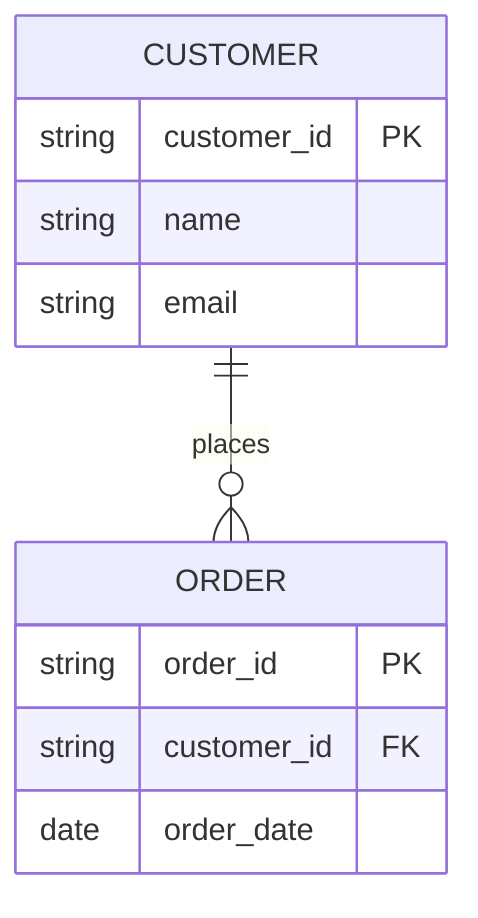

**🔬 Technical Explanation**: Identifies **entities** (tables), their **attributes** (columns), and **relationships** (1-to-1, 1-to-many, many-to-many).

**💼 Support/SRE Application**: Helps you spot potential performance bottlenecks (e.g., overly complex joins).

**🔄 System Impact**: A well-modeled ER structure simplifies queries, ensures data consistency, and scales better.

**⚠️ Common Misconception**: Overlooking many-to-many relationships, which often require **join tables**.

**📊 Oracle Implementation**: Oracle SQL Developer Data Modeler can visually build and manage ERDs.

---

#### 3. Keys and Constraints

**🔍 Beginner Analogy**: A key is a unique ID card; constraints are rules like "must have a valid ID" before entering.

**🖼️ Visual Representation**:

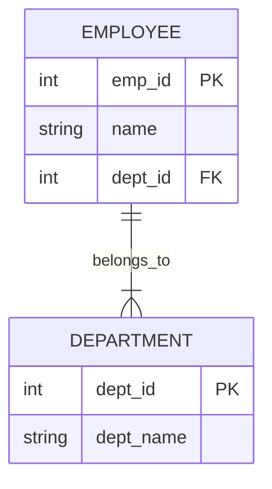

**🔬 Technical Explanation**:

- **Natural Key**: Real-world-based identifier (e.g., SSN).
- **Surrogate Key**: Artificial (auto-increment).
- **Constraints**: **PRIMARY KEY**, **FOREIGN KEY**, **UNIQUE**, **CHECK**, **NOT NULL**.

**💼 Support/SRE Application**: Preventing data corruption is crucial, especially in high-availability systems.

**🔄 System Impact**: Constraints protect integrity; they can add overhead on writes.

**⚠️ Common Misconception**: Believing a surrogate key alone enforces uniqueness if you don’t also declare a unique constraint for natural fields.

**📊 Oracle Implementation**: Use Oracle’s syntax to define constraints, e.g. `ALTER TABLE employees ADD CONSTRAINT pk_emp PRIMARY KEY (emp_id);`

---

#### 4. First Normal Form (1NF)

**🔍 Beginner Analogy**: Each cell in a spreadsheet has exactly one piece of data.

**🖼️ Visual Representation** (Normalization from unnormalized to 1NF):


**🔬 Technical Explanation**: 1NF enforces **atomicity** (no repeating groups, no multi-valued columns).

**💼 Support/SRE Application**: Simplifies queries and indexing.

**🔄 System Impact**: Reduces risk of anomalies and speeds up searching in columns.

**⚠️ Common Misconception**: Some think 1NF is about having only one table. It’s really about each column holding a single value.

**📊 Oracle Implementation**: Storing multiple phone numbers in a single column is a red flag; instead, create a child table `customer_phones`.

---

#### 5. Second Normal Form (2NF)

**🔍 Beginner Analogy**: If part of a composite key doesn’t apply to some attributes, you’re mixing two concepts in one place.

**🖼️ Visual Representation**:

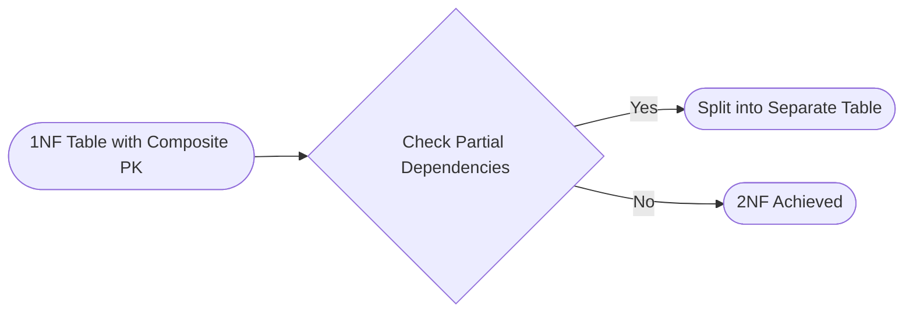

**🔬 Technical Explanation**: For tables with **composite primary keys**, 2NF requires that non-key columns depend on **all** parts of the key.

**💼 Support/SRE Application**: Violations cause data anomalies in multi-column relationships.

**🔄 System Impact**: Minimizes partial redundancy, reducing update overhead.

**⚠️ Common Misconception**: Believing you can skip 2NF if you rarely use composite keys. Always confirm no partial dependencies.

**📊 Oracle Implementation**: If a table’s primary key is `(order_id, product_id)`, ensure non-key columns describe that combination, not just `order_id`.

---

#### 6. Third Normal Form (3NF)

**🔍 Beginner Analogy**: Don’t keep the supplier’s address in the product table. Move it to a supplier table.

**🖼️ Visual Representation**:

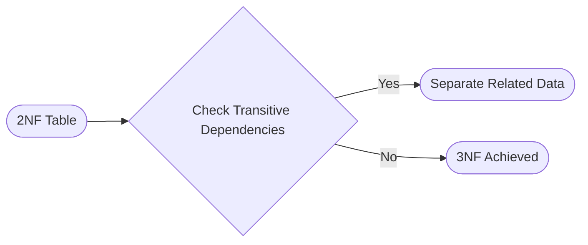

**🔬 Technical Explanation**: 3NF eliminates **transitive dependencies** (non-key attributes depending on other non-key attributes).

**💼 Support/SRE Application**: Ensures data updates happen in a single place.

**🔄 System Impact**: Reduces duplication, but can introduce more joins.

**⚠️ Common Misconception**: 3NF is the end-all. In practice, BCNF or partial denormalization might be needed.

**📊 Oracle Implementation**: Typically, you create a separate table for each real-world entity and link them via foreign keys.

---

#### 7. Denormalization Strategies

**🔍 Beginner Analogy**: Keeping a few shortcuts on your computer desktop for frequently used files.

**🖼️ Visual Representation**:

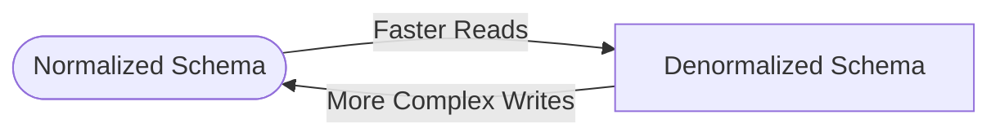

**🔬 Technical Explanation**: Duplicate data in strategic places to reduce join complexity.

**💼 Support/SRE Application**: Denormalizing a heavily accessed reporting table can improve read times.

**🔄 System Impact**: Read performance improves at the cost of more complex, error-prone updates.

**⚠️ Common Misconception**: Overusing denormalization, leading to huge data inconsistencies.

**📊 Oracle Implementation**: Use carefully. Monitor with Oracle’s AWR to confirm the performance benefit outweighs the maintenance cost.

---

### 🔄 Normalization Process in Practice

Below is a Mermaid flowchart showing how an unnormalized table is transformed into 1NF, 2NF, and 3NF:

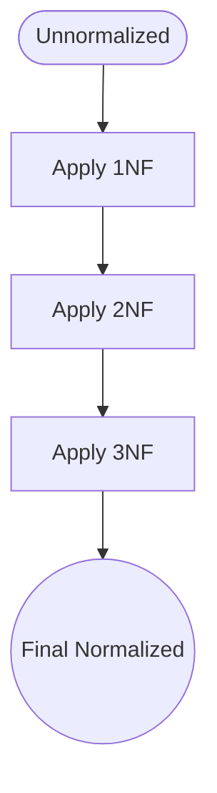

**SQL Example** (Oracle):

```sql
-- Unnormalized
CREATE TABLE orders_unnormalized (
  order_id NUMBER,
  customer_info VARCHAR2(200), -- e.g. "John Smith,555-1212"
  order_date DATE
);

-- Normalized approach
CREATE TABLE customers (
  customer_id NUMBER GENERATED ALWAYS AS IDENTITY,
  customer_name VARCHAR2(100) NOT NULL,
  PRIMARY KEY (customer_id)
);

CREATE TABLE orders (
  order_id NUMBER GENERATED ALWAYS AS IDENTITY,
  customer_id NUMBER,
  order_date DATE,
  PRIMARY KEY (order_id),
  FOREIGN KEY (customer_id) REFERENCES customers(customer_id)
);
```

**Common Pitfalls**:

1. Forgetting to remove repeating groups.
2. Overlooking partial dependencies.
3. Leaving transitive dependencies.

**Verification Techniques**:

- Check each column’s dependency on the primary key.
- Use Oracle constraints to validate referential integrity.

---

### 🛠️ Oracle Database Design Tools and Features

1. **Oracle SQL Developer Data Modeler** – Visual creation of ERDs, forward/reverse engineering.
2. **Constraint Implementation** – Oracle handles constraints at the DB level.
3. **Tablespace Considerations** – Plan storage for large-scale performance (e.g., separate index/data tablespaces).
4. **Schema Comparison Tools** – Compare dev/staging/production schemas.

---

### 🔍 Impact of Design on Performance

- **Normalization** typically boosts data integrity but can require additional joins.
- **Indexing** is crucial to handle join overhead.
- **Performance Bottlenecks** arise if joins aren’t optimized.
- **Oracle SRE Approach**: Use **AWR**, **ASH** (Active Session History), and **EXPLAIN PLAN** to measure the impact of schema changes.

---

### 🔨 Hands-On Exercises

**🔍 Beginner**

1. Identify repeating groups in a sample table.
2. Move multi-valued attributes to a child table.
3. Draw an ER diagram for a simple bookstore scenario.

**🧩 Intermediate**

1. Normalize a table to 2NF and 3NF using Oracle constraints.
2. Implement a surrogate key vs. a natural key, then compare pros/cons.
3. Partially denormalize a read-heavy table and measure performance.

**💡 Advanced/SRE**

1. Test query performance on normalized vs. partially denormalized schemas.
2. Use Oracle AWR reports to diagnose performance bottlenecks.
3. Implement advanced indexing strategies (e.g., composite indexes) on a normalized schema.

---

### 🚧 Troubleshooting Scenarios

1. **Multi-Valued Attributes**: A phone number column with comma-separated values. Diagnosed via slow queries and complicated string splits.
2. **Partial Dependency**: A composite key table with extra columns that only relate to part of the key. Detected by constraint violations.
3. **Over-Normalized with Too Many Joins**: A scenario where read-heavy queries need 5+ table joins, impacting performance. Resolved with partial denormalization.

Use Mermaid for a diagnostic workflow example:

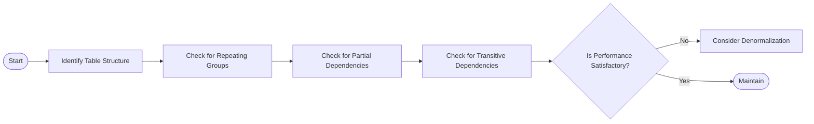

---

### ❓ Frequently Asked Questions

**🔍 Beginner**

1. *What is 1NF in simple terms?*
2. *How many tables should I have for phone numbers?*
3. *Is normalization always required?*

**🧩 Intermediate**

1. *When do I choose a surrogate key over a natural key in Oracle?*
2. *How can I quickly spot partial dependencies?*
3. *Do foreign keys in Oracle affect query speed?*

**💡 Advanced/SRE**

1. *How do I monitor index usage for normalized schemas in Oracle?*
2. *Which Oracle views help track design-related performance issues (AWR, ASH)?*
3. *How far should I normalize for ultra-large databases?*

---

### 🔥 Oracle-Specific SRE Scenario

**Incident**: A banking application experiences intermittent slowdowns.

1. **Symptoms**: A specific query in the transaction table times out under heavy load.
2. **Investigation**:
   - **AWR** reveals high CPU usage on joins.
   - `EXPLAIN PLAN` shows multiple merges across lookup tables.
   - The table storing customer addresses includes extraneous fields that belong in a separate address table.
3. **Resolution**:
   - Break address data into a new table.
   - Add appropriate foreign keys.
   - Create indexes on frequently joined columns.
   - Performance improved, monitored again with AWR.
4. **SRE Principles**: Observability, reliability, and maintaining data integrity are paramount.

---

### 🧠 Key Takeaways

- Proper database design underpins system performance and stability.
- Normalization (1NF, 2NF, 3NF) reduces redundancy but can increase joins.
- Denormalization is sometimes necessary for high-read workloads.
- Oracle-specific tools (AWR, SQL Developer Modeler) guide optimization.
- Continually reassess schema design as requirements evolve.

---

### 🚨 Career Protection Guide for Database Design

1. **High-Risk Decisions**: Over-denormalization without proper checks can cause data drift.
2. **Design Reviews**: Always get a second opinion, especially for business-critical tables.
3. **Staged Implementation**: Deploy schema changes in dev/test before production.
4. **Communication**: Document changes and communicate impact with the team.
5. **Testing**: Use real or well-crafted synthetic workloads to validate changes.

---

### 🔮 Preview of Next Day’s Content

On **Day 4**, we’ll dive into **SQL JOIN** types (INNER, LEFT, RIGHT, FULL), bridging your design knowledge from today into how you can effectively query and combine data across multiple normalized (and sometimes denormalized) tables.

---

## Additional Enhancements

### 1. Design Pattern Examples

- **Common Oracle Patterns**:
  - **Star Schema** for analytics.
  - **Transactional OLTP** using 3NF.
  - **Master-Detail** relationships.
- **Anti-Patterns**:
  - **Single Big Table**: Hard to maintain, leads to huge performance hits.
  - **Multi-Valued Columns**: Breaking 1NF.

### 2. Normalization Decision Tree (Mermaid)

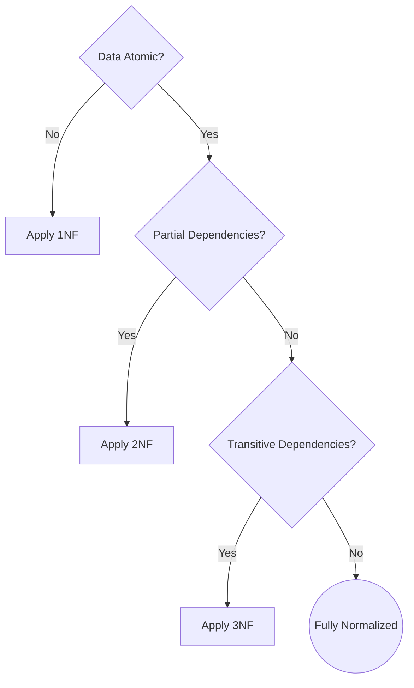

### 3. Oracle Constraints Visualization

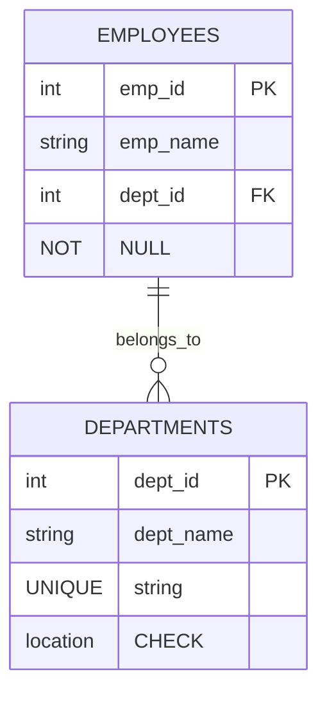

### 4. Performance Impact Analysis

Compare queries **before** and **after** normalization:

- **Before**: Possibly less joins, but more duplication.
- **After**: More joins, but less data redundancy.
- Use Oracle **EXPLAIN PLAN** to see the difference in cost and row scans.

### 5. Schema Evolution Management

- **Safe Schema Changes**: Minimize downtime by adding new tables/columns in parallel, migrating data gradually.
- **Managing Constraints**: Temporarily disable constraints during data loads.
- **Backward Compatibility**: Keep old structures until all apps are updated.
- **SRE Monitoring**: Watch performance changes in real-time using AWR or custom scripts.

---

**Congratulations!** You’ve now completed Day 3, focusing on the **art and science** of **Database Design Principles** and **Normalization**. With these fundamental skills, you’re ready to explore more advanced SQL operations and multi-table queries in **Day 4**.
