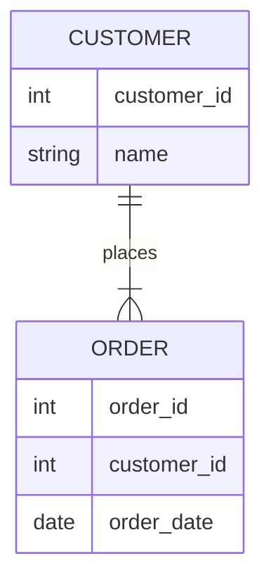
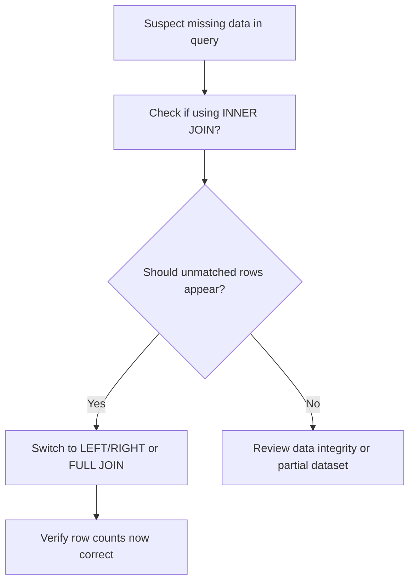
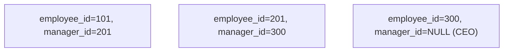

# **Day 4 Answer Sheet**

## (🔍) Beginner-Level Questions

---

## **Answer 1: JOIN Basics / Case of the Missing Rows**
**Difficulty Level:** Beginner (🔍)  
**Question Type:** Multiple Choice  

**Question:**  
Luis uncovered a “missing rows” mystery where an **INNER JOIN** caused data to vanish. Which statement best describes why rows may disappear in an INNER JOIN?

A. Inner joins exclude rows that lack a matching key in the other table  
B. Inner joins automatically generate extra NULL rows for unmatched data  
C. Inner joins fill columns with default values if a match is not found  
D. Inner joins dynamically create a CROSS product of all table rows  

**Correct Answer:** A

**Explanation:**  
An INNER JOIN only returns rows if they match on the specified join condition in both tables. Any row that lacks a matching key in the other table is excluded, which is precisely how “missing data” can arise if the developer intended to keep unmatched rows. This is the root cause in many “Case of the Missing Rows” incidents.

**Why other options are incorrect:**  
- **(B)** Generating NULL rows for unmatched records describes a LEFT/RIGHT/FULL OUTER JOIN.  
- **(C)** There is no automatic default fill for unmatched rows in an INNER JOIN.  
- **(D)** A CROSS JOIN is the Cartesian product of both tables, unrelated to inner joins.

**Database Comparison Note:**  
In Oracle, PostgreSQL, and SQL Server, INNER JOIN behaves identically, excluding unmatched rows.

**Knowledge Connection:**  
Luis’s detective approach states that if rows vanish, a left or outer join might be needed. This question directly highlights that phenomenon.

**SRE Perspective:**  
Unexpected data “disappearance” in production can cause system confusion and user complaints, so verifying the correct join type is crucial for reliability.

**Additional Insight:**  
Always re-check your join condition if you suspect data is erroneously excluded. Sometimes a small error in the ON clause can silently remove needed rows.

---

## **Answer 2: INNER vs. LEFT JOIN**
**Difficulty Level:** Beginner (🔍)  
**Question Type:** True/False  

**Question:**  
Luis says if your query discards rows without matching data, you might need a **LEFT JOIN** instead. True or false: A LEFT JOIN always excludes rows from the left table if there’s no match in the right table.

A. True  
B. False  

**Correct Answer:** B (False)

**Explanation:**  
A LEFT JOIN actually **includes** all rows from the left table, even if the right table has no matching records (those columns become NULL). This is often the remedy when an INNER JOIN discards rows you want to keep.

**Why other options are incorrect:**  
The statement says “always excludes,” which contradicts how LEFT JOIN works. The correct behavior is to **retain** left‐table rows.

**Database Comparison Note:**  
LEFT JOIN syntax is identical across Oracle, PostgreSQL, and SQL Server.

**Knowledge Connection:**  
Luis’s rule suggests switching from INNER to LEFT if you want to preserve left‐side data lacking a match.

**SRE Perspective:**  
From an SRE standpoint, ensuring a table’s “main” data always appears is crucial for debugging or reporting. Missing data can spawn confusion in incident calls.

**Additional Insight:**  
If you see `NULL` columns from the right side, that typically indicates no matching record was found, preserving the left row.

---

## **Answer 3: CROSS JOIN Footgun**
**Difficulty Level:** Beginner (🔍)  
**Question Type:** Multiple Choice  

**Question:**  
According to Luis, the **CROSS JOIN** can be dangerous if used by accident. Why?

A. It merges only matching rows, hiding unmatched data  
B. It quickly becomes a Cartesian product, multiplying all rows from both tables  
C. It permanently locks both tables in exclusive mode  
D. It forbids the use of any WHERE clause  

**Correct Answer:** B

**Explanation:**  
A CROSS JOIN creates the Cartesian product of the two tables, producing every possible row combination. If one table has thousands of rows and the other has millions, you could generate billions of result rows—often unintentional.

**Why other options are incorrect:**  
- **(A)** That describes an INNER JOIN, not CROSS.  
- **(C)** CROSS JOIN does not lock tables exclusively in normal operation.  
- **(D)** You can still use WHERE clauses with CROSS JOIN (though it might be illogical if you intended a different join).

**Database Comparison Note:**  
All major SQL engines handle CROSS JOIN similarly—it’s rarely used in business queries except for generating test data.

**Knowledge Connection:**  
Luis’s detective notes call it a “footgun,” as accidental CROSS JOINS cause performance meltdowns.

**SRE Perspective:**  
Accidentally returning a massive result set can saturate CPU, memory, and network, potentially triggering outages.

**Additional Insight:**  
Always specify ON conditions when you intend an actual match join. If you see suspiciously huge row counts, re-check for an unintentional CROSS.

---

## **Answer 4: Luis’s Rule #3**
**Difficulty Level:** Beginner (🔍)  
**Question Type:** Fill-in-the-Blank  

**Question:**  
Complete the following statement about **FULL OUTER JOIN** from Luis’s detective handbook:

> “Use a FULL OUTER JOIN only if you truly need *all* rows from both sides, because it can produce ________ result sets if each table has many unmatched rows.”

A. unindexed  
B. minimal  
C. enormous  
D. partial  

**Correct Answer:** C – enormous

**Explanation:**  
A FULL OUTER JOIN returns every row from both tables, including matched and unmatched ones. If both sides have large sets of rows with few matches, the result can skyrocket in size, leading to performance overhead.

**Why other options are incorrect:**  
- **(A)** “unindexed” is unrelated to the size of the result set.  
- **(B)** “minimal” contradicts the potential massive size.  
- **(D)** “partial” is not the typical descriptor; a FULL join is quite inclusive.

**Database Comparison Note:**  
Oracle, PostgreSQL, and SQL Server each support FULL OUTER JOIN with the same potential for big outputs.

**Knowledge Connection:**  
Luis’s Rule #3 states you should be cautious using FULL OUTER if you don’t genuinely need every unmatched row from both sides.

**SRE Perspective:**  
Large result sets can overwhelm networks or cause timeouts. SREs watch for queries with FULL OUTER that might hamper system performance under load.

**Additional Insight:**  
Sometimes a UNION of a LEFT and a RIGHT join can serve a similar purpose more explicitly, but FULL is simpler if carefully managed.

---

## **Answer 5: JOIN Type Purposes**
**Difficulty Level:** Beginner (🔍)  
**Question Type:** Matching  

**Question:**  
Match each JOIN type in Column A to Luis’s short description in Column B.

Column A:  
1. INNER JOIN  
2. LEFT OUTER JOIN  
3. FULL OUTER JOIN  
4. SELF JOIN  

Column B:  
A. Returns only the matching rows from both tables  
B. Retrieves all rows from both tables, matched or not  
C. Keeps all rows from the left table, with NULLs for unmatched on the right  
D. Joins a table to itself, often for hierarchical data  

**Correct Matches:**  
1 → A  
2 → C  
3 → B  
4 → D  

**Explanation:**  
- **INNER JOIN**: matching rows only (A).  
- **LEFT OUTER JOIN**: all from left, unmatched on the right become NULL (C).  
- **FULL OUTER JOIN**: all rows from both sides, matched or not (B).  
- **SELF JOIN**: table joined to itself (D).

**Database Comparison Note:**  
The syntax for these joins is largely consistent across Oracle, PostgreSQL, and SQL Server, though minor differences exist in older Oracle `(+)` usage.

**Knowledge Connection:**  
These definitions echo Luis’s detective approach describing each join “suspect” and potential outcome.

**SRE Perspective:**  
Knowing the nature of each join type is crucial for on‐call debugging, as the wrong type can cause either missing data or massive overhead.

**Additional Insight:**  
When using a SELF JOIN, indexing the referencing fields prevents performance bottlenecks for hierarchical queries.

---

## **Answer 6: Oracle vs. PostgreSQL vs. SQL Server JOIN Syntax**
**Difficulty Level:** Beginner (🔍)  
**Question Type:** Multiple Choice  

**Question:**  
Luis mentions that **ANSI-style JOIN** syntax is widely supported. Which of the following is **not** an ANSI JOIN keyword?

A. INNER  
B. OUTER  
C. CROSS  
D. (+)  

**Correct Answer:** D

**Explanation:**  
The `(+)` operator was a historical Oracle extension for outer joins in the WHERE clause. It is not part of the ANSI SQL join vocabulary (INNER, LEFT, RIGHT, FULL, CROSS).

**Why other options are incorrect:**  
- **(A)** INNER is an ANSI keyword.  
- **(B)** OUTER is part of LEFT/RIGHT/FULL OUTER.  
- **(C)** CROSS is recognized in ANSI SQL for Cartesian products.

**Database Comparison Note:**  
In modern Oracle, `(+)` is deprecated in favor of the ANSI JOIN syntax. PostgreSQL and SQL Server never used `(+)`.

**Knowledge Connection:**  
Luis remarks that older Oracle queries rely on `(+)`, but ANSI joins are more readable and portable.

**SRE Perspective:**  
ANSI JOIN syntax standardization reduces confusion when teams support multiple RDBMS.

**Additional Insight:**  
Migrations from older Oracle code often require rewriting `(+)` to LEFT/RIGHT OUTER JOIN for clarity.

---

## **Answer 7: Simple ER Diagram for Customers & Orders**
**Difficulty Level:** Beginner (🔍)  
**Question Type:** Multiple Choice (Diagram-Based)  

**Question:**  
Examine the diagram below:



Which JOIN should you use if you want **all customers** to appear, even if they have **no orders** yet?

A. INNER JOIN  
B. LEFT JOIN  
C. RIGHT JOIN  
D. CROSS JOIN  

**Correct Answer:** B

**Explanation:**  
A LEFT JOIN ensures that every row from the “left” table (CUSTOMER) will appear in the result, even if no matching record exists in the “right” table (ORDER). Unmatched columns from the ORDER side become NULL. This is exactly how you show customers without orders.

**Why other options are incorrect:**  
- **(A)** INNER JOIN would exclude any customer not present in ORDER.  
- **(C)** RIGHT JOIN would keep all orders but might exclude customers if no order references them, unless reversed table ordering is used.  
- **(D)** CROSS JOIN is a Cartesian product, not relevant here.

**Database Comparison Note:**  
ANSI LEFT JOIN syntax is universal across Oracle, PostgreSQL, and SQL Server, guaranteeing left‐table rows remain.

**Knowledge Connection:**  
This addresses the “missing row” scenario that arises if you incorrectly used an INNER JOIN.

**SRE Perspective:**  
Ensuring full coverage of “parent” records is often critical for reporting or debugging, preventing overlooked data.

**Additional Insight:**  
Watch the table ordering carefully: “left” is the table you wish to show completely.

---

## (🧩) Intermediate-Level Questions

---

## **Answer 8: Oracle (+) Syntax vs. ANSI JOIN**
**Difficulty Level:** Intermediate (🧩)  
**Question Type:** Multiple Choice  

**Question:**  
Luis explains Oracle’s older `(+)` operator for outer joins. Which statement best captures the difference compared to ANSI JOIN?

A. The `(+)` operator is for CROSS JOIN while ANSI is for LEFT/RIGHT/FULL  
B. `(+)` syntax places a plus sign next to columns in the WHERE clause to indicate an outer join  
C. `(+)` operator is always required for inner joins in Oracle  
D. `(+)` syntax is mandatory in modern Oracle for any join involving NULL rows  

**Correct Answer:** B

**Explanation:**  
In older Oracle SQL, an outer join was indicated by placing `(+)` next to the column in the WHERE clause (e.g., `WHERE A.col = B.col(+)`). This stands in contrast to the more modern (and readable) ANSI `LEFT JOIN` / `RIGHT JOIN` syntax.

**Why other options are incorrect:**  
- **(A)** `(+)` is not for CROSS JOIN. CROSS is a separate concept.  
- **(C)** `(+)` is irrelevant to inner joins.  
- **(D)** Modern Oracle does not mandate `(+)`; ANSI syntax is preferred now.

**Database Comparison Note:**  
PostgreSQL and SQL Server never used `(+)`. Older Oracle code often has it, requiring rewriting for ANSI compliance.

**Knowledge Connection:**  
Luis references the confusion between legacy Oracle syntax vs. more standard joins, noting that `(+)` can be less intuitive.

**SRE Perspective:**  
Using consistent ANSI syntax is beneficial for portability and maintainability across multiple DB environments.

**Additional Insight:**  
When migrating older Oracle applications, a key step is translating all `(+)` usage to LEFT or RIGHT OUTER JOIN for clarity.

---

## **Answer 9: Performance & Indexing**
**Difficulty Level:** Intermediate (🧩)  
**Question Type:** Fill-in-the-Blank  

**Question:**  
Complete Luis’s statement:

> “If large tables are joined without ________ on the join columns, you may see full table scans or merge joins instead of more efficient nested loops.”

A. triggers  
B. constraints  
C. indexes  
D. foreign keys  

**Correct Answer:** C – indexes

**Explanation:**  
Without proper indexing on the columns used in the join condition, the DB engine might perform full scans on both tables or rely on more expensive operations (like merges). Indexes allow faster lookups for join matching, potentially using nested loops or hash joins more efficiently.

**Why other options are incorrect:**  
- **(A)** Triggers don’t directly affect join performance.  
- **(B)** Constraints enforce data rules but do not directly speed up join lookups.  
- **(D)** Foreign keys maintain referential integrity, yet the presence or absence of a foreign key alone doesn’t guarantee fast lookups.

**Database Comparison Note:**  
In Oracle, PostgreSQL, and SQL Server, an index on the join column is a staple for performance optimization.

**Knowledge Connection:**  
Luis’s before/after demonstration highlights a performance jump after adding indexes to the join columns.

**SRE Perspective:**  
SREs often check indexing first when diagnosing slow queries under load—lack of a proper index is a top culprit for big table scans.

**Additional Insight:**  
Analyzing query plans shows whether the DB can leverage these indexes or defaults to full scans.

---

## **Answer 10: JOIN Suspects**
**Difficulty Level:** Intermediate (🧩)  
**Question Type:** Matching  

**Question:**  
Luis calls each JOIN a “suspect with a motive.” Match the description in Column A to the correct JOIN type in Column B.

Column A:  
1. Provides all rows from the right table, with NULL from the left if unmatched  
2. Potentially returns a cartesian product if no condition is given  
3. Let’s you combine a table with itself, referencing hierarchy or manager relationships  
4. Brings in rows only if both tables match on the joining column

Column B:  
A. CROSS JOIN  
B. SELF JOIN  
C. INNER JOIN  
D. RIGHT JOIN  

**Correct Matches:**  
1 → D  
2 → A  
3 → B  
4 → C  

**Explanation:**  
- **RIGHT JOIN**: returns all rows from the right table, unmatched ones show NULLs on the left (1→D).  
- **CROSS JOIN**: cartesian product if no condition (2→A).  
- **SELF JOIN**: same table is joined to itself (3→B).  
- **INNER JOIN**: only matched rows from both sides (4→C).

**Database Comparison Note:**  
All four join types exist in Oracle, PostgreSQL, and SQL Server with consistent semantics.

**Knowledge Connection:**  
Luis’s “suspect with a motive” approach warns that each join does something unique—knowing them prevents mistakes like missing data or a giant cartesian blow‐up.

**SRE Perspective:**  
SREs see how the wrong type can degrade reliability: either by losing data (inner vs outer) or spiking resource usage (cross join).

**Additional Insight:**  
You can reorder tables and flip LEFT vs RIGHT, but CROSS and SELF are conceptually distinct from typical “outer vs. inner” usage.

---

## **Answer 11: Multi-Table JOIN Logic**
**Difficulty Level:** Intermediate (🧩)  
**Question Type:** True/False  

**Question:**  
Luis warns that referencing three or more tables in a single statement can be tricky. True or false: If you use multiple JOINs in one query, you must place all the ON conditions in a single WHERE clause at the end, not near each JOIN.

A. True  
B. False  

**Correct Answer:** B (False)

**Explanation:**  
In ANSI SQL, each JOIN can have its own `ON` clause immediately following it, which is generally the clearer, recommended approach. You are not required to lump all join conditions into a single WHERE clause at the bottom.

**Why other options are incorrect:**  
Saying “must place them only in WHERE” contradicts ANSI join best practices, though older Oracle code sometimes used that style.

**Database Comparison Note:**  
All modern RDBMS (Oracle, PostgreSQL, SQL Server) allow specifying the join logic with each JOIN statement using `ON`.

**Knowledge Connection:**  
Luis highlights that multi‐table queries can become tangled, so specifying each condition near the relevant join is more logical.

**SRE Perspective:**  
When debugging performance or correctness issues, having each `ON` clause right next to the join helps SREs quickly see if any condition is missing or incorrect.

**Additional Insight:**  
A separate WHERE clause is still possible, but it’s typically used for filtering, not for defining the main table relationships.

---

## **Answer 12: Troubleshooting Missing Rows**
**Difficulty Level:** Intermediate (🧩)  
**Question Type:** Ordering (Diagram-Based)  

**Question:**  
Consider Luis’s flowchart on diagnosing missing rows:



Arrange these steps in the logical order for finding and fixing a missing row scenario:

A. Decide whether unmatched rows are actually needed  
B. See if the query is using an INNER JOIN  
C. If needed, switch to an outer join type  
D. Confirm row counts are correct after changes  

**Correct Order:** B, A, C, D

1. **(B)** Check if the query is using an INNER JOIN.  
2. **(A)** Decide if unmatched rows should appear.  
3. **(C)** Switch to an appropriate outer join if needed.  
4. **(D)** Confirm row counts are correct now.

**Explanation:**  
You first identify whether it’s an INNER JOIN problem, then determine if unmatched rows are desired, apply an outer join if yes, and finally verify the results.

**Database Comparison Note:**  
The logic is DB‐agnostic: the question is about join type correctness, not syntax differences.

**Knowledge Connection:**  
Reflects Luis’s recommended detective flow: locate the join type, decide if leftover rows are needed, and fix or confirm.

**SRE Perspective:**  
Verifying row counts after changes is crucial to ensure no new data anomalies or unexpected expansions occur in production.

**Additional Insight:**  
Sometimes a mismatch in reference data can also cause missing rows, so double‐check data integrity after adjusting join types.

---

## **Answer 13: Oracle Execution Plans for JOINS**
**Difficulty Level:** Intermediate (🧩)  
**Question Type:** Multiple Choice  

**Question:**  
When Luis checks an execution plan using `EXPLAIN PLAN` on a multi-table JOIN, which operation typically indicates a **Cartesian** product or CROSS JOIN if no ON clause is specified?

A. `NESTED LOOPS`  
B. `HASH JOIN`  
C. `MERGE JOIN CARTESIAN`  
D. `INDEX RANGE SCAN`  

**Correct Answer:** C

**Explanation:**  
A **MERGE JOIN CARTESIAN** in Oracle’s plan often signals there was no proper join condition, leading to a cartesian product. Oracle merges the entire set from one table with the entire set from the other.

**Why other options are incorrect:**  
- **(A)** NESTED LOOPS can be used with a valid join condition.  
- **(B)** HASH JOIN similarly requires a matching condition.  
- **(D)** INDEX RANGE SCAN is an access path, not a type of join operation.

**Database Comparison Note:**  
In other systems, you might see a “Cartesian” or “Nested Loop (Cross)” step. Oracle specifically calls it `MERGE JOIN CARTESIAN`.

**Knowledge Connection:**  
Luis warns that a missing ON condition can unintentionally create a CROSS JOIN meltdown, reflected in the plan.

**SRE Perspective:**  
Noticing `MERGE JOIN CARTESIAN` is a red flag during performance triage—likely indicating an accidental blow‐up in row count.

**Additional Insight:**  
Always confirm your `ON` or `USING` clauses are correct; a single mismatch can degrade performance drastically.

---

## **Answer 14: Self JOIN Example**
**Difficulty Level:** Intermediate (🧩)  
**Question Type:** Multiple Choice (Diagram-Based)  

**Question:**  
Examine the scenario below:



Which SQL approach best captures a **SELF JOIN** to pair employees with their manager’s data?

A.
```sql
SELECT e.name, m.name AS manager
FROM employees e
JOIN employees m
   ON e.manager_id = m.employee_id;
```

B.
```sql
SELECT e.name, m.name AS manager
FROM employees e
FULL OUTER JOIN employees m
   ON e.employee_id = m.manager_id;
```

C.
```sql
SELECT e.name, m.name AS manager
FROM employees e, employees m;
```

D.
```sql
SELECT e.name
FROM employees e
WHERE e.manager_id = NULL;
```  

**Correct Answer:** A

**Explanation:**  
A self‐join references the same table twice: one alias for the “employee” (`e`), another for the “manager” (`m`). The condition `e.manager_id = m.employee_id` links each employee to their manager row. This is exactly how you produce an employee–manager pairing.

**Why other options are incorrect:**  
- **(B)** A FULL OUTER join reversed on employee_id and manager_id is not typical for a straightforward employee–manager relationship.  
- **(C)** This old comma-based from-clause has no join condition, likely generating a cartesian product.  
- **(D)** Checking manager_id = NULL just finds top-level managers, not the pairing.

**Database Comparison Note:**  
Self joins work similarly across RDBMS, though the exact approach to referencing the same table can differ in style. The concept is the same.

**Knowledge Connection:**  
Luis’s rule #5 warns that self joins can get complicated if hierarchical data is deep or the logic is not carefully structured.

**SRE Perspective:**  
Indexing manager_id and employee_id is often crucial for large org charts, or else queries become sluggish.

**Additional Insight:**  
In Oracle, a special hierarchical query syntax (`CONNECT BY`) can handle deeper recursion. However, a standard self join suffices for direct manager–employee lookups.

---

## (💡) Advanced/SRE-Level Questions

---

## **Answer 15: Multi-Table Join Performance**
**Difficulty Level:** Advanced (💡)  
**Question Type:** Multiple Choice  

**Question:**  
When dealing with three or more large tables, which practice best improves performance **before** considering partial denormalization?

A. Converting every join to CROSS JOIN for simplicity  
B. Randomly adding indexes on all columns in each table  
C. Using appropriate composite or single-column indexes on join keys and frequently filtered columns  
D. Removing constraints to speed up any potential overhead  

**Correct Answer:** C

**Explanation:**  
The first step in optimizing multi-table queries is to ensure the join columns and commonly filtered columns are properly indexed, enabling the optimizer to avoid expensive full scans. This typically yields significant performance gains without altering schema design.

**Why other options are incorrect:**  
- **(A)** CROSS JOIN is rarely beneficial—likely a meltdown.  
- **(B)** Randomly adding indexes can hamper write performance; indexes should be strategic.  
- **(D)** Removing constraints can jeopardize data integrity for minimal speed gains.

**Database Comparison Note:**  
All major RDBMS rely heavily on indexes for join efficiency. Over-indexing or random indexing is not advisable.

**Knowledge Connection:**  
Luis repeatedly emphasizes indexing as the go-to fix before drastic measures like denormalization.

**SRE Perspective:**  
Proper indexing can drastically reduce system load, improving reliability and preventing resource contention.

**Additional Insight:**  
Use `EXPLAIN PLAN` or equivalent to confirm if the optimizer is picking up these indexes for multi-table joins.

---

## **Answer 16: Plan Reading & SRE Tactics**
**Difficulty Level:** Advanced (💡)  
**Question Type:** True/False  

**Question:**  
Luis says you can see **MERGE JOIN** or **HASH JOIN** in Oracle’s plan output. True or false: If you see `MERGE JOIN CARTESIAN`, it often implies an accidental CROSS JOIN or missing ON condition.

A. True  
B. False  

**Correct Answer:** A (True)

**Explanation:**  
`MERGE JOIN CARTESIAN` typically appears when there’s no valid join condition linking two tables, leading Oracle to produce a cartesian product. This is usually unintentional if the developer forgot to specify `ON`.

**Database Comparison Note:**  
In PostgreSQL, the plan might show a “Nested Loop (Cross)” step, while SQL Server could show “Nested Loops (Cartesian).” The concept is the same across RDBMS.

**Knowledge Connection:**  
Luis’s detective approach highlights that an unintentional cross join is the prime suspect if you see a cartesian step in the plan.

**SRE Perspective:**  
Spotting cartesian merges early can prevent meltdown queries from saturating resources in production.

**Additional Insight:**  
Always confirm you’re not missing an `ON` clause or have a mismatch in column references. Even a small typo can cause the optimizer to revert to a cartesian approach.

---

## **Answer 17: Execution Plan Comparison**
**Difficulty Level:** Advanced (💡)  
**Question Type:** Multiple Choice  

**Question:**  
Luis compares a pre-index scenario with a post-index scenario. Which outcome typically indicates a more efficient plan after adding indexes to join columns?

A. The plan still shows `FULL TABLE SCAN` on both tables  
B. The plan changes to `CARTESIAN` due to missing ON condition  
C. The plan uses `NESTED LOOPS` or `HASH JOIN` with indexed lookups  
D. The plan reverts to older Oracle `(+)` syntax  

**Correct Answer:** C

**Explanation:**  
A more efficient plan after properly indexing the join columns often results in **NESTED LOOPS** or **HASH JOIN** operations where index lookups drastically cut down data scanning. This signals the DB can quickly find matching rows using the index.

**Why other options are incorrect:**  
- **(A)** If it’s still full scanning, the indexing step isn’t effective or not used.  
- **(B)** `CARTESIAN` usually implies no join condition, not relevant to indexing.  
- **(D)** `(+)` is a legacy Oracle syntax, unrelated to improved performance from indexing.

**Database Comparison Note:**  
Similar transformations occur in PostgreSQL and SQL Server: the planner shifts from full scans to index-based strategies, often nested loops or hash joins.

**Knowledge Connection:**  
Luis’s demonstration emphasized that adding indexes can pivot the plan from large scans to faster join operations.

**SRE Perspective:**  
Seeing nested loops or efficient hash joins is typically a good sign in performance monitoring.

**Additional Insight:**  
Keep table statistics updated so the optimizer accurately recognizes the benefits of newly created indexes.

---

## **Answer 18: JOIN Performance Hints**
**Difficulty Level:** Advanced (💡)  
**Question Type:** Matching  

**Question:**  
Match each scenario in Column A to the recommended approach in Column B, based on Luis’s SRE-level tips.

Column A:  
1. Identical join columns have an index, but queries remain slow with large data sets  
2. The execution plan shows a suspicious `MERGE JOIN CARTESIAN` operation  
3. You see full table scans on 3+ joined tables with minimal filtering  
4. A CROSS JOIN is actually needed for a test data scenario

Column B:  
A. Confirm all needed columns have indexes and consider query rewrites/hints  
B. Accept it if intended, but partition or limit data to avoid meltdown  
C. Possibly missing ON conditions or incomplete join logic  
D. Evaluate whether better filters or partial denormalization can reduce the dataset  

**Correct Matches:**  
1 → A  
2 → C  
3 → D  
4 → B  

**Explanation:**  
1) Even with indexed columns, you might need rewriting or hints (A).  
2) `MERGE JOIN CARTESIAN` often implies no valid ON condition (C).  
3) Full scans on multiple tables with minimal filtering might require better filters or partial denormalization (D).  
4) Sometimes a CROSS JOIN is the correct approach, but you must handle it carefully (B).

**Database Comparison Note:**  
All RDBMS can face these scenarios; solutions revolve around correct indexing, join logic, and potential query or schema modifications.

**Knowledge Connection:**  
Luis’s SRE tips revolve around verifying each suspect: indexing, missing conditions, or purposeful CROSS for certain test data.

**SRE Perspective:**  
Performance overhead from large joins can hamper reliability, so these guidelines help triage slow queries swiftly.

**Additional Insight:**  
If you truly need cross data generation, ensure you limit row counts or run in a controlled environment to avoid system overload.

---

## **Answer 19: SRE Approach to JOIN Reliability**
**Difficulty Level:** Advanced (💡)  
**Question Type:** Fill-in-the-Blank  

**Question:**  
Complete this statement from Luis:

> “When debugging production JOIN slowness, always check the ________ to confirm if your query is hitting indexes or scanning entire tables, which might cause major slowdowns.”

A. table triggers  
B. session concurrency levels  
C. execution plan  
D. user privileges  

**Correct Answer:** C – execution plan

**Explanation:**  
By examining the execution plan, you see whether the DB engine is using indexes, performing nested loops or hash joins, or resorting to full scans or merges. This is the first step in diagnosing slow join performance.

**Why other options are incorrect:**  
- **(A)** Table triggers affect DML events, not directly join performance.  
- **(B)** Session concurrency might matter, but it doesn’t tell you how the query is executed.  
- **(D)** Privileges do not reveal join execution details.

**Database Comparison Note:**  
In Oracle, you can check `EXPLAIN PLAN` or `DBMS_XPLAN`; in PostgreSQL, `EXPLAIN/EXPLAIN ANALYZE`; in SQL Server, “Display Estimated/Actual Execution Plan.”

**Knowledge Connection:**  
Luis underscores the plan as your detective “clue board”—where you see potential missing indexes or cartesian merges.

**SRE Perspective:**  
Monitoring execution plans in real time helps SREs isolate if a sudden performance drop correlates with suboptimal plan changes.

**Additional Insight:**  
Capturing plans over time can reveal plan regressions triggered by stats changes or schema modifications.

---

## **Answer 20: Complex JOIN Troubleshooting Flow**
**Difficulty Level:** Advanced (💡)  
**Question Type:** Ordering  

**Question:**  
Luis’s advanced approach for a multi-join slowdown typically follows these steps:

A. Inspect `EXPLAIN PLAN` or `V$SQL` to see join methods  
B. Identify if any join lacks a proper ON condition  
C. Confirm all relevant columns are indexed  
D. Consider rewriting or partial denormalization only if necessary  

Arrange these actions in the recommended sequence when diagnosing complex JOIN issues in a production environment.

**Correct Order:** A, B, C, D

1. **(A)** Inspect the query plan or session info to see how the DB is joining.  
2. **(B)** Check for missing or incorrect ON conditions leading to cartesian or partial matches.  
3. **(C)** Ensure columns used in the joins are properly indexed.  
4. **(D)** If performance is still lacking, consider rewriting queries or partial denormalization as a last resort.

**Explanation:**  
The sequence starts with examining the plan to see what’s actually happening, verifying the logic, then ensuring indexing is in place. Only after these fundamentals would you attempt schema or architectural changes.

**Database Comparison Note:**  
In all major RDBMS, plan inspection and correct ON clauses come first, indexing second, and structural changes last.

**Knowledge Connection:**  
Luis’s advanced steps highlight a systematic approach: you don’t jump to denormalization or rewrites until simpler fixes are explored.

**SRE Perspective:**  
From an SRE standpoint, a methodical approach saves time under pressure, preventing unnecessary schema transformations.

**Additional Insight:**  
Document the final solution so future teams don’t inadvertently revert or break these optimizations.

---

**End of Day 4 Answer Sheet**