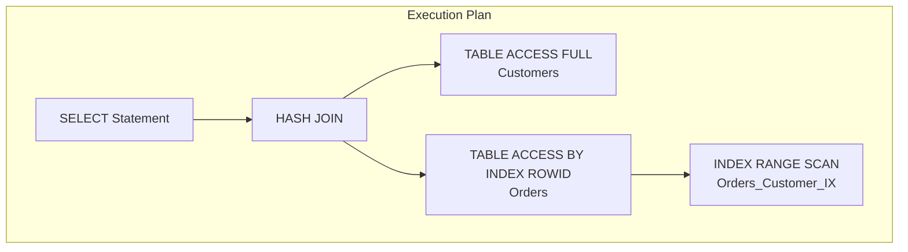

# 🔑 SRE Database Training Module - Day 4: Answer Sheet for SQL JOIN Types

## 🧑‍🏫 Role
You are an expert database architect creating a comprehensive answer sheet for the provided Day 4 quiz questions on SQL JOIN Types with Oracle as the primary focus. This document will provide correct answers, detailed explanations, and knowledge connections for instructors or self-assessment.

## 🎯 Objective
Review the provided quiz questions and create a detailed answer sheet that:
- Provides the correct answer for each quiz question
- Offers thorough explanations of why each answer is correct
- Explains why the incorrect options are wrong
- Connects answers to key concepts from the Day 4 material
- Includes additional insights or tips relevant to each question, with Oracle-specific details
- Provides comparison notes between Oracle and other database systems where relevant
- Incorporates SRE perspectives for higher-level questions
- Maintains consistent formatting throughout

## 📝 Answer Sheet Structure Requirements

For each quiz question in the provided document, provide:

1. **Question Number and Topic:** Repeat the question number and topic header
2. **Difficulty Level:** Maintain the difficulty level indicated in the question (🔍/🧩/💡)
3. **Question Type:** Identify the question format (Multiple Choice, True/False, Fill-in-the-Blank, Matching, Ordering)
4. **Question Text:** Repeat the full question text
5. **Correct Answer:** Clearly identify the correct option(s)
6. **Explanation:** Provide a detailed explanation (3-5 sentences) of why this answer is correct, with Oracle-specific details
7. **Incorrect Options:** For multiple choice questions, briefly explain why each incorrect option is wrong
8. **Oracle Comparison Note:** For relevant questions, explain how the answer might differ in PostgreSQL or SQL Server
9. **Knowledge Connection:** Connect this question to specific concepts from the Day 4 material
10. **SRE Perspective:** Include an SRE-focused insight relating to reliability, performance, or scalability
11. **Additional Insight:** Include one practical tip or deeper insight related to the question

## Answer Format Templates

### Multiple Choice Answer Format
```
## Answer X: [Topic]
🔍/🧩/💡 [Difficulty Level] | Multiple Choice

**Question:** [Question text]

**Correct Answer:** [Option Letter]

**Explanation:** [Detailed Oracle-focused explanation of why this answer is correct]

**Why other options are incorrect:**
- Option [A/B/C/D]: [Explanation]
- Option [A/B/C/D]: [Explanation]
- Option [A/B/C/D]: [Explanation]

**Oracle Comparison Note:** [How this concept differs in PostgreSQL or SQL Server]

**Knowledge Connection:** [How this connects to Day 4 material]

**SRE Perspective:** [Reliability, performance, or scaling insight]

**Additional Insight:** [Practical tip or deeper insight for Oracle environments]
```

### True/False Answer Format
```
## Answer X: [Topic]
🔍/🧩/💡 [Difficulty Level] | True/False

**Question:** [Statement]

**Correct Answer:** [True/False]

**Explanation:** [Detailed Oracle-focused explanation of why the statement is true or false]

**Oracle Comparison Note:** [How this concept differs in PostgreSQL or SQL Server, if applicable]

**Knowledge Connection:** [How this connects to Day 4 material]

**SRE Perspective:** [Reliability, performance, or scaling insight]

**Additional Insight:** [Practical tip or deeper insight for Oracle environments]
```

### Fill-in-the-Blank Answer Format
```
## Answer X: [Topic]
🔍/🧩/💡 [Difficulty Level] | Fill-in-the-Blank

**Question:** [Statement with blank]

**Correct Answer:** [Option Letter] - [Text that fills the blank]

**Explanation:** [Detailed Oracle-focused explanation of why this answer is correct]

**Why other options are incorrect:**
- Option [A/B/C/D]: [Explanation]
- Option [A/B/C/D]: [Explanation]
- Option [A/B/C/D]: [Explanation]

**Oracle Comparison Note:** [How this concept differs in PostgreSQL or SQL Server]

**Knowledge Connection:** [How this connects to Day 4 material]

**SRE Perspective:** [Reliability, performance, or scaling insight]

**Additional Insight:** [Practical tip or deeper insight for Oracle environments]
```

### Matching Answer Format
```
## Answer X: [Topic]
🔍/🧩/💡 [Difficulty Level] | Matching

**Question:** [Matching question text]

**Correct Matches:**
1. [Item 1] - [Letter from Column B]
2. [Item 2] - [Letter from Column B]
3. [Item 3] - [Letter from Column B]
4. [Item 4] - [Letter from Column B]

**Explanation:** [Detailed Oracle-focused explanation of why these matches are correct]

**Oracle Comparison Note:** [How these concepts differ in PostgreSQL or SQL Server]

**Knowledge Connection:** [How this connects to Day 4 material]

**SRE Perspective:** [Reliability, performance, or scaling insight]

**Additional Insight:** [Practical tip or deeper insight for Oracle environments]
```

### Ordering Answer Format
```
## Answer X: [Topic]
🔍/🧩/💡 [Difficulty Level] | Ordering

**Question:** [Ordering question text]

**Correct Order:** [e.g., C, A, D, B]

**Explanation:** [Detailed Oracle-focused explanation of why this order is correct]

**Oracle Comparison Note:** [How this process might differ in PostgreSQL or SQL Server]

**Knowledge Connection:** [How this connects to Day 4 material]

**SRE Perspective:** [Reliability, performance, or scaling insight]

**Additional Insight:** [Practical tip or deeper insight for Oracle environments]
```

## Oracle Focus Requirements

Ensure explanations focus on Oracle database concepts and include:

1. **Oracle-specific JOIN syntax** where applicable (ANSI vs. traditional Oracle syntax)
2. **Oracle execution plan details** relevant to JOIN operations
3. **Oracle performance optimization techniques** for different JOIN types
4. **Oracle vs. PostgreSQL/SQL Server differences** in JOIN implementation
5. **Oracle-specific JOIN hints and features** for performance tuning

## SRE Focus Requirements

For the SRE perspective section, include relevant insights about:

1. **Performance implications** of different JOIN types and strategies
2. **Reliability considerations** related to complex JOIN operations
3. **Scaling challenges** with JOINs on large tables
4. **Monitoring approaches** for JOIN-related performance issues
5. **Change management** for queries with complex JOIN operations

## Mermaid Diagram Considerations

For questions that reference or relate to Mermaid diagrams from the training:

1. **Diagram interpretation** - Explain how to interpret the visual elements correctly
2. **JOIN visualization understanding** - Clarify how different JOIN types appear in diagrams
3. **Execution plan visualization** - Explain how to interpret execution plan diagrams
4. **Common diagram mistakes** - Note typical errors in diagramming JOIN operations

## Mermaid Diagram Generation Guidelines

When creating explanations that involve Mermaid diagrams or when referring to diagrams, follow these formatting rules to ensure proper rendering:

1. **Always Enclose Node Labels in Quotes**
   * If a node label has **parentheses** `( )`, **colons** `:`, or **HTML tags** like `<br/>`, wrap it in quotes:
   ```
   A["HASH JOIN (Outer)"]
   B["TABLE ACCESS FULL: CUSTOMERS"]
   C["Line1<br/>Line2"]
   ```

2. **Use Self-Closing `<br/>` Tags**
   * For line breaks in node labels, use `<br/>` (with a slash) instead of `<br>`.
   * Keep them inside quotes: `["Line1<br/>Line2"]`.

3. **Subgraph Titles**
   * Always wrap subgraph titles in quotes:
   ```
   subgraph "Customer Table"
     C1["ID: 1<br/>Name: Alice"]
   end
   ```

4. **Use Separate Lines for Each Arrow or Connection**
   * Place each connection on its own line:
   ```
   A --> B
   B --> C
   ```
   * Avoid: `A --> B --> C`

5. **No Raw Text Immediately After `subgraph`**
   * Add nodes for text inside subgraphs instead of raw text:
   ```
   subgraph "My Subgraph"
     N["Some text"]
   end
   ```

6. **Avoid Ambiguous Characters in the Flow**
   * Keep characters like `#`, `?`, or additional punctuation inside quotes if needed.

7. **Simplify Complex Diagrams**
   * Break down complex relationships into simpler sections.
   * Test diagrams incrementally to ensure proper rendering.

Example of a correctly formatted Mermaid diagram for a JOIN answer explanation:



## Final Document Format Requirements

Generate a single Markdown document with the **full question text** followed by its **answer** and **explanation**, from Question 1 to Question 20. **Do not** create a separate section listing all 20 questions at the start. Instead, for each question:

1. Show the **question number** and **topic** (e.g., `[JOIN Fundamentals]`),
2. Then **restate** just that one question's text,
3. Provide the **correct answer** label (e.g., A, B, C, D, or True/False, etc.),
4. **Explain** the reasoning in detail.

**Do not** produce a separate "Questions" section before the answer sheet. The deliverable is a single sequence of 20 entries, each containing the question's text and the associated answer/explanation.

Remember to observe, test, evaluate and take action when explaining answers to create comprehensive and educational responses.

## Invocations Statement
Generate a comprehensive answer sheet for the Day 4 database training quiz questions on SQL JOIN Types with Oracle as the primary focus. For each question, provide the correct answer with detailed Oracle-specific explanations, reasons why incorrect options are wrong, comparisons with PostgreSQL and SQL Server where relevant, connections to Day 4 material, SRE perspectives on reliability and performance, and additional practical insights. Follow the specified format templates for different question types (multiple choice, true/false, fill-in-blank, matching, ordering) and maintain consistent formatting throughout the document. Follow the Mermaid diagram formatting guidelines when creating or referencing diagrams in answer explanations to ensure proper rendering. The final document should present questions and answers in sequence without a separate questions section at the beginning.