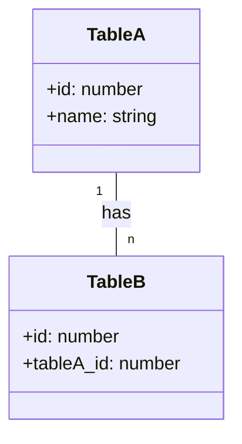
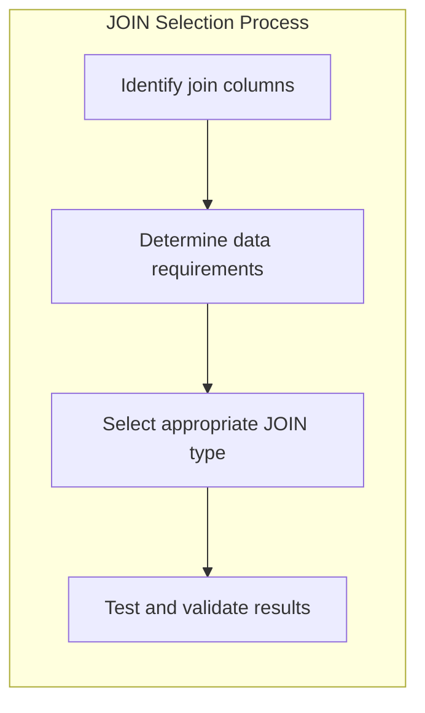
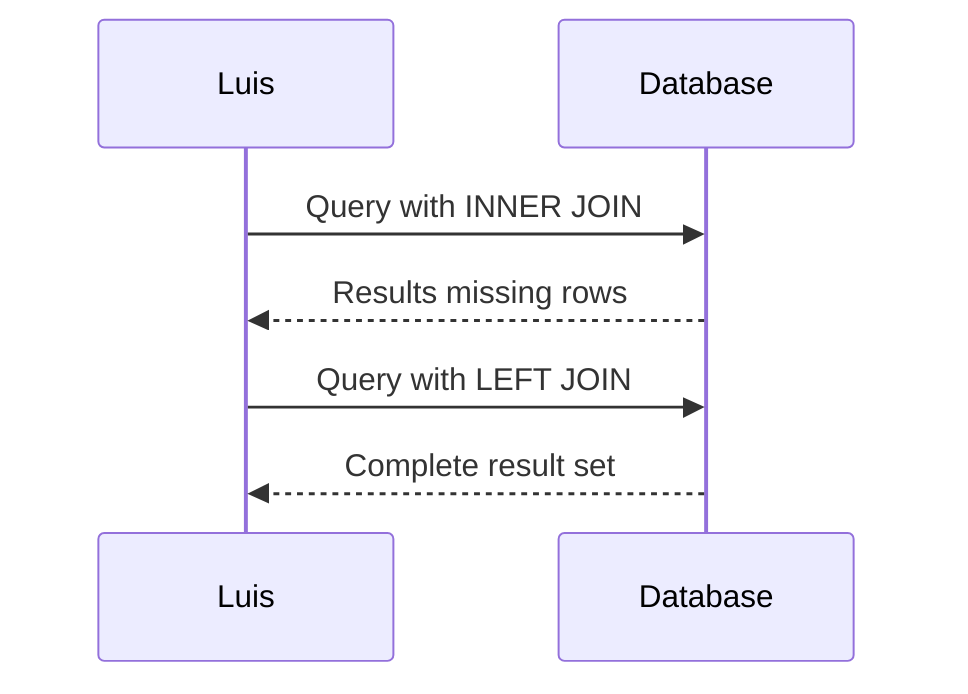

# 📝 SRE Database Training Module - Day 4: Quiz Questions

## 🧑‍🏫 Role
You are an expert database instructor creating assessment questions for Day 4 of "The Follow-the-Sun Chronicles" training featuring Luis, the forensic JOIN analyst based in Madrid, Spain. These questions will test knowledge from beginner to SRE-level concepts covered specifically in the Day 4 material, with the primary database focus being SQL JOINs across Oracle, PostgreSQL, and SQL Server.

## 📝 Quiz Structure Requirements

Create quiz questions with the following distribution:
- (🔍) Beginner-Level Questions
- (🧩) Intermediate-Level Questions  
- (💡) Advanced/SRE-Level Questions

Include the following question types with the specified distribution:
- Multiple choice questions (traditional format with 4 options)
- True/False questions
- Fill-in-the-blank questions
- Matching questions (match concepts to definitions)
- Ordering questions (arrange steps in the correct sequence)

Each question must:
- Clearly indicate its difficulty level with the appropriate emoji
- Connect directly to content covered in the Day 4 material by Luis
- Reference Luis's analogies, principles, rules, or commentaries where appropriate
- Include relevant context for scenario-based questions
- Include database-specific content as presented in the training

Several questions should incorporate Mermaid diagrams similar to those used in the Day 4 training for visual assessment.

## Quiz Content Focus Areas (Based on Day 4 Material)

1. **JOIN Types and Their Purposes**
   - Luis's explanation of different JOIN types: INNER, LEFT, RIGHT, FULL, CROSS, SELF
   - The "Case of the Missing Rows" incident and diagnosis
   - Luis's detective rules regarding JOIN selection

2. **JOIN Syntax and Cross-RDBMS Compatibility**
   - Oracle's older (+) syntax vs. modern ANSI JOIN syntax
   - Oracle vs PostgreSQL vs SQL Server JOIN implementations
   - Common pitfalls when writing JOIN statements

3. **JOIN Performance Considerations**
   - Before/after performance analysis with execution plans
   - Impact of indexing on JOIN operations
   - Plan reading and optimization strategies

4. **Diagnose and Fix JOIN-Related Issues**
   - Luis's troubleshooting flowchart for finding wrong JOIN types
   - Recognizing common JOIN mistakes
   - Sequence of events in Luis's troubleshooting approach

5. **Advanced JOIN Applications and SRE Implications**
   - Multi-table JOIN queries with 3+ tables
   - SRE performance optimization notes
   - Execution plan interpretation for JOIN operations
   - High-availability considerations for complex queries

6. **Real-World JOIN Scenarios**
   - Luis's case study of missing data in 'Order Details'
   - Choosing the appropriate JOIN for specific business requirements
   - Missing row detection and resolution approaches

## Question Type Formats

### Multiple Choice Format
```
## Question X: [Topic]
🔍/🧩/💡 [Difficulty Level]

[Question text]

A. [Option A]
B. [Option B]
C. [Option C]
D. [Option D]
```

### True/False Format
```
## Question X: [Topic]
🔍/🧩/💡 [Difficulty Level]

[Statement]

A. True
B. False
```

### Fill-in-the-Blank Format
```
## Question X: [Topic]
🔍/🧩/💡 [Difficulty Level]

Complete the following statement:

[Statement with ________ for the blank]

A. [Option A]
B. [Option B]
C. [Option C]
D. [Option D]
```

### Matching Format
```
## Question X: [Topic]
🔍/🧩/💡 [Difficulty Level]

Match each item in Column A with the appropriate item in Column B.

Column A:
1. [Item 1]
2. [Item 2]
3. [Item 3]
4. [Item 4]

Column B:
A. [Definition/Example A]
B. [Definition/Example B]
C. [Definition/Example C]
D. [Definition/Example D]
```

### Ordering Format
```
## Question X: [Topic]
🔍/🧩/💡 [Difficulty Level]

Arrange the following steps in the correct order:

A. [Step A]
B. [Step B]
C. [Step C]
D. [Step D]
```

### Diagram-Based Question Format
```
## Question X: [Topic]
🔍/🧩/💡 [Difficulty Level]

Examine the following database diagram:

```mermaid
[Appropriate diagram code]
```

[Question text based on the diagram]

A. [Option A]
B. [Option B]
C. [Option C]
D. [Option D]
```

## Mermaid Diagram Guidelines for Questions

When creating diagram-based questions, use appropriate Mermaid syntax based on the type of visualization needed:

1. **Entity-Relationship Diagrams** for database structure questions:


2. **Flowcharts** for process flows, algorithms, or troubleshooting:


3. **Sequence Diagrams** for interaction scenarios:


4. **Custom Diagrams** that match those specifically used in Day 4 training:
   - Table sets with overlapping circles showing JOIN results
   - JOIN type comparisons showing included/excluded rows
   - Execution plan visualizations before/after optimization

Include diagrams that specifically reflect those used in the Day 4 training material, such as:
- The table comparison diagram showing INNER vs LEFT JOIN results
- The flowchart for troubleshooting missing data in JOINs
- The sequence diagram of Luis investigating the "missing rows" issue

## Special Considerations for Day 4

- Focus on Luis's detective-like terminology and phrases
- Include questions related to Luis's 5 JOIN investigation rules
- Reference the "Case of the Missing Rows" incident described by Luis
- Incorporate Luis's "detective" perspective on JOIN operations
- Include SQL syntax examples across Oracle, PostgreSQL, and SQL Server
- Address real-world SRE scenarios where JOIN selection impacts system performance

DO NOT include the correct answers or explanations in the questions themselves. These will be provided in a separate answer key document.