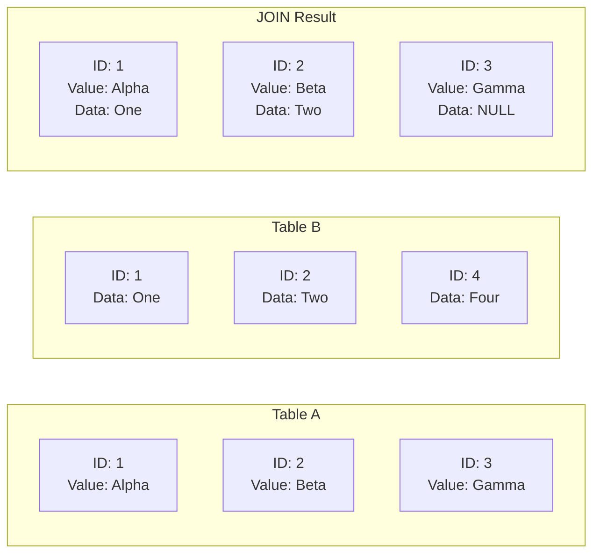

# 📝 SRE Database Training Module - Day 4: Quiz Questions on SQL JOIN Types with Oracle Focus

## 🧑‍🏫 Role
You are an expert database architect creating assessment questions for a Day 4 training module on SQL JOIN Types. These questions will test knowledge from beginner to advanced/SRE-level concepts covered in the Day 4 material, with Oracle as the primary database focus.

## 🎯 Objective
Create a comprehensive set of quiz questions that:
- Tests understanding of the purpose and syntax of different JOIN types
- Assesses knowledge of when to use each JOIN type for specific scenarios
- Evaluates understanding of JOIN performance implications in Oracle environments
- Provides progressive difficulty across all three learning levels
- Includes a variety of question types and formats
- Tests awareness of Oracle-specific JOIN syntax and optimization techniques

## 📝 Quiz Structure Requirements

Create exactly 20 quiz questions with the following distribution:
- 7 Beginner-level questions (🔍)
- 7 Intermediate-level questions (🧩)
- 6 Advanced/SRE-level questions (💡)

Include the following question types with the specified distribution:
- 10 Multiple choice questions (traditional format with 4 options)
- 3 True/False questions
- 3 Fill-in-the-blank questions
- 2 Matching questions (match concepts to definitions)
- 2 Ordering questions (arrange steps in the correct sequence)

Each question must:
- Clearly indicate its difficulty level with the appropriate emoji
- Connect directly to content covered in the Day 4 material
- Be clearly written and unambiguous
- Include relevant context for scenario-based questions
- Include Oracle-specific content where appropriate

## Question Type Formats

### Multiple Choice Format
```
## Question X: [Topic]
🔍/🧩/💡 [Difficulty Level]

[Question text]

A. [Option A]

B. [Option B]

C. [Option C]

D. [Option D]
```

### True/False Format
```
## Question X: [Topic]
🔍/🧩/💡 [Difficulty Level]

[Statement]

A. True

B. False
```

### Fill-in-the-Blank Format
```
## Question X: [Topic]
🔍/🧩/💡 [Difficulty Level]

Complete the following statement:

[Statement with ________ for the blank]

A. [Option A]

B. [Option B]

C. [Option C]

D. [Option D]
```

### Matching Format
```
## Question X: [Topic]
🔍/🧩/💡 [Difficulty Level]

Match each item in Column A with the appropriate item in Column B.

Column A:
1. [Item 1]
2. [Item 2]
3. [Item 3]
4. [Item 4]

Column B:
A. [Definition/Example A]
B. [Definition/Example B]
C. [Definition/Example C]
D. [Definition/Example D]
```

### Ordering Format
```
## Question X: [Topic]
🔍/🧩/💡 [Difficulty Level]

Arrange the following steps in the correct order:

A. [Step A]

B. [Step B]

C. [Step C]

D. [Step D]
```

## Quiz Content Focus Areas

1. **JOIN Fundamentals**
   - Purpose of JOIN operations
   - Relationship between foreign keys and JOINs
   - Basic JOIN syntax in Oracle
   - Difference between traditional Oracle and ANSI JOIN syntax

2. **JOIN Types**
   - INNER JOIN (purpose, syntax, result sets)
   - LEFT OUTER JOIN (purpose, syntax, result sets)
   - RIGHT OUTER JOIN (purpose, syntax, result sets)
   - FULL OUTER JOIN (purpose, syntax, result sets)
   - CROSS JOIN / Cartesian Product (purpose, syntax, result sets)
   - SELF JOIN (purpose, syntax, use cases)

3. **JOIN Performance and Optimization**
   - Index impact on JOIN performance
   - Join order considerations
   - Execution plan analysis for JOIN operations
   - Oracle-specific optimization techniques
   - Common JOIN performance issues and solutions

4. **Multiple-Table JOINs**
   - Syntax for joining three or more tables
   - Join order significance
   - Performance considerations
   - Common use cases

5. **JOIN Selection and Application**
   - Choosing the appropriate JOIN type for specific scenarios
   - Converting business requirements to JOIN operations
   - Common JOIN patterns and anti-patterns
   - Oracle-specific JOIN considerations

## Question Distribution Requirements

Ensure a good distribution of questions across:
- All JOIN types covered in Day 4
- Different cognitive levels (recall, understanding, application, analysis)
- Oracle-specific vs. general relational database concepts
- SQL syntax vs. conceptual understanding
- Performance considerations vs. functionality

## Mermaid Diagram Generation Guidelines

When creating questions that involve Mermaid diagrams or when referring to diagrams from the training, follow these formatting rules to ensure proper rendering:

1. **Always Enclose Node Labels in Quotes**
   * If a node label has **parentheses** `( )`, **colons** `:`, or **HTML tags** like `<br/>`, wrap it in quotes:
   ```
   A["HASH JOIN (Outer)"]
   B["TABLE ACCESS FULL: CUSTOMERS"]
   C["Line1<br/>Line2"]
   ```

2. **Use Self-Closing `<br/>` Tags**
   * For line breaks in node labels, use `<br/>` (with a slash) instead of `<br>`.
   * Keep them inside quotes: `["Line1<br/>Line2"]`.

3. **Subgraph Titles**
   * Always wrap subgraph titles in quotes:
   ```
   subgraph "Customer Table"
     C1["ID: 1<br/>Name: Alice"]
   end
   ```

4. **Use Separate Lines for Each Arrow or Connection**
   * Place each connection on its own line:
   ```
   A --> B
   B --> C
   ```
   * Avoid: `A --> B --> C`

5. **No Raw Text Immediately After `subgraph`**
   * Add nodes for text inside subgraphs instead of raw text:
   ```
   subgraph "My Subgraph"
     N["Some text"]
   end
   ```

6. **Avoid Ambiguous Characters in the Flow**
   * Keep characters like `#`, `?`, or additional punctuation inside quotes if needed.

7. **Simplify Complex Diagrams**
   * Break down complex relationships into simpler sections.
   * Test diagrams incrementally to ensure proper rendering.

Example of a correctly formatted Mermaid diagram for a JOIN question:



Consider including questions that ask learners to identify:
1. Which JOIN type produced a particular result set (shown in a diagram)
2. What the result set would look like for a specific JOIN type
3. Which execution plan diagram represents the most efficient approach

When creating diagram-based questions, ensure the diagrams are simple enough to be easily interpreted while still testing relevant JOIN concepts.

DO NOT include the correct answers or explanations in the questions themselves. These will be provided in a separate answer key document.

## Invocations Statement
Generate a comprehensive set of 20 quiz questions to assess knowledge of Day 4 database training content focused on SQL JOIN Types with an Oracle focus. Create questions at beginner (🔍), intermediate (🧩), and advanced/SRE (💡) levels, with various formats including multiple choice, true/false, fill-in-blank, matching, and ordering. Focus on JOIN fundamentals, different JOIN types (INNER, LEFT, RIGHT, FULL, CROSS, SELF), JOIN performance optimization, multiple-table JOINs, and JOIN selection for specific scenarios. Ensure all questions are clearly written, unambiguous, and directly relevant to the Day 4 material, with Oracle-specific content where appropriate. Follow the Mermaid diagram formatting guidelines when creating or referencing diagrams in questions to ensure proper rendering.