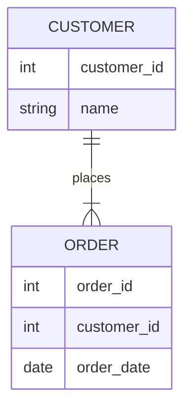
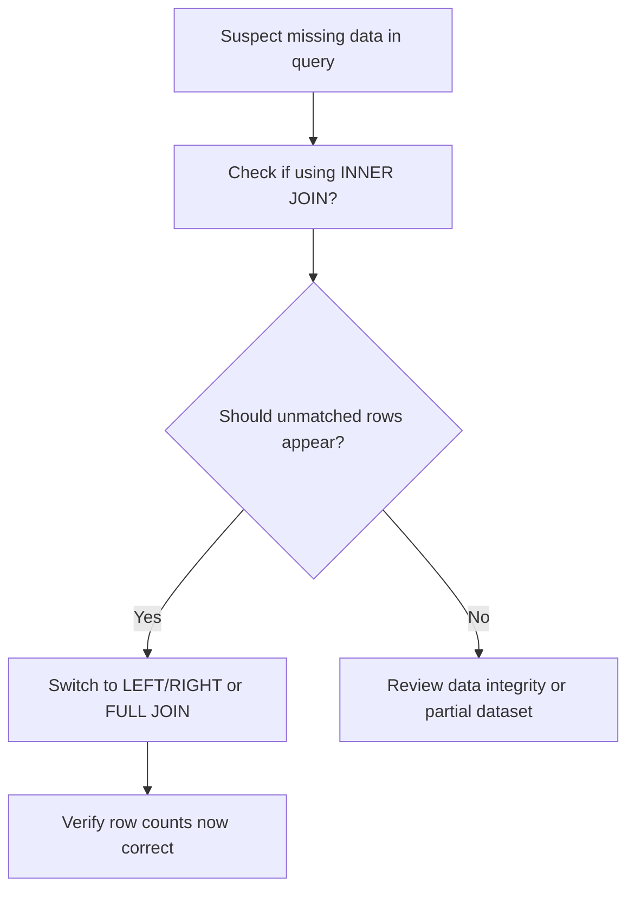
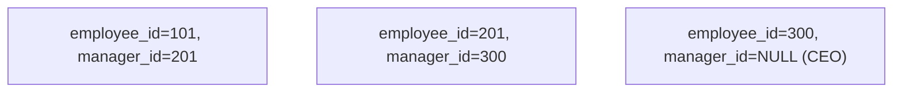

# **Day 4 Quiz**

## **(🔍) Beginner-Level Questions**

---

### **Question 1 (🔍, Multiple Choice)**
**Topic:** JOIN Basics / Case of the Missing Rows

Luis uncovered a “missing rows” mystery where an **INNER JOIN** caused data to vanish. Which statement best describes why rows may disappear in an INNER JOIN?

A. Inner joins exclude rows that lack a matching key in the other table  
B. Inner joins automatically generate extra NULL rows for unmatched data  
C. Inner joins fill columns with default values if a match is not found  
D. Inner joins dynamically create a CROSS product of all table rows  

---

### **Question 2 (🔍, True/False)**
**Topic:** INNER vs. LEFT JOIN

Luis says if your query discards rows without matching data, you might need a **LEFT JOIN** instead. True or false: A LEFT JOIN always excludes rows from the left table if there’s no match in the right table.

A. True  
B. False  

---

### **Question 3 (🔍, Multiple Choice)**
**Topic:** CROSS JOIN Footgun

According to Luis, the **CROSS JOIN** can be dangerous if used by accident. Why?

A. It merges only matching rows, hiding unmatched data  
B. It quickly becomes a Cartesian product, multiplying all rows from both tables  
C. It permanently locks both tables in exclusive mode  
D. It forbids the use of any WHERE clause  

---

### **Question 4 (🔍, Fill-in-the-Blank)**
**Topic:** Luis’s Rule #3

Complete the following statement about **FULL OUTER JOIN** from Luis’s detective handbook:

> “Use a FULL OUTER JOIN only if you truly need *all* rows from both sides, because it can produce ________ result sets if each table has many unmatched rows.”

A. unindexed  
B. minimal  
C. enormous  
D. partial  

---

### **Question 5 (🔍, Matching)**
**Topic:** JOIN Type Purposes

Match each JOIN type in Column A to Luis’s short description in Column B.

Column A:  
1. INNER JOIN  
2. LEFT OUTER JOIN  
3. FULL OUTER JOIN  
4. SELF JOIN  

Column B:  
A. Returns only the matching rows from both tables  
B. Retrieves all rows from both tables, matched or not  
C. Keeps all rows from the left table, with NULLs for unmatched on the right  
D. Joins a table to itself, often for hierarchical data  

---

### **Question 6 (🔍, Multiple Choice)**
**Topic:** Oracle vs. PostgreSQL vs. SQL Server JOIN Syntax

Luis mentions that **ANSI-style JOIN** syntax is widely supported. Which of the following is **not** an ANSI JOIN keyword?

A. INNER  
B. OUTER  
C. CROSS  
D. (+)  

---

### **Question 7 (🔍, Multiple Choice with Diagram)**
**Topic:** Simple ER Diagram for Customers & Orders

Examine the diagram below:



Which JOIN should you use if you want **all customers** to appear, even if they have **no orders** yet?

A. INNER JOIN  
B. LEFT JOIN  
C. RIGHT JOIN  
D. CROSS JOIN  

---

## **(🧩) Intermediate-Level Questions**

---

### **Question 8 (🧩, Multiple Choice)**
**Topic:** Oracle (+) Syntax vs. ANSI JOIN

Luis explains Oracle’s older `(+)` operator for outer joins. Which statement best captures the difference compared to ANSI JOIN?

A. The `(+)` operator is for CROSS JOIN while ANSI is for LEFT/RIGHT/FULL  
B. `(+)` syntax places a plus sign next to columns in the WHERE clause to indicate an outer join  
C. `(+)` operator is always required for inner joins in Oracle  
D. `(+)` syntax is mandatory in modern Oracle for any join involving NULL rows  

---

### **Question 9 (🧩, Fill-in-the-Blank)**
**Topic:** Performance & Indexing

Complete Luis’s statement:

> “If large tables are joined without ________ on the join columns, you may see full table scans or merge joins instead of more efficient nested loops.”

A. triggers  
B. constraints  
C. indexes  
D. foreign keys  

---

### **Question 10 (🧩, Matching)**
**Topic:** JOIN Suspects

Luis calls each JOIN a “suspect with a motive.” Match the description in Column A to the correct JOIN type in Column B.

Column A:  
1. Provides all rows from the right table, with NULL from the left if unmatched  
2. Potentially returns a cartesian product if no condition is given  
3. Let’s you combine a table with itself, referencing hierarchy or manager relationships  
4. Brings in rows only if both tables match on the joining column

Column B:  
A. CROSS JOIN  
B. SELF JOIN  
C. INNER JOIN  
D. RIGHT JOIN  

---

### **Question 11 (🧩, True/False)**
**Topic:** Multi-Table JOIN Logic

Luis warns that referencing three or more tables in a single statement can be tricky. True or false: If you use multiple JOINs in one query, you must place all the ON conditions in a single WHERE clause at the end, not near each JOIN.

A. True  
B. False  

---

### **Question 12 (🧩, Ordering with Diagram)**
**Topic:** Troubleshooting Missing Rows

Consider Luis’s flowchart on diagnosing missing rows:



Arrange these steps in the logical order for finding and fixing a missing row scenario:

A. Decide whether unmatched rows are actually needed  
B. See if the query is using an INNER JOIN  
C. If needed, switch to an outer join type  
D. Confirm row counts are correct after changes  

---

### **Question 13 (🧩, Multiple Choice)**
**Topic:** Oracle Execution Plans for JOINS

When Luis checks an execution plan using `EXPLAIN PLAN` on a multi-table JOIN, which operation typically indicates a **Cartesian** product or CROSS JOIN if no ON clause is specified?

A. `NESTED LOOPS`  
B. `HASH JOIN`  
C. `MERGE JOIN CARTESIAN`  
D. `INDEX RANGE SCAN`  

---

### **Question 14 (🧩, Multiple Choice with Diagram)**
**Topic:** Self JOIN Example

Examine the scenario below:



Which SQL approach best captures a **SELF JOIN** to pair employees with their manager’s data?

A.  
```sql
SELECT e.name, m.name AS manager
FROM employees e
JOIN employees m
   ON e.manager_id = m.employee_id;
```

B.  
```sql
SELECT e.name, m.name AS manager
FROM employees e
FULL OUTER JOIN employees m
   ON e.employee_id = m.manager_id;
```

C.  
```sql
SELECT e.name, m.name AS manager
FROM employees e, employees m;
```

D.  
```sql
SELECT e.name
FROM employees e
WHERE e.manager_id = NULL;
```  

---

## **(💡) Advanced/SRE-Level Questions**

---

### **Question 15 (💡, Multiple Choice)**
**Topic:** Multi-Table Join Performance

When dealing with three or more large tables, which practice best improves performance **before** considering partial denormalization?

A. Converting every join to CROSS JOIN for simplicity  
B. Randomly adding indexes on all columns in each table  
C. Using appropriate composite or single-column indexes on join keys and frequently filtered columns  
D. Removing constraints to speed up any potential overhead  

---

### **Question 16 (💡, True/False)**
**Topic:** Plan Reading & SRE Tactics

Luis says you can see **MERGE JOIN** or **HASH JOIN** in Oracle’s plan output. True or false: If you see `MERGE JOIN CARTESIAN`, it often implies an accidental CROSS JOIN or missing ON condition.

A. True  
B. False  

---

### **Question 17 (💡, Multiple Choice)**
**Topic:** Execution Plan Comparison

Luis compares a pre-index scenario with a post-index scenario. Which outcome typically indicates a more efficient plan after adding indexes to join columns?

A. The plan still shows `FULL TABLE SCAN` on both tables  
B. The plan changes to `CARTESIAN` due to missing ON condition  
C. The plan uses `NESTED LOOPS` or `HASH JOIN` with indexed lookups  
D. The plan reverts to older Oracle `(+)` syntax  

---

### **Question 18 (💡, Matching)**
**Topic:** JOIN Performance Hints

Match each scenario in Column A to the recommended approach in Column B, based on Luis’s SRE-level tips.

Column A:
1. Identical join columns have an index, but queries remain slow with large data sets  
2. The execution plan shows a suspicious `MERGE JOIN CARTESIAN` operation  
3. You see full table scans on 3+ joined tables with minimal filtering  
4. A CROSS JOIN is actually needed for a test data scenario

Column B:
A. Confirm all needed columns have indexes and consider query rewrites/hints  
B. Accept it if intended, but partition or limit data to avoid meltdown  
C. Possibly missing ON conditions or incomplete join logic  
D. Evaluate whether better filters or partial denormalization can reduce the dataset  

---

### **Question 19 (💡, Fill-in-the-Blank)**
**Topic:** SRE Approach to JOIN Reliability

Complete this statement from Luis:

> “When debugging production JOIN slowness, always check the ________ to confirm if your query is hitting indexes or scanning entire tables, which might cause major slowdowns.”

A. table triggers  
B. session concurrency levels  
C. execution plan  
D. user privileges  

---

### **Question 20 (💡, Ordering)**
**Topic:** Complex JOIN Troubleshooting Flow

Luis’s advanced approach for a multi-join slowdown typically follows these steps:

A. Inspect `EXPLAIN PLAN` or `V$SQL` to see join methods  
B. Identify if any join lacks a proper ON condition  
C. Confirm all relevant columns are indexed  
D. Consider rewriting or partial denormalization only if necessary  

Arrange these actions in the recommended sequence when diagnosing complex JOIN issues in a production environment.

---

**End of Day 4 Quiz** – No answers or solutions are included.