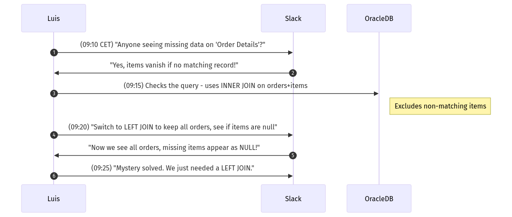

# **The Follow-the-Sun Chronicles: Day 4 – Luis & The Case of the Missing Rows**

> **Character Profile**  
> - **Name**: Luis  
> - **Location**: Madrid, Spain (09:00 CET)  
> - **Role**: Incident responder, forensic JOIN analyst  
> - **Personality**: Cool-headed, detective-like, slightly annoyed by inefficient JOINs and missing indexes

---

## **1. The Incident Vignette: Missing Data on “Order Details”**

It’s **09:00 CET** in Madrid. A frantic Slack message from an engineer: *“The ‘Order Details’ screen is missing entire rows—some orders appear without line items!”* I, Luis, pop open a query trace. Within minutes, I find it: an **INNER JOIN** between `orders` and `order_items` is silently excluding any items not perfectly matched. The developer intended a **LEFT JOIN**. Classic mistake.

Welcome to Day 4: *SQL JOINs.* Let’s solve the “Case of the Missing Rows,” uncover each JOIN suspect, and identify how to keep your queries from either *losing* data or *causing meltdown* with monstrous Cartesian products.

---

## **2. Day 4 Overview (Luis’s Detective Agenda)**

### 🔍 **Beginner Goals**

1. **Identify** major JOIN types: INNER, LEFT, RIGHT, FULL, CROSS, SELF.  
2. **Explain** how JOINs reassemble data across multiple tables in Oracle.  
3. **Write** simple ANSI-style JOINs (`INNER`, `LEFT`).  
4. **Recognize** when a missing row suggests the wrong JOIN type.

### 🧩 **Intermediate Goals**

1. **Compare** Oracle’s older `(+)` syntax vs. modern **ANSI** JOIN.  
2. **Construct** multi-table JOIN queries, merging 3 or more tables.  
3. **Apply** `RIGHT OUTER` and `FULL OUTER` joins appropriately.  
4. **Address** performance via indexing, plan checking, and small rewrites.

### 💡 **Advanced/SRE Goals**

1. **Interpret** execution plans for complex JOINs in Oracle.  
2. **Optimize** multi-table queries with indexes and hints.  
3. **Troubleshoot** big JOIN bottlenecks using AWR/ASH.  
4. **Ensure** reliability and performance in critical, high-throughput environments.

> **Luis’s Note**: “Thoroughness is key. The difference between an `INNER` or `LEFT` can spell the difference between correct data or invisible rows.”

---

## **3. The JOIN Suspects: Types and Motives**

We’ll dissect each JOIN type like a detective interrogates suspects: purpose, common pitfalls, performance traps, and a real-world SRE spin.

Here’s **Luis’s Detective Handbook: The JOIN Suspects**:

| **JOIN Type** | **Returns**               | **Common Use Case**               | **Danger**                        |
|---------------|---------------------------|-----------------------------------|-----------------------------------|
| **INNER**     | Only matching rows       | Reports/data must exist in both   | Hides missing data                |
| **LEFT OUTER**| All from left, matches on right | Audit scenarios, optional references | Expect lots of NULLs             |
| **FULL OUTER**| All rows from both tables| Full sync comparisons             | Potential large result sets       |
| **CROSS**     | Cartesian product        | Test data generation              | A footgun if used by accident     |
| **SELF**      | Table joined to itself   | Org charts, hierarchical data     | Recursively tricky, easy to bloat |

---

### 3.1 INNER JOIN: The Exclusive Party

**Analogy**: “Invite list” – only those on both tables’ lists are admitted.


**SQL Examples**  
- **Oracle (ANSI)**:
  ```sql
  SELECT A.*, B.*
  FROM A
  INNER JOIN B ON A.id = B.id;
  ```
- **PostgreSQL/SQL Server**: Same syntax.

**Common Mistake**: People complaining about “disappearing rows” if any row from table A lacks a matching row in B.

> **Luis’s Rule #1**  
> ```
> 🔎 Luis's Rule #1: 
> Always confirm you want to exclude unmatched rows. If some are “missing,” maybe try LEFT JOIN.
> ```

---

### 3.2 LEFT OUTER JOIN: The One That Doesn’t Exclude

**Analogy**: “The left table keeps all suspects, while the right table data is optional.”


**SQL Example**  
```sql
SELECT L.*, R.*
FROM LeftTable L
LEFT JOIN RightTable R
   ON L.id = R.id;
```

**SRE Use**: Perfect for listing all employees (left) with optional department data.

> **Luis’s Rule #2**  
> ```
> 🔎 Luis's Rule #2:
> If you suspect data is lost via INNER JOIN, try a LEFT JOIN – it might reveal unmatched “ghost rows.”
> ```

---

### 3.3 RIGHT OUTER JOIN: The Mirror

**Analogy**: “The same as LEFT, but reversed – keep everything on the right table, optionally matched from left.”

**SQL**  
```sql
SELECT L.*, R.*
FROM LeftTable L
RIGHT JOIN RightTable R 
   ON L.id = R.id;
```
**Luis’s Commentary**: “It’s less common; usually flipping table order + LEFT is easier. But use it if it suits your logic.”

---

### 3.4 FULL OUTER JOIN: All Rows, All Sides

**Analogy**: “You gather all puzzle pieces from both sets—some fit, some don’t. Keep them all anyway.”


**SQL**  
```sql
SELECT A.*, B.*
FROM A
FULL OUTER JOIN B
   ON A.id = B.id;
```

**Performance Danger**: Potentially huge result sets if both sides have distinct unmatched rows.

> **Luis’s Rule #3**  
> ```
> 🔎 Luis's Rule #3:
> FULL OUTER JOIN can be a heavy operation. Only do it if you truly need *all* unmatched rows from both sides.
> ```

---

### 3.5 CROSS JOIN: The Accidental Explosion

**Analogy**: “Combine every row in A with every row in B, unconditionally.”


**SQL**  
```sql
SELECT A.*, B.*
FROM TableA A
CROSS JOIN TableB B;
```

**Typically**: If A has 1,000 rows, B has 5,000, you get 5,000,000 combos. Could be a meltdown if not intended.

> **Luis’s Rule #4**  
> ```
> 🔎 Luis's Rule #4:
> CROSS JOIN is rarely used outside of test data generation. Accidental CROSS is a cardinal sin.
> ```

---

### 3.6 SELF JOIN: Investigating One Table Against Itself

> “Like a suspect asked to investigate their own accomplices – mind-bending, but sometimes necessary.”

**Analogy**: An org chart where each employee references their manager, who is also an employee.

**Mini Scenario**: A “manager_id” in the `employees` table references another row in `employees`. We might want a list of employees along with their manager’s name.


**SQL Example**  
```sql
SELECT e1.name AS Employee,
       e2.name AS Manager
FROM employees e1
JOIN employees e2
   ON e1.manager_id = e2.employee_id;
```

**Why Intriguing**: “We’re dealing with recursion if we keep climbing up the chain. Performance can degrade if we do repeated self references for hierarchical data.”

> **Luis’s Rule #5**  
> ```
> 🔎 Luis's Rule #5:
> SELF JOIN can get messy fast – check your logic and indexes carefully,
> especially in an org chart or multi-level hierarchy.
> ```

---

## **4. The Performance Analysis: Before/After Investigations**

Let’s do a **before/after** story with actual EXPLAIN PLAN.

### 4.1 Before: Non-Indexed Join Column

```sql
EXPLAIN PLAN FOR
SELECT o.order_id, c.customer_name
FROM orders o
INNER JOIN customers c
   ON o.customer_id = c.customer_id;

SELECT * FROM TABLE(DBMS_XPLAN.DISPLAY);
```

**Plan** (Hypothetical):
```
| Id | Operation          | Name            | Rows  | Bytes  | Cost |
|  0 | SELECT STATEMENT   |                 |  1000 |        |  150 |
|  1 |  MERGE JOIN        |                 |       |        |      |
|  2 |   TABLE ACCESS FULL| ORDERS          |       |        |      |
|  3 |   SORT JOIN        |                 |       |        |      |
|  4 |    TABLE ACCESS FULL CUSTOMERS       | ...
```
**Result**: Full table scans on both `orders` and `customers`, big cost.

**Timing**: Suppose it runs in 10 seconds for large data sets.

---

### 4.2 After: Indexed `customer_id` on Both Tables

We add:
```sql
CREATE INDEX idx_orders_cust ON orders(customer_id);
CREATE INDEX idx_customers_custid ON customers(customer_id);
```
Then re-check plan:

```sql
EXPLAIN PLAN FOR
SELECT o.order_id, c.customer_name
FROM orders o
INNER JOIN customers c
   ON o.customer_id = c.customer_id;

SELECT * FROM TABLE(DBMS_XPLAN.DISPLAY);
```

**New Plan**:
```
| Id | Operation                    | Name                 | Cost |
|  0 | SELECT STATEMENT             |                      |  30  |
|  1 |  NESTED LOOPS                |                      |      |
|  2 |   TABLE ACCESS BY INDEX ROWID| ORDERS               | ...
|  3 |   INDEX RANGE SCAN           | IDX_CUSTOMERS_CUSTID | ...
```

**Timing**: Now it’s 2 seconds or less.

> **Luis’s Explanation**: “By indexing the join column, Oracle can do a nested loop or an efficient hash join with minimal scanning. The difference can be huge for large data sets.”

---

## **5. Troubleshooting Flowchart: Finding the Wrong JOIN**


---

## **6. Luis’s JOIN Investigation Rules Recap**

1.  
   ```
   🔎 Luis's Rule #1: 
   Always confirm your row counts. If “missing” data is a problem, try LEFT instead of INNER.
   ```
2.  
   ```
   🔎 Luis's Rule #2:
   Outer JOINs (LEFT/RIGHT) let unmatched rows appear, but watch out for excessive NULLs.
   ```
3.  
   ```
   🔎 Luis's Rule #3:
   FULL OUTER JOIN returns everything – large sets, complex result. Only use if truly needed.
   ```
4.  
   ```
   🔎 Luis's Rule #4:
   CROSS JOIN is your footgun. Avoid accidental Cartesian meltdown.
   ```
5.  
   ```
   🔎 Luis's Rule #5:
   SELF JOIN can unravel hierarchical logic; index it carefully to avoid repeated scanning fiascos.
   ```

---

## **7. Sequence Diagram: Luis Investigates a JOIN Issue**





---

## **8. SRE Performance Optimization Note**

JOINs directly impact:
- **Execution Plans** (Nested Loops, Hash Joins, Merge Joins).
- **Index Overhead** for DML if we heavily index join columns.
- **Concurrency** under load – large OUTER JOINs can spike CPU, I/O, or cause locking.

**Best Practices**:
1. Keep table stats updated (`DBMS_STATS`) for the Oracle optimizer.  
2. Index frequently joined columns.  
3. Re-check queries if data sets scale or if you see new performance regressions.

---

## **9. Handoff to Jin in South Korea**

That’s **Day 4**: we dived deep into **INNER, LEFT, RIGHT, FULL, CROSS, SELF**. We overcame “missing row” mysteries, saw how indexing can drastically improve performance, and explored the labyrinth of Oracle execution plans. Tomorrow, **Jin** in South Korea takes over for **Day 5** on **SQL Aggregation**—COUNT, SUM, GROUP BY—where your new JOIN knowledge merges seamlessly with multi-table summarization.

**—Luis**, signing off. Don’t let **CROSS JOIN** or the wrong **INNER** vs. **LEFT** trip you up. Check your queries as meticulously as any detective inspects clues!

