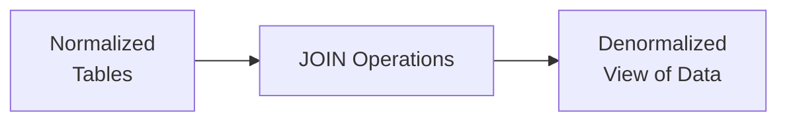
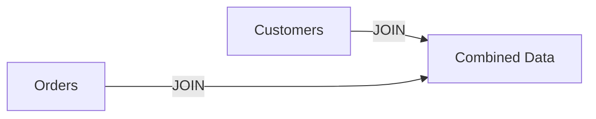
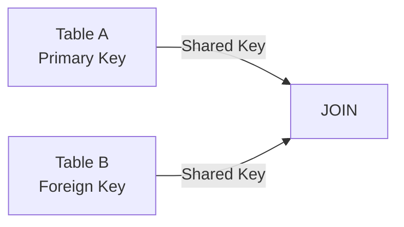
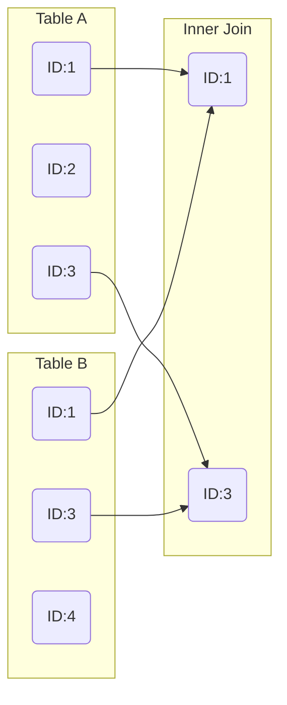
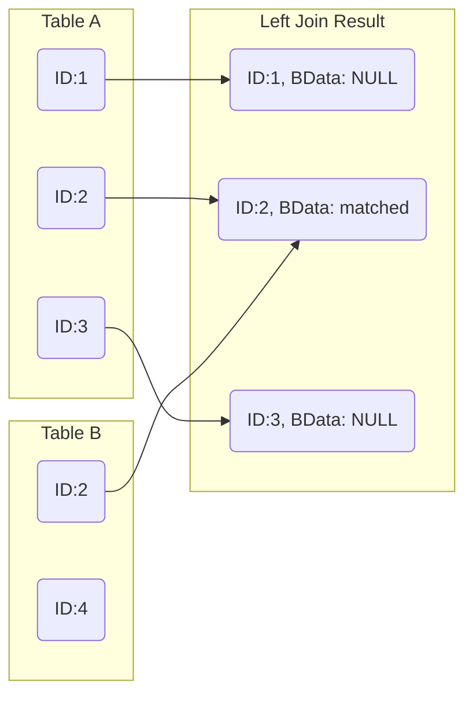
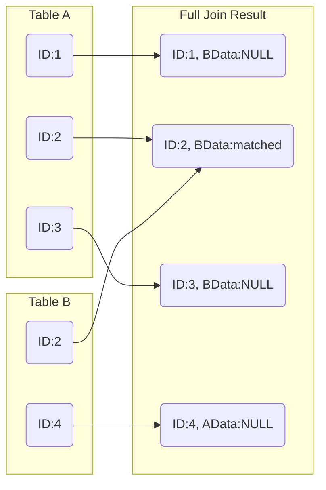
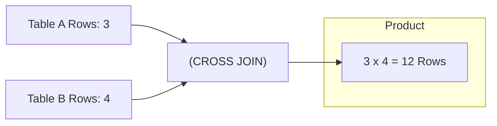
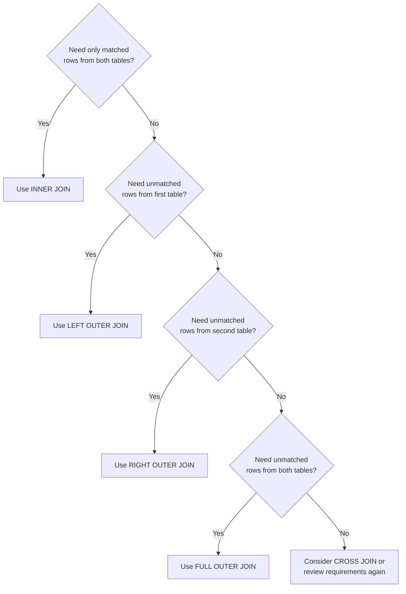
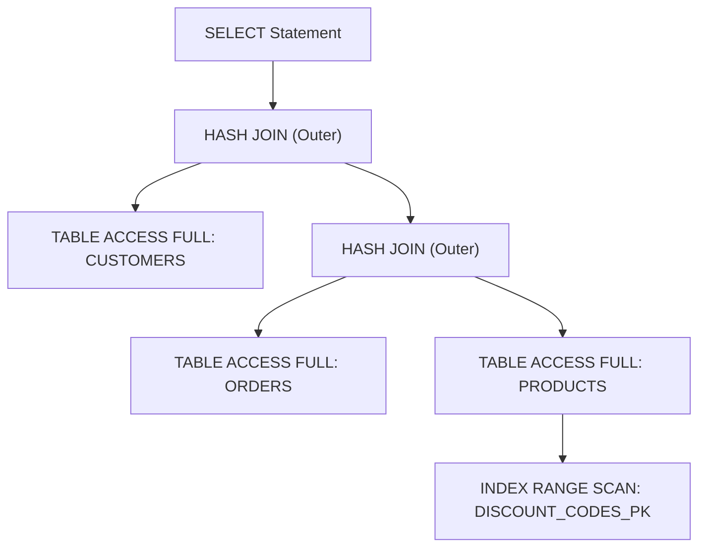

# 🔄 SRE Database Training Module  

## **Day 4: Querying Related Data – SQL JOIN Types (Oracle Focus)**

---

## 📌 Introduction

Welcome back to Day 4 of our SRE Database Training series! Over the last three days, we solidified our understanding of **database design**, **normalization**, and basic **DML operations**. Today, we’re taking a leap forward into the world of **SQL JOINs**, a critical concept that allows you to work with **related data** across multiple tables.  

### Why Do JOINs Matter?

- **Data Relationships:** In a normalized design, data is spread across multiple tables, and JOINs let us combine that data logically.
- **Denormalized Views:** JOINs allow us to retrieve data from multiple tables in a single, coherent dataset—especially crucial for reporting and analytics.
- **Cross-Table Analysis:** JOINs are integral for queries that require relationships between tables, such as “which customers bought which products?”
- **Balance of Power and Performance:** JOINs can be powerful but also resource-intensive. We must balance robust query capabilities with performance and scalability requirements.

### Real-World Support Scenario

Imagine you’re troubleshooting an application issue: a support ticket reports that the “Order Details” screen is incomplete. After investigating, you realize the app only pulls data from an **Orders** table but not from the **Customers** or **Products** table. By writing an **INNER JOIN** query across these tables, you can display full order and customer details in one result set, solving the immediate support ticket.

### Visual Overview  

Below is a simple concept map showing how **normalized tables** rely on **JOINs** to reassemble data:



---

## 🎯 Learning Objectives by Tier

Below are the measurable objectives for today’s session. We have three tiers of difficulty (🔍 Beginner, 🧩 Intermediate, 💡 Advanced/SRE).

### 🔍 **Beginner Objectives**

1. Understand the basic purpose of JOINs in SQL.
2. Recognize the primary JOIN types (INNER, LEFT, RIGHT, FULL, CROSS, SELF).
3. Write simple **INNER** and **LEFT** JOIN queries in Oracle.
4. Explain why JOINs are useful for cross-table data retrieval.

### 🧩 **Intermediate Objectives**

1. Differentiate between Oracle’s **traditional** and **ANSI** JOIN syntax.
2. Utilize multiple JOINs (3 or more tables) in a single query.
3. Apply **RIGHT OUTER** and **FULL OUTER** JOINs effectively.
4. Address performance considerations through indexing strategies in JOIN queries.

### 💡 **Advanced/SRE Objectives**

1. Interpret execution plans in Oracle for complex JOIN queries.
2. Optimize JOIN queries using Oracle-specific hints and indexing.
3. Troubleshoot JOIN-related performance bottlenecks with Oracle AWR reports.
4. Design resilient, high-throughput JOIN strategies in mission-critical environments.

---

## 📚 Core Concepts

Each concept is presented with a **Beginner Analogy**, a **Visual Representation**, a **Technical Explanation**, a **Support/SRE Application**, a **System Impact**, **Common Misconceptions**, and **Oracle Implementation** notes.

### 1. Why We Need JOINs

- **Beginner Analogy:** Think of two puzzle pieces that fit together. One piece has part of the picture (e.g., Customer Name), and the other has the other part (e.g., Order Details). **JOIN** operations “connect the pieces” to see the complete image.
- **Visual Representation (High-Level):**



- **Technical Explanation:** A JOIN tells the database how to link rows from different tables based on related columns (often primary/foreign key relationships).
- **Support/SRE Application:** When customers ask about specific data that spans multiple tables—like customer addresses and their orders—JOINs are the query mechanism to combine that data in a single result set.
- **System Impact:** JOIN performance can vary widely depending on indexing, table size, and query structure. Poorly written JOINs can degrade application performance.
- **Common Misconceptions:**
  - JOINs only combine two tables. (In reality, you can join multiple tables.)
  - JOINs always degrade performance. (With correct indexing and structure, JOINs can be highly efficient.)
- **Oracle Implementation:** Oracle has both an older **(+)** syntax for outer joins and the more modern **ANSI JOIN** syntax. The ANSI syntax is generally recommended for readability and maintainability.

---

## 💻 Day 4 Concept Breakdown

Below are the specific JOIN concepts we’ll cover, including structure, examples, and Oracle-specific notes.

---

### 1. JOIN Fundamentals

**Concept Overview:**  
JOINs allow you to query data from more than one table based on logical relationships between the tables.  

**Real-World Analogy (Beginner):**  
Combining two sets of puzzle pieces that share matching edges (keys).

**Visual Representation:**



**Technical Details:**

- The **JOIN condition** typically compares a primary key in one table to a foreign key in another table.
- **Syntax (ANSI style):**

  ```sql
  SELECT columns
    FROM table1
    JOIN table2
      ON table1.pk = table2.fk;
  ```

**Oracle Implementation:**

- Oracle supports both **old-style** joins using `(+)` for outer joins and **ANSI** joins using `INNER JOIN`, `LEFT OUTER JOIN`, etc.
- The **(+)** syntax is considered legacy; use **ANSI** for clarity.

**Tiered Examples:**

- 🔍 **Beginner**: A basic 2-table INNER JOIN to show all orders with corresponding customers.
- 🧩 **Intermediate**: A 3-table join involving **Customers**, **Orders**, and **Products** to display full order details.
- 💡 **Advanced/SRE**: A 4-table JOIN that includes an **INNER JOIN** plus one **LEFT OUTER JOIN** to bring in optional data (like a discount table), applying an Oracle hint to optimize performance.

**Instructional Notes:**

- Always **normalize** your data but understand that JOINs reassemble it logically for queries.
- Oracle’s **cost-based optimizer** uses statistics to decide how to execute your JOIN.

---

### 2. INNER JOIN

**Purpose:** Retrieves matching rows between tables based on the JOIN condition.  

**Beginner Analogy:** If you want to see only puzzle pieces that perfectly align between set A and set B.  

**Visual Representation:**



**Technical Explanation:**

- Returns rows when there is a match in both tables.
- Typical ANSI syntax:

  ```sql
  SELECT A.*, B.*
  FROM A
  INNER JOIN B ON A.id = B.id;
  ```

- If no match is found in table A or B, that row is excluded.

**Support/SRE Application:**

- Use **INNER JOIN** to retrieve data that **must exist** in both tables, such as orders with existing, valid customer IDs.

**System Impact:**

- Typically faster than OUTER JOINs when well-indexed, since it’s dealing only with matching data sets.

**Common Misconceptions:**

- Some believe `JOIN` vs. `INNER JOIN` differ in operation. In **ANSI SQL**, `JOIN` defaults to `INNER JOIN`.

**Oracle Implementation:**

- `SELECT /*+ USE_NL(A B) */ ...` can hint the optimizer to use a Nested Loop join for certain use cases in Oracle.

---

### 3. LEFT OUTER JOIN

**Purpose:** Returns all rows from the left table, plus matched rows from the right table. Unmatched rows in the left table appear as `NULL` in the right table’s columns.

**Beginner Analogy:** From puzzle set A, you want to keep all the pieces, whether they match pieces in set B or not.

**Visual Representation:**



**Technical Explanation:**

```sql
SELECT A.*, B.*
FROM A
LEFT JOIN B ON A.id = B.id;
```

- **ALL** rows from the **left** table (A) will appear, even if they have no matching row in B.

**Support/SRE Application:**

- Useful when you want a complete list from one table, whether or not there’s a corresponding entry in another. Example: *List all employees, even those with no assigned department in the Department table.*

**System Impact:**

- Can return significantly more rows, including `NULL` placeholders.
- Performance is typically heavier than an **INNER JOIN** because the database must retrieve all rows from the left side regardless of matches.

**Oracle Implementation:**

- Legacy syntax: `SELECT A.*, B.* FROM A, B WHERE A.id = B.id(+)`.
- ANSI syntax is clearer and recommended.

---

### 4. RIGHT OUTER JOIN

**Purpose:** Returns all rows from the **right** table, plus matched rows from the left table.  

**Beginner Analogy:** The mirror image of the LEFT JOIN puzzle example.  

**Visual Representation:**  
Think of a left join diagram reversed.  

**Technical Explanation:**

```sql
SELECT A.*, B.*
FROM A
RIGHT JOIN B ON A.id = B.id;
```

- The choice between **LEFT** and **RIGHT** often depends on query readability.  
- **RIGHT JOIN** is less common because flipping table positions can achieve the same effect with a **LEFT JOIN**.

---

### 5. FULL OUTER JOIN

**Purpose:** Retrieves **all rows** from both tables, whether they match or not. Matched rows are combined; unmatched rows are filled with `NULL` for the opposite side.

**Beginner Analogy:** You want **all puzzle pieces** from both sets, matched where possible, but still keeping unmatched pieces.

**Visual Representation:**



**Technical Explanation:**

```sql
SELECT A.*, B.*
FROM A
FULL OUTER JOIN B ON A.id = B.id;
```

**Support/SRE Application:**

- Display records from **both** tables even when a match doesn’t exist, e.g., analyzing all employees (table A) and all recent hires (table B) to see who’s missing data in either table.

**System Impact:**

- Potentially large result sets.
- Used less frequently than INNER or LEFT joins, but critical for specific data completeness checks.

---

### 6. CROSS JOIN / Cartesian Product

**Purpose:** Returns **all possible combinations** of rows from both tables (the Cartesian product).

**Beginner Analogy:** If every puzzle piece from set A could connect to **every** puzzle piece from set B (often doesn’t form a logical picture!).

**Visual Representation:**



**Technical Explanation:**

```sql
SELECT A.*, B.*
FROM A
CROSS JOIN B;
```

- If table A has 10 rows and B has 20, CROSS JOIN returns 200 rows.

**Support/SRE Application:**

- Rarely used in typical queries but can be useful for generating test data or enumerating combinations.

**Performance Impact:**

- Potentially huge result sets; must be used carefully.

---

### 7. SELF JOIN

**Purpose:** Joining a table to itself—often used for **hierarchical** data or reference relations within the same table.

**Beginner Analogy:** Think of a family tree, where a “Person” can be both a “Parent” and a “Child” in the same table.

**Example Use Case:**  

- Employee table referencing a “manager_id” column that points to another row in the same table.

**Technical Explanation:**

```sql
SELECT E1.name AS Employee,
       E2.name AS Manager
FROM employees E1
JOIN employees E2
   ON E1.manager_id = E2.employee_id;
```

**System Impact:**

- Must be careful with indexing to avoid performance issues in hierarchical queries.

---

### 8. Multiple-Table JOINs

**Concept Overview:**  
Combining 3+ tables is straightforward once you grasp two-table JOINs.  

**Key Considerations:**  

- **Join Order:** The database optimizer can choose the best path, but ordering can matter if you use older Oracle join syntax or hints.
- **Aliasing:** Use table aliases to keep queries readable.

**Typical Syntax Example:**

```sql
SELECT c.customer_name, o.order_id, p.product_name
FROM customers c
JOIN orders o
   ON c.customer_id = o.customer_id
JOIN products p
   ON o.product_id = p.product_id;
```

---

### 9. Oracle-Specific JOIN Syntax

**Traditional vs. ANSI**  

- **Traditional:**  

  ```sql
  SELECT a.*, b.*
  FROM a, b
  WHERE a.id = b.id(+);
  ```

  - The `(+)` denotes an outer join in Oracle.
- **ANSI (Recommended):**  

  ```sql
  SELECT a.*, b.*
  FROM a
  LEFT OUTER JOIN b
     ON a.id = b.id;
  ```

- **Advantages of ANSI:** Clearer semantics, more portable across databases.

---

## 🔄 JOIN Selection Process in Practice

Selecting the right JOIN type depends on whether you need matched, unmatched, or all rows from each table. Below is a decision framework:



### Common Pitfalls

- **Forgetting** the JOIN condition for large tables, causing accidental Cartesian products.
- Overlooking performance by not having **indexes** on join columns.

### Verification Techniques

- Use small sample queries or **`SELECT COUNT(*)`** checks to confirm your result set matches expectations.
- **`EXPLAIN PLAN`** or Oracle’s `AUTOTRACE` to see if the correct join method is being used.

---

## 🛠️ Oracle JOIN Optimization Tools and Features

- **Execution Plan Analysis**  
  - `EXPLAIN PLAN FOR <your SQL>;`
  - Then `SELECT * FROM table(DBMS_XPLAN.DISPLAY());`
- **Oracle Hints**  
  - `/*+ USE_NL(table) */` or `/*+ USE_HASH(table) */` can guide the optimizer.
- **Statistics & Indexing**  
  - Keep table and index stats fresh to give the optimizer the data it needs.
  - Index columns used in JOINs where possible (but be mindful of overhead on DML).

---

## 🔍 Impact of JOINs on Performance

- **JOIN Algorithm Types** (Nested Loop, Hash Join, Sort-Merge Join, etc.). Oracle chooses based on cost estimates.
- **Index Usage** in JOINs:
  - Proper indexing on join keys is crucial for reducing full table scans.
- **Performance Bottlenecks**:
  - Large data sets with no indexes
  - Overly complex joins with multiple outer joins or subqueries
- **SRE Approaches**:
  - Monitor query performance with **AWR** (Automatic Workload Repository) or **ASH** (Active Session History).
  - Use partitioning and advanced indexing strategies to scale.

---

## 🔨 Hands-On Exercises

### 🔍 Beginner Exercises (3)

1. **Inner Join Basics**  
   - Query the **Orders** and **Customers** tables to display each order alongside the customer’s name.
   - **Goal:** Confirm you can write a basic INNER JOIN using ANSI syntax.
2. **Left Outer Join**  
   - Query **Employees** with **Departments**, returning all employees even if they aren’t assigned a department.
   - **Goal:** Understand NULL handling in the results.
3. **Cross Join Exploration**  
   - Perform a CROSS JOIN on two small tables (like **Brands** and **Colors**).  
   - **Goal:** See how quickly the Cartesian product grows.

### 🧩 Intermediate Exercises (3)

1. **Multi-Table JOIN**  
   - Combine **Customers**, **Orders**, and **Products** to list each order’s product details along with the customer’s name.
   - **Goal:** Practice joining three tables.
2. **Right Outer Join**  
   - Demonstrate how to flip a **LEFT** join into a **RIGHT** join by reversing table order.
   - **Goal:** Understand equivalencies in OUTER JOIN logic.
3. **Full Outer Join**  
   - Use **Employees** and **Salaries** to display all employees along with existing or missing salary records.
   - **Goal:** Keep track of unmatched records on both sides.

### 💡 Advanced/SRE Exercises (3)

1. **Execution Plan Analysis**  
   - Write a multi-table JOIN query, then run `EXPLAIN PLAN` or `DBMS_XPLAN.DISPLAY` to see the join methods.
   - **Goal:** Identify whether Oracle used Nested Loops or Hash Joins.
2. **Index Impact**  
   - Compare query performance with and without an index on your JOIN column, using AWR or timing in SQL*Plus.
   - **Goal:** Understand how indexing influences execution plans.
3. **Hint Application**  
   - Force a specific join method with a hint (e.g., `USE_HASH`) and compare performance metrics.
   - **Goal:** Learn how to guide the optimizer for specialized scenarios.

---

## 🚧 Troubleshooting Scenarios

Here are 3 realistic Oracle-specific scenarios:

1. **Missing Rows After JOIN**  
   - **Symptoms:** User claims some Orders don’t appear in the monthly sales report.  
   - **Cause:** An **INNER JOIN** excludes Orders lacking related Customer records.  
   - **Diagnostic:** Check if a **LEFT OUTER JOIN** or data fix is needed.  
   - **Resolution:** Use `LEFT JOIN` or correct the referential integrity issue (e.g., missing customer IDs).

2. **Accidental Cartesian Product**  
   - **Symptoms:** A query runs for minutes/hours or never finishes.  
   - **Cause:** Developer forgot the JOIN condition, leading to a CROSS JOIN with millions of rows.  
   - **Diagnostic:** Use `EXPLAIN PLAN`; see extremely high row estimates.  
   - **Resolution:** Add the proper ON condition or use correct tables for the relationship.

3. **Performance Degradation with Outer JOINs**  
   - **Symptoms:** A previously fast query becomes slow after switching from an **INNER** to a **LEFT** JOIN.  
   - **Cause:** Oracle can’t filter rows early, leading to more data to process.  
   - **Diagnostic:** Check execution plan for full table scans and review indexing strategy.  
   - **Resolution:** Add/modify indexes on the join column or consider using table partitioning.

---

## ❓ Frequently Asked Questions

### 🔍 Beginner FAQs (3)

1. **What’s the difference between `JOIN` and `INNER JOIN`?**  
   - They are functionally equivalent in ANSI SQL. `JOIN` defaults to `INNER JOIN`.
2. **Why do we sometimes see `table1, table2` in the FROM clause with a WHERE condition?**  
   - That’s older or non-ANSI style of writing joins, not recommended for clarity.
3. **Can I join more than two tables at once?**  
   - Yes, you can join many tables in a single query, as long as the relationships make sense.

### 🧩 Intermediate FAQs (3)

1. **When should I use RIGHT vs. LEFT OUTER JOIN?**  
   - Typically, **LEFT OUTER JOIN** is easier to read. **RIGHT** is just a mirrored approach—use whichever is more intuitive or conventional in your environment.
2. **Does Oracle prefer the old `(+)` syntax or ANSI joins?**  
   - Oracle *supports* both, but the ANSI syntax is more readable and aligns with modern standards. `(+)` is considered legacy.
3. **How do I find missing matches in a table?**  
   - A **LEFT OUTER JOIN** combined with a `WHERE <right_table>.id IS NULL` can identify missing foreign key references.

### 💡 Advanced/SRE FAQs (3)

1. **Which JOIN algorithm is best (Nested Loop, Hash, Sort-Merge)?**  
   - It depends on factors like data size, indexing, and distribution. Oracle’s optimizer chooses based on cost—SREs often measure real performance and adjust if needed.
2. **How do I see if my JOIN is the performance bottleneck?**  
   - Use **AWR** or **ASH** to identify high-CPU or long-running statements. Check the execution plan to see how many rows are being processed and if there are full table scans.
3. **Are CROSS JOINS ever useful in real production environments?**  
   - Occasionally for generating test data or enumerations, but in business queries, they’re rare. Mistakes can be costly, so use them only with caution.

---

## 🔥 Oracle-Specific SRE Scenario

### Real-World Incident: JOIN-Related Performance Outage

**Situation:**  

- A new release introduces a complex 4-table JOIN with two outer joins on large tables. Overnight batch processes jump from 15 minutes to 4 hours.

**Monitoring & Diagnosis:**

1. **AWR Report:** Shows a spike in CPU usage and a high I/O wait for a specific SQL ID.  
2. **SQL Query Analysis:**  

   ```sql
   SELECT /* no hints */ c.cust_name, o.order_id, p.product_name, d.discount
   FROM customers c
   JOIN orders o ON c.customer_id = o.customer_id
   LEFT JOIN products p ON o.product_id = p.product_id
   LEFT JOIN discount_codes d ON p.discount_code_id = d.discount_code_id;
   ```

3. **Execution Plan:**  



- The plan shows multiple **full table scans** because Oracle’s cost-based optimizer decided that was cheaper given the stats.

**Resolution Steps:**

1. **Update Statistics:**  
   - `EXEC DBMS_STATS.GATHER_TABLE_STATS('SCHEMA','TABLE');`
2. **Add Indexes:**  
   - An index on `products.discount_code_id` to speed up the left join to `discount_codes`.
3. **Use an Optimizer Hint or Rewriting the Query:**  
   - `SELECT /*+ USE_HASH(o p) */ ...` or rewrite into separate smaller joins.
4. **Validate Changes:**  
   - Rerun the batch job and confirm it’s back to normal (around 15-20 minutes).

**SRE Principles:**

- **Monitoring:** Keep track of performance baselines.
- **Observability:** Use Oracle’s AWR to identify the source of slow performance.
- **Reliability:** Implement indices and hints to ensure consistent query performance over time.

---

## 🧠 Key Takeaways

1. **Core JOIN Concepts:**  
   - JOINs are essential for retrieving data across multiple normalized tables.
2. **Best Practices:**  
   - Use ANSI JOIN syntax for readability.  
   - Always verify result sets with small tests or execution plans.
3. **Oracle-Specific Details:**  
   - Keep statistics updated, use the cost-based optimizer effectively, and be aware of legacy `(+)` syntax.
4. **Pitfalls:**  
   - Accidental Cartesian products can severely degrade performance.  
   - Outer joins can create more complex and heavier queries.
5. **Performance Optimization:**  
   - Proper indexing on join columns and analyzing execution plans are crucial.

---

## 🚨 Career Protection Guide for JOIN Operations

- **High-Risk JOINs:**  
  - CROSS JOINS or unfiltered OUTER JOINS on massive tables.
- **Query Review:**  
  - Peer-review JOIN queries before deployment in production.
- **Testing Strategies:**  
  - Test complex joins on a staging environment with realistic data volumes.
- **Communication:**  
  - Alert stakeholders if a new JOIN might impact performance or produce more rows than before.
- **Documentation:**  
  - Keep a record of complex or critical JOIN queries and the rationale for their design.

---

## 🔮 Preview of Next Day’s Content

**Day 5: Aggregating Data**  

- You’ll learn to use **COUNT, SUM, AVG, MIN, MAX**, along with **GROUP BY** and **HAVING** clauses to perform advanced summarization.  
- We’ll build upon today’s **JOIN** knowledge by showing how to combine multiple tables **and** aggregate data for powerful analytical queries **Source:** citeturn0file0

---

*Thank you for completing Day 4 of the SRE Database Training series. Practice these exercises and techniques to gain confidence in writing and troubleshooting JOIN queries. Tomorrow, we’ll explore aggregations and grouping, where your new JOIN knowledge will come in handy for more powerful reporting and analysis!*
