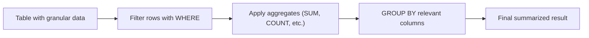
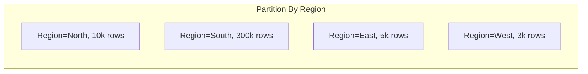

Below is the **Day 5 Answer Sheet** containing correct answers, detailed explanations, and additional insights for each quiz question. All references to files have been removed for clarity.

---

# **Day 5 Answer Sheet**

## (🔍) Beginner-Level Questions (1–7)

---

## **Answer 1: Aggregation Concepts and Flow**
🔍 Beginner | Multiple Choice

**Question:**  
Jin observes that “scanning all historical data for a single KPI number” led to severe performance issues. Which step best mitigates this in a typical aggregator workflow?

A. Use a CROSS JOIN to combine more tables, ensuring maximum coverage  
B. Always group by every column to reduce the final row count  
C. Apply a focused WHERE filter (e.g., last 30 days) before grouping  
D. Switch to a big FULL OUTER JOIN to catch all rows  

**Correct Answer:** C

**Explanation:**  
Applying a WHERE filter on the date or other relevant criteria significantly reduces the data set to be aggregated, preventing a full scan across all historical data. This is precisely how Jin recommends mitigating performance bottlenecks on dashboards that only need recent information.

**Why other options are incorrect:**  
- **(A)** CROSS JOIN broadens the data, typically causing even more overhead.  
- **(B)** Grouping by every column can create numerous groups, not necessarily less overhead, and possibly bigger results.  
- **(D)** FULL OUTER JOIN is unrelated to filtering unneeded historical rows; it can also inflate the result set.

**Database Comparison Note:**  
All major RDBMS benefit from narrowing the data set with a WHERE clause before aggregation.

**Knowledge Connection:**  
Jin emphasizes partial data queries to prevent huge scans. Only gather needed data for each KPI.

**SRE Perspective:**  
Overly large queries degrade reliability and can slow other critical tasks on production databases.

**Additional Insight:**  
You can also partition data by date and only read the relevant partition when possible.

---

## **Answer 2: Basic Aggregate Functions**
🔍 Beginner | Multiple Choice

**Question:**  
Which statement best describes how `COUNT(col)` differs from `COUNT(*)` according to Jin’s “Dashboard Engineer Toolkit” cheat sheet?

A. `COUNT(col)` includes NULL rows, while `COUNT(*)` excludes NULLs  
B. `COUNT(col)` counts only rows with non‐NULL values in that column, whereas `COUNT(*)` counts all rows  
C. `COUNT(col)` always requires a GROUP BY, while `COUNT(*)` never does  
D. `COUNT(col)` is for numeric columns only, while `COUNT(*)` is for strings  

**Correct Answer:** B

**Explanation:**  
`COUNT(col)` only tallies rows where `col` is not null, whereas `COUNT(*)` counts every row in the set, regardless of null values. This distinction is crucial when columns can be null, as the results might differ significantly.

**Why other options are incorrect:**  
- **(A)** It’s the opposite of how `COUNT(col)` behaves.  
- **(C)** Both can be used with or without GROUP BY, depending on the query structure.  
- **(D)** Both forms of COUNT work with any column type, not limited to numeric vs. strings.

**Database Comparison Note:**  
All major SQL platforms share this behavior of `COUNT(col)` vs. `COUNT(*)`.

**Knowledge Connection:**  
Jin’s cheat sheet clarifies the difference to avoid confusion when building dashboards that might exclude null data unintentionally.

**SRE Perspective:**  
Unexpected differences between `COUNT(col)` and `COUNT(*)` can lead to misleading metrics or confusion during incident investigations.

**Additional Insight:**  
Sometimes you combine `COUNT(col)` with `COUNT(*)` to gauge how many rows had valid data vs. total rows.

---

## **Answer 3: WHERE vs. HAVING**
🔍 Beginner | True/False

**Question:**  
Jin’s Principle #1 states that filtering should happen as early as possible to reduce overhead. True or false: The HAVING clause always applies **before** the rows are grouped, making it more efficient than WHERE.

A. True  
B. False  

**Correct Answer:** B (False)

**Explanation:**  
HAVING is applied **after** the grouping stage. WHERE occurs before grouping and is generally more efficient if the condition does not require aggregate results. If you can filter rows early with WHERE, you reduce the rows that need to be aggregated.

**Database Comparison Note:**  
This logic holds in Oracle, PostgreSQL, and SQL Server: WHERE prunes rows prior to aggregation, while HAVING filters groups post-aggregation.

**Knowledge Connection:**  
Jin warns about the overhead difference: a condition in HAVING means the DB processes more data than if the same condition were feasible in WHERE.

**SRE Perspective:**  
Reducing the input set upfront helps maintain performance for high-traffic dashboards, limiting resource usage.

**Additional Insight:**  
Use HAVING only when you need to filter by an aggregate function (like `HAVING SUM(x) > 1000`).

---

## **Answer 4: SUM, AVG, MIN, MAX**
🔍 Beginner | Multiple Choice

**Question:**  
Which scenario best illustrates Jin’s caution that you must ensure numeric data won’t overflow for a **SUM**?

A. Summing daily revenue that might exceed the data type max  
B. Finding the lowest order price with MIN  
C. Counting the number of logs in the last day  
D. Checking an address column’s character length  

**Correct Answer:** A

**Explanation:**  
A scenario where daily revenue can become very large (potentially exceeding the maximum value of the numeric type) captures the risk of overflow that Jin warns about. If the sum might outgrow the data type, you must handle or store it properly.

**Why other options are incorrect:**  
- **(B)** MIN checks for the smallest value, not at risk of summation overflow.  
- **(C)** COUNT is not a summation of large numbers in the same sense.  
- **(D)** Address length is not typically a numeric summation scenario.

**Database Comparison Note:**  
In all SQL systems, ensuring the column type (e.g., DECIMAL, NUMERIC) can hold potential sums is a universal concern.

**Knowledge Connection:**  
Jin’s aggregator cheat sheet highlights that sums can overflow if total numeric range is insufficient.

**SRE Perspective:**  
Overflow errors can cause query failures or inaccurate dashboards, crucial to avoid in production.

**Additional Insight:**  
Consider using larger data types (like BIGINT or DECIMAL) or check for partial summations if sums might be extremely high.

---

## **Answer 5: Jin’s Aggregation Principles**
🔍 Beginner | Matching

**Question:**  
Match each scenario in Column A to Jin’s aggregator principle from the day’s training in Column B.

Column A:  
1. A dashboard query calculates `COUNT(*)` for all rows ever, but only the last 3 months matter  
2. A team tries to find the earliest event time each day, but does a full table scan without indexes  
3. Developer wants an average, but half the data is NULL, skewing results  
4. A second developer considers using a window function but sees huge memory usage due to an uneven partition  

Column B:  
A. “MIN/MAX can leverage B-tree indexes for near-instant retrieval”  
B. “Filter partial data with WHERE, don’t aggregate entire history if unneeded”  
C. “Window functions are powerful, but large or skewed partitions cause memory bloat”  
D. “NULL can distort aggregator results – use COUNT(*) to gauge data coverage, or watch for skew”  

**Correct Matches:**  
1 → B  
2 → A  
3 → D  
4 → C  

**Explanation:**  
- **(1→B)** Filtering partial data with WHERE if you don’t need a full historical scan.  
- **(2→A)** Using B-tree indexes for quick min or earliest event retrieval.  
- **(3→D)** Many NULLs can produce misleading averages, consider a coverage check.  
- **(4→C)** A large partition in a window function can cause memory overhead.

**Database Comparison Note:**  
All aggregator optimizations (filtering, indexing, partition checks) hold for Oracle, PostgreSQL, SQL Server, etc.

**Knowledge Connection:**  
Jin’s aggregator principles reflect real-world issues like ignoring old data, indexing for min/max, checking NULLs, and partition skew.

**SRE Perspective:**  
Each principle addresses a common performance or reliability pitfall that can degrade dashboards under load.

**Additional Insight:**  
Plan queries carefully. For example, indexing a date column can drastically cut time scanning large tables.

---

## **Answer 6: GROUP BY Essentials**
🔍 Beginner | Fill-in-the-Blank

**Question:**  
Complete this statement from Jin’s training:

> “When using **GROUP BY**, you can’t select columns outside of the grouped fields or aggregates unless you use ________ to keep detail rows visible.”

A. an index  
B. a subquery  
C. a window function  
D. a CROSS JOIN  

**Correct Answer:** C – a window function

**Explanation:**  
Standard GROUP BY collapses rows into grouped summaries, preventing direct selection of non-aggregated columns. Window functions allow you to apply aggregates over a “window” while still displaying individual row details.

**Why other options are incorrect:**  
- **(A)** An index does not solve the grouping rule.  
- **(B)** A subquery might help, but it’s not the typical fix for group vs. detail row selection.  
- **(D)** CROSS JOIN just expands data sets, not relevant to selecting detail columns.

**Database Comparison Note:**  
Window functions are part of ANSI SQL, widely supported across major RDBMS, enabling row-level plus aggregated info.

**Knowledge Connection:**  
Jin’s advanced aggregator talk references how window functions let you see individual rows alongside an aggregate.

**SRE Perspective:**  
Window functions can be memory-intensive if used improperly, so handle them carefully in production queries.

**Additional Insight:**  
If you only need summary columns, a plain GROUP BY is enough; if you also need detail columns in each row, consider a window function.

---

## **Answer 7: Simple Aggregation Flow**
🔍 Beginner | Diagram-Based Multiple Choice

**Question:**  
Examine the flowchart below illustrating a basic data-to-summaries process:



Which step is recommended if performance is still slow after applying a WHERE filter?

A. Add CROSS JOIN to double the data size  
B. Insert a HAVING clause to re-filter the final groups  
C. Create a suitable index on the columns used by WHERE or GROUP BY  
D. Remove the GROUP BY so no aggregation is done  

**Correct Answer:** C

**Explanation:**  
If performance remains sluggish, Jin recommends indexing the columns used in the WHERE clause or the ones used for grouping. This helps the database quickly locate relevant rows or do efficient grouping, especially on large tables.

**Why other options are incorrect:**  
- **(A)** A CROSS JOIN drastically expands the data set, likely making performance worse.  
- **(B)** HAVING filters post-aggregation, which can be less efficient if we can filter earlier.  
- **(D)** Removing GROUP BY defeats the purpose of creating aggregated summaries.

**Database Comparison Note:**  
All SQL engines benefit from indexing to speed up filtering and grouping steps.

**Knowledge Connection:**  
Jin’s aggregator flowchart highlights indexing as a next step once you’ve done basic filtering.

**SRE Perspective:**  
Ensuring queries run quickly with indexing is crucial for dashboards that must refresh under heavy user load.

**Additional Insight:**  
If grouping is frequent on certain columns (like region, date), an appropriate composite index can drastically cut sorting or scanning time.

---

## (🧩) Intermediate-Level Questions (8–14)

---

## **Answer 8: Combining JOINs and Aggregation**
🧩 Intermediate | Multiple Choice

**Question:**  
Jin discusses combining aggregations with multi‐table joins. Which approach typically prevents excessive row scans?

A. Always do a FULL OUTER JOIN on all tables, then group  
B. Filter rows as early as possible with WHERE, then group  
C. Use CROSS JOIN on large tables, ensuring every row is included  
D. Convert all columns to text for simpler grouping  

**Correct Answer:** B

**Explanation:**  
Filtering rows at the earliest stage (via WHERE) prevents reading and aggregating unnecessary data, reducing overhead. Aggregating after a preliminary filter (and potentially partial join) is more efficient than gathering all possible rows first.

**Why other options are incorrect:**  
- **(A)** FULL OUTER JOINS often return large sets, not best for preventing row scans.  
- **(C)** CROSS JOIN can multiply rows drastically.  
- **(D)** Converting columns to text doesn’t inherently reduce row scans, possibly complicating the process.

**Database Comparison Note:**  
Filtering prior to grouping or joining is a universal performance principle in Oracle, PostgreSQL, SQL Server.

**Knowledge Connection:**  
Jin emphasizes early filtering to avoid scanning entire tables or unneeded data sets in aggregator queries.

**SRE Perspective:**  
Excessive row scans can degrade performance, hamper concurrency, and risk timeouts for dashboards.

**Additional Insight:**  
Think about indexing as well—an appropriate index on the WHERE clause columns further streamlines the scanning.

---

## **Answer 9: HAVING vs. WHERE**
🧩 Intermediate | True/False

**Question:**  
True or false: HAVING can filter groups based on aggregate results, while WHERE cannot use aggregates in its condition.

A. True  
B. False  

**Correct Answer:** A (True)

**Explanation:**  
WHERE applies row-by-row and cannot include aggregate functions. HAVING is designed to filter based on aggregate expressions like `HAVING SUM(x) > 1000`. Thus, to filter after grouping, you need HAVING.

**Database Comparison Note:**  
In all major SQL dialects, aggregates are disallowed in the WHERE clause, but can appear in HAVING.

**Knowledge Connection:**  
Jin’s aggregator teachings highlight that “WHERE filters rows, HAVING filters groups.”

**SRE Perspective:**  
Proper distinction between WHERE vs. HAVING ensures queries remain logically correct and potentially more efficient.

**Additional Insight:**  
If the condition can be written without an aggregate, it’s best placed in WHERE for performance reasons.

---

## **Answer 10: Window Functions**
🧩 Intermediate | Fill-in-the-Blank

**Question:**  
Complete Jin’s statement about **window functions**:

> “A window function allows you to apply an aggregator like SUM or AVG over a specific ________, without collapsing all rows into one.”

A. constraint  
B. partition  
C. index  
D. table  

**Correct Answer:** B – partition

**Explanation:**  
A window function can define partitions (and possibly order) over which an aggregate is computed, but each row remains visible. This is how you get, for example, a running total for each partition.

**Why other options are incorrect:**  
- **(A)** Constraints do not define aggregator windows.  
- **(C)** An index is unrelated to the aggregator’s partition concept.  
- **(D)** A table is too broad to describe the subset. Partition is the correct term in window function syntax.

**Database Comparison Note:**  
All major SQL systems (Oracle, PostgreSQL, SQL Server) support the `PARTITION BY` clause in window functions.

**Knowledge Connection:**  
Jin’s advanced aggregator coverage includes window function usage for row-level detail plus aggregated calculations.

**SRE Perspective:**  
Window functions can be memory‐heavy if partitions are massive or skewed, leading to performance concerns in production.

**Additional Insight:**  
Review partition distribution carefully: if one partition is huge relative to others, it can cause severe slowdowns.

---

## **Answer 11: Aggregator Function Gotchas**
🧩 Intermediate | Matching

**Question:**  
Match each aggregator function in Column A to its potential “gotcha” from Jin’s cheat sheet in Column B.

Column A:  
1. `COUNT(*)`  
2. `SUM(amount)`  
3. `AVG(response_time)`  
4. `MIN(date_col)`  

Column B:  
A. Might ignore NULLs and produce a misleading average if many rows are NULL  
B. Potential numeric overflow if values are very large  
C. Ignores no rows; returns total row count  
D. Can use a B-tree index top leaf block if properly indexed, drastically speeding up retrieval  

**Correct Matches:**  
1 → C  
2 → B  
3 → A  
4 → D  

**Explanation:**  
- **COUNT(*)** includes all rows (C).  
- **SUM(amount)** can overflow if numeric values exceed data type limits (B).  
- **AVG(response_time)** ignores NULLs, creating a misleading average if many are null (A).  
- **MIN(date_col)** can leverage the first leaf block of a B-tree index for quick retrieval (D).

**Database Comparison Note:**  
The same aggregator behaviors exist across Oracle, PostgreSQL, and SQL Server, with the same pitfalls.

**Knowledge Connection:**  
Jin’s aggregator cheat sheet enumerates these “gotchas,” reminding dashboard developers to account for nulls, overflow, or indexing opportunities.

**SRE Perspective:**  
Each pitfall can cause production anomalies: inaccurate metrics or slow queries, both detrimental to reliability.

**Additional Insight:**  
Always check your aggregator usage: do you want `COUNT(*)` or `COUNT(col)`, can you store large sums without overflow, do you handle null-laden averages, can a B-tree index speed up min/max?

---

## **Answer 12: Window Function Partition Skew**
🧩 Intermediate | Multiple Choice with Diagram

**Question:**  
Examine the partial diagram for a running total partition:



Why might Jin warn about “partition skew” in this scenario?

A. All regions have identical row counts, so no skew exists  
B. The “South” partition is vastly larger than others, causing memory overhead and slow processing  
C. Window functions automatically split large partitions across multiple servers  
D. East and West are forced into a CROSS JOIN with the other partitions  

**Correct Answer:** B

**Explanation:**  
One partition (South) is much bigger than the others, leading to an unbalanced distribution. Window functions must handle that large partition in memory, risking higher overhead or slower queries than smaller partitions.

**Why other options are incorrect:**  
- **(A)** Clearly false: South has 300k vs. smaller partitions for others.  
- **(C)** Window functions don’t automatically distribute across servers unless specifically using a cluster setup.  
- **(D)** CROSS JOIN is irrelevant in this context.

**Database Comparison Note:**  
All DB engines supporting window functions face similar partition skew issues. Data distribution heavily impacts performance.

**Knowledge Connection:**  
Jin specifically warns about partition skew – if one partition dwarfs the others, the query plan for that partition can become a bottleneck.

**SRE Perspective:**  
Skew can cause memory thrashing or partial timeouts if the DB tries to handle a massive chunk in one partition.

**Additional Insight:**  
You can sometimes split large partitions further or create a more balanced partition key (like region+subregion) to avoid a single huge partition.

---

## **Answer 13: Dashboard Lag Troubleshooting**
🧩 Intermediate | Ordering

**Question:**  
Arrange these steps from Jin’s **Dashboard Lag Troubleshooting Flowchart** in the correct order:

A. Check if large GROUP BY is present  
B. Consider partial pre-aggregations or materialized views  
C. Ensure an appropriate WHERE clause or index is used  
D. Inspect query complexity and verify aggregator approach  

**Correct Order:** D, A, C, B

1. **(D)** Inspect the overall query approach and aggregator complexity.  
2. **(A)** Check if there’s a large GROUP BY that might be scanning too much data.  
3. **(C)** Add a WHERE clause or index to reduce the data set or speed grouping.  
4. **(B)** If it remains slow, consider partial pre-aggregations or materialized views.

**Explanation:**  
Jin’s flow starts with analyzing the query’s aggregator strategy, checking for monstrous GROUP BY usage, then refining indexing and filtering, and only after that do you weigh more advanced solutions like materialized views.

**Database Comparison Note:**  
The same logical triage stands in Oracle, Postgres, SQL Server: examine aggregator complexity, see if group or index usage is optimized, then escalate.

**Knowledge Connection:**  
Jin’s flowchart for “Case of the Sluggish Dashboard” emphasizes a stepwise approach.

**SRE Perspective:**  
Following a systematic approach under time pressure helps avoid random guesses that can waste resources.

**Additional Insight:**  
Always measure performance after each step to ensure incremental gains or confirm the next step is needed.

---

## **Answer 14: Distinguishing WHERE vs. HAVING**
🧩 Intermediate | Multiple Choice

**Question:**  
Which example best demonstrates a correct use of **HAVING**?

A.
```sql
SELECT region, SUM(sales)
FROM orders
WHERE SUM(sales) > 1000
GROUP BY region;
```
B.
```sql
SELECT region, SUM(sales)
FROM orders
GROUP BY region
HAVING region = 'East';
```
C.
```sql
SELECT region, SUM(sales)
FROM orders
GROUP BY region
HAVING SUM(sales) > 1000;
```
D.
```sql
SELECT region, sales
FROM orders
HAVING sales > 1000;
```

**Correct Answer:** C

**Explanation:**  
`HAVING SUM(sales) > 1000` properly demonstrates using HAVING to filter groups after aggregation. The condition depends on the aggregated value.

**Why other options are incorrect:**  
- **(A)** You can’t use `WHERE SUM(sales) > 1000` – aggregate in WHERE is invalid.  
- **(B)** Checking a non-aggregate column (`region`) in HAVING is unusual and generally belongs in WHERE instead.  
- **(D)** Missing `GROUP BY`; you can’t simply use HAVING on a non-aggregated query.

**Database Comparison Note:**  
This usage is the same in Oracle, Postgres, and SQL Server.

**Knowledge Connection:**  
Matches Jin’s teaching that HAVING is specifically for post-group filtering using aggregates.

**SRE Perspective:**  
Knowing the difference helps avoid logic or performance confusion in complex queries that must meet real-time dashboards.

**Additional Insight:**  
If you only need to filter `region`, do it in WHERE, leaving HAVING for aggregated conditions.

---

## (💡) Advanced/SRE-Level Questions (15–20)

---

## **Answer 15: Large-Scale Aggregations**
💡 Advanced | Multiple Choice

**Question:**  
Jin mentions advanced aggregator scenarios with “massive data sets.” Which strategy can reduce overhead for daily dashboards?

A. Full table scans on all historical data every time  
B. Partitioning the table by date and only aggregating recent partitions  
C. Removing all indexes to speed up insertion of new daily rows  
D. Using CROSS JOIN with a dimension table to ensure coverage  

**Correct Answer:** B

**Explanation:**  
Partitioning by date lets you confine aggregation to recent partitions. This greatly reduces scan overhead for daily queries. Only relevant partitions are scanned, which is far cheaper than scanning an entire multi-year table.

**Why other options are incorrect:**  
- **(A)** Full scans over all historical data are precisely the performance killer.  
- **(C)** Removing indexes helps inserts but drastically worsens read performance for big queries.  
- **(D)** CROSS JOIN typically explodes row counts, not helpful for aggregator performance.

**Database Comparison Note:**  
Partitioning is a best practice across Oracle, Postgres (table partitioning), and SQL Server (partitioned tables) for large data sets.

**Knowledge Connection:**  
Jin repeatedly highlights partial or partition-based approaches to keep aggregator queries snappy.

**SRE Perspective:**  
Excessive overhead from unpartitioned tables can hamper concurrency, cause timeouts, and degrade reliability.

**Additional Insight:**  
Often you combine partition pruning with a date-based index, ensuring the DB only scans the needed partition(s).

---

## **Answer 16: Materialized Views for Summaries**
💡 Advanced | True/False

**Question:**  
True or false: Jin suggests that if repeated aggregator queries still bog down the DB, creating a **materialized view** or partial aggregate can drastically improve performance on read‐heavy dashboards.

A. True  
B. False  

**Correct Answer:** A (True)

**Explanation:**  
A materialized view stores precomputed aggregations (often scheduled to refresh). This is a proven strategy for read-heavy dashboards that reuse the same aggregator results.

**Database Comparison Note:**  
All major SQL systems have an equivalent concept: Oracle has materialized views, Postgres has materialized views (though with some differences), SQL Server has indexed views or similar approaches.

**Knowledge Connection:**  
Jin references partial aggregates or a “materialized” table for frequent analytics to cut down repeated full scans.

**SRE Perspective:**  
They reduce CPU/time usage for aggregator queries at scale, albeit with overhead on refresh times.

**Additional Insight:**  
Ensure refresh strategies are well-defined. If real-time data is needed, a near-real-time refresh or partial aggregator might be necessary.

---

## **Answer 17: Explaining Query Plans for Aggregations**
💡 Advanced | Multiple Choice

**Question:**  
When Jin checks an Oracle `EXPLAIN PLAN` for a grouped query, which operator indicates the DB is **sorting** the result set to perform grouping?

A. `SORT GROUP BY`  
B. `NESTED LOOPS`  
C. `HASH JOIN`  
D. `INDEX FAST FULL SCAN`  

**Correct Answer:** A

**Explanation:**  
When Oracle must sort the data to group it, you often see `SORT GROUP BY` in the execution plan. This typically appears if no better indexing or hashing approach is used for grouping.

**Why other options are incorrect:**  
- **(B)** NESTED LOOPS is a join method, not grouping.  
- **(C)** HASH JOIN also indicates join logic, not grouping.  
- **(D)** INDEX FAST FULL SCAN is an index access method, unrelated to group sorting.

**Database Comparison Note:**  
PostgreSQL shows a “GroupAggregate” plan or “Sort -> Aggregate,” while SQL Server might show “Sort” then “Stream Aggregate.” The concept is the same.

**Knowledge Connection:**  
Jin’s aggregator performance teachings mention you can see `SORT GROUP BY` if no specialized index or hash aggregator is chosen.

**SRE Perspective:**  
Seeing a large `SORT GROUP BY` can point to memory usage spikes or potential spool to disk if insufficient memory.

**Additional Insight:**  
If you repeatedly group by the same column, consider a composite index or alternative aggregator technique to avoid repeated full sorts.

---

## **Answer 18: Null Handling in Aggregations**
💡 Advanced | Fill-in-the-Blank

**Question:**  
Complete this statement from Jin’s notes:

> “For `AVG()` or `SUM()`, rows with ________ values are excluded from the calculation, which may skew results if they represent missing data.”

A. negative  
B. numeric  
C. NULL  
D. distinct  

**Correct Answer:** C – NULL

**Explanation:**  
Aggregate functions (like SUM, AVG) ignore NULL values. If many relevant rows contain NULL in the aggregated column, the final result might misrepresent the actual average or total.

**Why other options are incorrect:**  
- **(A)** Negative values are included; no aggregator logic excludes them.  
- **(B)** The aggregator specifically handles numeric columns, but ignoring them is not the default.  
- **(D)** Distinct is a separate aggregator concept, not about ignoring values.

**Database Comparison Note:**  
All SQL engines exclude NULL from aggregate calculations. This can produce unexpected results if “missing data” is widespread.

**Knowledge Connection:**  
Jin warns developers to confirm how many NULLs exist before trusting an average or sum.

**SRE Perspective:**  
Large sets of NULL data can cause anomalies in dashboards or incident metrics, misinforming decisions.

**Additional Insight:**  
Consider using `COALESCE` or a special marker for missing data if you want to treat “missing” as zero in certain scenarios.

---

## **Answer 19: Jin’s Aggregation Principles**
💡 Advanced | Matching

**Question:**  
Match each principle number in Column A to its brief summary in Column B, based on Jin’s repeated references.

Column A:  
1. Principle #1  
2. Principle #2  
3. Principle #3  
4. Principle #4  
5. Principle #5  

Column B:  
A. “Never COUNT what you can precompute – for frequent dashboards, partial aggregates help.”  
B. “Filter partial data with WHERE, so you don’t aggregate your entire history.”  
C. “MIN/MAX can exploit B-tree indexes.”  
D. “Window functions are powerful but watch partition skew.”  
E. “HAVING is only for post-group filters, while WHERE does initial filtering.”  

**Correct Matches:**  
1 → E  
2 → B  
3 → A  
4 → C  
5 → D  

**Explanation:**  
- **(1 → E)** Principle #1 about using WHERE early vs. HAVING post-group.  
- **(2 → B)** Emphasizes partial data with WHERE, not entire history.  
- **(3 → A)** Encourages precomputation (materialized or partial aggregates) to avoid daily overhead.  
- **(4 → C)** MIN/MAX can leverage B-tree indexes for swift retrieval.  
- **(5 → D)** Window functions are powerful but partition skew can be deadly.

**Database Comparison Note:**  
The same aggregator logic holds in Oracle, Postgres, SQL Server. Each principle addresses a universal aggregator pitfall or best practice.

**Knowledge Connection:**  
Jin systematically taught these five aggregator principles as a recipe for faster dashboards.

**SRE Perspective:**  
Applying these principles reduces downtime, slow queries, and resource contention in high-traffic environments.

**Additional Insight:**  
Combining multiple principles (like partial data filtering + indexing) often yields the greatest performance improvement.

---

## **Answer 20: Fixing an Overloaded Aggregation**
💡 Advanced | Ordering

**Question:**  
Jin typically follows these steps when a group-based query times out:

A. Add or refine a WHERE clause to limit unneeded rows  
B. If still slow, examine indexing or partitioning  
C. Check if the aggregator is unfiltered in the FROM clause  
D. Test final performance, consider materialized views if it’s still too big  

Arrange these in the logical sequence Jin usually recommends for production triage.

**Correct Order:** C, A, B, D

1. **(C)** Check if the aggregator is unfiltered (maybe scanning everything).  
2. **(A)** Add or refine a WHERE clause to trim the data.  
3. **(B)** If still slow, investigate indexing or partition strategies to reduce overhead.  
4. **(D)** Finally, test performance, and if it remains problematic, consider partial or materialized aggregations.

**Explanation:**  
Jin’s approach starts by identifying whether the aggregator hits all rows, then applying filtering, then ensuring indexing or partitioning, and only if it’s still large do you adopt more advanced solutions like materialized views.

**Database Comparison Note:**  
Regardless of RDBMS, the same steps help isolate performance bottlenecks in aggregator queries.

**Knowledge Connection:**  
This ordering aligns with Jin’s aggregator meltdown triage steps from the training session.

**SRE Perspective:**  
Following a structured approach avoids guesswork during on-call emergencies or high-traffic events.

**Additional Insight:**  
Measuring performance after each step provides clarity on which changes yield the best improvements.

---

**End of Day 5 Answer Sheet**