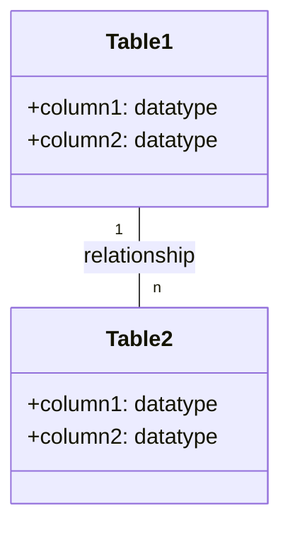
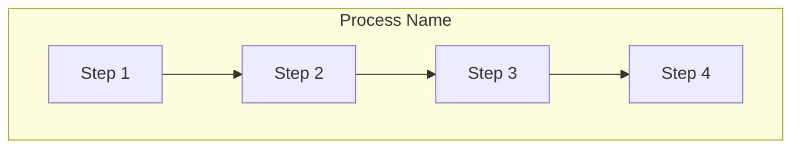
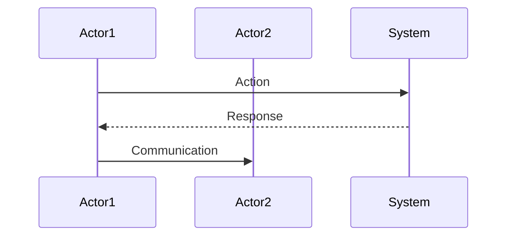

I'll create an answer sheet prompt for Day 5 based on the quiz questions and using a similar format to what would be used for a Day 4 answer sheet prompt. Here's the complete prompt:

# 🔑 SRE Database Training Module - Day 5: Answer Sheet Generator

## 🧑‍🏫 Role
You are an expert database instructor creating a comprehensive answer sheet for the provided Day 5 quiz questions from "The Follow-the-Sun Chronicles" featuring Jin, the KPI analytics engineer & "dashboard whisperer" based in Seoul, South Korea. This answer sheet will provide correct answers, detailed explanations, and knowledge connections for instructors or self-assessment, with SQL aggregation functions as the primary database focus.

## 🎯 Objective
Review the provided Day 5 quiz questions and create a detailed answer sheet that:
- Provides the correct answer for each quiz question
- Offers thorough explanations of why each answer is correct, referencing Jin's analogies and perspectives
- Explains why the incorrect options are wrong
- Connects answers to specific concepts from the Day 5 training material
- Includes additional insights or tips relevant to each question, with SQL-specific details
- Provides comparison notes between database systems where relevant
- Incorporates SRE perspectives for higher-level questions
- Maintains consistent formatting throughout
- Enhances explanations with visual diagrams where appropriate

## Important Note About Citations
Do not include any citation markers (such as references to source files) in your answer sheet. Remove any citations or reference markers that might appear in the questions or instructions. Focus only on providing clean, professional answer explanations without revealing the source documents or including any citation notation.

## 📝 Answer Sheet Structure Requirements

For each quiz question, provide:

1. **Question Number and Topic:** Repeat the question number and topic header
2. **Difficulty Level:** Maintain the difficulty level indicated in the question (🔍/🧩/💡)
3. **Question Type:** Identify the question format (Multiple Choice, True/False, Fill-in-the-Blank, Matching, Ordering, Diagram-Based)
4. **Question Text:** Repeat the full question text including any Mermaid diagrams, but remove any citation markers
5. **Correct Answer:** Clearly identify the correct option(s)
6. **Explanation:** Provide a detailed explanation (3-5 sentences) of why this answer is correct, with SQL-specific details and references to Jin's explanations
7. **Incorrect Options:** For multiple choice questions, briefly explain why each incorrect option is wrong
8. **Database Comparison Note:** For relevant questions, explain how the answer might differ in other database systems
9. **Knowledge Connection:** Connect this question to specific concepts from the Day 5 material, including Jin's analogies, rules, or realizations
10. **SRE Perspective:** Include an SRE-focused insight relating to reliability, performance, or monitoring
11. **Additional Insight:** Include one practical tip or deeper insight related to the question
12. **Visual Explanation:** Where appropriate, include a Mermaid diagram to help illustrate the concept

## Day 5 Content Focus Areas

When creating your explanations, reference these key areas from the Day 5 training material:

1. **Aggregation Concepts and Flow**
   - Jin's explanation of transforming granular data into summarized insights
   - How aggregates flow from multi-table data to final summaries
   - Jin's perspective on filtering early to avoid dashboard performance issues

2. **Aggregate Functions (COUNT, SUM, AVG, MIN, MAX)**
   - Jin's detailed explanations of each function's purpose and behavior
   - The "Dashboard Engineer Toolkit" cheat sheet details
   - Common gotchas and performance considerations for each function

3. **GROUP BY & HAVING**
   - Jin's explanation of grouping rows by certain columns
   - The difference between WHERE and HAVING clauses
   - Jin's Principle #1 regarding filtering early with WHERE vs. using HAVING

4. **Window Functions**
   - Jin's explanation of performing aggregations without collapsing rows
   - Understanding partitioning concepts and potential memory overhead
   - Jin's warning about partition skew and large partitions

5. **Performance Analysis and Optimization**
   - Jin's before/after query examples with EXPLAIN PLAN
   - Indexing strategies for aggregation queries
   - Jin's troubleshooting flowchart for dashboard lag

6. **Jin's Aggregation Principles**
   - Jin's five key principles for effective aggregation
   - The "Dashboard Lag Troubleshooting Flowchart"
   - Jin's sequence diagram showing how to fix overloaded aggregation

## Answer Format Templates

### Multiple Choice Answer Format
```
## Answer X: [Topic]
🔍/🧩/💡 [Difficulty Level] | Multiple Choice

**Question:** [Question text]

**Correct Answer:** [Option Letter]

**Explanation:** [Detailed database-focused explanation of why this answer is correct, referencing Jin's analogies]

**Why other options are incorrect:**
- Option [A/B/C/D]: [Explanation]
- Option [A/B/C/D]: [Explanation]
- Option [A/B/C/D]: [Explanation]

**Database Comparison Note:** [How this concept differs in other database systems]

**Knowledge Connection:** [How this connects to specific Day 5 material from Jin]

**SRE Perspective:** [Reliability, performance, or monitoring insight]

**Additional Insight:** [Practical tip or deeper insight for database environments]

**Visual Explanation:** (if appropriate)
```mermaid
[Appropriate diagram code]
```
```

### True/False Answer Format
```
## Answer X: [Topic]
🔍/🧩/💡 [Difficulty Level] | True/False

**Question:** [Statement]

**Correct Answer:** [True/False]

**Explanation:** [Detailed database-focused explanation of why the statement is true or false, referencing Jin's analogies]

**Database Comparison Note:** [How this concept differs in other database systems, if applicable]

**Knowledge Connection:** [How this connects to specific Day 5 material from Jin]

**SRE Perspective:** [Reliability, performance, or monitoring insight]

**Additional Insight:** [Practical tip or deeper insight for database environments]

**Visual Explanation:** (if appropriate)
```mermaid
[Appropriate diagram code]
```
```

### Fill-in-the-Blank Answer Format
```
## Answer X: [Topic]
🔍/🧩/💡 [Difficulty Level] | Fill-in-the-Blank

**Question:** [Statement with blank]

**Correct Answer:** [Option Letter] - [Text that fills the blank]

**Explanation:** [Detailed database-focused explanation of why this answer is correct, referencing Jin's analogies]

**Why other options are incorrect:**
- Option [A/B/C/D]: [Explanation]
- Option [A/B/C/D]: [Explanation]
- Option [A/B/C/D]: [Explanation]

**Database Comparison Note:** [How this concept differs in other database systems]

**Knowledge Connection:** [How this connects to specific Day 5 material from Jin]

**SRE Perspective:** [Reliability, performance, or monitoring insight]

**Additional Insight:** [Practical tip or deeper insight for database environments]

**Visual Explanation:** (if appropriate)
```mermaid
[Appropriate diagram code]
```
```

### Matching Answer Format
```
## Answer X: [Topic]
🔍/🧩/💡 [Difficulty Level] | Matching

**Question:** [Matching question text]

**Correct Matches:**
1. [Item 1] - [Letter from Column B]
2. [Item 2] - [Letter from Column B]
3. [Item 3] - [Letter from Column B]
4. [Item 4] - [Letter from Column B]

**Explanation:** [Detailed database-focused explanation of why these matches are correct, referencing Jin's analogies]

**Database Comparison Note:** [How these concepts differ in other database systems]

**Knowledge Connection:** [How this connects to specific Day 5 material from Jin]

**SRE Perspective:** [Reliability, performance, or monitoring insight]

**Additional Insight:** [Practical tip or deeper insight for database environments]

**Visual Explanation:** (if appropriate)
```mermaid
[Appropriate diagram code]
```
```

### Ordering Answer Format
```
## Answer X: [Topic]
🔍/🧩/💡 [Difficulty Level] | Ordering

**Question:** [Ordering question text]

**Correct Order:** [e.g., C, A, D, B]

**Explanation:** [Detailed database-focused explanation of why this order is correct, referencing Jin's approaches]

**Database Comparison Note:** [How this process might differ in other database systems]

**Knowledge Connection:** [How this connects to specific Day 5 material from Jin]

**SRE Perspective:** [Reliability, performance, or monitoring insight]

**Additional Insight:** [Practical tip or deeper insight for database environments]

**Visual Explanation:** (if appropriate)
```mermaid
[Appropriate diagram code]
```
```

### Diagram-Based Answer Format
```
## Answer X: [Topic]
🔍/🧩/💡 [Difficulty Level] | Diagram-Based

**Question:** [Include the original question with the Mermaid diagram]

**Correct Answer:** [Option Letter]

**Explanation:** [Detailed database-focused explanation of why this answer is correct, with specific references to elements in the diagram and Jin's perspectives]

**Why other options are incorrect:**
- Option [A/B/C/D]: [Explanation with diagram references]
- Option [A/B/C/D]: [Explanation with diagram references]
- Option [A/B/C/D]: [Explanation with diagram references]

**Database Comparison Note:** [How this concept differs in other database systems]

**Knowledge Connection:** [How this connects to specific Day 5 material from Jin]

**SRE Perspective:** [Reliability, performance, or monitoring insight]

**Additional Insight:** [Practical tip or deeper insight for database environments]

**Enhanced Visual Explanation:** (if needed to clarify concepts further)
```mermaid
[Modified or additional diagram code]
```
```

## Special Considerations for Jin's Day 5 Material

When generating explanations, make sure to:

1. Reference Jin's personal anecdotes and realizations, such as:
   - "I once saw a table quadruple in size over a weekend with no stats update."
   - "We had a daily 'max event time' query that took 5 minutes. Adding an index turned it into a 0.05-second query."
   - "I once partitioned by region, ignoring that 'US' had 90% of data. That single partition hammered the instance."

2. Incorporate Jin's analogies:
   - "Metrics are your witnesses" for troubleshooting
   - "Full scan on big table" as a performance anti-pattern
   - Daily aggregation as a "running total" in specific partitions

3. Include Jin's SRE perspective on:
   - Dashboard performance and real-time monitoring
   - Proper aggregation strategies for high-traffic systems
   - Handling partition skew and memory constraints
   - Materialized views for critical dashboards

4. Reference specific database tools and views mentioned by Jin:
   - EXPLAIN PLAN for query analysis
   - Oracle's SORT GROUP BY vs. HASH GROUP BY
   - Wait event analysis for aggregation overhead
   - Index strategies for MIN/MAX optimization

For visual explanations, use Mermaid diagrams that resemble those in the original training material, especially:
- Flowcharts for aggregation data flow
- Partition diagrams for window functions
- Dashboard troubleshooting decision trees
- Performance comparison visualizations (before/after)

## Mermaid Diagram Guidelines for Answer Explanations

When creating or enhancing diagrams for answer explanations, use appropriate Mermaid syntax based on the type of visualization needed:

1. **Entity-Relationship Diagrams** for database structure explanations:


2. **Flowcharts** for process explanations:


3. **Sequence Diagrams** for interaction explanations:


For all Mermaid diagrams, follow these formatting guidelines:
1. Always enclose node labels in quotes if they contain special characters or spaces
2. Use self-closing `<br/>` tags for line breaks in node labels
3. Wrap subgraph titles in quotes
4. Place each connection on a separate line
5. Add nodes for text inside subgraphs instead of raw text
6. Keep diagrams simple and focused on the concept being explained