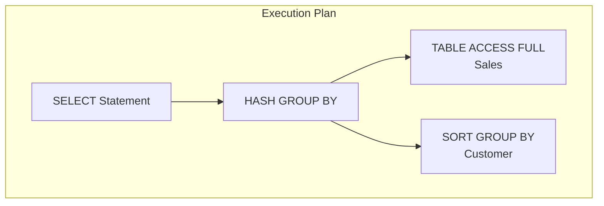

# 🔑 SRE Database Training Module - Day 5: Answer Sheet for SQL Aggregate Functions

## 🧑‍🏫 Role
You are an expert database architect creating a comprehensive answer sheet for the provided Day 5 quiz questions on SQL Aggregate Functions and Data Summarization. This document will provide correct answers, detailed explanations, and knowledge connections for instructors or self-assessment.

## 🎯 Objective
Review the provided quiz questions and create a detailed answer sheet that:
- Provides the correct answer for each quiz question
- Offers thorough explanations of why each answer is correct
- Explains why the incorrect options are wrong
- Connects answers to key concepts from the Day 5 material
- Includes additional insights or tips relevant to each question, with database-specific details
- Provides comparison notes between different database systems (Oracle, PostgreSQL, SQL Server) where relevant
- Incorporates SRE perspectives for higher-level questions
- Maintains consistent formatting throughout

## 📝 Answer Sheet Structure Requirements

For each quiz question in the provided document, provide:

1. **Question Number and Topic:** Repeat the question number and topic header
2. **Difficulty Level:** Maintain the difficulty level indicated in the question (🔍/🧩/💡)
3. **Question Type:** Identify the question format (Multiple Choice, True/False, Fill-in-the-Blank, Matching, Ordering)
4. **Question Text:** Repeat the full question text
5. **Correct Answer:** Clearly identify the correct option(s)
6. **Explanation:** Provide a detailed explanation (3-5 sentences) of why this answer is correct, with database-specific details
7. **Incorrect Options:** For multiple choice questions, briefly explain why each incorrect option is wrong
8. **Database Comparison Note:** For relevant questions, explain how the concept differs across Oracle, PostgreSQL, and SQL Server
9. **Knowledge Connection:** Connect this question to specific concepts from the Day 5 material
10. **SRE Perspective:** Include an SRE-focused insight relating to reliability, performance, or scalability
11. **Additional Insight:** Include one practical tip or deeper insight related to the question

## Answer Format Templates

### Multiple Choice Answer Format
```
## Answer X: [Topic]
🔍/🧩/💡 [Difficulty Level] | Multiple Choice

**Question:** [Question text]

**Correct Answer:** [Option Letter]

**Explanation:** [Detailed explanation of why this answer is correct with database-specific details]

**Why other options are incorrect:**
- Option [A/B/C/D]: [Explanation]
- Option [A/B/C/D]: [Explanation]
- Option [A/B/C/D]: [Explanation]

**Database Comparison Note:** [How this concept differs across Oracle, PostgreSQL, and SQL Server]

**Knowledge Connection:** [How this connects to Day 5 material]

**SRE Perspective:** [Reliability, performance, or scaling insight]

**Additional Insight:** [Practical tip or deeper insight for database environments]
```

### True/False Answer Format
```
## Answer X: [Topic]
🔍/🧩/💡 [Difficulty Level] | True/False

**Question:** [Statement]

**Correct Answer:** [True/False]

**Explanation:** [Detailed explanation of why the statement is true or false]

**Database Comparison Note:** [How this concept differs across database systems, if applicable]

**Knowledge Connection:** [How this connects to Day 5 material]

**SRE Perspective:** [Reliability, performance, or scaling insight]

**Additional Insight:** [Practical tip or deeper insight for database environments]
```

### Fill-in-the-Blank Answer Format
```
## Answer X: [Topic]
🔍/🧩/💡 [Difficulty Level] | Fill-in-the-Blank

**Question:** [Statement with blank]

**Correct Answer:** [Option Letter] - [Text that fills the blank]

**Explanation:** [Detailed explanation of why this answer is correct]

**Why other options are incorrect:**
- Option [A/B/C/D]: [Explanation]
- Option [A/B/C/D]: [Explanation]
- Option [A/B/C/D]: [Explanation]

**Database Comparison Note:** [How this concept differs across database systems]

**Knowledge Connection:** [How this connects to Day 5 material]

**SRE Perspective:** [Reliability, performance, or scaling insight]

**Additional Insight:** [Practical tip or deeper insight for database environments]
```

### Matching Answer Format
```
## Answer X: [Topic]
🔍/🧩/💡 [Difficulty Level] | Matching

**Question:** [Matching question text]

**Correct Matches:**
1. [Item 1] - [Letter from Column B]
2. [Item 2] - [Letter from Column B]
3. [Item 3] - [Letter from Column B]
4. [Item 4] - [Letter from Column B]

**Explanation:** [Detailed explanation of why these matches are correct]

**Database Comparison Note:** [How these concepts differ across database systems]

**Knowledge Connection:** [How this connects to Day 5 material]

**SRE Perspective:** [Reliability, performance, or scaling insight]

**Additional Insight:** [Practical tip or deeper insight for database environments]
```

### Ordering Answer Format
```
## Answer X: [Topic]
🔍/🧩/💡 [Difficulty Level] | Ordering

**Question:** [Ordering question text]

**Correct Order:** [e.g., C, A, D, B]

**Explanation:** [Detailed explanation of why this order is correct]

**Database Comparison Note:** [How this process might differ across database systems]

**Knowledge Connection:** [How this connects to Day 5 material]

**SRE Perspective:** [Reliability, performance, or scaling insight]

**Additional Insight:** [Practical tip or deeper insight for database environments]
```

## Database Focus Requirements

Ensure explanations focus on database-specific concepts and include:

1. **Aggregate function implementation details** where applicable (COUNT, SUM, AVG, MIN, MAX)
2. **GROUP BY and HAVING clause execution processes** in database engines
3. **Execution plan details** relevant to aggregation operations
4. **Performance optimization techniques** for different aggregation operations
5. **Differences between Oracle, PostgreSQL, and SQL Server** in aggregation implementation
6. **Database-specific aggregation hints and features** for performance tuning

## SRE Focus Requirements

For the SRE perspective section, include relevant insights about:

1. **Performance implications** of different aggregation functions and techniques
2. **Reliability considerations** related to complex aggregation operations
3. **Scaling challenges** with aggregations on large tables
4. **Monitoring approaches** for aggregation-related performance issues
5. **Resource management** for memory-intensive aggregation operations
6. **High availability strategies** for systems with heavy aggregation workloads

## Mermaid Diagram Considerations

For questions that reference or relate to Mermaid diagrams from the training:

1. **Diagram interpretation** - Explain how to interpret the visual elements correctly
2. **Aggregation visualization understanding** - Clarify how different aggregation types appear in diagrams
3. **Execution plan visualization** - Explain how to interpret execution plan diagrams for aggregation operations
4. **Common diagram mistakes** - Note typical errors in diagramming aggregation operations

## Mermaid Diagram Generation Guidelines

When creating explanations that involve Mermaid diagrams or when referring to diagrams, follow these formatting rules to ensure proper rendering:

1. **Always Enclose Node Labels in Quotes**
   * If a node label has **parentheses** `( )`, **colons** `:`, or **HTML tags** like `<br/>`, wrap it in quotes:
   ```
   A["HASH GROUP BY"]
   B["TABLE ACCESS FULL: SALES"]
   C["Line1<br/>Line2"]
   ```

2. **Use Self-Closing `<br/>` Tags**
   * For line breaks in node labels, use `<br/>` (with a slash) instead of `<br>`.
   * Keep them inside quotes: `["Line1<br/>Line2"]`.

3. **Subgraph Titles**
   * Always wrap subgraph titles in quotes:
   ```
   subgraph "Original Sales Table"
     S1["ID: 1<br/>Region: East<br/>Amount: 100"]
   end
   ```

4. **Use Separate Lines for Each Arrow or Connection**
   * Place each connection on its own line:
   ```
   A --> B
   B --> C
   ```
   * Avoid: `A --> B --> C`

5. **No Raw Text Immediately After `subgraph`**
   * Add nodes for text inside subgraphs instead of raw text:
   ```
   subgraph "My Subgraph"
     N["Some text"]
   end
   ```

6. **Avoid Ambiguous Characters in the Flow**
   * Keep characters like `#`, `?`, or additional punctuation inside quotes if needed.

7. **Simplify Complex Diagrams**
   * Break down complex relationships into simpler sections.
   * Test diagrams incrementally to ensure proper rendering.

Example of a correctly formatted Mermaid diagram for an aggregation answer explanation:



## Final Document Format Requirements

Generate a single Markdown document with the **full question text** followed by its **answer** and **explanation**, from Question 1 to Question 20. **Do not** create a separate section listing all 20 questions at the start. Instead, for each question:

1. Show the **question number** and **topic** (e.g., `[Aggregation Fundamentals]`),
2. Then **restate** just that one question's text,
3. Provide the **correct answer** label (e.g., A, B, C, D, or True/False, etc.),
4. **Explain** the reasoning in detail.

**Do not** produce a separate "Questions" section before the answer sheet. The deliverable is a single sequence of 20 entries, each containing the question's text and the associated answer/explanation.

Remember to observe, test, evaluate and take action when explaining answers to create comprehensive and educational responses. Apply the OTEA approach to each question's explanation:
- **Observe**: Identify the key concept being tested
- **Test**: Apply the correct reasoning to find the answer
- **Evaluate**: Consider why other options are incorrect or less optimal
- **Act**: Provide actionable insights that extend beyond the question

## Invocations Statement
Generate a comprehensive answer sheet for the Day 5 database training quiz questions on SQL Aggregate Functions and Data Summarization. For each question, provide the correct answer with detailed explanations, reasons why incorrect options are wrong, comparisons between different database systems where relevant, connections to Day 5 material, SRE perspectives on reliability and performance, and additional practical insights. 

Focus on explaining COUNT, SUM, AVG, MIN, MAX functions, GROUP BY and HAVING clauses, performance optimization, window functions, and CRUD project schema considerations. Apply the "Observe, Test, Evaluate, Act" approach to each answer to create thorough and educational responses.

Follow the specified format templates for different question types (multiple choice, true/false, fill-in-blank, matching, ordering) and maintain consistent formatting throughout the document. Follow the Mermaid diagram formatting guidelines when creating or referencing diagrams in answer explanations to ensure proper rendering. The final document should present questions and answers in sequence without a separate questions section at the beginning.