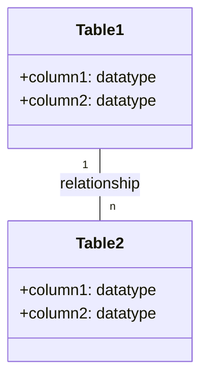
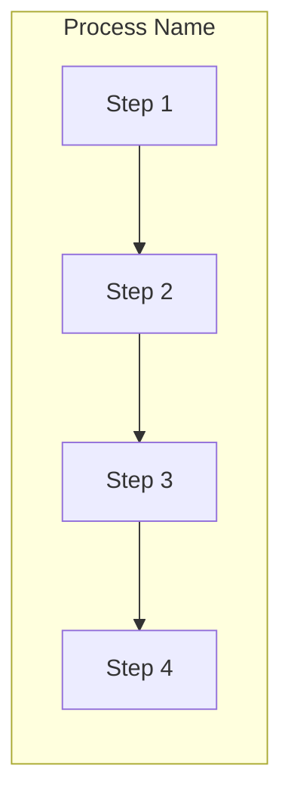
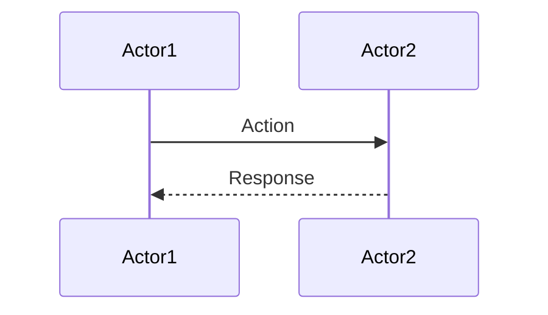

I'll generate a quiz question prompt for Day 5 of "The Follow-the-Sun Chronicles" based on the source document. Here's the customized prompt:

# 📝 SRE Database Training Module - Day 5: Quiz Questions

## 🧑‍🏫 Role
You are an expert database instructor creating assessment questions for Day 5 of "The Follow-the-Sun Chronicles" training featuring Jin, the KPI analytics engineer & "dashboard whisperer" based in Seoul, South Korea. These questions will test knowledge from beginner to SRE-level concepts covered specifically in the Day 5 material, with the primary database focus being SQL aggregation functions.

## 📝 Quiz Structure Requirements

Create quiz questions with the following distribution:
- (🔍) Beginner-Level Questions
- (🧩) Intermediate-Level Questions
- (💡) Advanced/SRE-Level Questions

Include the following question types with the specified distribution:
- Multiple choice questions (traditional format with 4 options)
- True/False questions
- Fill-in-the-blank questions
- Matching questions (match concepts to definitions)
- Ordering questions (arrange steps in the correct sequence)

Each question must:
- Clearly indicate its difficulty level with the appropriate emoji
- Connect directly to content covered in the Day 5 material by Jin
- Reference Jin's analogies, principles, rules, or commentaries where appropriate
- Include relevant context for scenario-based questions
- Include database-specific content as presented in the training

Several questions should incorporate Mermaid diagrams similar to those used in the Day 5 training for visual assessment.

## Quiz Content Focus Areas (Based on Day 5 Material)

1. **Aggregation Concepts and Flow**
   - Jin's explanation of transforming granular data into summarized insights
   - How aggregates flow from multi-table data to final summaries
   - Jin's perspective on filtering early to avoid dashboard performance issues

2. **Aggregate Functions (COUNT, SUM, AVG, MIN, MAX)**
   - Jin's detailed explanations of each function's purpose and behavior
   - The "Dashboard Engineer Toolkit" cheat sheet details
   - Common gotchas and performance considerations for each function

3. **GROUP BY & HAVING**
   - Jin's explanation of grouping rows by certain columns
   - The difference between WHERE and HAVING clauses
   - Jin's Principle #1 regarding filtering early with WHERE vs. using HAVING

4. **Window Functions**
   - Jin's explanation of performing aggregations without collapsing rows
   - Understanding partitioning concepts and potential memory overhead
   - Jin's warning about partition skew and large partitions

5. **Performance Analysis and Optimization**
   - Jin's before/after query examples with EXPLAIN PLAN
   - Indexing strategies for aggregation queries
   - Jin's troubleshooting flowchart for dashboard lag

6. **Jin's Aggregation Principles**
   - Jin's five key principles for effective aggregation
   - The "Dashboard Lag Troubleshooting Flowchart"
   - Jin's sequence diagram showing how to fix overloaded aggregation

## Question Type Formats

### Multiple Choice Format
```
## Question X: [Topic]
🔍/🧩/💡 [Difficulty Level]

[Question text]

A. [Option A]
B. [Option B]
C. [Option C]
D. [Option D]
```

### True/False Format
```
## Question X: [Topic]
🔍/🧩/💡 [Difficulty Level]

[Statement]

A. True
B. False
```

### Fill-in-the-Blank Format
```
## Question X: [Topic]
🔍/🧩/💡 [Difficulty Level]

Complete the following statement:

[Statement with ________ for the blank]

A. [Option A]
B. [Option B]
C. [Option C]
D. [Option D]
```

### Matching Format
```
## Question X: [Topic]
🔍/🧩/💡 [Difficulty Level]

Match each item in Column A with the appropriate item in Column B.

Column A:
1. [Item 1]
2. [Item 2]
3. [Item 3]
4. [Item 4]

Column B:
A. [Definition/Example A]
B. [Definition/Example B]
C. [Definition/Example C]
D. [Definition/Example D]
```

### Ordering Format
```
## Question X: [Topic]
🔍/🧩/💡 [Difficulty Level]

Arrange the following steps in the correct order:

A. [Step A]
B. [Step B]
C. [Step C]
D. [Step D]
```

### Diagram-Based Question Format
```
## Question X: [Topic]
🔍/🧩/💡 [Difficulty Level]

Examine the following database diagram:

```mermaid
[Appropriate diagram code]
```

[Question text based on the diagram]

A. [Option A]
B. [Option B]
C. [Option C]
D. [Option D]
```

## Mermaid Diagram Guidelines for Questions

When creating diagram-based questions, use appropriate Mermaid syntax based on the type of visualization needed:

1. **Entity-Relationship Diagrams** for database structure questions:


2. **Flowcharts** for process flows, algorithms, or troubleshooting:


3. **Sequence Diagrams** for interaction scenarios:


4. **Custom Diagrams** that match those specifically used in Day 5 training:
   - Aggregation data flow diagrams
   - Partitioning examples for window functions
   - Dashboard troubleshooting flowcharts
   - Decision trees for WHERE vs. HAVING and aggregation choices

Include diagrams that specifically reflect those used in the Day 5 training material, such as:
- The data flow diagram showing how multi-table data transforms through aggregates to final summaries
- The mermaid visualizations of COUNT, SUM, AVG, MIN/MAX functions
- The dashboard lag troubleshooting flowchart
- The decision tree for WHERE vs. HAVING and COUNT(*) vs. COUNT(col)

## Special Considerations for Day 5

- Focus on Jin's specific terminology and phrases about dashboard performance
- Include questions related to Jin's five aggregation principles
- Reference Jin's analogy of metrics as "witnesses" in troubleshooting
- Incorporate Jin's perspective on maintaining swift summaries even at scale
- Include SQL syntax for aggregation queries and EXPLAIN PLAN examples
- Address real-world SRE scenarios related to dashboard performance and query optimization

DO NOT include the correct answers or explanations in the questions themselves. These will be provided in a separate answer key document.