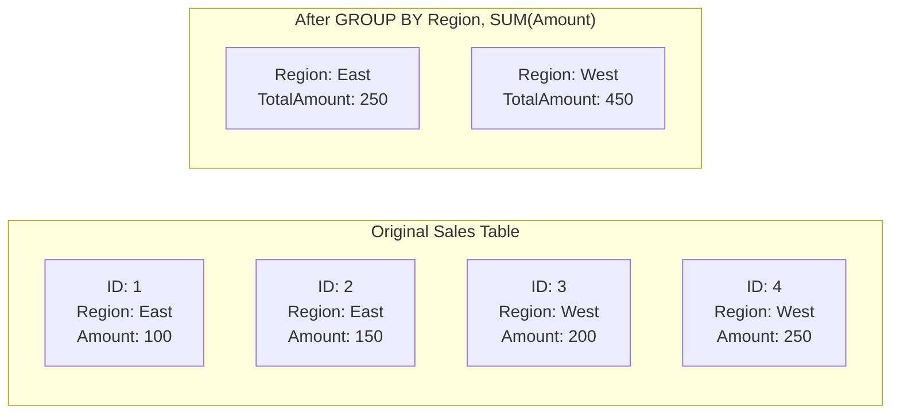

# 📝 SRE Database Training Module - Day 5: Quiz Questions on Aggregating Data with SQL Aggregate Functions

## 🧑‍🏫 Role
You are an expert database architect creating assessment questions for a Day 5 training module on SQL Aggregate Functions and Data Summarization. These questions will test knowledge from beginner to advanced/SRE-level concepts covered in the Day 5 material, with examples from various database systems (Oracle, PostgreSQL, SQL Server) where relevant.

## 🎯 Objective
Create a comprehensive set of quiz questions that:
- Tests understanding of the purpose and syntax of different aggregate functions (COUNT, SUM, AVG, MIN, MAX)
- Assesses knowledge of GROUP BY and HAVING clauses and when to use each appropriately
- Evaluates understanding of aggregation performance implications in database environments
- Examines how JOINs combine with aggregations for more complex analysis
- Provides progressive difficulty across all three learning levels
- Includes a variety of question types and formats
- Tests awareness of database-specific aggregation syntax and optimization techniques

## 📝 Quiz Structure Requirements

Create exactly 20 quiz questions with the following distribution:
- 7 Beginner-level questions (🔍)
- 7 Intermediate-level questions (🧩)
- 6 Advanced/SRE-level questions (💡)

Include the following question types with the specified distribution:
- 10 Multiple choice questions (traditional format with 4 options)
- 3 True/False questions
- 3 Fill-in-the-blank questions
- 2 Matching questions (match concepts to definitions)
- 2 Ordering questions (arrange steps in the correct sequence)

Each question must:
- Clearly indicate its difficulty level with the appropriate emoji
- Connect directly to content covered in the Day 5 material
- Be clearly written and unambiguous
- Include relevant context for scenario-based questions
- Include database-specific content where appropriate

## Question Type Formats

### Multiple Choice Format
```
## Question X: [Topic]
🔍/🧩/💡 [Difficulty Level]

[Question text]

A. [Option A]

B. [Option B]

C. [Option C]

D. [Option D]
```

### True/False Format
```
## Question X: [Topic]
🔍/🧩/💡 [Difficulty Level]

[Statement]

A. True

B. False
```

### Fill-in-the-Blank Format
```
## Question X: [Topic]
🔍/🧩/💡 [Difficulty Level]

Complete the following statement:

[Statement with ________ for the blank]

A. [Option A]

B. [Option B]

C. [Option C]

D. [Option D]
```

### Matching Format
```
## Question X: [Topic]
🔍/🧩/💡 [Difficulty Level]

Match each item in Column A with the appropriate item in Column B.

Column A:
1. [Item 1]
2. [Item 2]
3. [Item 3]
4. [Item 4]

Column B:
A. [Definition/Example A]
B. [Definition/Example B]
C. [Definition/Example C]
D. [Definition/Example D]
```

### Ordering Format
```
## Question X: [Topic]
🔍/🧩/💡 [Difficulty Level]

Arrange the following steps in the correct order:

A. [Step A]

B. [Step B]

C. [Step C]

D. [Step D]
```

## Quiz Content Focus Areas

1. **Aggregation Fundamentals**
   - Purpose of aggregate functions
   - Basic syntax for COUNT, SUM, AVG, MIN, MAX
   - Null handling in aggregations
   - When to use each aggregate function

2. **GROUP BY and HAVING Clauses**
   - Purpose and syntax of GROUP BY
   - Relationship between SELECT and GROUP BY columns
   - Purpose and syntax of HAVING
   - Difference between WHERE and HAVING clauses

3. **Aggregation Performance and Optimization**
   - Index impact on aggregation performance
   - Memory usage in large aggregations
   - Execution plan analysis for aggregation operations
   - Database-specific optimization techniques
   - Pre-aggregation strategies (materialized views, summary tables)

4. **Aggregation with JOINs**
   - Combining JOINs with GROUP BY
   - Order of operations
   - Performance considerations
   - Common use cases for joined aggregation

5. **Window Functions**
   - Difference between aggregate functions and window functions
   - Basic window function syntax (OVER, PARTITION BY)
   - Common window function use cases
   - Performance considerations for window functions

6. **CRUD Project Schema Design**
   - Incorporating aggregation capabilities into schema design
   - Indexing considerations for aggregation-heavy applications
   - Table structures that support efficient aggregation
   - Validating schema for aggregation use cases

## Question Distribution Requirements

Ensure a good distribution of questions across:
- All aggregate functions covered in Day 5 (COUNT, SUM, AVG, MIN, MAX)
- Different cognitive levels (recall, understanding, application, analysis)
- Database-specific vs. general relational database concepts
- SQL syntax vs. conceptual understanding
- Performance considerations vs. functionality
- Schema design considerations for the CRUD project

## Mermaid Diagram Generation Guidelines

When creating questions that involve Mermaid diagrams or when referring to diagrams from the training, follow these formatting rules to ensure proper rendering:

1. **Always Enclose Node Labels in Quotes**
   * If a node label has **parentheses** `( )`, **colons** `:`, or **HTML tags** like `<br/>`, wrap it in quotes:
   ```
   A["COUNT(*) = 5"]
   B["TABLE ACCESS FULL: SALES"]
   C["Line1<br/>Line2"]
   ```

2. **Use Self-Closing `<br/>` Tags**
   * For line breaks in node labels, use `<br/>` (with a slash) instead of `<br>`.
   * Keep them inside quotes: `["Line1<br/>Line2"]`.

3. **Subgraph Titles**
   * Always wrap subgraph titles in quotes:
   ```
   subgraph "Original Sales Table"
     S1["ID: 1<br/>Region: East<br/>Amount: 100"]
   end
   ```

4. **Use Separate Lines for Each Arrow or Connection**
   * Place each connection on its own line:
   ```
   A --> B
   B --> C
   ```
   * Avoid: `A --> B --> C`

5. **No Raw Text Immediately After `subgraph`**
   * Add nodes for text inside subgraphs instead of raw text:
   ```
   subgraph "My Subgraph"
     N["Some text"]
   end
   ```

6. **Avoid Ambiguous Characters in the Flow**
   * Keep characters like `#`, `?`, or additional punctuation inside quotes if needed.

7. **Simplify Complex Diagrams**
   * Break down complex relationships into simpler sections.
   * Test diagrams incrementally to ensure proper rendering.

Example of a correctly formatted Mermaid diagram for an aggregation question:



Consider including questions that ask learners to identify:
1. What the result set would look like for a specific aggregation operation (shown in a diagram)
2. Which SQL statement would produce a particular aggregated result set
3. How changing the GROUP BY clause would affect the result set
4. Which execution plan diagram represents the most efficient approach for an aggregation query

When creating diagram-based questions, ensure the diagrams are simple enough to be easily interpreted while still testing relevant aggregation concepts.

## Sample Question Examples

### Beginner (🔍) Example:
```
## Question X: COUNT Function
🔍 Beginner

What is the difference between COUNT(*) and COUNT(column_name)?

A. COUNT(*) counts all rows including NULL values, while COUNT(column_name) counts only non-NULL values in the column.

B. They are identical and will always return the same result.

C. COUNT(*) is faster because it doesn't need to check for NULL values.

D. COUNT(column_name) counts all rows including NULL values, while COUNT(*) counts only non-NULL values.
```

### Intermediate (🧩) Example:
```
## Question X: GROUP BY and HAVING
🧩 Intermediate

Given a table 'sales' with columns (sale_id, product_id, sale_date, amount), which SQL statement would return the total sales amount for each product that has more than $10,000 in total sales?

A. SELECT product_id, SUM(amount) FROM sales WHERE amount > 10000 GROUP BY product_id;

B. SELECT product_id, SUM(amount) FROM sales GROUP BY product_id HAVING amount > 10000;

C. SELECT product_id, SUM(amount) FROM sales GROUP BY product_id HAVING SUM(amount) > 10000;

D. SELECT product_id, SUM(amount) FROM sales WHERE SUM(amount) > 10000 GROUP BY product_id;
```

### Advanced/SRE (💡) Example:
```
## Question X: Aggregation Optimization
💡 Advanced/SRE

A query using GROUP BY on a non-indexed column is causing high CPU and memory usage. Which of the following would likely provide the BEST performance improvement?

A. Add a materialized view that pre-aggregates the data.

B. Use a window function instead of a GROUP BY clause.

C. Create an index on the GROUP BY column(s).

D. Use COUNT(*) instead of COUNT(column) to avoid NULL checking overhead.
```

DO NOT include the correct answers or explanations in the questions themselves. These will be provided in a separate answer key document.

## Invocations Statement
Generate a comprehensive set of 20 quiz questions to assess knowledge of Day 5 database training content focused on SQL Aggregate Functions (COUNT, SUM, AVG, MIN, MAX), GROUP BY and HAVING clauses, and the CRUD project schema finalization. Create questions at beginner (🔍), intermediate (🧩), and advanced/SRE (💡) levels, with various formats including multiple choice, true/false, fill-in-blank, matching, and ordering. Focus on aggregation fundamentals, GROUP BY and HAVING clauses, aggregation performance optimization, combining aggregations with JOINs, window functions, and schema design considerations for the CRUD project. Ensure all questions are clearly written, unambiguous, and directly relevant to the Day 5 material, with database-specific content where appropriate. Follow the Mermaid diagram formatting guidelines when creating or referencing diagrams in questions to ensure proper rendering.