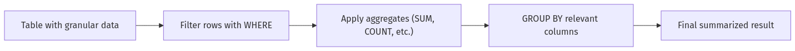
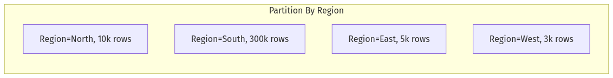

# **Day 5 Quiz**

## **(🔍) Beginner-Level Questions (1–7)**

---

### **Question 1 (🔍, Multiple Choice)**
**Topic:** Aggregation Concepts and Flow

Jin observes that “scanning all historical data for a single KPI number” led to severe performance issues. Which step best mitigates this in a typical aggregator workflow?

A. Use a CROSS JOIN to combine more tables, ensuring maximum coverage  
B. Always group by every column to reduce the final row count  
C. Apply a focused WHERE filter (e.g., last 30 days) before grouping  
D. Switch to a big FULL OUTER JOIN to catch all rows  

---

### **Question 2 (🔍, Multiple Choice)**
**Topic:** Basic Aggregate Functions

Which statement best describes how `COUNT(col)` differs from `COUNT(*)` according to Jin’s “Dashboard Engineer Toolkit” cheat sheet?

A. `COUNT(col)` includes NULL rows, while `COUNT(*)` excludes NULLs  
B. `COUNT(col)` counts only rows with non‐NULL values in that column, whereas `COUNT(*)` counts all rows  
C. `COUNT(col)` always requires a GROUP BY, while `COUNT(*)` never does  
D. `COUNT(col)` is for numeric columns only, while `COUNT(*)` is for strings  

---

### **Question 3 (🔍, True/False)**
**Topic:** WHERE vs. HAVING

Jin’s Principle #1 states that filtering should happen as early as possible to reduce overhead. True or false: The HAVING clause always applies **before** the rows are grouped, making it more efficient than WHERE.

A. True  
B. False  

---

### **Question 4 (🔍, Multiple Choice)**
**Topic:** SUM, AVG, MIN, MAX

Which scenario best illustrates Jin’s caution that you must ensure numeric data won’t overflow for a **SUM**?

A. Summing daily revenue that might exceed the data type max  
B. Finding the lowest order price with MIN  
C. Counting the number of logs in the last day  
D. Checking an address column’s character length  

---

### **Question 5 (🔍, Matching)**
**Topic:** Jin’s Aggregation Principles

Match each scenario in Column A to Jin’s aggregator principle from the day’s training in Column B.

Column A:  
1. A dashboard query calculates `COUNT(*)` for all rows ever, but only the last 3 months matter  
2. A team tries to find the earliest event time each day, but does a full table scan without indexes  
3. Developer wants an average, but half the data is NULL, skewing results  
4. A second developer considers using a window function but sees huge memory usage due to an uneven partition  

Column B:  
A. “MIN/MAX can leverage B-tree indexes for near-instant retrieval”  
B. “Filter partial data with WHERE, don’t aggregate entire history if unneeded”  
C. “Window functions are powerful, but large or skewed partitions cause memory bloat”  
D. “NULL can distort aggregator results – use COUNT(*) to gauge data coverage, or watch for skew”  

---

### **Question 6 (🔍, Fill-in-the-Blank)**
**Topic:** GROUP BY Essentials

Complete this statement from Jin’s training:

> “When using **GROUP BY**, you can’t select columns outside of the grouped fields or aggregates unless you use ________ to keep detail rows visible.”

A. an index  
B. a subquery  
C. a window function  
D. a CROSS JOIN  

---

### **Question 7 (🔍, Diagram-Based Multiple Choice)**
**Topic:** Simple Aggregation Flow

Examine the flowchart below illustrating a basic data-to-summaries process:





Which step is recommended if performance is still slow after applying a WHERE filter?

A. Add CROSS JOIN to double the data size  
B. Insert a HAVING clause to re-filter the final groups  
C. Create a suitable index on the columns used by WHERE or GROUP BY  
D. Remove the GROUP BY so no aggregation is done  

---

## **(🧩) Intermediate-Level Questions (8–14)**

---

### **Question 8 (🧩, Multiple Choice)**
**Topic:** Combining JOINs and Aggregation

Jin discusses combining aggregations with multi‐table joins. Which approach typically prevents excessive row scans?

A. Always do a FULL OUTER JOIN on all tables, then group  
B. Filter rows as early as possible with WHERE, then group  
C. Use CROSS JOIN on large tables, ensuring every row is included  
D. Convert all columns to text for simpler grouping  

---

### **Question 9 (🧩, True/False)**
**Topic:** HAVING vs. WHERE

True or false: HAVING can filter groups based on aggregate results, while WHERE cannot use aggregates in its condition.

A. True  
B. False  

---

### **Question 10 (🧩, Fill-in-the-Blank)**
**Topic:** Window Functions

Complete Jin’s statement about **window functions**:

> “A window function allows you to apply an aggregator like SUM or AVG over a specific ________, without collapsing all rows into one.”

A. constraint  
B. partition  
C. index  
D. table  

---

### **Question 11 (🧩, Matching)**
**Topic:** Aggregator Function Gotchas

Match each aggregator function in Column A to its potential “gotcha” from Jin’s cheat sheet in Column B.

Column A:  
1. `COUNT(*)`  
2. `SUM(amount)`  
3. `AVG(response_time)`  
4. `MIN(date_col)`  

Column B:  
A. Might ignore NULLs and produce a misleading average if many rows are NULL  
B. Potential numeric overflow if values are very large  
C. Ignores no rows; returns total row count  
D. Can use a B-tree index top leaf block if properly indexed, drastically speeding up retrieval  

---

### **Question 12 (🧩, Multiple Choice with Diagram)**
**Topic:** Window Function Partition Skew

Examine the partial diagram for a running total partition:





Why might Jin warn about “partition skew” in this scenario?

A. All regions have identical row counts, so no skew exists  
B. The “South” partition is vastly larger than others, causing memory overhead and slow processing  
C. Window functions automatically split large partitions across multiple servers  
D. East and West are forced into a CROSS JOIN with the other partitions  

---

### **Question 13 (🧩, Ordering)**
**Topic:** Dashboard Lag Troubleshooting

Arrange these steps from Jin’s **Dashboard Lag Troubleshooting Flowchart** in the correct order:

A. Check if large GROUP BY is present  
B. Consider partial pre-aggregations or materialized views  
C. Ensure an appropriate WHERE clause or index is used  
D. Inspect query complexity and verify aggregator approach  

---

### **Question 14 (🧩, Multiple Choice)**
**Topic:** Distinguishing WHERE vs. HAVING

Which example best demonstrates a correct use of **HAVING**?

A.
```sql
SELECT region, SUM(sales)
FROM orders
WHERE SUM(sales) > 1000
GROUP BY region;
```
B.
```sql
SELECT region, SUM(sales)
FROM orders
GROUP BY region
HAVING region = 'East';
```
C.
```sql
SELECT region, SUM(sales)
FROM orders
GROUP BY region
HAVING SUM(sales) > 1000;
```
D.
```sql
SELECT region, sales
FROM orders
HAVING sales > 1000;
```

---

## **(💡) Advanced/SRE-Level Questions (15–20)**

---

### **Question 15 (💡, Multiple Choice)**
**Topic:** Large-Scale Aggregations

Jin mentions advanced aggregator scenarios with “massive data sets.” Which strategy can reduce overhead for daily dashboards?

A. Full table scans on all historical data every time  
B. Partitioning the table by date and only aggregating recent partitions  
C. Removing all indexes to speed up insertion of new daily rows  
D. Using CROSS JOIN with a dimension table to ensure coverage  

---

### **Question 16 (💡, True/False)**
**Topic:** Materialized Views for Summaries

True or false: Jin suggests that if repeated aggregator queries still bog down the DB, creating a **materialized view** or partial aggregate can drastically improve performance on read‐heavy dashboards.

A. True  
B. False  

---

### **Question 17 (💡, Multiple Choice)**
**Topic:** Explaining Query Plans for Aggregations

When Jin checks an Oracle `EXPLAIN PLAN` for a grouped query, which operator indicates the DB is **sorting** the result set to perform grouping?

A. `SORT GROUP BY`  
B. `NESTED LOOPS`  
C. `HASH JOIN`  
D. `INDEX FAST FULL SCAN`  

---

### **Question 18 (💡, Fill-in-the-Blank)**
**Topic:** Null Handling in Aggregations

Complete this statement from Jin’s notes:

> “For `AVG()` or `SUM()`, rows with ________ values are excluded from the calculation, which may skew results if they represent missing data.”

A. negative  
B. numeric  
C. NULL  
D. distinct  

---

### **Question 19 (💡, Matching)**
**Topic:** Jin’s Aggregation Principles

Match each principle number in Column A to its brief summary in Column B, based on Jin’s repeated references.

Column A:  
1. Principle #1  
2. Principle #2  
3. Principle #3  
4. Principle #4  
5. Principle #5  

Column B:  
A. “Never COUNT what you can precompute – for frequent dashboards, partial aggregates help.”  
B. “Filter partial data with WHERE, so you don’t aggregate your entire history.”  
C. “MIN/MAX can exploit B-tree indexes.”  
D. “Window functions are powerful but watch partition skew.”  
E. “HAVING is only for post-group filters, while WHERE does initial filtering.”  

---

### **Question 20 (💡, Ordering)**
**Topic:** Fixing an Overloaded Aggregation

Jin typically follows these steps when a group-based query times out:

A. Add or refine a WHERE clause to limit unneeded rows  
B. If still slow, examine indexing or partitioning  
C. Check if the aggregator is unfiltered in the FROM clause  
D. Test final performance, consider materialized views if it’s still too big  

Arrange these in the logical sequence Jin usually recommends for production triage.

---

**End of Day 5 Quiz** – *No answers or solutions included.*