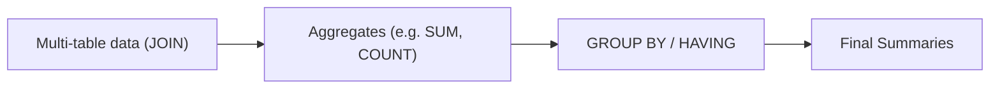
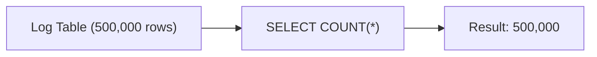
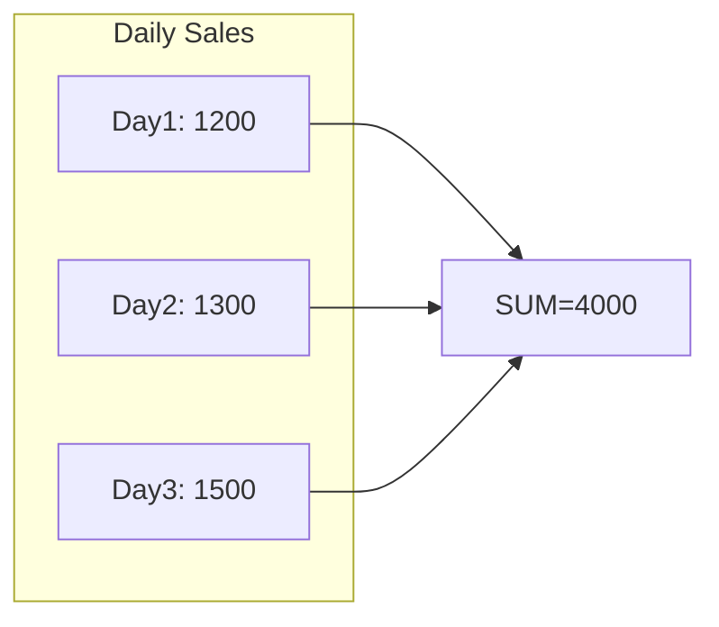
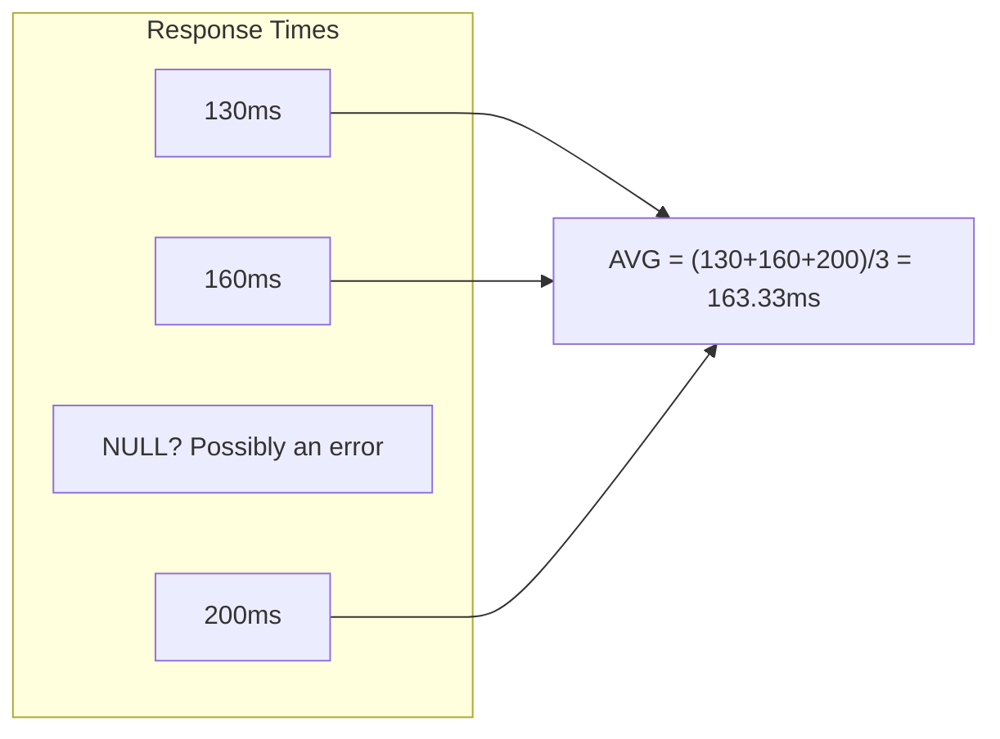
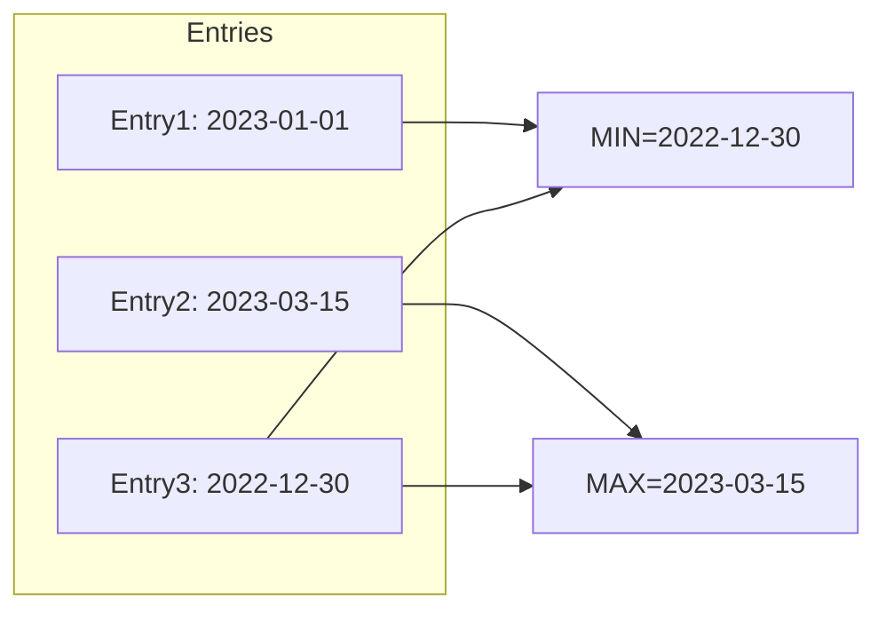
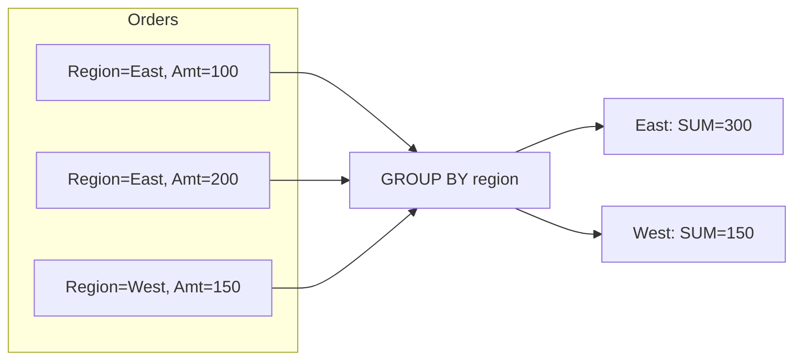
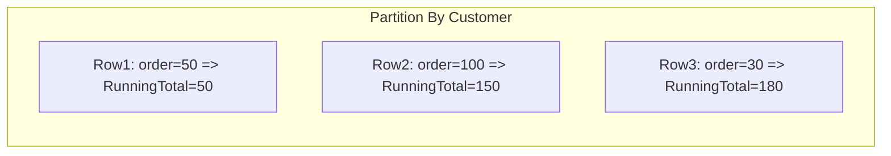
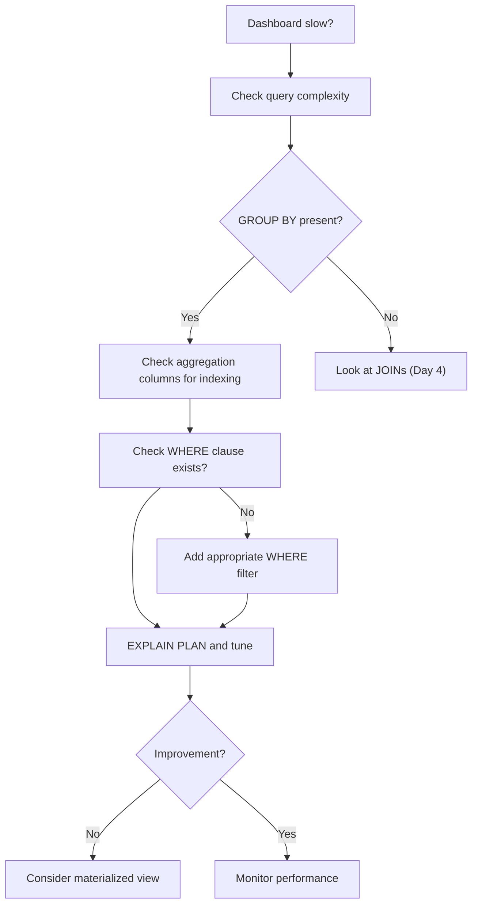
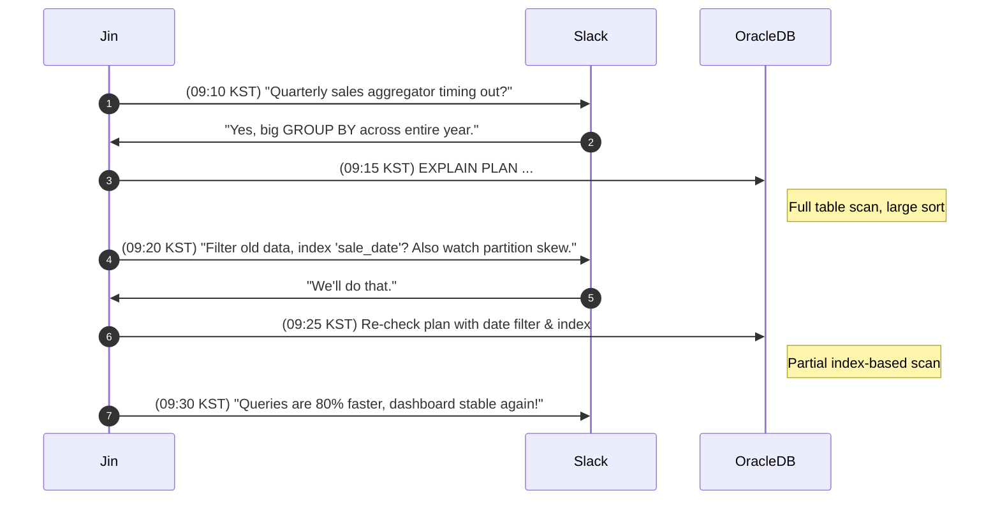
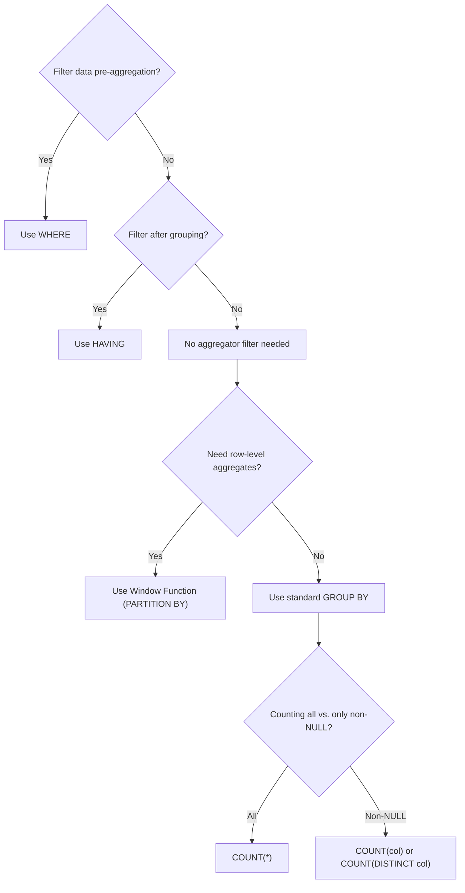

# **The Follow-the-Sun Chronicles: Day 5 – Jin & the Case of the Sluggish Dashboard**

> **Character Profile**  
> - **Name:** Jin  
> - **Location:** Seoul, South Korea (09:00 KST)  
> - **Role:** KPI analytics engineer & “dashboard whisperer”  
> - **Personality:** Calm, precise, data-obsessed. Gets annoyed at unfiltered aggregations that cause timeouts

---

## **1. Real-World Incident: Quarterly Review Dashboard Timeout**

**09:00 KST** – A critical quarterly review meeting. Our performance dashboard? **Timing out**. People scramble.  
I, Jin, trace the root cause: a monstrous, **unfiltered `GROUP BY`** scanning tens of millions of rows – all for a quick KPI. The database is hammered. Observing the fiasco, I realize: *We need proper aggregation strategies.* So, let’s explore each aggregate function, grouping techniques, window functions, and robust performance practices to avoid such meltdown.

---

## **2. Day 5 Overview (Jin’s Game Plan)**

### 🔍 **Beginner Objectives**
1. **Identify** each SQL aggregate function (`COUNT`, `SUM`, `AVG`, `MIN`, `MAX`) and their typical usage.  
2. **Write** basic `GROUP BY` queries to summarize data.  
3. **Explain** the difference between `WHERE` and `HAVING`.  
4. **Avoid** partial or random grouping fiascos that hamper dashboards.

### 🧩 **Intermediate Objectives**
1. **Combine** aggregates with JOINs for multi-table summaries.  
2. **Use** `HAVING` to filter out groups post-aggregation.  
3. **Interpret** how indexing can speed up grouped queries.  
4. **Understand** how NULL factors into `AVG` and other aggregates.

### 💡 **Advanced/SRE Objectives**
1. **Analyze** aggregator performance in Oracle with `EXPLAIN PLAN` and indexing.  
2. **Implement** advanced techniques like **Window Functions** without collapsing all rows.  
3. **Diagnose** large-scale aggregation bottlenecks (AWR/ASH).  
4. **Design** partitioning or partial pre-aggregation strategies for critical dashboards.

> **Jin’s Note**: *“A ‘Sluggish Dashboard’ is no joke. Our goal: Summaries must be swift, even at scale.”*

---

## **3. Aggregation Concepts and Flow**

We transform granular data into summarized insights using `COUNT`, `SUM`, `AVG`, `MIN`, `MAX`, plus grouping (`GROUP BY`) and filtering (`HAVING`). The trick: do it **efficiently** so dashboards never choke.

### The Data Flow


**Sloppiness** – e.g., scanning all historical data for a single number – kills performance. **Filter** early, index often, watch for large partitions.

---

## **4. Each Aggregate Function (Jin’s Detailed Look)**

Below is the **“Jin’s Dashboard Engineer Toolkit”** cheat sheet, then we’ll dive deeper with examples.

| **Function**   | **Returns**          | **Common Use Case**          | **Gotcha**                                            | **Performance Note**                                |
|----------------|----------------------|------------------------------|-------------------------------------------------------|------------------------------------------------------|
| **COUNT(*)**   | Row count           | User totals, row checks      | N/A                                                   | Typically fast with indexes                          |
| **COUNT(col)** | Non-NULL count      | Valid entries                | Excludes rows where `col` is NULL                    | Consider null presence, watch cardinality           |
| **SUM**        | Total of values     | Revenue calculations         | Numeric only, watch potential overflow               | Index filtering can reduce overhead                 |
| **AVG**        | Mean value          | Performance metrics, stats   | Ignores NULL, rounding issues possible               | May combine with `COUNT(*)` for deeper analysis      |
| **MIN**        | Minimum value       | Date ranges, price floors    | Returns NULL if all values are NULL, watch type diffs| B-tree indexes can deliver near-instant MIN lookups |
| **MAX**        | Maximum value       | Latest timestamp, thresholds | Type-specific ordering (string vs. numeric)          | Also leverages B-tree indexes for quick retrieval    |

### 4.1 COUNT

**Real-World Analogy**: Counting the total logs in a day.  

**Mermaid Visual**:

**SQL**:
```sql
SELECT COUNT(*)
FROM logs
WHERE log_date = TRUNC(SYSDATE);
```
**Performance**: *Index on `log_date` helps skip scanning old data.* No partial counting? Avoid scanning the entire table.

> **Jin’s Advice**: *“Use COUNT(*) for row totals if you actually want all rows. If you only care about distinct or non-NULL, specify that.”*

---

### 4.2 SUM

**Real-World Analogy**: Summing monthly revenue or total bandwidth usage.

**Mermaid**:

**SQL**:
```sql
SELECT SUM(amount) AS total_sales
FROM sales
WHERE sale_date >= ADD_MONTHS(SYSDATE, -1);
```
**Performance**: Large tables can hamper sums, especially if no `WHERE` filter. Indexing your date or partitioning by month helps.

> **Jin’s Advice**: *“Always check data type capacity. Don’t let integer overflow sabotage your sums.”*

---

### 4.3 AVG

**Analogy**: Average response time for user queries.

**Mermaid**:

**SQL**:
```sql
SELECT AVG(response_ms) AS avg_time
FROM service_metrics
WHERE event_date = TRUNC(SYSDATE);
```
**Ignoring NULL**: If half your data is NULL, the final average only uses the non-NULL set.

> **Jin’s Advice**: *“If you suspect many NULLs, compare `AVG()` with `COUNT(*)` to confirm data coverage. Null-laden metrics can be misleading.”*

---

### 4.4 MIN / MAX (Expanded)

**Real-World Analogy**: Finding earliest (MIN) or latest (MAX) timestamps, or the smallest/largest price in a product table.

**Mermaid**:

**SQL**:
```sql
SELECT MIN(timestamp_col) AS earliest, MAX(timestamp_col) AS latest
FROM events;
```
**Subtle Points**:
- If all rows have `NULL`, `MIN` and `MAX` return `NULL`.
- Sorting numeric vs. string can differ (strings sort lexicographically).

**Optimizer & Indexes**:
- With a **B-tree index** on `timestamp_col`, Oracle can pick the first leaf block for MIN or the last leaf block for MAX, retrieving them in near O(log n) time.
- This is drastically faster than scanning the entire table.

**Jin’s Anecdote**: *“We once had a daily ‘max event time’ query that took 5 minutes. Adding an index turned it into a 0.05-second query – the difference was just an index using the top or bottom leaf block.”*

> **Jin’s Advice**: *“MIN and MAX love B-tree indexes. Don’t do an entire table scan if you can skip to the first or last block.”*

---

## **5. GROUP BY & HAVING**

**Concept**: Group rows by certain columns; apply aggregates within each group.

**Mermaid**:

**SQL**:
```sql
SELECT region, SUM(amount) AS total_amt
FROM orders
GROUP BY region
HAVING SUM(amount) > 100;
```
**WHERE vs. HAVING**:  
- `WHERE`: filters before grouping.  
- `HAVING`: filters after.  

**Jin’s Principle #1**  
```
📏 Jin's Principle #1:
Filter early with WHERE if possible. Use HAVING only for conditions on aggregated values.
```

---

## **6. Window Functions: Aggregates Without Collapsing**

**Definition**: Like SUM or AVG, but each row remains visible. We define a **window** (partition) and possibly an ordering for row-based calculations (e.g., running totals).

**Mermaid** (example of a running total):

**SQL**:
```sql
SELECT 
   customer_id,
   order_id,
   SUM(order_amt) OVER (PARTITION BY customer_id ORDER BY order_date 
                        ROWS BETWEEN UNBOUNDED PRECEDING AND CURRENT ROW)
       AS running_total
FROM orders;
```
**Jin’s Anecdote**: *“I once partitioned by region, ignoring that ‘US’ had 90% of data. That single partition hammered the instance. Always check data distribution.”*

**When**: If you want a cumulative or row-specific aggregate.  
**Performance**: Potential memory overhead if partitions are huge. Check partition skew.

---

## **7. Performance Analysis (Before/After)**

### 7.1 Before: Unfiltered GROUP BY

```sql
EXPLAIN PLAN FOR
SELECT region, SUM(amount)
FROM big_orders
GROUP BY region;
```
Possible plan:
```
| Id | Operation        | Name    | Cost |
|  0 | SELECT STATEMENT |         | 800  |
|  1 |  SORT GROUP BY   |         |      |
|  2 |   TABLE ACCESS FULL BIG_ORDERS ...
```
**Issue**: Full table scan if you actually needed only recent data.

### 7.2 After: Filter + Index

```sql
EXPLAIN PLAN FOR
SELECT region, SUM(amount)
FROM big_orders
WHERE order_date >= SYSDATE - 30
GROUP BY region;

-- Then check plan
SELECT * FROM TABLE(DBMS_XPLAN.DISPLAY);
```
Revised plan:
```
| Id | Operation                             | Name                 | Cost |
|  0 | SELECT STATEMENT                      |                      | 220  |
|  1 |  SORT GROUP BY                        |                      |      |
|  2 |   INDEX RANGE SCAN B_ORDERS_DATE_IDX  | ...
```
**Result**: CPU usage down, partial scans. Query time from ~30s to 5s or less.  
**Key**: Filter first, ensure an index on `order_date`.

---

## **8. The Dashboard Lag Troubleshooting Flowchart**


**Observations**:  
- If no `GROUP BY`, the slowdown might come from large or unindexed JOIN logic.  
- If a `GROUP BY` is present, indexing or partial data restrictions are crucial.

---

## **9. Sequence Diagram: Jin Fixes Overloaded Aggregation**



---

## **10. Decision Tree: WHERE vs HAVING, GROUP BY vs PARTITION BY, COUNT(*) vs COUNT(col)**



---

## **11. Jin’s Aggregation Principles**

1.  
   ```
   📏 Jin's Principle #1:
   WHERE cuts data before grouping. HAVING is for post-group filters only.
   ```
2.  
   ```
   📏 Jin's Principle #2:
   If partial or short-term data suffices, don't aggregate entire history – filter early.
   ```
3.  
   ```
   📏 Jin's Principle #3:
   Never COUNT what you can precompute. For high-traffic dashboards, consider materialized or partial aggregates.
   ```
4.  
   ```
   📏 Jin's Principle #4:
   MIN/MAX can exploit B-tree indexes. One leaf block vs. scanning every row is huge.
   ```
5.  
   ```
   📏 Jin's Principle #5:
   Window functions are powerful, but watch partition skew – monstrous partitions sabotage memory.
   ```

---

## **12. Aggregation Function Cheat Sheet**  
*(“Jin’s Dashboard Engineer Toolkit”)*

| **Function**   | **Returns**         | **Common Use Case**        | **Gotcha**                                         | **Performance Note**                                   |
|----------------|---------------------|----------------------------|----------------------------------------------------|--------------------------------------------------------|
| **COUNT(*)**   | Row count          | Overall user totals        | N/A                                                | Fast with indexes; be mindful with large scans         |
| **COUNT(col)** | Non-NULL row count | Valid entries, no NULL     | Excludes NULLs, watch for column's null frequency | Potentially more overhead if column has many nulls     |
| **SUM**        | Total numeric val. | Revenue calculations       | Only numeric, watch for overflow                   | Filter if you can, index if there's a date/region col  |
| **AVG**        | Mean value         | Perf metrics, stats        | NULL excluded, might skew results                  | Might combine with COUNT(*) for completeness           |
| **MIN**        | Minimum value      | Earliest date, smallest #  | Returns NULL if all are NULL, type matters         | Exploits B-tree index top leaf block for fast retrieval|
| **MAX**        | Maximum value      | Latest timestamp, highest #| Type-specific ordering (string vs numeric)         | B-tree index bottom leaf block usage – extremely fast  |

---

## **13. Final SRE Performance Note**

- **Hash Aggregation** vs. **Sort Aggregation**: Oracle chooses the best approach based on stats.  
- **Memory**: Large group sets or wide partitions can cause massive memory usage or disk spills.  
- **Query Plans**: Check `EXPLAIN PLAN` for `SORT GROUP BY` or `HASH GROUP BY`.  
- **Indexing**: For repeated queries, indexing the grouping or filtering columns is vital.  
- **Materialized Views**: If performance is still sluggish, consider building partial aggregates or scheduled refresh.

---

## **14. Handoff to Fatima in Dubai – Day 6**

That’s **Day 5** from my vantage in Seoul. We’ve tackled the aggregator fiasco: how to harness `COUNT`, `SUM`, `AVG`, `MIN`, `MAX`, plus grouping, `HAVING`, window functions, and crucial performance steps. Tomorrow, **Fatima** in Dubai leads us into **Day 6**, diving into **user permissions and DB access control** – because even perfect dashboards matter little if no one can log in properly.

**—Jin**, concluding the “Sluggish Dashboard” saga. Let’s keep those queries efficient, partition distributions known, and we’ll avoid any next meltdown.

