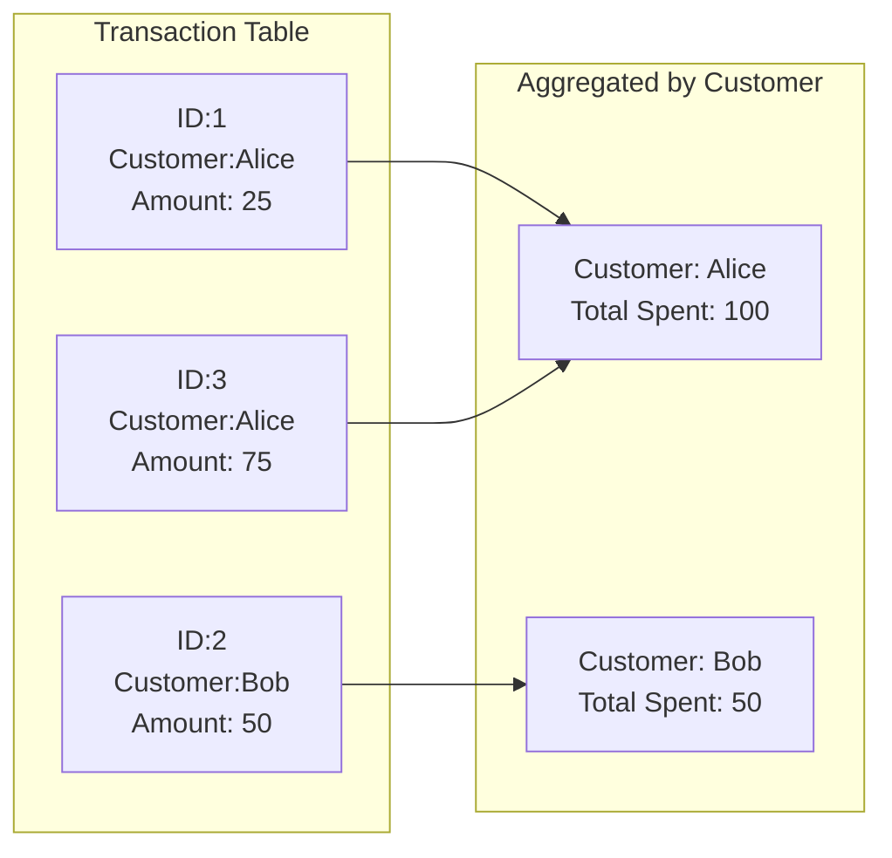
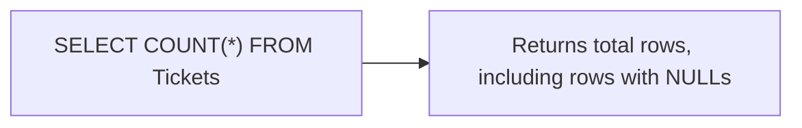
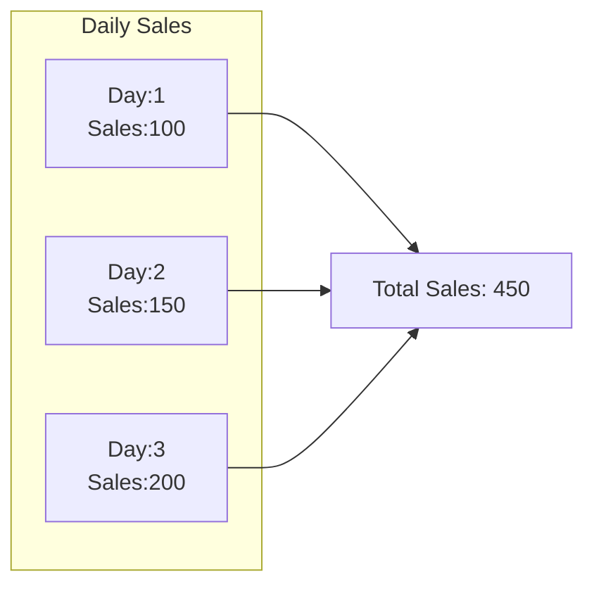
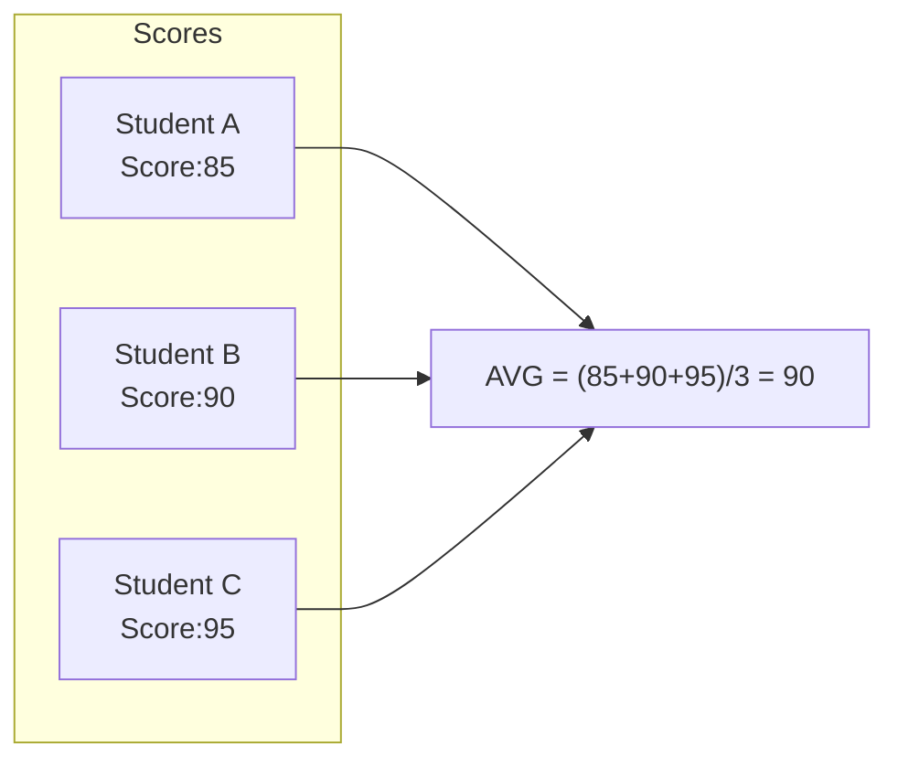
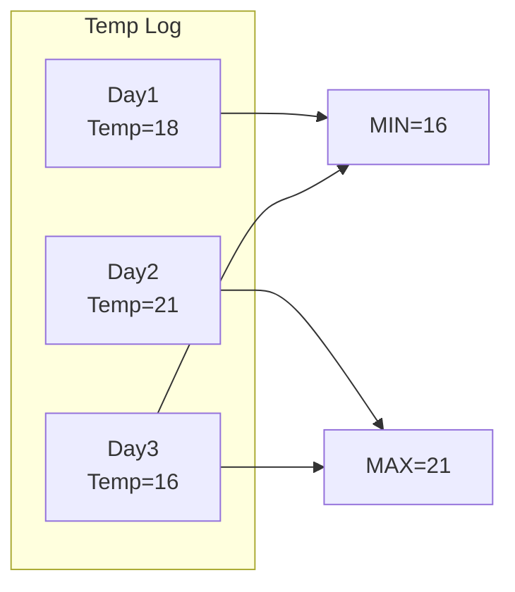
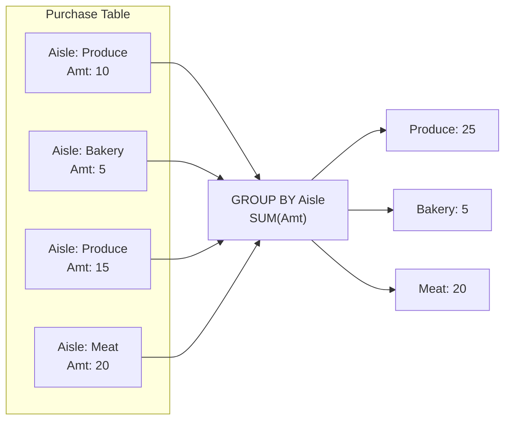
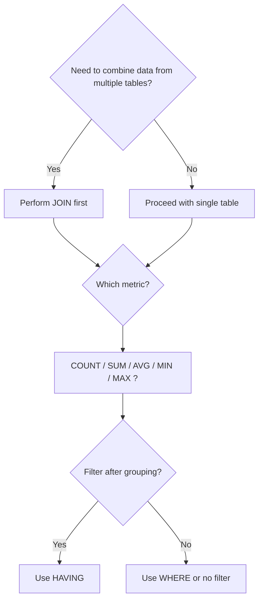

# 📊 SRE Database Training Module: Day 5  

**Aggregating Data — SQL Aggregate Functions & Data Summarization**  
*(Brick by Brick Learning Approach)*

---

## 🧩 Introduction

### Observe, Test, Evaluate, and Take Action

Welcome back! We’ve been emphasizing the “Observe, Test, Evaluate, and Take Action” mantra throughout Days 1–4. Today, we continue applying this approach to **SQL Aggregation**, where you’ll systematically:

1. **Observe** your data and the patterns it forms.  
2. **Test** aggregation queries to confirm they behave as expected.  
3. **Evaluate** performance implications (e.g., indexing, query plans).  
4. **Take Action** to optimize queries and glean actionable insights.

### Why Aggregation Matters

Aggregations turn large sets of granular data into understandable summaries—crucial for:

- **Summary Reporting** (e.g., total sales per region)
- **Analytics & KPI Tracking** (e.g., monthly average customer satisfaction rating)
- **Dashboards & Business Intelligence** (e.g., real-time analytics with roll-ups)

Imagine a real-world support scenario where management needs a quick view of the **highest-selling product categories**. Instead of scanning thousands of rows, you run aggregated queries with a `GROUP BY` to quickly retrieve totals. That’s the power of aggregation0

### Visual Concept Map

Below is a simple **Mermaid** diagram showing how **JOINs** (from Day 4) combine data from multiple tables, while **Aggregate Functions** summarize that combined data:


**Key Point**: First, combine the data you need with JOINs. Then, use **aggregation** to produce meaningful summaries.

---

## 🎯 Learning Objectives by Tier

### 🔍 Beginner

1. Understand the basic purpose of aggregation (why use SUM, COUNT, etc.).  
2. Identify the difference between `COUNT(*)` and `COUNT(column)`.  
3. Write simple `GROUP BY` queries to summarize data.  
4. Avoid common mistakes when introducing aggregation into queries.

### 🧩 Intermediate

1. Combine **JOIN** statements with **GROUP BY** for multi-table summaries.  
2. Use the **HAVING** clause to filter grouped results.  
3. Interpret basic execution plans for aggregated queries.  
4. Understand NULL-handling in aggregate functions (e.g., `AVG` ignoring NULL).

### 💡 Advanced / SRE

1. Optimize queries with appropriate indexes for aggregation.  
2. Evaluate database-specific performance features (e.g., SQL Server’s indexed views).  
3. Implement advanced techniques like **Window Functions** without collapsing rows.  
4. Diagnose and troubleshoot large-scale aggregation bottlenecks in production.

---

## 📚 Core Concepts

For each key concept, we provide:

1. **Beginner Analogy**  
2. **Visual Representation** (Mermaid diagrams)  
3. **Technical Explanation**  
4. **Support/SRE Application**  
5. **System Impact**  
6. **Common Misconceptions**  
7. **Database Implementation** (Oracle, PostgreSQL, SQL Server)

---

## 💻 Day 5 Concept Breakdown

### 1. Aggregation Fundamentals

**Beginner Analogy**: Think of **aggregations** like summarizing everyone’s grocery bills at the end of the day to see total sales.

**Visual Representation**  



**Technical Explanation**  

- **Purpose**: Summarize rows into meaningful metrics.  
- **Syntax Basics**: Use functions like `COUNT`, `SUM`, `AVG`, `MIN`, `MAX` often with `GROUP BY`.  
- **When to Use**: Anytime you need aggregated metrics, from simple totals to advanced analytics.

**Support/SRE Application**  

- **Troubleshooting**: Aggregation queries often used to quickly isolate abnormal spikes (e.g., highest error counts).  

**System Impact**  

- Aggregations can be resource-intensive; consider indexing or partial pre-aggregations.  

**Common Misconceptions**  

- **Misconception**: “You can use columns in `SELECT` without grouping them.”  
  - **Reality**: All non-aggregate columns must appear in `GROUP BY`.  

**Database Implementation**  

- **Oracle**: Traditional `GROUP BY` usage.  
- **PostgreSQL**: Allows grouping by expressions; also supports advanced windowing.  
- **SQL Server**: Similar approach; can take advantage of indexed views for pre-aggregated data.

---

### 2. COUNT Function

**Beginner Analogy**: Counting the number of tickets in a queue.  

- `COUNT(*)`: Counts all rows.  
- `COUNT(column)`: Excludes NULL in that column.  
- `COUNT(DISTINCT column)`: Counts unique values.

**Visual Representation**  



**Technical Explanation**  

- `COUNT(*)` is typically optimized for row counting.  
- `COUNT(column)` will not include rows where `column` is NULL.  
- `COUNT(DISTINCT column)` requires more overhead—unique checks or a sort operation.

**Support/SRE Application**  

- Determining how many error logs or transactions occurred.  

**System Impact**  

- Large table counts can be slow; database metadata or approximate counts might be used for huge tables.  

**Common Misconceptions**  

- “`COUNT(*)` is always the same as `COUNT(column)`.” Not if `column` has NULLs.

**Database Implementation**  

- **Oracle**: `COUNT(*)` is very common; be mindful if using synonyms or partitioned tables.  
- **PostgreSQL**: Offers approximate counting extensions (e.g., `estimable_count`).  
- **SQL Server**: Similar usage; can also leverage partitioning.

---

### 3. SUM Function

**Beginner Analogy**: Summing your monthly bills to see total expenses.  

**Visual Representation**  



**Technical Explanation**  

- **Syntax**: `SELECT SUM(column) FROM table`.  
- **NULL Handling**: `SUM` ignores NULL.  
- **Precision Considerations**: Might require data type changes if the sum exceeds integer limits.

**Support/SRE Application**  

- Summing error counts over specific periods.  
- Summing bandwidth usage for an environment.

**System Impact**  

- Large sums can trigger numeric overflow if the column type is small.

**Common Misconceptions**  

- Using `SUM` on non-numeric columns or ignoring potential overflow.

**Database Implementation**  

- **Oracle**: Offers data types like `NUMBER` to handle large sums.  
- **PostgreSQL**: Watch for integer overflow, might need `BIGINT`.  
- **SQL Server**: `NUMERIC` or `DECIMAL` recommended for precise sums.

---

### 4. AVG Function

**Beginner Analogy**: Calculating the average test score in a classroom.  

**Visual Representation**  



**Technical Explanation**  

- **Syntax**: `SELECT AVG(column)`.  
- **NULL Handling**: Rows with NULL are excluded from the average.  
- **Precision**: Watch for rounding/truncation.

**Support/SRE Application**  

- Monitoring average response times or average CPU usage.

**System Impact**  

- Overly large data sets can cause performance overhead.  

**Common Misconceptions**  

- “AVG includes NULL as 0.” In reality, NULL rows are omitted from the calculation.

**Database Implementation**  

- **Oracle**: Might store partial results with high precision (FLOAT or NUMBER).  
- **PostgreSQL**: Cast to numeric for precise decimals.  
- **SQL Server**: Typically returns a floating type if not cast.

---

### 5. MIN and MAX Functions

**Beginner Analogy**: Finding the **lowest** or **highest** temperature logged in a week.  

**Visual Representation**  



**Technical Explanation**  

- **Syntax**: `SELECT MIN(column), MAX(column)`.  
- **Data Types**: Works on numeric, date/time, and string. For strings, “min” is the lexicographically smallest.  

**Support/SRE Application**  

- Finding earliest or latest event times, smallest or largest usage metrics.

**System Impact**  

- Generally less overhead, but indexing can help if searching for min/max of sorted data.

**Common Misconceptions**  

- Overlooking non-numeric data usage for `MIN` and `MAX`.  

**Database Implementation**  

- Most databases handle min/max similarly, but watch for string collations in each system.

---

### 6. GROUP BY Clause

**Beginner Analogy**: Grouping groceries by aisle to sum or count items in each aisle.  

**Visual Representation**  



**Technical Explanation**  

- **Syntax**:  

  ```sql
  SELECT column1, AGG_FUNC(column2)
  FROM table
  GROUP BY column1;
  ```  

- **Relationship to Aggregates**: Every non-aggregate column in `SELECT` must appear in `GROUP BY`.  
- **Multiple Columns**: You can group by multiple columns or expressions.

**Support/SRE Application**  

- Summaries by category, region, or status code when analyzing logs.

**System Impact**  

- **Hash Aggregation** vs. **Sort Aggregation** in execution plans can affect performance.  

**Common Misconceptions**  

- Using columns in `SELECT` that are not in `GROUP BY` or in an aggregate function.

**Database Implementation**  

- Some DBs allow grouping by expressions (e.g., `GROUP BY UPPER(column)` in PostgreSQL).

---

### 7. HAVING Clause

**Beginner Analogy**: Filtering out groups after they’ve been formed. Like ignoring “aisles” that have too few items purchased.

**Technical Explanation**  

- **Syntax**:

  ```sql
  SELECT column1, SUM(column2)
  FROM table
  GROUP BY column1
  HAVING SUM(column2) > 100;
  ```  

- **Difference from WHERE**: `HAVING` filters after grouping; `WHERE` filters before grouping.

**Support/SRE Application**  

- Only display categories with aggregated values above or below certain thresholds.

**System Impact**  

- If many rows are grouped only to be discarded in `HAVING`, consider moving conditions to `WHERE` first.

**Common Misconceptions**  

- “You can use aggregate functions in `WHERE`.” Only `HAVING` supports aggregated conditions.

**Database Implementation**  

- Broadly similar in all major SQL dialects.

---

### 8. Aggregate Functions with JOINs

**Key Idea**: Combine multiple tables (Day 4) then apply aggregations.  

**Example**: Summarize total order amounts by customer.

```sql
SELECT c.customer_name, SUM(o.order_total) AS total_spent
FROM customers c
JOIN orders o ON c.customer_id = o.customer_id
GROUP BY c.customer_name;
```

**Support/SRE Application**  

- Aggregated results from joined data to measure business metrics, e.g., average resolution time by agent across multiple tables.

---

### 9. Window Functions Introduction

**Definition**: Aggregate *over partitions* (subsets of rows) **without collapsing** the rows.  

- Example: Running total, ranking, moving averages.

```sql
SELECT
  order_id,
  order_date,
  SUM(order_total) OVER (PARTITION BY customer_id ORDER BY order_date
                         ROWS BETWEEN UNBOUNDED PRECEDING AND CURRENT ROW) 
       AS running_total
FROM orders;
```

**SRE Context**: Window functions give advanced analytics (like a rolling average of CPU usage) without losing detail.

---

### 10. Common Aggregation Patterns

1. **Running Totals**  
   - E.g., ongoing sum of daily transactions.  
2. **Percentages of Totals**  
   - E.g., each category’s percentage of overall sales.  
3. **Rankings**  
   - E.g., top 5 usage counts by user or region.

**Beginner Tip**: Each pattern might use either a standard aggregate with `GROUP BY` or a window function with `PARTITION BY`.

---

## 🔄 Aggregation Selection Process in Practice

### Decision Framework

A typical workflow:  

1. **Identify** needed metric (count, sum, average, etc.).  
2. **Choose** the grouping columns.  
3. **Determine** if filtering is needed before or after grouping.  
4. **Decide** whether you need a window function or standard aggregate.

**Visual Workflow (Mermaid)**  



---

## 🛠️ Optimization Techniques for Aggregation Queries

1. **Index Usage**: Index columns used in GROUP BY to speed up sorts/aggregations.  
2. **Memory Considerations**: Large queries can spill to disk if insufficient memory.  
3. **Execution Plan Analysis**: Compare **hash aggregation** vs. **sort + group**.  
4. **Database-Specific Features**:  
   - Oracle Materialized Views  
   - PostgreSQL partial indexes  
   - SQL Server Indexed Views  

---

## 🔍 Impact of Aggregations on Performance

- **Larger Data Sets** => More memory or sorting needed.  
- **Complex Aggregations** => Potential CPU spikes.  
- **SRE Approach**: Monitor CPU, memory, disk usage, and query latencies. Use these metrics for continuous improvement.

---

## 🔨 Hands-On Exercises

### 🔍 Beginner (3 Exercises)

1. **Basic COUNT**: Count total rows in a `customers` table; differentiate `COUNT(*)` vs. `COUNT(email)`.  
2. **Simple SUM**: Calculate total sales from an `orders` table.  
3. **Basic GROUP BY**: Group the `orders` table by `region` and find total sales per region.

### 🧩 Intermediate (3 Exercises)

1. **GROUP BY with JOIN**: Join `customers` & `orders`, summing each customer’s total.  
2. **HAVING**: Filter customers whose total purchases exceed \$1000.  
3. **AVG with NULL**: Explore how `AVG` behaves when the `amount` column has NULL.

### 💡 Advanced / SRE (3 Exercises)

1. **Indexing**: Compare performance of a grouped query with & without an index.  
2. **Window Functions**: Compute a running total of sales per customer.  
3. **Execution Plan Analysis**: Identify potential bottlenecks with large data sets.

---

## 🚧 Troubleshooting Scenarios (3 Realistic Cases)

1. **Missing Rows in Aggregation**  
   - **Symptom**: `COUNT(column)` shows fewer rows than expected.  
   - **Cause**: Some rows have `NULL` in that column.  
   - **Diagnostic**: Compare `COUNT(*)` vs. `COUNT(column)`.  
   - **Resolution**: Check for `NULL` or switch to `COUNT(*)`.

2. **Slow Grouped Query**  
   - **Symptom**: `GROUP BY region` is taking too long.  
   - **Cause**: No index, large dataset, excessive sorting.  
   - **Diagnostic**: Check execution plan, consider partitioning.  
   - **Resolution**: Add an index on `region`, or pre-aggregate.

3. **Incorrect HAVING Usage**  
   - **Symptom**: Query error saying “invalid use of group function.”  
   - **Cause**: Trying to filter aggregated data with `WHERE` instead of `HAVING`.  
   - **Diagnostic**: Move aggregated filter into `HAVING`.  
   - **Resolution**: Correct your query structure.

---

## ❓ Frequently Asked Questions

### 🔍 Beginner FAQs (3)

1. **“What’s the difference between `COUNT(*)` and `COUNT(column)`?”**  
   `COUNT(*)` counts rows (including rows with NULL in that column). `COUNT(column)` excludes NULL values.  

2. **“Can I use `GROUP BY` without an aggregate function?”**  
   Technically yes, but it’s usually not meaningful unless you’re grouping to identify distinct rows.  

3. **“Do I have to list every column in `GROUP BY`?”**  
   Yes—any non-aggregated column must be in the `GROUP BY` to avoid ambiguity.

### 🧩 Intermediate FAQs (3)

1. **“When do I use `WHERE` vs. `HAVING`?”**  
   Use `WHERE` to filter rows before grouping. Use `HAVING` for conditions based on aggregated values.  

2. **“How do I handle multiple `GROUP BY` columns?”**  
   List them all:  

   ```sql
   SELECT region, product, SUM(sales)
   FROM orders
   GROUP BY region, product;
   ```  

3. **“Why is my grouped query slow in production but fine locally?”**  
   Differences in data volume, indexing, or resource constraints can cause major performance variations.

### 💡 Advanced/SRE FAQs (3)

1. **“How do I identify if a query is CPU or I/O bound?”**  
   Check execution plans, system metrics, wait events (e.g., `db file scattered read` in Oracle).  

2. **“Are materialized views a solution for heavy aggregations?”**  
   Yes, they can pre-aggregate data for faster lookups, but require refresh strategies.  

3. **“How do I manage large-scale real-time aggregation?”**  
   Consider streaming solutions, partial aggregations, or specialized data systems (e.g., columnar stores).

---

## 🔥 SRE-Specific Scenario

**Incident**: Aggregation Operation Causing Performance Degradation  

- **Situation**: A nightly job that sums daily transactions across 10 million rows in `orders` table. Suddenly, it runs for hours instead of minutes.  
- **Monitoring**: CPU near 100%, IO wait times soared, DB locks.  
- **Investigation**:
  1. Check execution plan—identified missing index on `order_date`.  
  2. Found `GROUP BY` step performing a large sort.  
  3. Possibly a new data spike or invalid statistics.  
- **Action**:
  - Update table statistics.  
  - Create index on `order_date`.  
  - Consider partitioning or partial aggregations.  
- **Result**: Query time reduced from 3 hours to under 15 minutes.

**SRE Principles**: Always monitor growth trends, plan indexes or partition strategies for high-throughput systems, and keep statistics fresh.

---

## 🧠 Key Takeaways

1. **Core Aggregation Concepts**: COUNT, SUM, AVG, MIN, MAX—and their impact on data summarization.  
2. **Best Practices**: Always specify all non-aggregated columns in `GROUP BY`, filter aggregated results with `HAVING`, consider indexing.  
3. **Database-Specific Notes**: Each RDBMS has unique features (partitioning, materialized views).  
4. **Performance**: Big queries can overload CPU/memory—analyze execution plans, optimize indexes.  
5. **Pitfalls**: Confusing `WHERE` vs. `HAVING`, ignoring NULL, or improperly handling large numeric sums.

---

## 🚨 Career Protection Guide for Aggregation Operations

1. **High-Risk Aggregations**: Summations over huge datasets, repeated multiple times daily.  
2. **Query Review**: Have queries peer-reviewed for index usage, partition strategies.  
3. **Testing**: Test new/modified aggregation queries on staging with realistic data volumes.  
4. **Communication**: Inform stakeholders of major changes to large-scale queries.  
5. **Documentation**: Keep a record of query changes, rationale, expected performance.

---

## 🔮 Preview of Next Day’s Content (Day 6)

On **Day 6**, we’ll dive into **Basic DB Administration**, specifically user accounts, permissions, and privileges. You’ll see how knowledge of aggregations aids in database administration through monitoring usage patterns and system performance metrics.  

---

## 📝 CRUD Project: Schema Finalization

- **Incorporating Aggregation**: Decide which fields need indexing to support future aggregations (e.g., `order_date`, `region`).  
- **Sample Schema**:

  ```sql
  CREATE TABLE orders (
    order_id      INT PRIMARY KEY,
    customer_id   INT,
    order_date    DATE,
    order_total   DECIMAL(10,2),
    -- Additional fields
  );
  ```

  Consider adding an index:  

  ```sql
  CREATE INDEX idx_orders_order_date ON orders(order_date);
  ```

- **Validation Checklist**:
  1. Confirm data types can handle the largest aggregation results.  
  2. Ensure frequently grouped columns are indexed.  
  3. Plan for partial or incremental data loads if data volumes are large.

- **Next Steps**: Use this schema to build out further CRUD functionality, ensuring you have the foundation for queries and reporting.

---

# Conclusion

Congratulations on completing **Day 5**! Today, you explored SQL aggregations—**COUNT, SUM, AVG, MIN, MAX**—and the power of `GROUP BY` and `HAVING`. You learned how to pair aggregations with JOINs, handle NULLs, and optimize performance for large data sets. As you move to Day 6, keep practicing these techniques and pay close attention to how aggregation usage shapes database adsions. citeturn0file0

Remember: **Observe, Test, Evaluate, and Take Action**. This cycle applies to every step—whether you’re designing the schema, tuning queries, or diagnosing a production slowdown.  

Stay curious, keep iterating, and you’ll continue to evolve as both a Database and SRE professional!

---
