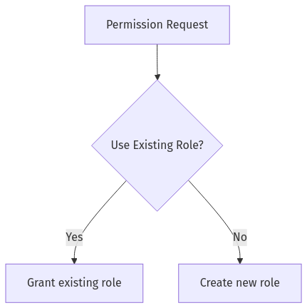

# **Day 6 Quiz – Answer Sheet**  
Below is a comprehensive answer key for the **Day 6 Quiz** on Fatima’s “Fortress of Access Control.” Each answer follows the requested format, providing the correct choice, explanations, additional insights, and an SRE perspective. No external citations or references are included.

---

## **Answer 1: System vs. Object Privileges**  
🔍 Beginner | Multiple Choice

**Question:**  
Fatima likens system privileges to “master keys” and object privileges to “room keys” in her Fortress of Access Control. Which statement best embodies that analogy?

A. System privileges grant broad, database-wide actions, whereas object privileges apply only to specific tables, views, or procedures.  
B. Object privileges are always more powerful than system privileges.  
C. Both system and object privileges allow only read operations.  
D. System privileges restrict all changes to a single table.

**Correct Answer:** A

**Explanation:**  
System privileges are high-level capabilities spanning the entire database (e.g., creating users or dropping schemas), comparable to master keys. Object privileges govern specific objects, such as granting SELECT on a particular table, akin to a single room key. Limiting privileges to the necessary scope prevents unintentional damage and adheres to Fatima’s “Fortress of Access Control” mindset. This approach keeps novices from accidentally performing disruptive operations and encourages disciplined privilege allocation.

**Why other options are incorrect:**  
- **B:** Object privileges are narrower in scope, not more powerful.  
- **C:** Privileges can include write, create, or drop capabilities, not just read.  
- **D:** System privileges are broader, not restricted to one table.  

**Database Comparison Note:**  
In Oracle, system privileges (e.g., CREATE USER) affect the entire system, while object privileges (e.g., SELECT on a table) apply to specific objects. Postgres uses a similar concept, though the privilege nomenclature can differ slightly.

**Knowledge Connection:**  
Fatima’s real-world meltdown story underscores the importance of carefully managing broad privileges.

**SRE Perspective:**  
From an SRE standpoint, granting broad privileges can easily compromise reliability if a user unintentionally issues high-impact commands.

**Additional Insight:**  
Always review who holds system privileges, especially in production, to reduce potential chaos.

---

## **Answer 2: Fatima’s Over-Zealous Cleanup Incident**  
🔍 Beginner | Multiple Choice

**Question:**  
In Fatima’s real-life example, a read-only service account lost `SELECT` privileges on a crucial table, causing chaos. What primarily caused this meltdown?

A. A user typed an incorrect SQL query.  
B. Overly strict password policy locked out the account.  
C. A well-intentioned but poorly monitored privileges cleanup revoked key permissions.  
D. The read-only user was promoted to a superuser role.

**Correct Answer:** C

**Explanation:**  
Fatima describes how an over-zealous privileges cleanup inadvertently removed essential SELECT permissions from a critical read-only service account. Although intended to tighten security, the cleanup lacked proper auditing and oversight, causing a production meltdown. This incident reflects Fatima’s focus on controlled processes and the principle that any privilege modification carries significant operational risk.

**Why other options are incorrect:**  
- **A:** A single user query error wouldn’t generally revoke privileges.  
- **B:** A strict password policy might lock an account but wouldn’t remove privileges.  
- **D:** Promotion to superuser is a different scenario and was not the actual cause.  

**Database Comparison Note:**  
Regardless of the database system, an unplanned revoke of a needed privilege can break applications immediately.

**Knowledge Connection:**  
This ties into Fatima’s cautionary tales about balancing minimal permissions with the risk of inadvertently revoking necessary privileges.

**SRE Perspective:**  
Reliability suffers if maintenance tasks remove core account rights without checks or rollback plans.

**Additional Insight:**  
Implement change control procedures for privilege modifications, including robust logging and pre-deployment reviews.

---

## **Answer 3: Fatima’s Rule #1**  
🔍 Beginner | Multiple Choice

**Question:**  
Which principle is most consistent with Fatima’s Rule #1 regarding privileges?

A. Always give novices the broadest privileges so they can learn faster.  
B. When in doubt, grant system privileges so no one is blocked.  
C. Grant object-specific keys over system master keys to minimize meltdown vectors.  
D. Audit logs are optional if roles are used.

**Correct Answer:** C

**Explanation:**  
Fatima’s Rule #1 states: “Always prefer object-specific keys over system master keys.” By granting object-level privileges, you limit the scope of potential damage if a user misuses or accidentally triggers damaging commands. It enforces the principle of least privilege and helps keep production environments stable.

**Why other options are incorrect:**  
- **A:** Broad privileges for novices is risky and contradicts least privilege.  
- **B:** System privileges for everyone can cause enormous vulnerabilities.  
- **D:** Audit logs remain crucial even when roles are used.  

**Database Comparison Note:**  
Both Oracle and Postgres support object-level privileges (e.g., `GRANT SELECT ON table`) rather than system-wide grants.

**Knowledge Connection:**  
Limiting meltdown vectors is a recurring theme in Fatima’s “Fortress” approach.

**SRE Perspective:**  
Fine-grained privileges maintain reliability by reducing the chance of critical incidents triggered by less-experienced users.

**Additional Insight:**  
Regularly review who truly needs system-level capabilities, and convert them to object-level privileges if possible.

---

## **Answer 4: Monitoring & Auditing Impact**  
🔍 Beginner | True/False

**Question:**  
Statement: Fatima claims that having no audit logs is harmless, as it frees up database resources for real workloads.

A. True  
B. False

**Correct Answer:** B (False)

**Explanation:**  
Fatima stresses that “no logs => no accountability => meltdown is unstoppable.” Disabling auditing may save minimal resources but leaves you blind to suspicious or harmful activities. Proper audit logs enable faster incident resolution and maintain system reliability by identifying the root cause of changes or performance issues.

**Database Comparison Note:**  
Oracle Fine-Grained Auditing or Postgres pgaudit is standard for capturing granular logs. Skipping these is universally ill-advised.

**Knowledge Connection:**  
Fatima’s meltdown stories illustrate how logs provide the only trail to diagnose unexpected revokes or queries.

**SRE Perspective:**  
In an SRE context, logs are essential for root cause analysis. Lack of auditing undermines reliability and complicates on-call triage.

**Additional Insight:**  
Even if performance is a concern, logs can be filtered or stored externally rather than disabled outright.

---

## **Answer 5: Basic “Fortress” Perspective**  
🔍 Beginner | Fill-in-the-Blank

**Question:**  
Complete the following statement aligned with Fatima’s fortress metaphor:  
“In this fortress, an ________ is granted read-only keys to certain floors, while an ‘AppAdmin’ can open more sensitive areas.”

A. DBA intern  
B. Analyst role  
C. dev_intern  
D. performance_sheriff

**Correct Answer:** B – **Analyst role**

**Explanation:**  
In Fatima’s fortress, an analyst typically needs read-only access for reporting or data analysis but not the broader privileges that “AppAdmin” might require to modify or manage critical applications. This arrangement reflects least privilege, granting only the minimal scope needed.

**Why other options are incorrect:**  
- **A:** A DBA intern might have broader privileges if they assist with administration.  
- **C:** A dev_intern is more developer-focused, not necessarily read-only.  
- **D:** A performance_sheriff is not a standard role name and doesn’t align with the fortress analogy.  

**Database Comparison Note:**  
In different DB systems, roles might be called “report_reader” or “reporting,” but the concept is the same: limited read privileges.

**Knowledge Connection:**  
This question directly references Fatima’s frequent use of roles like `reporting` to separate read vs. write access.

**SRE Perspective:**  
Granting each role only necessary privileges helps preserve performance and reliability by preventing accidental write or destructive actions.

**Additional Insight:**  
Always clarify role names to reflect their true function, aiding both security reviews and onboarding.

---

## **Answer 6: Least Privilege for a BI User**  
🔍 Beginner | Multiple Choice

**Question:**  
Which scenario best exemplifies Fatima’s “least privilege” principle for a Business Intelligence user?

A. Full DBA privileges on the entire environment.  
B. GRANT SELECT, INSERT, and DROP on all production tables.  
C. Read-only permissions restricted to specific views and tables needed for reporting.  
D. Inheriting superuser status from a stacked role.

**Correct Answer:** C

**Explanation:**  
A BI user primarily needs read-only access to specific data for dashboards or analysis. Providing them only with SELECT on specific tables or views prevents unauthorized modifications or wide-reaching queries. This approach aligns with Fatima’s emphasis on minimal meltdown vectors.

**Why other options are incorrect:**  
- **A:** Full DBA is excessive for BI needs.  
- **B:** Insert and DROP exceed a reporting user’s scope.  
- **D:** Superuser status is the opposite of least privilege.  

**Database Comparison Note:**  
In Oracle, you might create a specialized role and grant SELECT privileges on a subset of tables. Postgres follows a similar pattern.

**Knowledge Connection:**  
Fatima’s meltdown incidents highlight how unrestricted access can harm performance if a user runs large queries or unintended commands.

**SRE Perspective:**  
Maintaining minimal privileges reduces the risk of massive queries that degrade system reliability.

**Additional Insight:**  
Audit BI roles regularly to ensure they only have access to the data necessary for reporting—no more.

---

## **Answer 7: Understanding the Basic Flowchart**  
🔍 Beginner | Matching

**Question:**  
Look at the abbreviated flowchart below, then match each label to the correct description.

**Column A (Labels)**  
1. Permission Request  
2. Use Existing Role?  
3. Grant existing role  
4. Create new role  

**Column B (Definitions)**  
A. Evaluate whether a current role covers the needed permissions  
B. The user’s request for new privileges  
C. Allocate privileges using a pre-defined role  
D. Build a specialized role with minimal privileges

**Correct Matches:**
1. Permission Request → B (The user’s request for new privileges)  
2. Use Existing Role? → A (Evaluate whether a current role covers the needed permissions)  
3. Grant existing role → C (Allocate privileges using a pre-defined role)  
4. Create new role → D (Build a specialized role with minimal privileges)

**Explanation:**  
This flowchart demonstrates Fatima’s approach to deciding whether an existing role suffices or if a new, minimal-privilege role is necessary. It ensures no one is assigned more privileges than they need.

**Database Comparison Note:**  
Both Oracle and Postgres commonly use roles to streamline granting privileges. The decision process is similar: check existing roles first before creating a new one.

**Knowledge Connection:**  
This matches Fatima’s fortress analogy—only add new doors or keys if absolutely required.

**SRE Perspective:**  
Reusing roles simplifies management and auditing, improving overall reliability when responding to incidents.

**Additional Insight:**  
Periodic role audits reveal overlap or duplication, which can be consolidated to reduce confusion.

---

## **Answer 8: Role-Stacking Risks**  
🧩 Intermediate | Multiple Choice

**Question:**  
Fatima recounts a “terrifying” incident where a developer inherited near-DBA powers from stacked roles. Which measure best prevents such hidden superuser escalation?

A. Immediately locking out all developers from the database  
B. Enforcing regular audits of role inheritance to spot over-privileged stacks  
C. Making every user an admin so no one has an unfair advantage  
D. Encouraging devs to pass around credentials

**Correct Answer:** B

**Explanation:**  
Role stacking can inadvertently grant excessive privileges when multiple roles collectively accumulate superuser-like powers. Fatima’s solution is regular audits to detect and correct over-privileged roles. This balanced approach avoids halting development while maintaining control over privileges.

**Why other options are incorrect:**  
- **A:** Locking out all devs is extreme and impractical.  
- **C:** Making everyone admin undermines least privilege.  
- **D:** Credential-sharing breaks accountability.  

**Database Comparison Note:**  
In Oracle, multiple roles can be granted to a single user, potentially overlapping privileges. Postgres has a similar mechanism with group roles.

**Knowledge Connection:**  
Fatima’s “terrifying” dev story highlights the risk of granting overlapping roles without thorough review.

**SRE Perspective:**  
From an SRE viewpoint, over-privileged roles can lead to unexpected changes or performance hits, damaging reliability.

**Additional Insight:**  
Automated scripts can regularly pull role assignments, highlight new escalations, and notify the SRE team.

---

## **Answer 9: GRANT vs. REVOKE**  
🧩 Intermediate | Multiple Choice

**Question:**  
Fatima’s analogy: **GRANT** is handing someone a key to a locked room, while **REVOKE** is taking it away. Which of the following is an example of a correct object-level GRANT?

A. `GRANT CREATE USER TO dev_intern;`  
B. `GRANT SELECT ON sales_data TO reporting_role;`  
C. `REVOKE DBA ON ALL TABLES FROM dev_intern;`  
D. `DROP ROLE reporting_role;`

**Correct Answer:** B

**Explanation:**  
Object-level GRANT provides privileges on a specific table or object. Granting SELECT on `sales_data` to `reporting_role` exemplifies letting a role read that particular table. The other statements either grant a system-level privilege, revoke privileges, or drop a role entirely.

**Why other options are incorrect:**  
- **A:** `CREATE USER` is a system privilege, not an object privilege.  
- **C:** REVOKE is removing privileges, not granting them.  
- **D:** `DROP ROLE` removes a role, not granting privileges.  

**Database Comparison Note:**  
In Oracle: `GRANT SELECT ON schema.sales_data TO reporting_role;` is typical. Postgres syntax is similar but might require specifying the schema.

**Knowledge Connection:**  
This ties to Fatima’s “locked room” analogy—object privileges are the “keys” to a specific area of the database.

**SRE Perspective:**  
Minimizing broad grants prevents meltdown if a developer or malicious actor tries an unbounded or destructive command.

**Additional Insight:**  
Always confirm the scope of the GRANT statement to ensure only the intended objects receive new privileges.

---

## **Answer 10: Rule #2: Documentation & Justification**  
🧩 Intermediate | Multiple Choice

**Question:**  
Fatima’s Rule #2 states: “All privileges must be documented, justified, and regularly audited.” How does she recommend fulfilling this rule effectively?

A. Rely solely on memory for which privileges have been granted  
B. Maintain a simple text file listing user privileges, updated monthly  
C. Employ a structured audit trail (e.g., a table or system logs) that automatically tracks GRANT/REVOKE activities  
D. Only track privileges for superuser roles, ignoring read-only accounts

**Correct Answer:** C

**Explanation:**  
A structured audit trail ensures that every GRANT and REVOKE is recorded, enabling real-time monitoring and periodic checks. Fatima favors systematic approaches over relying on memory or manual text updates to reduce human error and keep thorough documentation.

**Why other options are incorrect:**  
- **A:** Memory is unreliable, especially in large teams.  
- **B:** A manually updated file can easily become outdated.  
- **D:** Read-only accounts can still be used maliciously if given extra privileges.  

**Database Comparison Note:**  
Oracle Fine-Grained Auditing, Postgres `pgaudit`, or SQL Server Auditing can automate record-keeping.

**Knowledge Connection:**  
This reflects Fatima’s emphasis on having logs to diagnose issues swiftly when something goes wrong.

**SRE Perspective:**  
Auditing is essential for root cause analysis. Clear records speed up on-call resolution and maintain reliability.

**Additional Insight:**  
Include a continuous integration process that logs privileges changes in real time for easy rollback if needed.

---

## **Answer 11: Responding to Revoked Permissions Incident**  
🧩 Intermediate | Ordering

**Question:**  
Arrange the following steps in the correct order, according to Fatima’s typical approach when discovering a critical user lost needed privileges:

A. Investigate logs to confirm which statement removed the privileges  
B. Re-grant the lost privileges immediately to restore service  
C. Document the privilege change for future audits  
D. Discuss root cause and prevention measures with the team

**Correct Order:**  
1. A (Investigate logs)  
2. B (Re-grant privileges)  
3. C (Document the change)  
4. D (Discuss root cause)

**Explanation:**  
Fatima’s first step is to check audit logs to understand what happened. Then she rapidly restores functionality, documents what changed, and closes the loop with a discussion to prevent repetition. This incident-driven approach keeps the SRE focus on immediate recovery followed by root cause analysis.

**Database Comparison Note:**  
Regardless of database type, investigating logs is standard practice before re-granting. The subsequent documentation ensures clarity for future audits.

**Knowledge Connection:**  
Fatima’s real meltdown scenario revealed the importance of logs in diagnosing why privileges disappeared.

**SRE Perspective:**  
Timely restoration of service is crucial for reliability, but full post-incident analysis is necessary to avoid future downtime.

**Additional Insight:**  
Add an automated alert that notifies the team whenever high-value privileges are revoked, especially in production.

---

## **Answer 12: Impact of Broad Permissions on Performance**  
🧩 Intermediate | True/False

**Question:**  
Statement: Fatima says that granting broad system privileges to novices can lead to performance chaos if they run massive or unbounded queries.

A. True  
B. False

**Correct Answer:** A (True)

**Explanation:**  
According to Fatima, over-privileged accounts often run unbounded or poorly optimized queries that can choke CPU, memory, and I/O. This underscores her stance that broad privileges aren’t merely a security risk—they can dramatically reduce system performance.

**Database Comparison Note:**  
Performance issues from large queries apply across Oracle, Postgres, and most other relational databases.

**Knowledge Connection:**  
Ties to Fatima’s Rule #3 about over-privileged accounts “strangling” performance.

**SRE Perspective:**  
Resource overload from such queries can cause partial outages or timeouts, threatening reliability SLAs.

**Additional Insight:**  
Use resource managers or workload management features if available to mitigate the impact of large queries.

---

## **Answer 13: Fatima’s Rule #3**  
🧩 Intermediate | Fill-in-the-Blank

**Question:**  
Complete the statement related to Fatima’s Rule #3:  
“Over-privileged accounts aren’t just a security hazard; they can ________ performance with unbounded queries.”

A. Enhance  
B. Protect  
C. Strangle  
D. Justify

**Correct Answer:** C – **Strangle**

**Explanation:**  
Fatima specifically warns that overly broad privileges allow certain users to execute monstrous queries that monopolize resources, effectively “strangling” database performance. This resonates with her broader stance that performance and security are tightly interwoven.

**Why other options are incorrect:**  
- **A:** “Enhance performance” contradicts her cautionary stance.  
- **B:** “Protect” performance is the opposite of her meaning.  
- **D:** “Justify” doesn’t convey the harm.  

**Database Comparison Note:**  
Whether Oracle or Postgres, an unrestricted user could unintentionally run huge queries that degrade performance drastically.

**Knowledge Connection:**  
This question echoes Fatima’s meltdown stories, illustrating the real cost of over-privilege.

**SRE Perspective:**  
Performing capacity planning and load monitoring is critical. Over-privileged users can unexpectedly spike resource consumption.

**Additional Insight:**  
Use query-throttling mechanisms or limit read access to smaller data sets for new or untrusted users.

---

## **Answer 14: Valid RBAC Scenario**  
🧩 Intermediate | Multiple Choice

**Question:**  
Which scenario best exemplifies a balanced RBAC approach?

A. Each developer role includes DROP, ALTER, and CREATE for every production table.  
B. A single “one-size-fits-all” role for everyone in the organization.  
C. Roles tailored to job functions (like “reporting,” “dev_user,” “app_user”), each with only the privileges needed for its tasks.  
D. Every user inherits the “sre_admin” role so incidents can be resolved quickly.

**Correct Answer:** C

**Explanation:**  
A core principle of RBAC is to tailor privileges according to specific job functions. Fatima designs roles like `reporting`, `dev_user`, `app_user`, etc., each scoped to its essential tasks. This “fortress blueprint” ensures minimal risk of sprawl and meltdown.

**Why other options are incorrect:**  
- **A:** Letting developers drop production tables is extremely risky.  
- **B:** A one-size-fits-all role undermines the purpose of RBAC.  
- **D:** SRE admin privileges for everyone violate the least privilege principle.  

**Database Comparison Note:**  
In Oracle, roles can be created for distinct use cases. Postgres has group roles serving the same function.

**Knowledge Connection:**  
Matches Fatima’s “Golden RBAC Template” approach in the Day 6 training.

**SRE Perspective:**  
Granular roles reduce the chance of a single user inadvertently causing severe production incidents.

**Additional Insight:**  
When creating a new role, always document its purpose, privileges, and the user population it supports.

---

## **Answer 15: Live Alerts for GRANT/REVOKE**  
💡 Advanced | Multiple Choice

**Question:**  
Fatima’s Rule #4: “Build real-time alerts for suspicious GRANT, REVOKE, or unstoppable queries. Prevention > Cure.” Which setup best aligns with this?

A. Relying on monthly manual checks of privilege changes  
B. Automating an audit log feed into Prometheus or Alertmanager, which sends Slack notifications upon critical changes  
C. Letting each team manage privileges in isolation with no central oversight  
D. Only checking for suspicious statements when performance issues arise

**Correct Answer:** B

**Explanation:**  
Fatima advocates real-time detection and alerting when critical privileges change. Integrating logs with automated monitoring solutions (e.g., Prometheus + Alertmanager) and sending immediate notifications (e.g., Slack) ensures that any suspicious grants or revokes trigger quick investigation.

**Why other options are incorrect:**  
- **A:** Monthly checks are too infrequent.  
- **C:** No central oversight fosters hidden escalations.  
- **D:** By the time performance issues appear, the damage may be done.  

**Database Comparison Note:**  
Tools differ across DB systems, but the principle of hooking auditing into an alert mechanism remains consistent.

**Knowledge Connection:**  
Fatima’s meltdown with the read-only account losing privileges highlighted the need for immediate alerts.

**SRE Perspective:**  
Proactive alerts help teams mitigate security breaches or operational mishaps before they cause major downtime.

**Additional Insight:**  
Combine real-time alerts with an approval workflow for critical GRANT or REVOKE statements to strengthen oversight.

---

## **Answer 16: Security & Performance Overlap**  
💡 Advanced | Multiple Choice

**Question:**  
Fatima insists that security lapses often degrade performance. Which example best demonstrates this link?

A. A developer with only read access tries to edit a table but fails  
B. A superuser runs a massive `SELECT *` on large tables, saturating CPU and I/O  
C. A user is forcibly disconnected after idle timeout  
D. A developer leaves the office for lunch, and no new queries are run

**Correct Answer:** B

**Explanation:**  
When a superuser (or similarly over-privileged account) can run large queries, the entire database can slow down as resources become overloaded. This directly ties to Fatima’s repeated examples of how insufficient privilege controls allow resource-hogging queries.

**Why other options are incorrect:**  
- **A:** Merely failing to edit a table doesn’t degrade performance.  
- **C:** Idle timeouts free resources rather than consume them.  
- **D:** No queries are run, so there’s no performance hit.  

**Database Comparison Note:**  
High-volume queries cause performance bottlenecks in any RDBMS—Oracle, Postgres, etc.

**Knowledge Connection:**  
This resonates with Fatima’s statement that “over-privileged accounts aren’t just a security hazard; they can strangle performance.”

**SRE Perspective:**  
Performance incidents triggered by unbounded queries can cause partial outages and degrade user experience. Monitoring query execution times is vital.

**Additional Insight:**  
Consider implementing resource quotas or concurrency controls to prevent runaway queries from saturating the system.

---

## **Answer 17: Over-Reliance on One Superuser**  
💡 Advanced | True/False

**Question:**  
Statement: Relying exclusively on a single superuser for emergency tasks can risk major downtime if that account is compromised or locked out.

A. True  
B. False

**Correct Answer:** A (True)

**Explanation:**  
Fatima highlights the operational dangers of depending on a single superuser or “heroic” account. If that account is locked, hacked, or otherwise unavailable, the team may be unable to perform critical tasks. Spreading responsibilities and having backup administrators avoids single points of failure.

**Database Comparison Note:**  
All major databases suggest having at least two admin accounts for high availability of administrative tasks.

**Knowledge Connection:**  
This ties into the concept of “Fortress” management—no single key should open every door without redundancy.

**SRE Perspective:**  
From an SRE standpoint, having redundant superuser coverage is akin to ensuring failover on vital systems.

**Additional Insight:**  
Implement multi-factor authentication and keep backup credentials in a secure but accessible location.

---

## **Answer 18: Fatima’s Rules in Action**  
💡 Advanced | Matching

**Question:**  
Match each situation to the corresponding Fatima Rule.

**Column A (Situations)**  
1. A developer who’s given system-level privileges runs random commands that overload the CPU.  
2. A read-only user unexpectedly loses SELECT on a critical table, causing an outage.  
3. No logs exist to track when or how privileges were granted.  
4. Roles are left untouched for years, and some old test accounts remain active.

**Column B (Rules)**  
A. “Regularly audit your fortress. Over-privileged, inactive, or nonsensical roles are meltdown invites.”  
B. “All privileges must be documented, justified, and regularly audited.”  
C. “Always prefer object-specific keys over system master keys. Fewer meltdown vectors, less havoc.”  
D. “Over-privileged accounts aren’t just a security hazard; they can strangle performance.”

**Correct Matches:**  
1 → D (Strangling performance)  
2 → C (Prefer object-specific keys) – *Explanation below clarifies*  
3 → B (Documented and audited)  
4 → A (Regularly audit your fortress)

**Explanation:**  
1. A system-level account hogging CPU ties to Rule #3 or #4, but specifically here it’s the performance meltdown theme (D).  
2. A read-only user losing SELECT references the meltdown from favoring or messing with system-level approaches instead of targeted privileges (C).  
3. No logs speak to the need for documentation and auditing (B).  
4. Neglected roles correspond to “Regularly audit your fortress” (A).  

**Database Comparison Note:**  
Every RDBMS environment needs these same guiding rules, even if naming conventions vary.

**Knowledge Connection:**  
These scenarios echo real incidents from Fatima’s training: the meltdown from read-only being revoked, hidden roles, etc.

**SRE Perspective:**  
Unchecked or poorly managed privileges risk reliability; each rule aims to protect performance and security.

**Additional Insight:**  
Develop an internal cheat sheet or policy doc referencing Fatima’s rules for quick reference.

---

## **Answer 19: Unbounded Query Flowchart**  
💡 Advanced | Diagram-Based Multiple Choice

**Question:**  
Examine the following flowchart illustrating a meltdown from an unbounded SELECT:

Which statement best reflects Fatima’s stance on preventing this scenario?

A. Provide all users with the ability to SELECT * from all tables at will  
B. Restrict read access to only necessary tables/columns to avoid unbounded queries  
C. Ignore unbounded queries unless they exceed 72 hours of runtime  
D. Instruct the user to switch from SELECT * to SELECT COUNT(*)

**Correct Answer:** B

**Explanation:**  
Fatima repeatedly warns that unbounded queries from over-privileged accounts can saturate system resources. Restricting privileges to only the necessary data or columns minimizes the risk of large full-table scans. This is the essence of her principle that excessive privileges have both security and performance consequences.

**Why other options are incorrect:**  
- **A:** That invites unbounded meltdown scenarios.  
- **C:** 72 hours is far too late; meltdown would already occur.  
- **D:** Switching to COUNT(*) might reduce data transfer but still doesn’t address the root privilege issue.  

**Database Comparison Note:**  
Most RDBMSs allow column-level privileges or read replicas to lessen the impact of large queries.

**Knowledge Connection:**  
This diagram references Fatima’s meltdown where a dev intern read massive tables without constraints.

**SRE Perspective:**  
Proactively limiting broad reads keeps the system stable under load, especially during peak usage.

**Additional Insight:**  
Consider partial or columnar privileges if your DB supports them, or direct them to a dedicated reporting replica.

**Enhanced Visual Explanation:**  
No further diagram needed; the meltdown path is clear from the provided flowchart.

---

## **Answer 20: Fatima’s Failover Security Test**  
💡 Advanced | Ordering

**Question:**  
Arrange the steps for Fatima’s recommended “failover security test,” ensuring roles and privileges remain consistent across primary and standby.

A. Bring down the primary database intentionally.  
B. Confirm that the standby has replicated all roles/privileges correctly.  
C. Switch production traffic to the standby.  
D. After switchover, verify that no privileges are missing or unexpectedly changed.

**Correct Order:**  
1. A (Bring down the primary)  
2. C (Switch traffic to standby)  
3. B (Confirm roles/privileges)  
4. D (Verify no missing privileges)

**Explanation:**  
Fatima suggests proactively testing failover to confirm that all roles and privileges exist on the standby. First, you force a failover (A, then C), then confirm roles are there (B), and finally verify everything is functioning as expected (D).

**Database Comparison Note:**  
Oracle Data Guard or Postgres streaming replication both require ensuring consistent privileges on standby nodes.

**Knowledge Connection:**  
This method ensures that in a real outage, your standby has the same fortress configuration for immediate continuity.

**SRE Perspective:**  
Failover testing is part of reliability engineering—knowing your privileges replicate seamlessly prevents unforeseen downtime.

**Additional Insight:**  
Automate the failover test regularly and maintain a checklist for verifying crucial roles and privileges post-switchover.

---

### **End of Day 6 Answer Sheet**  

This concludes the **Day 6 Quiz Answer Sheet**. Each answer aligns with Fatima’s core security and performance philosophies, emphasizing her mantra: “I’ve revoked more privileges than most DBAs have granted.” By internalizing these principles, teams can strengthen both the security and reliability of their database environments.