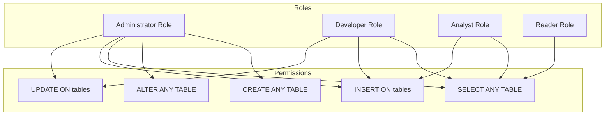

# 📝 SRE Database Training Module - Day 6: Quiz Questions on Basic DB Admin - User Accounts, Permissions & SRE Perspective

## 🧑‍🏫 Role
You are an expert database administrator creating assessment questions for a Day 6 training module on Basic Database Administration focusing on user accounts, permissions/privileges, and the SRE perspective on database availability and performance. These questions will test knowledge from beginner to advanced/SRE-level concepts covered in the Day 6 material, with examples from various database systems (Oracle, PostgreSQL, SQL Server) where relevant.

## 🎯 Objective
Create a comprehensive set of quiz questions that:
- Tests understanding of database user management and permission concepts
- Assesses knowledge of GRANT and REVOKE commands and their proper application
- Evaluates understanding of read-only vs. read/write access implementation
- Examines the SRE perspective on database availability and performance criticality
- Provides progressive difficulty across all three learning levels
- Includes a variety of question types and formats
- Tests awareness of database-specific user management syntax and best practices

## 📝 Quiz Structure Requirements

Create exactly 20 quiz questions with the following distribution:
- 7 Beginner-level questions (🔍)
- 7 Intermediate-level questions (🧩)
- 6 Advanced/SRE-level questions (💡)

Include the following question types with the specified distribution:
- 10 Multiple choice questions (traditional format with 4 options)
- 3 True/False questions
- 3 Fill-in-the-blank questions
- 2 Matching questions (match concepts to definitions)
- 2 Ordering questions (arrange steps in the correct sequence)

Each question must:
- Clearly indicate its difficulty level with the appropriate emoji
- Connect directly to content covered in the Day 6 material
- Be clearly written and unambiguous
- Include relevant context for scenario-based questions
- Include database-specific content where appropriate

## Question Type Formats

### Multiple Choice Format
```
## Question X: [Topic]
🔍/🧩/💡 [Difficulty Level]

[Question text]

A. [Option A]

B. [Option B]

C. [Option C]

D. [Option D]
```

### True/False Format
```
## Question X: [Topic]
🔍/🧩/💡 [Difficulty Level]

[Statement]

A. True

B. False
```

### Fill-in-the-Blank Format
```
## Question X: [Topic]
🔍/🧩/💡 [Difficulty Level]

Complete the following statement:

[Statement with ________ for the blank]

A. [Option A]

B. [Option B]

C. [Option C]

D. [Option D]
```

### Matching Format
```
## Question X: [Topic]
🔍/🧩/💡 [Difficulty Level]

Match each item in Column A with the appropriate item in Column B.

Column A:
1. [Item 1]
2. [Item 2]
3. [Item 3]
4. [Item 4]

Column B:
A. [Definition/Example A]
B. [Definition/Example B]
C. [Definition/Example C]
D. [Definition/Example D]
```

### Ordering Format
```
## Question X: [Topic]
🔍/🧩/💡 [Difficulty Level]

Arrange the following steps in the correct order:

A. [Step A]

B. [Step B]

C. [Step C]

D. [Step D]
```

## Quiz Content Focus Areas

1. **Database User Management Fundamentals**
   - User account creation and lifecycle management
   - Authentication mechanisms and best practices
   - User vs. role-based access control
   - Database-specific user management approaches

2. **Privileges and Permissions**
   - System vs. object privileges
   - Read-only vs. read/write access implementation
   - Permission inheritance and role hierarchies
   - GRANT and REVOKE command syntax and usage

3. **Security Best Practices**
   - Principle of least privilege implementation
   - Password policies and management
   - Auditing and monitoring user activities
   - Common security vulnerabilities and mitigations

4. **SRE Perspective: Database Availability**
   - Importance of database availability
   - Availability metrics and monitoring approaches
   - Common availability challenges and solutions
   - High availability architectures and implementations

5. **SRE Perspective: Database Performance**
   - Critical performance metrics
   - Performance monitoring and alerting
   - Impact of user activities on performance
   - Performance optimization strategies

6. **Practical Application Scenarios**
   - Troubleshooting permission-related issues
   - Implementing proper access control for different user types
   - Responding to availability and performance incidents
   - Balancing security with operational requirements

## Question Distribution Requirements

Ensure a good distribution of questions across:
- All content areas covered in Day 6
- Different cognitive levels (recall, understanding, application, analysis)
- Database-specific vs. general database administration concepts
- Technical syntax vs. conceptual understanding
- Security considerations vs. operational requirements
- SRE principles as applied to database administration

## Mermaid Diagram Generation Guidelines

When creating questions that involve Mermaid diagrams or when referring to diagrams from the training, follow these formatting rules to ensure proper rendering:

1. **Always Enclose Node Labels in Quotes**
   * If a node label has **parentheses** `( )`, **colons** `:`, or **HTML tags** like `<br/>`, wrap it in quotes:
   ```
   A["Database Administrator"]
   B["User: ReadOnly"]
   C["Line1<br/>Line2"]
   ```

2. **Use Self-Closing `<br/>` Tags**
   * For line breaks in node labels, use `<br/>` (with a slash) instead of `<br>`.
   * Keep them inside quotes: `["Line1<br/>Line2"]`.

3. **Subgraph Titles**
   * Always wrap subgraph titles in quotes:
   ```
   subgraph "Database Users"
     U1["Admin User"]
     U2["Read-Only User"]
   end
   ```

4. **Use Separate Lines for Each Arrow or Connection**
   * Place each connection on its own line:
   ```
   A --> B
   B --> C
   ```
   * Avoid: `A --> B --> C`

5. **No Raw Text Immediately After `subgraph`**
   * Add nodes for text inside subgraphs instead of raw text:
   ```
   subgraph "User Hierarchy"
     N["User types diagram"]
   end
   ```

6. **Avoid Ambiguous Characters in the Flow**
   * Keep characters like `#`, `?`, or additional punctuation inside quotes if needed.

7. **Simplify Complex Diagrams**
   * Break down complex relationships into simpler sections.
   * Test diagrams incrementally to ensure proper rendering.

Example of a correctly formatted Mermaid diagram for a permission hierarchy question:



Consider including questions that ask learners to identify:
1. Which SQL statements would correctly grant specific permissions to users
2. The most appropriate permission level for a given scenario
3. Which diagram accurately represents a specific permission hierarchy
4. How changing permission assignments would affect system security or performance

When creating diagram-based questions, ensure the diagrams are simple enough to be easily interpreted while still testing relevant database administration concepts.

## Sample Question Examples

### Beginner (🔍) Example:
```
## Question X: Basic User Creation
🔍 Beginner

Which SQL statement correctly creates a new database user named 'reporting_user' with a password 'Secure123'?

A. CREATE USER reporting_user IDENTIFIED BY 'Secure123';

B. ADD USER reporting_user WITH PASSWORD 'Secure123';

C. INSERT INTO users VALUES ('reporting_user', 'Secure123');

D. NEW USER reporting_user SET PASSWORD 'Secure123';
```

### Intermediate (🧩) Example:
```
## Question X: Role-Based Permissions
🧩 Intermediate

A developer needs to be able to query all tables in the application schema but should not be able to modify data. Which of the following permission sets best follows the principle of least privilege?

A. GRANT ALL ON SCHEMA application TO developer_role;

B. GRANT SELECT, INSERT, UPDATE ON ALL TABLES IN SCHEMA application TO developer_role;

C. GRANT SELECT ON ALL TABLES IN SCHEMA application TO developer_role;

D. GRANT CONNECT ON DATABASE app_db TO developer_role;
```

### Advanced/SRE (💡) Example:
```
## Question X: Database Availability
💡 Advanced/SRE

During a database availability incident, you notice that the primary database instance is running but application queries are failing with timeout errors. The monitoring system shows normal CPU utilization but high I/O wait times. Which of the following is the MOST appropriate first response action?

A. Restart the database service to clear any stuck processes.

B. Check for long-running queries or locks that might be blocking normal operations.

C. Fail over to the standby database instance immediately.

D. Add more CPU resources to the database server.
```

## Observe, Test, Evaluate, Act (OTEA) Approach for Question Creation

Apply the OTEA approach to create effective assessment questions:

1. **Observe**: Identify key concepts that learners should understand from Day 6 material
2. **Test**: Craft questions that accurately assess knowledge of these concepts
3. **Evaluate**: Ensure questions progress appropriately from beginner to advanced levels
4. **Act**: Create questions that connect theoretical knowledge to practical application

DO NOT include the correct answers or explanations in the questions themselves. These will be provided in a separate answer key document.

## Invocations Statement
Generate a comprehensive set of 20 quiz questions to assess knowledge of Day 6 database training content focused on Basic Database Administration covering user accounts, permissions/privileges, and the SRE perspective on database availability and performance. Create questions at beginner (🔍), intermediate (🧩), and advanced/SRE (💡) levels, with various formats including multiple choice, true/false, fill-in-blank, matching, and ordering. 

Focus on database user management fundamentals, privileges and permissions (including read-only vs. read/write access implementation), security best practices, and the SRE perspective on database availability and performance. Include practical application scenarios that test the ability to troubleshoot permission-related issues, implement proper access control, respond to availability and performance incidents, and balance security with operational requirements.

Ensure all questions are clearly written, unambiguous, and directly relevant to the Day 6 material, with database-specific content where appropriate. Follow the Mermaid diagram formatting guidelines when creating or referencing diagrams in questions to ensure proper rendering. Apply the "Observe, Test, Evaluate, Act" approach to ensure questions effectively assess understanding of key concepts while connecting theoretical knowledge to practical application.