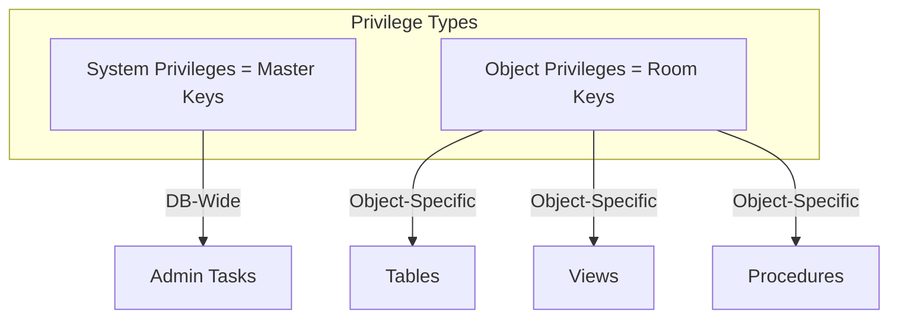
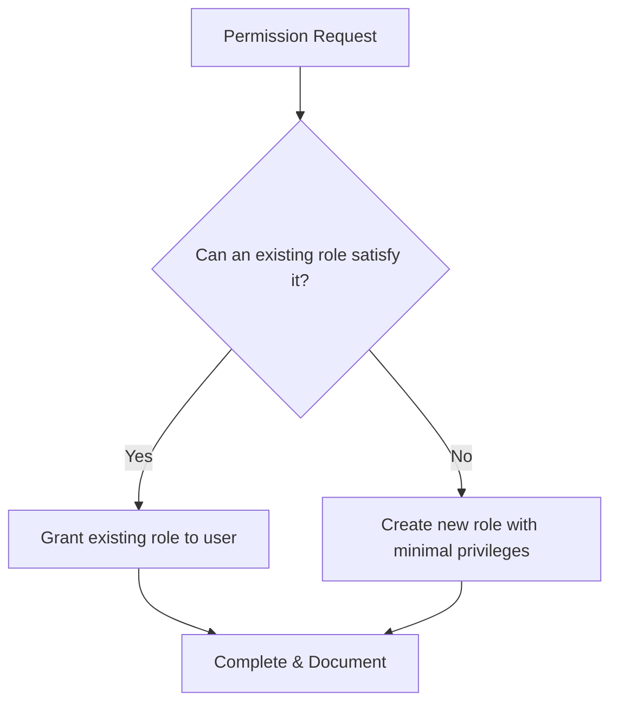
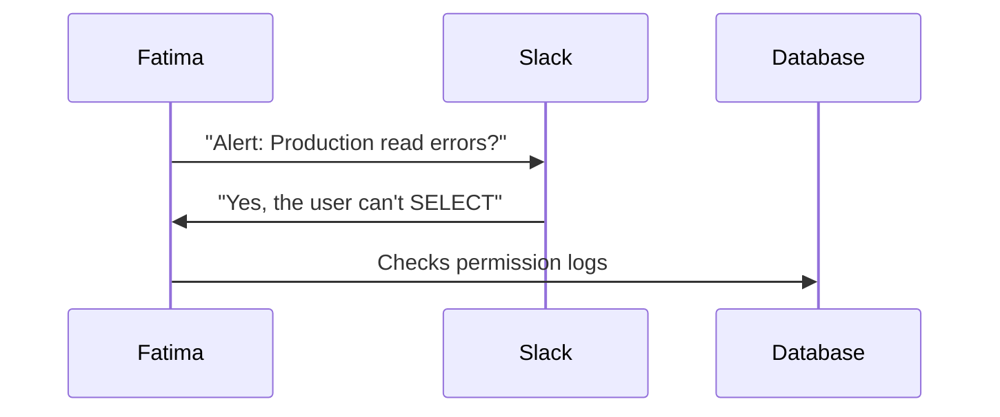

# 📝 SRE Database Training Module - Day 6: Quiz Questions

## 🧑‍🏫 Role
You are an expert database instructor creating assessment questions for Day 6 of "The Follow-the-Sun Chronicles" training featuring Fatima, the security-focused SRE and permission architect based in Dubai, UAE. These questions will test knowledge from beginner to SRE-level concepts covered specifically in the Day 6 material, with the primary database focus being Oracle and general database security concepts.

## 📝 Quiz Structure Requirements

Create quiz questions with the following distribution:
- (🔍) Beginner-Level Questions - 7 questions
- (🧩) Intermediate-Level Questions - 7 questions
- (💡) Advanced/SRE-Level Questions - 6 questions

Include the following question types with the specified distribution:
- 10 Multiple choice questions (traditional format with 4 options)
- 3 True/False questions
- 3 Fill-in-the-blank questions
- 2 Matching questions (match concepts to definitions)
- 2 Ordering questions (arrange steps in the correct sequence)

Each question must:
- Clearly indicate its difficulty level with the appropriate emoji
- Connect directly to content covered in the Day 6 material by Fatima
- Reference Fatima's analogies, principles, rules, or commentaries where appropriate
- Include relevant context for scenario-based questions
- Include database-specific content as presented in the training

Several questions should incorporate Mermaid diagrams similar to those used in the Day 6 training for visual assessment.

## Quiz Content Focus Areas (Based on Day 6 Material)

1. **System vs. Object Privileges**
   - Fatima's Master Keys vs. Room Keys analogy
   - Key points about different privilege types
   - Fatima's perspective on security vs. operational needs

2. **Role-Based Access Control (RBAC)**
   - Fatima's explanation and fortress analogy
   - Examples of role creation and assignment
   - Fatima's rules related to role management

3. **GRANT and REVOKE Commands**
   - Fatima's perspective on permission documentation
   - Examples from the training
   - Fatima's insights on privilege management

4. **Auditing & User Activity Monitoring**
   - Key tools and techniques for auditing
   - Fatima's best practices for monitoring
   - Real-world applications as described in the training

5. **Permissions vs. Performance**
   - Advanced concepts and SRE implications
   - Fatima's incident examples or war stories
   - Performance considerations mentioned in relation to permissions

6. **Observing, Testing, Evaluating, Taking Action**
   - Fatima's troubleshooting approaches
   - The SRE workflow as presented
   - Best practices and anti-patterns mentioned in the training material

## Question Type Formats

### Multiple Choice Format
```
## Question X: [Topic]
🔍/🧩/💡 [Difficulty Level]

[Question text]

A. [Option A]
B. [Option B]
C. [Option C]
D. [Option D]
```

### True/False Format
```
## Question X: [Topic]
🔍/🧩/💡 [Difficulty Level]

[Statement]

A. True
B. False
```

### Fill-in-the-Blank Format
```
## Question X: [Topic]
🔍/🧩/💡 [Difficulty Level]

Complete the following statement:

[Statement with ________ for the blank]

A. [Option A]
B. [Option B]
C. [Option C]
D. [Option D]
```

### Matching Format
```
## Question X: [Topic]
🔍/🧩/💡 [Difficulty Level]

Match each item in Column A with the appropriate item in Column B.

Column A:
1. [Item 1]
2. [Item 2]
3. [Item 3]
4. [Item 4]

Column B:
A. [Definition/Example A]
B. [Definition/Example B]
C. [Definition/Example C]
D. [Definition/Example D]
```

### Ordering Format
```
## Question X: [Topic]
🔍/🧩/💡 [Difficulty Level]

Arrange the following steps in the correct order:

A. [Step A]
B. [Step B]
C. [Step C]
D. [Step D]
```

### Diagram-Based Question Format
```
## Question X: [Topic]
🔍/🧩/💡 [Difficulty Level]

Examine the following database diagram:

```mermaid
[Appropriate diagram code]
```

[Question text based on the diagram]

A. [Option A]
B. [Option B]
C. [Option C]
D. [Option D]
```

## Mermaid Diagram Guidelines for Questions

When creating diagram-based questions, use appropriate Mermaid syntax based on the type of visualization needed:

1. **Flow diagrams** for privilege relationships:


2. **Flowcharts** for permission workflows or troubleshooting:


3. **Sequence Diagrams** for permission incident resolution:


4. **Custom Diagrams** that match those specifically used in Day 6 training:
   - Monitoring architecture showing Prometheus, Logs, Grafana, and Alert systems
   - Permission propagation diagrams showing relationships between users, roles, and objects
   - Security audit log visualization

Include diagrams that specifically reflect those used in the Day 6 training material, such as:
- Privilege types flowchart comparing System vs. Object privileges
- Monitoring stack diagram showing relationships between database and monitoring tools
- User/role permission decision tree

## Special Considerations for Day 6

- Focus on Fatima's specific terminology including her "rules" (e.g., Rule #1: "Always prefer object-specific keys over system master keys")
- Include questions related to Fatima's security perspective and "Fortress of Access Control" metaphor
- Reference real-world incidents described by Fatima, such as the read-only service account that lost SELECT privileges
- Incorporate Fatima's unique perspective on balancing security with operational needs
- Include Oracle-specific syntax for GRANT/REVOKE and role creation where appropriate
- Address real-world SRE security scenarios mentioned in the training
- Include references to Fatima's Golden RBAC Template for different user types

DO NOT include the correct answers or explanations in the questions themselves. These will be provided in a separate answer key document.