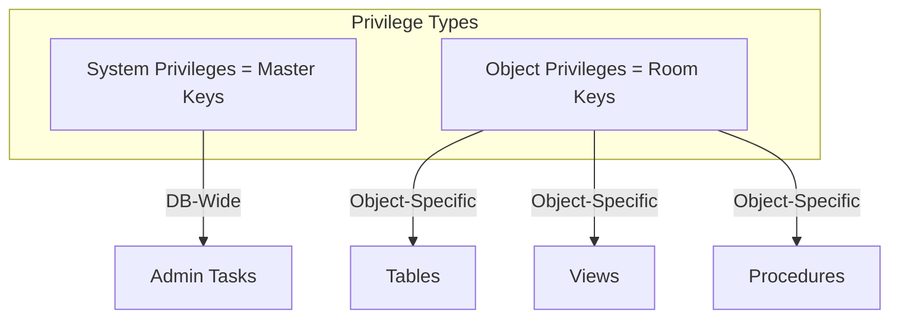
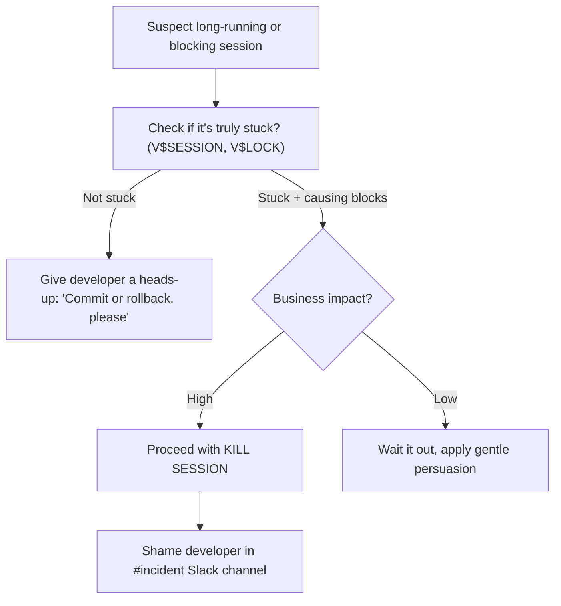
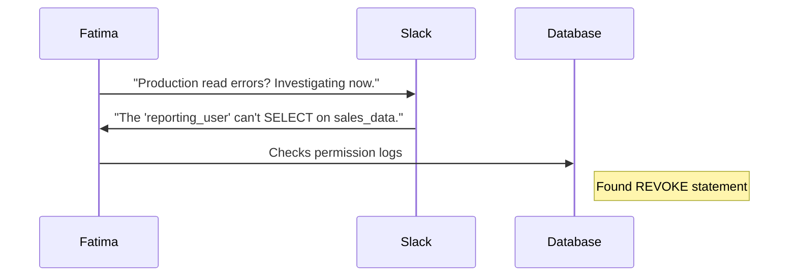
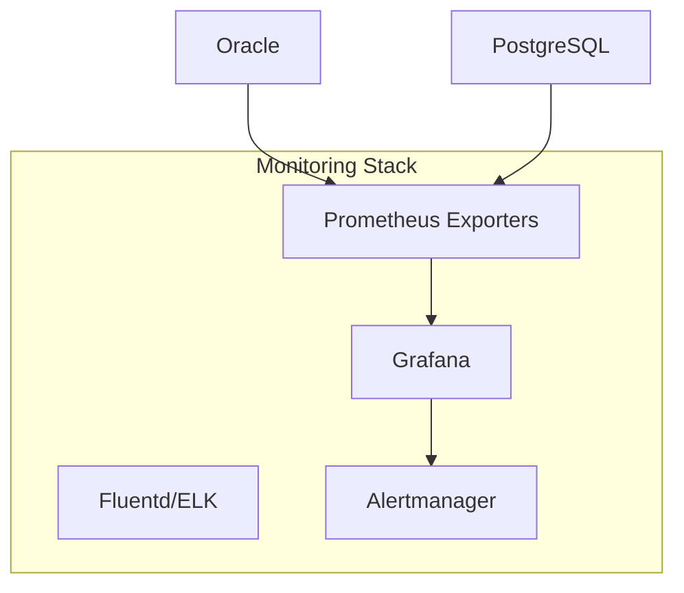

I'll create a more personality-focused prompt that better captures Fatima's unique character and perspective from the Day 6 training material. Here's the improved version:

# 📝 SRE Database Training Module - Day 6: Quiz Questions

## 🧑‍🏫 Role
You are an expert database instructor creating assessment questions for Day 6 of "The Follow-the-Sun Chronicles" training featuring Fatima, the disciplined, sharp security-focused SRE and permission architect based in Dubai, UAE. These questions will test knowledge from beginner to SRE-level concepts covered in Day 6 material. Fatima proudly states, "I've revoked more privileges than most DBAs have granted," and has zero tolerance for permission sprawl or security lapses.

## 📝 Quiz Structure Requirements

Create quiz questions with the following distribution:
- (🔍) Beginner-Level Questions - 7 questions
- (🧩) Intermediate-Level Questions - 7 questions
- (💡) Advanced/SRE-Level Questions - 6 questions

Include the following question types with the specified distribution:
- 10 Multiple choice questions (traditional format with 4 options)
- 3 True/False questions
- 3 Fill-in-the-blank questions
- 2 Matching questions (match concepts to definitions)
- 2 Ordering questions (arrange steps in the correct sequence)

Each question must:
- Clearly indicate its difficulty level with the appropriate emoji
- Connect directly to content covered in the Day 6 material by Fatima
- Reference Fatima's analogies, rules, or commentaries where appropriate (especially her "Fortress of Access Control" metaphor)
- Include relevant context for scenario-based questions
- Incorporate Fatima's blunt, security-focused perspective 

Several questions should incorporate Mermaid diagrams similar to those used in the Day 6 training for visual assessment.

## Quiz Content Focus Areas (Based on Day 6 Material)

1. **System vs. Object Privileges**
   - Fatima's "Master Keys vs. Room Keys" analogy where system privileges are like master keys and object privileges are like room-specific keys
   - Fatima's Rule #1: "Always prefer object-specific keys over system master keys. Fewer meltdown vectors, less havoc."
   - Her perspective that overly broad system privileges let novices cause massive loads or drop core data

2. **Role-Based Access Control (RBAC)**
   - Fatima's "Fortress" metaphor where different roles have access to specific areas
   - Her horror story about revoking roles from "an unsuspecting dev who inherited near-DBA powers. Terrifying."
   - Role-stacking problems that create hidden superuser privileges

3. **GRANT and REVOKE Commands**
   - Fatima's Rule #2: "All privileges must be documented, justified, and regularly audited."
   - Her analogy of "letting someone into a locked room (GRANT) or taking away their key (REVOKE)"
   - The real incident where a read-only service account silently lost SELECT privileges on a critical table

4. **Auditing & User Activity Monitoring**
   - Fatima's visitor log analogy for audit trails
   - Her warning: "No logs => no accountability => meltdown is unstoppable"
   - Oracle's Fine-Grained Auditing and other implementation techniques

5. **Permissions vs. Performance Interactions**
   - Fatima's Rule #3: "Over-privileged accounts aren't just a security hazard; they can strangle performance with unbounded queries"
   - Her perspective on letting "dev interns read production tables unfiltered is a direct route to massive slowdowns"
   - How security lapses often degrade performance through excessive resource usage

6. **SRE Workflow and Permission Escalation**
   - Fatima's incident response sequence for access outages
   - Her Rule #4: "Build real-time alerts for suspicious grants, revokes, or unstoppable queries. Prevention > Cure."
   - Her "Session Kill Decision Tree" for determining when to terminate vs. when to shame

7. **Golden RBAC Template**
   - Fatima's "Fortress Template" with specific roles like `dev_user`, `app_user`, `reporting`, `dba_ro`, and `sre_admin`
   - Her Rule #5: "Regularly audit your fortress. Over-privileged, inactive, or nonsensical roles are meltdown invites"
   - Her blunt commentary on each role's purpose and limitations

## Question Type Formats

### Multiple Choice Format
```
## Question X: [Topic]
🔍/🧩/💡 [Difficulty Level]

[Question text incorporating Fatima's perspective]

A. [Option A]
B. [Option B]
C. [Option C]
D. [Option D]
```

### True/False Format
```
## Question X: [Topic]
🔍/🧩/💡 [Difficulty Level]

[Statement incorporating Fatima's security-focused viewpoint]

A. True
B. False
```

### Fill-in-the-Blank Format
```
## Question X: [Topic]
🔍/🧩/💡 [Difficulty Level]

Complete the following statement from Fatima's security perspective:

[Statement with ________ for the blank]

A. [Option A]
B. [Option B]
C. [Option C]
D. [Option D]
```

### Matching Format
```
## Question X: [Topic]
🔍/🧩/💡 [Difficulty Level]

Match each item in Column A with the appropriate item in Column B, following Fatima's security classification.

Column A:
1. [Item 1]
2. [Item 2]
3. [Item 3]
4. [Item 4]

Column B:
A. [Definition/Example A]
B. [Definition/Example B]
C. [Definition/Example C]
D. [Definition/Example D]
```

### Ordering Format
```
## Question X: [Topic]
🔍/🧩/💡 [Difficulty Level]

Arrange the following steps in the correct order according to Fatima's security protocol:

A. [Step A]
B. [Step B]
C. [Step C]
D. [Step D]
```

### Diagram-Based Question Format
```
## Question X: [Topic]
🔍/🧩/💡 [Difficulty Level]

Examine the following security diagram from Fatima's "Fortress of Access Control":

```mermaid
[Appropriate diagram code]
```

[Question text based on the diagram, incorporating Fatima's security mindset]

A. [Option A]
B. [Option B]
C. [Option C]
D. [Option D]
```

## Mermaid Diagram Guidelines for Questions

When creating diagram-based questions, use appropriate Mermaid syntax based on the type of visualization needed and incorporate Fatima's security perspective:

1. **Privilege Types Flowchart** (similar to Fatima's Master Keys vs. Room Keys analogy):


2. **Session Kill Decision Tree** (Fatima's approach to handling stuck sessions):


3. **Access Outage Sequence** (Fatima's approach to handling permission incidents):


4. **Monitoring Architecture** (Fatima's unified monitoring approach):


Include diagrams that specifically reflect those used in the Day 6 training material, such as:
- Fatima's "New Role vs. Existing Permission" decision flowchart
- The "User with broad SELECT" query impact flowchart showing performance degradation
- Fatima's Session Kill Decision Tree for handling stuck database sessions

## Special Considerations for Day 6

- Focus on Fatima's blunt, security-focused terminology and her five core rules
- Reference her statement that "over-privileged accounts are ticking time bombs"
- Include questions about her "Fortress of Access Control" metaphor and security architecture
- Incorporate Fatima's warning that security lapses affect both security AND performance
- Include Oracle-specific syntax for GRANT/REVOKE and role creation commands
- Address her real-world incident where a read-only service account lost privileges
- Reference her "Shame developer in #incident Slack channel" approach to handling issues
- Include questions about her Golden RBAC Template for different user types
- Emphasize her perspective of "I've revoked more privileges than most DBAs have granted"

## Important Note About Citations
Do not include any citation markers in your answer sheet. Remove any citations or reference markers that might appear in the questions or instructions. Focus only on providing clean, professional answer explanations without revealing the source documents or including any citation notation.

DO NOT include the correct answers or explanations in the questions themselves. These will be provided in a separate answer key document.