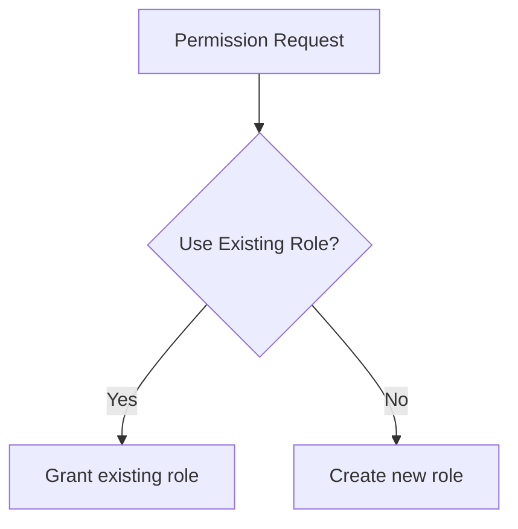

# **Day 6 Quiz: The Follow-the-Sun Chronicles – Fatima & the Fortress of Access Control**

---

## **Beginner-Level Questions (7)**

### 1. [Multiple Choice] System vs. Object Privileges  
🔍 Beginner

Fatima likens system privileges to “master keys” and object privileges to “room keys” in her Fortress of Access Control. Which statement best embodies that analogy?

A. System privileges grant broad, database-wide actions, whereas object privileges apply only to specific tables, views, or procedures.  
B. Object privileges are always more powerful than system privileges.  
C. Both system and object privileges allow only read operations.  
D. System privileges restrict all changes to a single table.

---

### 2. [Multiple Choice] Fatima’s Over-Zealous Cleanup Incident  
🔍 Beginner

In Fatima’s real-life example, a read-only service account lost `SELECT` privileges on a crucial table, causing chaos. What primarily caused this meltdown?

A. A user typed an incorrect SQL query.  
B. Overly strict password policy locked out the account.  
C. A well-intentioned but poorly monitored privileges cleanup revoked key permissions.  
D. The read-only user was promoted to a superuser role.

---

### 3. [Multiple Choice] Fatima’s Rule #1  
🔍 Beginner

Which principle is most consistent with Fatima’s Rule #1 regarding privileges?

A. Always give novices the broadest privileges so they can learn faster.  
B. When in doubt, grant system privileges so no one is blocked.  
C. Grant object-specific keys over system master keys to minimize meltdown vectors.  
D. Audit logs are optional if roles are used.

---

### 4. [True/False] Monitoring & Auditing Impact  
🔍 Beginner

Statement: Fatima claims that having no audit logs is harmless, as it frees up database resources for real workloads.

A. True  
B. False

---

### 5. [Fill-in-the-Blank] Basic “Fortress” Perspective  
🔍 Beginner

Complete the following statement aligned with Fatima’s fortress metaphor:  
“In this fortress, an ________ is granted read-only keys to certain floors, while an ‘AppAdmin’ can open more sensitive areas.”

A. DBA intern  
B. Analyst role  
C. dev_intern  
D. performance_sheriff

---

### 6. [Multiple Choice] Least Privilege for a BI User  
🔍 Beginner

Which scenario best exemplifies Fatima’s “least privilege” principle for a Business Intelligence user?

A. Full DBA privileges on the entire environment.  
B. GRANT SELECT, INSERT, and DROP on all production tables.  
C. Read-only permissions restricted to specific views and tables needed for reporting.  
D. Inheriting superuser status from a stacked role.

---

### 7. [Matching] Understanding the Basic Flowchart  
🔍 Beginner

Look at the abbreviated flowchart below, then match each label to the correct description.

**Column A** (Labels)  
1. Permission Request  
2. Use Existing Role?  
3. Grant existing role  
4. Create new role  

**Column B** (Definitions)  
A. Evaluate whether a current role covers the needed permissions  
B. The user’s request for new privileges  
C. Allocate privileges using a pre-defined role  
D. Build a specialized role with minimal privileges

---

## **Intermediate-Level Questions (7)**

### 8. [Multiple Choice] Role-Stacking Risks  
🧩 Intermediate

Fatima recounts a “terrifying” incident where a developer inherited near-DBA powers from stacked roles. Which measure best prevents such hidden superuser escalation?

A. Immediately locking out all developers from the database  
B. Enforcing regular audits of role inheritance to spot over-privileged stacks  
C. Making every user an admin so no one has an unfair advantage  
D. Encouraging devs to pass around credentials

---

### 9. [Multiple Choice] GRANT vs. REVOKE  
🧩 Intermediate

Fatima’s analogy: **GRANT** is handing someone a key to a locked room, while **REVOKE** is taking it away. Which of the following is an example of a correct object-level GRANT?

A. `GRANT CREATE USER TO dev_intern;`  
B. `GRANT SELECT ON sales_data TO reporting_role;`  
C. `REVOKE DBA ON ALL TABLES FROM dev_intern;`  
D. `DROP ROLE reporting_role;`

---

### 10. [Multiple Choice] Rule #2: Documentation & Justification  
🧩 Intermediate

Fatima’s Rule #2 states: “All privileges must be documented, justified, and regularly audited.” How does she recommend fulfilling this rule effectively?

A. Rely solely on memory for which privileges have been granted  
B. Maintain a simple text file listing user privileges, updated monthly  
C. Employ a structured audit trail (e.g., a table or system logs) that automatically tracks GRANT/REVOKE activities  
D. Only track privileges for superuser roles, ignoring read-only accounts

---

### 11. [Ordering] Responding to Revoked Permissions Incident  
🧩 Intermediate

Arrange the following steps in the correct order, according to Fatima’s typical approach when discovering a critical user lost needed privileges:

A. Investigate logs to confirm which statement removed the privileges  
B. Re-grant the lost privileges immediately to restore service  
C. Document the privilege change for future audits  
D. Discuss root cause and prevention measures with the team

---

### 12. [True/False] Impact of Broad Permissions on Performance  
🧩 Intermediate

Statement: Fatima says that granting broad system privileges to novices can lead to performance chaos if they run massive or unbounded queries.

A. True  
B. False

---

### 13. [Fill-in-the-Blank] Fatima’s Rule #3  
🧩 Intermediate

Complete the statement related to Fatima’s Rule #3:  
“Over-privileged accounts aren’t just a security hazard; they can ________ performance with unbounded queries.”

A. Enhance  
B. Protect  
C. Strangle  
D. Justify

---

### 14. [Multiple Choice] Valid RBAC Scenario  
🧩 Intermediate

Which scenario best exemplifies a balanced RBAC approach?

A. Each developer role includes DROP, ALTER, and CREATE for every production table.  
B. A single “one-size-fits-all” role for everyone in the organization.  
C. Roles tailored to job functions (like “reporting,” “dev_user,” “app_user”), each with only the privileges needed for its tasks.  
D. Every user inherits the “sre_admin” role so incidents can be resolved quickly.

---

## **Advanced/SRE-Level Questions (6)**

### 15. [Multiple Choice] Live Alerts for GRANT/REVOKE  
💡 Advanced

Fatima’s Rule #4: “Build real-time alerts for suspicious GRANT, REVOKE, or unstoppable queries. Prevention > Cure.” Which setup best aligns with this?

A. Relying on monthly manual checks of privilege changes  
B. Automating an audit log feed into Prometheus or Alertmanager, which sends Slack notifications upon critical changes  
C. Letting each team manage privileges in isolation with no central oversight  
D. Only checking for suspicious statements when performance issues arise

---

### 16. [Multiple Choice] Security & Performance Overlap  
💡 Advanced

Fatima insists that security lapses often degrade performance. Which example best demonstrates this link?

A. A developer with only read access tries to edit a table but fails  
B. A superuser runs a massive `SELECT *` on large tables, saturating CPU and I/O  
C. A user is forcibly disconnected after idle timeout  
D. A developer leaves the office for lunch, and no new queries are run

---

### 17. [True/False] Over-Reliance on One Superuser  
💡 Advanced

Statement: Relying exclusively on a single superuser for emergency tasks can risk major downtime if that account is compromised or locked out.

A. True  
B. False

---

### 18. [Matching] Fatima’s Rules in Action  
💡 Advanced

Match each situation to the corresponding Fatima Rule.

**Column A (Situations)**  
1. A developer who’s given system-level privileges runs random commands that overload the CPU.  
2. A read-only user unexpectedly loses SELECT on a critical table, causing an outage.  
3. No logs exist to track when or how privileges were granted.  
4. Roles are left untouched for years, and some old test accounts remain active.

**Column B (Rules)**  
A. “Regularly audit your fortress. Over-privileged, inactive, or nonsensical roles are meltdown invites.”  
B. “All privileges must be documented, justified, and regularly audited.”  
C. “Always prefer object-specific keys over system master keys. Fewer meltdown vectors, less havoc.”  
D. “Over-privileged accounts aren’t just a security hazard; they can strangle performance.”

---

### 19. [Diagram-Based Multiple Choice] Unbounded Query Flowchart  
💡 Advanced

Examine the following flowchart illustrating a meltdown from an unbounded SELECT:

Which statement best reflects Fatima’s stance on preventing this scenario?

A. Provide all users with the ability to SELECT * from all tables at will  
B. Restrict read access to only necessary tables/columns to avoid unbounded queries  
C. Ignore unbounded queries unless they exceed 72 hours of runtime  
D. Instruct the user to switch from SELECT * to SELECT COUNT(*)

---

### 20. [Ordering] Fatima’s Failover Security Test  
💡 Advanced

Arrange the steps for Fatima’s recommended “failover security test,” ensuring roles and privileges remain consistent across primary and standby.

A. Bring down the primary database intentionally.  
B. Confirm that the standby has replicated all roles/privileges correctly.  
C. Switch production traffic to the standby.  
D. After switchover, verify that no privileges are missing or unexpectedly changed.

---

**End of Day 6 Quiz**  

*No answers or explanations are provided here. They should be compiled in a separate document.*