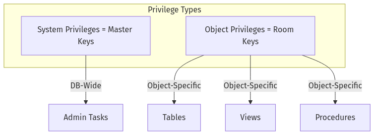
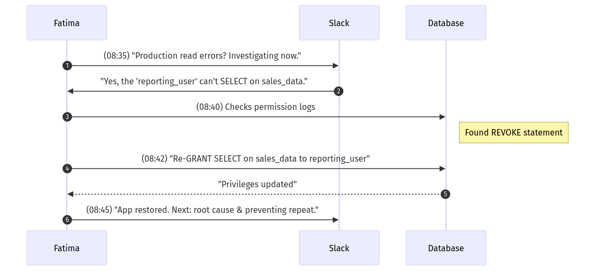
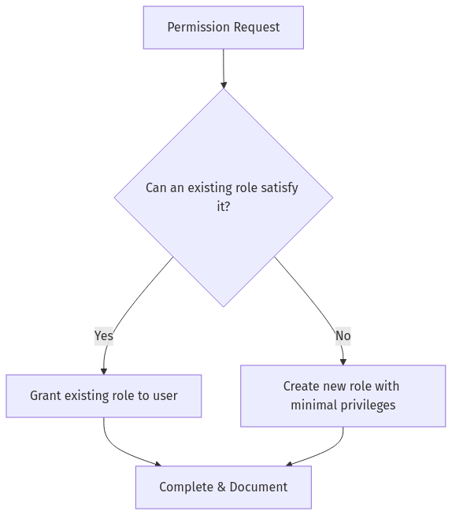

Below is a **newly generated Day 6 training document** that merges content from **day-06-training-material-v2.md** citeturn12file1 with the style and narrative in **day-06-prompt-tf-v1.md** citeturn12file0. It continues **The Follow-the-Sun Chronicles**, featuring **Fatima** in Dubai at 08:30 GST—our disciplined security-focused SRE—covering **database user management, privileges, and SRE security perspectives**.

---

# **The Follow-the-Sun Chronicles: Day 6 – Fatima & the Fortress of Access Control**

> **Character Profile**  
> - **Name:** Fatima  
> - **Location:** Dubai, UAE (08:30 GST)  
> - **Role:** Security-focused SRE and permission architect  
> - **Personality:** Disciplined, sharp, zero tolerance for permission sprawl. “I’ve revoked more privileges than most DBAs have granted.”

---

## **1. Real Incident: Read-Only Service Account Silently Dropped**

At **08:30 GST**, our monitoring lit up: a production app raised countless read failures. The root cause? A **read-only service account** lost `SELECT` privileges on a critical table—silently dropped in an overzealous privileges cleanup. The result: a major meltdown for vital queries. I, Fatima, dove into logs, re-granted access, and locked down the process with more robust checks. This fiasco illustrates how **any** oversight in user management or privileges can break your fortress.

**Lesson**: Every permission decision carries weight. Let’s establish the fortress of access control, ensuring minimal chaos and maximum reliability.

---

## **2. Day 6 Overview (Fatima’s Security Blueprint)**

### 🔍 **Beginner Objectives**
1. **Explain** the purpose of database user accounts and privileges in plain terms.  
2. **Identify** the difference between system privileges (master keys) and object privileges (room keys).  
3. **Demonstrate** basic user creation and removal.  
4. **Describe** how availability and performance align with secure user management.

### 🧩 **Intermediate Objectives**
1. **Implement** role-based access control (RBAC) with custom roles.  
2. **Apply** the principle of least privilege to typical scenarios.  
3. **Enable** auditing to detect suspicious user actions.  
4. **Analyze** how misconfigured permissions can cause downtime and user impact.

### 💡 **Advanced/SRE Objectives**
1. **Design** secure permission structures that still serve operational needs.  
2. **Monitor** key DB metrics (latency, CPU usage) to detect permission-based performance anomalies.  
3. **Respond** swiftly to permission-related incidents, minimizing downtime.  
4. **Optimize** failover so your locked-down environment remains highly available.

> **Fatima’s Perspective**: “I’ve seen over-privileged accounts act like ticking time bombs—one slip, and your entire DB can be compromised or overloaded.”

---

## **3. Observe, Test, Evaluate, and Take Action (Security Edition)**

**Observe**: Inspect roles, privileges, logs, suspicious patterns.  
**Test**: Validate minimal permissions on staging or dev, confirm no accidental escalations.  
**Evaluate**: Are we risking security, or are we too restrictive for operational tasks?  
**Take Action**: Apply principle of least privilege. Grant, revoke, or reorganize roles.

---

## **4. Core Concepts: System vs. Object Privileges, RBAC, GRANT/REVOKE**

### 4.1 System vs. Object Privileges

**Analogy**:  
- **System privileges** = Master keys, letting you do large-scale tasks (create users, drop databases).  
- **Object privileges** = Room keys for specific tables, views, or procedures.

**Mermaid Diagram**  





**SQL Examples**  
- **System Privilege** (Oracle): `GRANT CREATE USER TO dba_admin;`  
- **Object Privilege** (Postgres): `GRANT SELECT ON orders TO analytics;`  
- **Performance & Security Impact**:  
  - Overly broad system privileges let novices cause massive loads or drop core data.  
  - Overly narrow privileges hamper SREs during emergencies.

> **Fatima’s Rule #1**  
> ```
> 🔒 Fatima's Rule #1: 
> Always prefer object-specific keys over system master keys. 
> Fewer meltdown vectors, less havoc.
> ```

---

### 4.2 Role-Based Access Control (RBAC)

**Analogy**: A fortress: “Analyst” role has read-only keys to certain floors; “AppAdmin” role can open more sensitive areas.  
**SQL**:

```sql
-- Oracle/Postgres
CREATE ROLE reporting_role;
GRANT SELECT ON sales TO reporting_role;

-- Then assign user to role
GRANT reporting_role TO alice;
```

**Common Mistakes**  
- Stacking roles such that a user gets hidden superuser privileges.  
- Not auditing role inheritance.

**Fatima’s Advice**: “I once had to revoke half a dozen roles from an unsuspecting dev who inherited near-DBA powers. Terrifying.”

---

### 4.3 GRANT and REVOKE

**Analogy**: Letting someone into a locked room (GRANT) or taking away their key (REVOKE).

**SQL**:
```sql
-- Postgres
GRANT SELECT, INSERT ON products TO app_user;
REVOKE INSERT ON products FROM app_user;
```
**Performance Consideration**:  
- Minimal direct overhead, but more privileges can enable resource-intensive operations.  
- Over-privileged users may run monstrous queries unannounced.

> **Fatima’s Rule #2**  
> ```
> 🔒 Fatima's Rule #2: 
> All privileges must be documented, justified, and regularly audited.
> ```

---

### 4.4 Auditing & User Activity Monitoring

**Analogy**: A visitor log: who entered which room at what time.  
**Implementation**: Oracle’s Fine-Grained Auditing, Postgres’s `pgaudit`, or SQL Server’s built-in audit.  
**Fatima’s Note**: “I’ve seen too many times: no logs => no accountability => meltdown is unstoppable.”

**Mermaid**:


**Security + Performance**:  
- Audits show if a user runs resource-heavy queries repeatedly or tries suspicious DDL.

---

## **5. Permissions vs. Performance Interactions**

**Key Concept**: Security lapses often degrade performance. Over-privileged users can run queries (e.g., `SELECT *` with no `WHERE` on a million-row table) that hog CPU and memory.

**Example**: A new user with `SELECT` on all large tables might do `SELECT * FROM huge_table;` => CPU spikes, I/O saturates, app latencies soar.

**Mermaid**:


**Fatima’s Perspective**: “In my experience, letting dev interns read production tables unfiltered is a direct route to massive slowdowns.”

**AWR Sample** (Oracle):
```
Top SQL by CPU:
SELECT * FROM huge_table => 90% CPU, 80% I/O
```

**How Security Audit Helped**:
- Discovered suspicious queries from underqualified user.
- Re-scoped privileges to required columns or smaller partitioned sets.

> **Fatima’s Rule #3**  
> ```
> 🔒 Fatima's Rule #3:
> Over-privileged accounts aren’t just a security hazard;
> they can strangle performance with unbounded queries.
> ```

---

## **6. Observing, Testing, Evaluating, Taking Action – The SRE Workflow**

### Sequence Diagram: An Access Outage from a Revoked Privilege





**Conclusion**: A single missed permission can break real-time dashboards.

---

## **7. Flowchart: Does a User Need a New Role or Existing Permissions?**





**Minimal expansions**: If a request is specialized, make a new role to isolate privileges.

---

## **8. Advanced / SRE Exercises (Expanded)**

We keep the existing three, plus a fourth:

### 1. (From original) **Implement a security policy**  
- Enforce strong password rules, enable auditing of all DDL commands.

### 2. (From original) **Script a failover test**  
- Intentionally bring down the primary database to see if privileges remain consistent on standby.

### 3. (From original) **Simulate high load**  
- Confirm user auth or mis-labeled roles aren’t causing performance issues. Optimize accordingly.

### 4. **Design a permission escalation alert** (New Stretch Goal)  
- Combine DB audit logs + external alerting (Prometheus + Slack).  
- Provide a snippet of suspicious logs:
  ```
  2023-09-10 08:34:12 [AUDIT] REVOKE ALL PRIVS ON sales_data FROM reporting_user
  2023-09-10 08:34:13 [AUDIT] GRANT SELECT ON huge_table TO dev_intern
  ```
- Patterns: abrupt revokes or broad grants. 
- Fatima’s approach: “Flag broad GRANT statements or repeated DDL from non-admin roles.”

> **Fatima’s Rule #4**  
> ```
> 🔒 Fatima's Rule #4:
> Build real-time alerts for suspicious grants, revokes, or unstoppable queries.
> Prevention > Cure.
> ```

---

## **9. Golden RBAC Template (Quick Reference)**

**Fatima’s “Fortress” Template**:

| **Role**      | **Privileges**                     | **Use Case**                         |
|---------------|------------------------------------|--------------------------------------|
| `dev_user`    | SELECT, INSERT on `test_*`         | Developer test environment           |
| `app_user`    | SELECT, INSERT, UPDATE on `prod.orders` | Production write path               |
| `reporting`   | SELECT only, read-only replica     | Dashboards, BI tools                 |
| `dba_ro`      | SELECT on all objects, SHOW commands | Non-invasive troubleshooting        |
| `sre_admin`   | Elevated privileges w/ auditing    | Emergency response only              |

**Fatima’s Commentary**:  
- **`dev_user`**: Minimally opens test tables so devs can’t mess with production.  
- **`app_user`**: Focus on the specific tables the production app needs. No `DROP` or `ALTER`.  
- **`reporting`**: Strictly read from read-only replicas or dedicated reporting schema.  
- **`dba_ro`**: “View but not break” privileges. Helpful for SRE debugging.  
- **`sre_admin`**: Must leave an audit trail – used only if standard roles fail.

**Security & Operational Efficiency**: Balances the principle of least privilege with enough power for day-to-day tasks, ensuring minimal meltdown vectors.

---

## **10. Putting It All Together (User Management & SRE)**

**Performance**: Limit privilege sprawl so incompetent queries don’t saturate resources.  
**Availability**: Overly reliant on a superuser? If that user is locked out or misconfigured, major downtime.  
**Security**: Keep an eye on suspicious privileges escalations.  
**Recovery**: Test failover or replication with the same roles/permissions to avoid post-failover chaos.

---

## **11. Summary of Security Red Flags (Fatima’s Watchlist)**

1. **Orphaned or old accounts** that no one uses but remain active.  
2. **Excessive system privileges** granted to novices or ephemeral roles.  
3. **Lack of auditing**—no logs means no accountability.  
4. **Weak password policies** leading to infiltration.  
5. **Unmonitored role inheritance**—layering roles can stealthily expand privileges.

**Fatima’s Rule #5**  
```
🔒 Fatima's Rule #5:
Regularly audit your fortress. Over-privileged, inactive, or nonsensical roles are meltdown invites.
```

---

## **12. Handoff to Mina in Lagos for Day 7**

That concludes **Day 6** from my vantage in Dubai. We covered user/role management, system vs. object privileges, GRANT/REVOKE, and the synergy of SRE with robust security. Tomorrow, **Mina** in Lagos takes over with **Day 7** to explore **the performance impact of too many indexes** on these well-secured tables. Until then, keep that fortress locked but functional.

**–Fatima**, reminding you: “In my experience, over-privileged accounts are ticking time bombs. Stay vigilant.”

