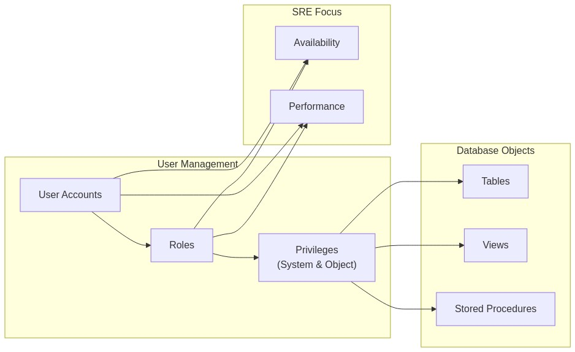
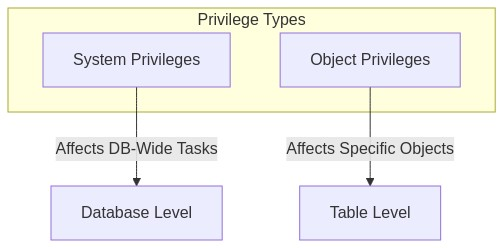
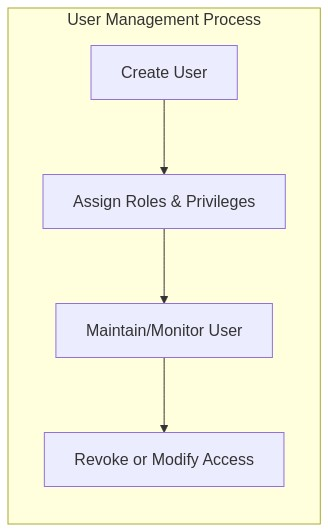
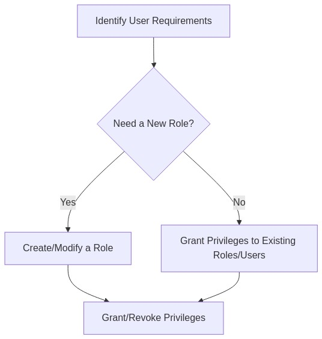
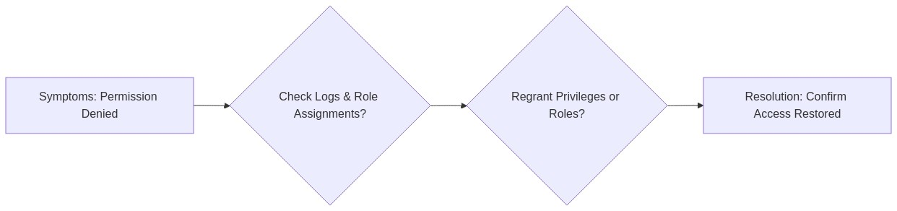
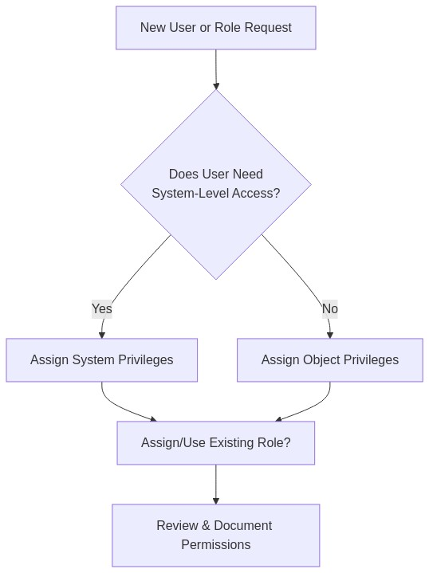

Below is a comprehensive Day 6 training module on Basic Database Administration, focusing on user accounts, permissions/privileges, and the SRE perspective on database availability and performance. This document follows the prompt in  and builds on the foundational knowledge established in Days 1-5. Throughout, we apply the “Observe, Test, Evaluate, and Take Action” framework to reinforce database administrative tasks and security. Enjoy this “brick by brick” journey!

---

# 🔐 SRE Database Training Module — Day 6: Basic DB Admin (User Accounts, Permissions & SRE Perspective)
  
## 1. 📌 Introduction

Welcome to Day 6 of your database training! Today’s focus is on **Basic Database Administration** and how it ties into **SRE principles** of availability and performance.

### Observe, Test, Evaluate, and Take Action
- **Observe**: Inspect user accounts, roles, and permission structures in the database.
- **Test**: Confirm how permissions behave when applied to different users.
- **Evaluate**: Measure the impacts of these permissions on both security and performance.
- **Take Action**: Adjust permissions, roles, and user configurations to optimize database security and availability.

### Why User Management Matters
- **Security & Governance**: Proper user management prevents unauthorized data access and ensures compliance with legal and organizational mandates.
- **Accountability**: Tracing issues back to specific user accounts or roles is critical for audits and post-incident reviews.
- **Operational Efficiency**: Efficient permission structures reduce time spent troubleshooting access issues.

### Real-World Support Scenario
Picture a high-traffic web application that experiences sudden read failures. Upon investigation, you discover the read-only service account no longer has `SELECT` privileges on key tables. This single permissions oversight can cause large-scale outages, demonstrating the importance of systematic user and permission management.

### SRE Perspective on Availability & Performance
- Databases are often the “single source of truth.” Downtime or poor performance has a **direct impact** on users.
- SREs monitor metrics like connection utilization, query response times, and resource consumption to ensure smooth operations.
- Permissions can impact performance if misapplied (e.g., a read-only user unexpectedly running resource-heavy updates).

Below is a **high-level concept map** illustrating the relationship between users, permissions, database objects, and reliability:

---

## 2. 🎯 Learning Objectives by Tier

Here are **4 objectives** for each tier (🔍 Beginner, 🧩 Intermediate, and 💡 Advanced/SRE):

### 🔍 Beginner
1. **Explain** the purpose of user accounts and permissions in a database.
2. **Identify** the difference between system privileges and object privileges.
3. **Demonstrate** how to create and drop a basic database user.
4. **Describe** why availability and performance are important from an SRE viewpoint.

### 🧩 Intermediate
1. **Implement** role-based access control using custom roles in a chosen database system.
2. **Apply** the principle of least privilege to real-world scenarios.
3. **Configure** auditing to monitor user activity for compliance.
4. **Outline** how database downtime impacts business continuity and user experience.

### 💡 Advanced/SRE
1. **Design** permission structures balancing security and operational needs for high-traffic systems.
2. **Monitor** key database metrics (latency, throughput, resource usage) to ensure reliability.
3. **Respond** to incidents involving user misconfigurations impacting performance or availability.
4. **Optimize** database failover strategies to maintain uptime during planned or unplanned events.

---

## 3. 📚 Core Concepts

Each concept below includes a **Beginner Analogy**, a **Visual Representation**, a **Technical Explanation**, a **Support/SRE Application**, **System Impact**, **Common Misconceptions**, and **Database Implementation** details.

### Example: Permissions (System vs. Object Privileges)

1. **Beginner Analogy**  
   - **System privileges** are like having the key to the entire building (you can manage infrastructure-level features).  
   - **Object privileges** are like having a key to a single office or room.

2. **Visual Representation**  
   

3. **Technical Explanation**  
   - **System privileges** allow actions like creating databases, managing schemas, or controlling critical system-level configurations.  
   - **Object privileges** regulate access to specific objects (tables, views, procedures, etc.) with `SELECT`, `INSERT`, `UPDATE`, `DELETE`, and so on.

4. **Support/SRE Application**  
   - Improper system privileges can lead to catastrophic errors (e.g., dropping entire databases).
   - Object privileges usually cause day-to-day ticket volumes (e.g., user can’t read a table).

5. **System Impact**  
   - Overly broad privileges risk security breaches and data corruption.
   - Too little privilege hampers troubleshooting and application functionality.

6. **Common Misconceptions**  
   - “Granting all privileges is faster than being selective.” This leads to enormous security risks.
   - “Object privileges never impact performance.” Actually, poorly organized permissions can create confusion and hamper user efficiency.

7. **Database Implementation**  
   | Database | System Privilege Example        | Object Privilege Example   |
   |----------|---------------------------------|----------------------------|
   | Oracle   | `CREATE USER`, `SYSDBA`         | `SELECT ON employees`      |
   | Postgres | Superuser role                  | `SELECT, INSERT ON TABLE`  |
   | SQL Server | `CONTROL SERVER`               | `SELECT ON dbo.Employees`  |

---

## 4. 💻 Day 6 Concept Breakdown

Below is a deeper look at our **Day 6** topics, each structured with an overview, analogy, mermaid diagram, technical details, tiered examples, and pitfalls.

### 4.1 Database User Management Fundamentals
- **Concept Overview**: Establishes authentication (who you are) and authorization (what you can do).
- **Analogy**: Think of “front desk registration” in an office, ensuring only verified staff get ID badges.
- **Mermaid Diagram**:

  

- **Technical Details**: 
  - Each user has unique credentials.  
  - Databases often store user info in system tables or use external authentication (LDAP, Kerberos).
- **Tiered Examples**:  
  - 🔍 *Beginner*: Creating a single user with minimal privileges.  
  - 🧩 *Intermediate*: Setting up multiple users and controlling their privileges through roles.  
  - 💡 *SRE*: Integrating with external identity management for streamlined authentication across multiple servers.
- **Pitfalls**:  
  - Failing to disable old user accounts leads to security holes.
  - Overlooking password complexity settings or rotation policies.

### 4.2 Creating and Managing Database Users
- **Syntax & Best Practices**:
  - Oracle: `CREATE USER john IDENTIFIED BY strongPass123;`
  - Postgres: `CREATE ROLE john WITH LOGIN PASSWORD 'strongPass123';`
  - SQL Server: `CREATE LOGIN John WITH PASSWORD = 'strongPass123'; CREATE USER John FOR LOGIN John;`
- **Lifecycle Management**:
  - Incorporates creation, password resets, user lockouts, and eventual removal or disabling.

### 4.3 Roles and Privileges
- **Predefined Roles**: Oracle’s `CONNECT`, `RESOURCE`, `DBA`; Postgres’s `pg_read_all_data`, etc.
- **Custom Roles**: Assign only the privileges your specific environment needs.

### 4.4 System vs. Object Privileges
- Detailed in **Core Concepts** (Section 3 example).

### 4.5 GRANT and REVOKE Commands
- **Syntax**  
  - Oracle/Postgres: `GRANT privilege ON object TO user;`  
  - SQL Server: `GRANT SELECT ON dbo.Employees TO [Domain\User];`  
- **Scope**: May grant single privileges or role-based sets of privileges.
- **Cascading Effects**: Revoking a role can remove privileges from all assigned users.

### 4.6 Read vs. Write Permissions
- **Least Privilege**: Grant only required privileges for the user’s business function.
- **Example**: Give marketing analysts read-only access to sales data, but not write or update access.

### 4.7 Database Security Best Practices
- **Password Policies**: Enforce complexity, length, and rotation schedules.
- **Auditing**: Track DDL and DML changes, logon attempts, and suspicious queries.
- **Encryption**: Use data-at-rest (tablespace encryption) and data-in-transit (TLS) security.

### 4.8 Monitoring User Activity
- **Logging & Auditing**: Identify anomalies like logins at unusual hours or repeated authentication failures.
- **Alerting**: SRE principle to ensure immediate notifications if suspicious behavior occurs.

### 4.9 SRE Perspective: Database Availability
- **Why It Matters**: Outages affect user experience and revenue.
- **Common Challenges**: Hardware failure, network issues, misconfigured roles causing system errors.
- **Strategies**: Implement replication, clustering, or failover solutions.

### 4.10 SRE Perspective: Database Performance
- **Performance Metrics**: Query latency, throughput, CPU and memory usage, I/O stats.
- **Monitoring**: Tools like Prometheus, Grafana, CloudWatch, or built-in DB performance views.
- **Optimization**: Indexing, caching, query rewrites, connection pooling.

---

## 5. 🔄 Permission Management Process in Practice

### Decision Framework
1. **Identify** user needs.
2. **Determine** the minimal set of privileges.
3. **Implement** privileges via direct grants or roles.
4. **Review** permissions regularly for revocation or adjustment.

### Visual Workflow

### Common Pitfalls
- Granting high-level roles (like `DBA` or `superuser`) for convenience.
- Forgetting to test user permissions before deployment.

### Verification Techniques
- **Check Effective Privileges**: `SHOW GRANTS` (MySQL), `\du` (Postgres), or system views in Oracle/SQL Server.
- **Attempt Role-Specific Tasks**: Log in as the user and test commands.

---

## 6. 🛠️ SRE Practices for Database Reliability

### Key Availability Metrics
- **Uptime Percentage**: e.g., 99.9% or 99.99% Service Level Objective (SLO).
- **Replication Lag**: Time difference in transactional states between primary and standby.
- **Mean Time to Detect/Recover (MTTD/MTTR)**: How quickly the team recognizes and fixes issues.

### Common Availability Challenges
- **Single Points of Failure**: Lack of redundancy in hardware or services.
- **Long-running Transactions**: Cause blocking and potentially crash failover systems.
- **Human Error**: Misconfiguration, accidental privilege revocations.

### High Availability Architectures
- **Primary-Standby** (Synchronous or Asynchronous replication).
- **Cluster** with multiple nodes sharing storage or using distributed systems.

### Incident Response Process
1. Detect issue via monitoring or alerts.
2. Escalate if critical thresholds exceeded.
3. Triage by verifying logs and system resources.
4. Apply fix (failover, resource scaling, config change).
5. Document incident and lessons learned.

---

## 7. 🔍 SRE Practices for Database Performance

### Key Performance Metrics
- **Query Latency** (Response time)
- **Throughput** (Transactions per second)
- **Resource Utilization** (CPU, memory, disk, network)

### Common Bottlenecks & Solutions
- **Slow Queries**: Add indexes, optimize queries.
- **Lock Contention**: Use appropriate transaction isolation, break large transactions.
- **Hardware Resource Limits**: Scale vertically (bigger machines) or horizontally (sharding, replication).

### Performance Monitoring & Alerting
- **Dashboards** with real-time metrics, thresholds for automatic alerts.
- **Logs & Execution Plans** for root cause analysis of slow queries.

### Incident Response
- **Identify** hotspots or locked sessions.
- **Kill** blocking queries if necessary.
- **Optimize** schema, queries, or hardware for future prevention.

---

## 8. 🔨 Hands-On Exercises

Provide **3 exercises** for each tier:  

### 🔍 Beginner
1. **Create a new database user** with a secure password, then grant them read-only access to one table.
2. **Identify the difference** between system and object privileges by listing them in your database of choice.
3. **Audit** your own login attempts by checking the database’s security logs.

### 🧩 Intermediate
1. **Implement a role-based structure**: Create a role for a reporting team and grant `SELECT` privileges on multiple tables, then assign users to this role.
2. **Revise privileges**: Revoke direct privileges from a user, ensuring all required permissions come through the role.
3. **Set up basic monitoring**: Configure a built-in monitoring or logging tool to capture user activity and unsuccessful login attempts.

### 💡 Advanced/SRE
1. **Implement a security policy**: Enforce strong password rules and enable auditing of all DDL commands.
2. **Script a failover test**: Write a scenario in which you intentionally bring down the primary database to verify the standby seamlessly takes over.
3. **Simulate high load**: Use a load testing tool to see if user authentication or permissions cause performance issues, then optimize accordingly.

---

## 9. 🚧 Troubleshooting Scenarios

### Scenario 1: “User Suddenly Cannot Access Table”
- **Symptoms**: Login succeeds, but queries fail with “permission denied.”
- **Cause**: The user’s role lost `SELECT` privileges during a privileges revocation.
- **Diagnostic Approach**:
  1. **Check** database logs for GRANT/REVOKE statements.
  2. **Query** user’s effective privileges (`\du+` in Postgres or system views in Oracle/SQL Server).
- **Resolution**: Re-grant necessary privileges or reassign the user to the correct role.
- **Workflow** (Mermaid):
  

### Scenario 2: “Sudden Spike in Slow Queries”
- **Symptoms**: Query times triple, CPU usage spikes.
- **Cause**: An unprivileged user was given `INSERT` privileges, leading to excessive data ingestion scripts running without optimization.
- **Diagnostic Approach**:
  - **Examine** running queries and user roles.
  - **Review** new or modified permissions and scheduled tasks.
- **Resolution**: Optimize the script or revoke the excessive privilege. Possibly create an “import user” role with more stringent resource limits.

### Scenario 3: “Database Connection Storm”
- **Symptoms**: Massive number of connections saturate DB resources.
- **Cause**: A newly created user runs a poorly written application that opens connections but never closes them.
- **Resolution**: Set connection pool limits, kill idle sessions, and educate on best coding practices.

---

## 10. ❓ Frequently Asked Questions

Each tier has **3 FAQs**.

### 🔍 Beginner FAQs
1. **Q**: How do I quickly see what privileges a user has?  
   **A**: Use your database’s system views or built-in commands (e.g., `\du` in Postgres).
2. **Q**: What’s the difference between a user and a role?  
   **A**: A *user* is an account that can log in. A *role* is a collection of privileges that can be assigned to one or more users.
3. **Q**: Does user management really affect performance?  
   **A**: Indirectly, yes. Overly generous privileges can enable unoptimized or unintended actions.

### 🧩 Intermediate FAQs
1. **Q**: Can I assign multiple roles to the same user?  
   **A**: Yes, you can stack roles to combine privileges—but be mindful of potential conflicts or overlaps.
2. **Q**: How do I audit changes to roles and privileges?  
   **A**: Enable audit logging or set up triggers that record every privilege change in a dedicated “audit” table.
3. **Q**: Can roles themselves inherit from other roles?  
   **A**: Yes. In many databases, you can create a hierarchy of roles that simplifies administration and permission grouping.

### 💡 Advanced/SRE FAQs
1. **Q**: How do I handle “superuser” accounts in an enterprise environment?  
   **A**: Limit them to a minimal set of DBAs or SREs, implement strong password policies, and log every action they take.
2. **Q**: How frequently should I rotate credentials for critical users?  
   **A**: Aim for every 90 days or follow organizational compliance rules. Automate this where possible.
3. **Q**: What’s the best approach for managing database credentials in microservices?  
   **A**: Use a secrets manager or vault solution to distribute and rotate credentials programmatically.

---

## 11. 🔥 SRE-Specific Scenario

**Scenario**: A sudden database slowdown is detected on a high-traffic e-commerce platform.

1. **Monitoring Tools** (e.g., Grafana) show:
   - 90% CPU usage
   - Elevated transaction latency from 50 ms to 800 ms
2. **Investigation**:
   - The newly granted privileges to the `reporting_team` role included the ability to run heavy analytical queries during peak traffic.
3. **Exact SQL Queries**:
   - `SELECT ... FROM orders JOIN customers ... GROUP BY ... HAVING ...`
   - Observed to run up to 5 minutes, blocking key resources.
4. **Incident Management**:
   - **Short-Term Fix**: Revoke the heavy analytical query privileges from `reporting_team` and schedule them off-peak.
   - **Long-Term Improvement**: Provide a separate reporting replica or consider a data warehouse for analytics.
5. **Outcome**:
   - Database latency normalized, and the platform recovered quickly.
   - Post-incident review recommended improved monitoring and role management policies.

---

## 12. 🧠 Key Takeaways

1. **User & Role Management**: Central to database security and must be systematically administered.  
2. **Least Privilege**: Minimizing unnecessary rights reduces risks and simplifies troubleshooting.  
3. **Database Availability**: Downtime can be catastrophic; use replication and clustering to minimize single points of failure.  
4. **Performance & Monitoring**: Proactive tracking of query metrics, CPU utilization, and concurrency is essential to detect issues before they become incidents.  
5. **SRE Mindset**: Security, availability, and performance are intertwined. Incidents often arise from small misconfigurations with large impacts.

---

## 13. 🚨 Career Protection Guide for Database Administration

- **High-Risk Operations**: Dropping tables, granting excessive privileges, changing system configurations—always follow change management procedures.  
- **Permission Reviews**: Schedule periodic audits, especially for accounts with powerful privileges.  
- **Testing Strategy**: Use a staging environment to simulate changes.  
- **Communication**: Inform stakeholders before making permission changes that could affect application behavior.  
- **Documentation**: Keep logs of user creation, privilege grants, and revocations for accountability and compliance.

---

## 14. 🔮 Preview of Next Day’s Content

**Day 7: Performance Tuning Introduction (Indexes!)**  
- Learn what **indexes** are and how they help speed up queries.  
- Explore **indexing strategies**, how to measure their impact, and best practices for ongoing performance tuning.  
- Understand how the SRE principles of availability and performance dovetail with indexing to keep databases running smoothly.

---

# 📋 Enhancement Requirements

Below we address the specirequested in citeturn0file0.

## 1. Permission Matrix Examples

| User Type           | Example Privileges                                                | Reasoning                           |
|---------------------|------------------------------------------------------------------|-------------------------------------|
| **DBA**             | Create/Drop databases, Create/Drop users, Full access to objects | Oversees the entire environment     |
| **Application User**| SELECT, INSERT, UPDATE on critical tables                        | Needed for regular app operations   |
| **Reporting User**  | SELECT only on reporting tables/views                            | Access limited to read-only queries |
| **Auditor**         | SELECT on all logs and audit tables                              | Needs read access for compliance    |
| **No Access**       | None                                                             | No rights assigned                  |

This matrix helps confirm the principle of least privilege.

---

## 2. Permission Decision Tree

---

## 3. Database Security Syntax Comparison

| DB System | User Creation                                         | Granting Privileges                                                            | Role Creation                     |
|-----------|--------------------------------------------------------|--------------------------------------------------------------------------------|-----------------------------------|
| **Oracle**   | `CREATE USER hr IDENTIFIED BY HRpass123;`             | `GRANT SELECT, INSERT ON employees TO hr;`                                    | `CREATE ROLE reporting;`          |
| **Postgres** | `CREATE ROLE hr WITH LOGIN PASSWORD 'HRpass123';`     | `GRANT SELECT, INSERT ON employees TO hr;`                                    | `CREATE ROLE reporting;`          |
| **SQL Server** | `CREATE LOGIN hr WITH PASSWORD='HRpass123';   CREATE USER hr FOR LOGIN hr;` | `GRANT SELECT, INSERT ON dbo.employees TO hr;`                                | `CREATE ROLE reporting;`          |

---

## 4. SRE Monitoring Dashboard Design

Key widgets/graphs to include:
1. **Connection Utilization**: Identifies potential connection storms or memory saturation.
2. **Top Queries by CPU/IO**: Surfaces resource-intensive queries.
3. **Replication/Failover Status**: Ensures HA features are functioning.
4. **Alert Thresholds**: For CPU usage, memory, query response times.

---

## 5. Real-World SRE Database Reliability Considerations

1. **SLOs for Database Services**  
   - Example: 99.95% monthly uptime for the main transactional database.
2. **Measuring & Tracking Reliability**  
   - Error budgets define how much downtime or slow performance is tolerable.
3. **Improving Resilience**  
   - Load balancing read replicas, thorough testing of failover scripts.
4. **Schema Changes**  
   - Rolling deployments and backward-compatible migrations.
5. **High-Availability Architectures**  
   - Shared-nothing clusters vs. shared-disk solutions, automatic failover, multi-master replication.

---

## Conclusion

Through careful **user management**, **role assignment**, and **permission granting**, you can maintain a **highly secure** and **available** database environment. By viewing these tasks through the lens of **SRE principles**, you learn to prioritize **reliability** and **performance**, ensuring your organization’s critical services remain robust and responsive. As you **Observe, Test, Evaluate, and Take Action**, you’ll evolve your skill set to handle a wide array of real-world scenarios with confidence.

Stay tuned for **Day 7**, where we’ll dive into **performance tuning** with a focus on **indexing**—a critical skill for balancing read/write efficiency and meeting uptime goals in production systemt Reference: citeturn0file0*