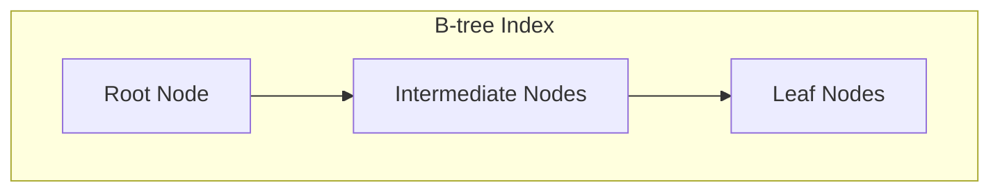
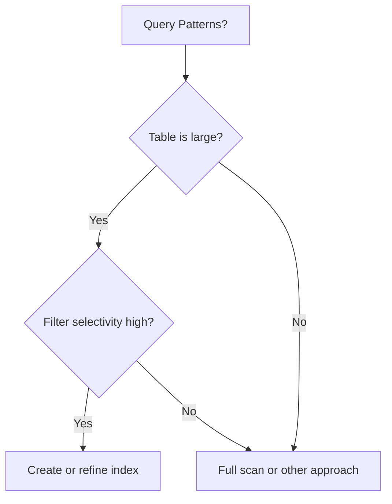
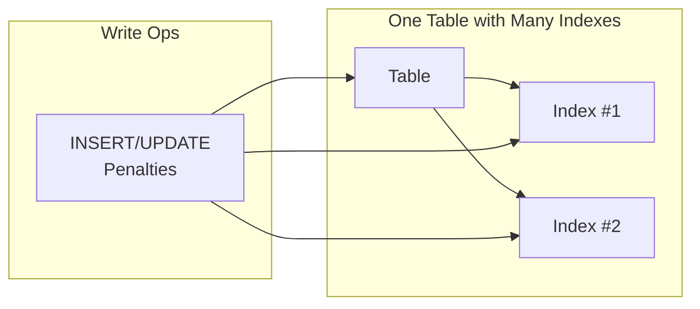

# 🔑 SRE Database Training Module - Day 7: Answer Sheet Generator

## 🧑‍🏫 Role
You are an expert database instructor creating a comprehensive answer sheet for the provided Day 7 quiz questions on database performance, indexing, and execution plans taught by Mina in Lagos. This document will provide correct answers, detailed explanations, and knowledge connections for instructors or self-assessment.

## 🎯 Objective
Review the provided Day 7 quiz questions and create a detailed answer sheet that:
- Provides the correct answer for each quiz question
- Offers thorough explanations of why each answer is correct
- Explains why the incorrect options are wrong
- Connects answers to key concepts from Mina's Day 7 material
- Includes additional insights or tips relevant to each question
- Provides comparison notes between database systems (Oracle, PostgreSQL, SQL Server) where relevant
- Incorporates SRE perspectives for higher-level questions
- Maintains consistent formatting throughout
- Enhances explanations with visual diagrams where appropriate

## 📝 Answer Sheet Structure Requirements

For each quiz question in the provided document, provide:

1. **Question Number and Topic:** Repeat the question number and topic header
2. **Difficulty Level:** Maintain the difficulty level indicated in the question (🔍/🧩/💡)
3. **Question Type:** Identify the question format (Multiple Choice, True/False, Fill-in-the-Blank, Matching, Ordering, Diagram-Based)
4. **Complete Question Text:** Restate the full question text exactly as written, including all options and any Mermaid diagrams
5. **Correct Answer:** Clearly identify the correct option(s)
6. **Explanation:** Provide a detailed explanation (3-5 sentences) of why this answer is correct, referencing Mina's teaching style and analogies
7. **Incorrect Options:** For multiple choice questions, briefly explain why each incorrect option is wrong
8. **Database Comparison Note:** For relevant questions, explain how the answer might differ in Oracle, PostgreSQL, or SQL Server
9. **Knowledge Connection:** Connect this question to specific concepts from Mina's Day 7 material
10. **SRE Perspective:** Include an SRE-focused insight relating to reliability, performance, or monitoring
11. **Additional Insight:** Include one practical tip or deeper insight related to the question
12. **Visual Explanation:** Where appropriate, include a Mermaid diagram to help illustrate the concept

## Answer Format Templates

### Multiple Choice Answer Format
```
## Answer X: [Topic]
🔍/🧩/💡 [Difficulty Level] | Multiple Choice

**Question:** 
[Complete question text with all options exactly as written]

**Correct Answer:** [Option Letter]

**Explanation:** [Detailed database-focused explanation of why this answer is correct, referencing Mina's analogies]

**Why other options are incorrect:**
- Option [A/B/C/D]: [Explanation]
- Option [A/B/C/D]: [Explanation]
- Option [A/B/C/D]: [Explanation]

**Database Comparison Note:** [How this concept differs in Oracle/PostgreSQL/SQL Server]

**Knowledge Connection:** [How this connects to Mina's Day 7 material]

**SRE Perspective:** [Reliability, performance, or monitoring insight]

**Additional Insight:** [Practical tip or deeper insight]

**Visual Explanation:** (if appropriate)
```mermaid
[Appropriate diagram code]
```
```

### True/False Answer Format
```
## Answer X: [Topic]
🔍/🧩/💡 [Difficulty Level] | True/False

**Question:**
[Complete question text with options exactly as written]

**Correct Answer:** [True/False]

**Explanation:** [Detailed explanation of why the statement is true or false]

**Database Comparison Note:** [How this concept differs in Oracle/PostgreSQL/SQL Server, if applicable]

**Knowledge Connection:** [How this connects to Mina's Day 7 material]

**SRE Perspective:** [Reliability, performance, or monitoring insight]

**Additional Insight:** [Practical tip or deeper insight]

**Visual Explanation:** (if appropriate)
```mermaid
[Appropriate diagram code]
```
```

### Fill-in-the-Blank Answer Format
```
## Answer X: [Topic]
🔍/🧩/💡 [Difficulty Level] | Fill-in-the-Blank

**Question:**
[Complete question statement with blank and all options exactly as written]

**Correct Answer:** [Option Letter] - [Text that fills the blank]

**Explanation:** [Detailed explanation of why this answer is correct]

**Why other options are incorrect:**
- Option [A/B/C/D]: [Explanation]
- Option [A/B/C/D]: [Explanation]
- Option [A/B/C/D]: [Explanation]

**Database Comparison Note:** [How this concept differs in Oracle/PostgreSQL/SQL Server]

**Knowledge Connection:** [How this connects to Mina's Day 7 material]

**SRE Perspective:** [Reliability, performance, or monitoring insight]

**Additional Insight:** [Practical tip or deeper insight]

**Visual Explanation:** (if appropriate)
```mermaid
[Appropriate diagram code]
```
```

### Matching Answer Format
```
## Answer X: [Topic]
🔍/🧩/💡 [Difficulty Level] | Matching

**Question:**
[Complete matching question text with all items in both columns exactly as written]

**Correct Matches:**
1. [Item 1] - [Letter from Column B]
2. [Item 2] - [Letter from Column B]
3. [Item 3] - [Letter from Column B]
4. [Item 4] - [Letter from Column B]

**Explanation:** [Detailed explanation of why these matches are correct]

**Database Comparison Note:** [How these concepts differ in Oracle/PostgreSQL/SQL Server]

**Knowledge Connection:** [How this connects to Mina's Day 7 material]

**SRE Perspective:** [Reliability, performance, or monitoring insight]

**Additional Insight:** [Practical tip or deeper insight]

**Visual Explanation:** (if appropriate)
```mermaid
[Appropriate diagram code]
```
```

### Ordering Answer Format
```
## Answer X: [Topic]
🔍/🧩/💡 [Difficulty Level] | Ordering

**Question:**
[Complete ordering question text with all steps exactly as written]

**Correct Order:** [e.g., C, A, D, B]

**Explanation:** [Detailed explanation of why this order is correct]

**Database Comparison Note:** [How this process might differ in Oracle/PostgreSQL/SQL Server]

**Knowledge Connection:** [How this connects to Mina's Day 7 material]

**SRE Perspective:** [Reliability, performance, or monitoring insight]

**Additional Insight:** [Practical tip or deeper insight]

**Visual Explanation:** (if appropriate)
```mermaid
[Appropriate diagram code]
```
```

### Diagram-Based Answer Format
```
## Answer X: [Topic]
🔍/🧩/💡 [Difficulty Level] | Diagram-Based

**Question:**
[Complete question text with Mermaid diagram and all options exactly as written]

**Correct Answer:** [Option Letter]

**Explanation:** [Detailed explanation of why this answer is correct, with specific references to elements in the diagram]

**Why other options are incorrect:**
- Option [A/B/C/D]: [Explanation with diagram references]
- Option [A/B/C/D]: [Explanation with diagram references]
- Option [A/B/C/D]: [Explanation with diagram references]

**Database Comparison Note:** [How this concept differs in Oracle/PostgreSQL/SQL Server]

**Knowledge Connection:** [How this connects to Mina's Day 7 material]

**SRE Perspective:** [Reliability, performance, or monitoring insight]

**Additional Insight:** [Practical tip or deeper insight]

**Enhanced Visual Explanation:** (if needed to clarify concepts further)
```mermaid
[Modified or additional diagram code]
```
```

## Database Systems Focus Requirements

Ensure explanations focus on the database concepts covered in Mina's Day 7 material and include:

1. **Database-specific terminology and syntax** where applicable
2. **Oracle/PostgreSQL/SQL Server differences** relevant to the question topic
3. **Database monitoring tools** like execution plan viewing, statistics analysis tools where relevant
4. **Query optimization approaches** for performance improvement
5. **Index design and maintenance strategies** across different database systems

## SRE Focus Requirements

For the SRE perspective section, include relevant insights about:

1. **Performance implications** of indexing and query design choices
2. **Reliability considerations** related to the question topic
3. **Monitoring approaches** using database-specific tools
4. **Recovery strategies** where applicable to the question
5. **Scaling considerations** for enterprise database environments

## Mermaid Diagram Guidelines for Answer Explanations

When creating or enhancing diagrams for answer explanations, use appropriate Mermaid syntax based on the type of visualization needed:

1. **B-tree Index Structure** for indexing explanations:


2. **Query Execution Lifecycle** for process explanations:


3. **Index Decision Tree** for decision flow explanations:


4. **Index Impact on Write Operations** for performance explanations:


For all Mermaid diagrams, follow these formatting guidelines:

1. **Always enclose node labels in quotes** if they contain special characters or spaces
2. **Use self-closing `<br/>` tags** for line breaks in node labels
3. **Wrap subgraph titles in quotes**
4. **Place each connection on a separate line**
5. **Add nodes for text inside subgraphs** instead of raw text
6. **Keep diagrams simple and focused** on the concept being explained

Enhance diagram-based question explanations by:
1. Adding visual cues (colors, emphasizing specific elements)
2. Including before/after diagrams for comparative explanations
3. Showing potential issues and solutions visually
4. Illustrating database structure implications

Make sure to maintain Mina's blunt, no-nonsense teaching style in the explanations, referencing her various analogies, war stories, and commandments as appropriate to reinforce the material.