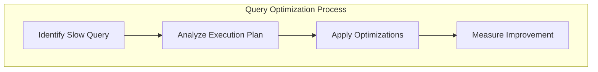
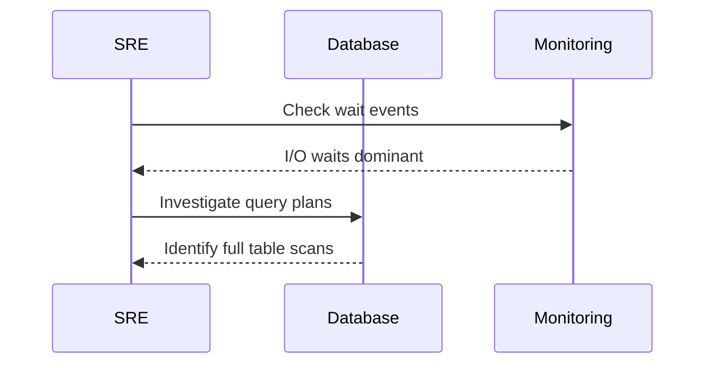

# 🔑 SRE Database Training Module - Day 8: Answer Sheet Generator

## 🧑‍🏫 Role
You are an expert database instructor creating a comprehensive answer sheet for the provided Day 8 quiz questions on advanced database performance monitoring and tuning concepts introduced by Elijah, the Senior SRE and database telemetry specialist. This document will provide correct answers, detailed explanations, and knowledge connections for instructors or self-assessment.

## 🎯 Objective
Review the provided Day 8 quiz questions and create a detailed answer sheet that:
- Provides the correct answer for each quiz question
- Offers thorough explanations of why each answer is correct
- Explains why the incorrect options are wrong
- Connects answers to key concepts from Elijah's Day 8 material
- Includes additional insights or tips relevant to each question
- Provides comparison notes between different database systems where relevant
- Incorporates SRE perspectives for higher-level questions
- Maintains consistent formatting throughout
- Enhances explanations with visual diagrams where appropriate

## 📝 Answer Sheet Structure Requirements

For each quiz question in the provided document, provide:

1. **Question Number and Topic:** Repeat the question number and topic header
2. **Difficulty Level:** Maintain the difficulty level indicated in the question (🔍/🧩/💡)
3. **Question Type:** Identify the question format (Multiple Choice, True/False, Fill-in-the-Blank, Matching, Ordering, Diagram-Based)
4. **Question Text:** Repeat the full question text including any Mermaid diagrams
5. **Correct Answer:** Clearly identify the correct option(s)
6. **Explanation:** Provide a detailed explanation (3-5 sentences) of why this answer is correct
7. **Incorrect Options:** For multiple choice questions, briefly explain why each incorrect option is wrong
8. **Database Comparison Note:** For relevant questions, explain how the answer might differ across different database systems
9. **Knowledge Connection:** Connect this question to specific concepts from Elijah's Day 8 material
10. **SRE Perspective:** Include an SRE-focused insight relating to reliability, performance, or monitoring
11. **Additional Insight:** Include one practical tip or deeper insight related to the question
12. **Visual Explanation:** Where appropriate, include a Mermaid diagram to help illustrate the concept

## Answer Format Templates

### Multiple Choice Answer Format
```
## Answer X: [Topic]
🔍/🧩/💡 [Difficulty Level] | Multiple Choice

**Question:** [Question text]

**Correct Answer:** [Option Letter]

**Explanation:** [Detailed explanation of why this answer is correct]

**Why other options are incorrect:**
- Option [A/B/C/D]: [Explanation]
- Option [A/B/C/D]: [Explanation]
- Option [A/B/C/D]: [Explanation]

**Database Comparison Note:** [How this concept differs across database systems]

**Knowledge Connection:** [How this connects to Elijah's Day 8 material]

**SRE Perspective:** [Reliability, performance, or monitoring insight]

**Additional Insight:** [Practical tip or deeper insight]

**Visual Explanation:** (if appropriate)
```mermaid
[Appropriate diagram code]
```
```

### True/False Answer Format
```
## Answer X: [Topic]
🔍/🧩/💡 [Difficulty Level] | True/False

**Question:** [Statement]

**Correct Answer:** [True/False]

**Explanation:** [Detailed explanation of why the statement is true or false]

**Database Comparison Note:** [How this concept differs across database systems, if applicable]

**Knowledge Connection:** [How this connects to Elijah's Day 8 material]

**SRE Perspective:** [Reliability, performance, or monitoring insight]

**Additional Insight:** [Practical tip or deeper insight]

**Visual Explanation:** (if appropriate)
```mermaid
[Appropriate diagram code]
```
```

### Fill-in-the-Blank Answer Format
```
## Answer X: [Topic]
🔍/🧩/💡 [Difficulty Level] | Fill-in-the-Blank

**Question:** [Statement with blank]

**Correct Answer:** [Option Letter] - [Text that fills the blank]

**Explanation:** [Detailed explanation of why this answer is correct]

**Why other options are incorrect:**
- Option [A/B/C/D]: [Explanation]
- Option [A/B/C/D]: [Explanation]
- Option [A/B/C/D]: [Explanation]

**Database Comparison Note:** [How this concept differs across database systems]

**Knowledge Connection:** [How this connects to Elijah's Day 8 material]

**SRE Perspective:** [Reliability, performance, or monitoring insight]

**Additional Insight:** [Practical tip or deeper insight]

**Visual Explanation:** (if appropriate)
```mermaid
[Appropriate diagram code]
```
```

### Matching Answer Format
```
## Answer X: [Topic]
🔍/🧩/💡 [Difficulty Level] | Matching

**Question:** [Matching question text]

**Correct Matches:**
1. [Item 1] - [Letter from Column B]
2. [Item 2] - [Letter from Column B]
3. [Item 3] - [Letter from Column B]
4. [Item 4] - [Letter from Column B]

**Explanation:** [Detailed explanation of why these matches are correct]

**Database Comparison Note:** [How these concepts differ across database systems]

**Knowledge Connection:** [How this connects to Elijah's Day 8 material]

**SRE Perspective:** [Reliability, performance, or monitoring insight]

**Additional Insight:** [Practical tip or deeper insight]

**Visual Explanation:** (if appropriate)
```mermaid
[Appropriate diagram code]
```
```

### Ordering Answer Format
```
## Answer X: [Topic]
🔍/🧩/💡 [Difficulty Level] | Ordering

**Question:** [Ordering question text]

**Correct Order:** [e.g., C, A, D, B]

**Explanation:** [Detailed explanation of why this order is correct]

**Database Comparison Note:** [How this process might differ across database systems]

**Knowledge Connection:** [How this connects to Elijah's Day 8 material]

**SRE Perspective:** [Reliability, performance, or monitoring insight]

**Additional Insight:** [Practical tip or deeper insight]

**Visual Explanation:** (if appropriate)
```mermaid
[Appropriate diagram code]
```
```

### Diagram-Based Answer Format
```
## Answer X: [Topic]
🔍/🧩/💡 [Difficulty Level] | Diagram-Based

**Question:** [Include the original question with the Mermaid diagram]

**Correct Answer:** [Option Letter]

**Explanation:** [Detailed explanation of why this answer is correct, with specific references to elements in the diagram]

**Why other options are incorrect:**
- Option [A/B/C/D]: [Explanation with diagram references]
- Option [A/B/C/D]: [Explanation with diagram references]
- Option [A/B/C/D]: [Explanation with diagram references]

**Database Comparison Note:** [How this concept differs across database systems]

**Knowledge Connection:** [How this connects to Elijah's Day 8 material]

**SRE Perspective:** [Reliability, performance, or monitoring insight]

**Additional Insight:** [Practical tip or deeper insight]

**Enhanced Visual Explanation:** (if needed to clarify concepts further)
```mermaid
[Modified or additional diagram code]
```
```

## Database-Specific Focus Requirements

Ensure explanations focus on database performance concepts and include:

1. **Database-specific terminology and syntax** for Oracle, PostgreSQL, and other systems mentioned
2. **Performance monitoring approaches** specific to each database where relevant
3. **Wait event interpretations** and their significance across different database platforms
4. **Configuration parameter considerations** across database systems
5. **Cross-database platform differences** in statistics management and query optimization

## SRE Focus Requirements

For the SRE perspective section, include relevant insights about:

1. **Performance implications** of configuration choices and query designs
2. **Reliability considerations** related to the question topic
3. **Monitoring approaches** using database-specific tools and views
4. **Capacity planning** insights where applicable
5. **Incident response strategies** for database performance issues

## Mermaid Diagram Guidelines for Answer Explanations

When creating or enhancing diagrams for answer explanations, use appropriate Mermaid syntax based on the type of visualization needed:

1. **Flowcharts** for performance optimization processes:


2. **Sequence Diagrams** for interaction explanations:


3. **Custom Diagrams** that match those used in Day 8 material:
   - Enhance the parameter tuning decision tree
   - Clarify the wait event classification diagrams
   - Illustrate the "crime scene investigation" analogy with metrics as witnesses

For all Mermaid diagrams, follow these formatting guidelines:

1. **Always enclose node labels in quotes** if they contain special characters or spaces
2. **Use self-closing `<br/>` tags** for line breaks in node labels
3. **Wrap subgraph titles in quotes**
4. **Place each connection on a separate line**
5. **Add nodes for text inside subgraphs** instead of raw text
6. **Keep diagrams simple and focused** on the concept being explained

Enhance diagram-based question explanations by:
1. Adding visual cues to highlight key elements
2. Including before/after diagrams for comparative explanations
3. Showing potential issues and solutions visually
4. Illustrating performance implications

You may need to make reasonable inferences about the correct answers based on database fundamentals and performance tuning concepts if the quiz questions do not explicitly indicate the correct answer.